# 内网渗透瑞士军刀-impacket工具解析（四）

  

  

  

**前言**

preface

前两篇我们介绍了impacket中对DCERPC协议的内容，今天我们对Windows网络中另一个应用层协议的内容进行介绍，在Windows网络中最常用的协议就是SMB协议了，SMB (Server Message Block) 是一种用于在计算机网络上共享文件、打印机和其他资源的协议。

在impacket中基于SMB协议主要实现远程文件访问及DCERPC调用两大作用，在SMBv1实现了标准的SMB认证，SMBv1和SMBv2中都实现了NTLM和Kerberos的拓展认证方式。

SMB 协议在不同的 Windows 版本中有不同的实现，如 SMBv1、SMBv2、SMBv3 等。较新的 SMB 版本提供了更高的性能、更好的安全性和更多的功能，并且能够与其他协议（如 HTTP）进行集成，以提供更强大的功能和更灵活的部署选项。

在impacket中，smb协议的底层实现主要有以下几个文件组成

smb.py

smb3.py

smb3structs.py

smbconnection.py

nmb.py

其中smb.py和smb3.py分别是SMBv1和SMBv2/v3的核心实现，SMBv1协议中，数据结构、常量和方法全都包含在smb.py一个文件当中，而SMBv2中将常量和数据结构的定义放在了smb3structs.py文件里面。

  

**SMB与NetBIOS**  

  

        NetBIOS (Network Basic Input/Output System) 是一种早期的网络通信协议，用于在计算机网络上提供基本的服务和功能。SMB (Server Message Block) 是在 NetBIOS 之上构建的一种协议，用于实现文件共享和资源访问。

  

        NetBIOS 最初是由 IBM 开发的，用于在局域网中的计算机之间进行通信。它提供了一种简单的机制，使计算机能够识别和寻址其他计算机，以及进行基本的数据交换。NetBIOS 使用 16 位的名称标识计算机和服务，并通过 NetBIOS Name Service (NBNS) 来解析和映射名称到 IP 地址。

  

        SMB 协议最初是在 NetBIOS 之上实现的，用于在计算机网络上共享文件和打印机。SMB 使用 NetBIOS 的会话服务和数据报服务来建立连接、传输数据和执行文件共享操作。它定义了一套通信规则和命令，使客户端能够访问远程服务器上的共享资源。SMB 协议逐渐发展演变，后来也支持了其他的传输协议，如 TCP/IP。

  

        因此，NetBIOS 和 SMB 之间存在密切的关系。NetBIOS 提供了网络寻址和命名标识的机制，而 SMB 则建立在 NetBIOS 之上，提供了文件共享和资源访问的功能。在早期的 Windows 系统中，SMB 协议通常与 NetBIOS 结合使用，形成了 NetBIOS over TCP/IP (NBT) 的组合，其中 SMB 通过 NetBIOS 提供的会话和数据报服务进行通信。

  

        我们可以从smb和smb3的实现里看到，两个版本的底层传输都不是基于TCP，而是基于NetBIOS传输服务。

  

        smb中，数据包通过sendSMB发送

  

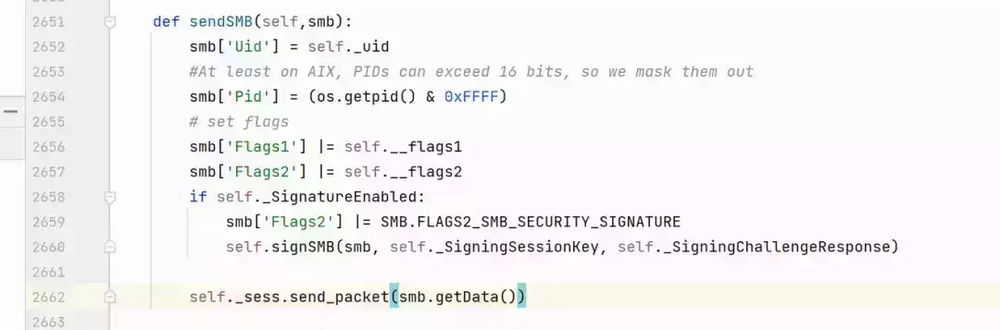

  

        在该方法中调用的是\_sess.send\_packet，而\_sess就是一个NetBIOS会话实例

  

  

        smb3中，虽然sendSMB内部实现以及会话变量命名有所不同，但是本质上也是将NetBIOS会话服务作为底层的传输协议。

  

**SMBConnection**

**与**

**SmbSession**  

  

SmbConnection 和 SmbSession 是与 SMB (Server Message Block) 协议相关的概念，在impacket中，

SmbConnection 是表示客户端与 SMB 服务器之间的连接的对象或类。它提供了建立和管理 SMB 连接的功能。通过 SmbConnection，可以指定服务器的地址和端口，建立 TCP 连接，并进行 SMB 会话的设置和管理。这个对象或类通常提供了一组方法来发送 SMB 请求、处理响应和管理连接的生命周期。

  

SmbSession 是表示客户端与 SMB 服务器之间的会话的对象或类。会话是在 SMB 连接之上建立的，并用于在客户端和服务器之间进行身份验证、资源访问和数据传输。SmbSession 提供了管理 SMB 会话的功能，包括身份验证、会话参数的设置和管理、发送请求和处理响应等。它通常作为 SmbConnection 对象的一部分或与其紧密相关。

  

在 impacket 中，使用 SMBConnection 类来表示 SMB 连接，使用Session成员变量来表示 SMB 会话。

  

通过使用 SmbConnection，可以编写代码来建立与 SMB 服务器的连接，并进行身份验证、访问共享资源以及执行其他与 SMB 协议相关的操作。这使您能够在应用程序中集成对 SMB 服务器的访问和操作。

  

**01**

**Smbconnection**  

        通常情况下，使用impacket进行smb连接并不会直接使用smb和smb3这两个包文件里面的类，而是会用到smbconnection.py中的SMBConnection类，这个类的主要作用是对SMBv1/SMBv2/v3三个版本进行了一个包装，并且在类里面实现了自动协商以及一些常用的功能。

**初始化SMB连接**  

        由于impacket中都是使用smbconnection.py中的SMBConnection类来进行初始化连接，所以我们可以以这个类为起点进行分析，首先是初始化函数，

  

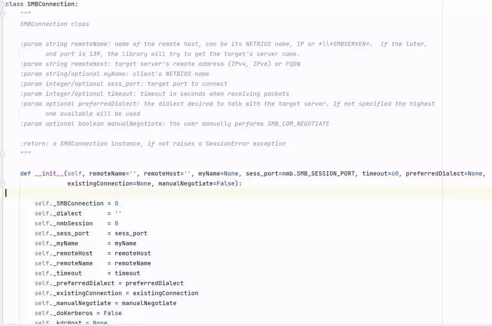

  

        初始化函数中参数中和目标相关的有两个remoteName和remoteHost，并且这里如果没有填写remoteName就会报错。

  

  

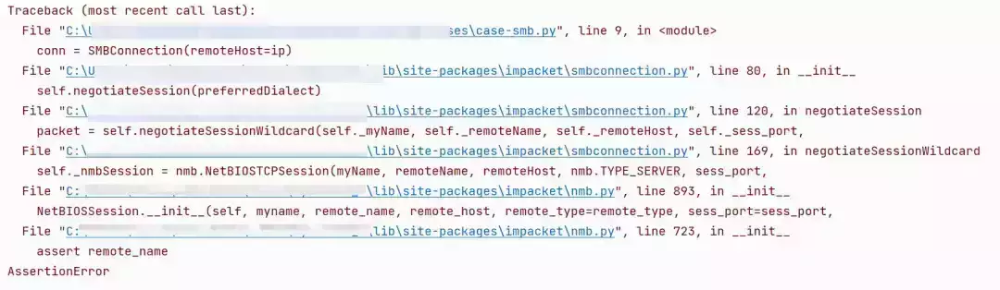

  

        可能我们会有疑问，只要知道目标的ip地址不就可以连接了吗，为什么还有填写目标名称，这里其实是对NetBIOS协议的兼容，因为NetBIOS网络中计算机之间使用计算机名通过NetBIOS Name Service (NBNS)协议就可以解析到IP，进行通信。

**SMB版本与协商**  

初始化函数中还实现了smb协商，在 SMB协议中，SMB 版本的协商是客户端和服务器之间确定使用的 SMB 版本的过程。协商发生在建立 SMB 连接的初始阶段，确保客户端和服务器使用兼容的 SMB 版本进行通信。

  

        **协商的过程如下：**

  

-   客户端发送 SMB 请求：客户端向服务器发送 SMB 连接请求，并在请求中包含它支持的 SMB 版本列表。该列表按优先级排序，将最新和最高版本的 SMB 放在前面。
    
      
    
-   服务器选择 SMB 版本：服务器收到客户端的连接请求后，会检查客户端支持的 SMB 版本列表，并选择服务器支持的最高版本的 SMB。服务器选择一个与客户端支持列表中的版本最匹配的版本。
    
      
    
-   协商 SMB 版本：服务器选择了一个 SMB 版本后，会将该版本作为响应发送回客户端。如果服务器选择的版本与客户端支持的版本列表中的任何一个版本匹配，协商成功，客户端和服务器都会使用该版本进行后续的通信。
    
      
    
-   客户端和服务器使用协商的 SMB 版本：一旦 SMB 版本协商成功，客户端和服务器之间的后续通信将使用协商的 SMB 版本。他们将遵循该版本的语法、功能和行为规则进行数据交换、文件共享和其他操作。
    

  

  SMB 版本的协商过程确保客户端和服务器都使用兼容的 SMB 版本，以便实现最佳的通信和功能兼容性。如果客户端和服务器之间的 SMB 版本不匹配，连接可能会失败或无法正常工作。因此，SMB 协议的实现通常会考虑兼容性，并支持多个版本以满足不同客户端和服务器的需求。

  

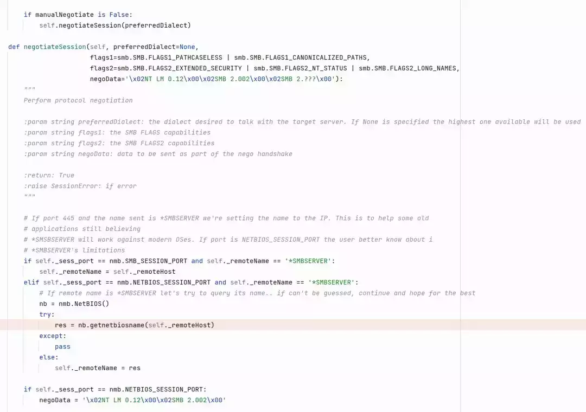

  

从代码中可以看到，默认情况下手动协商是False，所以会进行调用negotiateSession方法进行自动协商，在negotiateSession又会调用negotiateSessionWildcard，这里是真正的协商函数。

  

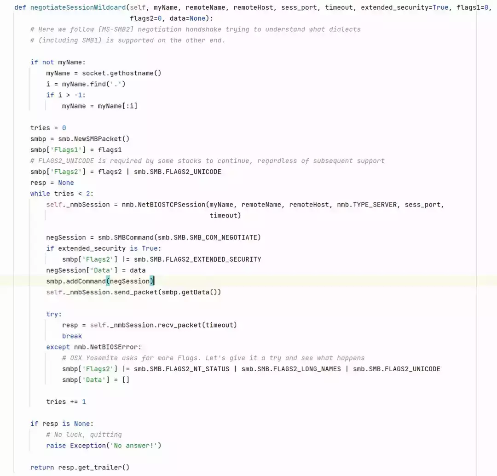

  

在这里首先会建立一个NetBIOS连接，然后通过NetBIOS会话发送一个SMBv1的协商包，再返回negotiateSession函数

  

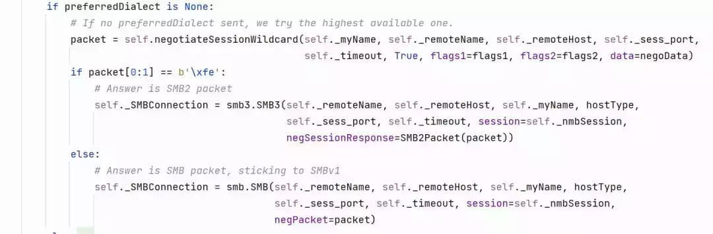

  

根据返回包的第一个字节来判断服务端返回的smb版本并且调用对应版本的类来初始化对应版本的Smb连接。

  

**SMB认证**  

  

  在上一步中通过我们可以知道在impacket中，通过指定服务器名称和IP后与服务端建立NetBIOS连接之后，通过协商确定使用的SMB协议版本，此时已经建立了SMBConnection，但是还没有建立SMBSession，需要通过认证来建立一个Session，SMB服务支持NTLM和Kerberos两种认证方式。

  

**01**

**NTLM认证**

smb与smb3中NTLM登录函数名称都是login，不同的是smb中多了一个NTLMFallback参数，当这个参数为True时，使用SMBv1登录时首先会尝试NTLMv2认证，如果失败会再尝试回滚到NTLMv1再次发起认证，SMBv2和smbv3都不支持NTLMv1.

  

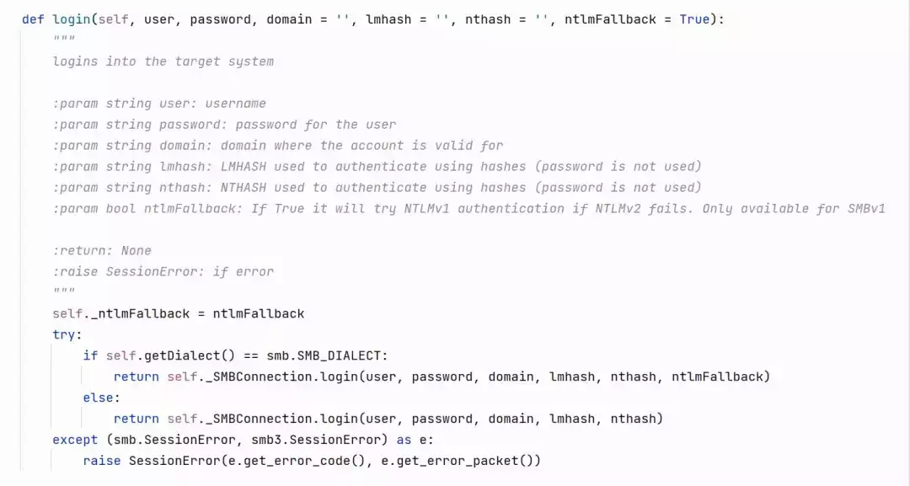

  

  在比较老的SMBv1协议中，ntlm登录使用的是“标准登录”，在这种登录方式中，ntlm challenge通过协商时的响应包传递给客户端，客户端再生成ntlm response，再在SessionSetup过程中将ntlm response直接放在SMB的AnsiPwd和UnicodePwd字段中。

  

  

这种方式的缺点就是难以对认证方式进行拓展，所以在后来的smb和SMBv2及smbv3中都使用了SPNEGO，通过SPNEGO结构将不同类型的认证数据进行包装，从而实现灵活的拓展。在这种情况下认证数据都放在SessionSetup数据包的SecurityBuffer字段中。

  

  

  

**02**

**Kerberos认证**  

smb和smb3中Kerberos登录的实现方式基本都相同，从参数可以看到用户可以提供密码、hash、TGT、TGS作为认证凭据，这一点和kerberos协议中实现的getKerberosTGT类似。

  

  

在没有提供TGT及TGS的情况下首先会使用getKerberosTGT来获取一个TGT、再利用TGT获取目标服务的CIFS票据，这里使用的SPN是目标服务器的机器名，如果是IP的话，KDC就会找不到这个SPN。

  

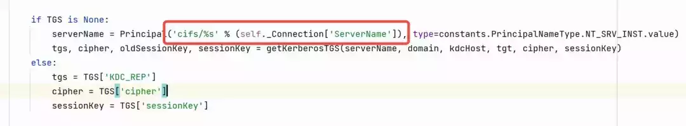

  

获取到TGS之后并不是直接将TGS的票据发送到目标服务，而是先构造一个AP\_REQ，再使用SPNEGO进行包装

  

  

  

  

**03**

**加密与签名**

SMBv1及SMBv2都只支持签名、smbv3则支持数据包加密，我们可以看一下签名和加密对应的方法。SMBv1位于SMB.signSMB方法，这个方法使用的签名方式是md5，密钥是signingSessionKey

  

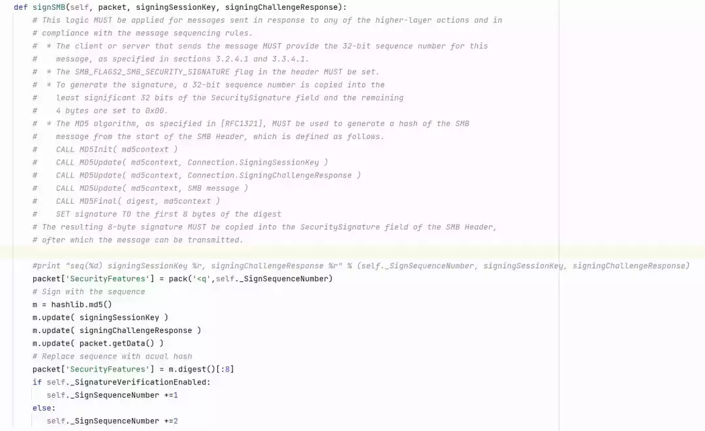

  

再看一下调用位置

  

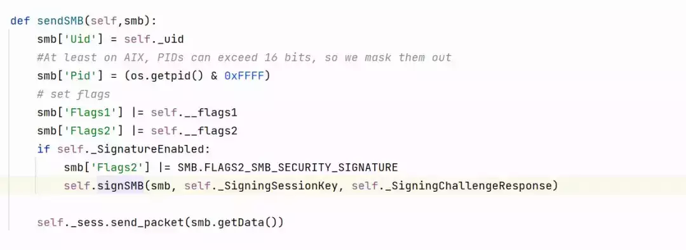

  

可以发现实际使用的是内部变量SigningSessionKey，通过查找这个变量的初始化位置，发现在ntlm登录和kerberos登录处对该变量进行了初始化

  

  

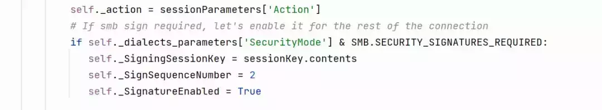

  

在ntlm认证会话中，使用的签名密钥是生成Type3消息返回的exportedSessionKey，而在Kerberos登录会话中则是使用TGS\_REP中的sessionkey。

  

在smb3中，签名还是使用sessionKey，但是签名算法有所不同

  

  

SMBv2使用的是hmac，sha256算法生成的hash前16字节，而smbv3则使用的是AES-GMAC算法。

  

加密的逻辑在SMB3.sendSMB方法中，加密方式为AES128\_CCM

  

  

加密使用的密钥也是在登陆时进行初始化

  

ntlm登录初始化加密密钥

  

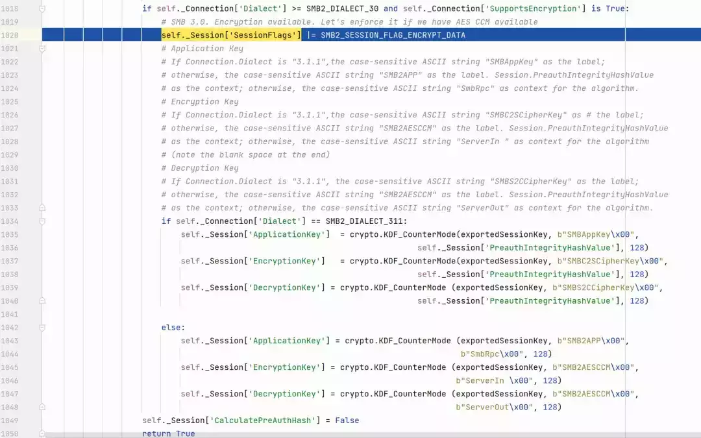

  

Kerberos登录初始化加密密钥

  

  

  

**TreeConnect与共享**  

  

在经过认证后客户端和服务端便建立了会话（Session），Tree Connect 是协议中的下一个步骤，用于在客户端和服务器之间建立一个树连接，以便客户端可以访问服务器上的共享资源。

  

在 SMB 协议中，Tree Connect 是在建立会话（Session）之后进行的。下面是 Tree Connect 的一般过程：

  

1.  会话建立：首先，客户端需要和服务器建立一个 SMB 会话。在建立会话之前，客户端通常需要进行身份验证，提供有效的凭据来证明其身份。  
    
2.  Tree Connect 请求：一旦会话建立，客户端可以向服务器发送 Tree Connect 请求。该请求包含要访问的共享资源的路径和其他相关参数。  
    
3.  服务器响应：服务器收到 Tree Connect 请求后，会验证客户端的请求和权限。如果客户端具有足够的权限来访问共享资源，服务器将返回一个成功响应，并为客户端分配一个 Tree ID（树标识符），用于标识该树连接。  
    
4.  树连接建立：一旦服务器发送了成功响应，客户端和服务器之间的树连接就建立起来了。客户端可以使用该树连接来访问共享资源，如文件和文件夹。树连接的建立意味着客户端在服务器上建立了一个文件系统的视图，可以在该视图中进行文件和目录的操作。  
    
5.  访问共享资源：通过建立的树连接，客户端可以使用 SMB 协议访问服务器上的共享资源。客户端可以发送读取、写入、创建、删除等操作的请求，并通过树连接与服务器进行通信。  
    

  

Tree Connect 是 SMB 协议中的一个重要步骤，它允许客户端与服务器建立起有效的树连接，并在该连接上进行文件共享和资源访问。通过 Tree Connect，客户端可以轻松地浏览、操作和传输服务器上的共享文件和打印机等资源。

  

从SMBConnection.connectTree方法来看，smb和smb3调用的方法都是connect\_tree

  

  

实际上在smb.py中方法使用的都是下划线命名，而在smb3中方法使用的是驼峰命名法，为了向前兼容，在smb3中都给方法加了一个别名

  

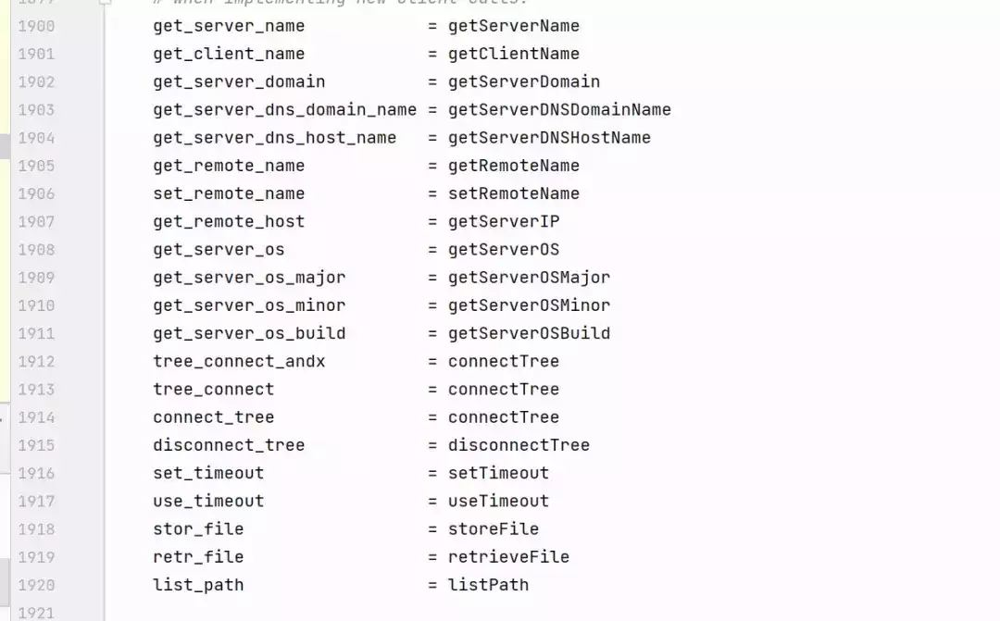

  

connectTree方法底层实际上是发送SMB2\_TREE\_CONNECT的数据包，该数据包的ShareName方法接受的是UNC路径，我们可以看到这里对共享名称进行了转换。

  

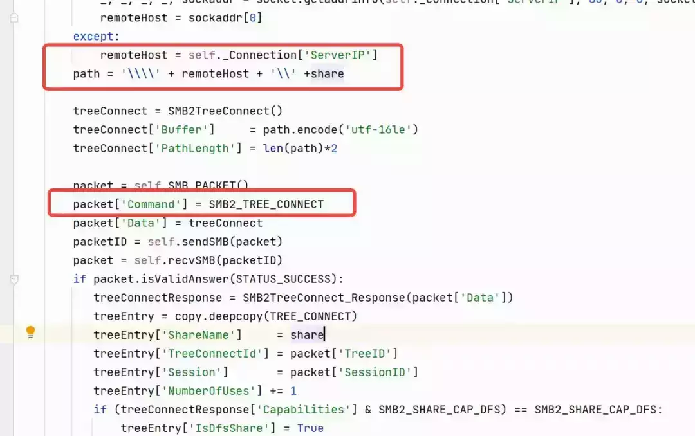

  

  

**文件读取**  

  

我们可以从一个简单的文件读取函数来了解smb文件读取的过程，SMBConnection.getFile方法可以实现从smb服务端来读取文件，这里个方法涉及多个SMB数据包交换，首先看参数，参数中包含

shareName 共享名称、path 文件路径、callback 文件内容回调函数、mode 文件访问模式、offset 偏移、password 未使用的参数、shareAccessMode 共享访问模式。

  

  

首先通过connectTree来连接共享，比如需要读取C盘，那么shareName默认就是C#

  

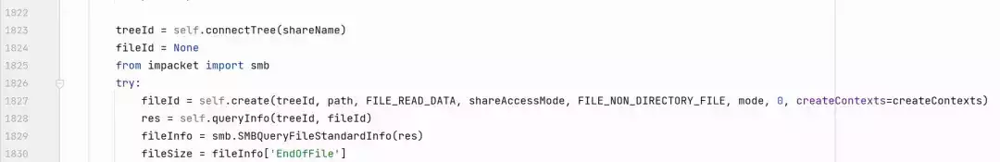

  

连接到共享之后调用create函数，create函数底层发送的是SMB2\_CREATE数据包，SMB2\_CREATE不仅是用于创建文件，也可以用于访问文件。

  

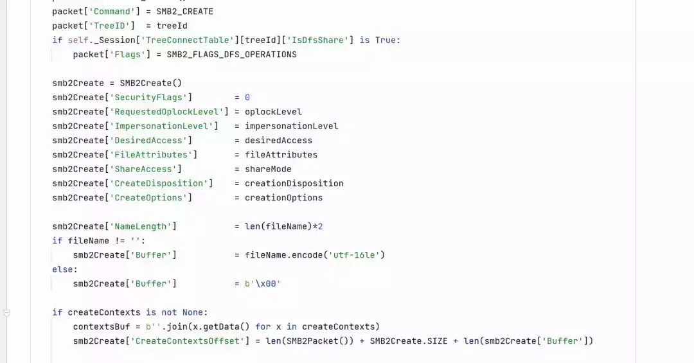

  

这一步的目的主要是用于获取文件句柄（fileId）

  

  

在获取了fileId之后的操作是通过SMB2\_QUERY\_INFO命令来获取文件的大小，根据协商确定的最大传输大小来确定是否进行分片传输。

  

使用一个简单的示例并抓包很清楚的看到整个过程。

  

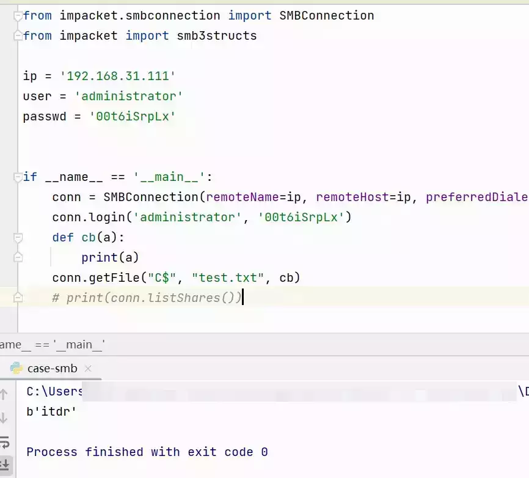

  

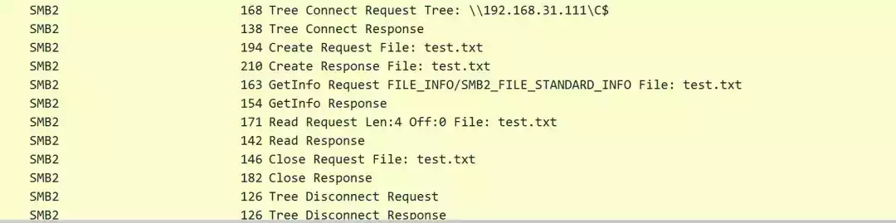

  

  

**SMB与RPC传输**  

  

Windows操作系统中，我们执行net share命令查看系统共享，可以发现除了文件夹和磁盘共享外，还存在一个存在一个没有对应文件的特殊共享叫做IPC$，这个共享就是用于进行进程间通信（Inter-Process Communication，IPC）。IPC$ 共享允许客户端与服务器之间进行命名管道和RPC（Remote Procedure Call）通信。通过 IPC$ 共享，客户端可以与服务器上的特定进程进行通信，实现例如访问服务、访问注册表或调用远程方法等功能。需要注意的是，IPC$ 共享是 SMB 协议的一部分，而不是文件系统的一部分,它提供了一种机制，使客户端能够与服务器上的进程进行通信，而不是直接访问文件或目录。

  

impacket中RPC的SMB传输方式就利用到了这种机制，我们在来回顾RPC的SMB传输实现。

  

  

在认证之后建立SMB会话之后实现连接到IPC$共享，再调用openFile打开了文件，这里的filename参数实际就是初始化传输时的命名管道。

  

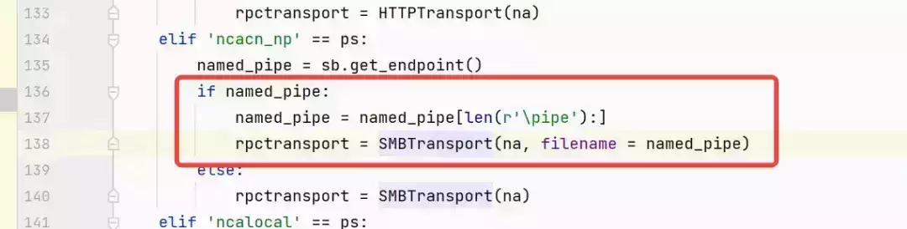

  

openFile与文件读取相同，也是使用create，只不过设置的默认参数不同。

  

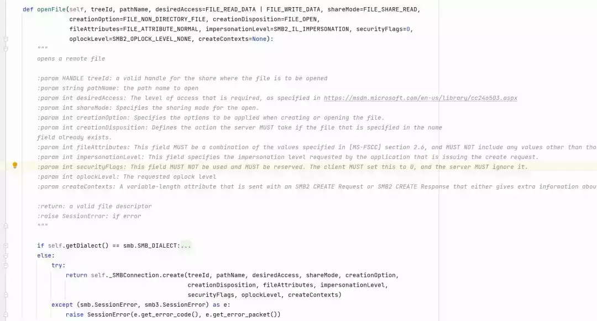

  

打开对应的命名管道之后，通过对命名管道的读写就实现了RPC数据的传输。

  

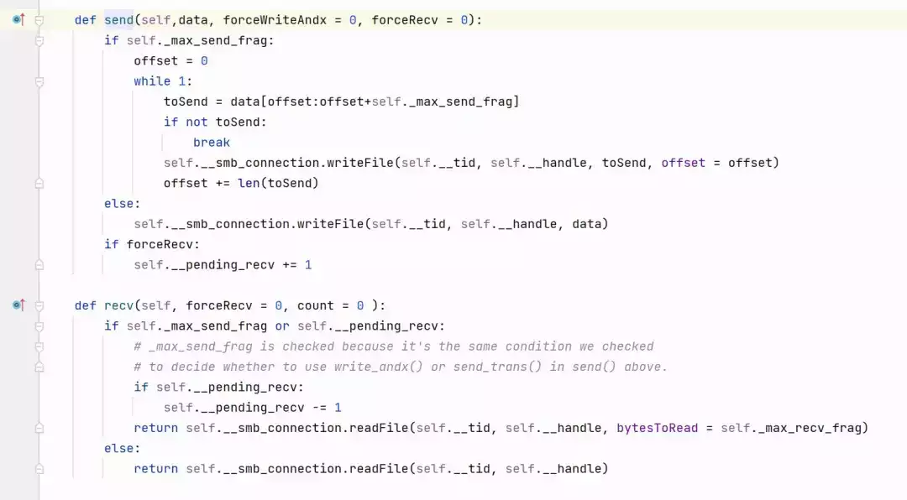

  

在Windows操作系统中利用RPC向外暴露了大量的应用服务，利用RPC在Windows网络中可以实现远程管理、计划任务、日志读取等应用。与此同时，安全研究员也在对Windows RPC的研究中发现了多处严重漏洞，从攻击者的视角来说，攻击者也在尝试从正常的RPC功能中挖掘针对Windows的新型攻击手法，在这一过程中产生了大量基于impacket的内网渗透工具，在后续的impacket系列文章中，我们将结合具体的攻击场景及工具源码对impacket中存在的工具进行分析讲解。

  

  

  

  

