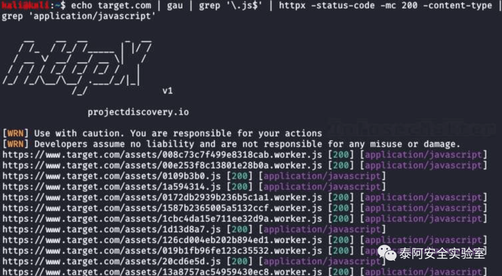
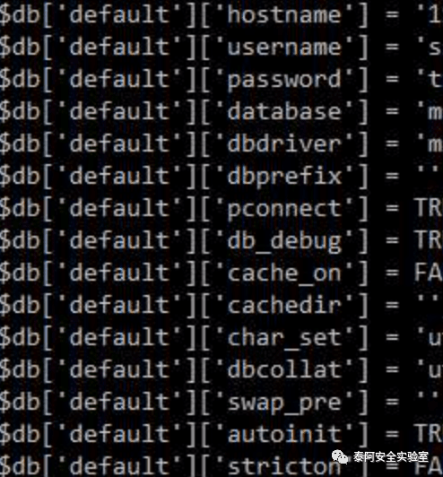
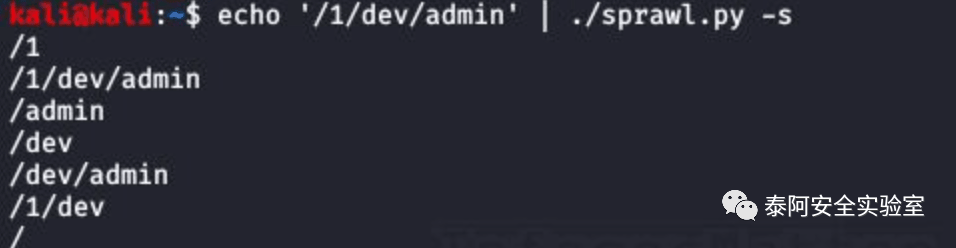
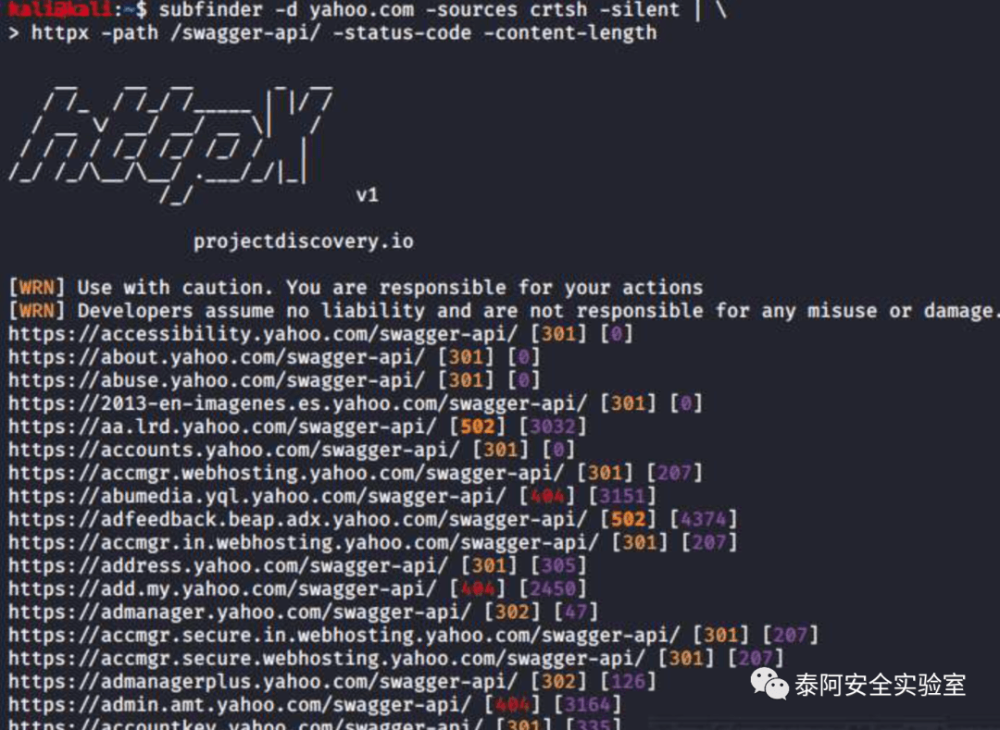
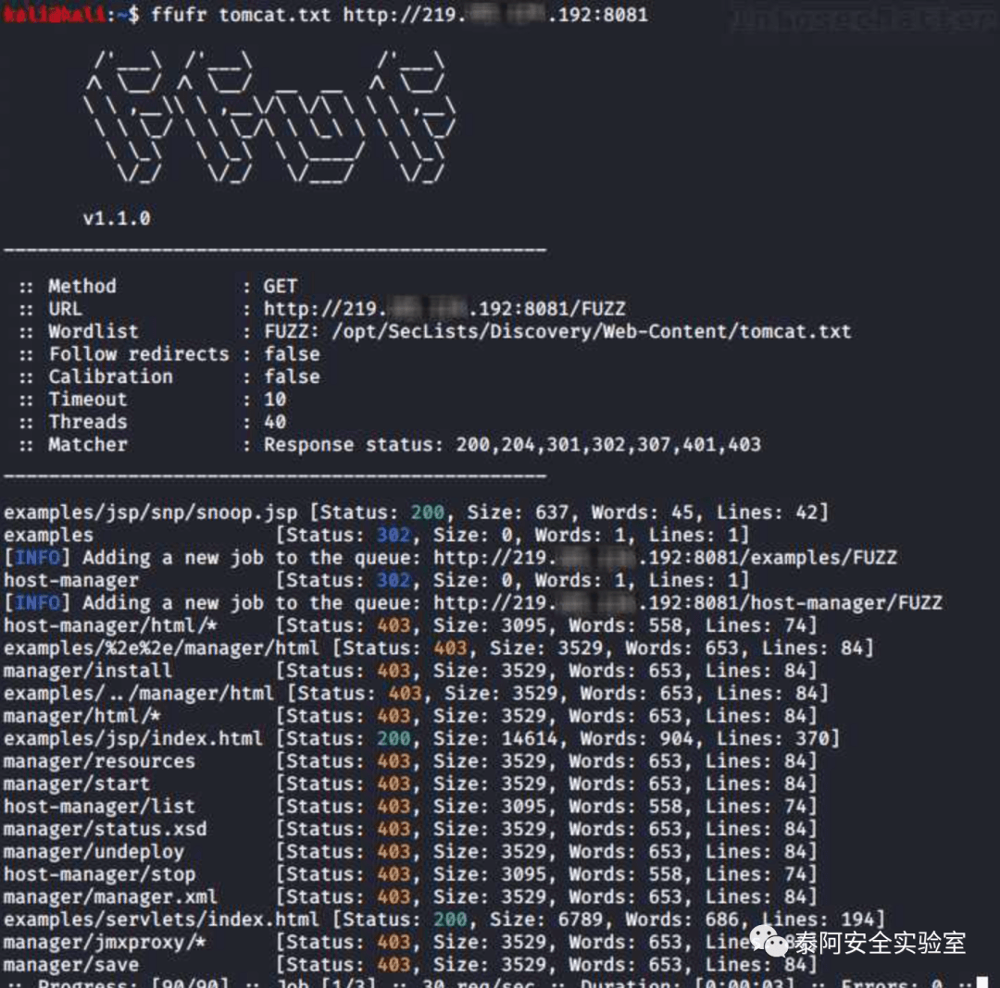
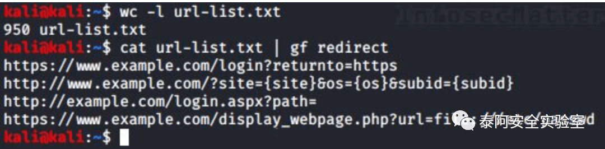
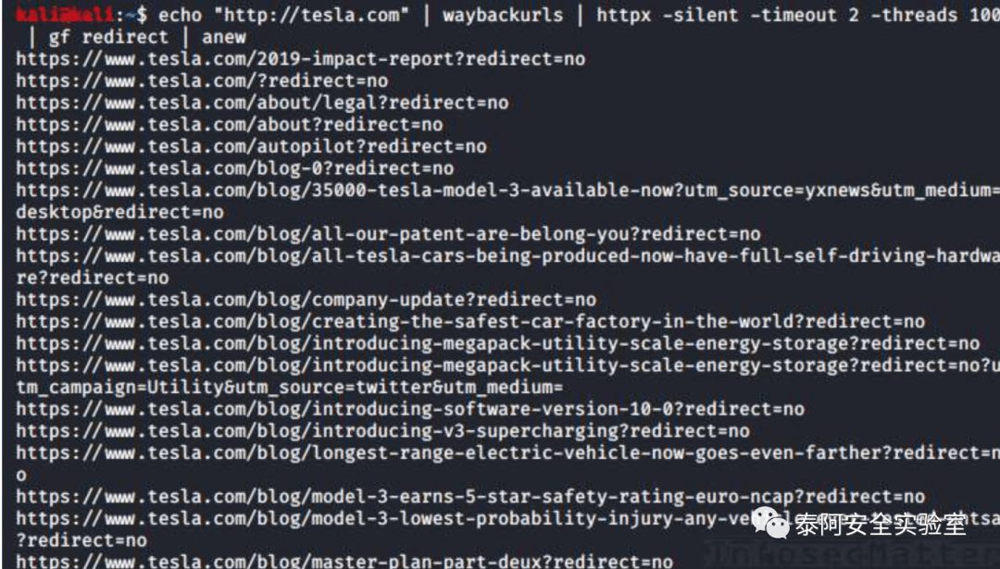
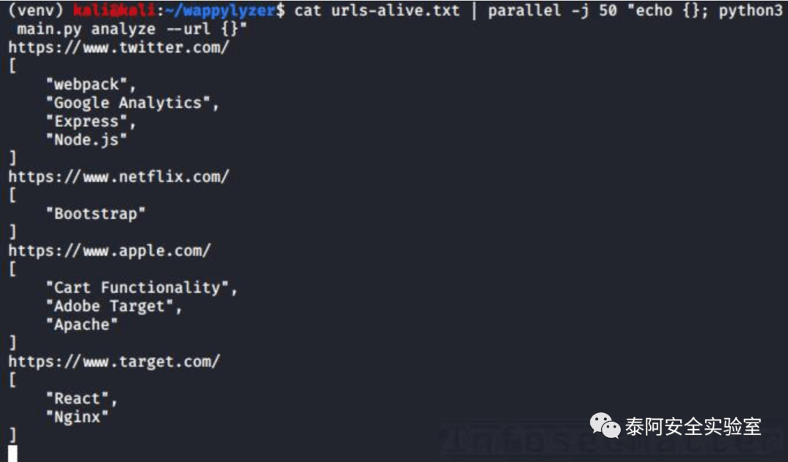
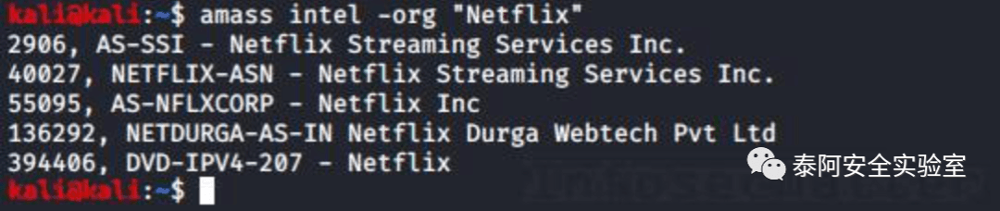
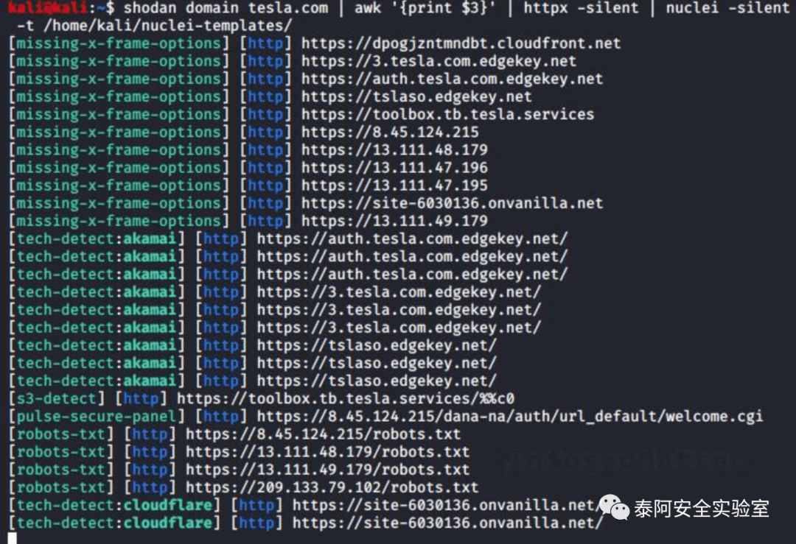

# 刷 SRC 自动化赏金技巧第二部分

## 👑 Taie-Bugbounty-killer 是什么意思？👑

主要目标是分享一些更快速的刷 SRC 赏金的自动化挖洞技巧命令和工具协同。使用里面的方法，我们能够快速批量找到可以被利用的子域、api 令牌和其它敏感漏洞。

## 摘要

继公众号的上一篇文章刷 SRC 自动化赏金技巧第一部分的第二部分来了。希望这个系列可以给你们提供一些不一样的挖洞思路技巧。

大家也可以关注泰阿安全实验室的官方 Github:https://github.com/taielab

后续一些新的开源会 Github 发布的快一点。后续也会建立交流群目前在考虑中是选用国外的安全去中心化的还是国内的即时通讯软件，大家可以后台私信给点建议。

文章设置了赞赏功能有能力的赞赏一下帮助支持作者走的更远，

因为所有东西都是作者一个人独自去做所以压力很大，今年还有贺岁档的泰阿红队单兵系统 3.0 的 Linux 版本和 Windows 版本会出现。

Windows 版本作者可能会基于国外的一款进行二次优化修改以虚拟机方式进行出现，目标达到出去干活只需要带一个虚拟机即可梭哈程度。

谢谢大家，敬请期待！

## 35\. 价格操纵方法

By @lutfumertceylan\[1\], @y\_sodha\[2\], @SalahHasoneh1\[3\] Source: link1\[4\], link2\[5\], link3\[6\]

1.

这里不是 1 个，而是 3 个关于如何在网络应用中用价格进行操作的技巧。

方法 1:

• 如果产品价格参数不能改变，就改变产品的数量。

•items \[1\]\[数量\]=1 -> 234 欧元 •items \[1\]\[数量\]=0.1 -> 23.4 欧元

• 恭喜你，你以 10% 的价格买到了订单！

  

方法二

1. 在篮子里添加 2 个产品 -- 我们考虑单个产品是 40 元。2. 如果以这种方式处理请求。 {"物品":{"笔记本":1, "手机":1}}。3. 将 JSON 体改为 {"物品":{"笔记本":4, "手机":-2}}。4. 费用将变成 20 元，2 项。4 \* $40 – 2 \* $70 = $160 – $140 = $20

方法三：

1. 选择任何要购买的项目 2. 选择 PayPal 作为支付方式，拦截所有请求。3. 直到你从 PayPal 得到一个名为 "amount" 的参数。4. 用价格进行操作，将其改为 0.01 元。5. 支付，等待确认

## 36\. 使用 gau 和 httpx 查找 javascript 文件

By @pdnuclei\[7\] Source: link\[8\]

这里有一个侦察技巧，使用 gau\[9\] 和 httpx\[10\] 实用程序找到我们目标上托管的 javascript 文件。

```bash
echo target.com | gau | grep '\.js$' | httpx -status-code -mc 200 -content-type | grep 'application/javascript'
```

这个组合要做的是，它将从 AlienVault 的 Open Threat Exchange\[11\](OTX)、Wayback Machine\[12\] 和 Common Crawl\[13\] 中收集我们目标的所有已知 URL，使用 httpx 获取它们，然后只显示 javascript 文件。



为了使这个组合工作，我们必须安装以下工具：  

•https://github.com/projectdiscovery/httpx•https://github.com/lc/gau

## 37\. 从 javascript 文件中提取 API 端点

By @renniepak\[14\] Source: link\[15\]

这里有一个从 javascript 文件中提取 API 端点的快速单行命令。

```bash
cat file.js | grep -aoP "(?<=(\"|\'|\`))\/[a-zA-Z0-9_?&=\/\-\#\.]*(?=(\"|\'|\`))" | sort -u
```


非常效率  

## 38\. 文件上传错误的方便扩展列表

By @pwntheweb\[16\] Source: link\[17\]

当我们试图寻找文件上传功能中的漏洞时，以下文件扩展名列表可能会很有用。

ASP:

•.aspx•.config•.ashx•.asmx•.aspq•.axd•.cshtm•.cshtml•.rem•.soap•.vbhtm•.vbhtml•.asa•.asp•.cer•.shtml

PHP:

•.php•.php5•.php3•.php2•.shtml•.html•.php.png (double extension attack)

我们通常想要实现的是规避限制可以上传到网站的内容类型的控制，并尝试上传一些有趣的内容，比如。

•ASP / PHP file with a webshell – RCE•HTML file with Javascript code – XSS•EICAR file – test possibility of hosting malware

提示：不要忘了也要经常尝试 NULL 字节注入的技巧，例如。

•file.jpg%00shell.php•shell.php%00file.jpg•shell.php%00.jpg

## 39\. 通过篡改 URI 访问管理面板。

By @SalahHasoneh1\[18\] Source: link\[19\]

这里有一个超级简单的技巧，通过以下方式篡改 URI 来访问管理面板。

•https://target.com/admin/ –> HTTP 302 (重定向到登录页面)•https://target.com/admin..;/ –> HTTP 200 OK

也可以试试下面的小技巧。

•https://target.com/../admin•https://target.com/whatever/..;/admin

## 40\. 通过篡改 URI 禁止绕过 403。

By @remonsec\[20\] Source: link\[21\]

这个小技巧与前一个非常相似。通过篡改 URI，我们或许可以绕过应用程序的访问控制。

•site.com/secret –> HTTP 403 Forbidden•site.com/secret/ –> HTTP 200 OK•site.com/secret/. –> HTTP 200 OK•site.com//secret// –> HTTP 200 OK•site.com/./secret/.. –> HTTP 200 OK

虽然难得一见，但也不失为一种尝试。

## 41\. 在 SVN 仓库中寻找数据库的秘密。

By @faizalabroni\[22\] Source: link\[23\]

以下是 @faizalabroni\[24\] 是如何在 SVN 仓库中发现数据库秘密并收集 bug 赏金的。

1.Run `./dirsearch.py -u target -e php,html,js,xml -x 500,403`2. 发现 http://url.com/.svn/3. 克隆 & 使用 SVN-Extractor\[25\]4. 运行 `./svn-extractor.py --url http://url.com --match database.php`5. 结果在输出目录下，只要打开它



当场起飞！  

下面是我们需要的工具清单。

•https://github.com/maurosoria/dirsearch•https://github.com/anantshri/svn-extractor

## 42\. 从 URI 生成内容发现词表

By @healthyoutlet\[26\] Source: link\[27\]

有一个很有用的工具叫 sprawl\[28\]，用来扩展 URI 路径列表，比如从 waybackurls\[29\] 或 gau\[30\]，并生成一个内容发现词表。下面是如何使用它。

```bash
echo '/1/dev/admin' | python3 sprawl/sprawl.py -s
```



现在，我们可以使用这个词表来发现我们的目标上托管的其他端点。  

这个工具就在这里。

•https://github.com/tehryanx/sprawl

## 43\. 从 APK 文件中提取端点

By @SalahHasoneh1\[31\] Source: link\[32\]

另一个有用的分析 Android APK 文件的工具是由 @delphit33\[33\] 制作的 apkurlgrep\[34\]。这个工具可以从 APK 文件中提取 URL，甚至不需要先解压。

```bash
apkurlgrep -a path/to/file.apk
```

从这里获取工具

•https://github.com/ndelphit/apkurlgrep

## 44\. 找到更多子域的收集技巧（shodan）。

By @krizzsk\[35\] Source: link\[36\]

大公司往往会使用自己的 CDN（内容分发网络），有些 CDN 是用来服务内部静态文件的，比如 javascript 文件。

利用以下步骤，我们可以通过 shodan\[37\] 搜索引擎找到更多的内部子域和多汁的 javascript 文件。

1.

对 CDN 域名进行被动或主动枚举，如 **bigcompanycdn.com**。

2.

不管找到了什么子域名，都要用 "**http.html**" 过滤器在 shodan 上进行搜索。

3.

例子： 你发现 dev-int.bigcompanycdn.com。

shodan 查询的结果是这样的

  

•http.html:”dev-int.bigcompanycdn.com”•http.html:”https://dev-int-bigcompanycdn.com”

## 45\. 查找 javascript 文件中隐藏的 GET 参数

By @chiraggupta8769\[38\] (@intigriti\[39\], @sratarun\[40\]) Source: link\[41\]

这里有一个有趣的小技巧，通过分析 javascript 文件来寻找隐藏参数。

1. 搜集 javascript 文件中的变量名，例如：1: `var test = "xxx"`。2. 尝试将每一个都作为 GET 参数，以发现隐藏的参数，例如：。https://example.com/?test="xsstest

这往往会导致 XSS!

原来，@sratarun\[42\] 做了这个复杂的单行代码生成器，它可以找到所有的变量名，并将其作为参数追加。

```bash
assetfinder example.com | gau | egrep -v '(.css|.png|.jpeg|.jpg|.svg|.gif|.wolf)' | while read url; do vars=$(curl -s $url | grep -Eo "var [a-zA-Z0-9]+" | sed -e 's,'var','"$url"?',g' -e 's/ //g' | grep -v '.js' | sed 's/.*/&=xss/g'); echo -e "\e[1;33m$url\n\e[1;32m$vars"; done
```


  

现在，我们可以测试所有这些 URL，并检查我们是否可以用它们触发 XSS 或类似的东西。  

从这里获取本技巧的所有工具。

•https://github.com/tomnomnom/assetfinder•https://github.com/lc/gau

## 46\. 通过 GitHub dorks 收集敏感信息

By @D0cK3rG33k\[43\] Source: link\[44\]

这是 10 个有用的 GitHub dorks 列表，可以使用文件扩展名识别敏感信息。

1.extension:pem private2.extension:ppk private3.extension:sql mysql dump password4.extension:json api.forecast.io5.extension:json mongolab.com6.extension:yaml mongolab.com7.extension:ica \[WFClient\] Password=8.extension:avastlic “support.avast.com”9.extension:js jsforce conn.login10.extension:json googleusercontent client\_secret

通过这些 GitHub dorks，我们可以识别诸如证书私钥、puttygen 私钥、带有密码的 MySQL 转储、API 密钥和秘密、json 或 yaml 配置中的 MongoDB 凭证、访问 Google API 的 OAuth 凭证以及类似的敏感数据。

提示：也可以查看以下 GitHub 的 dorks 库，其维护者是 @techgaun\[45\]:

•https://github.com/techgaun/github-dorks

## 47\. 通过添加 X- HTTP 头文件绕过速率限制。

By @Cyb3rs3curi\_ty\[46\] Source: link\[47\]

这里有一个小窍门，可以绕过速率限制的负载均衡器，代理和 WAF，在我们的目标途中的某个地方之间。

在你的请求中添加以下 HTTP 头。

•X-Originating-IP: IP•X-Forwarded-For: IP•X-Remote-IP: IP•X-Remote-Addr: IP•X-Client-IP: IP•X-Host: IP•X-Forwared-Host: IP

这些头信息通常被负载均衡器或代理服务器等中间组件使用，通过在这些 HTTP 头信息中添加任意的内部 IP 地址，我们实际上可能会绕过强制的速率限制。

用以下范围的 IP 地址试试。

•192.168.0.0/16•172.16.0.0/12•127.0.0.0/8•10.0.0.0/8

一旦我们再次遇到堵塞，只需增加提供的 IP 地址即可。

这个小技巧可能不一定有效，但当事情变得困难时，绝对值得一试。

## 48\. Top 25 服务器端请求伪造（SSRF）参数

By @trbughunters\[48\] Source: link\[49\]

以下是可能存在服务器端请求伪造（SSRF）漏洞的 25 大参数。

```bash
?dest={target}
?redirect={target}
?uri={target}
?path={target}
?continue={target}
?url={target}
?window={target}
?next={target}
?data={target}
?reference={target}
?site={target}
?html={target}
?val={target}
?validate={target}
?domain={target}
?callback={target}
?return={target}
?page={target}
?feed={target}
?host={target}
?port={target}
?to={target}
?out={target}
?view={target}
?dir={target}
```

下次在 URL 中遇到这样的参数时，要引起注意，因为 SSRF 是一个关键的漏洞，可能会让你。

• 在远程服务器的环回接口上访问服务。• 扫描内部网络并与内部服务进行潜在的交互。• 使用 file:// 协议处理程序读取服务器上的本地文件。• 横向移动 / 转入内部环境。

## 49\. 敏感数据泄漏使用.json

By @SalahHasoneh1\[50\] Source: link\[51\]

这里有一个使用.json 扩展名实现敏感数据泄露的技巧。

•

Request: `GET /ResetPassword HTTP/1.1{"email":"victim@example.com"}`

Response: `HTTP/1.1 200 OK`

  

现在让我们试试这个。

•

Request: `GET /ResetPassword.json HTTP/1.1{"email":"victim@example.com"}`

Response: `HTTP/1.1 200 OK{"success":"true","token":"596a96-cc7bf-9108c-d896f-33c44a-edc8a"}`

  

请注意在我们的请求中添加了.json 扩展名，从而获得了秘密令牌！

## 50\. 使用 httpx 实现 HTTP 自动化

By @pdnuclei\[52\] Source: link\[53\]

你知道吗，你可以使用 https\[54\] 工具来请求任何 URL 路径，并且可以随时查看状态码和长度以及其他细节，进行过滤，甚至对它们进行精确匹配。

这里有一个例子。

```bash
cat domains.txt | httpx -path /swagger-api/ -status-code -content-length
```



非常有用，从这里获取最新版本。  

•https://github.com/projectdiscovery/httpx/releases

## 51\. 使用 Shodan dorks 信息收集

By @manas\_hunter\[55\] Source: link\[56\]

下面就为大家盘点 7 个厉害的 SHODAN\[57\] dorks，让大家轻松信息收集。

1.“default password” org:orgName2.“230 login successful” port:21 org:orgName3.vsftpd 2.3.4 port:21 org:orgName4.230 ‘anonymous@’ login ok org:orgName5.guest login ok org:orgName6.country:EU port 21 -530 +230 org:orgName7.country:IN port:80 title:protected org:orgName

通过这些 Shodan dorks，我们正在寻找与 FTP 相关的访问凭证和凭证，也许是在网上或其他地方暴露的日志文件中，也可能是目标组织相关的管理控制台等受保护区域。

## 52\. 如何发现认证绕过漏洞

By @jae\_hak99\[58\] Source: link\[59\]

这是一个有趣的提示，可以帮助你找到认证绕过漏洞。

•

Request: `GET /delete?user=test HTTP/1.1`

Response: `HTTP/1.1 401 Unauthorized`

  

现在让我们试试这个。

•

Request: `GET /delete?user=test HTTP/1.1X-Custom-IP-Authorization: 127.0.0.1`

Response: `HTTP/1.1 302 Found`

  

当前端使用添加的自定义 HTTP 头 (X-Custom-IP-Authorization) 时，这可能会起作用 -- 例如，当它被用来识别通过负载均衡器连接到 Web 服务器的客户端的原始 IP 地址时。

通过识别自己是 127.0.0.1，我们可能会规避 Web 应用程序的访问控制，并执行特权操作。

## 53\. 简单的 ffuf bash 单行命令

By @naglinagli\[60\] Source: link\[61\]

这里有一个由 @naglinagli\[62\] 制作的有用的 bash 函数单行本，可以解决你所有的目录搜索需求。只需将其添加到你的～/.bashrc:

```bash
ffufr() {
  ffuf -c -w "/path/to/SecLists/Discovery/Web-Content/$1" -u "$2/FUZZ" -recursion
}
```

同时确保你有最新的 https://github.com/danielmiessler/SecLists，并在上面的函数中使用正确的路径。

现在你可以像这样轻松地对你的目标域进行递归目录搜索（dirbusting）。

```bash
ffufr WORDLISTNAME.txt DOMAIN.com
```

在 'SecLists/Discovery/Web-Content/' 目录下的任何一个 wordlist 中使用这个。下面是一个使用 'tomcat.txt'wordlist 的例子。



以下是本技巧所需的全部内容。  

•https://github.com/ffuf/ffuf•https://github.com/danielmiessler/SecLists

## 54\. 使用 ffuf 和 gau 发现 access tokens

By @Haoneses\[63\] Source: link\[64\]

这里还有一个有用的 bug 赏金提示，涉及到 ffuf，也涉及到 gau。这可以帮助你找到各种服务 API 的访问令牌。

1. 收集你的目标的所有链接: `cat hosts | sed 's/https\?:\/\///' | gau > urls.txt`2. 过滤掉 javascript URL: `cat urls.txt | grep -P "\w+\.js(\?|$)" | sort -u > jsurls.txt`3. 使用 ffuf 只获取有效的链接，并将其直接发送到 Burp 中。: `ffuf -mc 200 w jsurls.txt:HFUZZ -u HFUZZ -replay-proxy http://127.0.0.1:8080`4. 使用 Scan Check Builder Burp 扩展，添加被动配置文件提取 "accessToken" 或 "access\_token"。5. 在 Burp 中对这些 javascript 链接运行被动扫描。6. 提取发现的令牌，并在报告前对其进行验证。

**附加**。如何验证发现的访问令牌？使用 KeyHacks\[65\] 来识别特定的 API 密钥，如何使用它们以及如何检查它们是否有效。

**提示**。确保也尝试提取其他文件类型，如.php、.json 等。(第二步)。

以下是本技巧所需的全部内容。

•https://github.com/lc/gau•https://github.com/ffuf/ffuf•https://github.com/streaak/keyhacks

## 55\. 使用 GitHub dorks 发现 secrets

By @impratikdabhi\[66\] Source: link\[67\]

这里列出了 10 个 GitHub dorks 寻找 secrets 和 access\_token。

1.“target.com” send\_keys2.“target.com” password3.“target.com” api\_key4.“target.com” apikey5.“target.com” jira\_password6.“target.com” root\_password7.“target.com” access\_token8.“target.com” config9.“target.com” client\_secret10.“target.com” user auth

有了这些 GitHub dorks，我们就可以识别各种 secrets。和前面的提示一样，使用 KeyHacks\[68\] 来识别和验证发现的 secrets。

## 56\. 使用谷歌缓存查找敏感数据

By @pry0cc\[69\] Source: link\[70\]

以下是 @pry0cc\[71\] 如何通过谷歌缓存找到他的一个目标的证书。

• 谷歌对目标网站进行了 dorked。• 发现打开的 HTTP 目录。• 导航到那里 -- 它被打了补丁。• 查看 Google 缓存，错误日志路径被暴露。• 复制相同的路径到网站的 /，下载了 300 MB 的网页错误日志。• 解析错误日志，发现明文的凭证。

瞬间就起飞！

这就是为什么总是进行彻底的 OSINT 分析是至关重要的。在这种情况下，@pry0cc\[72\] 将永远无法列举它，也无法通过强制手段找到它。它就在那里，一瞬间，就被 google 索引了。

## 57\. 找出更多 IDOR 漏洞的窍门

By @m4ll0k2\[73\] Source: link\[74\]

这里有一个整洁的技巧，可以让你找到更多的 IDOR 漏洞。

假设你发现了以下端点。

```bash
/api/getUser
```

现在对它进行一些模糊处理（/api/getUser$FUZZ$）。你有可能会发现其他的端点，比如这些。

```bash
/api/getUserV1
/api/getUserV2
/api/getUserBeta
```

这些新（旧）端点有可能是不同的，并且有可能受到 IDOR 的影响。

如果你想知道什么是 IDOR 漏洞 - 它代表 "不安全的直接对象引用"，它允许你访问、编辑或删除属于其他用户的信息。

这通常是通过任意改变（猜测或递增）值来实现的，如。

•id•uid•Pid•Name

如果 Web 应用程序没有正确验证访问权限，你可能会访问其他用户的数据。IDORs 是关键的漏洞，所以绝对值得特别注意。

**提示**。使用以下词表来识别不同的终端版本（与 ffuf\[75\] 或 Burp Intruder 一起使用）。

•https://github.com/InfosecMatter/Wordlists/blob/master/version-fuzz.txt

## 58\. 有效的电子邮件地址与恶意的有效 payloads

By @Haoneses\[76\] Source: link\[77\]

在测试带有电子邮件地址字段的网络应用时，一个不太为人所知的攻击向量是使用电子邮件地址的注释部分。这是 RFC822\[78\] 规范中定义的电子邮件地址的一个功能。

这意味着我们可以提供一个任意的注释作为电子邮件地址的一部分，它仍然是一个完全有效的电子邮件地址。下面是它的样子。

•“payload”@domain.com•name@”payload”domain.com•name(payload)@domain.com•name@(payload)domain.com•name@domain.com\[79\](payload)

这些都是有效的电子邮件地址（你可以在电子邮件地址验证器中检查它们，例如这里 \[80\]）。\[...\]

**提示**。查阅这个 \[81\]bug 赏金提示，了解一些良好的有效 payloads 实例。

## 59\. 用 gf 搜索有趣的参数

By @HackersOnDemand\[82\] Source: link\[83\]

你是否有大量从其他工具输出的 URL 列表？

使用 gf\[84\] 工具 (由 @tomnomnom\[85\] 制作) 来搜索有趣的参数，有可能受到开放重定向、SSRF 等的影响。

```bash
cat url-list.txt | gf redirects
```



现在我们可以关注这些 URL，并详细测试它们的开放重定向漏洞。  

请注意，对于这个提示，你将需要额外的 gf 模式（由 @1ndianl33t\[86\] 制作），你可以从这里获得。

•https://github.com/1ndianl33t/Gf-Patterns

确保将所有这些.json 文件复制到你的～/.gf/ 目录下，这样 gf 就能找到它们。

**提示**。同时，你还可以使用 gf-secrets 模式（由 @dwiswant0\[87\] 制作），它可以识别各种 API 密钥、秘密和访问令牌。

•https://github.com/dwisiswant0/gf-secrets

## 60\. 以图像文件名作为 XSS 有效 payloads

By @h4x0r\_dz\[88\] Source: link\[89\]

如果你发现一个图片的文件上传功能，可以尝试在文件名中引入一个带有 XSS（跨站脚本）有效 payloads 的图片，比如这样。

```bash
.png
">.png
"><svg onmouseover=alert(1)>.svg
<<script>alert('xss')<!--a-->a.png
```

请注意，这可能只在基于 UNIX 的系统上工作，因为 Windows 不接受特殊字符作为文件名。然而，作为一种反射的 XSS，它应该普遍适用。

## 61\. 在 Android 应用中打开任意 URL

By @mem3hack\[90\] Source: l\[91\]ink\[92\]

寻找一种简单的方法来打开 Android 应用中的任意 URL？

1. 下载 jadx 反编译器并安装 adb。2. 打开 AndroidManifest.xml3. 查找所有浏览器活动（必须包含 `<category andoid:name="android.intent.category.BROWSABLE"/>`）。 为每个活动（或您的任何域）运行 "`adb shell am start -n app_package_name/component_name -a android.intent.action.view -d google.com`"。同时在 Burp 中跟踪任何对 google.com 或你的域名的请求。4. 如果一个域名被打开，这意味着你发现了一个漏洞！现在检查请求是否包含任何 auth 令牌 (如果是，说明你的账户被接管了！)。没有？尝试不同的技术来获取任何 PII。在最坏的情况下，如果你能在一个应用程序中打开任意链接，你会得到像 XSS 一样的奖励。

请注意，我们可以使用 apktool 来代替 jadx 反编译器，它有更好的能力从 APK 中解码 AndroidManifest.xml 文件。

如果你使用的是 Kali Linux，最简单的方法就是使用 apt.apktool 来获取所有必要的程序。

```bash
apt-get -y install adb jadx apktool
```

## 62\. 目录遍历有效 payloads

By @manas\_hunter\[93\] Source: link\[94\]

这里有一个有趣的列表，列出了 7 个不常见的目录遍历有效载荷，可以轻松地赢得一些赏金。

1.`\..\WINDOWS\win.ini`2.`..%5c..%5c../winnt/system32/cmd.exe?/c+dir+c:\`3.`.?\.?\.?\etc\passwd`4.`../../boot.ini`5.`%0a/bin/cat%20/etc/passwd`6.`\\'/bin/cat%20/etc/passwd\\'`7.`..%c1%afetc%c1%afpasswd`

这个列表包含了基于 Windows 和 UNIX 操作系统的有效载荷。在有效 payloads 2、5 和 6 中，我们甚至可以找到 RCE（远程代码 / 命令执行）漏洞。

## 63\. 用 gf 查找开放的重定向漏洞

By @ofjaaah\[95\] Source: link\[96\]

这里有一个很酷的单行本，可以帮助你找到开放的重定向漏洞。你需要的只是提供目标域名。

```bash
echo "http://tesla.com" | waybackurls | httpx -silent -timeout 2 -threads 100 | gf redirect | anew
```

这就是该命令的详细作用。

1. 从 Wayback Machine\[97\] 中收集目标域名的所有 URL。2. 尝试在 100 个并行线程中快速下载所有的 URL，以确定存活 URL。3. 对于所有存活中的 URL，匹配任何潜在的易受攻击的参数来打开重定向。4. 只打印出唯一的、潜在的易受攻击的 URL。



为了让这个组合发挥作用，我们必须安装以下工具，非常有用，不仅仅是为了赏金计划。  

•https://github.com/tomnomnom/waybackurls•https://github.com/projectdiscovery/httpx•https://github.com/tomnomnom/gf•https://github.com/1ndianl33t/Gf-Patterns (redirect gf patterns)•https://github.com/tomnomnom/anew

## 64\. 了解网站用的哪些技术

By @akita\_zen\[98\] Source: link\[99\]

这是另一个非常酷的单行本。这个可以帮助识别某个网站（或网站列表）是用什么技术建立的。

它使用 Wappalyzer\[100\] 的 API，你需要提供的只是一个像这样的 URL 列表。

```bash
cat urls-alive.txt | parallel -j 50 "echo {}; python3 main.py analyze --url {}"
```

该命令将产生 50 个并行实例，以快速处理所有提供的 URL，并以最快的速度给我们提供结果。



相当整洁，信息量大！  

需要注意的是，为了使这个工作，我们必须安装 parallel 实用程序和 wappylyzer。

```bash
apt-get -y install parallel

git clone https://github.com/vincd/wappylyzer.git
cd wappylyzer
virtualenv venv
source venv/bin/activate
pip install -r requirements.txt
```

## 65\. 使用 Axiom 进行批量扫描

By @stokfredrik\[101\] Source: link\[102\]

你知道 @pry0cc\[103\] 制作的工具 Axiom\[104\] 吗？Axiom 是一个用 shell 编写的动态基础设施工具包，适用于红色团队和 bug 赏金猎人。

这里有一个 bug 赏金的小技巧，以它为例，演示一下你能用它做什么。

```bash
#!/bin/bash
# Spin up 15 droplets, use the IPs provided, split and upload it to the
# fleet, run massscan, sort, then nmap valid targets. When done, scp
# download files from droplets, generate report and delete the fleet.

axiom-fleet -i=15 -t=2
axiom-scan "uber*" --rate=10000 -p443 --banners -iL=uberips.txt -o=massscanuber.txt
cat massscanuber.txt | awk '{print $2}' | sort -u >>uberalive.txt
axiom-scan "uber*" -iL=uberalive.txt -p443 -sV -sC -T4 -m=nmapx -o=output
axiom-rm "uber*" -f
```

为了使 Axiom 工作，你必须有一个 DigitalOcean API Key\[105\]（推荐链接）。

什么是 DigitalOcean？

DigitalOcean 是一个云平台，允许你快速部署虚拟机、Kubernetes 集群、数据库、存储空间和其他东西。它被 Axiom 用来快速部署基础设施，根据你的需求。

有了 Axiom，你可以用最小的成本快速扩展你的几乎所有的 pentesting 活动。

在这里获取 Axiom。

•https://github.com/pry0cc/axiom

## 66\. 添加 %20 进入管理面板的技巧

By @SalahHasoneh1\[106\] Source: link\[107\]

这里有一个快速的提示，可以通过篡改 URI 和添加额外的空格（%20）来帮助访问受限制的区域。

•target.com/admin –> HTTP 302 (redirect to login page)•target.com/admin%20/ -> HTTP 200 OK•target.com/%20admin%20/ -> HTTP 200 OK•target.com/admin%20/page -> HTTP 200 OK

笔者通过这一招，找到了 Broken Authentication 和 Session Management 的问题，并在目标 Web 应用程序中访问了一个管理面板。后端 Web 服务器是 Apache HTTP 服务器，但这也可以在其他地方工作。

**提示**。还请查阅以前发表的与此非常相似的技巧 (BBT4-5\[108\]，BBT4-6\[109\])。

## 67\. 非标准端口的网络服务器 (shodan)

By @s0md3v\[110\] Source: link\[111\]

在 shodan\[112\] 中使用下面的查询方式来查找公司运行在 "非标准" 端口的 HTTP 服务器。

```bash
HTTP ASN:<这里> -port:80,443,8080
```

在这个查询中，我们要找的是运行在 80、443 或 8080 以外端口的网络服务器。

什么是 ASN 部分？

ASN\[113\] 是 Autonomous System Number 的缩写，它是一个全球唯一的编号，用于识别由单一实体 (如网络运营商、CDN、大型互联网公司等) 控制的大型可公开路由网络集群。

Facebook、Google 等大公司都为其大型网络分配了 ASN，甚至是多个 ASN。

更多关于 ASN 的信息可以在维基百科 \[114\] 等网站上找到。

如果要查询某个公司的 ASN，我们可以使用 Amass\[115\] 这样的方式。

```bash
amass intel -org "Netflix"
```



Amass 通常会找到所有相关的 ASN，但我们可以随时挖掘更多，例如这里。  

•https://www.ultratools.com/tools/asnInfo•https://hackertarget.com/as-ip-lookup/•ftp://ftp.arin.net/info/asn.txt\[116\]

要验证你的 ASN 是否正确，只需使用 whois 工具来确保他们真的属于你的目标。

```bash
whois AS2906
whois AS40027
...
```

## 68\. 使用 Shodan 和 Nuclei 引擎进行指纹识别。

By @ofjaaah\[117\] Source: link\[118\]

这里有一些使用 Shodan 和 Nuclei 扫描引擎的强大指纹技巧。

```bash
shodan domain DOMAIN TO BOUNTY | awk '{print $3}' | httpx -silent | nuclei -t /home/ofjaaah/PENTESTER/nuclei-templates/
```

这就是该命令的详细作用。

1. 从 Shodan 获取我们目标域名的 DNS 数据。2. 从 DNS 数据中提取 IP 地址和 FQDNs (主机名) 列表。3.HTTP 下载全部 4. 在所有找到的网络服务器上运行 Nuclei 扫描仪。

Nuclei 扫描仪提供了非常强大的指纹功能，甚至可以通过检测错误配置、暴露的管理面板、敏感文件、API 密钥和令牌，甚至检测未打补丁的 CVE，让你轻松赚钱。



这里是获取这个提示所需的所有材料的地方。  

•https://github.com/achillean/shodan-python•https://github.com/projectdiscovery/nuclei•https://github.com/projectdiscovery/nuclei-templates•https://github.com/projectdiscovery/httpx

  

### References

`[1]` @lutfumertceylan: *https://twitter.com/lutfumertceylan*  
`[2]` @y\_sodha: *https://twitter.com/y\_sodha*  
`[3]` @SalahHasoneh1: *https://twitter.com/SalahHasoneh1*  
`[4]` link1: *https://twitter.com/lutfumertceylan/status/1275524919422582785*  
`[5]` link2: *https://twitter.com/SalahHasoneh1/status/1284869760921014274*  
`[6]` link3: *https://twitter.com/SalahHasoneh1/status/1288211273805635585*  
`[7]` @pdnuclei: *https://twitter.com/pdnuclei*  
`[8]` link: *https://twitter.com/pdnuclei/status/1289683890328571905*  
`[9]` gau: *https://github.com/lc/gau*  
`[10]` httpx: *https://github.com/projectdiscovery/httpx*  
`[11]` Open Threat Exchange: *https://otx.alienvault.com/*  
`[12]` Wayback Machine: *https://archive.org/web/*  
`[13]` Common Crawl: *https://commoncrawl.org/*  
`[14]` @renniepak: *https://twitter.com/renniepak*  
`[15]` link: *https://twitter.com/renniepak/status/1287804976669040642*  
`[16]` @pwntheweb: *https://twitter.com/pwntheweb*  
`[17]` link: *https://twitter.com/pwntheweb/status/1288112909520781316*  
`[18]` @SalahHasoneh1: *https://twitter.com/SalahHasoneh1*  
`[19]` link: *https://twitter.com/SalahHasoneh1/status/1287825026134269958*  
`[20]` @remonsec: *https://twitter.com/remonsec*  
`[21]` link: *https://twitter.com/remonsec/status/1262615574082772995*  
`[22]` @faizalabroni: *https://twitter.com/faizalabroni*  
`[23]` link: *https://twitter.com/faizalabroni/status/1287623948843155456*  
`[24]` @faizalabroni: *https://twitter.com/SalahHasoneh1*  
`[25]` SVN-Extractor: *https://github.com/anantshri/svn-extractor*  
`[26]` @healthyoutlet: *https://twitter.com/healthyoutlet*  
`[27]` link: *https://twitter.com/healthyoutlet/status/1288519710380883969*  
`[28]` sprawl: *https://github.com/tehryanx/sprawl*  
`[29]` waybackurls: *https://github.com/tomnomnom/waybackurls*  
`[30]` gau: *https://github.com/lc/gau*  
`[31]` @SalahHasoneh1: *https://twitter.com/SalahHasoneh1*  
`[32]` link: *https://twitter.com/SalahHasoneh1/status/1288134119482851329*  
`[33]` @delphit33: *https://twitter.com/delphit33*  
`[34]` apkurlgrep: *https://gihtub.com/ndelphit/apkurlgrep*  
`[35]` @krizzsk: *https://twitter.com/krizzsk*  
`[36]` link: *https://twitter.com/krizzsk/status/1287405881441755139*  
`[37]` shodan: *https://www.shodan.io/*  
`[38]` @chiraggupta8769: *https://twitter.com/chiraggupta8769*  
`[39]` @intigriti: *https://twitter.com/intigriti*  
`[40]` @sratarun: *https://twitter.com/sratarun*  
`[41]` link: *https://twitter.com/chiraggupta8769/status/1287249224459984896*  
`[42]` @sratarun: *https://twitter.com/sratarun*  
`[43]` @D0cK3rG33k: *https://twitter.com/D0cK3rG33k*  
`[44]` link: *https://twitter.com/D0cK3rG33k/status/1287447419748311045*  
`[45]` @techgaun: *https://twitter.com/techgaun*  
`[46]` @Cyb3rs3curi\_ty: *https://twitter.com/Cyb3rs3curi\_ty*  
`[47]` link: *https://twitter.com/Cyb3rs3curi\_ty/status/1270438007619772416*  
`[48]` @trbughunters: *https://twitter.com/trbughunters*  
`[49]` link: *https://twitter.com/trbughunters/status/1278124869440372741*  
`[50]` @SalahHasoneh1: *https://twitter.com/SalahHasoneh1*  
`[51]` link: *https://twitter.com/SalahHasoneh1/status/1293918353971531776*  
`[52]` @pdnuclei: *https://twitter.com/pdnuclei*  
`[53]` link: *https://twitter.com/pdnuclei/status/1291454327744106496*  
`[54]` https: *https://github.com/projectdiscovery/httpx*  
`[55]` @manas\_hunter: *https://twitter.com/manas\_hunter*  
`[56]` link: *https://twitter.com/manas\_hunter/status/1292082735113109506*  
`[57]` SHODAN: *https://www.shodan.io/*  
`[58]` @jae\_hak99: *https://twitter.com/kenanistaken*  
`[59]` link: *https://twitter.com/jae\_hak99/status/1292043668375744514*  
`[60]` @naglinagli: *https://twitter.com/naglinagli*  
`[61]` link: *https://twitter.com/naglinagli/status/1291686345027485697*  
`[62]` @naglinagli: *https://twitter.com/naglinagli*  
`[63]` @Haoneses: *https://twitter.com/Haoneses*  
`[64]` link: *https://twitter.com/Haoneses/status/1291387580299321358*  
`[65]` KeyHacks: *https://github.com/streaak/keyhacks*  
`[66]` @impratikdabhi: *https://twitter.com/impratikdabhi*  
`[67]` link: *https://twitter.com/impratikdabhi/status/1292710861996355585*  
`[68]` KeyHacks: *https://github.com/streaak/keyhacks*  
`[69]` @pry0cc: *https://twitter.com/pry0cc*  
`[70]` link: *https://twitter.com/pry0cc/status/1290682586629582849*  
`[71]` @pry0cc: *https://twitter.com/pry0cc*  
`[72]` @pry0cc: *https://twitter.com/pry0cc*  
`[73]` @m4ll0k2: *https://twitter.com/m4ll0k2*  
`[74]` link: *https://twitter.com/m4ll0k2/status/1290725338285256706*  
`[75]` ffuf: *https://github.com/ffuf/ffuf*  
`[76]` @Haoneses: *https://twitter.com/Haoneses*  
`[77]` link: *https://twitter.com/Haoneses/status/1292456202857742338*  
`[78]` RFC822: *https://tools.ietf.org/html/rfc822*  
`[79]` name@domain.com: *mailto:name@domain.com*  
`[80]` 这里: *https://sphinx.mythic-beasts.com/~pdw/cgi-bin/emailvalidate*  
`[81]` 这个: *https://www.infosecmatter.com/bug-bounty-tips-2-jun-30/#8\_e-mail\_address\_payloads*  
`[82]` @HackersOnDemand: *https://twitter.com/HackersOnDemand*  
`[83]` link: *https://twitter.com/HackersOnDemand/status/1291358539466838016*  
`[84]` gf: *https://github.com/tomnomnom/gf*  
`[85]` @tomnomnom: *https://twitter.com/tomnomnom*  
`[86]` @1ndianl33t: *https://twitter.com/1ndianl33t*  
`[87]` @dwiswant0: *https://twitter.com/dwisiswant0*  
`[88]` @h4x0r\_dz: *https://twitter.com/h4x0r\_dz*  
`[89]` link: *https://twitter.com/h4x0r\_dz/status/1292452802338476037*  
`[90]` @mem3hack: *https://twitter.com/mem3hack*  
`[91]` l: *https://twitter.com/mem3hack/status/1294701158565634048*  
`[92]` ink: *https://twitter.com/mem3hack/status/1294701158565634048*  
`[93]` @manas\_hunter: *https://twitter.com/manas\_hunter*  
`[94]` link: *https://twitter.com/manas\_hunter/status/1296713631711674368*  
`[95]` @ofjaaah: *https://twitter.com/ofjaaah*  
`[96]` link: *https://twitter.com/ofjaaah/status/1300551182843346951*  
`[97]` Wayback Machine: *https://archive.org/*  
`[98]` @akita\_zen: *https://twitter.com/akita\_zen*  
`[99]` link: *https://twitter.com/akita\_zen/status/1296623023731212298*  
`[100]` Wappalyzer: *https://www.wappalyzer.com/*  
`[101]` @stokfredrik: *https://twitter.com/stokfredrik*  
`[102]` link: *https://twitter.com/stokfredrik/status/1296745499505164289*  
`[103]` @pry0cc: *https://twitter.com/pry0cc*  
`[104]` Axiom: *https://github.com/pry0cc/axiom*  
`[105]` DigitalOcean API Key:   
`[106]` @SalahHasoneh1: *https://twitter.com/SalahHasoneh1*  
`[107]` link: *https://twitter.com/SalahHasoneh1/status/1296572143141031945*  
`[108]` BBT4-5: *https://www.infosecmatter.com/bug-bounty-tips-4-aug-03/#5\_access\_admin\_panel\_by\_tampering\_with\_uri*  
`[109]` BBT4-6: *https://www.infosecmatter.com/bug-bounty-tips-4-aug-03/#6\_bypass\_403\_forbidden\_by\_tampering\_with\_uri*  
`[110]` @s0md3v: *https://twitter.com/s0md3v*  
`[111]` link: *https://twitter.com/s0md3v/status/1296670379260469249*  
`[112]` shodan: *https://www.shodan.io/*  
`[113]` ASN: *https://www.infosecmatter.com/infosec-glossary/*  
`[114]` 维基百科: *https://en.wikipedia.org/wiki/Autonomous\_system\_(互联网)*  
`[115]` Amass: *https://github.com/OWASP/Amass*  
`[116]` ftp://ftp.arin.net/info/asn.txt: *ftp://ftp.arin.net/info/asn.tx*  
`[117]` @ofjaaah: *https://twitter.com/ofjaaah*  
`[118]` link: *https://twitter.com/ofjaaah/status/1300456324359163905*
