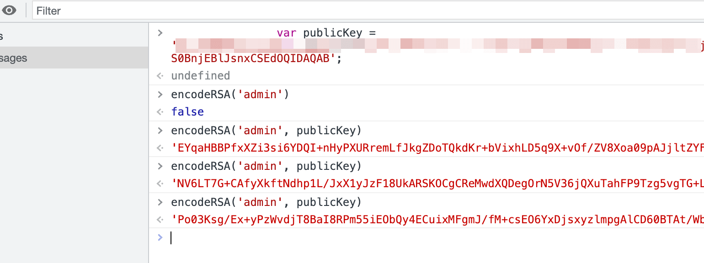

# 前端攻防案例续集

参考 kitezzzGrim 分享的案例做个总结

- - -

# [](#%E4%B8%80%E4%B8%AA-des-%E6%A1%88%E4%BE%8B)一个 DES 案例

登录点就不放图了，先抓个包看看

[](https://r0fus0d.blog.ffffffff0x.com/img/js-case2/1.png)

可以看到目标站点对 username 和 password 都进行了加密

f12 看看 js

[](https://r0fus0d.blog.ffffffff0x.com/img/js-case2/2.png)

挺好，直接表示了是 des 加密，还用的 des.js

那么其实现在在控制台就可以调用加密函数了

|     |     |     |
| --- | --- | --- |
| ```bash<br>1<br>``` | ```js<br>DES.Encrypt("admin")<br>``` |

[](https://r0fus0d.blog.ffffffff0x.com/img/js-case2/3.png)

当然，我们可以看下 des.js 文件，找下 key

[](https://r0fus0d.blog.ffffffff0x.com/img/js-case2/4.png)

做了混淆，搜了下，是类似 eval (function (p,a,c,k,e,r){}) 的加密，有在线还原的站点

-   [https://wangye.org/tools/scripts/eval/](https://wangye.org/tools/scripts/eval/)

[](https://r0fus0d.blog.ffffffff0x.com/img/js-case2/5.png)

得到 key

- - -

# [](#%E4%B8%80%E4%B8%AA-aes-%E6%A1%88%E4%BE%8B)一个 AES 案例

登录点不放图

随便输个账户密码，抓包看看

[](https://r0fus0d.blog.ffffffff0x.com/img/js-case2/6.png)

f12 看下

[](https://r0fus0d.blog.ffffffff0x.com/img/js-case2/7.png)

从以上代码可以看出 userLogin () 函数中调用 encrypt () 函数对用户名和进行了加密

挺好，控制台可调

|     |     |     |
| --- | --- | --- |
| ```bash<br>1<br>``` | ```js<br>encrypt('admin')<br>``` |

[](https://r0fus0d.blog.ffffffff0x.com/img/js-case2/8.png)

接下来查看 encrypt () 函数

[](https://r0fus0d.blog.ffffffff0x.com/img/js-case2/9.png)

可以看出使用了 AES 加密，ECB 模式，填充模式 pkcs7padding，密钥 key=1234567887654321

[](https://r0fus0d.blog.ffffffff0x.com/img/js-case2/10.png)

- - -

# [](#burpcrypto-%E6%8F%92%E4%BB%B6)BurpCrypto 插件

上面那 2 个案例可以配合这个插件进行爆破

-   [https://github.com/whwlsfb/BurpCrypto](https://github.com/whwlsfb/BurpCrypto)

[](https://r0fus0d.blog.ffffffff0x.com/img/js-case2/11.png)

[](https://r0fus0d.blog.ffffffff0x.com/img/js-case2/12.png)

- - -

# [](#%E4%B8%80%E4%B8%AA-rsa-%E6%A1%88%E4%BE%8B)一个 RSA 案例

登录点不放图

随便输个账户密码，抓包看看

[](https://r0fus0d.blog.ffffffff0x.com/img/js-case2/13.png)

长的一比，很大可能是 rsa 加密

f12 看下

[](https://r0fus0d.blog.ffffffff0x.com/img/js-case2/14.png)

可以看到 publickey 和 encodeRSA 关键字，目标站点对用户和密码都进行了 rsa 加密，但我们可以利用公钥加密字典来进行爆破

此时，控制台可调

|     |     |     |
| --- | --- | --- |
| ```bash<br>1<br>2<br>``` | ```js<br>var publicKey = 'xxxxx';<br>encodeRSA('admin', publicKey)<br>``` |

[](https://r0fus0d.blog.ffffffff0x.com/img/js-case2/15.png)

[](https://r0fus0d.blog.ffffffff0x.com/img/js-case2/16.png)

- - -

# [](#%E6%80%BB%E7%BB%93)总结

前端加密用 JSEncrypt 库的很多，为了节省时间，可以直接试试搜一些 jsencrypt 相关的方法名，如 setPublicKey、encrypt 等，定位加密函数
