# 原创 Paper | 利用 SSPI 数据报上下文 bypassUAC

**作者：****薛定的饿猫@知道创宇 404 实验室******  

**时间：2024 年 1 月 29 日**

  

  

  

 **前言**

  

参考资料

这是我 23 年 11 月份在知道创宇 404 实验室内部技术分享中讲到的一种最新 bypassUAC 的方法，该漏洞最初由 splinter\_code 在 23 年 9 月份公布并提交至 UACME 项目。在当时测试过的 Windows11、Windows10 以及 Windows7 的各个版本中都成功实现了 bypass。

整个漏洞利用的核心在于 Windows 在本地身份验证和网络身份验证过程中尝试的令牌存在一些差异，网络身份验证生成不受限的令牌，而我们可以通过某种方法在验证时强制指定使用数据报式身份验证（数据报上下文），从而在本地实现伪造网络身份验证。这将在新产生的登录会话中首先产生一个不受限的令牌，然后生成一个受限令牌，并将两者关联起来。同时，由于 Lsass 存在一些问题，在某些情况下，Lsass 会存储登录会话中生成的第一个 Token，最终导致了可以通过 SSPI 来实现 bypassUAC。

  

  

  

**0x01 前置知识**

  

参考资料

**1\. UAC 简述**

UAC 全称 user account control，意为用户账户控制。当对系统的更改需要管理员权限的时候，UAC 就会通知用户审核，提供允许或拒绝的选项。它使应用程序和任务始终在非管理员账户的安全上下文中运行，除非管理员专门授权管理员级别的权限。如图 1 所示。

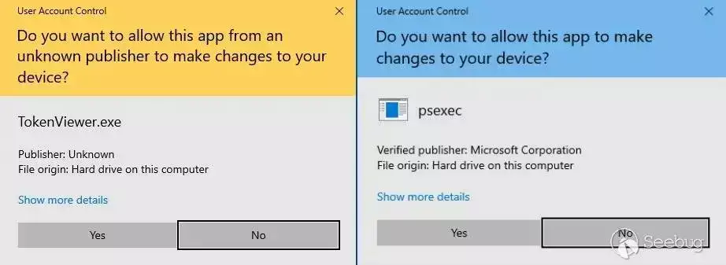

图 1 触发 UAC


图 2 数字签名对比

除此之外，Icon 具有黄蓝相间盾牌标志的程序代表着需要较高的权限，运行就需要经过 UAC 的确认。示例如图 3 所示。

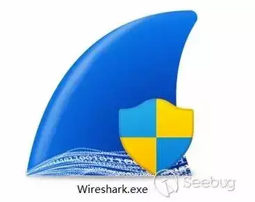

图 3 需要 UAC 的 Icon

需要注意的是，UAC 是一种针对权限的保护机制，bypassUAC 仅仅是绕过了这一机制，因此从本质上来看 bypassUAC 并不是真正意义上的提权，只是最后的效果类似，才有了 bypassUAC 提权的说法。

### **2\. Windows 令牌简述**

Windows 令牌是 Windows 中的一个重要概念，它代表了一个用户或进程的身份和权限。

令牌分为主令牌（Primary Token）和模拟令牌（Impersonation Token），主令牌只能附加到进程，模拟令牌只能附加到线程。主令牌通常与交互式用户会话（用户通过桌面与系统进行交互）相关联，而模拟令牌允许一个线程（通常是服务或应用程序）在一段时间内采用另一个安全上下文的身份执行操作。这个被采用的身份可以是另一个用户、服务帐户或系统进程的身份。

当用户登录系统时，系统会为用户创建一个主令牌，这个令牌是与用户相关联的全局身份和权限，而模拟令牌会在进程执行时根据需要动态生成。

例如，当我们的服务器处理一个文件上传的请求时，这个服务可能以较高的权限级别运行，以便执行文件操作等敏感任务。然而，为了确保安全性，不希望整个服务一直以高权限运行。

这时服务以本身的主令牌启动运行，当收到上传的请求时，服务会创建一个新线程来，新而线程将使用模拟令牌以一个较低的权限来执行后续操作。如图 4 所示。

图 4 UAC 与令牌文档说明

使用模拟令牌有助于实现权限分离。即使进程本身可能拥有较高的权限，但通过模拟令牌，可以以较低权限的用户身份执行一些敏感操作，从而减小潜在的安全风险。

除权限分离以外，Windows 令牌机制带来了单点登录和访问控制等众多好处。

管理员登录时，将为用户创建两个单独的访问令牌：标准用户访问令牌和管理员访问令牌。标准用户访问令牌包含与管理员访问令牌相同的特定于用户的信息，但删除了管理员的 Windows 特权和 SID。此外，执行 explorer.exe 也通过标准令牌来显示桌面，而 explorer.exe 是父进程，所有其他用户启动的进程都从中继承其访问令牌。因此，除非用户批准应用程序使用完整的管理访问令牌，否则所有应用程序都会以标准用户身份运行。

  

  

  

**0x02 本地&网络身份验证**

  

参考资料

这一部分是作者两年前的一次尝试，思路是通过本地身份验证和远程身份验证的不同点来进行 bypassUAC。  

本地身份验证可以通过直接登录来实现，网络身份验证我们这里使用微软提供的客户端与服务端代码来实现，于是我们可以在 Windows 安全日志中看到如下的相关信息。

这里的 LogonType 2 代表着本地（交互式）身份验证，LogonType 3 代表通过网络进行身份验证。

ElevatedToken %%1842 则代表用户获得了提升的令牌。如图 5 所示。

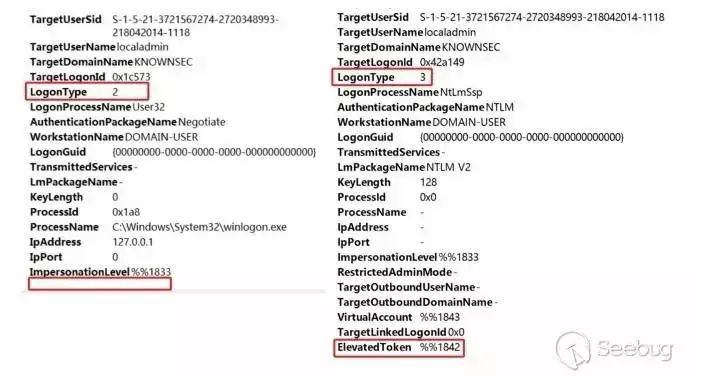

图 5 两种身份验证方式产生的日志

当然，我们也可以通过 Token Viewer 用 interactive 和 network 两种方式直接生成令牌。生成的令牌对比如图 6，图 7 所示。


图 6 两种令牌的权限对比


图 7 两种令牌的组对比

最后的结果是，本地身份验证所生成的令牌受到了 UAC 的限制，IL 级别为 Medium 并且管理员 SID 被禁用。网络身份验证所生成的令牌则没有 UAC 的限制，IL 级别为 High，管理员 SID 也没有被禁用。

那么现在的思路是，能否通过在本地伪造一个网络身份验证来欺骗 Lsass，以此获得提升的令牌。

要了解如何伪造网络身份验证，我们需要了解系统是如何区分本地身份验证和网络身份验证的验证方式。

Windows 使用 LsaLogonUser API 进行各种用户身份验证。默认情况下，LsaLogonUser API 通过调用 MSV1\_0（MSV）身份验证包对用户进行身份验证。如图 8 所示。


图 8 本地身份验证工作原理

验证的逻辑也很简单，如果客户端在协商消息中提供的域名和机器名与本地域命和机器名匹配，则这是本地身份验证情况。如图 9 所示。

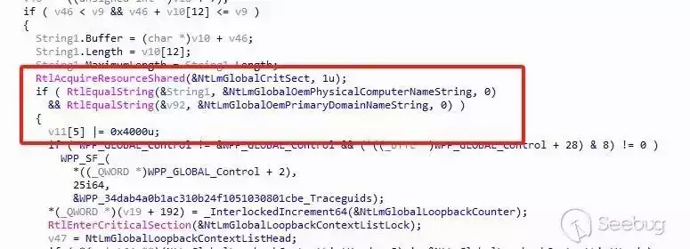

图 9 逆向 MSV1\_0.dll

进入这个判断之前，函数会先检查协商标志的内容，除了在新 Windows 版本中始终为 True 的 `NTLMSSP_NEGOTIATE_OEM_WORKSTATION_SUPPLIED` 和`NTLMSSP_NEGOTIATE_OEM_DOMAIN_SUPPLIED` 两个标志位，还有一个 `NTLMSSP_NEGOTIATE_DATAGRAM` 检查标志，这个标志代表着无连接的数据报上下文，要满足这个条件我们只需要在客户端在调用 `InitializeSecurityContext（General）`函数时设置 `ISC_REQ_DATAGRAM` 标志即可。如图 10 所示。

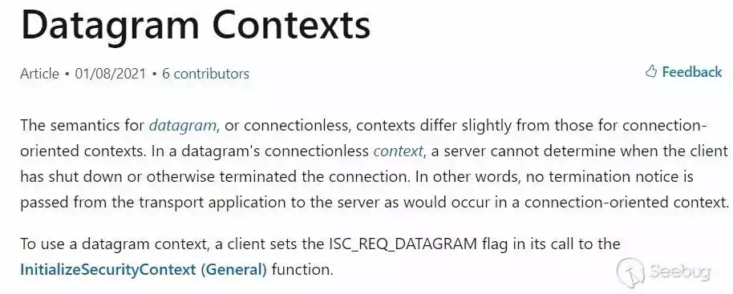

图 10 数据报上下文介绍

在成功伪造一个数据报式的网络验证之后，客户端与服务器确实没有协商本地身份验证。如图 11 所示。

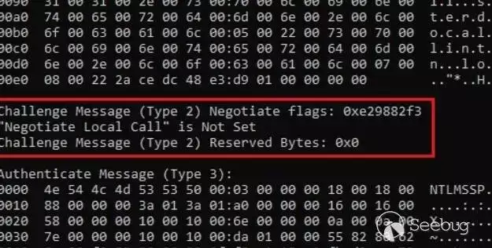

图 11 伪造数据报式验证的协商信息

但从最后 生成的令牌来看，虽然令牌已经成功拥有了 Network 的登陆类型，但是令牌依然受到了限制。如图 12 所示。

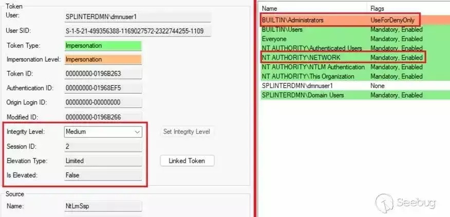

图 12 伪造网络身份验证获取的令牌

这里猜测是 Lsass 有额外的检查，它可以验证用户的本地和远程登录，并强制本地安全策略。如果从 Token Viewer 伪造的令牌来看，本地身份验证和网络身份验证所生成的令牌除了前述的一些差别以外，比如特权和组别等，这很有可能也作为了 Lsass 的判别依据。如图 13，图 14 所示。


图 13 伪造的两种令牌的权限对比


图 14 伪造的两种令牌的特权对比

  

  

**0x03  Lsass 的令牌保存问题**

  

参考资

Windows 的一大特性是"一次输入，随处验证"，而这由 LSA 来实现，简单来说，当 LSASS 为新的登录会话创建令牌时，它会存储该令牌以供以后检索。在进行网络验证时，会话令牌将被重新使用。

AcquireCredentialsHandle（General）函数用于获取安全主体预先存在的凭据的句柄以供之前提到的 InitializeSecurityContext（General）和 AcceptSecurityContext（General）函数使用。

其中，pvLogonID 参数可以用于指定进行网络验证的用户。如图 15 所示。


图 15 pvLogonID 文档说明

我们可以注意到注释中所说，"此参数为网络重定向程序等文件系统进程提供"。

那么如果我们在进行身份验证时具有 TCB 特权，那么这个参数会指定用于身份验证的令牌的登录会话 ID，虽然网络身份验证在另外一台计算机上进行，而令牌不会跟随一起过去，但是如果是本地环回身份验证，此时令牌就在本地机器上，所以此时这个参数会指定我们的登录会话令牌。

那么什么是 TCB（Trusted Computing Base）？TCB、System 以及 trustedinstaller 有什么区别？

从某种方面来说，TCB 代表着系统的最高权限，它涵盖了系统中所有受信任的组件，而 System 和 trustedinstaller 是 TCB 的两种具体实现。

System 是系统内置的一个用户，主要用于系统级的任务，服务等，而 TrustedInstaller 是 Windows 操作系统中的一个服务，它更偏向于软件的安装卸载以及文件和文件夹。如图 16 所示。

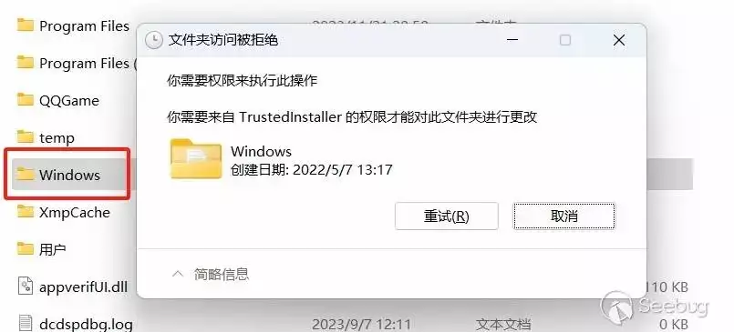

图 16 尝试删除 Windows 文件夹的提示

那么结合前面所说，SMB 完美符合我们的所有要求。通过命名管道它可以获取网络验证的令牌，同时 SMB 在内核模式下运行进行网络身份验证因此具有了 TCB 特权。

我们首先需要先了解 Impersonation 的概念，模拟允许服务器代表客户端在客户端的权限内代表客户端进行操作，然后在操作完成后回复原本的权限，是一种权限隔离的保护措施。如图 17 所示。

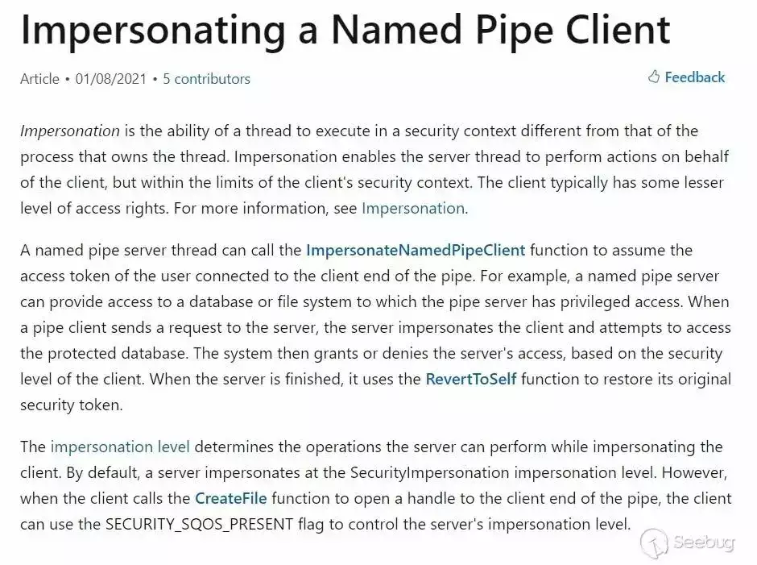

图 17 模拟命名管道文档介绍

通过查看 ImpersonateNamedPipeClient 函数原型可以知道，命名管道服务器线程要成功调用 ImpersonateNamedPipeClient 函数需要满足四个条件中的任意一个，其中包括调用者需要 SeImpersonatePrivilege 权限，而作为服务一般都满足这个条件，同时 Network Service 账户本身也具有 SeImpersonatePrivilege 权限。如图 18，图 19 所示。


图 18 模拟的要求

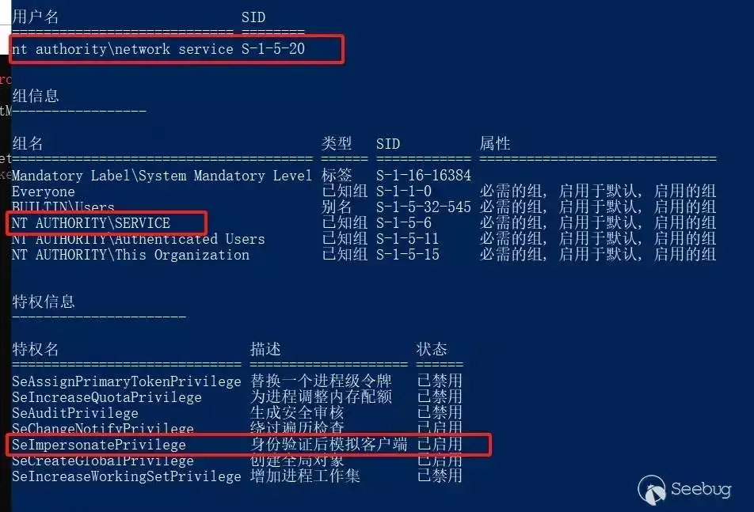

图 19 Network Service 权限列表

此处利用的重点在于，在本地环回身份验证中，Lsass 将保存会话的令牌而不是调用者的令牌。前面我们说过，会话令牌是登录时生成，而具体进程使用的令牌是动态生成的，也就是 Lsass 保存的是生成的第一个令牌。

我们以 Rpcss 服务为目标，因为它也作为网络服务运行并且具有很多高权限的令牌句柄，最重要的是，Rpcss 是第一个以 Network Service 运行的进程。如图 20，图 21 所示。


图 20 查询 Rpcss 服务的 Pid


图 21 Rpcss 服务相关句柄

在开始验证之前，我们需要先取得一个 Network Service 的 PowerShell 环境。

首先需要在管理员模式下的 PowerShell 中安装并导入 NtObjectManager，这里推荐安装在 C 盘目录下。装并导入 NtObjectManager 命令如下。

```plain
Save-Module -Name NtObjectManager -Path C:\
Import-Module C:\NtObjectManager
```

接着开启一个具有 System 权限的 PowerShell，命令如下。

```plain
$p = Start-Win32ChildProcess PowerShell
```

开启 system 权限 PowerShell，如图 22 所示。

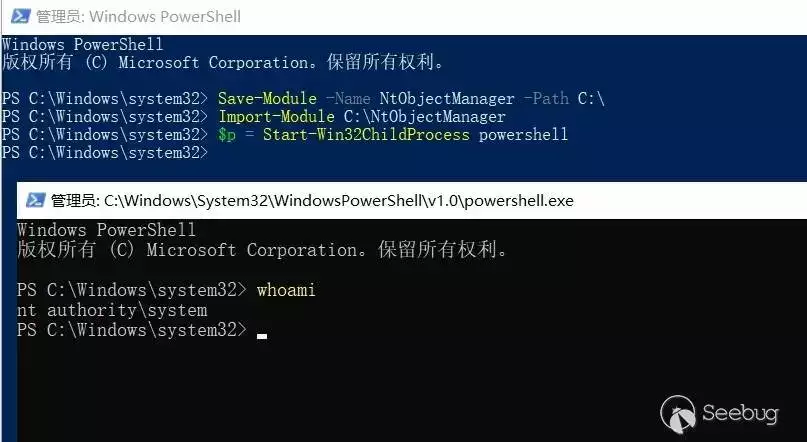

图 22 system 权限 PowerShell

接着我们先导入先前下载的包，接着获取当前的会话令牌，然后创建新的 Network Service 令牌并添加 SID 到组，最后使用新的令牌启动一个 Network Service 的 PowerShell。具体命令如下。

```plain
Import-Module C:\NtObjectManager
$sess = Get-NtToken -Session
$token = Get-NtToken -Service NetworkService -AdditionalGroups $sess.LogonSid.Sid
New-Win32Process PowerShell -Token $token -CreationFlags NewConsole
```

开启 Network Service 的 PowerShell，如图 23 所示。


图 23 Network Service 的 PowerShell

首先我们需要知道 Rpcss 服务的 Pid。通过任务管理器查看 Rpcss 服务 Pid 如图 24 所示。


图 24 查看 Rpcss 的 Pid

我们直接尝试请求访问 Rpcss 服务，命令如下。

`$p = Get-NtProcess -ProcessId 912`

可以看到提示访问被拒绝，权限不足，如图 25 所示。


图 25 请求访问 Rpcss 服务被拒

接着我们创建一个命名管道，然后启动它的监听，通过 localhost 打开管道的句柄，然后等待作业完成。具体命令如下。

```plain
$pipe = New-NtNamedPipeFile \\.\pipe\AAA2 -Win32Path
$job = Start-Job {$pipe.Listen（）}
$file = Get-NtFile \\127.0.0.1\pipe\AAA2 -Win32Path
Wait-Job $Job | Out-Null
```

这次我们模拟命名管道然后再次去请求 Rpcss 服务。这里需要注意的一点是，如果 $p 部分按照文章中的分段进行输入，那么需要在核心模式下运行，也就是需要将命令写入一个 ps1 文件然后执行。如果不想创建一个 ps1 文件，那么可以将命令写为一行。具体命令如下。

```plain
$p = Use-NtObject（$pipe.Impersonate（））{
    Get-NtProcess -ProcessId 912
}
$p.GrantedAccess
```

此时我们可以看到，通过 `Impersonate（）`进行了身份模拟，然后在该身份下执行了 `$p.GrantedAccess` 来获取该进程被赋予的访问权限，结果为 AllAccess。执行结果如图 26 所示。


图 26 获取相关权限

我们可以通过查看令牌的组列表来验证我们前面所说的 Lsass 保存的是登录会话创建的第一个令牌（因为 Rpcss 是第一个以 Network Service 运行的服务）。查看令牌的组列表命令如下。

```plain
$token = Use-NtObject（$pipe.Impersonate（））{
    Get-NtToken -Impersonation
}
$token.Groups | ? Name -Match Rpcss
```

可以看到 Rpcss 已在其中。令牌的组列表如图 27 所示。


图 27 查询令牌组列表

  

  

  

**0x04 数据报式身份验证的令牌**

  

参考资料

我们可以通过代码来模拟一个数据报式身份验证的过程，然后观察其过程生成的相关令牌。具体可以参见前文的 `NTLMSSP_NEGOTIATE_DATAGRAM` 相关内容，只需要在调用`InitializeSecurityContext（General）`函数时设置 `ISC_REQ_DATAGRAM` 标志。进行数据报式身份验证代码如下。

```plain
#define SECURITY_WIN32

#include <Windows.h>
#include <stdio.h>
#include <Security.h>

#define SEC_SUCCESS (Status) ((Status) >= 0)
#define MAX_MESSAGE_SIZE 12000

#pragma comment (lib, "Secur32.lib"）

int main ()
{
  CredHandle hCredClient, hCredServer;
  TimeStamp lifetimeClient, lifetimeServer;
  SecBufferDesc negotiateDesc, challengeDesc, authenticateDesc;
  SecBuffer negotiateBuffer, challengeBuffer, authenticateBuffer;
  CtxtHandle clientContextHandle, serverContextHandle;
  ULONG clientContextAttributes, serverContextAttributes;
  SECURITY_STATUS secStatus;
  HANDLE hTokenNetwork = INVALID_HANDLE_VALUE;

  secStatus = AcquireCredentialsHandle (NULL, (LPWSTR) NTLMSP_NAME, SECPKG_CRED_OUTBOUND, NULL, NULL, NULL, NULL, &hCredClient, &lifetimeClient);
  if （!SEC_SUCCESS（secStatus）） {
    printf（"AcquireCredentialsHandle Client failed with secstatus code 0x%x \n", secStatus）;
    exit（-1）;
  }

  secStatus = AcquireCredentialsHandle (NULL, (LPWSTR) NTLMSP_NAME, SECPKG_CRED_INBOUND, NULL, NULL, NULL, NULL, &hCredServer, &lifetimeServer);
  if （!SEC_SUCCESS（secStatus）） {
    printf（"AcquireCredentialsHandle Server failed with secstatus code 0x%x \n", secStatus）;
    exit（-1）;
  }

  negotiateDesc.ulVersion = 0;
  negotiateDesc.cBuffers = 1;
  negotiateDesc.pBuffers = &negotiateBuffer;
  negotiateBuffer.cbBuffer = MAX_MESSAGE_SIZE;
  negotiateBuffer.BufferType = SECBUFFER_TOKEN;
  negotiateBuffer.pvBuffer = HeapAlloc (GetProcessHeap (), HEAP_ZERO_MEMORY, MAX_MESSAGE_SIZE);
  secStatus = InitializeSecurityContext (&hCredClient, NULL, NULL, ISC_REQ_DATAGRAM, 0, SECURITY_NATIVE_DREP, NULL, 0, &clientContextHandle, &negotiateDesc, &clientContextAttributes, &lifetimeClient);
  if （!SEC_SUCCESS（secStatus）） {
    printf（"InitializeSecurityContext Type 1 failed with secstatus code 0x%x \n", secStatus）;
    exit（-1）;
  }

  challengeDesc.ulVersion = 0;
  challengeDesc.cBuffers = 1;
  challengeDesc.pBuffers = &challengeBuffer;
  challengeBuffer.cbBuffer = MAX_MESSAGE_SIZE;
  challengeBuffer.BufferType = SECBUFFER_TOKEN;
  challengeBuffer.pvBuffer = HeapAlloc (GetProcessHeap (), HEAP_ZERO_MEMORY, MAX_MESSAGE_SIZE);
  secStatus = AcceptSecurityContext (&hCredServer, NULL, &negotiateDesc, ASC_REQ_DATAGRAM, SECURITY_NATIVE_DREP, &serverContextHandle, &challengeDesc, &serverContextAttributes, &lifetimeServer);
  if （!SEC_SUCCESS（secStatus）） {
    printf（"AcceptSecurityContext Type 2 failed with secstatus code 0x%x \n", secStatus）;
    exit（-1）;
  }

  authenticateDesc.ulVersion = 0;
  authenticateDesc.cBuffers = 1;
  authenticateDesc.pBuffers = &authenticateBuffer;
  authenticateBuffer.cbBuffer = MAX_MESSAGE_SIZE;
  authenticateBuffer.BufferType = SECBUFFER_TOKEN;
  authenticateBuffer.pvBuffer = HeapAlloc (GetProcessHeap (), HEAP_ZERO_MEMORY, MAX_MESSAGE_SIZE);
  secStatus = InitializeSecurityContext (NULL, &clientContextHandle, NULL, 0, 0, SECURITY_NATIVE_DREP, &challengeDesc, 0, &clientContextHandle, &authenticateDesc, &clientContextAttributes, &lifetimeClient);
  if （!SEC_SUCCESS（secStatus）） {
    printf（"InitializeSecurityContext Type 3 failed with secstatus code 0x%x \n", secStatus）;
    exit（-1）;
  }

  secStatus = AcceptSecurityContext (NULL, &serverContextHandle, &authenticateDesc, 0, SECURITY_NATIVE_DREP, &serverContextHandle, NULL, &serverContextAttributes, &lifetimeServer);
  if （!SEC_SUCCESS（secStatus）） {
    printf（"AcceptSecurityContext failed with secstatus code 0x%x \n", secStatus）;
    exit（-1）;
  }
  QuerySecurityContextToken (&serverContextHandle, &hTokenNetwork);

  HeapFree (GetProcessHeap (), 0, negotiateBuffer.pvBuffer);
  HeapFree (GetProcessHeap (), 0, challengeBuffer.pvBuffer);
  HeapFree (GetProcessHeap (), 0, authenticateBuffer.pvBuffer);
  FreeCredentialsHandle（&hCredClient）;
  FreeCredentialsHandle（&hCredServer）;
  DeleteSecurityContext（&clientContextHandle）;
  DeleteSecurityContext（&serverContextHandle）;
  Sleep（10000）;
  return 0;
}
```

可以看到，在 linda 用户的 lsass.exe 进程中 生成了一个不受限制的高权限令牌，而我们的程序 ntlm.exe 中生成了一个受限制的令牌。如图 28 所示。

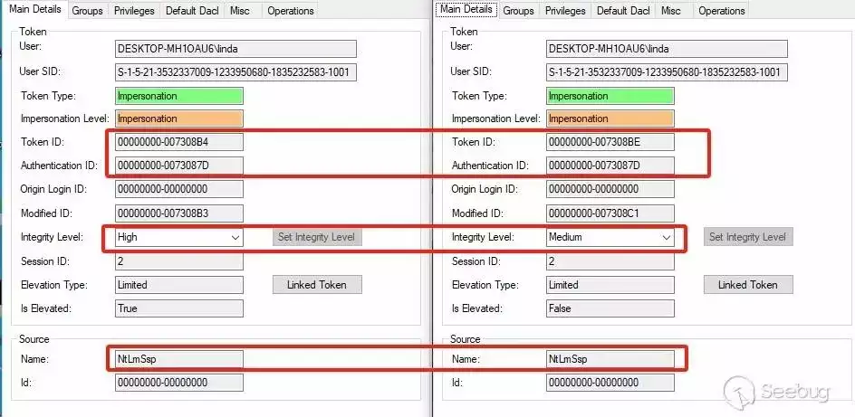

图 28 生成的两个令牌

观察两个令牌可以发现，它们的登录会话 ID 或者身份验证 ID 是一样的，都为 00000000-0073087D，并且从 Token ID 能看出来高权限的令牌 00000000-007308B4 在受限令牌 00000000-007308BE 之前 生成，那么这说明高权限的令牌可能是在这个登录会话中 生成的第一个令牌。当然，这里的登录会话指的是在数据报式身份验证时，Lsass 创建的新的登录会话。在创建新的登录会话之后会先创建一个高权限的令牌，接着再创建一个受限的令牌然后将两者链接起来。

那么此时的利用路径已经很明确了，Lsass.exe 会存储登录会话 生成的第一个令牌，而数据报式身份验证 生成的新的登录会话会先 生成高权限令牌，而后 生成受限的令牌。

  

  

  

**0x05 漏洞利用验证**

  

参考资料

要验证这个漏洞，我们需要去模拟生成的受限令牌。根据 ImpersonateLoggedOnUser 的文档说明，我们只需要满足四个条件中的任意一个即可。具体要求如图 29 所示。


图 29 模拟的条件说明

显然同前文所说，我们的情况满足第四点的经过身份验证的身份与调用者相同。然后是执行检查的内核函数 SeTokenCanImpersonate 的检查条件。函数检查流程如图 30 所示。


图 30 SeTokenCanImpersonate 检查流程

从图中可以看出，UAC 限制下的令牌虽然不满足 `Token Level < Impersonate` 以及 `Process has Impersonate Privilege` 不能直接获得 Allowed，但是它满足后续的所有条件。

既然可以模拟受限的令牌，那只需要使用受限的令牌去进行认证，然后通过认证结果来看认证使用的到底是我们预期的高权限令牌还是受限的令牌即可。如果最后获得了高权限的令牌，那么说明 Lsass 确实保存了登录会话生成的第一个令牌，并且数据报式身份验证也确实是先生成了高权限的令牌然后再生成的受限令牌。

从数据报式身份验证去模拟令牌然后通过环回接口去写入命名管道。使用模拟的受限令牌进行验证的结果如图 31 所示。

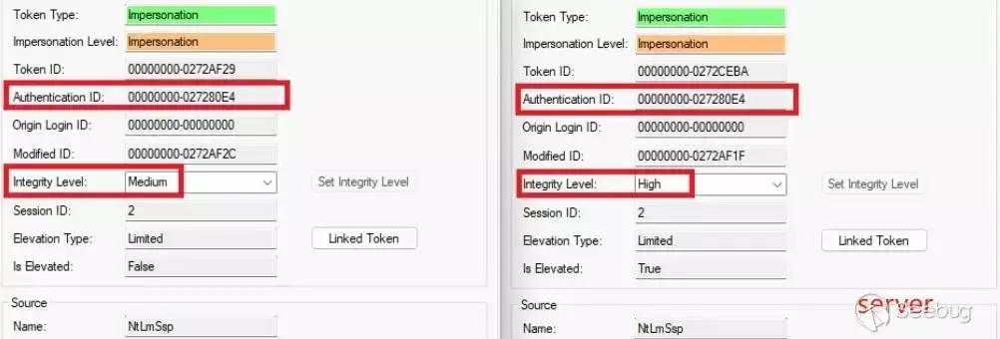

图 31 使用模拟的令牌进行写入

显然，使用模拟的受限令牌进行操作，在通过环回接口进行认证的时候仍然使用了提升的令牌。

现在已经可以通过 SMB 的文件共享服务写入任意文件了，比如`\\127.0.0.1\C$\Windows\bypassuac.txt`，那如何实现命令执行呢？

  

  

  

**0x06 实现命令执行**

  

参考资料

ncacn\_np 是一种 RPC（远程过程调用）协议序列标识符，用于指定 RPC 的协议序列。

RPC 是一种用于在分布式系统中进行进程间通信的协议。Named Pipes（命名管道）是一种通信机制，允许具有相同网络路径的进程进行本地和远程通信。

通过 ncacn\_np，RPC 可以使用 Named Pipes 进行通信。

在 Windows 操作系统中，ncacn\_np 常用于本地进程之间的通信，尤其是在同一台计算机上的进程间通信。通过使用 Named Pipes，进程可以通过指定的路径（如 `\\servername\pipe\pipename`）进行通信，其中 ncacn\_np 表示使用 Named Pipes 协议。

前文我们已经可以通过提升的令牌来对命名管道进行身份验证，这意味着我们可以访问所有使用 ncacn\_np 配置运行的 RPC 服务器。

但是如果我们通过 RegConnectRegistryW 来对远程注册表进行身份验证的话，它无法打开远程注册表的句柄。

在此前我们提到过利用的一个前提在于 AcquireCredentialsHandle 的 pvLogonID，而 RegConnectRegistryW 无法使用是因为 RPCRT4.dll 使用了自己的实现来进行身份验证，它将 pvLogonID 设置为 0，而我们需要的是将其设置为跟用户关联的登录会话 ID，否则不能触发 Lsass 的令牌问题。验证过程中 pvLogonID 的设置如图 32 所示。

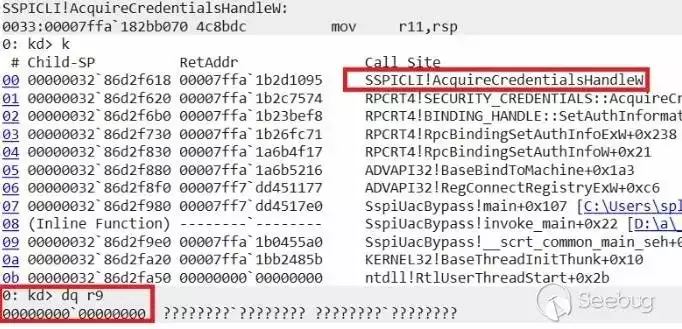

图 32 RegConnectRegistryW 的 pvLogonID 设置

CreateFileW 的身份验证由 SMB 重定向驱动 mrxsmb20.sys 在内核中实现，并且 pvLogonId 设置为跟用户关联的登录会话 ID。又因为身份验证在内核模式下进行，所以需要 TCB 特权来指定 pvLogonId 跟前文一样都可以实现。只是此时要利用漏洞需要自定义一个使用 CreateFileW 的 RPC 客户端实现。

  

  

  

**0x07 效果演示**

  

参考资料

添加系统用户如图 33 所示。

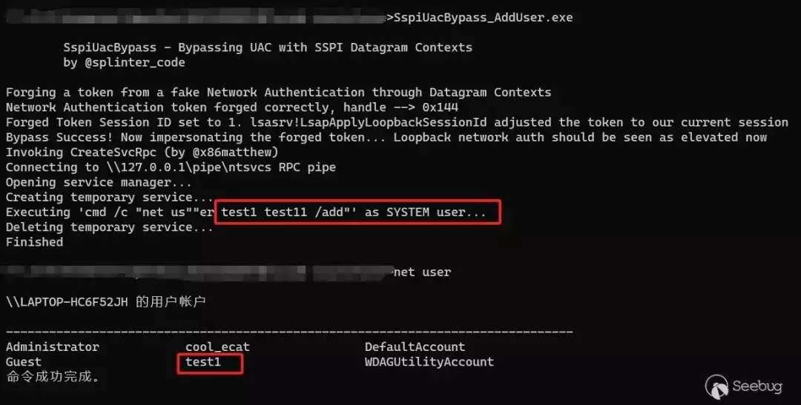

图 33 成功添加用户

执行 whoami 并将结果写入 system32 文件夹下，结果如图 34 所示。

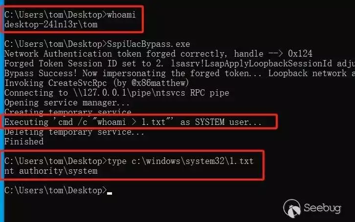

图 34 成功以 system 权限执行

  

  

  

**0x08 参考链接**

  

参考资料

  

\[1\] https://splintercod3.blogspot.com/p/bypassing-uac-with-sspi-datagram.html?m=1

\[2\] https://github.com/antonioCoco/SspiUacBypass/tree/main

\[3\] https://www.tiraniddo.dev/2020/04/sharing-logon-session-little-too-much.html

\[4\] https://www.tiraniddo.dev/2020/02/getting-interactive-service-account.html

\[5\] https://github.com/antonioCoco/SspiUacBypass

\[6\] https://www.x86matthew.com/view\_post?id=create\_svc\_rpc