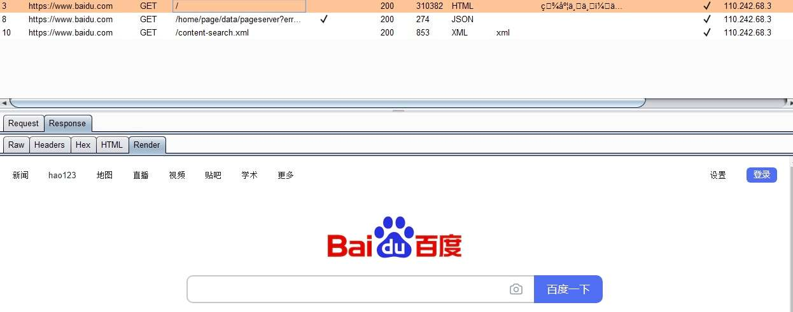
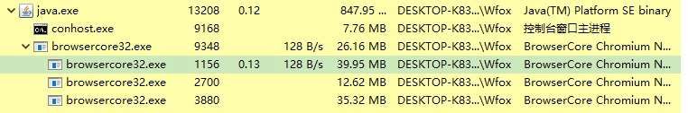
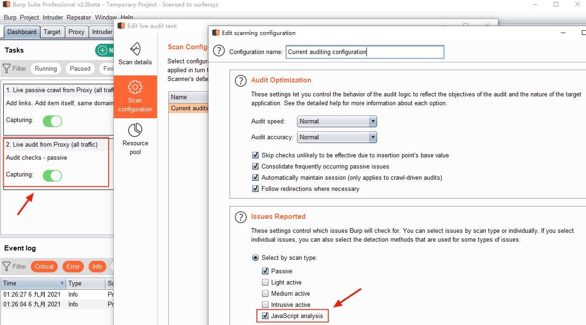

# 反制爬虫之 Burp Suite 远程命令执行

## 一、前言

Headless Chrome 是谷歌 Chrome 浏览器的无界面模式，通过命令行方式打开网页并渲染，常用于自动化测试、网站爬虫、网站截图、XSS 检测等场景。

近几年许多桌面客户端应用中，基本都内嵌了 Chromium 用于业务场景使用，但由于开发不当、CEF 版本不升级维护等诸多问题，攻击者可以利用这些缺陷攻击客户端应用以达到命令执行效果。

本文以知名渗透软件 Burp Suite 举例，从软件分析、漏洞挖掘、攻击面扩展等方面进行深入探讨。

## 二、软件分析

以 Burp Suite Pro v2.0beta 版本为例，要做漏洞挖掘首先要了解软件架构及功能点。

将 `burpsuite_pro_v2.0.11beta.jar` 进行解包，可以发现 Burp Suite 打包了 Windows、Linux、Mac 的 Chromium，可以兼容在不同系统下运行内置 Chromium 浏览器。


在 Windows 系统中，Burp Suite v2.0 运行时会将 `chromium-win64.7z` 解压至 `C:\Users\user\AppData\Local\JxBrowser\browsercore-64.0.3282.24.unknown\` 目录


从目录名及数字签名得知 Burp Suite v2.0 是直接引用 JxBrowser 浏览器控件，其打包的 Chromium 版本为 64.0.3282.24。

那如何在 Burp Suite 中使用内置浏览器呢？在常见的使用场景中，`Proxy -> HTTP history -> Response -> Render` 及 `Repeater -> Render` 都能够调用内置 Chromium 浏览器渲染网页。



当 Burp Suite 唤起内置浏览器 `browsercore32.exe` 打开网页时，`browsercore32.exe` 会创建 Renderer 进程及 GPU 加速进程。



browsercore32.exe 进程运行参数如下：

```plain
// Chromium主进程
C:\Users\user\AppData\Local\JxBrowser\browsercore-64.0.3282.24.unknown\browsercore32.exe --port=53070 --pid=13208 --dpi-awareness=system-aware --crash-dump-dir=C:\Users\user\AppData\Local\JxBrowser --lang=zh-CN --no-sandbox --disable-xss-auditor --headless --disable-gpu --log-level=2 --proxy-server="socks://127.0.0.1:0" --disable-bundled-ppapi-flash --disable-plugins-discovery --disable-default-apps --disable-extensions --disable-prerender-local-predictor --disable-save-password-bubble --disable-sync --disk-cache-size=0 --incognito --media-cache-size=0 --no-events --disable-settings-window

// Renderer进程
C:\Users\user\AppData\Local\JxBrowser\browsercore-64.0.3282.24.unknown\browsercore32.exe --type=renderer --log-level=2 --no-sandbox --disable-features=LoadingWithMojo,browser-side-navigation --disable-databases --disable-gpu-compositing --service-pipe-token=C06434E20AA8C9230D15FCDFE9C96993 --lang=zh-CN --crash-dump-dir="C:\Users\user\AppData\Local\JxBrowser" --enable-pinch --device-scale-factor=1 --num-raster-threads=1 --enable-gpu-async-worker-context --disable-accelerated-video-decode --service-request-channel-token=C06434E20AA8C9230D15FCDFE9C96993 --renderer-client-id=2 --mojo-platform-channel-handle=2564 /prefetch:1
```

从进程运行参数分析得知，Chromium 进程以 headless 模式运行、关闭了沙箱功能、随机监听一个端口（用途未知）。

## 三、漏洞利用

Chromium 组件的历史版本几乎都存在着 1Day 漏洞风险，特别是在客户端软件一般不会维护升级 Chromium 版本，且关闭沙箱功能，在没有沙箱防护的情况下漏洞可以无限制利用。

Burp Suite v2.0 内置的 Chromium 版本为 64.0.3282.24，该低版本 Chromium 受到多个历史漏洞影响，可以通过 v8 引擎漏洞执行 shellcode 从而获得 PC 权限。

以 Render 功能演示，利用 v8 漏洞触发 shellcode 打开计算器（此处感谢 Sakura 提供漏洞利用代码）

这个漏洞没有公开的 CVE ID，但其详情可以在[这里](https://bugs.chromium.org/p/chromium/issues/detail?id=880207)找到。  
该漏洞的 Root Cause 是在进行 `Math.expm1` 的范围分析时，推断出的类型是 `Union(PlainNumber, NaN)`，忽略了 `Math.expm1(-0)` 会返回 `-0` 的情况，从而导致范围分析错误，导致 JIT 优化时，错误的将边界检查 CheckBounds 移除，造成了 OOB 漏洞。

用户在通过 Render 功能渲染页面时触发 v8 漏洞成功执行 shellcode。


## 四、进阶攻击

Render 功能需要用户交互才能触发漏洞，相对来说比较鸡肋，能不能 0click 触发漏洞？答案是可以的。

Burp Suite v2.0 的 `Live audit from Proxy` 被动扫描功能在默认情况下开启 JavaScript 分析引擎（JavaScript analysis），用于扫描 JavaScript 漏洞。



其中 JavaScript 分析配置中，默认开启了动态分析功能（[dynamic analysis techniques](https://portswigger.net/blog/dynamic-analysis-of-javascript)）、额外请求功能（Make requests for missing Javascript dependencies）  


JavaScript 动态分析功能会调用内置 chromium 浏览器对页面中的 JavaScript 进行 DOM XSS 扫描，同样会触发页面中的 HTML 渲染、JavaScript 执行，从而触发 v8 漏洞执行 shellcode。

额外请求功能当页面存在 script 标签引用外部 JS 时，除了页面正常渲染时请求加载 script 标签，还会额外发起请求加载外部 JS。即两次请求加载外部 JS 文件，并且分别执行两次 JavaScript 动态分析。

额外发起的 HTTP 请求会存在明文特征，后端可以根据该特征在正常加载时返回正常 JavaScript 代码，额外加载时返回漏洞利用代码，从而可以实现在 Burp Suite HTTP history 中隐藏攻击行为。

```plain
GET /xxx.js HTTP/1.1
Host: www.xxx.com
Connection: close
Cookie: JSESSIONID=3B6FD6BC99B03A63966FC9CF4E8483FF
```

JavaScript 动态分析 + 额外请求 + chromium 漏洞组合利用效果：


## 五、流量特征检测

默认情况下 Java 发起 HTTPS 请求时协商的算法会受到 JDK 及操作系统版本影响，而 Burp Suite 自己实现了 HTTPS 请求库，其 TLS 握手协商的算法是固定的，结合 JA3 算法形成了 TLS 流量指纹特征可被检测，有关于 JA3 检测的知识点可学习《[TLS Fingerprinting with JA3 and JA3S](https://engineering.salesforce.com/tls-fingerprinting-with-ja3-and-ja3s-247362855967)》。

[Cloudflare](https://portswigger.net/daily-swig/https-everywhere-cloudflare-planning-improvements-to-middleware-detection-utility) 开源并在 CDN 产品上应用了 [MITMEngine](https://github.com/cloudflare/mitmengine) 组件，通过 TLS 指纹识别可检测出恶意请求并拦截，其覆盖了大多数 Burp Suite 版本的 JA3 指纹从而实现检测拦截。这也可以解释为什么在渗透测试时使用 Burp Suite 请求无法获取到响应包。

以 Burp Suite v2.0 举例，实际测试在各个操作系统下，同样的 jar 包发起的 JA3 指纹是一样的。


不同版本 Burp Suite 支持的 TLS 算法不一样会导致 JA3 指纹不同，但同样的 Burp Suite 版本 JA3 指纹肯定是一样的。如果需要覆盖 Burp Suite 流量检测只需要将每个版本的 JA3 指纹识别覆盖即可检测 Burp Suite 攻击从而实现拦截。

本文章涉及内容仅限防御对抗、安全研究交流，请勿用于非法途径。
