# 古董级木马？Delphi 木马之 CyberGate RAT 加解密技术剖析 - 先知社区

## 概述

近期，笔者在浏览网络中威胁情报信息的时候，遇到了一个很久之前分析过的一款 RAT 木马，此款 RAT 木马目前仍在网络中活跃，并且近期被攻击者伪装成 Dork 转换器工具，用于针对安全研究人员、渗透测试人员等发起攻击，相关报告截图如下：

[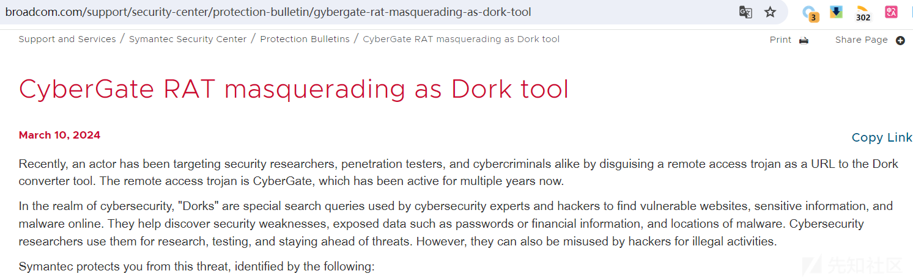](https://xzfile.aliyuncs.com/media/upload/picture/20240327085702-ebff6724-ebd4-1.png)

由于以前笔者分析样本只关注其功能及外联地址等信息，虽然分析的样本数量很多，但是却很难对不同样本的各差异点进行归纳总结。因此，当笔者再次看到以前分析过的样本时，就忍不住再次对其进行分析，并想按照与以往不同的分析角度对其进行再一次的深度剖析。

为了能够详细的对比分析，笔者在 github 上找到了 CyberGate RAT 的可利用项目，并准备从如下角度对其进行深度剖析：

-   木马功能分析：由于 CyberGate RAT 程序是由 Delphi 编写，因此其生成的木马端程序要比此前我们研究的 RAT 程序分析难度大一些；
-   配置信息解密：由于 CyberGate RAT 程序在生成木马端的过程中，可在控制端界面自定义配置木马端信息，因此只要能够对配置信息进行解密，就可基本了解 CyberGate 木马端程序功能；
-   配置信息提取脚本：结合木马功能分析情况，尝试模拟构建配置信息提取脚本，自动化的提取配置信息内容；
-   通信模型分析：结合木马功能分析情况，尝试对木马通信数据包进行解密，并梳理 CyberGate RAT 的通信模型；
-   通信解密脚本：尝试模拟构建通信解密脚本，实现自动化的批量通信会话解密；

## 开源 CyberGate RAT 利用分析

由于 CyberGate RAT 并非开源远控工具，因此无法从源码层对其进行研究分析，不过，笔者在 github 上找到了一个 CyberGate-v3.4.2.2 版本的可利用项目。

通过对 CyberGate-v3.4.2.2 项目进行简单分析，笔者发现：

-   此 CyberGate RAT 项目是一个破解版本；
-   此 CyberGate RAT 项目的 CyberGate 版本确实比较早，属于 2010-2012 年期间的活跃版本；

**虽然此 CyberGate RAT 版本较早，但笔者也是将相关研究成果与近期网络中曝光的 CyberGate RAT 木马分析报告进行过对比，发现其较核心的配置信息及通信模块依然没有太大的变化，因此，笔者认为直接研究此 CyberGate RAT 版本也不算过时。**

相关截图如下：

[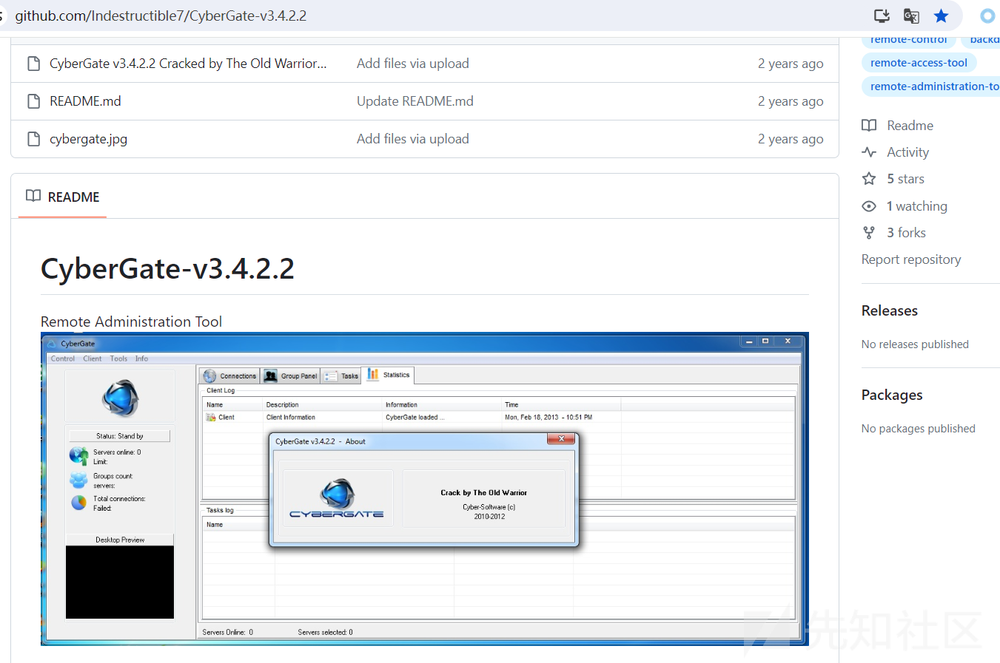](https://xzfile.aliyuncs.com/media/upload/picture/20240327085715-f44e5b56-ebd4-1.png)

### 生成 CyberGate 木马

下载 CyberGate-v3.4.2.2 项目并直接运行即可打开 CyberGate 控制端的 GUI 界面，

在 GUI 界面中选择【Tools】-【New Server】菜单即可对 CyberGate 木马端进行自定义配置，相关截图如下：

[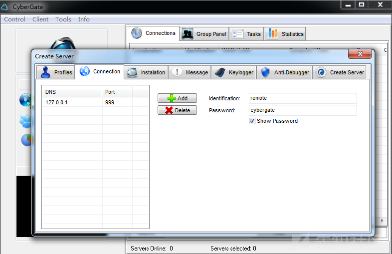](https://xzfile.aliyuncs.com/media/upload/picture/20240327085729-fc603724-ebd4-1.png)

在自定义配置信息中，笔者发现 CyberGate RAT 除支持基本的配置信息外，还支持指定 RAT 安装目录、进程注入、自启动方式、反调试及反病毒等功能配置，相关截图如下：

[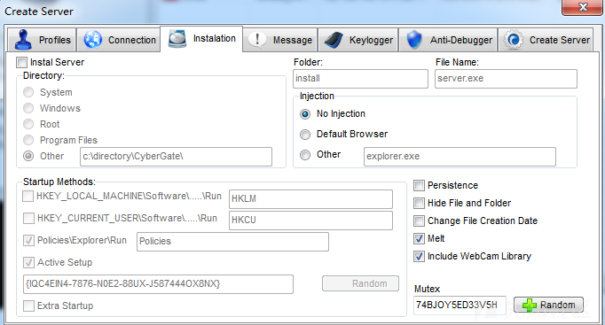](https://xzfile.aliyuncs.com/media/upload/picture/20240327085742-03da6f24-ebd5-1.png)

[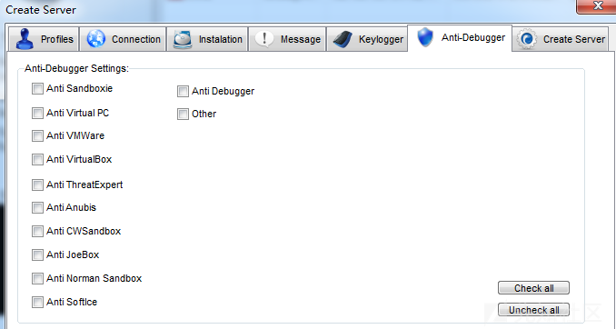](https://xzfile.aliyuncs.com/media/upload/picture/20240327085754-0b8687ee-ebd5-1.png)

### 木马上线

在 GUI 界面中选择【Control】-【Start】菜单，即可打开监听端口，然后在受控主机中运行 CyberGate 木马端程序，即可成功实现木马上线，上线后即可实现对受控主机的远控管理，相关截图如下：

[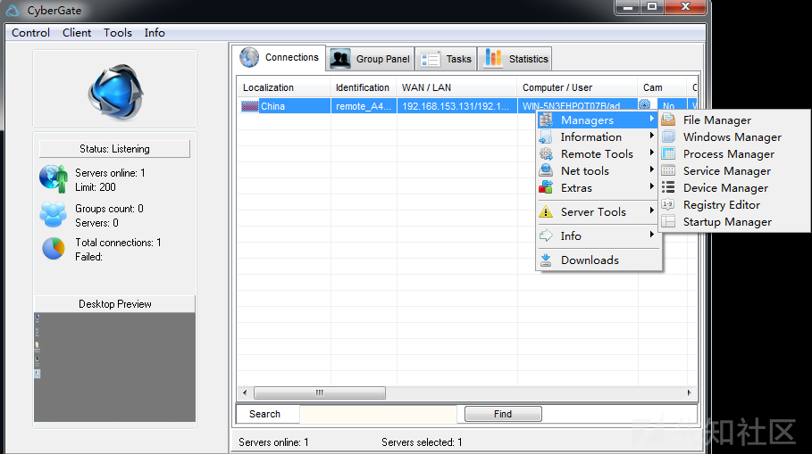](https://xzfile.aliyuncs.com/media/upload/picture/20240327085808-1390c79c-ebd5-1.png)

## 木马功能分析

通过分析，笔者发现 CyberGate RAT 项目为 Delphi 语言编写，因此 CyberGate RAT 生成的 CyberGate 木马端程序也是 Delphi 语言编写。

为了能够快速的对 CyberGate 木马端程序进行分析，笔者尝试查阅了网络中关于 Delphi 木马的分析技巧，并结合实际分析，发现 Delphi 程序分析与 C++ 程序分析的方法大体是差不多的，只是 Delphi 程序的反编译代码较 C++ 程序的反编译代码复杂一点而已。

### 生成调试信息

结合网络中关于 Delphi 程序的分析技巧，发现 IDR (Interactive Delphi Reconstructor) 工具对 Delphi 库函数的识别率比 IDA 高，因此可使用 IDR 生成 map 文件和 idc 文件，辅助 OD 工具、IDA 工具的后续分析。

相关截图如下：

[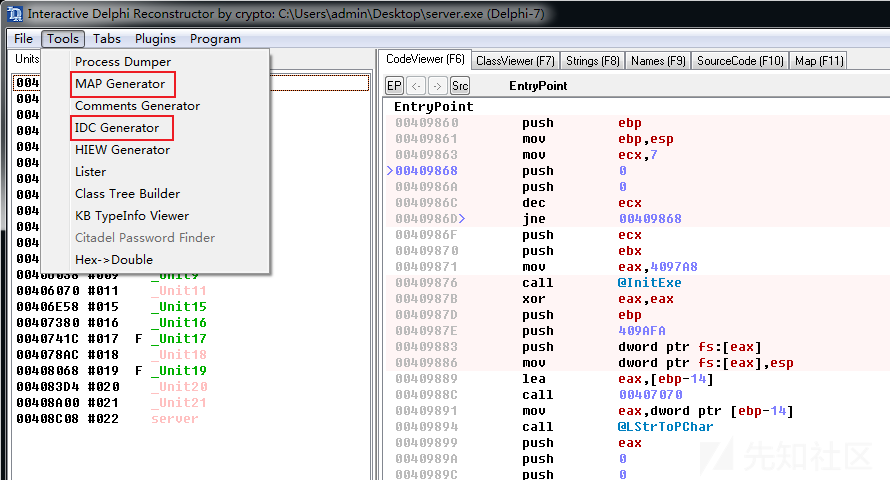](https://xzfile.aliyuncs.com/media/upload/picture/20240327085821-1ba60a64-ebd5-1.png)

### 木马整体执行逻辑

通过分析，笔者尝试对 CyberGate 木马端程序的执行逻辑进行了梳理，具体情况如下：

-   外层木马实体：
    -   使用 CyberGate RAT 生成的 CyberGate 木马端程序实际即为外层木马实体，此木马实体可自定义配置，例如：进程注入、自启动方式、反调试及反病毒等功能配置；
    -   解密提取配置信息及实际功能木马；
    -   根据配置信息对相关进程开展远程线程注入操作，注入的内容即为实际功能木马和运行所需的 shellcode 代码；
-   实际功能木马：
    -   UPX 加壳；
    -   根据配置信息发起外联通信；

### 配置信息解密

通过分析，笔者发现 CyberGate 木马端程序将调用 FindResource、LoadResource 等函数从 CyberGate 木马端程序中提取资源数据，资源名称为 “CG-CG-CG-CG”，相关代码截图如下：

[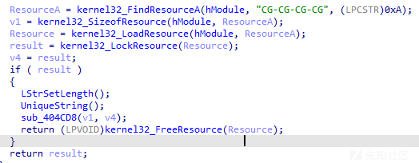](https://xzfile.aliyuncs.com/media/upload/picture/20240327085835-23a82efe-ebd5-1.png)

资源数据截图如下：

[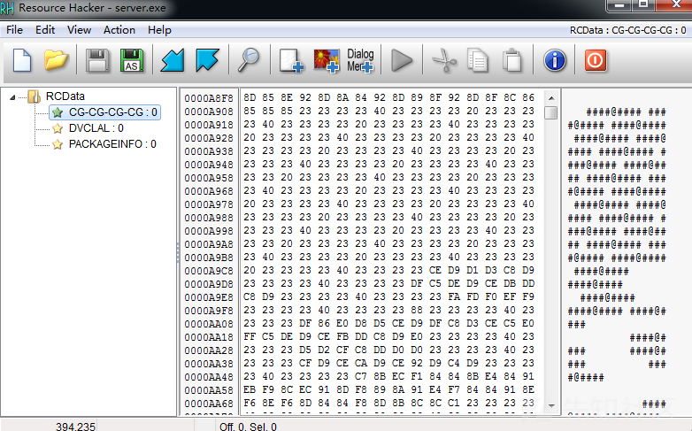](https://xzfile.aliyuncs.com/media/upload/picture/20240327085849-2c372278-ebd5-1.png)

进一步分析，笔者发现 CyberGate 木马端程序提取资源数据后，将调用异或算法进行解密，相关代码截图如下：

[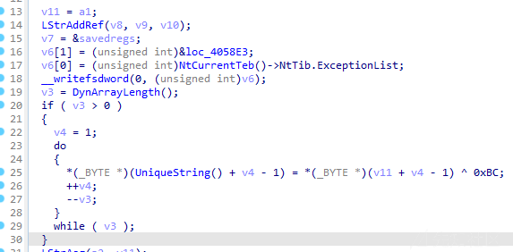](https://xzfile.aliyuncs.com/media/upload/picture/20240327085904-354af8c6-ebd5-1.png)

使用相同解密算法对其资源数据进行解密，发现可解密提取外联地址等信息，相关截图如下：

[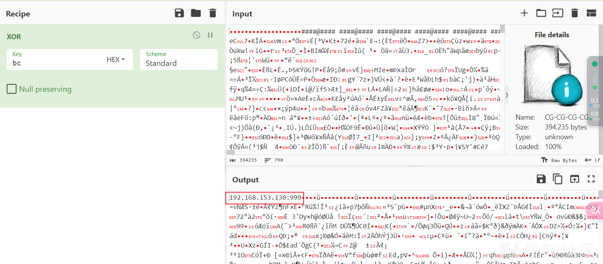](https://xzfile.aliyuncs.com/media/upload/picture/20240327085919-3dcc8078-ebd5-1.png)

### 远程线程注入

通过分析，笔者发现 CyberGate 木马端程序运行后，将根据配置信息中进程注入选项对相关进程开展远程线程注入操作，注入的内容即为实际功能木马和运行所需的 shellcode 代码。

相关代码截图如下：

[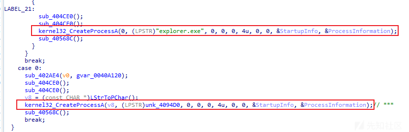](https://xzfile.aliyuncs.com/media/upload/picture/20240327085933-466ed8ca-ebd5-1.png)

[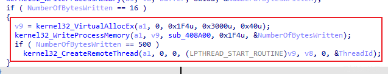](https://xzfile.aliyuncs.com/media/upload/picture/20240327085949-4fbedc4a-ebd5-1.png)

相关调试信息截图如下：

[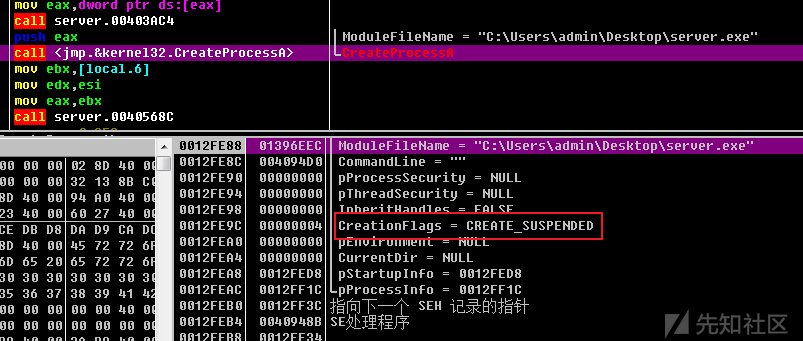](https://xzfile.aliyuncs.com/media/upload/picture/20240327090002-57a652da-ebd5-1.png)

### 执行实际功能木马

通过分析，笔者发现，当外层木马实体远程线程注入成功后，实际功能木马即会根据配置信息发起外联通信行为，相关截图如下：

[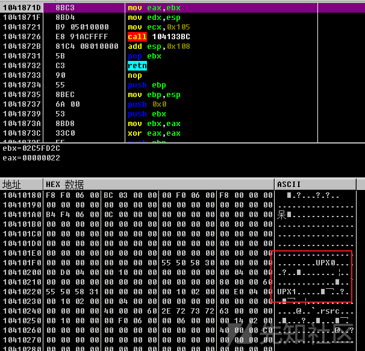](https://xzfile.aliyuncs.com/media/upload/picture/20240327090016-5fbe1b10-ebd5-1.png)

## 模拟构建配置信息提取脚本

为了更便利的对 CyberGate RAT 远控工具的配置信息进行提取及解密，笔者尝试根据生成 CyberGate 木马端程序时的自定义配置信息，编写了一个自动化解密及配置信息提取脚本（参考脚本：`https://github.com/foreni-packages/RATDecoders/blob/master/CyberGate.py`）。

实际运行效果如下：

[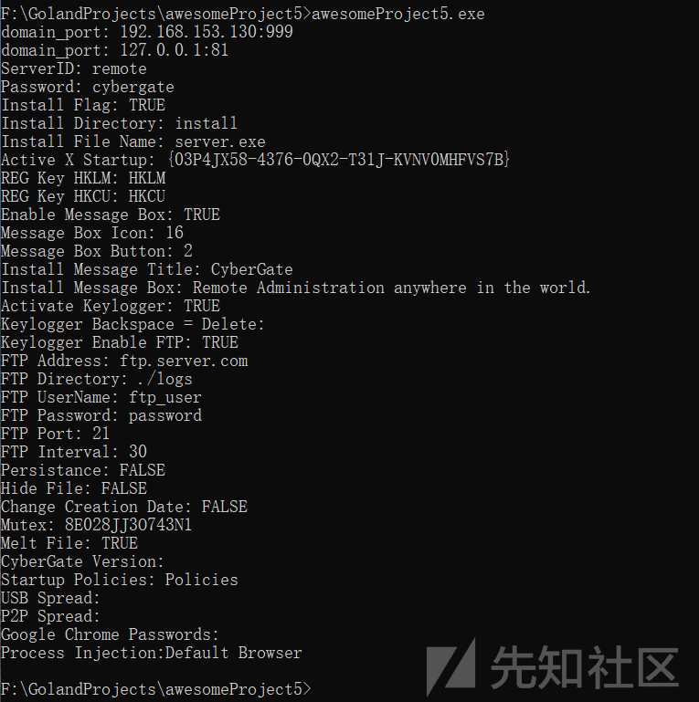](https://xzfile.aliyuncs.com/media/upload/picture/20240327090032-697b1932-ebd5-1.png)

对应 CyberGate RAT 远控工具配置界面截图如下：

[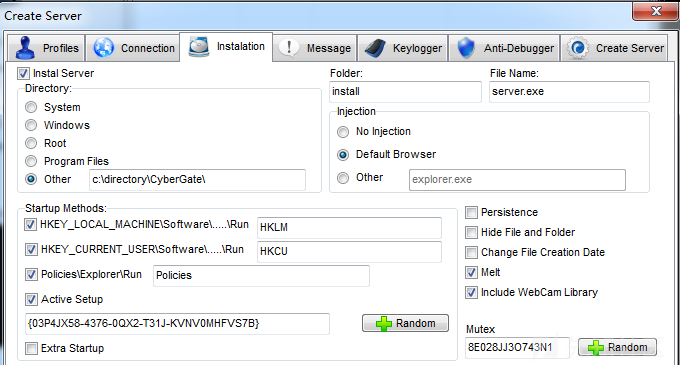](https://xzfile.aliyuncs.com/media/upload/picture/20240327090046-71a0ef60-ebd5-1.png)

### 代码实现

代码结构截图如下：

[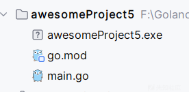](https://xzfile.aliyuncs.com/media/upload/picture/20240327090101-7a9cf7a8-ebd5-1.png)

-   main.go

```plain
package main

import (
    "bytes"
    "encoding/hex"
    "fmt"
    "io/ioutil"
)

func main() {
    content, err := ioutil.ReadFile("C:\\Users\\admin\\Desktop\\CG-CG-CG-CG")
    if err != nil {
        fmt.Println("Error reading file:", err)
        return
    }

    datas := bytes.Split(content, []byte("####@####"))

    key := 0xbc

    for i := 0; i < 19; i++ {
        domain_port := xorBytes(datas[i], byte(key))
        if hex.EncodeToString(domain_port) != "9c" {
            fmt.Println("domain_port:", string(domain_port))
        }
    }
    fmt.Println("ServerID:", returnconfig(xorBytes(datas[20], byte(key))))
    fmt.Println("Password:", returnconfig(xorBytes(datas[21], byte(key))))
    fmt.Println("Install Flag:", returnconfig(xorBytes(datas[22], byte(key))))
    fmt.Println("Install Directory:", returnconfig(xorBytes(datas[25], byte(key))))
    fmt.Println("Install File Name:", returnconfig(xorBytes(datas[26], byte(key))))
    fmt.Println("Active X Startup:", returnconfig(xorBytes(datas[27], byte(key))))
    fmt.Println("REG Key HKLM:", returnconfig(xorBytes(datas[28], byte(key))))
    fmt.Println("REG Key HKCU:", returnconfig(xorBytes(datas[29], byte(key))))
    fmt.Println("Enable Message Box:", returnconfig(xorBytes(datas[30], byte(key))))
    fmt.Println("Message Box Icon:", returnconfig(xorBytes(datas[31], byte(key))))
    fmt.Println("Message Box Button:", returnconfig(xorBytes(datas[32], byte(key))))
    fmt.Println("Install Message Title:", returnconfig(xorBytes(datas[33], byte(key))))
    fmt.Println("Install Message Box:", returnconfig(xorBytes(datas[34], byte(key))))
    fmt.Println("Activate Keylogger:", returnconfig(xorBytes(datas[35], byte(key))))
    fmt.Println("Keylogger Backspace = Delete:", returnconfig(xorBytes(datas[36], byte(key))))
    fmt.Println("Keylogger Enable FTP:", returnconfig(xorBytes(datas[37], byte(key))))
    fmt.Println("FTP Address:", returnconfig(xorBytes(datas[38], byte(key))))
    fmt.Println("FTP Directory:", returnconfig(xorBytes(datas[39], byte(key))))
    fmt.Println("FTP UserName:", returnconfig(xorBytes(datas[41], byte(key))))
    fmt.Println("FTP Password:", returnconfig(xorBytes(datas[42], byte(key))))
    fmt.Println("FTP Port:", returnconfig(xorBytes(datas[43], byte(key))))
    fmt.Println("FTP Interval:", returnconfig(xorBytes(datas[44], byte(key))))
    fmt.Println("Persistance:", returnconfig(xorBytes(datas[59], byte(key))))
    fmt.Println("Hide File:", returnconfig(xorBytes(datas[60], byte(key))))
    fmt.Println("Change Creation Date:", returnconfig(xorBytes(datas[61], byte(key))))
    fmt.Println("Mutex:", returnconfig(xorBytes(datas[62], byte(key))))
    fmt.Println("Melt File:", returnconfig(xorBytes(datas[63], byte(key))))
    fmt.Println("CyberGate Version:", returnconfig(xorBytes(datas[67], byte(key))))
    fmt.Println("Startup Policies:", returnconfig(xorBytes(datas[69], byte(key))))
    fmt.Println("USB Spread:", returnconfig(xorBytes(datas[70], byte(key))))
    fmt.Println("P2P Spread:", returnconfig(xorBytes(datas[71], byte(key))))
    fmt.Println("Google Chrome Passwords:", returnconfig(xorBytes(datas[73], byte(key))))
    Process_Injection := string(xorBytes(datas[57], byte(key)))
    if Process_Injection == "0" {
        fmt.Println("Process Injection:Disabled")
    } else if Process_Injection == "1" {
        fmt.Println("Process Injection:Default Browser")
    } else if Process_Injection == "2" {
        fmt.Println("Process Injection:", string(xorBytes(datas[58], byte(key))))
    }
}

func returnconfig(data []byte) string {
    if hex.EncodeToString(data) == "9c" {
        return ""
    } else {
        return string(data)
    }
}

func xorBytes(data []byte, key byte) []byte {
    output := make([]byte, len(data))
    for i := 0; i < len(data); i++ {
        output[i] = data[i] ^ key
    }
    return output
}
```

## 通信模型分析

通过分析，笔者发现此版本的 CyberGate RAT 通信数据包并未使用 TLS 通信，而是直接使用的 socket 套接字通信，通过对其通信数据包进行分析，梳理 CyberGate RAT 通信模式如下：

-   Server To Client
    -   标志 16 进制数据：**7c0a**
    -   16 进制数据中，**7c0a** 前的 16 进制数据为明文，**7c0a** 后的 16 进制数据为加密内容
    -   **7c0a** 前的明文数据为数字，则代表 **7c0a** 后的 16 进制数据长度
    -   加密算法：RC4+Zlib
    -   RC4 解密后，若解密后数据中包含 **“@@XXXXXXXXXX@@” 字符串**，则解密成功
-   Client To Server
    -   标志 16 进制数据：**0d0a**
    -   所有通信 16 进制数据中均会在末尾携带 **0d0a**
    -   若末尾携带的数据为**字符串 “###@@@”**+**16 进制数据 0d0a**，则**字符串 “###@@@”** 前的数据为加密内容
    -   加密算法：**修改了字符集的 Base64 算法**

相关截图如下：

[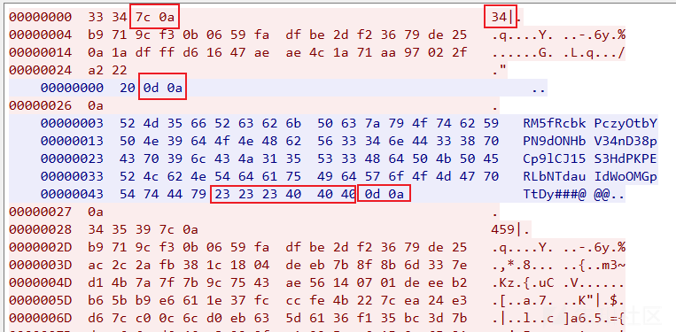](https://xzfile.aliyuncs.com/media/upload/picture/20240327090120-85ebf5f0-ebd5-1.png)

通信模型详细剖析：

```plain
*************Server To Client*************
#加密数据：载荷长度34==0x22
00000000  33 34 7c 0a                                        34|.
00000004  b9 71 9c f3 0b 06 59 fa  df be 2d f2 36 79 de 25   .q....Y. ..-.6y.%
00000014  0a 1a df ff d6 16 47 ae  ae 4c 1a 71 aa 97 02 2f   ......G. .L.q.../
00000024  a2 22                                              ."
#1.RC4解密
#载荷数据
b9719cf30b0659fadfbe2df23679de250a1adfffd61647aeae4c1a71aa97022fa222
#RC4解密数据：16进制“4040585858585858585858584040” == 字符串“@@XXXXXXXXXX@@”
404058585858585858585858404078014bae4c4a2d4a4f2c49ad89ac010020650508

#2.Zlib解压
#载荷数据
78014bae4c4a2d4a4f2c49ad89ac010020650508
#Zlib解压数据
6379626572676174657c597c
#对应字符串：cybergate|Y|

*************Client To Server*************
#加密数据
00000003  52 4d 35 66 52 63 62 6b  50 63 7a 79 4f 74 62 59   RM5fRcbk PczyOtbY
00000013  50 4e 39 64 4f 4e 48 62  56 33 34 6e 44 33 38 70   PN9dONHb V34nD38p
00000023  43 70 39 6c 43 4a 31 35  53 33 48 64 50 4b 50 45   Cp9lCJ15 S3HdPKPE
00000033  52 4c 62 4e 54 64 61 75  49 64 57 6f 4f 4d 47 70   RLbNTdau IdWoOMGp
00000043  54 74 44 79 23 23 23 40  40 40 0d 0a               TtDy###@ @@..

#1.Base64解密
#载荷数据
524d35665263626b50637a794f746259504e39644f4e48625633346e443338704370396c434a313553334864504b5045524c624e546461754964576f4f4d477054744479
#Base64解码数据
6d61696e696e666f7c6379626572676174657c313134323333326f31304570346765464e6d59577679384a783261643377737c
#对应字符串maininfo|cybergate|1142332o10Ep4geFNmYWvy8Jx2ad3ws|
```

梳理相关算法密钥信息如下：

-   RC4 算法
    -   key："njgnjvejvorenwtrnionrionvironvrnvcg230"
-   Base64 算法（**备注：Base64 默认字符集：“A-Za-z0-9+/=”**）
    -   自定义字符集："0123456789ABCDEFGHIJKLMNOPQRSTUVWXYZabcdefghijklmnopqrstuvwxyz+/"

## 模拟构建通信解密程序

为了更便利的对 CyberGate RAT 远控工具的通信数据进行解密，笔者尝试编写了一个解密程序，可对 CyberGate RAT 通信数据进行批量解密，解密效果如下：

[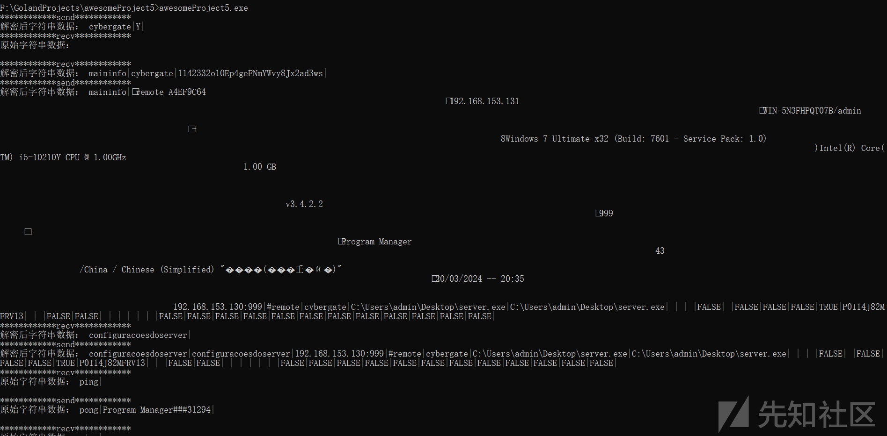](https://xzfile.aliyuncs.com/media/upload/picture/20240327090139-914a1198-ebd5-1.png)

自动化脚本输入文件格式如下：**（备注：直接从 wireshark 导出”C Arrays“数据即可）**

[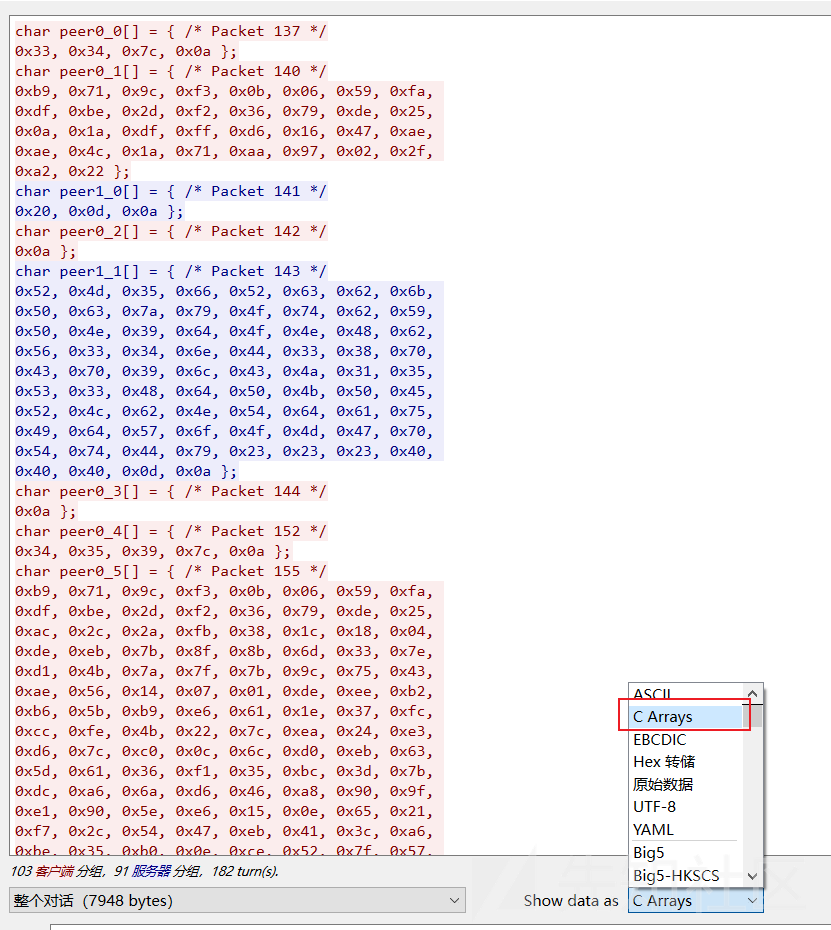](https://xzfile.aliyuncs.com/media/upload/picture/20240327090159-9d172d94-ebd5-1.png)

### 代码实现

代码结构截图如下：

[](https://xzfile.aliyuncs.com/media/upload/picture/20240327090219-a91a9252-ebd5-1.png)

-   main.go

```plain
package main

import (
    "awesomeProject5/common"
    "bytes"
    "encoding/hex"
    "fmt"
    "io/ioutil"
    "strconv"
    "strings"
)

func main() {
    content, err := ioutil.ReadFile("C:\\Users\\admin\\Desktop\\22.txt")
    if err != nil {
        fmt.Println("Error reading file:", err)
        return
    }
    data := string(content)

    data = strings.ReplaceAll(data, "\n0x", "0x")
    datas := strings.Split(data, "\n")

    decryptedText := []byte{}
    buffer := ""
    for _, str := range datas {
        if str == "" {
            break
        }
        buf := strings.ReplaceAll(strings.Split(strings.Split(str, " };")[0], "*/0x")[1], ", 0x", "")
        buffer = buffer + buf
        if strings.Contains(buffer, "7c0a") {
            len_hex, _ := hex.DecodeString(strings.Split(buffer, "7c0a")[0])
            data_hex, _ := hex.DecodeString(strings.Split(buffer, "7c0a")[1])
            len_data, _ := strconv.Atoi(string(len_hex))
            if len(data_hex) < len_data {
                continue
            }
            fmt.Println("************send************")
            //fmt.Println("原始16进制数据：", buffer)
            if strings.Contains(buffer, "232323") {
                data_hex, _ = hex.DecodeString(buffer)
                fmt.Println("原始字符串数据：", string(data_hex))
            } else {
                decryptedText = common.DecryptData_ServerToClient(data_hex)
                //fmt.Println("解密后16进制数据：", hex.EncodeToString(decryptedText))
                if bytes.HasPrefix(decryptedText, []byte("imgdesk|")) {
                    img_name := common.CalculateMD5(string(decryptedText)) + ".jpg"
                    fmt.Println("保存图片至" + img_name)
                    common.Writefile(img_name, string(bytes.Split(decryptedText, []byte("imgdesk|"))[1]))
                } else {
                    fmt.Println("解密后字符串数据：", string(decryptedText))
                }
            }
        } else if strings.Contains(buffer, "0d0a") {
            if strings.Contains(buffer, "232323404040") {
                data_hex, _ := hex.DecodeString(strings.Split(buffer, "232323404040")[0])
                fmt.Println("************recv************")
                //fmt.Println("原始16进制数据：", buffer)
                decryptedText = common.DecryptData_ClientToServer(data_hex)
                //fmt.Println("解密后16进制数据：", hex.EncodeToString(decryptedText))
                fmt.Println("解密后字符串数据：", string(decryptedText))
            } else {
                fmt.Println("************recv************")
                //fmt.Println("原始16进制数据：", buffer)
                data_hex, _ := hex.DecodeString(buffer)
                fmt.Println("原始字符串数据：", string(data_hex))
            }
        }
        buffer = ""
    }
}
```

-   common.go

```plain
package common

import (
    "bytes"
    "compress/zlib"
    "crypto/md5"
    "crypto/rc4"
    "encoding/base64"
    "encoding/hex"
    "fmt"
    "io"
    "io/ioutil"
    "os"
)

func rc4EncryptDecrypt(key, data []byte) []byte {
    c, _ := rc4.NewCipher(key)

    result := make([]byte, len(data))
    c.XORKeyStream(result, data)

    return result
}

func DecryptData_ServerToClient(plaintext []byte) []byte {
    key := []byte("njgnjvejvorenwtrnionrionvironvrnvcg230")
    ciphertext := rc4EncryptDecrypt(key, plaintext)
    ciphertext = bytes.TrimPrefix(ciphertext, []byte("@@XXXXXXXXXX@@"))
    data, _ := zlib_decompress(ciphertext)
    return data
}

func DecryptData_ClientToServer(encoded []byte) []byte {
    // 自定义字符集
    customCharset := "0123456789ABCDEFGHIJKLMNOPQRSTUVWXYZabcdefghijklmnopqrstuvwxyz+/"
    encoder := base64.NewEncoding(customCharset).WithPadding(base64.NoPadding)

    // 解码自定义Base64格式
    decoded, err := encoder.DecodeString(string(encoded))
    if err != nil {
        fmt.Println("解码失败:", err)
        return nil
    }
    return decoded
}

func zlib_decompress(compressedData []byte) ([]byte, error) {
    buf := bytes.NewBuffer(compressedData)
    r, err := zlib.NewReader(buf)
    if err != nil {
        return nil, fmt.Errorf("error creating zlib reader: %v", err)
    }
    defer r.Close()

    decompressedData, err := ioutil.ReadAll(r)
    if err != nil {
        return nil, fmt.Errorf("error decompressing data: %v", err)
    }

    return decompressedData, nil
}

func CalculateMD5(input string) string {
    hasher := md5.New()
    hasher.Write([]byte(input))
    md5Hash := hex.EncodeToString(hasher.Sum(nil))
    return md5Hash
}

func checkPathIsExist(filename string) bool {
    var exist = true
    if _, err := os.Stat(filename); os.IsNotExist(err) {
        exist = false
    }
    return exist
}

func Writefile(filename string, buffer string) {
    var f *os.File
    var err1 error

    if checkPathIsExist(filename) {
        f, err1 = os.OpenFile(filename, os.O_CREATE, 0666)
    } else {
        f, err1 = os.Create(filename)
    }
    _, err1 = io.WriteString(f, buffer)
    if err1 != nil {
        fmt.Println("写文件失败", err1)
        return
    }
    _ = f.Close()
}
```
