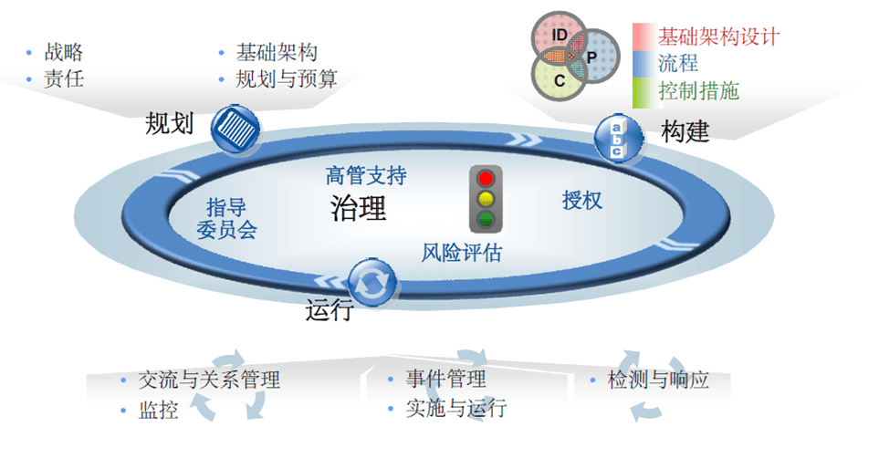
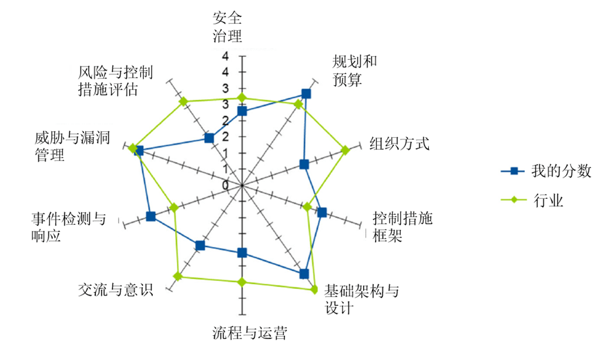
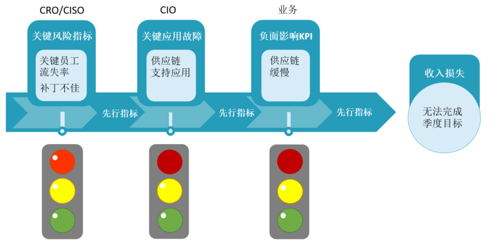

# 向上汇报：将安全与企业绩效关联起来的 5 个技巧

安全人员都在苦苦寻求如何将安全和合规方面的工作与公司业务关联起来。本文介绍了 5 个技巧帮助安全管理人员更好向管理层传达工作价值。

  

笔者在上一篇文[《向上汇报：安全人员如何跟老板申请 2024 年预算？》](http://mp.weixin.qq.com/s?__biz=MzUyOTkwNTQ5Mg==&mid=2247488738&idx=1&sn=be2760d64f5a9fd7ad5a801a5a3e077f&chksm=fa58b6d9cd2f3fcf793eb5438144d096eba9051882f62ef15005a4694b4621326ac0f46d2e36&scene=21#wechat_redirect)谈到在面向管理层申请预算的时候，需要回答最本质的问题就是，安全投入将带来什么样的成果。本文将重点讲述一些让安全和企业业务绩效关联的实用技巧，希望对广大安全从业者有所帮助。

  

**技巧 1：正式制定安全计划，让管理层看到安全工作规范性**

  

安全人员必须正式制定其安全计划，以确定与业务相关性。这个正式计划是可重复进行且可衡量的，包括治理、计划、构建和运行阶段：  

  

**■治理阶段：确定职权与责任。**此阶段由治理、安全和合规性流程组成，包含了所有基于安全的职能角色，包括执行报告和支持、授权、计划成熟度评估、指导委员会报告、章程制定、安全评估、沟通、补救和测试。

  

**■计划阶段：制定其长期计划，确定不同角色和职责。**然后制定年度计划，再制定预算提案流程，并且年度计划中的安全部分应与企业的安全管理策略相关。

  

**■构建阶段：控制措施、基础架构设计和流程正式化。**采取控制措施是为了保护组织机构免受攻击，合理预期的安全，例如边界安全防护，终端安全防护，云工作保护、密码管理等。流程的正式化会推动任何计划的成熟。构建阶段还包括基础架构设计和技术选择。

  

**■运行阶段：确定计划的运行要素，包括事件管理、运行、实施、执行和监视。**运行阶段占用了预算的大部分支出，而其他三个阶段则确保适当支出预算。

图 1  安全管理活动周期

  

**技巧 2：评估安全的成熟度，让管理层了解当前组织安全状态与行业差距**

  

可以使用成熟度量表来衡量正式计划，以此来识别判断当前安全建设差距和改进的机会，可以帮助组织机构评估其计划的成熟度。

 图 2  安全成熟度衡量示例

  

**技巧 3：将关键安全指标与关键绩效指标映射起来**

  

不管是从概念上，还是直观来看，安全管理与公司业务之间的关系都应该是显而易见的。**因为对安全的管理不当会导致业务中断或者业绩不佳。但是，大多数组织机构都无法对这种关系进行度量。结果就是，安全的业务人员尚不清楚很多运营安全管理活动的效益在哪儿。**

  

为解决这些问题，企业应制定可靠的、独立的业务绩效指标，而安全管理工作则应制定可直接影响这些业务绩效的**可信的、独立的安全指标**，这就需要深入了解安全事件是如何影响业务绩效的。KRI**（Key Risk Indicators）是衡量业务绩效安全的先行指标。**

  

如下图所示，组织的系统承载着关键的供应链应用程序，而该组织有 2 个指标，分别是 KRI 和 KPI。通过 KRI 就可以衡量关键系统的补丁程序级别。通过 KPI，可以衡量供应链的运行情况。需要注意的是，供应链 KPI 是业务指标，而不是安全指标。

  

当补丁的 KRI 从绿色变为黄色或红色时，这是供应链可能遇到故障的一个先行指示。反过来，这将影响供应链的 KPI，这是可能影响该公司业务收入的先行指标。这种关系和映射可以向老板、管理层、业务主管证明为什么他们需要注意 KRI，并可以帮助他们基于这些 KRI 做出更好的业务决策。

图 3  先行指标示例

  

良好的关键安全指标既简单又可衡量，并且会直接影响到多个关键绩效指标。另一个良好 KRI 的示例是关键人员流动。关键人员的流失增加了知识流失和人员更换的安全。它增加了意外损失、效率降低和潜在的职责分离问题的安全。这些安全又可能导致关键系统停机或故障、无法满足合规性问题。这些因素中的任何一个因素都会反过来影响 KPI，例如准时交付。

  

大多数组织机构现在都已经制订了大量的安全指标。尽管这些指标对于安全部门内部而言非常有价值，但它们对业务决策者几乎没有价值。唯一的有效方法是将它们组织在一起，**形成一系列数量最少、而又连贯的 KRI，而且可以映射到 KPI**（注意：KRI 是指安全运营指标，KPI 是指业务指标）。

  

这种映射的目的是促进对话并就最相关的措施及其影响达成协议。这种映射的制定，是基于安全专家和业务相关人员的讨论来制定。这将会立即提高企业安全管理工作与业务的相关性，加强业务部门的安全管理意识。

  

**技巧 4：将安全计划与公司目标联系起来**

使用偶发性的、网络上公开的网络安全事件来获得高管的支持是行不通的。**高管不想听到，如果他们不投资安全保护，一切都会变得多么糟糕。用投资回报来说明问题同样没有用，很难说清楚安全价值。****必须要证明业务价值，直接将公司目标与安全计划关联起来，然后报告进度就可以实现这一点。**该方案的重要性越高，它展示给高管人员的价值就越大。例如，一家大型电力公司的安全人员在公司方案和方向说明中，直接将安全和安全工作与业务环境联系起来。该电力公司的高管已经制定了一项五年战略计划。CIO 根据这些文件来创建安全战略计划，并从安全角度出发，呼应了许多重要的业务主题，将这些主题和特定方案扩展到安全和安全团队的章程、五年战略计划和预算要求，就简单多了。

  

**技巧 5：与高管沟通时不要使用安全运营指标**

  

安全运营指标不适合在业务主管级别（高管）使用，因为业务人员缺乏上下文和培训，无法理解安全运营指标在业务环境中的意义。应在和同级和下属在一起时，才使用运营指标。

  

当然，安全专业人员应在有请求时提供详细信息，但他们**应避免浪费时间试图向业务主管人员讲解详细安全指标。他们应该尝试向业务主管提供有关业务环境的信息。**

  

高管们想知道：**我们面临着哪些安全？我们的状况如何？我们对此该怎么办？很少有具体的安全指标能引起以业务为导向的高管共鸣。**

  

