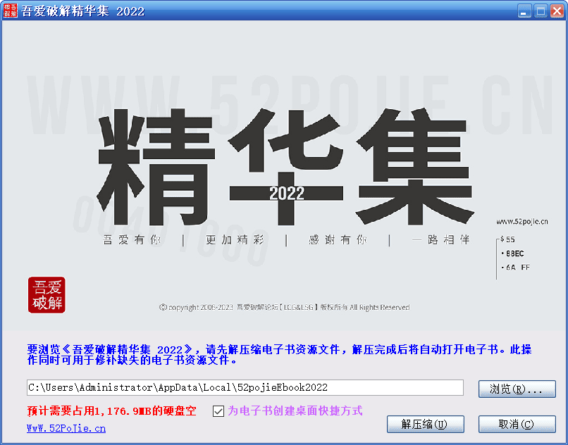

# 《吾爱破解精华集 2022》自解压包源代码 (适合新人学习) - 『编程语言区』 - 吾爱破解 - LCG - LSG | 安卓破解 | 病毒分析 | www.52pojie.cn

*本帖最后由 烟 99 于 2023-3-14 10:41 编辑*  

很早以前汉化 InnoSetup 的大佬 SkyGz 在打包制作增强版的时候就使用 ISSkin 插件制作了安装界面随机皮肤效果，但并没有披露制作方法，网上也没有相关案例，我猜测 SkyGz 应该是使用 Delphi 的数组来实现的，随机取一个数组元素，赋值给其他变量来实现随机加载皮肤的效果。这次的电子书自解压包也使用了这种效果，我们来看看如何实现。

## 基本信息

源码名称：《吾爱破解精华集 2022》电子书自解压文件 InnoSetup 安装脚本  
源码编写：吾爱破解 @烟 99

## 基本介绍

此安装脚本主要目的是实现电子书资源文件自解压，同时通过 \[code\] 段自定义 Pascal 脚本来实现自定义界面、判断文件是否存在、安装后显示解压文件夹（已注释）、运行电子书、随机皮肤等功能，使用 lzma2 极限压缩算法，不是很难，新人自己改几下就能学会。

## 如何编译

本脚本基于 Restools 汉化修改的 InnoSetup 5.5.1.ee2 ANSI 版本编译器编译，此版本诞生于 2012 年，虽然年代久远，但此版本编译出的 exe 具有运行稳定、不易误报、防止非法解包等优点。尽管源码未使用 restools 后续添加的指令，但出于稳定考虑，强烈建议使用此版本编译器编译，如果你没有此版本的 InnoSetup 编译器，可通过以下链接下载：  
下载链接：[https://www.lanzoux.com/b0caqej9g](https://www.lanzoux.com/b0caqej9g)  
访问密码：52pj  
我们提供的是热心网友制作的多版本整合版，安装时要使用自定义安装，选择“ANSI”版本下的“拓展防解包（Restools）”这个版本，分享文件夹里有安装图解 Word 文本，不会的看 word 文本。  
安装好编译器后，请将要打包的文件放在 {APP} 文件夹中，不想放在那个文件夹，请自行修改脚本参数，另外 splash.bmp 和 icon.ico 是自解压包头图和程序图标，如需自定义，也请自行修改脚本参数。ISSkin 皮肤插件及皮肤文件属于临时文件，临时文件或临时文件夹要用 dontcopy 标记，具体请参考 InnoSetup 帮助文档，不再赘述。

## 版权声明

本脚本最终版权归吾爱破解论坛会员烟 99 所有，脚本仅供个人学习，如需商业使用请联系我们。  
联系方式：service@52pojie.cn

## 效果预览



## 源码下载

下载链接 https://wwio.lanzouf.com/iz1bP0puec2j  
访问密码：52pj

## 源码预览

```delphi
;设置define命令，如果没有脚本修改方面的需要，只需修改define命令里的项目基本信息即可。

#define MyAppName "吾爱破解精华集 2022"           ;项目中文名称
#define MyAppEnglishName "52pojieEbook2022"       ;项目英文名称
#define MyAppVersion "1.0.0"                                                               ;版本号
#define MyAppPublisher "吾爱破解论坛"                                                      ;项目出品者
#define MyAppEnglishPublisher "吾爱破解论坛"                                               ;项目出品者
#define MyAppEnglishPublisher "52pojie"                                                    ;项目出品者英文名
#define MyAppURL "https://www.52pojie.cn/"                                                 ;项目网站
#define MyAppExeName "52pojieEbook2022.exe"                                                ;项目主程序
#define UnpackDir "{localappdata}"                                                         ;项目解压目录
#define EXEIcon "icon.ico"                                                                 ;项目EXE图标
#define WizardImage "splash.bmp"                                                           ;项目头图文件
#define Compression "lzma2"                                                                           ;项目文件压缩算法
//#define Compression "none"
#define Copyright "Copyright 2008-2023 52pojie.cn [ LCG & LSG ] All Rights Reserved."      ;项目文件版权信息
;InnoSetup提供了很多种压缩算法，当前使用的是lzma2极限压缩，其他压缩算法请参见InnoSetup帮助文档

;以下define参数用于判断解压目录是否存在项目文件
#define objectfile "chrome_100_percent.pak"                                                ;此处填写判断目标文件名
#define exemd5 "C56BC01C88F2FD186AE22F10B1BD5900"                                          ;此处填写目标文件名MD5值

;以下是配置InnoSetup基本信息的[setup]段，修改比较频繁的参数已通过define命令来实现，没有特殊要求请不随意修改。

[setup]
;项目名称
AppName={#MyAppName}

;项目版本
AppVersion={#MyAppVersion}
AppVerName={#MyAppName} {#MyAppVersion}

;项目出品人
AppPublisher={#MyAppPublisher}

;项目网站
AppPublisherURL={#MyAppURL}
AppSupportURL={#MyAppURL}
AppUpdatesURL={#MyAppURL}

;项目默认解压目录
DefaultDirName={#UnpackDir}\{#MyAppEnglishName}

;项目默认程序组
DefaultGroupName={#MyAppName}

;项目自解压包输出文件名
OutputBaseFilename={#MyAppEnglishName}

;项目自解压包压缩算法
Compression={#Compression}

;禁用InnoSetup卸载功能
Uninstallable=false

;禁用相关安装页面
DisableReadyPage=true
DisableWelcomePage=yes
DirExistsWarning=no

;定义自解压程序头图
WizardImageFile={#WizardImage}

;定义项目程序EXE文件说明
VersionInfoDescription={#MyAppEnglishName}

;定义项目程序EXE产品名称
VersionInfoProductName={#MyAppEnglishName}

;定义项目程序EXE文件版本
VersionInfoVersion={#MyAppVersion}

;定义项目程序EXE文本形式版本
VersionInfoTextVersion={#MyAppVersion}

;定义项目程序EXE产品版本
VersionInfoProductVersion={#MyAppVersion}

;定义项目程序EXE文件出品公司
VersionInfoCompany={#MyAppEnglishPublisher}

;程序EXE文件版权信息
VersionInfoCopyright={#Copyright}

;定义项目程序EXE图标
SetupIconFile={#EXEIcon}

[Languages]
Name: default; MessagesFile: compiler:Default.isl

[Files]
;当前{app}文件夹是空的，空文件夹无法编译，请自行将电子书文件放进{app}文件夹。
Source: {app}\*; DestDir: {app}; Flags: ignoreversion recursesubdirs createallsubdirs
;ISSkin皮肤插件及皮肤文件属于临时文件，临时文件或临时文件夹要用dontcopy标记，具体请参考InnoSetup帮助文档，不再赘述。
Source: {tmp}\*.*; Flags: dontcopy
; 注意: 不要在任何共享的系统文件使用 "Flags: ignoreversion"

[Tasks]
Name: desktopicon; Description: 为电子书创建桌面快捷方式; GroupDescription: {cm:AdditionalIcons}

[Icons]
Name: {commondesktop}\{#MyAppName}; Filename: {app}\{#MyAppExeName}; Tasks: desktopicon

;实行自定义系统消息
[Messages]
DiskSpaceMBLabel=预计需要占用[mb]MB的硬盘空间。
SetupAppTitle={#MyAppName}
SetupWindowTitle={#MyAppName}
DirExistsTitle=电子书文件已存在
DirExists=文件夹:%n%n%1%n%n已经存在。%n若继续执行解压缩操作，将会覆盖旧文件，是否继续？
StatusExtractFiles=正在解压缩资源文件...
StatusRunProgram=正在结束解压缩任务...
StatusRollback=正在清理文件...
ExitSetupTitle=取消解压缩
ExitSetupMessage=解压缩未完成%n%n您可以以后再运行本自解压程序来解压缩电子书文件。%n但是，如果您正在解压过程中取消解压任务将会删除已解压的文件。%n%n确定继续退出吗？
ErrorCreatingDir=自解压程序不能创建目录“%1”。
SetupFileMissing=自解压目录中的文件 %1 丢失。请修正这个问题或获取一个新的程序副本。
SetupFileCorrupt=文件被破坏。请获取一个新的程序副本。
SetupFileCorruptOrWrongVer=文件被破坏，或是与这个自解压程序的版本不兼容。请修正这个问题或获取新的程序副本。
InvalidParameter=无效的命令行参数: %n%n%1
SetupAlreadyRunning=自解压程序正在运行。
WindowsVersionNotSupported=这个程序不支持该版本的计算机运行。
WindowsServicePackRequired=这个程序要求%1服务包%1或更高。
NotOnThisPlatform=这个程序将不能运行于 %1。
OnlyOnThisPlatform=这个程序必须运行于 %1。
OnlyOnTheseArchitectures=这个程序只能在为下列处理器结构设计的 Windows 版本中进行安装:%n%n%1
MissingWOW64APIs=你正在运行的 Windows 版不包含执行 64 位自解压程序所需的功能。要修正这个问题，请安装 Service Pack %1。
WinVersionTooLowError=这个程序需要 %1 版本 %2 或更高。
WinVersionTooHighError=这个程序不能安装于 %1 版本 %2 或更高。
AdminPrivilegesRequired=在安装这个程序时您必须以管理员身份登录。
PowerUserPrivilegesRequired=在安装这个程序时您必须以管理员身份或有权限的用户组身份登录。
SetupAppRunningError=自解压程序发现 %1 当前正在运行。%n%n请先关闭所有运行的窗口，然后单击“确定”继续，或按“取消”退出。

[CustomMessages]
AdditionalIcons=
ProgramOnTheWeb=%1

[Code]

//  声明本次安装脚本编译时需要用到的API
const
  MF_BYPOSITION=$400;
//  调用user32.dll的DeleteMenu函数，用于移除“关于安装程序”菜单项
function DeleteMenu(HMENU: HWND; uPosition: UINT; uFlags: UINT): BOOL;
  external 'DeleteMenu@user32.dll stdcall';

//  调用user32.dll的DeleteMenu函数，用于获取窗口的系统菜单句柄
function GetSystemMenu(HWND: hWnd; bRevert: BOOL): HWND;
  external 'GetSystemMenu@user32.dll stdcall';

//  调用isskin.dll的LoadSkin函数
procedure LoadSkin(lpszPath: String; lpszIniFileName: String);
external 'LoadSkin@files:isskin.dll stdcall';

//  调用isskin.dll的UnloadSkin函数
procedure UnloadSkin();
external 'UnloadSkin@files:isskin.dll stdcall';

//  调用isskin.dll的ShowWindow函数
function ShowWindow(hWnd: Integer; uType: Integer): Integer;
external 'ShowWindow@user32.dll stdcall';

 //定义全局变量
 var
  unpackbutton,cancelunpackbutton: TNewButton;                //解压缩按钮、取消解压按钮
  website:TNewStaticText;                                     //URL链接标签，用于访问吾爱破解首页
  ResultCode: Integer;                                        //返回值

//点击"解压缩"按钮的操作函数
procedure unpackbuttonOnClick(Sender: TObject);
//根据电子书自解压程序的设计思路，执行解压缩操作，需要先判断解压目录是否存在电子书文件，根据文件名和MD5判断
//是不是电子书的文件，两个条件缺一不可，全部满足才会触发询问是否覆盖文件的对话框。
//注意：修改判断目标文件名和MD5请修改前面的deifine参数，请不要修改此处！
//定义局部变量
var
  objectmd5,exemd5: string;                                   //被测文件MD5值和指定MD5变量
  iResult: Integer;                                           //返回值
begin
    if FileExists(ExpandConstant('{app}\{#objectfile}')) = true then               //这里用chrome_100_percent.pak来判断
      begin                              
        objectmd5 := GetMD5OfFile(ExpandConstant('{app}\{#objectfile}'));
        exemd5 := '{#exemd5}';
        iResult :=CompareText(objectmd5,exemd5);
        if iResult = 0 then
          begin
            if MsgBox('发现当前解压目录含有电子书文件，继续解压缩将会导致原文件覆盖，是否继续？', mbError, MB_YESNO)=IDYES then  //选择“是”直接解压。
             WizardForm.NextButton.OnClick(WizardForm);
          end
      else
       WizardForm.NextButton.OnClick(WizardForm);     //条件二不满足执行解压
      end
    else
      WizardForm.NextButton.OnClick(WizardForm);      //条件一不满足执行解压
end;

//点击"取消"按钮的操作函数
procedure cancelunpackOnClick(Sender: TObject);
begin
      WizardForm.CancelButton.OnClick(WizardForm);  //模拟点击Inno原生的"取消"按钮。
end;

//点击论坛URL网址按钮的操作函数
procedure websiteOnClick(Sender: TObject);

var
  ErrorCode: Integer;
begin
  if (MsgBox('即将访问{#MyAppPublisher}主页，是否继续？',mbConfirmation,MB_YESNO))=6 then
    begin
        ShellExec('open', '{#MyAppURL}', '', '', SW_SHOWNORMAL, ewNoWait, ErrorCode);
    end;
end;

//以下是安装脚本初始化函数
procedure InitializeWizard();
begin
  //移除"关于安装程序"菜单.
  //----------------------------------------------------
  DeleteMenu(GetSystemMenu(wizardform.handle,false),8,MF_BYPOSITION);
  DeleteMenu(GetSystemMenu(wizardform.handle,false),7,MF_BYPOSITION);
  //----------------------------------------------------

  //调整主窗口大小。
  //----------------------------------------------------
  WizardForm.ClientWidth :=800;
  WizardForm.ClientHeight :=600;
  //----------------------------------------------------

  //强制隐藏与UI无关控件。
  //----------------------------------------------------
  WizardForm.InnerPage.Hide;
  WizardForm.OuterNotebook.Hide;
  WizardForm.MainPanel.Hide;
  WizardForm.Bevel.Hide;
  WizardForm.Bevel1.Hide;
  WizardForm.BeveledLabel.Hide;
  WizardForm.SelectDirBitmapImage.Hide;
  WizardForm.PageDescriptionLabel.Hide;
  //----------------------------------------------------

  //隐藏默认不显示控件
  //----------------------------------------------------
  WizardForm.ProgressGauge.Hide;
  WizardForm.StatusLabel.Hide;
  WizardForm.FileNameLabel.Hide;

  //将所需子控件强制从Page控件中剥离。
  //----------------------------------------------------
  WizardForm.PageNameLabel.Hide;
  //以下是涉及到欢迎页面的控件。
  WizardForm.WizardBitmapImage.Parent:=WizardForm;
  //以下是涉及到选择目录页面的控件。
  WizardForm.DirEdit.Parent :=WizardForm;
  WizardForm.SelectDirBrowseLabel.Hide;
  WizardForm.SelectDirLabel.Parent :=  WizardForm;
  WizardForm.DirBrowseButton.Parent :=WizardForm;
  WizardForm.DiskSpaceLabel.Parent :=WizardForm;
  //以下是涉及到转载安装页面的控件。
  WizardForm.StatusLabel.Parent :=WizardForm;
  WizardForm.FileNameLabel.Parent :=WizardForm;
  WizardForm.ProgressGauge.Parent :=WizardForm;
  //----------------------------------------------------

  //处理"上一步"、"下一步"、"取消"按钮
  //----------------------------------------------------
  //将Inno原生上一步、下一步通过设置位移方式隐藏。
  WizardForm.BackButton.SetBounds(0,0,0,0);
  WizardForm.NextButton.SetBounds(0,0,0,0);
  //设置"取消"按钮位置。
  WizardForm.CancelButton.Left :=WizardForm.ClientWidth - 125;
  WizardForm.CancelButton.Top :=WizardForm.ClientHeight - 40;
  //插入一个"解压缩"按钮
  unpackbutton := TNewButton.Create(WizardForm);
  unpackbutton.Parent :=WizardForm;
  unpackbutton.SetBounds(WizardForm.CancelButton.Left - 130,WizardForm.CancelButton.Top,WizardForm.CancelButton.Width,WizardForm.CancelButton.Height);
  unpackbutton.Caption :='解压缩(&U)';
  unpackbutton.OnClick :=@unpackbuttonOnClick;
  //插入一个"取消"按钮
  cancelunpackbutton := TNewButton.Create(WizardForm);
  cancelunpackbutton.Parent :=WizardForm;
  cancelunpackbutton.SetBounds(WizardForm.CancelButton.Left,WizardForm.CancelButton.Top,WizardForm.CancelButton.Width,WizardForm.CancelButton.Height);
  cancelunpackbutton.Caption :='取消(&C)';
  cancelunpackbutton.OnClick :=@cancelunpackOnClick;

  //接下来开始配置各个控件的坐标。

  //电子书logo。
  WizardForm.WizardBitmapImage.SetBounds(0,0,800,441); 
  //解压目录文字标签控件坐标
  WizardForm.SelectDirLabel.Left :=35;
  WizardForm.SelectDirLabel.Top :=460;
  WizardForm.SelectDirLabel.Width :=WizardForm.ClientWidth -  WizardForm.SelectDirLabel.Left * 2;
  WizardForm.SelectDirLabel.Height :=35
  //解压目录输入框控件坐标
  WizardForm.DirEdit.Left :=WizardForm.SelectDirLabel.Left;
  WizardForm.DirEdit.Top :=WizardForm.SelectDirLabel.Top + 50;
  WizardForm.DirEdit.Width :=620;
  //解压缩目录浏览按钮控件坐标
  WizardForm.DirBrowseButton.Left :=WizardForm.CancelButton.Left;
  WizardForm.DirBrowseButton.Width :=unpackbutton.Width;
  WizardForm.DirBrowseButton.Top :=WizardForm.DirEdit.Top;
  //进度条控件坐标
  WizardForm.ProgressGauge.SetBounds(WizardForm.DirEdit.Left,WizardForm.DirEdit.Top,WizardForm.DirEdit.Width,WizardForm.DirEdit.Height);
  WizardForm.ProgressGauge.Width :=WizardForm.ClientWidth -  WizardForm.SelectDirLabel.Left * 2;
  //解压状态控件坐标
  WizardForm.StatusLabel.Left :=WizardForm.SelectDirLabel.Left;
  WizardForm.StatusLabel.Top :=WizardForm.SelectDirLabel.Top;
  //预计空间大小提示标签坐标
  WizardForm.DiskSpaceLabel.SetBounds(WizardForm.SelectDirLabel.Left,WizardForm.CancelButton.Top - 13,260,16);
  //正在解压缩文件名称控件坐标
  WizardForm.FileNameLabel.Left :=WizardForm.SelectDirLabel.Left;
  WizardForm.FileNameLabel.Top :=WizardForm.StatusLabel.Top + 20;
  WizardForm.FileNameLabel.Width :=WizardForm.DirEdit.Width;

  //插入一个论坛网址标签
  //----------------------------------------------------
  website :=TNewStaticText.Create(WizardForm);
  website.Parent :=WizardForm;
  website.SetBounds(WizardForm.DiskSpaceLabel.Left,WizardForm.CancelButton.Top + WizardForm.DiskSpaceLabel.Height - 5,100,15);
  website.Caption :='WwW.52PoJie.cn'                        //网址标签的说明文字自己写，记得修改！！！
  website.OnClick :=@websiteOnClick;
  //----------------------------------------------------

  //----------------------------------------------------
  //将按钮的光标形状设置成手型。
  WizardForm.DirBrowseButton.Cursor :=crHand;
  unpackbutton.Cursor :=crHand;
  cancelunpackbutton.Cursor :=crHand;
  website.Cursor :=crHand;

  //原生快捷方式任务列表控件设置
  WizardForm.TasksList.Parent :=WizardForm;
  WizardForm.TasksList.SetBounds(WizardForm.DiskSpaceLabel.Left  + WizardForm.DiskSpaceLabel.Width,WizardForm.DiskSpaceLabel.Top - 5,250,45);
  WizardForm.TasksList.Font.Color :=$FF66CC;

  //接下来开始配置各个label类控件的外观。
  WizardForm.SelectDirLabel.Font.Color :=$FF0000;
  WizardForm.SelectDirLabel.Font.Style := [fsBold];
  WizardForm.DiskSpaceLabel.Font.Color :=$0000FF;
  WizardForm.DiskSpaceLabel.Font.Style := [fsBold];
  WizardForm.StatusLabel.Font.Color :=$FF0000;
  WizardForm.StatusLabel.Font.Style := [fsBold];
  WizardForm.FileNameLabel.Font.Color :=$0080FF;
  WizardForm.FileNameLabel.Font.Style := [fsBold];
  website.Font.Color :=$FF0000;
  website.Font.Style := [fsUnderline];
  WizardForm.TasksList.Font.Style := [fsBold];
  //接下来开始配置各个label类控件的文案。
  WizardForm.SelectDirLabel.Caption :='要浏览《{#MyAppName}》，请先解压缩电子书资源文件，解压完成后将自动打开电子书。此操作同时可用于修补缺失的电子书资源文件。'
end;

//随机皮肤操作
//很早以前汉化InnoSetup的大佬SkyGz在打包制作增强版的时候就使用ISSkin插件制作了安装界面随机皮肤效果，但并没有披露制作方法，网上也没有相关案例，
//我猜测SkyGz应该是使用Delphi的数组来实现的，随机取一个数组元素，赋值给其他变量来实现随机加载皮肤的效果。
function InitializeSetup(): Boolean;
var
 skin: array[0..19] of string;                                                  //定义一个数组skin，内设20个类型为字符串型的元素，下标为0，上标为19
 tmpskn: string;                                                                //用于存放最终随机出来字符串
begin
  skin[0] := 'Codejock';                                                        //将文件名一一枚举，一个文件名占一个元素（不含文件拓展名） 
  skin[1] := 'kitten';
  skin[2] := 'LE4';
  skin[3] := 'MacOS';
  skin[4] := 'MacOSX';
  skin[5] := 'Office2007';
  skin[6] := 'Olympic-Torch';
  skin[7] := 'PixOS';
  skin[8] := 'Royale';
  skin[9] := 'Sakura';
  skin[10] := 'Sentine';
  skin[11] := 'Sentinel';
  skin[12] := 'Tech45';
  skin[13] := 'VisLuna';
  skin[14] := 'Vista';
  skin[15] := 'VistaAero';
  skin[16] := 'vistablue';
  skin[17] := 'VistaVG';
  skin[18] := 'Windows7';
  skin[18] := 'XPLive';
  Randomize;                                                                  //初始化随机数
  tmpskn:=skin[Random(19)];                                                   //开始随机取数组元素内容并赋值给tmpskn变量
        ExtractTemporaryFile(tmpskn + '.cjstyles');                                 //按照tmpskn变量返回的字符串来解压缩皮肤文件
        LoadSkin(ExpandConstant('{tmp}\' + tmpskn + '.cjstyles'), '');              //按照tmpskn变量返回的字符串来加载皮肤文件
        //以上两个操作记得加上文件拓展名，如果忘了，会提示找不到文件而报错
        Result := True;
end;

//以下是自解压程序终止时的响应函数，需卸载皮肤才能终止程序
procedure DeinitializeSetup();
begin
        ShowWindow(StrToInt(ExpandConstant('{wizardhwnd}')), 0);
        UnloadSkin();
end;

//跳过[setup]段不能跳过的页面
procedure CurPageChanged(CurPageID: Integer);
begin
if CurPageID = 6 then
    WizardForm.NextButton.OnClick(WizardForm);
if CurPageID = 8 then
    WizardForm.NextButton.OnClick(WizardForm);
 if CurPageID = 14 then
    WizardForm.NextButton.OnClick(WizardForm);
end;

procedure CurStepChanged(CurStep: TSetupStep);                    //以下是解压期间的操作函数
begin

  if CurStep= ssInstall then                                                          //在实际解压前配置部分控件显示隐藏状态。  
   begin
    WizardForm.SelectDirLabel.Hide;
    WizardForm.ProgressGauge.Show;
    WizardForm.DirEdit.Hide;
    WizardForm.DirBrowseButton.Hide;
    WizardForm.StatusLabel.Show;
    WizardForm.FileNameLabel.Show;
    WizardForm.TasksList.Hide;
    WizardForm.DiskSpaceLabel.Hide;
    //"解压缩"按钮直接禁用，不再接受点击。
    unpackbutton.Enabled := False;
   end;
  //在实际解压完成后操作
  if CurStep= ssDone then
   begin
    //ShellExec('open', ExpandConstant('{app}'), '', '', SW_SHOW, ewNoWait,ResultCode )//打开解压文件夹
    //运行电子书主EXE文件，如果未能成功运行，通过消息框通知用户。
     if  shellexec('',ExpandConstant('{app}\{#MyAppExeName}'), '',ExpandConstant('{app}'), SW_SHOW,ewNoWait, ResultCode)=false then
      begin
        MsgBox('发生未知错误，运行失败！！', mbCriticalError, MB_OK);
      end;
   end;
end;
```
