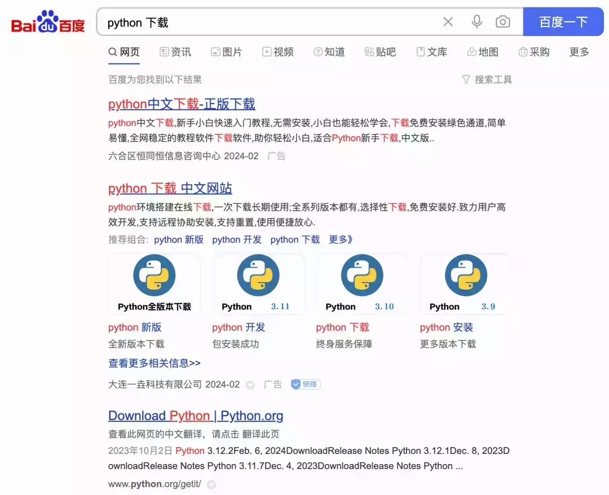
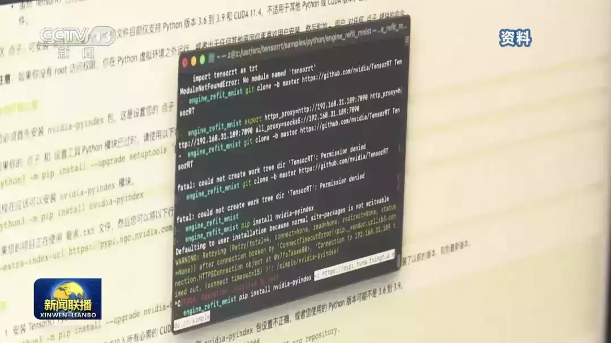

# 国内开发者的网络超时日常

作为国内的互联网从业者，或许大家多少都经历过一些莫名其妙的网络问题。而笔者经常审计各种语言代码，对于这些问题也就接触得更多。不巧最近刚刚更换电脑，把这些问题又重新踩了一遍，因此决定系统记录下来，以便后来的同僚能少走一些弯路。

注意，根据《中华人民共和国计算机信息网络国际联网管理暂行规定》，任何单位和个人不得自行建立或者使用其他信道进行国际联网，因此本文尽可能在不违反法律的情况下使用镜像站解决上述网络问题。对于依旧解决不了的，可以酌情考虑换个行业。

# 开源镜像站

-   • 清华大学开源软件镜像站 (TUNA)\[1\]
    
-   • 北京外国语大学开源软件镜像站 (TUNA)\[2\]
    
-   • USTC open source software mirror\[3\] - 中科大镜像源，含部分反向代理列表
    
-   • 上海交通大学镜像站\[4\]
    
-   • 南京大学镜像站\[5\]
    
-   • 阿里巴巴开源镜像站\[6\]
    
-   • 腾讯软件源\[7\]
    

一般镜像站中除了镜像本身，还附带了比较整洁的文档或者说明，其中 TUNA 镜像站的文档是笔者认为写得最好的，可以参考其文档并根据自身网络环境选择合适的镜像源。

更详细的镜像站汇总，可以参考:

-   • Thanks-Mirror\[8\]
    
-   • 校园网镜像站索引\[9\]
    
-   • 国内开源镜像网站汇总 - 知乎\[10\]
    

其中各个站点的索引的软件都不太一样，比如  山东女子学院开源软件镜像站\[11\] 中还可以下载 java 的二进制文件。因此如果在某个镜像站找不到你所需的软件源，可以换几个镜像站找找，说不定能有所收获。

其他:

-   • 谷歌学术镜像站\[12\]
    
-   • z-library 镜像站\[13\]
    

# 包管理器

我们先从简单的说起。在全新安装好操作系统时，第一步要准备的自然是包管理工具。这类工具有很多，只选几个典型作为记录，即 Debian/Ubuntu Linux 系的 `apt-get` 以及 macOS 下的 `Homebrew`。

## APT-GET

一般我们配置 apt 镜像的时候会上百度随便搜 "ubuntu 国内源"，然后进入到某个 CSDN 的文章，把里面的源复制一下，粘贴到系统的 `/etc/apt/sources.list` 中。这样确实能解决问题，不过对于新手而言可能会不小心复制错源，比如将 ubuntu 18.04 (bionic) 的源复制到了自己的 ubuntu 22.04 (jammy) 系统中，导致更新出错。因此更好的方法是直接到上面的开源镜像站中查找对应的源。

扯句题外话，apt 源的格式一般如下:

```plain
deb [ option1=value1 option2=value2 ] uri suite [component1] [component2] [...]
deb-src [ option1=value1 option2=value2 ] uri suite [component1] [component2] [...]
```

其中只有 uri 和 suite 是必填的，其他都是可选的，比如我们经常复制下来的形式是:

```plain
deb https://mirrors.tuna.tsinghua.edu.cn/ubuntu/ jammy main restricted universe multiverse
```

`suite` 代表系统的 codename，`component` 则表示启用的组件，从请求来看，它们一起组合成了完整的 URL 路径 `<uri>/dists/<suite>/<component>`，例如:

```plain
https://mirrors.tuna.tsinghua.edu.cn/ubuntu/dists/jammy/main
```

那么我们怎么知道应该使用哪些 component 呢？一般来说，

-   • `main` 表示发行版官方支持开源软件版；
    
-   • `restricted` 表示官方支持但不是完全 License free 的软件包；
    
-   • `universe` 表示社区维护的软件，但非官方支持；
    
-   • `multiverse` 表示非自由软件，比如 NVIDIA 的驱动；
    

不过我们无需记住所有的源，只需要把原始 `sources.list` 中的 URI 替换即可。值得注意的是有的文章中使用 sed 去替换，比如替换成阿里云的源:

```plain
sed -ibak "s/archive.ubuntu.com/mirrors.aliyun.com/g" /etc/apt/sources.list
```

这需要注意 URI 的路径，以及针对安全更新使用的 URI 通常是其他子域名，如: http://security.ubuntu.com/ubuntu/ ，因此更为稳妥的方式还是进行手动替换。

参考:

-   • sources.list man(5)\[14\]
    
-   • What are Repositories\[15\]
    

## HomeBrew

如果你用的是 macOS 系统，那么很可能会用到 Homebrew\[16\]。该包管理工具与 apt 不同，并不是系统自带的，需要手动安装。官网的安装介绍就一句话:

```plain
/bin/bash -c "$(curl -fsSL https://raw.githubusercontent.com/Homebrew/install/HEAD/install.sh)"
```

如果网络不好，很可能会收获一个 `curl: (28) SSL connection timeout`。此时还是参考 TUNA 中的文档，从镜像源中获取 `install.sh` 进行安装:

```plain
# 从镜像下载安装脚本并安装 Homebrew / Linuxbrew
git clone --depth=1 https://mirrors.tuna.tsinghua.edu.cn/git/homebrew/install.git brew-install
/bin/bash brew-install/install.sh
rm -rf brew-install
```

对于侥幸网络顺畅已经安装过的朋友，在 brew update/install 时可能也会遇到网络问题，因为 formula/cask 默认是从 github 下载的。此时就需要通过环境变量将其设置为镜像地址:

```plain
export HOMEBREW_API_DOMAIN="https://mirrors.tuna.tsinghua.edu.cn/homebrew-bottles/api"
export HOMEBREW_BOTTLE_DOMAIN="https://mirrors.tuna.tsinghua.edu.cn/homebrew-bottles"
export HOMEBREW_BREW_GIT_REMOTE="https://mirrors.tuna.tsinghua.edu.cn/git/homebrew/brew.git"
export HOMEBREW_CORE_GIT_REMOTE="https://mirrors.tuna.tsinghua.edu.cn/git/homebrew/homebrew-core.git"
export HOMEBREW_PIP_INDEX_URL="https://pypi.tuna.tsinghua.edu.cn/simple"
```

参考:

-   • MAC 安装 homebrew 国内镜像\[17\]
    
-   • Homebrew / Linuxbrew 镜像使用帮助 - tuna\[18\]
    

## WinGet

Windows 中也有一些包管理工具，比如 chocolatey 或者 scoop。目前 Windows 官方推出了 WinGet\[19\]，后续随着软件源的丰富会日渐成为主流。但是不幸 WinGet 的软件包元数据也是存放在 github 上的，因此我们也要寻找镜像。

幸运的是部分国内开源镜像也提供了 winget 的源，比如 USTC Mirrors:

```plain
winget source remove winget
winget source add winget https://mirrors.ustc.edu.cn/winget-source
```

但可惜这只是 manifest 的源，实际的安装包还是走的原始下载地址，很多是对应软件官网提供的。由于软件来源不一，因此很难实现统一的镜像。因此对于原始二进制文件下载不了的情况只能开启系统代理，因为 winget 的代理选项还在开发中，见 issue#190\[20\]。

参考:

-   • WinGet 源使用帮助\[21\]
    
-   • How do I install WinGet on Windows Server 2019\[22\]
    

# Python

准备好包管理器之后我们就可以开始写代码了，首选的自然是简单实用的脚本语言 Python。使用包管理器可以很简单地进行安装，不过如果没有使用包管理器，或者需要的安装最新的 Python 版本没有及时更新到包管理仓库中，那么还是需要手动下载安装的。

下载自然是要到官网下载，不过需要注意的是如果使用某搜索引擎需要仔细辨别哪个是官网，否则不小心安装完发现是个全家桶就得不偿失了。



baidu.png

有时候 Python 的官网 python.org 访问也是会出现网络超时的，此时也可以借助上面说到的镜像源。在 校园网联合镜像站\[23\] 中可以搜索哪个镜像站支持下载 Python binary 的镜像，发现北京交通大学镜像站有，因此可以在这里加速下载:

-   • https://mirror.bjtu.edu.cn/python/
    

安装好 Python 之后还需要安装 pip 并配置好对应的 pypi 源，否则控制台可能会出现一些红红黄黄的错误。



cctv.png

在 TUNA PyPI 镜像使用帮助\[24\] 中已经比较详细地说明了配置方法，这里简单记录一下:

```plain
python3 -m pip install --upgrade pip
python3 -m pip config set global.index-url https://mirrors.aliyun.com/pypi/simple/
```

这会将镜像源地址写入到 `$HOME/.config/pip/pip.conf` 文件中，当然自己手动修改该文件也是可以的。很多所谓教程还会额外修改 `install.trusted-host`，这对于 HTTPS 的源而言已经没必要了。

# NodeJS

最为另一个最受欢迎的语言 JavaScript 我们当然也是要支持的，为此就需要先安装 nodejs 环境。不考虑包管理器的话根据官网应该是要到 https://nodejs.org/dist/ 中下载，不过在国内访问仿佛会受到一股无形的阻力:


node.png

> From: vsping.com\[25\]

因此，还是再次感谢镜像们救我狗命:

-   • https://mirrors.cernet.edu.cn/list/nodejs-release
    
-   • https://mirrors.bfsu.edu.cn/nodejs-release/
    
-   • https://mirror.iscas.ac.cn/nodejs-release/
    
-   • https://developer.aliyun.com/mirror/nodejs-release
    

安装完 nodejs 和 npm 后还需要配置 npm 仓库的镜像源，以加速 `npm install` 等命令:

```plain
# 刷新缓存
npm cache clear --force
# 将配置写入 ~/.npmrc
npm config set registry https://registry.npmmirror.com/
```

注意镜像的地址是 HTTPS 而不是 HTTP，否则可能会会遇到 npm ERR: Cannot read property 'insert' of undefined\[26\] 之类的错误。

很多情况下需要使用 nvm 管理不同的 nodejs 版本，那么也可以直接在包管理器中先任意安装某个版本的 node 和 npm，然后再安装 nvm 去切换版本:

```plain
npm install -g n
n lts
export PATH=$HOME/.n/bin:$PATH
node --version
```

参考:

-   • https://npmmirror.com/
    
-   • https://mirrors.bfsu.edu.cn/help/nodejs-release/
    

# Golang

Golang 也是一个常用的语言，官网地址: https://go.dev/doc/install

当然，官网速度比较感人，你可以选择国内的镜像站点来安装 go 程序，比如:

-   • https://golang.google.cn/dl/
    
-   • https://mirrors.aliyun.com/golang/
    

golang 的包管理的加速略有不同，不是使用镜像而是使用 GOPROXY 协议\[27\]，细节就不考究了，简单来说配置如下:

```plain
go env -w GO111MODULE=on
go env -w GOPROXY=https://goproxy.cn,direct
```

其他模块加速代理的地址包括但不限于:

-   • https://goproxy.cn/
    
-   • https://goproxy.io/
    
-   • https://proxy.golang.org
    

# Rust

Rust 是近期用的比较多的静态类型语言，可以作为 C++ 的一个很好补充和替代。 Rust 官网\[28\] 的安装介绍就一句话:

```plain
curl --proto '=https' --tlsv1.2 -sSf https://sh.rustup.rs | sh
```

如果你直接复制粘贴这条命令来安装，很可能也会碰到一些网络问题。在安装阶段使用的工具其实称为 `rustup`，因此我们可以去查找 rustup 的镜像，其中字节的 rsproxy.cn 看起来就比较符合我们的需求:

```plain
export RUSTUP_DIST_SERVER="https://rsproxy.cn"
export RUSTUP_UPDATE_ROOT="https://rsproxy.cn/rustup"
curl --proto '=https' --tlsv1.2 -sSf https://rsproxy.cn/rustup-init.sh | sh
```

安装完后使用 cargo 拉取包的时候会请求 crates.io，又会出现网络问题，此时可以修改 cargo registry 地址，即修改文件 `~/.cargo/config`:

```plain
[source.crates-io]
replace-with = 'rsproxy-sparse'
[source.rsproxy]
registry = "https://rsproxy.cn/crates.io-index"
[source.rsproxy-sparse]
registry = "sparse+https://rsproxy.cn/index/"
[registries.rsproxy]
index = "https://rsproxy.cn/crates.io-index"
[net]
git-fetch-with-cli = true
```

参考:

-   • rsproxy.cn: A high speed crates.io mirror\[29\]
    

# Java

Java 是笔者比较不喜欢的一门语言，但无奈国内各个大厂都喜欢用 Java，作为安服仔就只能默默接受这个现实并接受它。安装部分就不必说了，重点看一下依赖包下载过程中遇到的网络问题。

在介绍具体的项目管理工具之前，我们先了解一下 Java 基本的代理设置。Java 主要通过 system properties 来设置代理，即通过命令行指定 `-D` 或者在代码中调用 `System.setProperty` 实现。

而控制代理的系统属性有下面这些。

针对 HTTP 请求的 HTTP 代理:

-   • http.proxyHost
    
-   • http.proxyPort
    
-   • http.nonProxyHosts
    

针对 HTTPS 请求的 HTTP 代理:

-   • https.proxyHost
    
-   • https.proxyPort
    

socks5 代理:

-   • socksProxyHost
    
-   • socksProxyPort
    

值得一提的是 Java 会根据请求的协议选择不同的代理，因此如果只设置了 http.ProxyHost，那么就只有纯 HTTP 请求会走代理，HTTPS 请求则会直连。详细的介绍可以参考:

-   • Oracle: Java Networking and Proxies\[30\]
    

## Maven

maven 算是 Java 中最常用的项目管理工具了，但相信各位 Java 开发者一开始 `mvn clean pacakge` 编译别人的项目时都遇到过依赖下载缓慢甚至网络错误的问题。一个直接的方法是使用镜像，即修改 maven 默认配置文件，比如 `$HOME/.m2/settings.xml`，加入下述节点:

```plain
<settings>
  ...
  <mirrors>
    <mirror>
      <id>aliyunmaven</id>
      <name>Aliyun</name>
      <url>https://maven.aliyun.com/repository/public</url>
      <mirrorOf>central,jcenter</mirrorOf>
    </mirror>
  </mirrors>
  ...
</settings>
```

在阿里云的文档中说还可以在 `repositories` 加入，但 repository 中更多是添加私有仓库地址；另外阿里云的文档还有个问题是将 `mirrorOf` 设置为了 `*` 即代理所有仓库，这会导致某些阿里云没有做镜像的仓库下载失败，因此最好还是按需添加镜像。

参考:

-   • Using Mirrors for Repositories\[31\]
    
-   • 阿里云: maven 配置指南\[32\]
    

## Gradle

另外一个常用的 Java 项目管理工具就是 Gradle，比如笔者常用的 Android Studio 就是使用 Gradle 作为 APK 的编译工具。

更准确地说是使用 gradle 的封装脚本 `gradlew`，其中包含了具体的 gradle 版本，避免不同版本之间的编译脚本兼容性问题。作为国内用户，经常就死在了 gradlew 的第一步，因为其会去下载对应版本的 grandle-bin，比如 `https://services.gradle.org/distributions/gradle-8.0-bin.zip` 。

解决方法是修改 `gradle/wrapper/gradle-wrapper.properties` 文件指定 `distributionUrl` 为国内镜像源的具体地址，例如:

```plain
distributionBase=GRADLE_USER_HOME
distributionPath=wrapper/dists
distributionUrl=https\://mirror.nju.edu.cn/gradle/gradle-8.0-bin.zip
zipStoreBase=GRADLE_USER_HOME
zipStorePath=wrapper/dists
```

其他的 gralde distribution 镜像地址可以参考:

-   • https://mirror.nju.edu.cn/gradle/
    
-   • https://mirror.sjtu.edu.cn/gradle/distributions/
    

解决完 gradle-bin 的下载问题后，还会遇到与 maven 类似的中央仓库下载网络问题，但是 gradle 没有类似 maven 的 `mirror` tag，而只有类似的 `repositories` tag，用指定私有仓库的方式将其指定到国内的 maven 仓库镜像中。

使用 Groovy DSL 的 gradle 配置文件 `build.gradle` 可以添加以下配置:

```plain
allprojects {
    repositories {
        maven { url 'https://maven.aliyun.com/repository/google' }
        maven { url 'https://maven.aliyun.com/repository/public' }
        mavenLocal()
        mavenCentral()
    }
}
```

使用 Kotlin 的 gradle 配置文件 `build.gradle.kts` 可以使用下述配置:

```plain
repositories {
    maven { setUrl("https://maven.aliyun.com/repository/google/") }
    maven { setUrl("https://maven.aliyun.com/repository/public/") }
    mavenLocal()
    mavenCentral()
}
```

Gradle 似乎没有全局的配置方案，网上的教程更多是使用 `init.gradle` 即初始化脚本，在项目的 gradle 脚本任务执行之前替换掉 repo 地址:

```plain
allprojects{
  repositories {
    all { ArtifactRepository repo ->
      if(repo instanceof MavenArtifactRepository){
        def url = repo.url.toString()
        if (url.startsWith('https://repo1.maven.org/maven2')) {
          project.logger.lifecycle "remove ${repo.url}"
          remove repo
        }
        if (url.startsWith('https://jcenter.bintray.com/')) {
          project.logger.lifecycle "remove ${repo.url}"
          remove repo
        }
      }
    }
    maven {
      url 'https://maven.aliyun.com/repository/public/'
    }
  }
}
```

这种方式着实不太优雅，但也能算是一种不修改原始代码工程文件的镜像方案。

值得一提的是，云厂商的 maven 仓库镜像也只有一部分 repository，像 jetpack.io 这类仓库可能镜像中就无法找到，此时只能另觅他法了。

说句题外话，不管是 maven 还是 gradle，其实本质上都是一个 Java 工具，因此我们可以通过给 Java 应用添加属性的方式设置代理。比如 maven/gradle 可以通过 `-D` 添加属性；gradle 可以通过在 `gradle.properties` 中添加属性 (需要添加前缀，如: `systemProp.https.proxyHost`)。其中 `gradle.properties` 除了放在项目根目录中，还可以全局使用，在 NIX 系统中路径是 `$HOME/.gradle/gradle.properties`，Windows 中则是 `%userprofile%\.gradle\gradle.properties`。

参考:

-   • gradle: Declaring repositories\[33\]
    
-   • gradle: Initialization Scripts\[34\]
    

# 总结

经过这一番折腾，这些开发工具终于能够流畅使用了，总算是和老外站在了同一起跑线上！除了上面用到的这些工具和语言，其实还有其他常用的如 Ruby、PHP(Composer)、Docker 等无一不是需要镜像才能流畅使用，不得不感慨国内开发者们顽强生长的能力。同时也非常感谢维护镜像站的厂商和高校，要是没有它们，可能很多开发者就只能铤而走险了。

#### 引用链接

`[1]` 清华大学开源软件镜像站 (TUNA): *https://mirrors.tuna.tsinghua.edu.cn/help/ubuntu/*  
`[2]` 北京外国语大学开源软件镜像站 (TUNA): *https://mirrors.bfsu.edu.cn/*  
`[3]` USTC open source software mirror: *https://unicom.mirrors.ustc.edu.cn/*  
`[4]` 上海交通大学镜像站: *https://mirror.sjtu.edu.cn/*  
`[5]` 南京大学镜像站: *https://mirror.nju.edu.cn/*  
`[6]` 阿里巴巴开源镜像站: *https://developer.aliyun.com/mirror/*  
`[7]` 腾讯软件源: *https://mirrors.cloud.tencent.com/*  
`[8]` Thanks-Mirror: *https://github.com/eryajf/Thanks-Mirror*  
`[9]` 校园网镜像站索引: *https://mirrors.cernet.edu.cn/site*  
`[10]` 国内开源镜像网站汇总 - 知乎: *https://zhuanlan.zhihu.com/p/609597886*  
`[11]` 山东女子学院开源软件镜像站: *https://mirrors.sdwu.edu.cn/*  
`[12]` 谷歌学术镜像站: *https://ac.scmor.com/*  
`[13]` z-library 镜像站: *https://www.tboxn.com/sites/320.html*  
`[14]` sources.list man(5): *https://manpages.ubuntu.com/manpages/jammy/man5/sources.list.5.html*  
`[15]` What are Repositories: *https://help.ubuntu.com/community/Repositories/Ubuntu*  
`[16]` Homebrew: *https://brew.sh/*  
`[17]` MAC 安装 homebrew 国内镜像: *https://zhuanlan.zhihu.com/p/547898033*  
`[18]` Homebrew / Linuxbrew 镜像使用帮助 - tuna: *https://mirrors.tuna.tsinghua.edu.cn/help/homebrew/*  
`[19]` WinGet: *https://learn.microsoft.com/zh-cn/windows/package-manager/*  
`[20]` issue#190: *https://github.com/microsoft/winget-cli/issues/190*  
`[21]` WinGet 源使用帮助: *https://mirrors.ustc.edu.cn/help/winget-source.html*  
`[22]` How do I install WinGet on Windows Server 2019: *https://stackoverflow.com/questions/68100663/how-do-i-install-winget-on-windows-server-2019*  
`[23]` 校园网联合镜像站: *https://mirrors.cernet.edu.cn/list*  
`[24]` TUNA PyPI 镜像使用帮助: *https://mirrors.tuna.tsinghua.edu.cn/help/pypi/*  
`[25]` vsping.com: *https://www.vsping.com/http/*  
`[26]` npm ERR: Cannot read property 'insert' of undefined: *https://github.com/npm/cli/issues/4876*  
`[27]` GOPROXY 协议: *https://go.dev/ref/mod#goproxy-protocol*  
`[28]` Rust 官网: *https://www.rust-lang.org/tools/install*  
`[29]` rsproxy.cn: A high speed crates.io mirror: *https://rsproxy.cn/*  
`[30]` Oracle: Java Networking and Proxies: *https://docs.oracle.com/javase/8/docs/technotes/guides/net/proxies.html*  
`[31]` Using Mirrors for Repositories: *https://maven.apache.org/guides/mini/guide-mirror-settings.html*  
`[32]` 阿里云: maven 配置指南: *https://developer.aliyun.com/mvn/guide*  
`[33]` gradle: Declaring repositories: *https://docs.gradle.org/current/userguide/declaring\_repositories.html*  
`[34]` gradle: Initialization Scripts: *https://docs.gradle.org/current/userguide/init\_scripts.html*