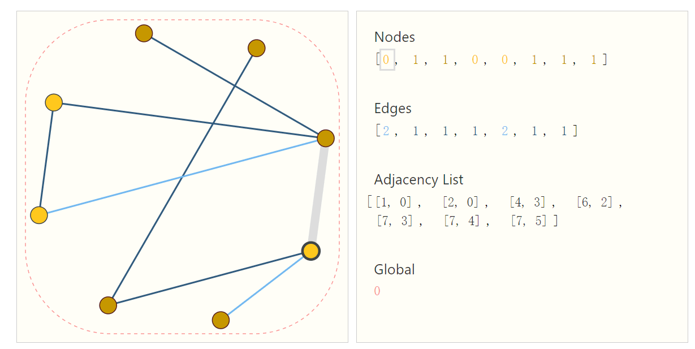

# 图神经网络介绍

## 主要参考

[A Gentle Introduction to Graph Neural Networks](https://distill.pub/2021/gnn-intro/)

## 什么是图

图可以用数学形式表示为一个二元组 `` $G = (V,E)$ ``，其中：

-   `` $V$ `` 是一个节点（顶点）的集合，每个节点通常有一个唯一的标识符来区分。点就是特征向量。
    
-   `` $E$ `` 是一个边的集合，其中每个边可以是有向或无向的。对于无向图，边可以表示为集合 `` $v_{i},v_{j}$ ``，其中 `` $v_{i}$ `` 和 `` $v_{j}$ `` 是节点集合 `` $V$ `` 中的节点。对于有向图，边可以表示为有序对 `` $(v_{i},v_{j})$ ``，其中 `` $v_{i}$ `` 是边的起始节点，`` $v_{j}$ `` 是边的结束节点。边就是点向量间的关系。边也会有特征，也可以向量化。
    

图也可以有特征。

在图的数学表示中，通常使用符号 `` $n$ `` 表示节点的数量，`` $m$ `` 表示边的数量。也会用 `` $U$ `` 来表示图。

此外，图还可以使用邻接矩阵（Adjacency Matrix）或邻接列表（Adjacency List）等形式进行数学表示。

-   邻接矩阵：是一个 `` $n \times n$ `` 的矩阵 `` $A$ ``，其中 `` $A_{ij}$ `` 表示节点 `` $v_{i}$ `` 到节点 `` $v_{j}$ `` 是否有边相连。如果有边相连，则 `` $A_{ij}$ `` 的值通常为1（或者是表示权重的实数值），否则为0。但图神经网络是稀疏矩阵，不适合用这种方法表示。
    
-   邻接列表：对于每个节点 `` $v_{i}$ ``，保存与其相邻的节点的列表。
    

## 什么是图神经网络

图神经网络（Graph Neural Networks，简称GNN）是一种针对图数据结构的深度学习模型。在传统的深度学习模型中，数据通常被表示为矩阵或向量的形式，而图数据则以节点和边的形式组成，因此传统的深度学习模型并不适用于直接处理图数据。GNN的出现填补了这一空白，使得深度学习能够直接应用于图数据。

GNN的核心思想是利用节点之间的关系和连接模式，通过迭代地更新节点的表示来学习图数据的特征。具体来说，GNN通过在每一层中将节点的表示更新为其邻居节点的加权和，然后将这些更新后的表示作为下一层的输入，从而逐渐地融合局部和全局信息，并在最终的表示中捕获图的结构和特征。


GNN已经被成功应用于许多图相关的任务，包括节点分类、图分类、链接预测、推荐系统等。它在社交网络、生物信息学、推荐系统等领域都取得了很好的效果，并成为了近年来深度学习领域的研究热点之一。

图神经网络中，点、边、全局都有特征。图神经网络的目的就是整合、重构特征，然后应用于分类或回归任务。

## 嵌入（embedding）

“embedding” 就是把数据集合映射到向量空间，就是找到一组合适的向量，来刻画现有的数据集合。[1](#fn:1)

在图神经网络里，我们可以在 V / E / G 里存放信息。比如观察下面的两个顶点，两个边，右边的直方图是不同的，这表示每个顶点或边里存放的不同的信息，高矮表示值的大小。可以看到顶点向量的长度是 6，边向量的长度是 8.


各种数据都可以表示为图，比如图片：


考虑上面的笑脸图案，可以按照像素是否相邻构建无向图。

比如文本：


## 基于图的任务

在图数据分析和预测任务中，通常可以将预测任务分为图级别（graph-level）、节点级别（node-level）和边级别（edge-level）三种类型。

1.  **图级别（Graph-Level）预测任务**：
    
    -   *示例：化学分子中的环结构检测* 在化学分子结构分析中，图级别的预测任务可能涉及到判断分子是否包含两个或以上的环结构。这种任务需要分析整个分子的拓扑结构，而不仅仅是单个原子或化学键的性质。例如，可以用来判断某种化合物是否具有特定的环状结构，这对于药物设计和材料科学等领域非常重要。
2.  **节点级别（Node-Level）预测任务**：
    
    -   *示例：社交网络中的用户分类* 在社交网络中，节点级别的预测任务可以进一步扩展为节点变化后的分类。例如，你可能希望根据节点的属性或行为，将节点分为两个类别，并且在一系列操作或事件后，判断节点是否属于其中的一类。这种任务对于了解社交网络中节点的动态变化以及社交行为的影响具有重要意义。
3.  **边级别（Edge-Level）预测任务**：
    
    -   *示例：拳击比赛中的观众关注预测* 在拳击比赛中，边级别的预测任务可能涉及到预测每个观众关注或观看哪位拳击手。通过分析观众的行为和拳击场上的动态，可以预测每个观众在比赛中对哪位拳击手产生了兴趣，这对于推动体育赛事的营销和精准定位观众具有重要意义。

## 连通性表示的挑战

在表示图数据时，常用的方法包括邻接矩阵和邻接表两种。

|     | 邻接矩阵 | 邻接表 |
| --- | --- | --- |
| **优势** | 快速查找边的存在性；适用于稠密图；矩阵运算 | 节省空间；插入和删除效率高；灵活性 |
| **劣势** | 空间复杂度高；插入和删除边效率低；限制图的规模 | 查找边的效率较低；不适用于某些图算法 |

由于图神经网络问题中，数据规模较大，所以主要采用邻接表。

## 最简单的 GNN

### 置换不变性

在数学和物理学中，置换不变性是指当对对象的组成部分进行重新排列时，对象的性质或结果不发生改变。

举例来说，考虑一个简单的集合 {1, 2, 3}。如果我们将其中的元素重新排列，比如 {2, 1, 3}，那么这个集合在这个置换操作后仍然保持不变，因为集合中的元素仍然是相同的，只是排列顺序改变了。

在本文，对于矩阵格式的图描述具有置换不变性意味着无论图中节点的排列顺序如何变化，描述该图的矩阵仍然是相同的，其表达的含义或特性不会改变。

### GNN

GNN 是对图的所有属性（节点、边、全局上下文）进行优化转换的方法，同时保持图的对称性（置换不变性）。我们将使用 Gilmer 等人提出的“消息传递神经网络”框架来构建 GNN。

GNN 采用“图输入，图输出”的架构，意味着这些模型类型接受图作为输入，其中信息加载到其节点、边和全局上下文中，并逐步转换这些嵌入，而不改变输入图的连接性。

### MLP

MLP 是多层感知器（Multilayer Perceptron）的缩写，它是一种前馈神经网络，由一个或多个全连接的隐藏层组成，每个隐藏层包含多个神经元，以及一个输出层。MLP 的每个神经元都与上一层的每个神经元相连，但不与同一层内的其他神经元相连。

### 构建 GNN

我们基于下面的图构建最简单的 GNN：



我们在图的每个元素上使用单独的多层感知器 (MLP)（或其他可微模型），并称之为 GNN 层。比如，对于每个**节点**向量，我们应用 MLP 并返回一个学习到的节点向量；对每条**边**做同样的事情，学习每条边的嵌入（或称新的特征向量）；以及全局上下文向量，为整个图学习一个嵌入。连通性本例暂时不处理。然后将这些GNN层堆叠在一起。

因为本例 GNN 不会更新输入图的连通性，所以我们可以用与输入图相同的邻接表和相同数量的特征向量来描述 GNN 的输出图。不同处在于，输出图更新了嵌入，因为 GNN 更新了每个节点、边和全局上下文表示。


如果要进行二元分类（或者其它多分类），只需要对每个节点应用线性分类器：


## 消息传递

考虑预测是基于节点的，但预测结果与边的信息相关，那么就需要一种方法从边获取信息。方法是 Pooling（下文翻译为汇聚，而不是池化）。

我们用字母 `` $\rho $ `` 表示汇聚操作，并用 `` $p_{E_{n}\rightarrow V_{n}}$ `` 表示我们正在从边到节点收集信息。同理在其它组分之间通过这种操作传递信息。

图神经网络（Graph Neural Network，GNN）的消息传递是指在图结构数据上进行信息传递和聚合的过程。在 GNN 中，节点之间的信息交换通过消息传递来实现，以便更新节点的表示。

通常，消息传递过程包括以下几个步骤：

1.  **初始化节点表示**：首先，对每个节点进行初始化，为每个节点分配一个初始的表示向量。
    
2.  **消息收集**：然后，在每一轮迭代中，节点会收到来自其邻居节点的消息。这些消息可以是邻居节点的表示向量，也可以是由邻居节点生成的消息。每个节点会将收到的消息进行聚合，以更新自己的表示。
    
3.  **聚合**：节点收到的消息通常会通过聚合操作进行汇总。常见的聚合操作包括求和、取最大值、使用注意力机制等。聚合操作的目的是将邻居节点的信息合并为一个新的向量，以便更新当前节点的表示。
    
4.  **更新节点表示**：最后，使用聚合后的消息来更新节点的表示。更新节点表示的方式可以是简单的拼接、加权求和、应用激活函数等。
    
5.  **重复迭代**：通常，在 GNN 中，会多次迭代消息传递过程，以便节点能够在多个层次上获取周围节点的信息。每次迭代，节点都会更新其表示，同时传递更新后的消息给其邻居节点。
    

通过多次迭代消息传递，节点可以逐步聚合周围节点的信息，从而获取更丰富的表示。这使得 GNN 能够有效地处理图结构数据，并且具有对不同节点之间关系进行推理的能力。

### 实现


在边上设置可学习的参数，让 6 号知道从 1 号点取的特征的权重。

汇总：

```

LATEX_BLOCK___h_{i} = \sigma \left(W_{1} \cdot h_{i} + \sum \limits_{j \in N_{i}}W_{2} \cdot h_{j}\right)___LATEX_BLOCK
```

-   -   号右边是邻居给的特征，左边是自己的特征。

-   `` $\sigma $ `` 是汇总函数，根据任务需要，可以是求平均、最大最小等，看情况。

### 多层

可以堆叠多层，每次邻接矩阵的结构是不变的。

为什么要多层呢？原因在于后一次更新，拿到的特征已经是来自于更多点了。类似元胞自动机。更新的过程中，感受野是扩大的。多层的目的就是让它的感知的范围越来越大，得到更好的特征。

### 处理信息维度的不一致性

当对节点进行预测时，数据集未必包含所有类型的信息（节点、边和全局上下文）。假设只包含边的信息，但要对节点进行预测，可以用上面提到的聚合操作，使用消息传递来在节点和边之间共享信息。

然而，存储在图中的节点和边信息并不一定具有相同的大小或形状，因此如何组合它们并不是立即清楚的。

这句话的意思是指，在图中存储的节点和边的信息可能具有不同的特征数量或特征维度，因此在进行信息传递或更新时，如何将它们合并起来可能并不容易确定。

举个例子，假设我们有一个社交网络的图，其中的节点代表用户，边代表用户之间的关系（例如好友关系）。节点的信息可能是用户的特征向量，比如年龄、性别、兴趣爱好等，而边的信息可能是关系的强度或者其他连接两个用户之间的属性。

这些节点和边的信息可能具有不同的特征数量或特征维度，比如节点的特征向量可能有100个维度，而边的信息可能只有1个维度（比如表示关系的强度）。

因此，当我们想要在图神经网络中利用节点和边的信息进行预测或学习时，我们需要考虑如何处理这种不同的特征维度或数量，以确保节点和边的信息能够有效地结合在一起，从而对任务有所帮助。

一种方法是学习一个线性映射，将边的空间映射到节点的空间，反之亦然。另一种方法是在更新函数（the update function）之前将它们拼接在一起。


在构建图神经网络（GNN）时，一个设计决策是确定**更新哪些图属性**以及**以什么顺序更新它们**。其中一个决策是是否先更新节点嵌入还是先更新边嵌入。

**先节点嵌入**：在先更新节点嵌入的情况下，模型首先聚合来自邻居节点的信息，以更新每个节点的表示。然后，使用更新后的节点嵌入，模型再聚合来自邻居边的信息，以更新边的嵌入。

**先边嵌入**：另一方面，先更新边嵌入意味着首先聚合来自邻居边的信息，以更新每个边的表示。然后，使用更新后的边嵌入，模型再聚合来自邻居节点的信息，以更新节点嵌入。

在这个领域还有许多开放的研究，有各种不同的解决方案。例如，一种方法是以“编织”方式更新图属性，即在 GNN 的**各层交替更新节点和边的信息**。这种编织策略允许在更新过程中同时考虑节点和边的信息，可能会产生更丰富的表示，并在各种基于图的任务中提高性能。


如上图所示，不过这种更新可能导致中间向量更宽一些。

## 全局信息

提供一个 master node（一个虚拟点）连接到所有的点和边，成为上下文向量，用来提供跨界点传送的信息。

## 图卷积 GCN

图卷积和卷积都是利用了周围的特征，但图卷积并不是一个窗口一个窗口地做，而是消息传递的计算。

### 半监督学习

有些节点可能没有完整的标签，甚至没标签。并不妨碍计算 loss——只考虑有标签的来计算就行。

### 基本思想

1.  聚合周围点的信息
    
2.  输入到 FC
    
3.  得到输出特征
    

和卷积类似，可以多层。不过比传统卷积层数往往更少。

A：邻接矩阵 D：度矩阵 F：特征矩阵

## 参考

-   [embedding的原理及实践 | 李乾坤的博客](https://qiankunli.github.io/2022/03/02/embedding.html)
    
-   [零基础多图详解图神经网络（GNN/GCN）【论文精读】\_哔哩哔哩\_bilibili](https://www.bilibili.com/video/BV1iT4y1d7zP/?spm_id_from=333.788&vd_source=6883b827015d4f175d7d87558c28a003)
    

- - -

1.  [https://qiankunli.github.io/2022/03/02/embedding.html](https://qiankunli.github.io/2022/03/02/embedding.html) [↩︎](#fnref:1)