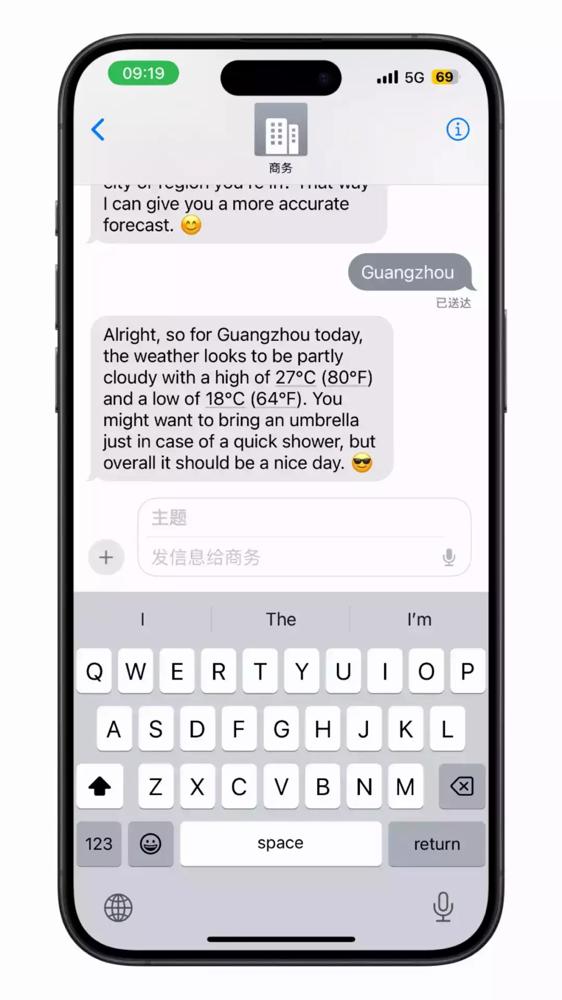

# 在 iMessage 里和 AI 谈恋爱

好产品就应该可以一键启动，好 AI 产品更应该如此。  

在 iMessage 里和 Pi 聊天，可以学习外语，询问天气，甚至是谈恋爱，很像是朋友或者伴侣。🤩

  

打开下面的链接 🦥

*https://pi.ai/imessage*

  

系统会自动跳转在 iMessage 里新开一个对话栏，然后开始你们的互动吧。

Pi 是一种新的人工智能，它不仅聪明，而且有良好的 EQ。这些还不是最重要的，关键是它在 iMessage 里面使用，无需注册，无需特殊网络，响应迅速。

  

简洁，优雅，聪明，流畅，是好产品。

  

欢迎试玩

***https://pi.ai/imessage***

  

以上，完。感谢阅读。