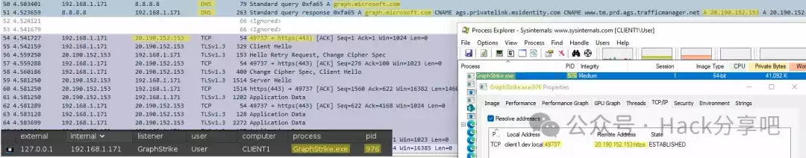
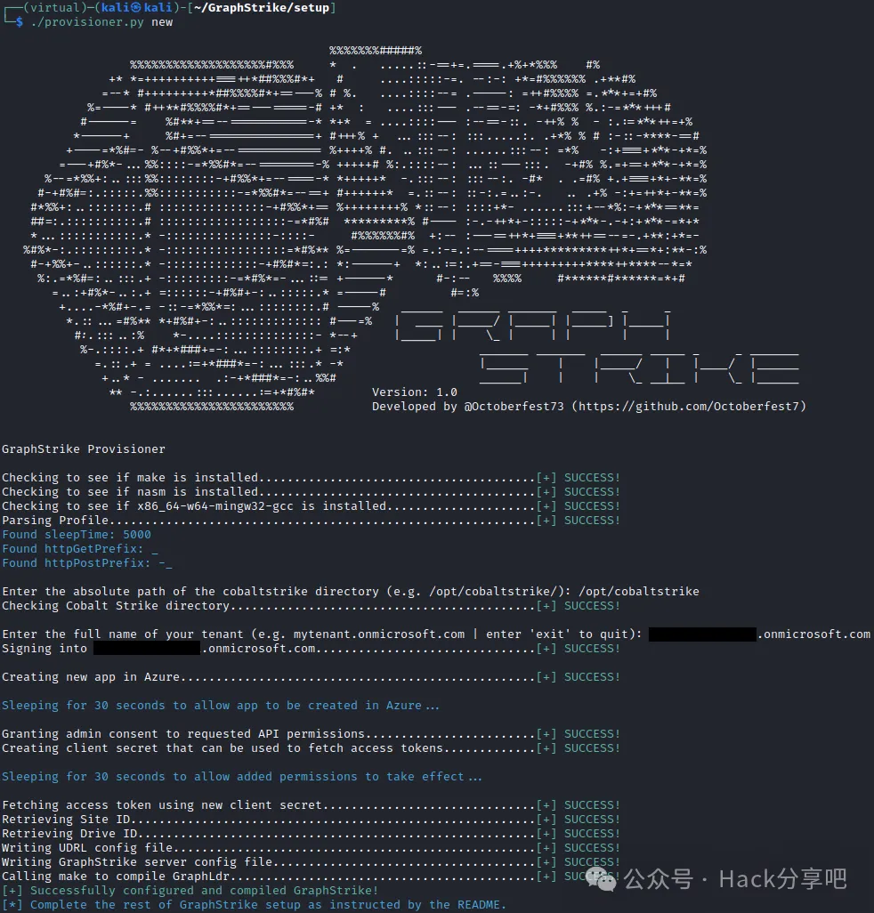

# 基于 Microsoft Graph API 上线 CS 工具

  

  

- - -

SiegeCast 发了两篇关于 GraphStrike 工具的文章，建议可以先去看一下。

```plain
GraphStrike：使用 Microsoft Graph API 让信标流量消失
https://redsiege.com/blog/2024/01/graphstrike-release

GraphStrike：攻击性工具开发剖析
https://redsiege.com/blog/2024/01/graphstrike-developer
```

  

**工具介绍**

GraphStrike 是一套工具，使 Cobalt Strike 的 HTTPS Beacon 能够使用 Microsoft Graph API 进行 C2 通信。所有 Beacon 流量将通过攻击者的 SharePoint 站点中创建的两个文件进行传输，并且来自 Beacon 的所有通信都将路由到 https://graph.microsoft.com：  

```plain
https://learn.microsoft.com/en-us/graph/use-the-api
```



  

GraphStrike 包含一个配置程序，用于通过 Graph API 创建 Cobalt Strike HTTPS 所需的 Azure 资产：



  

**GraphStrike 不会在 Azure 中创建任何付费资产，因此使用 GraphStrike 或其配置程序不会产生额外费用。**

  

**为什么用 Microsoft Graph API？**

已发布关于利用 Microsoft Graph API 和其他 Microsoft 服务进行攻击活动的几种不同 APT 的威胁情报：  

```plain
https://www.volexity.com/blog/2021/08/17/north-korean-apt-inkysquid-infects-victims-using-browser-exploits/
https://malpedia.caad.fkie.fraunhofer.de/details/win.graphite
https://symantec-enterprise-blogs.security.com/blogs/threat-intelligence/flea-backdoor-microsoft-graph-apt15
https://www.elastic.co/security-labs/siestagraph-new-implant-uncovered-in-asean-member-foreign-ministry
```

威胁行为者继续利用合法服务来实现非法目的，利用像 graph.microsoft.com 这样的高声誉域进行 C2 通信是非常有效和理想的，但从时间和精力的角度来看，通常很复杂且令人望而却步。  

大多数 C2 框架不支持获取或轮换访问令牌的方法，这使得它们无法使用 Graph API。这可能会使红队难以复制这些技术，并剥夺防守者观察和开发此类活动签名的机会。

GraphStrike 致力于减轻这一负担，并提供可靠且可重复的流程来利用 Microsoft Graph API，同时保持 Cobalt Strike 用户体验的熟悉度和可靠性。

  

**GraphStrike 局限性**

这个工具存在以下限制：  

```plain
仅支持 x64 信标。
不支持分阶段信标。
GraphStrike 仅与 WinINet 库兼容；不支持信标的新 WinHTTP 库选项。
不支持通过 Beacon 的右键菜单发出睡眠命令，睡眠信标改用命令行选项。
GraphStrike 仅在 Cobalt Strike 的 Linux 实例上受支持，Windows 支持当然是可以实现的，实际上只需更改 Python 文件和 Aggressor 脚本中的某些路径即可。
```

  

**下载地址**

**点击下方名片进入公众号**

**回复关键字【****240215****】获取**下载链接****

  

- - -