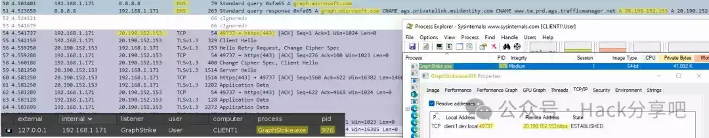
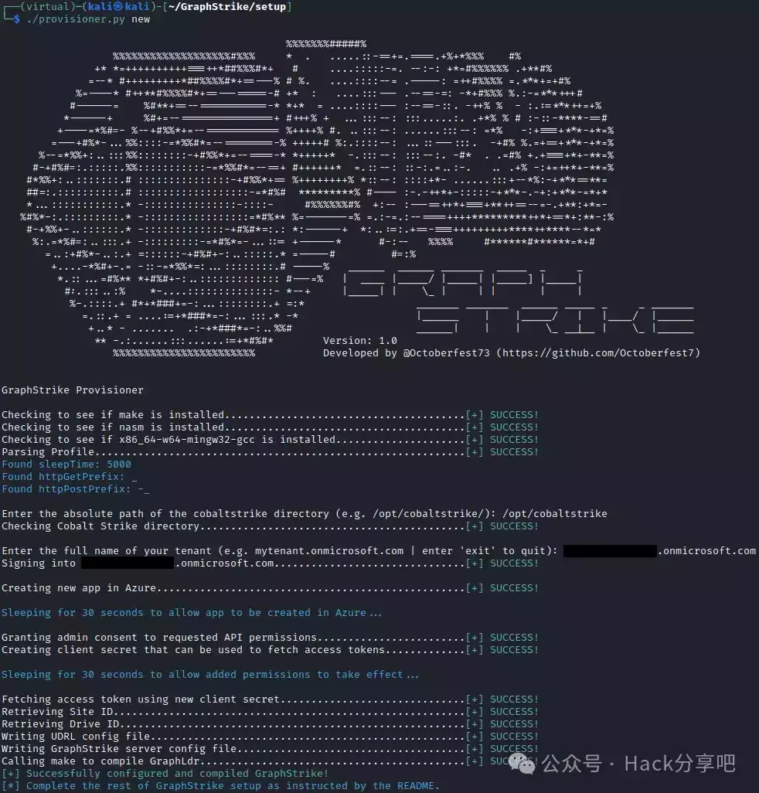

# 基于Microsoft Graph API上线CS工具

  

  

- - -

SiegeCast发了两篇关于GraphStrike工具的文章，建议可以先去看一下。

```plain
GraphStrike：使用Microsoft Graph API让信标流量消失
https://redsiege.com/blog/2024/01/graphstrike-release

GraphStrike：攻击性工具开发剖析
https://redsiege.com/blog/2024/01/graphstrike-developer
```

  

**工具介绍**

GraphStrike是一套工具，使Cobalt Strike的HTTPS Beacon能够使用Microsoft Graph API进行C2通信。所有Beacon流量将通过攻击者的SharePoint站点中创建的两个文件进行传输，并且来自Beacon的所有通信都将路由到 https://graph.microsoft.com：  

```plain
https://learn.microsoft.com/en-us/graph/use-the-api
```



  

GraphStrike包含一个配置程序，用于通过Graph API创建Cobalt Strike HTTPS所需的Azure资产：



  

**GraphStrike 不会在 Azure 中创建任何付费资产，因此使用 GraphStrike 或其配置程序不会产生额外费用。**

  

**为什么用Microsoft Graph API？**

已发布关于利用 Microsoft Graph API 和其他 Microsoft 服务进行攻击活动的几种不同 APT 的威胁情报：  

```plain
https://www.volexity.com/blog/2021/08/17/north-korean-apt-inkysquid-infects-victims-using-browser-exploits/
https://malpedia.caad.fkie.fraunhofer.de/details/win.graphite
https://symantec-enterprise-blogs.security.com/blogs/threat-intelligence/flea-backdoor-microsoft-graph-apt15
https://www.elastic.co/security-labs/siestagraph-new-implant-uncovered-in-asean-member-foreign-ministry
```

威胁行为者继续利用合法服务来实现非法目的，利用像 graph.microsoft.com 这样的高声誉域进行C2通信是非常有效和理想的，但从时间和精力的角度来看，通常很复杂且令人望而却步。  

大多数C2框架不支持获取或轮换访问令牌的方法，这使得它们无法使用Graph API。这可能会使红队难以复制这些技术，并剥夺防守者观察和开发此类活动签名的机会。

GraphStrike致力于减轻这一负担，并提供可靠且可重复的流程来利用Microsoft Graph API，同时保持Cobalt Strike用户体验的熟悉度和可靠性。

  

**GraphStrike局限性**

这个工具存在以下限制：  

```plain
仅支持x64信标。
不支持分阶段信标。
GraphStrike仅与WinINet库兼容；不支持信标的新WinHTTP库选项。
不支持通过Beacon的右键菜单发出睡眠命令，睡眠信标改用命令行选项。
GraphStrike仅在Cobalt Strike的Linux实例上受支持，Windows支持当然是可以实现的，实际上只需更改Python文件和Aggressor脚本中的某些路径即可。
```

  

**下载地址**

**点击下方名片进入公众号**

**回复关键字【****240215****】获取**下载链接****

  

- - -