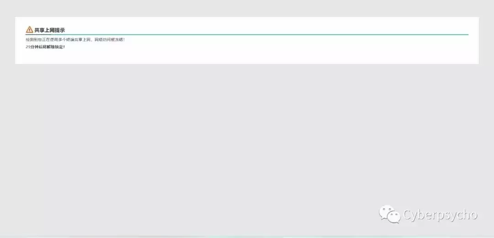

# 大学校园网共享指南——基于 OpenWRT 路由器规避/防止校园网共享检测

（点击文章底部的「阅读原文」以获得更好的阅读体验）

这篇文章原是针对我自己所在的大学而写，但基本上所有大学都适用，遂发出来分享。

到了教育部这里落实，就变成了校园网一人一号。再到运营商这里，就变成了一人一终端，还不准使用路由器。这显然已经和合规没有任何关系，学生的需求也摆在这里，但限制却还是这个鸟样。好一点的大学，比如上海交大这种坐拥华东教育骨干网的学校可以做到校园网免费，为什么我们甚至不能放开连接设备数量上的限制呢？

> 2015 年以来……目前，我校 IPV4/IPV6 总出口带宽达到 47GB，其中电信 25GB、联通 10GB、移动 10GB、教育网 2GB，校园网总注册用户数超过 4.34 万、活跃用户数超过 2.43 万。办公账户（免费）带宽由 2MB 升到 36MB。宿舍区基本账户（付费）带宽由 2MB 升到 12MB，网费不变。……

这套数据应该不是最新的，2022 年寒假校园网又进行了一次大扩容，具体扩容了多少不得而知。如果按照这套数据计算，总出口 47GB，活跃用户数 2.43 万，则人均带宽是（47GB \* 1000 \* 8）/ 24300 = 15 Mbps。这点可怜的带宽，还要给学校的官网防 DDoS，加上网安等种种因素，就变成了一人一终端这种限制。

现在的大学生还有几人是有且只有一台上网设备的？室友间的一些操作也需要一套局域网环境（文件共享、联机游戏……）指望推动学校在短时间做出这套改变不太现实。但需求总要解决，只能先自己想想办法，从技术上解决这个矛盾了。

Update 2023/10/7：在一些设备较新的学校，本文措施可能失效——可能在部署本文措施后依旧被检测到。虽然我的脚本可以自动让路由器重新上线，但上网体验会变得很差，游戏更是几乎不可能。这大概率是因为这些学校部署了 DPI (Deep Packet Inspection) 。这种情况下，基本只剩加密所有流量到代理服务器这一条路可走。

## 硬件

需要一台可以刷入 OpenWRT 的路由器，我采用的是一台 Nano Pi R2S，最好选择这种用户基数大固件多的产品，也最好能自己编译固件。

对于不会折腾/不想折腾的人群，可以去买淘宝上买别人做好的「校园网路由器」。

## 接入路由器

通过一段时间的观察，可以得到我校校园网前端的计费系统采用城市热点的 Dr.COM，这是一套非常常见的计费系统；BRAS 终端是锐捷的设备，采用 POE 方式连接锐捷的 AP，似乎没有参与认证。

我将校园网分为三大类接入方式，无线，办公区有线，学生公寓有线。

前两者都是 DHCP+Portal 验证，网页表单提交账号即可完成验证。学生公寓区域的有线设备通过 PPPoE 认证，账号信息就是校园网账号本身。

大部分学校都采用了这套方案因此路由的接入方式便确定了。**宿舍的有线直接 PPPoE 认证就可以正常上网了。对于 Portal 的要麻烦一些，若无法连接外网则判断 Portal 能否访问，能访问的话提交一个构造好的 POST 包登录即可。**

Portal 认证的脚本校友已经写过不少：

https://github.com/linfangzhi/CSUST\_network\_auto\_login

https://github.com/eigeen/csust-cn-login

https://github.com/colawithsauce/csust-network-login

基本上，每个大学都有同学写出对应的登录脚本，路由器上安好 `python` 和 `requests` 库然后运行这些脚本即可。如果因无网络不能安装，重新编译一个固件就行。再不行就写一个 Shell 脚本登录。如果必须使用 Dr.Com 客户端，则可以在路由器上安装 Dogcom 替代 Dr.Com 客户端登陆。

## 封锁状况

此时已经可以通过路由器上网了，但依然不能全寝共享。

校园网多设备共享被检测到会被临时屏蔽，此时会屏蔽所有的网络流量，据说还会强制重定向所有 HTTP 请求到`http://1.1.1.3/remind/proxy_remind.htm?tm=8`，不过我是没有遇上。

Update: 我校会强制重定向到以下网页：



校园网共享检测提示

查阅资料发现，检测是否多设备共享有两种思路，一种是通过设备流量特征识别：

-   TTL
    
-   IPID
    
-   时间戳
    
-   UA
    

另一种是侵入式流量审计，这个可能看学校，不过我校肯定是有的：

> 增强网络安全防护能力。……部署**出口防火墙、出口行为审计**……、IPS(入侵防御) 等安全设备系统，加固学校网络和信息系统的整体安全。

通过一次喊人来寝室修网络得知肯定是深信服的设备（修网络那人都登进深信服的后台了）。

通过路由器裸奔一段时间发现如下规律：

-   两台不同平台的产品（如 Windows 电脑和 iPad）同时上网会在较短时间内被封锁
    
-   封锁时用代理可以连出去，B 站也能看，其他的不行，甚至无法 Ping 通校外 IP
    
-   被封锁后重新认证也无法上网，更换 MAC 地址后才能恢复
    

得出的结论是大概率通过 UA 识别，检测到后封禁当前 MAC 地址一段时间。

## 流量处理

### 统一 TTL

将这行规则加入路由器的「网络」-「防火墙」-「自定义规则」（下同），即可统一 TTL 为 65，其中`-o br-lan`可以视情况更换，如`eth0`。

```plain
iptables -t mangle -I POSTROUTING -o br-lan -j TTL --ttl-set 65
```

这条规则用到了 `ipopt` 模块，在官方编译的固件或其他一些极简的固件里默认不会安装。这种情况下用`opkg`安装即可：

```plain
opkg update
opkg install iptables-mod-ipopt
```

保存规则并重启防火墙，在电脑上随便 Ping 一个网站看 TTL 是否为 65（不要在路由器上 Ping，除非你知道你在干什么）。

### 统一时间戳

接下来先启用 OpenWrt 自带的 NTP 服务器，然后劫持所有局域网内的 NTP 请求到路由器，以达到我们统一时间戳的目的。

这种方法并不完美，因为手机连接基站时会同步到别的 NTP 服务器，最好的办法是直接去除 TCP 包的时间戳，但这种方法暂无成熟的实现，只能先采用劫持 NTP 请求的办法。

只需要在管理页面中修改几个设置就可以了。

-   点击 System -> System（系统）
    
-   勾选 Enable NTP client（启用 NTP 客户端）和 Provide NTP server（作为 NTP 服务器提供服务）。
    
-   NTP server candidates（候选 NTP 服务器）按需设置，可以使用阿里云的 NTP 服务器：`ntp.aliyun.com`
    
-   点击 Save & Apply 按钮。
    

向防火墙添加以下规则：

```plain
iptables -t nat -N ntp_force_local
iptables -t nat -I PREROUTING -p udp --dport 123 -j ntp_force_local
iptables -t nat -A ntp_force_local -d 0.0.0.0/8 -j RETURN
iptables -t nat -A ntp_force_local -d 127.0.0.0/8 -j RETURN
iptables -t nat -A ntp_force_local -d 192.168.0.0/16 -j RETURN
iptables -t nat -A ntp_force_local -s 192.168.0.0/16 -j DNAT --to-destination 192.168.1.1
```

其中`192.168.1.1`需要更改成路由器的地址，视固件而定。

若你的路由器地址不在`192.168.0.0/16`内，最后两行都要跟着改，一般的家用路由器都在这个范围内。

Windows 下确认效果：

```plain
w32tm /stripchart /computer:baidu.com /dataonly /samples:5
```

如果能正常同步就证明配置成功了。

### 统一 UA

网上的解决方案大部分基于代理，比如 Privoxy，甚至 Clash。还有不少是通过 XMURP-UA 直接在内核层面处理 UA，这几年又有新的插件出来，比如 UA2F。

我嫌编译固件麻烦（校园网不太行编译老是报错），加上 R2S 性能也足够强，就直接采用 Privoxy，除非是软路由（性能足够强），否则不推荐这个方案。如果在普通的路由器上使用这个方案，会导致会导致 HTTP 协议的内容传输缓慢（比如 QQ 发送图片会特别慢，有的下载也会特别慢，Bilibili 手机客户端看不了视频等），这时候别无他法，只得自行编译固件以采用 XMURP-UA 或 UA2F 等。

Update：也可以尝试使用这个编译服务，编译时自定义加入`ua2f`和`luci-app-ua2f`即可，R2S 可以在这里下载编译好的。UA2F 与 Turbo ACC 冲突，记得关掉。

安装好 Privoxy 并正确配置，然后将所有 HTTP 流量转发给 Privoxy 代理，并在 Privoxy 中替换 UA。

#### 安装 Privoxy

```plain
opkg update
opkg install luci-app-privoxy
opkg install luci-app-privoxy-zh-cn
```

#### 配置 Privoxy

点击 Services -> Privoxy WEB proxy。

-   Files and Directories（文件和目录）：Action Files 删除到只剩一个框，填入 `match-all.action`。Filter files 和 Trust files 均留空。
    
-   Access Control（访问控制）：Listen addresses 填写 `0.0.0.0:8118`，Permit access 填写 `192.168.0.0/16`。Enable action file editor 勾选。
    
-   Miscellaneous（杂项）：Accept intercepted requests 勾选。
    
-   Logging（日志）：全部取消勾选。
    

点击 Save & Apply。

#### 配置防火墙转发

向路由器防火墙添加以下规则：

```plain
iptables -t nat -N http_ua_drop
iptables -t nat -I PREROUTING -p tcp --dport 80 -j http_ua_drop
iptables -t nat -A http_ua_drop -d 0.0.0.0/8 -j RETURN
iptables -t nat -A http_ua_drop -d 127.0.0.0/8 -j RETURN
iptables -t nat -A http_ua_drop -d 192.168.0.0/16 -j RETURN
iptables -t nat -A http_ua_drop -p tcp -j REDIRECT --to-port 8118
```

在路由器的局域网中打开 `http://config.privoxy.org/edit-actions-list?f=0`，点击 Edit 按钮。Action 那一列中，hide-user-agent 改选为 Enable（绿色），在右侧 User Agent string to send 框中填写 `Privoxy/1.0`或任意 UA；其它全部选择为 No Change（紫色）。点击 Submit 按钮。

如果打不开这个页面，说明之前某个地方配置有误。

#### 确认效果

本地浏览器调试是看不到效果的，因为经过路由器之前 UA 会保持原样。

访问 ua.chn.moe 以查看 UA 是否修改成功。

### 防止通过 IPID 检测

各设备的 IPID 起始值不同，并随着包数量的上升而上升，接近一条直线，若有多个设备长时间使用后会呈现出多条上升序列。这可以用来探测是否是多个设备。^fn1

由于需要`kmod-rkp-ipid`，这一步也需要编译固件。

编译好固件后向防火墙添加以下规则：

```plain
iptables -t mangle -N IPID_MOD
iptables -t mangle -A FORWARD -j IPID_MOD
iptables -t mangle -A OUTPUT -j IPID_MOD
iptables -t mangle -A IPID_MOD -d 0.0.0.0/8 -j RETURN
iptables -t mangle -A IPID_MOD -d 127.0.0.0/8 -j RETURN
iptables -t mangle -A IPID_MOD -d 10.0.0.0/8 -j RETURN
iptables -t mangle -A IPID_MOD -d 172.16.0.0/12 -j RETURN
iptables -t mangle -A IPID_MOD -d 192.168.0.0/16 -j RETURN
iptables -t mangle -A IPID_MOD -d 255.0.0.0/8 -j RETURN
iptables -t mangle -A IPID_MOD -j MARK --set-xmark 0x10/0x10
```

即可修改所有包的 IPID 为单一递增曲线。

#### 老办法

设置如下 crontab 即可在每天凌晨三点重新拨号以打断检测过程：

```plain
0 3 * * * ( ifdown wan; sleep 5; ifup wan )
```

### 侵入式流量屏蔽

向路由器防火墙添加以下规则：

```plain
iptables -I FORWARD -p tcp -m tcp –sport 80 -m u32 –u32 “5&0xFF=0x7F” -j DROP
iptables -I FORWARD -p tcp -m tcp –sport 8000 -m u32 –u32 “5&0xFF=0x7F” -j DROP
iptables -I FORWARD -p tcp -m tcp –sport 8080 -m u32 –u32 “5&0xFF=0x7F” -j DROP
iptables -I FORWARD -p tcp -m tcp –sport 80 -m u32 –u32 “5&0xFF=0x80” -j DROP
iptables -I FORWARD -p tcp -m tcp –sport 8000 -m u32 –u32 “5&0xFF=0x80” -j DROP
iptables -I FORWARD -p tcp -m tcp –sport 8080 -m u32 –u32 “5&0xFF=0x80” -j DROP
```

以屏蔽侵入式流量，以上规则来自 V2EX 网友。

这些规则用到了`iptables`的`u32`模块，大多数固件都不会默认安装，亦需要通过`opkg`安装：

```plain
opkg update
opkg install iptables-mod-u32
```

随后屏蔽学校的「共享提示」页面：

```plain
iptables -I FORWARD -p tcp --sport 80 --tcp-flags ACK ACK -m string --algo bm --string "src=\"http://1.1.1." -j DROP
iptables -I FORWARD -p tcp --sport 80 --tcp-flags ACK ACK -m string --algo bm --string "value=\"http://18.20.18." -j DROP
```

在 Openwrt 防火墙的流量规则设置如下规则：

-   源区域 WAN，源地址 1.1.1.3，目标区域设备，动作拒绝
    
-   源区域 WAN，源地址 1.1.1.1，目标区域设备，动作拒绝
    

这些规则来源于校友的博客（找不到来源，可能已经关闭了）

## 意外封锁处理

前面提到学校会封一段时间的 MAC，想要重新上线就需要更换 MAC 地址重新上线。为此我写了一个 Shell 脚本：

```plain
#!/bin/sh
DATE=$(date +%Y-%m-%d-%H:%M:%S)
interface=eth0
current_mac=$(ifconfig ${interface} | grep "HWaddr" | awk '{print$5}')
new_mac=$(dd if=/dev/random bs=1 count=3 2>/dev/null | hexdump -C | head -1 | cut -d' ' -f2- | awk '{ print "34:36:3b:"$1":"$2":"$3 }')
tries=0
while [[ $tries -lt 3 ]]; do
    if /bin/ping -c 1 223.5.5.5 >/dev/null; then
        echo --- exit ---
        exit 0
    fi
    tries=$((tries + 1))
done
echo $DATE block detected, replacing mac address >>watchdog.log
ifdown wan
sleep 3
ifconfig ${interface} hw ether $new_mac
sleep 2
ifup wan
echo $DATE old address $current_mac has been replaced with $new_mac >>watchdog.log
```

将这个脚本保存到路由器的 home 目录下（用`vim`粘贴保存就可以了），设置如下 Crontab 每分钟执行一次：

```plain
* * * * * sh /root/net_watchdog.sh
```

路由器就会自每隔一分钟检测是否在线，如果掉线，则随机更换 MAC 地址并重新上线，日志将会记录在同目录下的`watchdog.log`中。


Shell 自动检测是否掉线

## DNS 内网解析处理

接上路由器之后，校外资源可以正常访问，反倒是校内资源全都无法访问了。经排查发现是路由器下的设备无法解析出正确的 IP 地址，但路由器本身又没有问题。

暂时不清楚是什么原因导致的，但解决起来很简单，可以直接把已知的内网地址 dnsmasq，但我推荐安装 SmartDNS 来解决。

SmartDNS 的安装可以参考官方教程。

-   开启 SmartDNS 并让其接管路由器的主 DNS
    
-   设置 SmartDNS 上游为学校内网提供的 DNS，我校是`10.255.255.25`和`10.255.255.26`
    
-   设置别的上游，可以参考这篇博客
    

这样设置下来，内网资源就可以正常访问了。

## 参考

-   https://www.mr-cn.net/2021/06/15/Share-your-network-in-CSUST/
    
-   https://catalog.chn.moe/%E6%8A%80%E6%9C%AF/OpenWrt/%E5%9C%A8%E5%8E%A6%E5%A4%A7%E5%AE%BF%E8%88%8D%E5%AE%89%E8%A3%85%E8%B7%AF%E7%94%B1%E5%99%A8/
    
-   https://catalog.chn.moe/%E6%8A%80%E6%9C%AF/OpenWrt/%E4%B8%BA%E5%95%A5%E6%88%91%E7%9A%84%E8%B7%AF%E7%94%B1%E5%99%A8%E4%BC%9A%E8%A2%AB%E6%A3%80%E6%B5%8B%E5%88%B0/
    
-   https://superuser.com/questions/451018/how-can-i-query-an-ntp-server-under-windows
    
-   https://github.com/krabelize/openwrt-random-mac-changer/tree/master
    
-   https://github.com/CHN-beta/rkp-ipid
    
-   https://www.sunbk201.site/posts/crack-campus-network