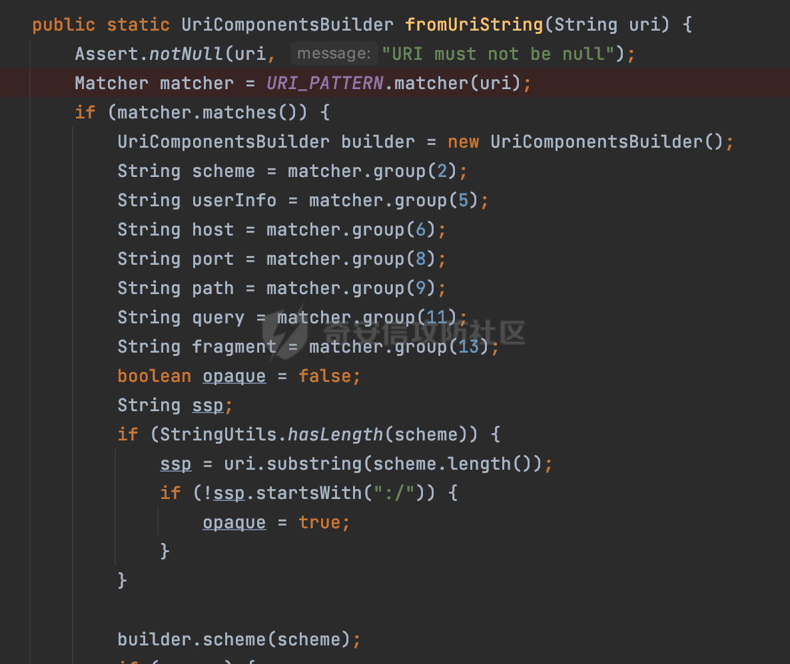
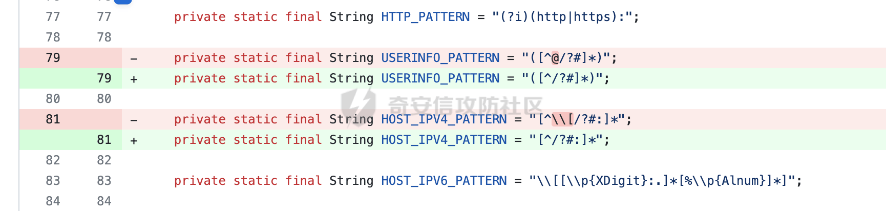
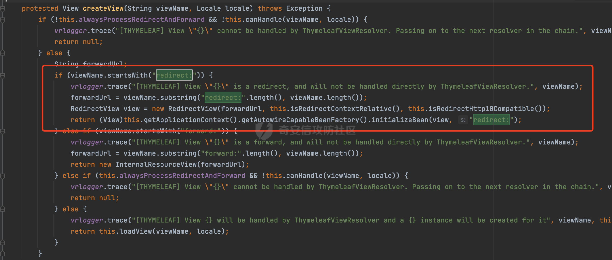
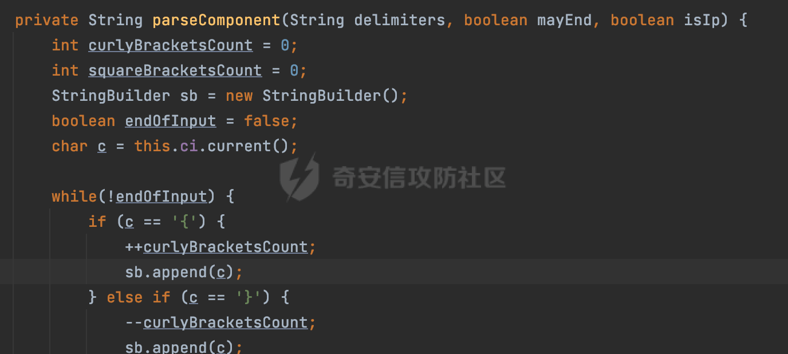

# 奇安信攻防社区-CVE-2024-22259(CVE-2024-22243绕过)浅析

# 0x01 前言

Spring官方近期披露了CVE-2024-22243，在受影响版本中，由于 UriComponentsBuilder 处理URL时未正确处理用户信息中的方括号 `[` ，攻击者可构造包含方括号的恶意URL绕过主机名验证。如果应用程序依赖UriComponentsBuilder.fromUriString()等方法对URL进行解析和校验，则可能导致验证绕过，出现开放重定向或SSRF漏洞。由于修复不完善，导致了绕过。所以Spring官方披露了CVE-2024-22259进行了补充。

# 0x01 CVE-2024-22259

## 1.1 漏洞描述

在受影响版本中，UriComponentsBuilder是Spring Web中用于构建和操作URI的工具类。由于对CVE-2024-22243的修复不充分，攻击者可构造一下两类 url 绕过主机名验证，导致开放重定向或SSRF漏洞。


## 1.2 影响版本

Spring Framework

-   6.1.0 - 6.1.3
-   6.0.0 - 6.0.16
-   5.3.0 - 5.3.31
-   Older, unsupported versions are also affected

## 1.3 漏洞分析及复现

问题主要还是在URI的工具类UriComponentsBuilder中，对CVE-2024-22243的修复不充分进行了补充。CVE-2024-22243的具体分析可以参考[https://forum.butian.net/share/2781。](https://forum.butian.net/share/2781%E3%80%82)

在具体漏洞版本中，以org.springframework.web.util.UriComponentsBuilder#fromUriString方法为例，实际上整个逻辑比较简单，主要是通过正则匹配URI中各个部分的内容，然后完成对应的封装：



同时若未匹配相关信息，会抛出`throw new IllegalArgumentException("[" + uri + "] is not a valid URI");`异常，否则进行进一步的封装，同时这里对scheme和host进行了一定的合法性检查：


下面通过相关的commit记录[https://github.com/spring-projects/spring-framework/commit/1d2b55e670bcdaa19086f6af9a5cec31dd0390f0](https://github.com/spring-projects/spring-framework/commit/1d2b55e670bcdaa19086f6af9a5cec31dd0390f0) 查看具体的修复方式：

首先对正则进行了调整，移除了USERINFO中对`@`以及IPV4格式的host对方括号 `[`的匹配：



对@的匹配形式进行了调整：


其次对原有scheme和host的合法性检查进行了调整，原本是检查scheme必须以http开头且host不允许为null，修复版本统一封装到checkSchemeHost方法进行检查了：


checkSchemeHost方法实现如下，在原有基础上，若请求url中的 host 以 `[`开头但不以 `]` 结尾的话会抛出异常：


三梦师傅也公开了对应的poc：

```Java
UriComponents uri =UriComponentsBuilder.fromHttpUrl("http://@forum.butian.net[@risk.com").build();
```

可以看到跟CVE-2024-22243情况类似，解析完成后USERINFO为null，对应的host并不是预期的risk.com，而是forum.butian.net：


在某些场景下可能会通过返回的UriComponents可以轻松的获取URI中类似协议、端口、host等各部分内容。例如可以通过getHost方法获取当前请求的host，结合实际的业务场景检查在不在可允许的域名范围或者ip内，来避免类似SSRF/Open Redirect等安全风险。

若发起请求的http组件能解析上述的URL，且获取到的host存在解析差异的话，会由于解析差异导致绕过安全检查的风险。

# 0x02 实际缺陷场景

实际的缺陷还是集中在类似的安全检查中，结合host解析差异导致了绕过的风险。下面看一些实际的缺陷场景。

## 2.1 URL Redirect

Java中最常见的重定向方式就是通过HttpServletResponse跳转。其会向浏览器发送一个特殊的Header，然后由浏览器来做重定向，转到指定的页面：

```Java
@GetMapping("/redirectUrl")
public void redirect(String url, HttpServletResponse response) throws IOException {
    URL test = new URL(url);
    response.sendRedirect(url);
}
```

上述poc浏览器在解析跳转时会直接重定向到risk.com去。此时若通过UriComponentsBuilder工具类获取请求的host进行安全检查时，会存在被绕过的风险。

此外，在三梦师傅提供的demo里，通过Spring的redirect视图同样也存在类似的场景：


以SpringBoot中的ThymeleafViewResolver为例，查看具体的实现方式。

首先调用createView方法，创建视图，并且判断传入的视图名是否是以"redirect:"开头，然后通过截取字符串获取重定向的url：



然后创建RedirectView对象,会调用renderMergedOutputModel()方法对视图进行渲染，并调用sendRedirect()方法:


在sendRedirect()方法,实现转发的方式是通过HttpServletResponse跳转：


## 2.2 SSRF

相比URL Redirect，SSRF会更苛刻一些。在绕过了结合UriComponentsBuilder工具类实现的安全检查后，还必须考虑对应的url是否能被对应的http组件成功解析，达到利用的目的。

类似httpclient4在请求上述的poc时，会抛出IllegalArgumentException异常，无法正常请求：


本质上是因为其会通过org.apache.http.client.utils.URIBuilder解析url来获取host，是在基于java.net.URL上进行处理的。

httpclient3在解析时则会抛出Invalid uri异常导致无法正常请求：


对一些常见的http请求组件进行了枚举，发现其中okhttp3可以成功解析上述poc并成功请求risk.com:


```Java
Request request = new Request.Builder()
        .url("http://@forum.butian.net[@risk.com")
        .build();
```


具体okhttp的解析过程可以参考[https://forum.butian.net/share/2427](https://forum.butian.net/share/2427)

# 0x03 拓展

## 3.1 JerseyUriBuilder

Jersey是JAX-RS API的一种具体实现，它提供了一套完整的、易于使用的RESTful Web服务框架，可以帮助Java开发人员更快速、更方便地构建RESTful Web服务。同样的也有着类似UriComponentsBuilder的工具类。

在Jersey的请求解析过程中：


首先从HttpServletRequest对象中获取到请求URL、Servlet路径和请求URI等信息，然后调用`UriBuilder.fromUri()`方法，从给定的字符串中解析出URI，并返回一个对应的UriBuilder实例。如果输入的URL字符串不符合URI格式，就会抛出IllegalArgumentException异常：


跟Spring的UriComponentsBuilder类似，javax.ws.rs.core.UriBuilder同样也提供了一种简单而强大的方式来构建和处理 URI，避免了手动拼接字符串的繁琐和容易出错的问题。通过添加路径、查询参数、片段等组件来构建完整的 URI:

```Java
UriBuilder absoluteUriBuilder = UriBuilder.fromUri(url);
URI uri = absoluteUriBuilder.build();
```

当然也可以直接使用org.glassfish.jersey.uri.internal.JerseyUriBuilder来构建完整的URI,解析过程是类似的：


```Java
UriBuilder absoluteUriBuilder = JerseyUriBuilder.fromUri(url);
URI uri = absoluteUriBuilder.build();
```

下面简单看看具体的解析过程：


具体的解析是通过org.glassfish.jersey.uri.internal.UriParser#parse方法进行处理的：


在解析过程中，会遍历对应URL的字符，并通过对应的分隔符delimiters调用parseComponent方法获取对应的模块的内容：



解析Authority内容同理，可以看到host的内容为经过一系列分隔符处理后的comp的值：


在请求上述poc时，最后获取的host内容如下：


解析完成后，会通过build方法将解析结果转换成java.net.URI对象，即可获取对应的属性了。

正常情况下，将解析后的结果`http://@forum.butian.net``[``@risk.com`实例化成URI对象因为包含不合理的字符抛出java.net.URISyntaxException异常：


但是UriBuilder在实际处理时会有自己的逻辑,具体实现在org.glassfish.jersey.uri.internal.JerseyUriBuilder#\_build方法：


如果对应的values不为空，会直接实例化java.net.URI对象，否则调用org.glassfish.jersey.uri.UriTemplate#createURI进行进一步处理,处理后继续调用createURI方法实例化java.net.URI对象，此时会抛出java.net.URISyntaxException异常：


jersey对异常进行了捕获处理，此时会设置host为null，也就是说 类似上述的CVE-2024-22259/CVE-2024-22243的poc最后获取到的host均为null：


虽然Jersey工具类在解析上述poc时获取到的host为null，在存在解析差异的前提下，若处理不当仍可能会存在潜在的绕过风险。下面是一个实际的安全检查例子：

首先看一个具体代码防护逻辑：

```Java
if (StringUtil.isNotBlank(host)) {
    //非法参数：url不在可允许的域名范围或者ip内
    return !checkHost(host);
} else {
    return true;
}
```

NullPointerException异常是Java中的一种运行时异常，它通常在程序中出现空指针引用时抛出。当尝试对一个为null的对象进行方法调用、属性访问或者数组操作时，就会触发NullPointerException异常。

为了避免在host检查时不必要的NullPointerException异常问题，在检查时先进行了判空操作，然后再校验请求host是否合法。这里如果获取到的host为null的话，也会返回host合法。

因为在实际请求过程中，大很多时候会认为**实际上请求一个null的host并不能成功，会根据对应的异常捕获机制进行处理**。所以逻辑上应该没有什么问题。实际上结合前面的分析okhttp3却能完成对应的请求。在实际的代码审计过程中需要额外注意。

## 3.2 其他

结合上面的案例，在实际业务场景中，如何安全的获取请求的host对开放重定向或SSRF漏洞进行防御是一个很值得思考的问题。主要需要解决解析差异的问题。下面列举一些实际的方法。

例如在进行SSRF漏洞防护时，可以结合对应的http请求组件进行AsyncDns的处理。例如okhttp提供了类似的接口[https://square.github.io/okhttp/4.x/okhttp/okhttp3/-dns/lookup/](https://square.github.io/okhttp/4.x/okhttp/okhttp3/-dns/lookup/) ，因为都是同一个组件内的解析，避免了解析差异导致的绕过问题：


此外，有时候可能需要一个通用的工具类进行获取，前面也分析过Java中比较常见获取host的场景，通过`URI uri = new URI(url);`进行获取，结合其对应的非法字符检查，安全性会更高一些。

但是在实际编写检测逻辑时还是需要考虑具体的业务场景，以URL Redirect为例，存在风险的代码可能存在如下几种情况：

-   直接获取整个url链接进行请求，比如response.sendRedirect(url)
-   预定义好了协议，拼接了域名，比如 response.sendRedirect("http://"+url)
-   预定义好了协议和域名，但是存在使用@或者.绕过的问题，比如response.sendRedirect("[https://xxx.xxx.com"+url](https://xxx.xxx.com/))

那么在获取host时就要结合实际的场景进行考虑，避免类似前面返回null的host导致检查失效的问题：

```Java
URI uri = new URI(url);
return uri.getHost().toLowerCase();
```