# 奇安信攻防社区 - 实战 | 记某次逆向小程序解密及签名破解

### 前言

这是之前做的一个项目，想着从小程序入手，当我打开 burp 抓到流量看到加密的数据包，以及 sign 签名参数的时候，我就知道接下来是一场硬仗要打了，看我如何一步步解密并破解签名，且听我娓娓道来。

### 解密数据包

首先打开小程序并抓取数据流，发现数据包不管是请求包还是响应包都存在加密如下：  
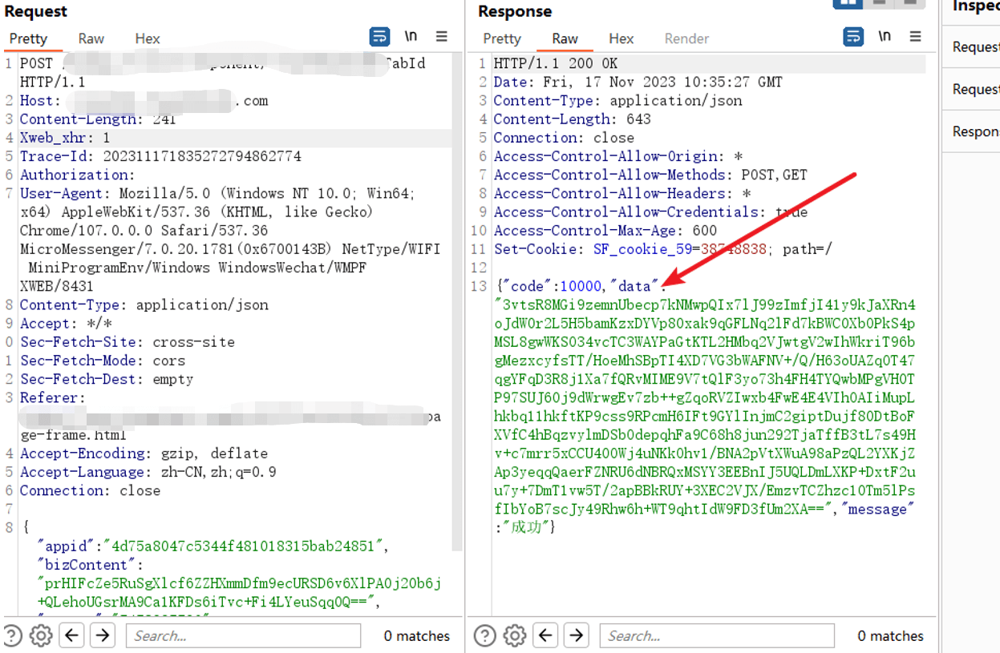  
同时发现有验签，无法重放数据包，再次发包提示重复提交如下：  
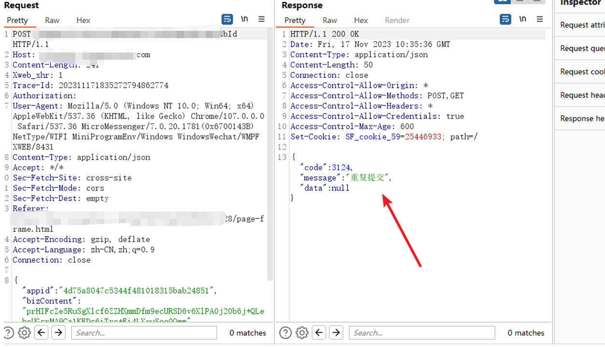  
首次先解决加密问题，反编译小程序，这里使用的反编译工具为 wxapkg。比较好用，地址为：

```php
https://github.com/wux1an/wxapkg
```

这个工具可以直接扫描本地缓存的小程序：  
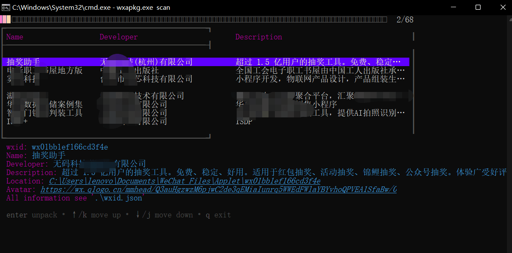  
上下键选择小程序，直接回车即可在工具当前路径下保存此小程序源码：  
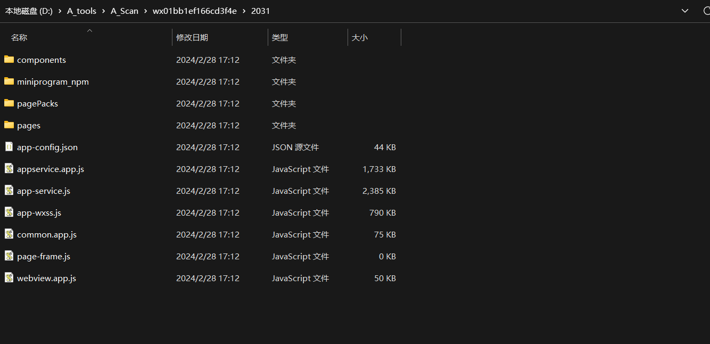  
小程序源码有了，现在定位加密代码：  
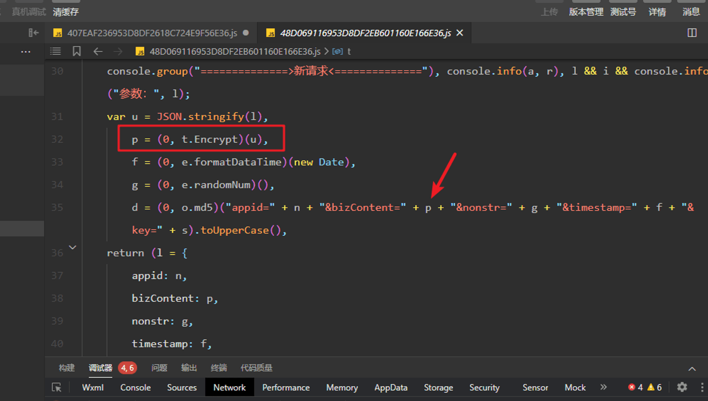  
进入 t 的 Encrypt 方法，发现 bizContent 参数的加密方式为 AES，加密模式为 CBC，填充为 pkcs7，key 和 iv 为 HqNRc2XXXXXXXXXXX0wsiw==  
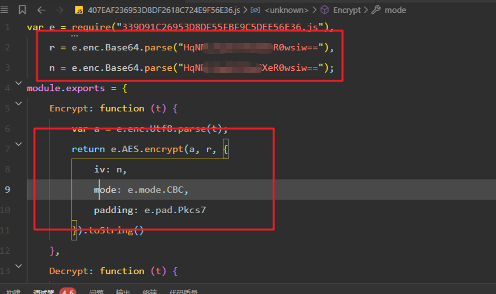  
编写如下脚本进行测试：

```python
from cryptography.hazmat.primitives.ciphers import Cipher, algorithms, modes
from cryptography.hazmat.backends import default_backend
import base64

key_base64 = "HqNRXXXXXXXXXXXXwsiw=="  # 替换为你的 Base64 编码的密钥
iv_base64 = "HqNRXXXXXXXXXXXXXwsiw=="   # 替换为你的 Base64 编码的初始向量

def encrypt(text):
    key = base64.b64decode(key_base64)

    iv = base64.b64decode(iv_base64)
    cipher = Cipher(algorithms.AES(key), modes.CBC(iv), backend=default_backend())
    encryptor = cipher.encryptor()

    padded_data = text.encode('utf-8') + b"\0" * (16 - len(text) % 16)  # PKCS7 padding
    ciphertext = encryptor.update(padded_data) + encryptor.finalize()

    return base64.b64encode(ciphertext).decode('utf-8')

def decrypt(encrypted_text):
    key = base64.b64decode(key_base64)
    #print(base64.b16encode(key))
    iv = base64.b64decode(iv_base64)
    cipher = Cipher(algorithms.AES(key), modes.CBC(iv), backend=default_backend())
    decryptor = cipher.decryptor()

    encrypted_data = base64.b64decode(encrypted_text)
    decrypted_data = decryptor.update(encrypted_data) + decryptor.finalize()

    return decrypted_data.rstrip(b"\0").decode('utf-8')  # Remove PKCS7 padding

# 测试
while 1:
    enc_data = input("输入密文：")

    print("-----------------------------------------------------------------------------------------------------------")
    print("\n\n\n\n\n明文是："+decrypt(enc_data))
    print("-----------------------------------------------------------------------------------------------------------\n\n\n\n\n")
```

运行脚本，输入密文，发现解密成功：  
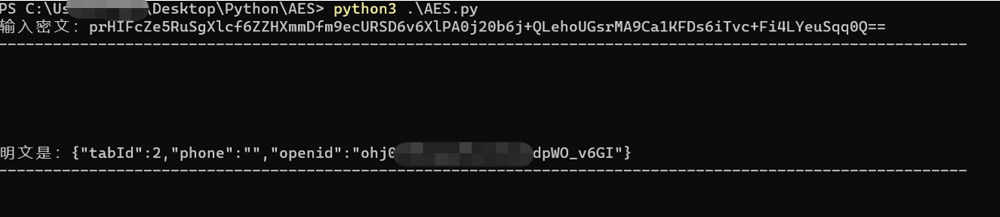

### 破解签名

上文解密了数据包，接下来需要破解签名，解决数据包无法重放的问题，定位到加签代码位置，查看加签逻辑，**发现加签逻辑为 appid=&bizContent=&nonstr=&timestamp=&key = 拼接值之后的 md5 值并转换为大写。**  
其中 appid 和 key 为固定值如下：

```php
appid: 4d75a8047XXXXXf481018315bab24851
key: 5cdf4b8d27XXXXXX88b5d2a4d7ff985b
```

bizContent 为 AES 加密后的实际请求内容  
nonstr 为随机数，在签名中可不变动  
timestamp 为时间戳，重放加签的时候需要像后修改不同时间戳  
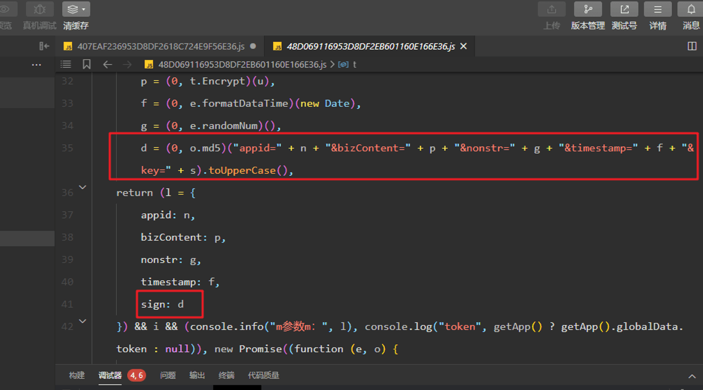  
现在了解了加签逻辑，为方便测试，再写一个加密脚本，获取 bizContent 的 AES 加密后的值，脚本代码逻辑和上面差不多，这里为避免占用篇幅就不贴了，加密如下：  
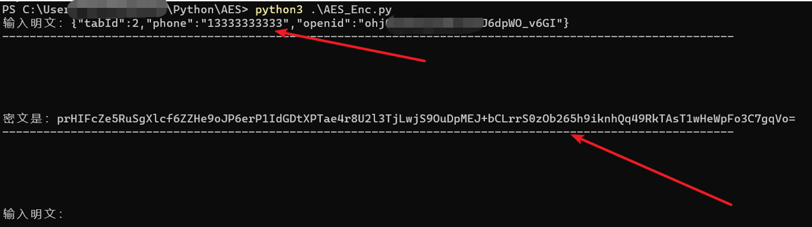  
加密内容有了，appid、key 为固定值，nonstr 为随机数，所以破解验签脚本如下：

```python
import hashlib

def sign():
    appid = '4d75a8047XXXXXX8315bab24851'
    bizContent = input("输入 bizContent：")
    nonstr = '8888888888'
    timestamp = input("输入 timestamp：")
    key = '5cdf4b8d27XXXXXX5d2a4d7ff985b'
    all_data = "appid="+appid+"&amp;bizContent="+bizContent+"&amp;nonstr="+nonstr+"&amp;timestamp="+timestamp+"&amp;key="+key
    print(all_data)
    md=hashlib.md5(all_data.encode())   # 创建 md5 对象
    md5pwd=md.hexdigest()   # md5 加密
    print("签名是：\n"+md5pwd.upper())
    print("-----------------------------------------------------------------------------------------------------------\n\n\n\n\n")

while 1:
    sign()
```

生成新的验签如下：  
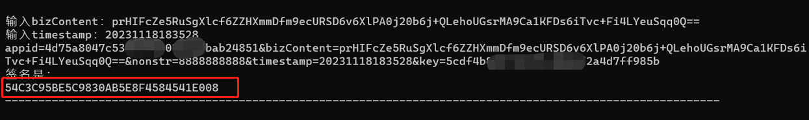  
使用新的签名进行数据包的重放，发现重放数据包成功，签名破解成功。  
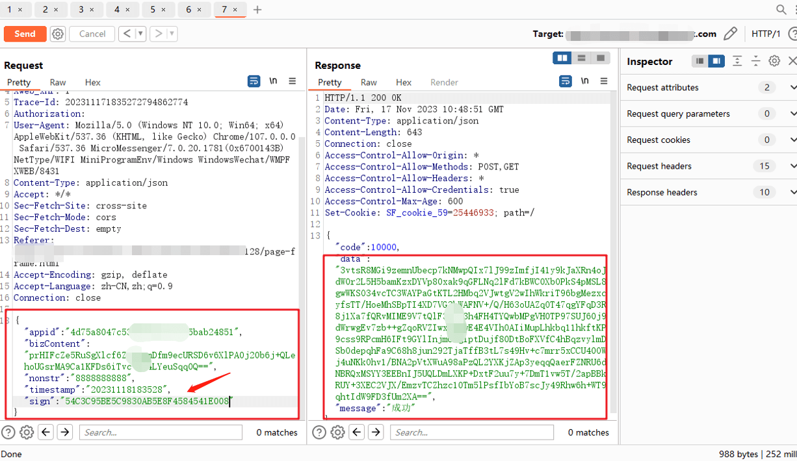  
解密返回的数据包：  
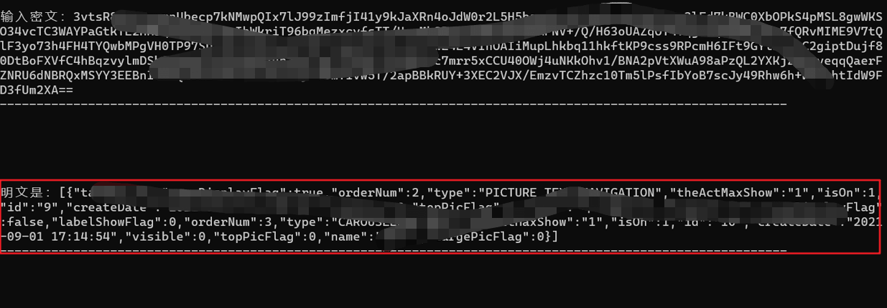

### 小结

上文重点讲解了小程序数据包解密以及签名破解过程，如有错误，请斧正。
