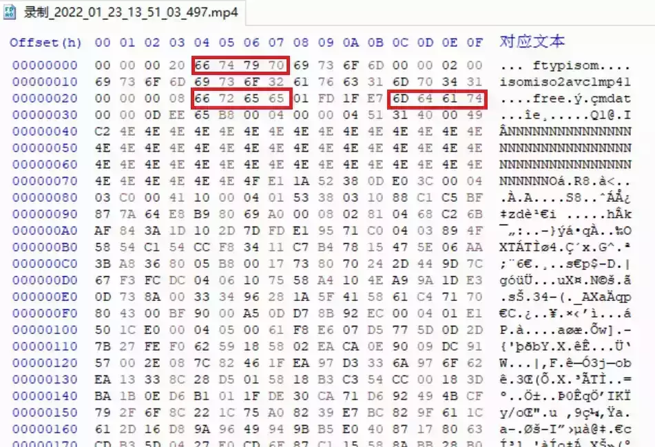
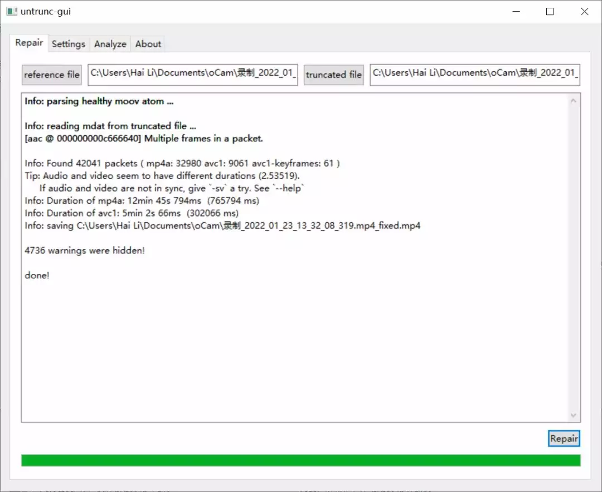

# 如何修复损坏的视频文件

  

**引言**

 Introduction

  

  

最近在使用 oCam 录屏软件录制一次会议的时候出现了小意外，录制快要结束的时候，oCam 死机了。虽然在硬盘上可以找到录制的文件，但是使用各种播放器都无法播放，所以对视频修复做了一点小调查，几乎把网上所有的视频恢复软件都试用了一次，最后利用 Untrunc 软件成功地恢复了视频。今天就和大家分享一下自己的经验。

  

  

**修复原理**

Principle

  

每个 MP4 文件都是由若干个 box 组成的。每个 box 都至少包括 32 位的长度字段和 32 位的类型字段。在图 1 所示的文件中，所有红色框标出来的就是 box 的类型字段。

图 1 MP4 文件举例

**最重要的几个 box 是：**

● **ftyp box**，在文件的开始位置，描述的文件的版本、兼容协议等；  

● **moov box**，包含本文件中所有媒体数据的宏观描述信息，moov box 下有 mvhd 和 trak box。

b) **trak**中的一系列子 box 描述了每个媒体轨道的具体信息。

● **mdat box**，编码后的媒体数据。

录制软件一般都是先写入 ftyp box 和 mdat box 以记录媒体数据，在录制完成时再写入 moov box，因为 moov box 中包括的时长数据只有在录制完成才能计算出来。如果录制软件死机，就可能造成录制的媒体数据被写入文件，而视频的 moov box 信息没有写入文件的情况。

对于播放软件而言，没有 moov box 就无法知道视频的基本信息，包括所采用的编码格式、视频的尺寸等，就无法播放。

所以，如果媒体数据被写入，而 moov box 没有来得及写入就可以采用本文介绍的修复软件进行文件恢复。

我还遇到过一次摄像机因为没电而意外关机的情况，虽然生成了很大的数据文件，但是数据文件的内容都是 FFH，这是因为关机时在缓存中的视频数据没有来得及写入 SD 卡。对于这种情况，任何修复软件都是无能为力的。

  

**Untrunc**

**使用方法**

Method

  

在试用了国内外各种视频修复软件以后，个人以为**Untrunc**是解决前面所说的视频文件破损的最佳工具。

Untrunc 是意大利人 Federico Ponchio 开发的一个开源软件，在他的个人网站（http://vcg.isti.cnr.it/~ponchio/untrunc.php）上介绍了这个工具的工作原理，其代码公布在 Github 上（https://github.com/ponchio/untrunc）。不过原始的 Untrunc 是个命令行工具，而且没有提供 Windows 上的版本，使用起来略有不便。我建议采用 Anthon Lockwood 派生的版本（https://github.com/anthwlock/untrunc）。这个版本提供了易用的图形界面和编译好的 Windows 版本，修复了一些错误并对性能进行了改进。

图 2 Untrunc 的图形用户界面

最后说明一点，Untrunc 采用的是 GPL 协议，这个协议要求对它进行修改的软件也必须公开源代码。

  

  

 文稿 || 李海老师

 排版 || 赵阳