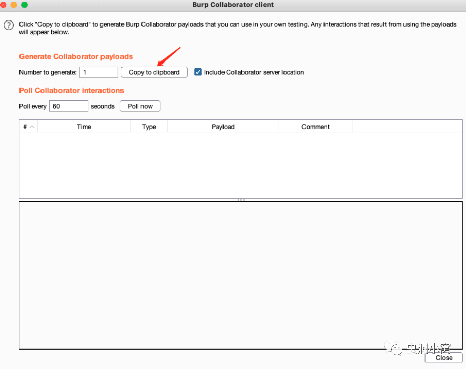

# 如何利用好 BurpSuite 在企业 src 中捡洞

**01**

**前言  
今天分享一些实用的 BurpSuite 插件实用技巧，帮助白帽子如何在竞争激烈的 src 挖掘中吃上一块肉。  
**

**02**

 **ssrf-King 在 BurpSuite 中实现自动化 SSRF 检测**

推荐插件：ssrfking     支持扫描和自动发现 SSRF 漏洞

https://github.com/ethicalhackingplayground/ssrf-king/

首先使用 bp 中自带的类似于 dnslog 的工具 Burp Collaborator 生成地址

加载功能插件 SSRF-King，把我们的地址填入即可

在测试过程中就会被动检测，我们不用去管他，正常点击测试功能点即可。

**03**

**inql****极其便捷测试****GraphQL****漏洞**

  

## 这里先来简单了解一下什么是 GraphQL，简单的说，GraphQL 是由 Facebook 创造并开源的一种用于 API 的查询语言。

## GraphQL 核心组成部分

### ****1.Type****

用于描述接口的抽象数据模型，有 Scalar（标量）和 Object（对象）两种，Object 由 Field 组成，同时 Field 也有自己的 Type。

### ****2.Schema****

用于描述接口获取数据的逻辑，类比 RESTful 中的每个独立资源 URI。

### ****3.Query****

用于描述接口的查询类型，有 Query（查询）、Mutation（更改）和 Subscription（订阅）三种。

### ****4.Resolver****

用于描述接口中每个 Query 的解析逻辑，部分 GraphQL 引擎还提供 Field 细粒度的 Resolver（想要详细了解的同学请阅读 GraphQL 官方文档）。

我们通常在实战中遇到 graphql，GraphQL 内置了接口文档，你可以通过内省的方法获得这些信息，如对象定义、接口参数等信息。

通常我们会借助在线工具来构造请求包

但是 inql 插件就极其方便了，GraphQL 端点粘贴到此处并点击加载

等待片刻，去使用 attacker 功能，便可以生成请求包，我们就可以愉快的测越权，注入等漏洞了，无需去了解复杂的 GraphQL 请求构造语法。

**04**

**Autorepeater 发现越权，未授权，甚至 ssrf 漏洞**

  

Autorepeater 可以说是复杂版本的 Autorize，它可以针对细化参数实现更加准确的测试，如通常涉及到的 uuid,、suid、uid 等用户参数。但是，它的设置有些麻烦，比如下面这种 uuid 的替换测试，需要手动设置：

使用时候打开开关即可

可以看到，该工具会自动替换你填入规则的 token，ssrf 测试的 dnslog 地址去测试，然后返回包比对包的大小，结果一目了然，若发现包大小差距过分的大可留意是否是测到了未授权或越权等漏洞，还是非常实用的。

  

  

**05**

**routevulscan 结合插件快速获取大批量资产敏感目录**

Burpsuite - Route Vulnerable Scanning 递归式被动检测脆弱路径的 burp 插件

是 github 上一位师傅开发的一个插件，我个人非常喜欢用，捡洞神器，在实战中我认为他的亮点是递归式，并且在发现一些未授权的漏洞时候相当好用，如果我们面对大批量资产，想快速捡洞，可以结合 chrame 插件 Open Multiple urls

  

这个插件可以批量打开大量的 url 地址，当然功能不止这些，不过我们结合 routevulscan 可快速发现大量资产中未授权的漏洞

使用时候打开开关，在 routevulscan 配置好常见的未授权漏洞规则或者常见的，通常具有“一打一个准”的后台，如 nacos 的后台登录口，druid 未授权，swagger 文档等，捡洞速度极快。

