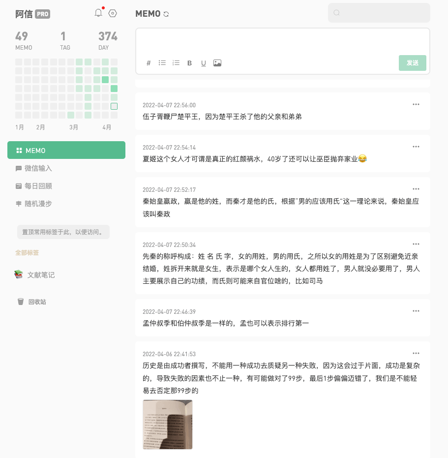
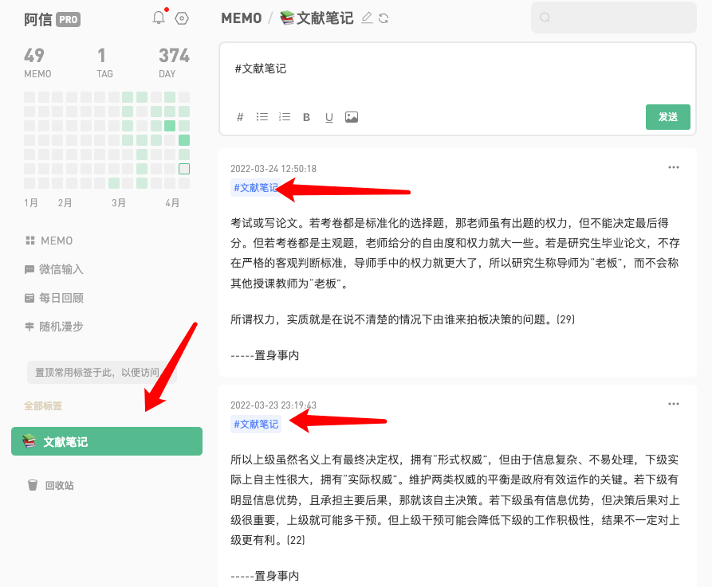
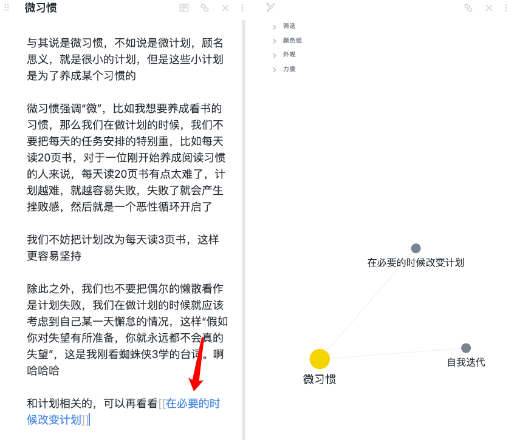
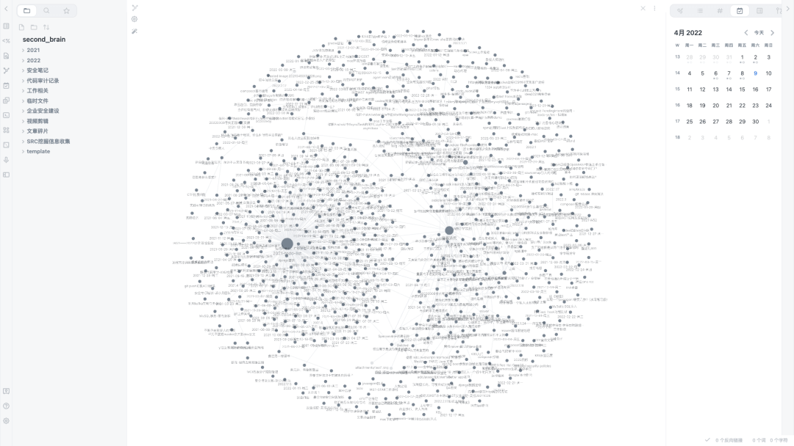
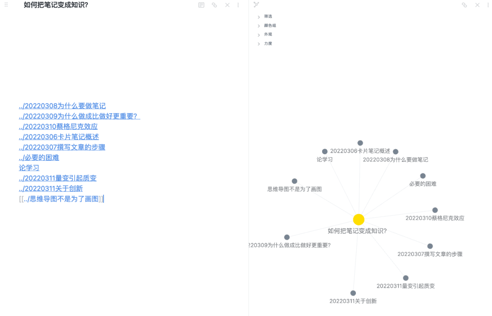

# 如何把笔记变成知识？

不知道大家平时有没有记录或者做笔记的习惯？  

我自从大二开始在同专业师兄的督促下写博客以来，一直都爱记点东西，无论是比较日常的购物清单，还是自我管理的 todo list，亦或是各种总结以及学习笔记，无论形式，就单单记录这件事本身就超酷的好吧，主要是以后翻阅到自己的笔记可以很清晰的看到自己的成长轨迹，也可以看到自己在各个阶段的思想状态，曾经的记录就像是曾经的 QQ 空间一样，有时候让人不忍直视，有时候让人无比怀念

记录的好处不必多言，但是我今天不想聊那么多有的没的，主要是想聊聊怎么通过笔记武装自己的大脑🧠

在脱离了高中的填鸭式教育过后，我的笔记风格就开始放肆起来，再也没有什么分门别类的笔记本、错题本，我喜欢把所有笔记都记录在一个本子上，后来才明白，原来我这种方法就叫做“一体式笔记”

现在我也发现，给笔记进行分类真的是一件累人且愚蠢的事情

### 不要再给笔记分类

中学时期我们喜欢将笔记分门别类，这没有什么问题，因为我们很明确的知道自己将要学习什么，我们按照科目进行分类：历史、地理、数学、语文

我们按照这几个大类别进行笔记的书写，基本来说，在考试复习时，这种分类提高了我们的效率，但是现在的我们不考试了，我们阅读、学习可能是因为兴趣，也可能是为了增长洞见，那么我们重新来审视一下上面的分类，有没有可能历史和地理它分不了家呢？

有人做过统计，《三国演义》一百二十回，其中七十多回提到了荆州，为什么荆州如此重要呢？是什么让它成为了一个兵家必争之地？

我最近在读一本书《透过地理看历史》，书中给出了答案：

> 整个荆州地区就像一个大口袋，襄阳就是这个口袋的出入口。中间是江汉平原、洞庭湖平原、东西两边延长江只有一个小出口，西边是三峡，东边是沿九江一带的河谷。其他地方全被大山包裹的严严实实，进去极其艰难。平原地区产粮，有粮就可以屯兵。何况荆州这个地方雨水多，水稻一年两熟，所谓“湖广熟，天下足”。荆州既能养兵，又能防守，可谓得天独厚。从整个中国的形势上看，一旦控制了荆州，就可以越过长江天险，顺江而下控制江东，进而控制整个中国的南方地区。

如果不了解荆州的地理位置就很难理解荆州的战略地位。

我们再把语文拿进来，说说语文、地理、历史三个分类下可能产生的联系。

我们都知道，李白有一首诗《早发白帝城》，其中有一句很出名 —— 朝辞白帝彩云间，千里江陵一日还。

先来说说这首诗的历史背景，大概就是安史之乱后，李白投错了阵营，被判长期流放夜郎，次年行至巫山时被赦，于是他立马从白帝城乘舟返回江陵，李白这小子当时肯定是乐坏了，于是在途中写了这首诗。

然后我们从地理的角度来看这首诗，白帝城在现在的三峡，江陵在荆州的江汉平原，白帝城和江陵之间是通过长江相连的，而且白帝城是上游，所以这里的“千里江陵一日还”就是形容这段水路很快

你看，有了历史和地理的背景知识，这首诗一下子就活起来了，你仿佛都可以看到李白的那股兴奋劲儿。

但是如果我们把上面的笔记分别记录在了三个笔记本上，自然就会带着“他们是毫无关系的”这种观念去审视，不利于构建我们的知识体系。

而写在一个笔记本上，不仅方便我们管理笔记，也方便我们在翻阅笔记的时候，发现笔记之前的联系

除此之外，**分类有一个坏处就是，它是自顶向下的**，正如我前面所提到的，当我们明确地知道我们要学什么的时候，分类是一个很好的归纳知识的办法，但是当我们脱离了校园，我们在工作生活中产生的想法，很难预知到它属于什么分类，有可能它属于好几个分类

**分类太大导致我们很难定位到想要的笔记，分类太小又会带来笔记的混乱**，甚至有时候需要不停地调整分类，这都是给笔记分类引入的问题

如果一件事情做起来让我们感觉很吃力，我们就很难坚持下去，所以我们需要让记笔记这件事情变得更轻松，且同时要保证笔记的功效

让记笔记变得轻松我们可以通过写一体式笔记实现，那怎么让笔记变得更有用呢？

这得看你对“有用”的定位是怎样的？

于我而言，我希望自己的笔记有两个功效 —— **辅助我思考、备忘**

最好的效果就是，我写下这条笔记的同时，我就已经掌握这个知识了，但是这个有点太理想了

因为人是会遗忘的，今天我可能确实理解了，但是明天我可能就忘了，所以回顾就显得很重要了，但是我又不太喜欢定期去翻笔记本这种干巴巴的回顾方式，定期翻阅就像是背课文一样枯燥

如果我笔记本里有 100 条笔记，我每天回顾一次，还是只收获了 100 个知识，如果回顾的时候没有思考，可能这 100 条笔记都不再是**知识**，而只是 100 条**信息**，要知道**记住不等于学会**。

那么，有没有一种方法可以让我这 100 条笔记像存在银行里的钱一样，产生复利效应？

有，也许卢曼的卡片笔记法可以帮到我们。

### 让笔记建立关系

大家也许听说过一些笔记方法，例如：子弹笔记，康奈尔笔记

上面的笔记方法在我看来都有点流于形式，于我而言太复杂了。

我今天想给大家介绍的是卢曼卡片笔记法

卢曼是 20 世纪 60 年代德国著名的社会学家，他曾在 30 年内出版了 58 本著作，其中不少成为了领域内的经典之作。而他在成为社会学家之前，只是一个普通的公务员，那么是什么让他迅速跻身学术界呢？

就是他使用的卡片笔记法，卢曼通过卡片笔记法共记录了 9 万张卡片，正是这些卡片笔记生产了前面提到的那 58 本著作。

那么这个卡片笔记法到底要怎么操作呢？

在我看来主要有两个要素：

-   笔记写在一张卡片上
    
-   将这张卡片与其他卡片关联
    

其实这两个要素归根到底还是同一个，那就是要**建立笔记之间的联系**，之所以强调要把笔记写在卡片上是因为卡片的一面可以写笔记内容，另一面则可以记录下这张卡片与其他笔记的关系

卢曼那个年代要想方便的建立笔记之间的联系只能通过“卡片”这种改变笔记载体的方法来实现，而现在的我们，则可以用各种软件实现笔记的关联，比较出名的双向链接笔记软件有 room research、zettelkasten 以及 obsidian，前面两款我都没有调研过，没啥发言权，而 obsidian，我已经使用一年了，可以给大家简单分享下

Obsidian 完全就是按照卢曼的卡片盒思想设计的一款笔记软件，当然他的功能已经远远超出简单的卡片盒了，这个后面有机会我再介绍

不过在介绍 Obsidian 的使用之前，我们先来了解下卢曼的卡片笔记法具体是怎么实操的

1.  记闪念笔记
    
    闪念笔记就是那些平时在你脑海中一闪而过的想法，对于闪念笔记，你无需太在意它的形式，用你最舒适的方式记录它，只要确保你下一次能够找到它就行。你可以用朋友圈、手机备忘录记录下自己的闪念笔记，我之前就特别喜欢用手机自带的备忘录。后来，我将其更换为 flomo，在我看来 flomo 确实是一个为闪念笔记而生的软件，虽然他们自己可能不太愿意承认😂。现在我在阅读的时候就会打开 flomo，当文中的内容触发了我的洞见我就会随手将其记录到 flomo 中，而不再是在段落旁做标记（有可能是两者都会做）。
    
    
    

网页版 flomo

2.  记文献笔记
    
    对于文献笔记，其实我自己也并没有摸索出一个好的模式来，现阶段我对文献笔记的理解就是“段落摘抄”，摘抄的时候记录下它来自哪部作品，作者是谁，同样的，我还是用 flomo 来做文献笔记，因为 flomo 手机端和电脑端同步很方便，一体式，方便后期整理归纳。在阅读纸质书的时候，看到有启发的段落就直接拍下来记录到 flomo，并附带自己的一些想法，如果是阅读电子书，则直接复制粘贴文章内容。
    
    那有朋友可能就会问了：你闪念笔记和文献笔记都用 flomo 记录了，你怎么区分它们呢？
    
    我这里是用了 flomo 的标签功能，给所有文献笔记都打上了「文献笔记」的标签，通过标签可以很容易的筛选出所有的文献笔记
    
    
    

flomo 标签功能

对于我来说，无论是闪念笔记还是文献笔记，flomo 都只是作为一个暂存仓库，闪念笔记我会经过思考将其变为永久笔记，记录到我的 obsidian 中，而文献笔记也一样，会在几天之内迁移到 obsidian 中，flomo 只是一个中间人，因为我用的是免费版本，免费版本的 flomo 很适合用来随手记，而不适合用来做知识管理

闪念笔记以及文献笔记主要是满足了我对笔记的要求之一 —— 备忘（收集素材），而我还希望通过写笔记的方式来帮助我思考或者记录我的思考，要实现这一点，好好写永久笔记则至关重要了

3.  记永久笔记
    
    永久笔记是我们最关心的内容，它是由前面两个笔记衍生出来的，我们在阅读文献笔记以及闪念笔记的时候需要进行思考，用自己的话将上面两个笔记写下来
    
    > 当你不能用自己的话讲述一个知识点的时候，表明你并没有真正掌握它
    
    除此之外，在将它存入到永久笔记库中时，我们还要去寻找当前笔记是否和我已经拥有的某些永久笔记有关联，在这个过程中其实是需要你去翻阅你所有的永久笔记的，因为永久笔记中都是你自己关心的笔记，所以这个过程应该不会花太多时间，即使花了时间，也没关系，因为这是符合「必要难度」理论的
    
    > 必要的困难：认知心理学上的一个理论，意思是说当我们在记忆某个知识或者学习某项技能时，这个过程越是痛苦越是能够让我们记得更长久，掌握的更扎实
    
    这里的「翻阅所有笔记」的目的就和前面我们提到的「定期回顾笔记」的目的不太一样了，这里我们是为了思考各个笔记之间的关系，对知识进行融会贯通，是有思考的。
    

有关联的笔记需要你通过某种方式将其链接起来，卢曼是通过给卡片进行编号，然后在某个卡片背面写上与之相关卡片编号的方式进行知识关联的，而如果你使用了某种双链笔记软件的话，则可以更轻松地实现这一点，我这里以 obsidian 为例进行演示

### 使用 Obsidian 管理笔记

就拿我现在的某两条永久笔记来说吧，这两个笔记的标题分别是「微习惯」以及「在必要的时候改变计划」

我在记录「微习惯」这条永久笔记的时候，我发现微习惯其实准确的来说应该叫做「微计划」，而一提到计划，我就立马想起了我之前写过的一条和计划相关的笔记，于是我在「微习惯」这篇笔记里链接了「在必要的时候改变计划」笔记，链接的方式也很简单，只需要使用如下格式插入到文本中就行

`[[笔记路径]]`

Obsidian - 双向链接

当两篇笔记之间链接起来过后，我们可以查看他们的关系图，如上图右侧所示，不要觉得这个图只是一个摆设，它是有实际用途的，你可以通过鼠标点击对应节点跳转到相应笔记，这个功能可以方便你后期梳理笔记

对了，忘了说 Obsidian 是支持 Markdown 的了（不会 markdown 语法的请自行查阅，很简单），双括号是 Ob 自定义的标记，用来进行文章的双向链接

Ob 经过长时间的迭代，在我看来已经可以媲美最强大的 Markdown 编辑器 typora 了，什么实时预览、分屏展示、自定义主题，Ob 都支持，typora 前段时间不是收费了吗，也许你可以试试 Ob

Obsidian 的定位并不是做一个文本编辑器，倒是我扯得有点远了，我们回到正题，当你的笔记越来越多，你就可以得到这样一张图

Obsidian - 知识图谱

一篇笔记被引用次数越多，在图中所展示的节点则越大，如果你使用得当，可以通过这个图看出来你对某个知识的思考程度

上述内容就是 Ob 双向链接最简单的一个应用，当我们的一篇新笔记要插入到笔记库中时，我们需要将它和旧笔记关联，**正是这个思考笔记相关性的过程让我们的洞见呈指数级增长，也实现了前面所提到的知识复利**。

那现在又有一个问题了：当我们的笔记越来越多，我们怎么快速定位到自己需要的那一条笔记？

这个时候我们就需要建立索引了，其实本质上还是分类，那有人可能就要骂娘了，“你前面不是还说不要给笔记分类吗？”

诶诶诶，先别骂🤨，不一样，前面的分类是先有分类，再有笔记，是自顶向下的，**而这次是先有笔记再有分类，是自底向上的**，因为随着我们笔记的增多，有些笔记相互关联，形成了一个网，他们可能都是在聊某一个主题，那么我们就可以把这个主题提炼出来，作为他们的一个分类

因为 Ob 有双向链接功能，要把这些文章整理到一个类别下很简单。举个例子吧，比如我现在提炼出了这样一个主题「如何把笔记变成知识」，它下面有这些笔记：

-   为什么要做笔记
    
-   为什么做成比做好更重要？
    
-   蔡格尼克效应
    
-   卡片笔记概述
    
-   撰写文章的步骤
    
-   必要的困难
    
-   论学习
    
-   量变引起质变
    
-   关于创新
    
-   思维导图不是为了画图
    

我只需要新建一个笔记，笔记名叫「如何把笔记变成知识」，然后在这个笔记中引用上面的笔记文件，我们就成功地对这些笔记进行归类了：

Obsidian - 建立索引

这样归类有个好处，那就是我们再也不担心一个笔记属于好几个分类的问题了

回到文章标题，如何把笔记变成知识？

我选择了卡片笔记法：

-   随时随地记录下想法
    
-   阅读时做好知识储备
    
-   用自己的话描述某个知识（费曼学习法）
    
-   思考每一条新笔记与现有笔记的关联
    
-   定期整理笔记，输出成文
    

到目前为止，本文已经 5887 个字符，4563 个词了，鉴于篇幅，我不再继续介绍 Obsidian 以及其所提供的双向链接功能。

遗憾的是，我并没有找到 Obsidian 对写技术博客的助益，因为计算机是一个实操性很强的科目，好似不需要创造性写作，我在 Obsidian 所记录的所有技术笔记基本都是独立的，如果大家有什么使用心得倒是可以评论区讨论讨论。

当然，这并不影响我对 Obsidian 的钟爱，因为它还有其他强大的功能让我爱不释手，下一篇文章，我将为大家介绍一下我是怎么用 Obsidian 搭建自己的 Workflow 的。

- - -

参考读物：

《卡片笔记写作法：如何实现从阅读到写作》，申克。阿伦斯

《透过地理看历史》，李不白
