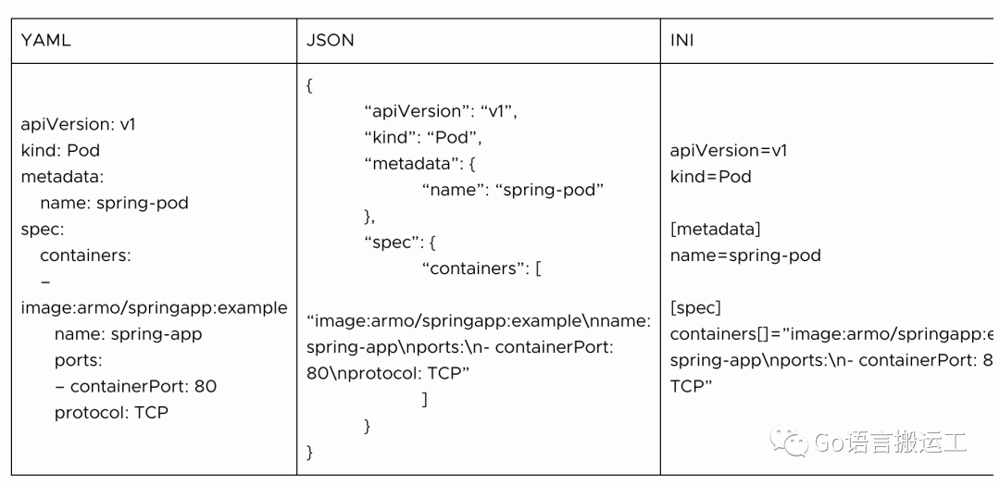

# 如何校验K8S Yaml文件

Kubernetes已经占据如何管理集容器化应用程序的核心位置。因此，存在许多定义Kubernetes应用程序的约定文件格式，包括YAML、JSON、INI等。

这使得我们需要考虑应用程序的最佳策略是什么。此外，我们还必须考虑如何根据所选择的文件结构(特别是安全性)路径来验证应用程序配置。

本文，我们将探讨使用YAML文件定义Kubernetes应用程序，以及可以采取的各种步骤来有效地验证这些配置定义。

### Yaml定义K8s配置

与JSON和INI相比，YAML更加紧凑和可读。例如，如果我们要定义一个可以在端口80上可达的pod，那么YAML、JSON和INI中的配置将如下表所示。

很明显，YAML简化了我们定义Kubernetes应用程序的方式，特别是考虑到一个普通应用程序可能涉及几十个配置文件。此外，YAML的紧凑特性允许您将对象分组在一起，从而减少所需的文件数量。

然而，在定义Kubernetes配置文件时存在重大挑战，特别是在嵌入manifest文件之间的约束和关系时。例如，我们如何确保按照最佳实践配置内存限制?

在满足边界情况时，缺乏验证不仅会导致应用程序出现意外行为，而且还会暴露出主要的安全漏洞。因此，我们有必要考虑基于yaml配置文件的验证策略，这就是我们将在下面几节中深入研究的内容。

验证内容

应该对YAML文件执行三个级别的验证。这些级别确保根据YAML文件的实际有效性执行验证，直到是否满足安全实践。

第一级别是结构验证，这是在Kubernetes配置文件上执行的基础级别验证。它只需要验证YAML文件，以确保没有语法错误。这一点可以在编写配置文件时由IDE进行验证。

第二层是语义验证。这确保YAML文件的内容转换为所需的Kubernetes资源，从而验证Kubernetes应用程序本身。

最后，第三层也是最深层的验证是安全验证，以确保所定义的Kubernetes应用程序不存在任何漏洞。我们可能已经成功地编写了YAML配置，也成功地实现了所需的Kubernetes资源和连接，但这并不能确保我们的Kubernetes应用程序是很安全的，并遵循最佳实践。最后两个验证都是Kubernetes配置验证，而且不仅仅是在YAML格式验证方面。因为和应用程序相关，需要特殊验证。执行这种验证需要Kubernetes领域的深入和专业知识，我们将简要介绍如何使用Kubernetes领域专家开发的工具轻松处理它们。

例如，锁定hostPath挂载权限可以确保具有可写hostPath卷的集群中的容器不会被攻击者访问，因为他们可能会获得底层主机上的持久性。这不符合安全最佳实践，为了避免这个问题，我们应该始终确保hostPath属性下的readOnly部分设置为true。

另一个例子是只在必要时才授予pods 主机网络访问权。所有有权限的pod应该被列入白名单。对主机网络的不必要访问增加了潜在的攻击范围。

因此，从上面的两个例子可以看出，即使我们的配置文件通过了结构和语义验证，导致我们的Kubernetes资源被成功编排，安全和功能漏洞可能仍然存在。因此，我们必须考虑如何最好地捕获这些漏洞，然后在生产环境中提醒存在对后果。安全验证是实现此目的的方法。

### 校验Yaml的最佳实践

考虑到结构验证相当简单，通常编程使用的IDE就集成了该功能。Kubernetes语义和安全验证需要特殊处理，特别是在策略和工具方面。

我们考虑一些最佳实践和策略，以实现YAML文件的全面验证。

您可以执行一个试运行(kubectl apply -f - -dry-run='server ")来验证语义结构，但这仍然是一个额外的步骤，可能会降低总体速度。但是，试运行要求您能够访问Kubernetes集群。

这种方法的另一种选择是Kubeval，这是一个实用工具，可以用来验证配置文件语义，以确保它们满足Kubernetes的对象定义需求。它可以是CI过程的一部分，并在本地执行扫描，从而确保在投入生产环境之前从语义上验证配置文件。

还可以使用kuscape在CI中实现安全验证。这是一个开源工具，确保您的Kubernetes应用程序定义遵循多种安全框架，如NSA-CISA或MITRE ATT&CK®。通过使用kuscape CLI，您可以扫描所有YAML文件的安全漏洞，甚至获得风险评分和风险趋势。它充当YAML验证器，其主要价值是安全验证。

### 从DevOps到DevSecOps

你可以运行CI流水线中已经讨论过的工具的组合，以实现结构、语义和安全验证。然而，仅仅利用这些工具及其预定义的检查是不够的。

我们从DevOps中学到的一件事是，总是有一个可以采用的改进循环。这就是为什么随着应用程序的发展和安全性需求的变化，你应该不断地检查安全性控制。

新的安全控件应该合并到安全验证步骤中。kuscape是AMRO开发的开源平台，它允许你定义自己的控件框架。尽管开箱即用的框架很健壮，但需要根据业务和Kubernetes资源的具体需求形成策略控制。

只有将安全检验嵌入到构建应用程序中，才能实现这种最佳实践。多亏了像Kubeval和kuscape这样的开源工具，开发团队不断考虑验证，特别是安全验证的障碍已经降低了。

### 总结

YAML配置文件使得构建Kubernetes应用程序非常简单。然而，YAML在验证方面确实有其局限性。因此，我们有必要了解所有验证策略，以确保构建的Kubernetes应用程序是健康和安全的。

在任何IDE中使用YAML测试验证YAML文件的结构都是相当简单的，但是验证Kubernetes资源对象定义的正确性以及围绕它们的安全措施是很困难的。幸运的是，像kuscape这样的工具弥补了这一差距，在整个应用程序生命周期中不断考虑安全性。

由于安全性是构建容器应用程序的主要关注点之一，这里讨论的验证策略是朝着正确方向迈出的一步。

*链接：https://blog.csdn.net/weixin\_44592002/article/details/127884503*