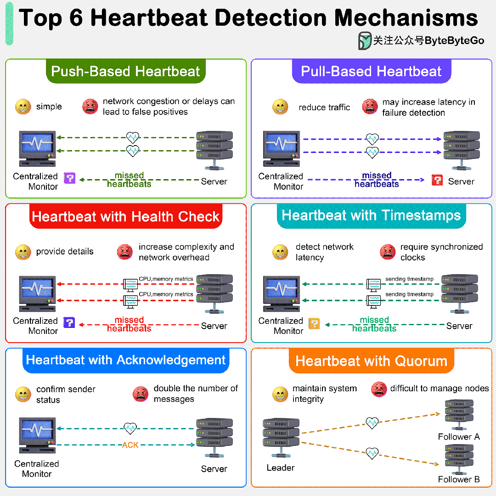

# 如何检测分布式系统中的节点故障？

如何检测分布式系统中的节点故障？

下图显示了 6 大心跳检测机制。

心跳机制在分布式系统中对于监控各种组件的健康和状态至关重要。以下是分布式系统中常用的几种心跳检测机制：

## 01 基于推送的心跳

最基本的心跳形式包括从一个节点向另一个节点或监控服务发送周期性信号。

如果心跳信号在指定时间间隔内停止到达，系统就会认为节点发生了故障。

这种方法实施起来很简单，但**网络拥塞可能导致误报**。

## 02 基于拉取的心跳

中央监控器可以定期从节点 "拉取" 状态信息，而不是节点主动发送心跳。

这可以减少网络流量，但可能会**增加故障检测的延迟**。

## 03 带健康检查的心跳

这种方式在心跳信号中包含了有关节点健康状况的诊断信息。此信息可包括 CPU 使用情况、内存使用情况或特定于应用程序的指标。

这种方式提供了有关节点的更详细信息，允许做出更细致的决策。但是，它**增加了复杂性和潜在的更大网络开销**。

## 04 带时间戳的心跳

包含时间戳的心跳不仅能帮助接收节点或服务确定节点是否存活，还能**确定是否存在影响通信的网络延迟**。

## 05 带确认的心跳

在这种模式下，心跳消息的接收方必须发回确认。这不仅能确保发送方还活着，还能**确保发送方和接收方之间的网络路径正常**。

## 06 带法定人数的心跳

在一些分布式系统中，尤其是涉及 Paxos 或 Raft 等共识协议的系统中，使用了法定人数（大多数节点）的概念。

心跳可用于建立或维持法定人数，确保有足够数量的节点运行，以便系统做出决策。当节点加入或离开系统时，这会带来实施和管理法定人数变化的复杂性。
