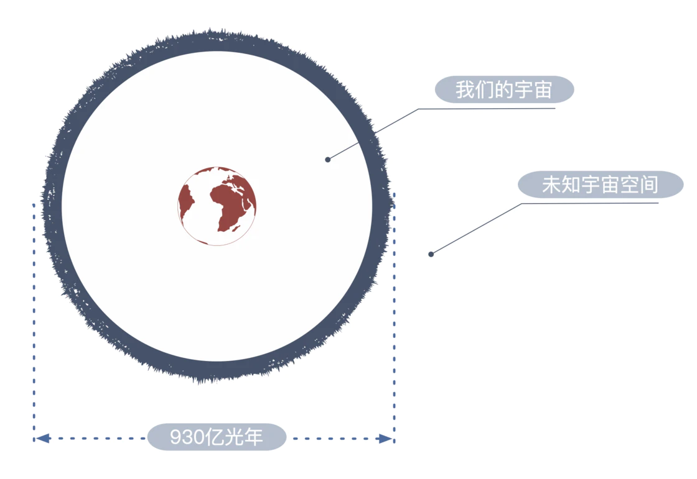

# 如何理解平行宇宙 / 平行世界？ - 少数派

> 有两样东西，我们愈经常愈持久地加以思索，它们就愈使心灵充满日新月异、有加无已的景仰和敬畏：在我之上的星空和居我心中的道德法则。—— 康德

凝望夜空，你是否思索过，在浩瀚的宇宙最深处存在着若干个「自己」，你们外貌相同，却各自经历着截然不同的命运；

回望人生的路口，表白亦或暗恋；工作亦或读研；爆发亦或隐忍；我愿意亦或对不起；

每个选项都蝴蝶效应般的决定了你的人生旅程，也许一马平川、也许崎岖不平、或许硕果累累、也或许沼泽泥泞。

如若站在路口的那一刻，你大脑神经元上的电荷信息有了微妙改变，导致你走向了另一个方向，那么你现在的人生旅程将会怎么样？ 

平行宇宙理论虽不能得知其它的旅程是否同样精彩，但可告知于你的是:

-   你当初的舍弃掉的每一个选项背后的人生轨迹都可能被亿万光年之外的另一个「自己」所经历，这些不同版本「自己」存在于距离你最少 465 亿光年外的广袤宇宙中（百纳被多重宇宙）。
-   或者这些不同版本「自己」被隔离在相互无法沟通的量子力学领域所探讨的希尔伯特空间。（量子力学的多世界诠释）。
-   还有可能是我们所处的宇宙空间只是更高维度空间上的一张膜，就好像三维空间中的一摞 A4 纸，相互平行却无法产生任何交集。（超弦理论框架下的膜宇宙）

本文将在科学而非科幻的范畴内向你展示 3 种类型的平行宇宙:

1.  百纳被多重宇宙，存在于 465 亿光年之外的宇宙空间；
2.  量子力学的多世界诠释；
3.  弦理论框架下的膜宇宙。

即使在科学范畴内，各类平行宇宙可谓琳琅满目，而以上三种最有代表性，因为这三种平行宇宙的理论根基分别是相对论、量子力学以及超弦理论。

*ps. 本文将默认读者不具备物理学的专业知识*   

> 即使我身处果壳之中，仍以为自己是宇宙之王 -- 斯蒂芬・霍金

一般我们所探讨的宇宙是指以地球为中心，465 亿光年为半径的球体空间，这个球体的边界也叫「粒子视界」，是观察者所能观测到的距离极限。

也就是说，即使你具有千里眼的特异功能，最远也只能看到 465 亿光年之内的东西，这是由于光速所限。

**你也许疑惑：宇宙的年龄不过 140 亿年，为什么「粒子视界」的半径却可以达到 465 亿光年？**

这是由于宇宙空间在宇宙大爆炸之初就开始不断的膨胀，且越远的地方膨胀越快，甚至速度快过了光速。所以当 137 亿年前大爆炸之初的宇宙微波背景辐射抵达我们的地球时，当年的发光区域已经随着宇宙空间的膨胀到达了距离我们 465 亿光年的地方，那里的膨胀速度已经大于光速，于是光子便无法抵达我们的地球。

**根据爱因斯坦相对论：Nothing can't move through space faster than light，没啥可以比光在空间通行速度更快。那么上文提到，空间的膨胀速度超过了光速是否违背了相对论？**

答案是并没有，这是因为相对论限制了物体在 space（空间）的通行速度，而并没有限制 space 自行膨胀的速度，而空间膨胀速度大于光速是被允许的。

空间膨胀所致的两点距离变化就好比气球上两个点静止的点的随着气球的膨胀越来越远。

粒子视界决定了我们当前的观测范围是以地球为中心 465 亿光年为半径的球形空间。本文我们就把这个巨大的球形空间称作我们的宇宙。

**那么 465 亿光年之外的宇宙空间，也就是那些未知宇宙空间还有多大呢？** 

这个问题很重要，因为一旦 465 亿光年之外的宇宙空间仍然硕大无朋，那么像这样半径为 465 亿光年且互不相交的球形空间就会存在 N 多个，空间越大能划出的球形空间数 N 就越多。

这 N 多个巨大的球形宇宙空间由于光都来不及互相抵达，因此他们就不曾互相影响过，所以他们的各自发展是相互独立的。

**现在我们根据以下两个条件做出一些思考:**

1.  现代的测量结果表示宇宙的空间曲率 0，这意味着宇宙空间是无限大的。
2.  宇宙在大尺度上是均勻且各向同性的。也就是说，我们在宇宙中任何一点为球心 465 亿光年为半径画球，这些球形空间内所包含的物质在大尺度内差不太大。

如果宇宙空间无限大，那么以上提到的 465 亿光年的球形空间就会存在无数个。而一旦这样的球形空间存在无数个，那么任何极小概率事件就都会发生了。

正如埃米尔・博雷尔的无限猴子定理所言：让一只猴子在打字机上随机地按键，当按键时间达到无穷时，几乎必然能够打出任何给定的文字，比如莎士比亚的全套著作。

**同样的，在宇宙中划出无数个 465 亿光年半径且不相交的球形空间，其中几乎必然能够找出一个与我们的宇宙中所有粒子排布与粒子运动状态一模一样的宇宙。**

那么还剩一个重要的的疑问，那个宇宙中与你一模一样的「自己」，除了肉体相同之外，你们的思想意识是否也是一模一样么？

**粒子排布完全相同的两生命体是完全一样的么？**

> 我们都是精致的自动机器。我们的身体和脑在运行时，就像是当时教堂中的乐器 —— 风琴，我们的身体通过巨大的风箱把称为「动物精神」的特殊液体压入储液器里，然后通过一整套管子排列产生出不同的节奏与旋律，这就是我们的行为。-- 笛卡尔

这是一个存在争议且开放式的问题，有些人认为离子排布相同的两个生命体只是拥有相同的肉身，而不具备相同的意识。出生于 13 世纪中叶的法国哲学家笛卡尔就明确提出过现在所谓的二元论：「大脑的意识是由非物质组成的，并不遵循物理定律」 也就是说意识是非物质的东西，不能通过简单的离子排布决定。现在依然有人坚持这样的观点，认为存在类似「动物精神」的特殊液体，在没有发现这种物质之前，人类无法制造具有自我意识的人工智能。

而大部分物理学家都相信的是粒子的排列方式与运动状态完全决定了一个物理系统。也就是说一旦两个 465 亿光年半径的球形空间中粒子的排列与运动状态完全相同，那么这个两个物理系统就是完全一模一样，其中的生命意识也完全相同。

我的态度是支持后者，我们都是由粒子组成，我们向左移动那么全身的粒子就会向左移动，我们的大脑进行思考那么组成的大脑粒子就会改变状态。之所以现在人类还没能制造出能通过图灵测试的人工智能，只是因为人类还不够了解自己的大脑。正如 2013 年美国奥巴马政府所启动的「大脑计划」所言：「作为人类，我们已经发现了数百光年以外的星系，研究了比原子还小的粒子，但我们仍然没有解开这个位于两耳之间 3 磅重的物质之谜。」 

**你在阅读这篇文章的瞬时周遭就是你所在宇宙中粒子排列方式与运动状态的表现。而你曾经放弃那个选项背后的蝴蝶效应人生，也是只是对应了亿万光年之外的另一个球形空间中粒子的另一种排布。**

这就是百纳被多重宇宙，如果把宇宙想象成一个二维空间中无限大且满是补丁的被子，每一块补丁都代表了大小相同且各自独立演化的空间。由于被子大小无限，那么无限大的被子就将穷举出补丁的所有的可能，如果其中一块补丁代表了你所处的宇宙，那么被子上必然还能找到另一块一模一样的补丁，也就是你的平行宇宙。

> 谁要是懂得量子力学，那他就是真的不懂量子力学 -- 理查德・费曼

量子力学太玄妙了，全世界最顶尖的物理学家都曾在其堡垒前折戟沉沙，爱因斯坦、薛定谔、玻尔、海森堡、费曼、图灵等等科学巨人面对量子力学都曾各执己见。这主要是因为粒子在微观尺度下各种反常识的现象是自古以来的任何宏观物理定律都无法解释的。

同一个粒子可以同时出现在多个地方，这绝对是反常识的，因为你从没见过女朋友同时出现在左手边和右手边，除非她就是你的左右手。

量子力学告诉我们单一粒子可以同时出现在多个位置，就像水波无处不在的浸满了房间，水波在不同位置的强弱决定了粒子最终会出现位置的概率，这个概率可以通过薛定谔方程计算出来。粒子从无处不在的波变成确切位置的粒子只需要一个开关，那就是观测，一旦粒子被观测那么粒子的位置就确定了，水波越强的地方越有可能出现那个粒子。

啊，只要不观测，女朋友就像一道波同时飘荡在上海和温哥华，一旦被观测她的位置就确定了。如果你不是时间管理大师，那么你一定认为这是个荒谬的理论，可这确实是通过严密的实验得出来的结论。

读到这里你也许对量子力学感到一点困惑，但别急，相同的困惑物理大佬们也都曾经历过。

爱因斯坦就说过：「月亮只是因为老鼠盯着它看才存在吗？」

薛定谔也做过一个著名的思想实验，薛定谔的猫：只要不打开盖子观测，那么盒子里面的猫就是一个既死又活的叠加状态。

但也正是由于科学至今无法解释量子力学的神奇，激烈的争讨才会持续一个世纪至今。而在这思想碰撞过程中物理学家不断的迸发智慧，通过一个个精妙绝伦的物理实验揭开了宇宙万物在微观尺度下的运作规律。我们蜷缩于原子内核之中，惊叹于电子优雅的华尔兹。可以说近一个世纪的物理学给予我们另一双眼睛，让我们把光年之外的神秘与周遭的美丽都看的更加清晰了。

关于量子力学的不同解读可谓是莫衷一是，最为主流的解释是以玻尔为首的哥本哈根诠释，后文会于必要的地方稍作解读。本文重点在于讨论平行宇宙，于是下文主要解读内容是美国量子物理学家休・艾弗雷特三世剑走偏锋的提出了量子力学的多世界诠释。 

### 量子物理学家休・艾弗雷特三世

> 我要和父亲在另外一个平时宇宙中相会了 -- 休・艾佛雷特女儿的遗书

美国量子物理学家休・艾弗雷特是量子力学多世界诠释的提出者，年少的艾弗雷特曾带着多世界理论的博士论文拜访量子力学大佬玻尔，但却遭碰壁，玻尔认为量子力学的平行宇宙理论是乡村野夫的旁门左道，他无法相信这个世界只因为你在人群中多看了一眼就分裂成两个。尽管受挫之后的艾佛雷特大幅的删改了论文中对哥本哈根诠释的不同见解，但是也没能改变社会舆论给予他精神分裂人群的待遇，以至于酒精和尼古丁陪伴了他潦倒颓废的后半生，最终于 1982 年去世享年 51 岁。

「我要和父亲在另外一个平时宇宙中相会了」 这是艾佛雷特的女儿的遗书，她是一名真正的精神分裂症患者。父亲的潦倒人生带给了这个家庭不幸，她目睹过父亲曾孤独的沉浸于自己的平行宇宙，但遗憾的是她并不了解量子物理，根据艾佛雷特的理论，死亡并不会让他们相会。而仅有欣慰的是，根据艾佛雷特的多世界理论，一定还存在一个平行宇宙中的艾佛雷特事业一往无前，家庭和睦美满。

近些年，随着量子力学的发展，艾佛雷特的多世界诠释逐渐开始被越来越多的人关注，这或许是得益于互联网的力量，也或许是人民日益增涨的物质文化需求已不甘于只有一个世界的现状，总之这个理论被越来越多的讨论和完善。 

### 溯流时间，回到中学物理课堂

> 关于量子力学的一切都可以从这个简单的双缝干涉实验的中获得启发 -- 理查德・费曼

为了能够从科学的视角去理解量子力学的多世界诠释，我们必须先溯流时间，回到中学物理课堂，和我一起回顾一个物理实验，杨氏双缝干涉实验。

对于要了解量子力学的同学们，杨氏双缝干涉实验是极其重要且不可思议的实验。量子力学最伟大的实践者之一的费曼就曾说过：「关于量子力学的一切都可以从这个简单的双缝干涉实验的中获得启发」。

实验需要几样实验器材:

-   电子枪（可以发射电子的枪）

-   有两条缝的钢板
-   屏障

准备好了器材之后实验就开始了，我们用电子枪对着钢板连续发射电子，一段时间后记录观察钢板后方屏障上电子落点位置。 

观测屏障我们发现，电子在屏障上形成了明暗相间的条纹，明条纹代表电子落上的数量多，暗条纹代表电子落上的数量少。

到目前为止，中学顺利毕业的你也许可以解释这个现象，这是因为电子具有波粒二象性，一连串的电子射向钢板时展现了粒子的波动性形成了一道道波，两个粒子表现出的波特性分别通过钢板上的双缝时衍射出来了两道波，这两道衍射波相遇便发生了波的干涉，最后在屏障上形成了明暗相间的干涉条纹。

如果你能读懂以上结论，那么我允许你保留三秒钟的骄傲。因为实验接下来将发生的一切，或许将改变你对这个世界的原有认知。 

### 更改实验，电子连发变单发

现在我们将实验稍作修改，将之前用电子枪连续发射电子，改成电子枪间隔发射单个电子，其它不变，也就是单粒子的双缝干涉实验。

思考一下，如果电子枪间隔发射单个电子，一段时间后电子的落点会在屏障上会体现怎样的图案呢？

现在直接看答案，如下图：

没错，电子的落点基本没有变化。电子枪不连续的间隔发射单个电子，在一定时间之后所有电子的落点依旧在屏障上形成了明暗相见的条纹。

在我们的原有思维中，连续发射的电子之所以可以通过双缝形成干涉条纹，是因为大量电子同时展现了粒子的波动性，两个电子分别通过双缝时衍射出来的波互相干涉，最终在屏障上形成了干涉条纹。

那么现在，一个全新的实验现象告诉我们，一个完全独立的电子经过双缝后，电子的行动依旧遵循双缝干涉的路径，一定时间后还是会在屏障上形成明暗相间的条纹。

接下来，我将不开玩笑的告诉你为什么会这样。

我们把钢板上的双缝分别命名为 A 缝、B 缝，电子枪发射电子后，这一个电子同时出现在了 A 缝和 B 缝两个位置，并同时衍射出了两道波，这两道波相遇后发生干涉，最终单个电子依旧按照两道波干涉的路径落在屏障。

**也就是说一个电子好像出现了分身，自己和自己发生了干涉。并且最终按照双缝干涉波的路径行进。**

不要怀疑实验过程，这个神奇的现象被世界各地大量物理实验重现，确定了一个粒子确实同时出现在多个位置。 

### 更改实验，增加电子探测装置

为了进一步搞清楚到底发生了什么，我们再次更改实验，我们要知道一个粒子是如何同时经过 A 缝和 B 缝的。增加电子探测装置，来观测电子下究竟如何分身。

随着电子枪单发射击，探测器开始监测电子的动向，屏障上也开始出现了电子落点所形成的亮斑。

我们期待着探测器同时捕获电子和他的分身，可最终的结果再次让人大跌眼镜。 

探测器监测到的电子并没有同时出现在 A 缝和 B 缝，而是要么在 A 缝要么在 B 缝，并且屏障上的干涉条纹也消失了，取而代之的是与 AB 两缝分别对应着的两道亮斑带，这分明是电子的粒子性直接通过两条缝形成的落点。这说明，这一次粒子并没有表现出波的特性，也不存在分身了，当然也就无法自己与自己发生干涉。

这又是为什么，两次实验唯一的不同在于本次实验多了电子探测器。一定是电子探测器的作用导致了电子的分身能力丧失了。去掉电子探测器干涉条纹就会出现，加上探测器干涉条纹就消失。

后来，物理学家对电子探测方式进行了多次升级，但是无论怎么做，只要实验可以获得电子的轨迹，那么干涉条纹就会消失。

这个小小电子似乎有一股神奇的魔力，只要发现人类在观测它，它就是一颗老实巴交的粒子，否则它就是弥漫在空间之中无处不在的波。

### 认识量子力学多世界诠释

通过前文一系列的双缝干涉实验实验，我们已经感受到了微观世界的玄妙，关于单一粒子从同时存在多个位置到变成一个确切位置的过程究竟发生了什么，目前也没有一个最终答案，而这个过程发生的一切便是量子物理学家们的主要纷争点，其中哥本哈根诠释和而多世界诠释便是对于这个过程不同解读。

想要进一步了解哥本哈根诠释和而多世界诠释就不得不说下薛定谔方程。

量子物理学家告诉我们，电子枪发射出来的电子在被观测之前确实以波的形式存在于空间之中的任何位置，比如同时出现在 A 缝和 B 缝，这道波体现了粒子在空间里一种「存在感」的强弱，「存在感」越强的地方最终出现粒子的概率就越大，反之亦然。如果我们想要知道微观粒子状态与时间的关系，牛顿运动定律则完全不再适用，而这时候就要用到薛定谔方程来描述粒子的波函数与时间的关系了。简单理解：

-   牛顿定律描述的是宏观物体位移与时间的关系。
-   薛定谔方程描述的是波函数与时间的关系

哥本哈根诠释表示，当粒子被观测之后，薛定谔方程所描述的波函数就坍缩了，原先波函数描述的粒子在空间中的不同的概率将立刻马上的瞬间改变，其中某一个波峰点的概率将变为 100%，而其它位置点的概率全部变成 0，所以粒子会出现在一个确切的位置。

波函数因为物体被看了一眼就坍缩而不再适用，这样的结论是否合理或武断或不清晰可以留给大家思考。因为本文的重点在于科学的解读平行宇宙，哥本哈根诠释的介绍我们浅尝辄止。下面我们来理解下艾佛雷特对于量子力学的多世界诠释。

**埃弗雷特认为，波函数没有坍缩，在被观测的那一刻薛定谔方程依然适用，只是波函数的概率波峰所对应的现实世界分别独立演化了，形成了平行世界。**

举个例子，我们假定掷硬币是一个量子随机事件 *（严格来说，投掷硬币并非量子随机事件，硬币在被投出的那一刻，落地时的正反面就已经决定了，真正的量子随机事件一般采用原子衰变）* 且出现正面 / 反面朝上的概率都为 50%。如果正面朝上，你将决定晚饭吃完垃圾食品之后组队打游戏；反面朝上，你将决定晚饭吃完水果餐之后做运动；

如此一来，当掷硬币这个量子随机事件发生之后，世界就分裂了，硬币正面朝上的信息通过你的视网膜传达到大脑皮层，而后你决定晚餐吃垃圾食品并打游戏，这样一系列事件将串联成一个世界；同样的，硬币反面朝向的信息通过网膜传达到大脑皮层，而后你决定水果餐并运动的一系列事件串联成另一个世界；而这两个世界相互平行各自演化。

### 你存在的世界才是对你有意义的世界

量子随机的平行世界时时刻刻都在产生，那么如此之多的平行世界于我们的意义是什么呢？

关于意义的问题往往没有标准答案，但是根据人择原理，你存在的世界才是对你有意义的世界。

还记得电影《国产凌凌漆》里，周星驰的古灵精怪枪么，这把枪很神奇，每次开枪，先向后射再向前射，一后一前一后 ...

现在，我们给这把古灵精怪枪做一次量子改装，每次开枪向前、向后开火的概率各占 50%。

**假如你用这把改装过的古灵精怪枪对着自己脑袋开枪自杀，会发生什么？**

根据量子力学的多世界诠释，任何可能的量子事件都将必然发生，无论它的概率多么多么的小。你会发现有一个平行世界中的你永远也不能自杀成功，无论怎么自杀，这把枪总是射向相反的方向，总之自己就是死不了。如果自杀 100 次，100 个平行世界中你已经变成了一具尸体，但是总有那么一个平行世界中的你最终是活着的。

对于多世界的意义而言，无论这个世界发生过多少低概率事件，只要你还存在，这个世界就是对于你有意义的。

连续 100 次自杀之后仍然存活的概率就是 0.5^100， 这虽然是个极小的数字，但这是我们每个人都曾经历过的生存概率。

你现在之所以可以读到这篇文章，那一定是你祖辈向前溯源 100 代都有儿子出生，你爷爷、太爷爷、太太爷爷 ... 都有一个儿子，如此而已。

宇宙中诞生生命的概率就好像把一只无比精密手表的所有细碎零件扔到泳池中，冲入排水管之后竟奇迹般的变回了一只精密手表。即使这概率微乎其微，但当我们开始思考这个这个问题时，我们一定已经奇迹般的存在于这个世界了。

**也就是说，这个奇迹般的让你有能力思考平行世界意义的平行世界就是对于你有意义的那个世界。**

以上便是关于量子力学多世界诠释的介绍与思考，它保全了薛定谔方程，但却以世界分裂作为代价。因此也有物理学家说，多世界的假设很廉价，但宇宙付出的代价却太昂贵。

但既然这是个无法证明也无法证伪且可以自圆其说的理论，那么它就应该享有物理科学的包容，因为包容性是物理学发展的必要条件。

热力学第二定律告诉我们，一个封闭系统如若任其自由发展，整个系统必定趋向熵增而无序的混乱。所以，接受并包容新的理论，便是从系统外获得做功，整个系统的发展才会趋向熵减而有序。如此，物理学便能如日方升，欣欣向荣。 

1963 年，剑桥大学的新年派对上一名叫简・怀尔德的女孩风姿卓越时尚优雅。当时还在剑桥大学三一学院的攻读理论物理的霍金对简一见钟情，便主动搭话。简认为对面这个男孩谈吐风趣气质独特，便问他的信仰是什么。微醺的霍金放下酒杯，看着简温柔地说：「找到解释宇宙万物的方程」。后来两人迅速坠入爱河。之后的霍金患上了渐冻症，简一直陪伴在霍金身边照顾了他 20 年。

近一个世纪，广义相对论在宏观领域崭露锋芒，量子力学能解释微观世界的奇妙，但其二者却是始终无法和谐统一。

在广义相对论里空间和时间形成一个光滑弯曲的几何结构，而在量子力学中万物不断经历着量子涨落。这就好像一面光滑的镜子，在被放大一定倍数之后就会看到坑洼不平的表面。

那么找到解释宇宙万物的方程，优雅的统一相对论与量子力学是很多物理学家的信仰。

而超弦理论便是将广义相对论与量子力学优雅的统一起来，用来回答有关自然最基本的物质构成和力的原初问题。

**超弦理论认为组成世间万物的基本单元是一根根一维的细丝，这些细丝并不是由原子或者分子构成，这细丝便是万物最最基本的组成单元，就好像琴弦，转轴拨弦是音符，细丝的不同共振模式便是不同粒子。**

也就是说，所有的物质的基本单元都是相同的，都是一根弦。所有的弦都是完全一样的，而区别在于每根弦所经历不同的共振模式。同样的弦，有的振动模式表现为电子、有的表现为引力子等等。

如果一个物理学理论被认为是正确的，那么它必然对大自然的演化做出了正确解释和预测。正如黑洞的发现强有力的的证明了广义相对论是正确的，同样的，如果超弦理论正确，那么我们的时空必将存在 11 个维度，其中 10 个空间维度和 1 个时间维度。只有这样，超弦理论方程中关于量子概率的解读才不会出现负数。

### 如何理解维度

我们的感知，点是零维，线是一维，面是二维，而我们处在四维时空，其中三维空间与一维时间，因此我们可以移动的方向是前后、左右、上下。而超弦理论却告诉我们，宇宙存在 11 维时空。如若存在更高的维度，我们应该有所感知，比如可以向前后、左右、上下之外的方向移动，但是现实告诉我们这并不可行。

超弦理论的解释是，空间中只有三个维度是展开的，而其它的 7 个维度蜷缩了到了普朗克尺度（1/10^33），以至于现在的科技无法对如此小的尺度进行感知。

这就好像我们在遥远的外太空看地球上的长城，即使视力再好，我们看到的也是一条绵延长曲线了，好像一根面条。也就是说，如果距离足够远，我们就只能看到长城的长度这个维度，而高度和宽度两个维度由于太远而无法观测，我们便可以说另外两个维度蜷缩了。同样的，由于超弦理论预测的其它 7 个维度蜷缩到了我们无法观测的尺度，因此我们无法感知。

我们可以在三维空间中观察一张二维的薄膜，只要膜足够薄那么三维空间中便可以存在无数张这样的二维膜。同样的，我们的三维宇宙于更高纬度的四维空间来说，便是一张三维的膜，这样的膜存在无数张，每一张三维膜于我们来说都是一个平行宇宙，这便是超弦理论下的膜宇宙。

### 穿越膜宇宙

既然膜宇宙存在，那么我们是否可以在不同的膜宇宙中穿越呢？

**根据超弦理论，我们不可以穿越膜宇宙但是可以与另外的膜宇宙勾通。**

原因在于，组成人类的弦是开弦，开弦的一端被束缚在膜上，因此开弦不能离开膜。而闭弦不同，闭弦可以跨越维度传递。

典型的闭弦是自旋为开弦两倍的引力子，也就是在超弦理论中可以传递引力或者说重力的粒子，超弦理论中关于引力的解释不同于广义相对论，广义相对论的解读是质量导致时空弯曲从而产生重力。而超弦理论的解释是，引力子的传递产生重力。

为了说明引力具有穿越维度的能力，我们回顾来一部电影《星际穿越》。 

### 《星际穿越》

《星际穿越》是我最喜欢的电影之一，最后男主角库珀为了拿到奇点的量子数据不得不进入未知的黑洞，因为自然界中只有黑洞结合了相对论所解释的质量无限大以及量子力学所解释的体积无限小。

进入黑洞的库珀发现自己来到了一个五维时空，于是他逆着时间行走，回到了过去。通过重力波（引力子）将信息传递到了女儿的房间，引导过去的自己抵达 NASA 的秘密基地，并把奇点的量子数据通过重力波传递给了四维时空的女儿。

《星际穿越》的科学顾问是诺贝尔奖得主基普・索恩，这是一部科学硬核、想象力开阔、故事温暖的电影。直到进入黑洞之前，所有情节都有严谨的科学依据，而进入黑洞之后的世界便是剧组的想象。

安妮・海瑟薇主演的布兰德博士说：「爱是唯一可以超越时间与空间的事物」 而超弦理论告诉我们：「引力子是唯一可以穿越维度的事物」

### 如何证明膜宇宙的存在

世界上存在四种基本左右力， 强力、电磁力、弱力、引力。如果强力的值为 1，那么电磁力就是 1/60~1/20、弱力是 1/10^13、而引力是 1/10^39。

引力太小了，与其他三种力相差了几十个数量级。这似乎不太正常，大自然为何如何偏心让引力如此的弱呢。引力一定有一些特殊的能力，这正是超弦理论所预测的，引力是可以穿越维度的，而我们感受到的引力是引力在三维空间中的一个分量，而引力在所有维度的合力是巨大的。

因此证明膜宇宙存在的一个思路便是在极其小的尺度上证明引力其实存在其它分量。有种方法是利用大型粒子对撞机把粒子加速到接近光速再对撞，如果超弦理论是正确的，那么当粒子对撞能量足够大时，将有可能产生小型黑洞。当然，这需要极其巨大的能量，目前即使是欧洲核子研究组织 CREN 也无足够的资源来实施这样级别实验。而且实验具有很强的未知性，一旦在地球上产生了黑洞，那么人类的遭遇将难以想象，有些物理学的实验就如同潘多拉的墨盒。

证明膜宇宙的存在，除了在极小尺度上对引力进行测量，还可以通过发现一些超弦理论所预测的粒子来证明超弦理论的正确，从而证明膜宇宙的存在。这些都需要粒子探测技术能更加精深，尺度接近普朗克长度，正所谓： 「入之愈深，其进愈难，而其见愈奇」。

目前，超弦理论还没有强有力的证据支持，所以被很多学术大佬忽视。但是回望物理学的历史，伟大理论被学术界忽视的原因，往往正是因为其超越了所在的时代。若干年后，如果最终统一了量子力学与相对论的是超弦理论的「音符」，那这必将成为最精彩绝伦的物理史话。

近一个世纪物理学已然蓬勃发展，美国科学家彭齐亚斯和 R.W. 威尔逊探测到了宇宙微波背景辐射，让我们看到了宇宙婴儿时期的照片，证明了宇宙的大爆炸理论；黑洞的发现印证了广义相对论的预言，时空可以弯曲、时间也可以变慢；中国科学技术大学已然研制出了 76 光子的九章量子计算机而获得了量子霸权；

而现在，大部分人物理知识依然停留在牛顿的经典力学时代，相对论、量子力学、超弦理论于我们是陌生的。我们的生活日复一日，脚下奔波于 996 制的工作，指尖滑动着资本大数据支撑的个性化信息，却已然忘记了头顶之上的那片美丽星空。

在你阅读文章的这短暂时间里，可以把疲惫的生活、繁琐的工作、无趣的信息丢到一旁。思索一刻这包罗万象的宇宙，那些平行宇宙中的「自己」正做着同样的事呢。光的速度亘古不变，宇宙庄严的拨动琴弦，粒子的思绪在空间弥漫，这一刻，那些我所存在的平行宇宙里，也许多了一个读者对物理学增添了一点兴趣，这蝴蝶效应将更改的宇宙粒子排布，便是这篇文章的一点点意义吧。 

**参考资料**

-   《生命是什么》-- 埃尔温・薛定谔
-   《上帝掷骰子么》-- 曹天元
-   《从量子到宇宙》-- 高鹏
-   《神秘的量子生命》-- 吉姆・艾尔・哈利利 / 约翰乔・麦克法登
-   《穿越平行宇宙》-- 迈克斯・泰格马克 （Max Tegmark）
-   《脑与意识》-- 斯坦尼斯拉斯・迪昂 (Stanislas Dehaene)
-   《宇宙的琴弦》-- 布莱恩・格林（Brian Greeen）
-   《隐藏的现实》-- 布莱恩・格林（Brian Greeen）

