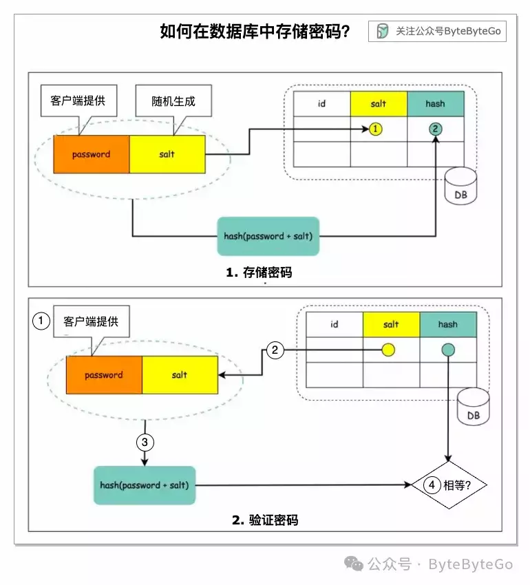

# 存储密码时为什么要加盐？

今天来聊聊存储密码时为什么要加盐。

## 存储密码应注意

1.  不要用纯文本存储密码，因为任何有内部访问权限的人都可以看到它们。
    
2.  直接存储密码哈希值是不够的，因为它会受到预计算攻击，如彩虹表 (rainbow tables)。
    
3.  为了减少预计算攻击，我们对密码进行加盐处理。
    

## 什么是盐？

根据 OWASP 指南，"盐是随机生成的唯一字符串，作为哈希过程的一部分添加到每个密码中"。

## 如何存储密码和盐？

1.  "盐"并不是为了保密，它可以以纯文本形式存储在数据库中。它用于确保每个密码的哈希结果是唯一的。
    
2.  密码可以使用以下格式存储在数据库中：hash (password + salt)
    

## 如何验证密码？

1.  客户端输入密码。
    
2.  系统从数据库中获取相应的盐。
    
3.  系统将盐附加到密码上，并对其求哈希值。我们把哈希值称为 H1。
    
4.  系统比较 H1 和 H2，其中 H2 是存储在数据库中的哈希值。如果两者相同，则密码有效。