# 安全运营-Suricata 规则学习

# 前言

本文为安全运营篇的**入侵检测基础篇**，主要介绍 suricata 的规则库来源以及订阅渠道，包括如何进行规则的管理并根据实际中的业务环境对规则做到优化取舍，IDS/IPS 最核心的也就是规则，规则的丰富度和适用性往往会减少运营人员的分析压力，从而做到减少误报率，提高分析效率。

# 规则管理

规则管理，就是便于对 suricata 的规则进行统一的管理，比如**更新、启用、停用**等。相关的规则管理工具有很多，简单列举几个：

-   Scirius: https://github.com/StamusNetworks/scirius
    
-   Suricata-Update: https://github.com/jasonish/suricata-update
    
-   Oinkmaster: https://www.jianshu.com/p/1a96770695db
    
-   Pulledpork: https://github.com/shirkdog/pulledpork
    

要完全了解 suricata 的规则，这里我们使用 `suricata-update` 规则管理工具

suricata 的规则默认在 `/var/lib/suricata/rules/` 执行 `suricata-update list-sources` 来查看目前订阅的规则源，可以看到一共有 17 个规则源，如下图所示：

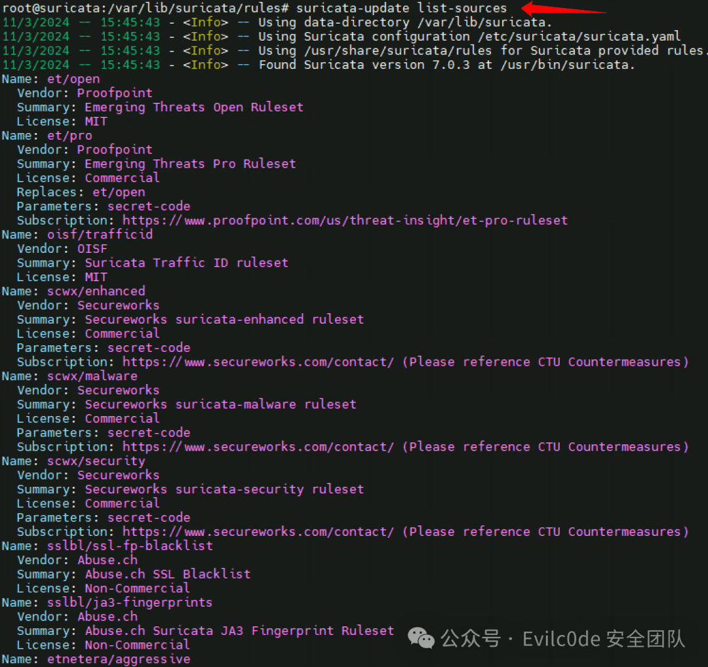

其中 et/open 较为熟悉，Emerging Threats 维护的开源规则，我们一般常用的就是这个规则库。很强大的规则库，规则数量有 20000+

关于每个 ET 规则的每条规则的作用，官方的规则解释链接为 https://community.emergingthreats.net/

1、启用 `stamus/nrd-phishing-open` 规则集 `suricata-update enable-source ptresearch/attackdetection`

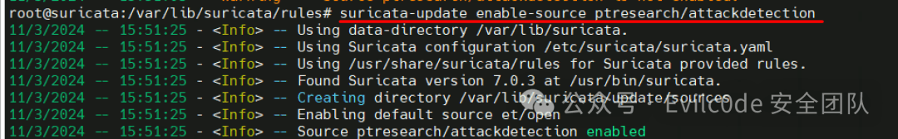

2、列出启用的规则源 `suricata-update list-enabled-sources`

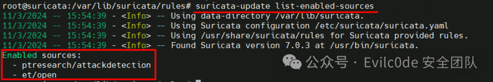

3、关闭某个规则源 `suricata-update disable-source ptresearch/attackdetection`

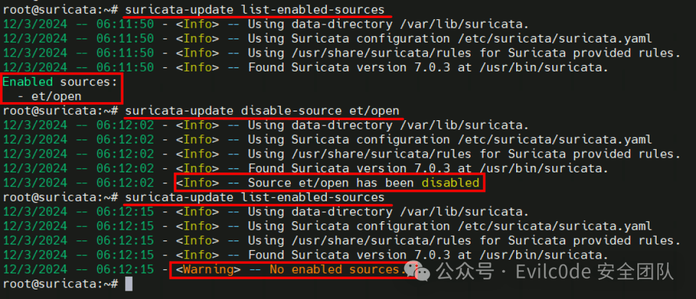

4、删除某个规则源 `suricata-update remove-source et/pro`

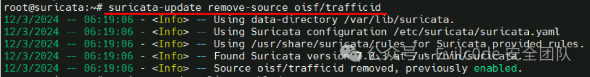

使用 `suricata-update` 更新规则时，默认是将所有规则合并在一个规则文件中：`/var/lib/suricata/rules/suricata.rules`

`suricata-update` 有个 `--no-merge` 参数，使用这个参数更新规则，规则不会进行合并，是以独立的文件存在于文件夹下。但是在管理规则的时候很不方便，必须要自己管理 suricata 引入的规则。但是在禁用规则的时候，也可以使用 `suricata-update` 去配置 `disable.conf` 禁用的规则。不推荐使用 `--no-merge` 参数更新规则。

执行 `suricata-update --no-merge` 可以看到，左侧的规则从单个 suricata.rules 文件变为了多个不同的 rules 规则文件，如图：


## 控制使用的规则

在更新规则时，`suricata-update` 会去加载 `/etc/suricata/` 目录下的文件，如果包含以下文件，则会自动的进行加载

```ini
# 启用默认禁用的规则
/etc/suricata/enable.conf
# 需要禁用的规则
/etc/suricata/disable.conf
# 指定丢弃过滤器的配置文件
/etc/suricata/drop.conf
# 指定规则修改过滤器的配置文件
/etc/suricata/modify.conf
```

假如我需要禁用某条规则或者禁用整个规则文件，可以修改 `/etc/suricata/disable.conf`，内容如下格式：

```bash
2019401                   # 使用 sid 禁用
group:emerging-info.rules # 对文件禁用
re:alert dns              # 正则禁用
group:*deleted*           # 通配符禁用
filename:rules/*deleted*  # 文件名匹配禁用
filename:*/emerging-dos.rules
```

同样，要启用默认禁用的规则，请使用`/etc/suricata/enable.conf`，要禁用规则，请使用`/etc/suricata/disable.conf`

suricatat-update 中文使用说明：

```bash
optional arguments:  -D <directory>, --data-dir <directory>                         设置备用数据目录。默认值：/var/lib/suricata  -o <directory>, --output <directory>                        要将规则输出到的目录。默认值：/var/lib/suricata/rules  --disable-conf <filename>                        指定禁用过滤器的配置文件  --enable-conf <filename>                        指定启用规则的配置文件  --modify-conf <filename>                        指定规则修改过滤器的配置文件  --drop-conf <filename>                        指定丢弃过滤器的配置文件 other commands:    update-sources             更新规则订阅源    list-sources               列出规则订阅源    enable-source              启用规则订阅源    disable-source             禁用订阅源
    remove-source
移除订阅源
    add-source                 通过 URL 添加源
    check-versions             检查版本
```

修改完订阅源之后，运行 suricatat-update 来更新规则，通过输出的日志可以看到共加载了 48198 条规则，禁用了 14 条规则，Dropped 了 1 条规则

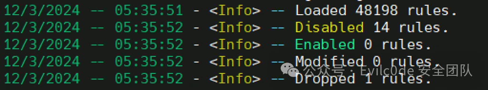

规则编写

在 `/var/lib/suricata/rules/` 下新建 `test_rules.rules`，并编辑 suricata 的配置文件 `/etc/suricata/suricata.yaml`，找到 rule-files 项，将我们的新建的规则文件名称填入进去，指代表启用指定的规则文件

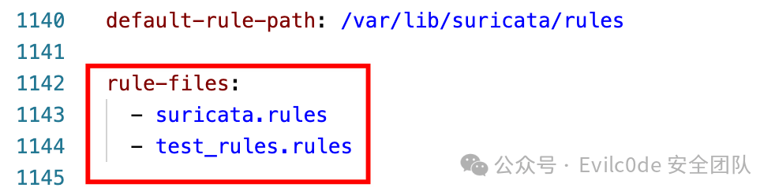

随便找来一枚泛微 SQL 注入漏洞，如下：

```bash
POST /weaver/weaver.file.FileDownloadForOutDoc HTTP/1.1
Host: 10.0.0.1
User-Agent: Moziilla/5.0 (Windows NT 10.0; Win64; x64; rv:109.0) Gecko/20100101 Firefox/114.0
Content-Type: application/x-www-form-urlencoded; charset=utf-8
X-Requested-With: XMLHttpRequest

isFromOutImg=1&fileid=1;select/**/1;
```

编辑 test\_rules.rules，针对上面的漏洞可以编写下面的检测规则：

```bash
alert http any any -> any any (msg:"泛微 OA E-Cology FileDownloadForOutDoc SQL 注入漏洞"; content:"weaver.file.FileDownloadForOutDoc"; http_uri; content:"isFromOutImg=1"; content:"fileid="; reference:url,baidu.com;reference:qvd,2023-15672;classtype:web-application-attack; sid:1000002; rev:1;)
```

对规则进行拆分解读：

1.  `alert` 代表匹配到规则后记录与匹配规则相关的数据包与信息
    
2.  `http` 代表匹配只检测 http 协议
    
3.  `any any` 第一个 any 代表 IP，第二个 any 代表端口，
    
4.  `->` 代表通信方向，-> 为单向流量，从源 ip 到目标 ip 的单向流量，<> 双向流量，2 个 ip 往返之间的流量
    
5.  `msg:"泛微OA E-Cology FileDownloadForOutDoc SQL注入漏洞";` 告警规则的命名，怎么易读怎么来，支持中文
    
6.  `content:"weaver.file.FileDownloadForOutDoc";` 检测包中是否包含 "weaver.file.FileDownloadForOutDoc" 关键词
    
7.  `http_uri;` 是 content 的修饰符，代表检测的位置为 http 请求 uri 路径
    
8.  `content:"isFromOutImg=1"; content:"fileid=";` 代表检测包中是否包含 `isFromOutImg=1` 与 `fileid=`，如果一个规则中有多个 content，则他们的关系为 and
    
9.  `classtype:web-application-attack;` 代表告警的分类
    
10.  `sid:1000002;` 代表规则 ID 命名，用于唯一性规则标识，sid 不能重复，0-10000000 VRT 保留，20000000-29999999 Emerging 保留，30000000+：公用
    
11.  `rev:1;` 规则版本号，每次修改规则 rev 则递增 1
    
12.  `reference:` 补充规则信息来源
    

用大白话来讲就是：如果检测到来自`任意IP任意端口`的攻击，并且`请求路径`中包含 `weaver.file.FileDownloadForOutDoc` 且同时整个请求体同时包含 `isFromOutImg=1` 与 `fileid=`，就代表存在`泛微OA E-Cology FileDownloadForOutDoc SQL注入漏洞`的攻击，攻击的来源为 `baidu.com`，类型为 `web-application-attack`

如果我们的规则成功匹配的话则会返回下面的信息：

```bash
11/03/2024-10:07:02.200926  [**] [1:1000002:1] 泛微 OA E-Cology FileDownloadForOutDoc SQL 注入漏洞 [**] [Classification: web-application-attack] [Priority: 1] {TCP} 1.1.1.1:33506 -> 2.2.2.2:80
```

分段解读：

```bash
事件发生的时间戳：11/03/2024-10:07:02.200926
规则集 id:规则 sid:版本 id：[1:1000002:1]
告警名称：泛微 OA E-Cology FileDownloadForOutDoc SQL 注入漏洞
告警优先级：[Priority: 1]
通讯协议类型：{HTTP}
四元组信息：1.1.1.1:33506 -> 2.2.2.2:80 （四元组 源 ip:源端口 流量流向 目的 ip:目的端口）
```

suricata 针对匹配到的规则会有以下 4 种动作：

| 关键词 | 含义  |
| --- | --- |
| pass | 如果匹配到规则后，suricata 会停止扫描数据包，并跳到所有规则的末尾 |
| drop | ips 模式使用，如果匹配到之后则立即阻断数据包不会发送任何信息 |
| reject | 对数据包主动拒绝，接受者与发送中都会收到一个拒绝包 |
| alert | 记录所有匹配的规则并记录与匹配规则相关的数据包 |

这里再给出检测文件上传的 demo：

```bash
alert tcp any any -> $HOME_NET any (msg:"疑似 PHP 文件上传"; content:"filename=|22|";http_client_body;fast_pattern;nocase; content:".php";http_client_body;nocase; classtype:web-application-attack; sid:3000006; rev:1;)
```

这里的 `http_client_body;fast_pattern;nocase;` 皆为 content 的修饰符，分别代表 `http请求正文，快速优先匹配，不区分大小写`

最后，执行以下命令重启 suricata

```bash
sudo systemctl restart suricata
```

## 规则测试

1、客户端模拟 SQL 注入攻击：

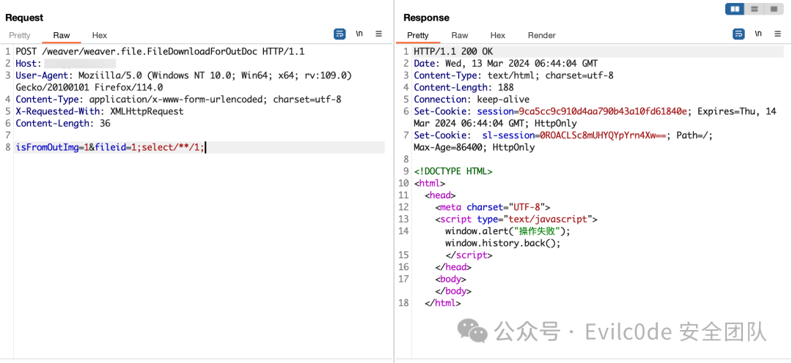

查看告警日志，成功匹配到规则，

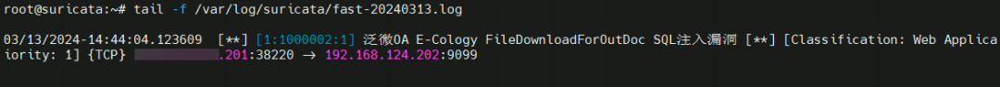

2、客户端模拟文件上传攻击

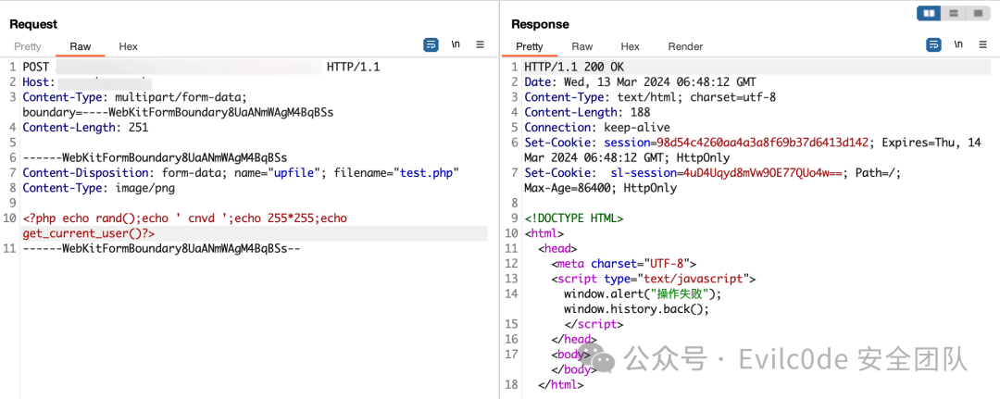

查看告警日志，成功匹配到规则

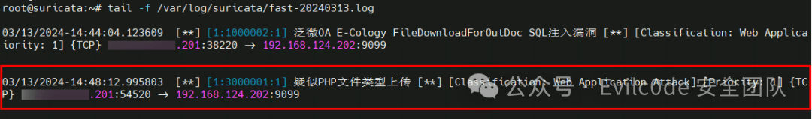

查看 eve.json 文件获取具体告警信息

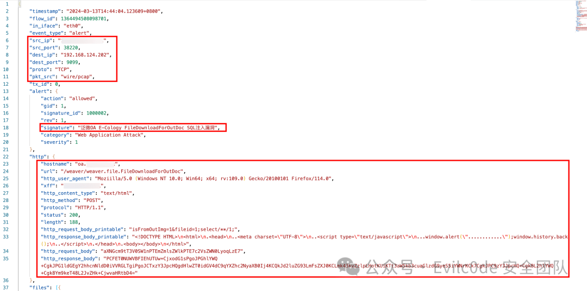

  
原始信息

```bash
{
 "timestamp": "2024-03-13T14:44:04.123609+0800",
 "flow_id": 1364494508098701,
 "in_iface": "eth0",
 "event_type": "alert",
 "src_ip": "x.x.x.x",
 "src_port": 38220,
 "dest_ip": "192.168.124.202",
 "dest_port": 9099,
 "proto": "TCP",
 "pkt_src": "wire/pcap",
 "tx_id": 0,
 "alert": {
  "action": "allowed",
  "gid": 1,
  "signature_id": 1000002,
  "rev": 1,
  "signature": "泛微 OA E-Cology FileDownloadForOutDoc SQL 注入漏洞",
  "category": "Web Application Attack",
  "severity": 1
 },
 "http": {
  "hostname": "oa.xxx.com",
  "url": "/weaver/weaver.file.FileDownloadForOutDoc",
  "http_user_agent": "Moziilla/5.0 (Windows NT 10.0; Win64; x64; rv:109.0) Gecko/20100101 Firefox/114.0",
  "xff": "192.168.124.1",
  "http_content_type": "text/html",
  "http_method": "POST",
  "protocol": "HTTP/1.1",
  "status": 200,
  "length": 188,
  "http_request_body_printable": "isFromOutImg=1&fileid=1;select/**/1;",
  "http_response_body_printable": "<!DOCTYPE HTML>\n<html>\n.<head>\n..<meta charset=\"UTF-8\">\n..<script type=\"text/javascript\">\n...window.alert(\"............\");window.history.back();\n..</script>\n.</head>\n.<body></body>\n</html>",
  "http_request_body": "aXNGcm9tT3V0SW1nPTEmZmlsZWlkPTE7c2VsZWN0LyoqLzE7",
  "http_response_body": "PCFET0NUWVBFIEhUTUw+CjxodG1sPgoJPGhlYWQ+CgkJPG1ldGEgY2hhcnNldD0iVVRGLTgiPgoJCTxzY3JpcHQgdHlwZT0idGV4dC9qYXZhc2NyaXB0Ij4KCQkJd2luZG93LmFsZXJ0KCLmk43kvZzlpLHotKUiKTt3aW5kb3cuaGlzdG9yeS5iYWNrKCk7CgkJPC9zY3JpcHQ+Cgk8L2hlYWQ+Cgk8Ym9keT48L2JvZHk+CjwvaHRtbD4="
 },
 "files": [{
  "filename": "/weaver/weaver.file.FileDownloadForOutDoc",
  "gaps": false,
  "state": "CLOSED",
  "stored": false,
  "size": 36,
  "tx_id": 0
 }],
 "app_proto": "http",
 "direction": "to_server",
 "flow": {
  "pkts_toserver": 4,
  "pkts_toclient": 3,
  "bytes_toserver": 691,
  "bytes_toclient": 614,
  "start": "2024-03-13T14:44:04.121088+0800",
  "src_ip": "x.x.x.x",
  "dest_ip": "192.168.124.202",
  "src_port": 38220,
  "dest_port": 9099
 },
 "payload": "UE9TVCAvd2VhdmVyL3dlYXZlci5maWxlLkZpbGVEb3dubG9hZEZvck91dERvYyBIVFRQLzEuMQpIb3N0OiBvYS54eHguY29tClgtRm9yd2FyZGVkLUZvcjogeC54LngueApYLUZvcndhcmRlZC1Ib3N0OiBvYS54eHguY29tClgtRm9yd2FyZGVkLVByb3RvOiBodHRwCkNvbnRlbnQtTGVuZ3RoOiAzNgpVc2VyLUFnZW50OiBNb3ppaWxsYS81LjAgKFdpbmRvd3MgTlQgMTAuMDsgV2luNjQ7IHg2NDsgcnY6MTA5LjApIEdlY2tvLzIwMTAwMTAxIEZpcmVmb3gvMTE0LjAKQ29udGVudC1UeXBlOiBhcHBsaWNhdGlvbi94LXd3dy1mb3JtLXVybGVuY29kZWQ7IGNoYXJzZXQ9dXRmLTgKWC1SZXF1ZXN0ZWQtV2l0aDogWE1MSHR0cFJlcXVlc3QKCmlzRnJvbU91dEltZz0xJmZpbGVpZD0xO3NlbGVjdC8qKi8xOw==",
 "payload_printable": "POST /weaver/weaver.file.FileDownloadForOutDoc HTTP/1.1\r\nHost: oa.xxx.com\r\nX-Forwarded-For: x.x.x.x\r\nX-Forwarded-Host: oa.xxx.com\r\nX-Forwarded-Proto: http\r\nContent-Length: 36\r\nUser-Agent: Moziilla/5.0 (Windows NT 10.0; Win64; x64; rv:109.0) Gecko/20100101 Firefox/114.0\r\nContent-Type: application/x-www-form-urlencoded; charset=utf-8\r\nX-Requested-With: XMLHttpRequest\r\n\r\nisFromOutImg=1&fileid=1;select/**/1;",
 "stream": 1,
 "packet": "vCQRWPxxvCQR0jFwCABFAAA0JeJAAEAGmf3AqHzJwKh8ypVMI4s3h+I0pfpVjYAQAfV7CwAAAQEICuveHFvvukF3",
 "packet_info": {
  "linktype": 1
 }
}
```

将 eve.json 接入到 splunk 或其他 SIEM 平台，即可实现可视化分析，实现一个简易的“态势感知”

# 后话

通过搭建蜜罐或者反向代理的方式部署一系列 OA 或者邮箱系统，再配合自定义的规则是否可以实现捕获 1day 或者 0day？理论存在可行性，具体要考虑规则的适用性和准确性等其他不确定因素，当然这俩无法做到绝对的平衡，可以同时配合多条件的规则来捕获 0/1day。我这里举几个例子

1.  检测后缀为.txt 的 GET 请求
    
2.  检测正文中包含.php,.jsp 等 webshell 后缀，并且包含 filename=
    
3.  检测后缀为.php (jsp) 的 GET,POST 请求，并检查是否含有传参，对传参进行常见的命令执行检查，例如 whoami,curl,wget,ping,cat 等
    
4.  检查返回包中是否包含 /etc/passwd，以及系统目录信息等敏感信息
    
5.  针对常见的 Webshell 管理工具做特征规则的匹配，例如哥斯拉，冰蝎等
    

其次还要考虑我们的资产是否被资产测绘平台收录等因素，总之规则是关键。

```bash
（全文完）
```

# Reference

1, https://www.jianshu.com/p/4a974ee6fcdd  
2, https://www.jianshu.com/p/34f94e139d84  
3, https://docs.suricata.io/en/suricata-4.0.4/rules/intro.html  
4, https://mp.weixin.qq.com/s/O4dNnrZ1kSYBi7ye9OO0\_w  
5, https://mp.weixin.qq.com/s/2Z4TgvhxjIY7QXRJUCya8Q  
6, https://www.jianshu.com/p/d81db4c352af
