# [实战] API 防护破解之签名验签 - FreeBuf 网络安全行业门户

## 前言：

传统的接口在传输的过程中，是非常容易被抓包进行篡改，从而进行中间人攻击。

这时候我们可以通过对参数进行签名验证，如果参数与签名值不匹配，则请求不通过，直接返回错误信息，从而防止黑客攻击或者大大增加了黑客攻击的成本。

白帽子在挖洞的时候也经常会遇到这种情况，大多数不会逆向的白帽子则会放弃这些有着攻击成本的接口。大多数也会有这样子的想法，这些个接口都加了防护了，说明厂商对这个接口挺重视的，肯定做了安全检测，自然是不可能有洞可捡了。反过来想，厂商正是因为加了防护从而对代码疏忽了，所以这些地方恰好就是挖逻辑漏洞的突破口。

平台：aHR0cHM6Ly93d3cudnVsYm\_94LmNvbS8=

厂商：某企业 src

## 正文：

开局一个搜索框


输入值抓包，接口携带了一个 sign 参数。


### 技巧

此处有两种方法逆向找出对应的加密点

第一种是笨方法，直接搜索对应的 sign 值去找到其加密的关键位置。

第二种是找到发包的地方，一直跟栈到明文加密的地方。

搜索 sign，网站里面出现了很多 sign 关键词，不利于我们进行逆向分析

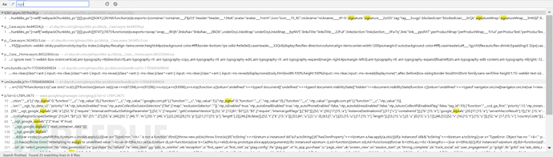

从查看请求发起的相关进程 (脚本) 去进行发包跟栈

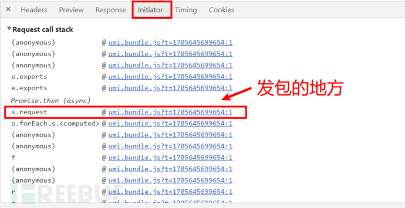

进入发包的地方打断点。

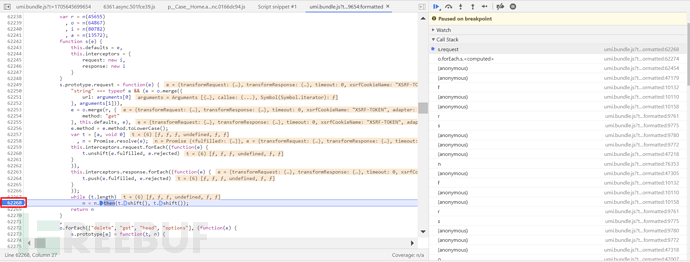

回溯跟栈，找找有没有比较显眼的关键词。

大概跟了几个栈找到了 sign 关键词，但是并不确定这个地方的 sign 参数是不是我们发包的那个 sign 参数，打下断点盲测一下。

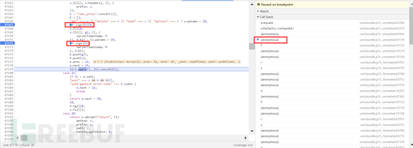

再次发包的时候，断点断住了。这个 sign 参数是一个 f 对象的一个函数，并不是一个 sign 参数值。而我们想要找到的是 sign 参数值，经过猜测，这个断点能够在携带 sign 参数的那个发包时断住，就肯定与 sign 参数有关。直接进入函数内部查看。

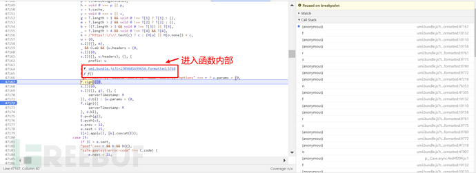

映入眼帘的是一个 f 函数，将断点断到返回值的地方，查看一下返回值是什么呢。

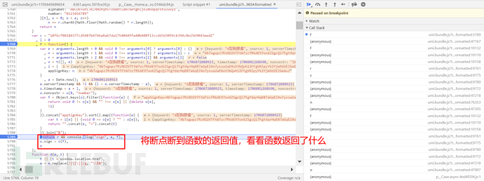

在控制台打印一下返回值。很眼熟，很像我们发包的时候携带的参数

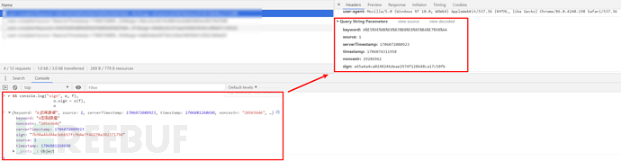

分析一下 f 函数，看看 sign 参数在哪里生成的。

sign 是在 5790 行被赋值的。

可以看出 sign 参数是 appSignKey，keyword，noncestr，serverTimestamp，source，timestamp 拼接之后传进了 s 函数生成的。除了 appSignKey 是代码生成的，其余都是发包里面携带的明文。

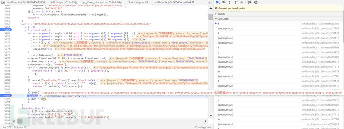

### appSignKey 参数

从 f 函数里面代码可以分析出，appSignKey 是由 n 赋值的，n 又是由 c 经过一段三元表达式生成的。c 是一段字符串，直接上手扣代码。

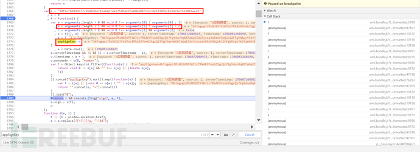

生成 n 的三元表达式用到了 arguments，直接到浏览器复制 arguments

```bash
var c = "10f6cf80184377cd5487b4746a8a67da17540449fa40b408f13ccdd3d3059cb394c0e1569043eed2"
arguments = {
"0": {
"keyword": "A 型胸腺瘤",
"source": 1,
"serverTimestamp": 1706072080923
},
"1": "4bTogwpz7RzNO2VTFtW7zcfRkAE97ox6ZSgcQi7FgYdqrHqKB7aGqEZ4o7yssa2aEXoV3bQwh12FFgVNlpyYk2Yjm_9d2EZGeGu3"
}
var n = arguments.length > 1 && void 0 !== arguments[1] ? arguments[1] : c
console.log("appSignKey--->"+n)ole.log(n)
```

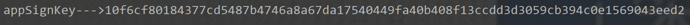

### sign 参数

有了 appSignKey 参数，就可以与发包参数拼接传进 s 函数。

```bash
appSignKey=4bTogwpz7RzNO2VTFtW7zcfRkAE97ox6ZSgcQi7FgYdqrHqKB7aGqEZ4o7yssa2aEXoV3bQwh12FFgVNlpyYk2Yjm_9d2EZGeGu3&keyword=A 型胸腺瘤&noncestr=20565646&serverTimestamp=1706072080923&source=1&timestamp=1706081268690
```

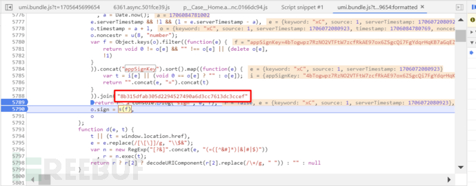

看一眼就知道是 md5 加密，完结撒花。

## 结尾：

部分数据代码已做脱敏处理。
