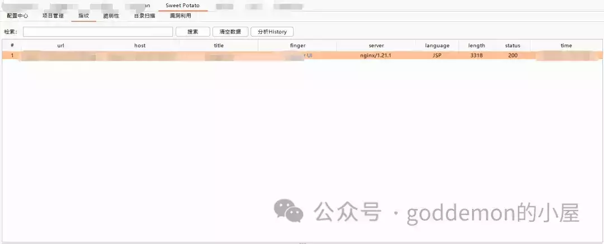
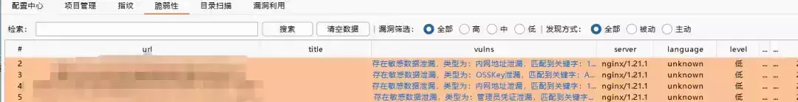
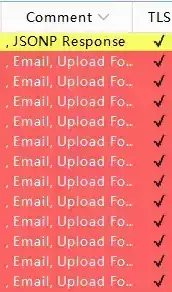
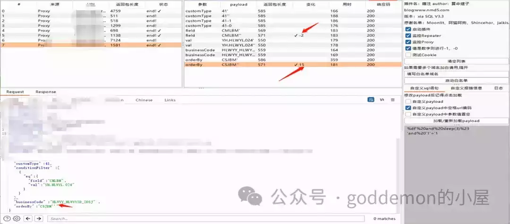
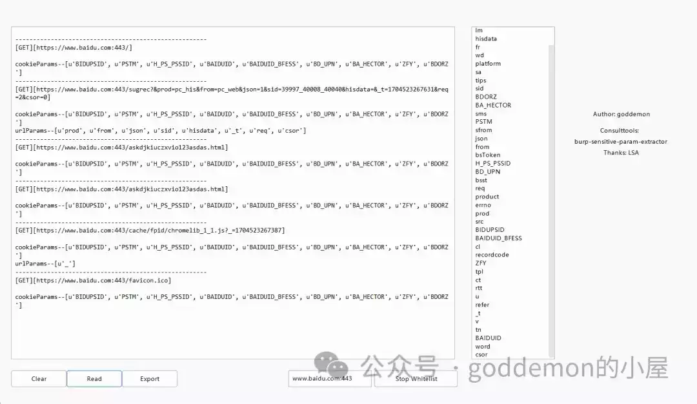
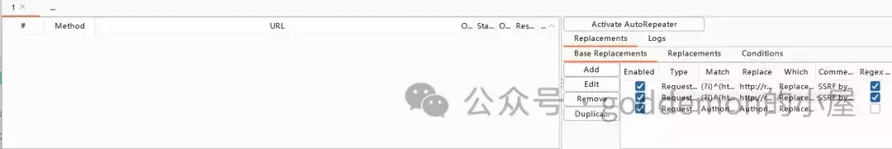
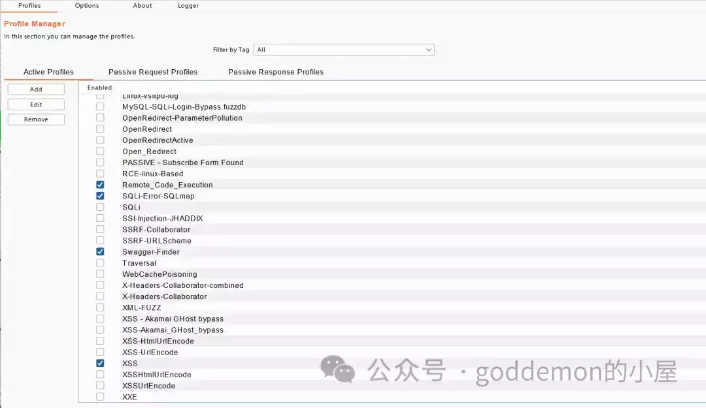
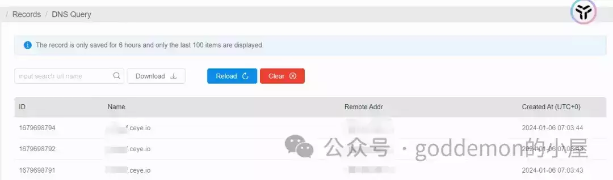

# 实战之常规漏洞快速挖掘

## 前言：

但是想来想去，对于如果是常规的漏洞的话，其实挖来挖去核心逻辑其实都是那些东西，所以对相关的文章又进行了一个删除。

这里写一篇文章，当然也可以说是一篇关于笔者使用相关工具介绍的文章，捡过很多漏洞。

## 正文：

又或者说是现实中分析事情，处理问题等等也好。

核心其实都是对相关的事务足够了解，然后结合自己的知识储备亦或是资源储备，时间，进行思考采取对应的模式去做一个解决（这里模式这块如果是常见的问题，可以采用一些定论，也就是老人长谈的经验去进行解决）。

因此如果是相同知识储备，相同时间的情况下，难点亦或是拉开差距的面，就是在于如何去对相关的事务做了解。

因此在渗透中，核心问题还是立足于如何对相关的信息做一个收集以及如何使用一些定论去批量测试。

对于针对一个网站而言，在笔者看来做一个信息收集的话，其实就是了解系统架构，核心是六个点开发语言，功能，接口，参数，鉴权逻辑，敏感信息其余的东西非通解的东西亦或是没那么重要的点这里不加讨论。

因此对于笔者而言，采用的模式就会去加强自己的这 6 块的信息获取能力以及通解常规漏洞的能力。

### 指纹识别以及敏感信息汇总（被动）：

对于指纹以及敏感信息的获取而言，笔者采用的是 Sweet Potato，里面的指纹自己去整理更改完善。

可自动化识别出系统的指纹以及整理可能存在的 osskey 泄露等等信息。burp 内置的指纹识别的意义就是在于可以处理好一些跳转以及多组件的问题。如有些网站会如下，对于这种网站而言常见的指纹识别工具是无法处理的，因此很多人会漏掉很多网站，导致可能存在高危漏洞而未挖掘到。

### 敏感信息检测 HAE（被动）：

识别常见的敏感信息 老生常谈的东西 HAE

不在阐述

### SQL 注入（被动）：

xia\_sql

不在额外阐述

### 接口获取（被动）：

如果是有自己开发能力的老哥，自己捏一个基于正则匹配规则来写接口获取即可。没有的话那就使用 findsomething

不在额外阐述。

https://github.com/momosecurity/FindSomething

### 未授权越权挖掘（被动）：

Autorize，不在阐述，网上很多了。

### 参数获取（被动）：

个人使用 god\_param，怎么使用看每个人理解了。

### 权限绕过，SSRF（被动）：

autoRepeater

### 大杂烩（主动）：

主动获取的笔者个人使用，burpbountyplus 如何自动化发觉，自己定义规则即可。

可主动自动化挖掘 RCE，XSS，SQL，任意文件读取，重定向，XXE 等等漏洞，自己根据自己规则来即可，注意写的规则需要无害化。实战的没截图，这里贴个靶场为例的，如无害规则自动化挖掘 RCE,SQL。具体不在阐述。

点到为止，还有一些其他的通解挖掘思路，这里不在阐述写出，每个人按照自己的思路去挖即可。

## 后文：

很多东西或者问题，学习思维等等都可以找到一种通解，重要的是 你是否 get 到自己的方式模式，仅此而已。