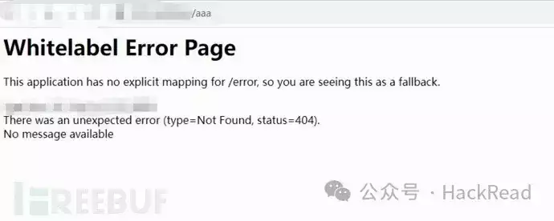
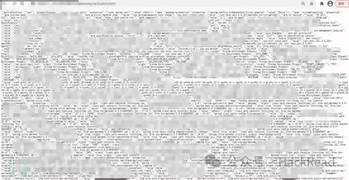
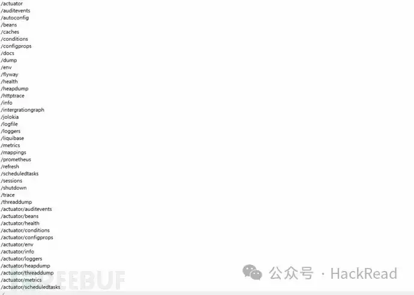
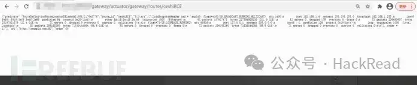

# 实战案例 | 利用SpringBoot相关RCE漏洞拿下某数字化平台系统

在一次众测项目中，对某大型企业的某套数字化平台系统进行测试，前端功能简单，就一个登录页面，也没有测试账号，由于给的测试时间不多，倒腾了半天没有发现有价值的漏洞，在快要结束的时候，试了几个报错，发现是Spring Boot框架的，仿佛间看到曙光，后续也顺利拿下RCE。通过本文的分享，希望能给大家获取到一些思路和帮助~~

## **开局**

访问http://xx.xx.xx.xx/，打开就是一个某数字化平台登录页面，尝试了登录框可能存在的各类漏洞问题，如弱口令，用户名枚举，万能密码登录，登录验证绕过，任意密码重置等等，无果

## **Spring Boot框架**

随后，随意构造了目录aaa看看会发生啥，结果发现是非常熟悉的404错误页面，该页面的特征确定了使用Spring Boot框架，于是看看Spring Boot是否有一些配置接口泄露，运气好还可以执行RCE



尝试了几个目录，确定在/gateway/一级目录下存在配置接口信息

http://xx.xx.xx.xx/gateway/actuator/

http://xx.xx.xx.xx/gateway/actuator/env



使用SpringBoot敏感目录扫描一下



扫描后发现存在蛮多接口信息，我对Spring Boot的漏洞了解不是很深，第一时间能想到rce的漏洞有两个，一个是Spring Boot Actuator jolokia 配置不当导致的RCE漏洞和Spring Cloud Gateway的应用对外暴露了 Gateway Actuator，通过Spring Cloud Gateway 远程代码执行漏洞（CVE-2022-22947）执行SpEL表达式，可远程主机上进行远程执行RCE。

思路有了，我们先来看看是否有/jolokia或/actuator/jolokia接口，扫描发现没有，那就看看有没有/actuator/gateway/routes/


## **Spring Cloud Gateway 远程代码执行漏洞（CVE-2022-22947）**

运气还是挺好的，Spring Cloud Gateway的应用程序在Actuator端点在启用，并能获取到路由信息，http://xx.xx.xx.xx/gateway/actuator/gateway/routes/


接下来构建POST请求包，在/gateway/actuator/gateway/routes/ceshiRCE 添加一个包含恶意的SpEL表达式的路由，这里我创建ceshiRCE路由,命令用的是ifconfig，这里可以也用其它的命令，注意的是Content-Type:application/json要修改为json，发包后返回201说明添加成功


再次刷新，http://xx.xx.xx.xx/gateway/actuator/gateway/routes/ceshiRCE，命令执行成功



## **总结**

本次漏洞挖掘就到这里了，感觉还有其他点可以再次深入挖掘，由于时间关系只能皆已至此了，不过没关系，还是有收获滴，但回过头来想想，如果更细心一点，信息收集面大一点会有更多的可能性。希望这次的漏洞挖掘过程，能给大家带来一些挖洞思路，谢谢大家！

## **声明**

漏洞已修复，笔者初衷用于分享与普及网络安全知识，若读者因此作出任何危害网络安全行为后果自负。

```plain
来源：https://www.freebuf.com/articles/web/388523.html
```