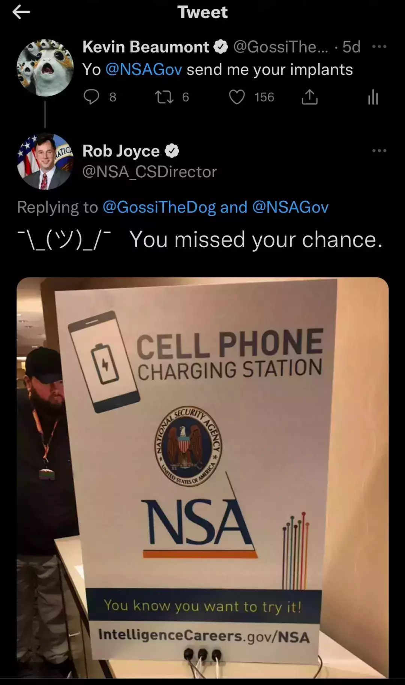

# 寒冬下的安全研究

> 七月在野，八月在宇，九月在户，十月蟋蟀入我床下。——《国风·豳风·七月》

不知不觉已经三个月没有更新博客了。其实技术文档一直在更新，不过由于各种原因一直躺在私有的 Obsdian 仓库里。要么是因为保密的原因不便公开，要么是自我感觉没有新意不值一提。回想起早些年刚接触网络安全的时候，对什么方向都充满激情，充满好奇，只要能学到一点新知识就会写篇博客进行记录和分享。现在动笔就要考虑颇多，已经少了很多当年的乐趣。

# 凛冬的寒风

众所周知今年的经济环境欠佳，寒气已经确实地传递给了每一个人。笔者作为某甲方企业的安全研究岗，也逐渐感受到了氛围的变化。说起安全研究，很多人以为是挖漏洞、写利用，其实研究包括很多方面。《黑客与画家》中说到，“优秀的设计不一定是新的，但一定是好的；优秀的研究不一定是好的，但一定是新的”。所以安全研究也会极力探索前言新兴的领域，比如可信计算、区块链、星链等等，这也曾经是笔者的部分研究内容。

随着经济环境下行，企业也逐渐开始关注起了人力资源的效率。“岗位称重”、“收紧队形”、“逃逸平庸的重力”，等等一系列金句被提出，字里行间确切地透露出一股寒气。

# 群鸦的盛宴

对于大多数企业而言，都是“业务先行，安全兜底”。尤其是在经济环境萧条的情况下，保持盈利、维持现金流是很多企业的要务之一。但其实不论在什么阶段，只要企业还在正常运转，就一定需要安全团队的支撑。加上国家监管对于企业安全的硬性要求，不到万不得已，一般也不会对安全岗位动刀。

不过，在这个时代什么事情都有可能发生。一方面企业可能出于侥幸心理削减了安全团队，另一方面则是出于简单的利益权衡——出事之后的损失加监管的处罚支出，小于供养安全团队的成本，那么在线上裸奔也是划算的。大不了加强一下法务和公关团队，只要把提出问题的人消灭掉，那就没有问题了。

在这种情况下，流失的安全团队成员对企业愤愤然，既存的安全从业者也人心惶惶。不管红队蓝队，都不免做出“一颗红心，两手准备”的规划。也许在阳光下大家还觉得一切稳中向好，但地下早已经暗流涌动，技术攻防的复杂度和专业度也不断地水涨船高。

勤奋的黑客

> 来源: 奇安信威胁情报中心: 揭秘LIVE勒索软件利用IP-Guard漏洞的技战术\[1\]

相比于早年使用 QQ 号留名或是用微信支付来收赎金的脚本小子，现今新闻中爆出的网络恶性事件背后出现了更多的专业技术人员身影，也许未来很长一段时间将会是国内赛博空间的常态。

# 魔龙的狂舞

当然，这只是一般安全从业者可能卷入的情境。对于安全研究员而言，情况又有所不同。首先研究方向脱虚向实，太超前的研究就不鼓励投入了。于是部分研究员又回到了老本行 —— 挖漏洞。不管是企业内部漏洞还是外部竞对、HW 漏洞，都是看得见摸得着的“产出”。另一方面，对于安全研究员自身而言，挖漏洞本身也是自己在职业中立足的一种重要方式。

早期许多甲方企业乐意供养着安全实验室去进行研究，企业得名，员工得利，皆大欢喜。随着寒气入体，老板们渐渐发现徒得虚名好像也没什么大用，Pwnnie Awards？听起来还不如 Gartner “领军者” 霸气呢！于是天x杯也不建议参加了，Blackhat 的机票也不报销了，安全研究员也要开始研究起自己的饭碗了。

或主动或被动，企业中安全研究终究会调整重心，要么为业务保驾护航，要么就直接躬身下场接客，把自己变成商业化的业务。这其中免不了会有人心生不满，毕竟大家都不喜欢变化。从前拿 bounty 讲议题还有公司的激励，现今 bounty 要抽水议题要自费还要担心被网信办鉴定为间谍。因此，一部分优秀的研究员就开启了 Anonymous 之路，以匿名的方式提交漏洞报告；另一部分就经常对着某logo 是纸飞机的社交软件交流。

毕竟安全研究员能卖的就只有 0day 了。如果遇到靠谱的中间人牵线搭桥，一些危险的 0day 也许能找到它们合适的归宿，某种程度上还为国家安全做出了贡献；倘若遇人不淑，也有可能流入到敌对势力，出现不愿看到的受害者，同时也将自己至于危险的境地。

当然，买卖漏洞是不对的，而且是非法的。但是这头魔龙已经脱缰，谁又有能力去限制他呢？

# 初春的遐想

最后我想引用一句俗套的话：“道路是曲折的，前途是光明的”。现在确实是行业的寒冬，但冬天总会过去，春天终将到来。在当前，作为安全研究员也许暂时脱离了一线研究，但依然可以在安全行业中磨练基本功，同时也不要失去对未知的好奇和热情，也许在脱离企业的场景也能更好地审视自己的选择以及研究方向的价值。

在这里我也想呼吁有关部门能够真正重视网络安全建设，让更多白帽子和安全从业人员能够通过合法、正常的渠道发光发热，真正为社会和国家的网络安全做出贡献。同时，我希望有一天中国也能够开展类似于 hack DoD 的众测项目，也希望中国的 NSA 主任也能够以幽默的方式回复我的微博调侃，而不是直接被来总夹掉。

tweet

# LINKS

-   • Selling 0-Days to Governments and Offensive Security Companies\[2\] (Video\[3\])
    
-   • Update About the 0-day Industry\[4\] (中文翻译: 关于0-day数字军火行业\[5\])
    
-   • The offensive cybersecurity industry — trends and updates\[6\] (中文翻译: 数字军火行业的兴衰及调整 - 趋势与更新\[7\])
    
-   引用链
    

`[1]` 奇安信威胁情报中心: 揭秘LIVE勒索软件利用IP-Guard漏洞的技战术: *https://www.secrss.com/articles/63100*  
`[2]` Selling 0-Days to Governments and Offensive Security Companies: *https://www.blackhat.com/us-19/briefings/schedule/#selling--days-to-governments-and-offensive-security-companies-14453*  
`[3]` Video: *https://www.youtube.com/watch?v=JkQxS1l9IPI*  
`[4]` Update About the 0-day Industry: *https://medium.com/@maor\_s/update-about-the-0-day-industry-8d8bb49e8dbb*  
`[5]` 中文翻译: 关于0-day数字军火行业: *https://hardenedlinux.github.io/system-security/2023/07/20/0day-industry.html*  
`[6]` The offensive cybersecurity industry — trends and updates: *https://medium.com/@maor\_s/the-boom-the-bust-and-the-adjust-ea443a120c6*  
`[7]` 中文翻译: 数字军火行业的兴衰及调整 - 趋势与更新: *https://hardenedlinux.github.io/system-security/2023/07/21/offensive-security-industry-trends.html*