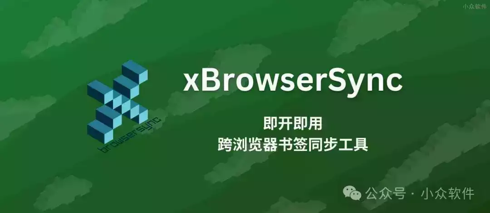
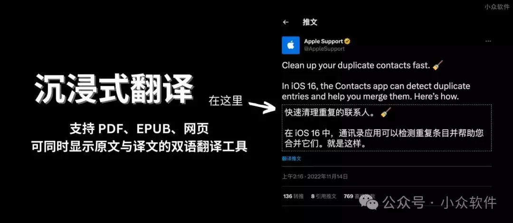
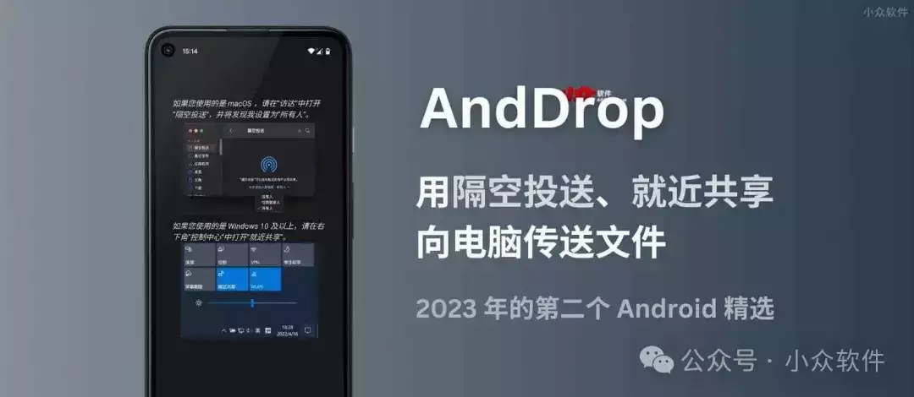
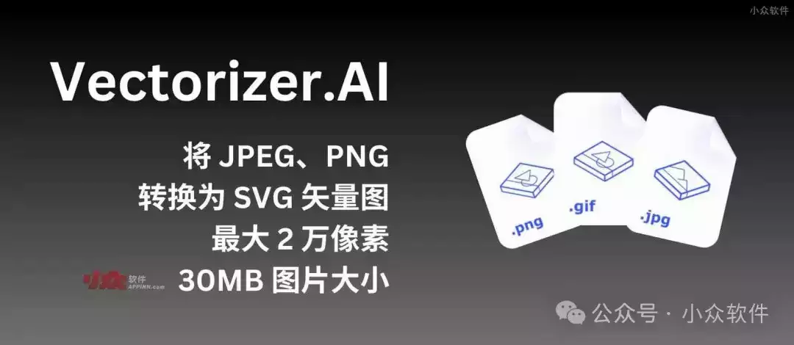

# 小众软件 2023 年度精选：1

继 2022 年精选榜单之后，今天带来小众软件 2023 年度精选。所有内容来自小众软件精选分类，仅代表青小蛙的主观评断。@Appinn

先来回顾下：《[兔年（2023）小众软件微信公众号阅读数前 10 的文章](http://mp.weixin.qq.com/s?__biz=MjM5NDMwMTI2MA==&mid=2651678335&idx=1&sn=48f0528015893ca613533260025948cc&chksm=bd70125c8a079b4a88e11f5629fad5fcc672c443f039e15889f5857c891125633e8953687146&scene=21#wechat_redirect)》以及：

## 2022 年度 TOP 榜单

-   [小众软件 2022 年度精选 1](http://mp.weixin.qq.com/s?__biz=MjM5NDMwMTI2MA==&mid=2651673447&idx=1&sn=bd3c4151887767d56c34abb42ff1b466&chksm=bd7027448a07ae520e65cd768288f91f8a3597e2e211586b13adc8ac7b8ff9b2df9c0771be5d&scene=21#wechat_redirect)
    
-   [小众软件 2022 年度精选 2](http://mp.weixin.qq.com/s?__biz=MjM5NDMwMTI2MA==&mid=2651673470&idx=1&sn=4ef5f4215356e53172b65731f3ab2d6e&chksm=bd70275d8a07ae4b3c829ffe17c6b34d9dcdcd1fa6ba9ed12d74158dbf9dc81d9f21d27df2ac&scene=21#wechat_redirect)
    
-   [公众号 2022 年度阅读数 TOP 10](http://mp.weixin.qq.com/s?__biz=MjM5NDMwMTI2MA==&mid=2651673506&idx=1&sn=f63e37fd02f6244a1b37dca10466c347&chksm=bd7027818a07ae9787f158bda0f42ae5ce84e18047ec04e6c22fd5a08c84251f07cfbf1e40dd&scene=21#wechat_redirect)
    

- - -

## 2023 年度 TOP 榜单

-   https://www.appinn.com/public-domain-radio/
    

**公共领域电台**（Public Domain Radio）是一个由**瑞士公共领域基金会**提供的免费的在线服务，它在不同频道上 7\*24 小时不间断播放古典、爵士、民俗音乐，总计超过 70000 张经过数字化处理的唱片。

## 2. xBrowserSync – 即开即用的跨浏览器书签同步工具

-   https://www.appinn.com/xbrowsersync/
    

**xBrowserSync** 是一款开源、免费的跨浏览器书签同步工具，只需要在浏览器安装扩展，就能开始备份、同步书签，支持为书签添加描述与标签，支持 Chrome、Edge、Firefox 以及 Android，并且可以自建服务器。

## 3. 棋路 – 就想简单的下象棋：中国象棋对弈、残局，超过 30 万在线棋谱\[iOS/Andriod\]

-   https://www.appinn.com/mdevs/
    

**棋路**是一款中国象棋应用，适用于 iPhone、iPad、Android，有超过 30 万局的在线棋谱、3665 局残局、超过 18000 内置棋谱，如果你只想简单的下下棋、研究残局，那就选它吧。

## 4. LocalSend – 无联网，开源跨平台的局域网文件互传工具

-   https://www.appinn.com/localsend/
    

**LocalSend** 是一款免费、开源、跨平台的局域网文件互传工具，无需互联网，无需外部服务器。即开即用，支持 Windows、macOS、Linux，以及 iOS、Android。「开发者说开发的契机是有次用 Snapdrop 挂了，他在想为啥非得要联网，就做了这个」.

## 5.沉浸式翻译 – 支持 PDF、EPUB、网页，可同时显示原文与译文的双语翻译工具\[Chrome/Firefox/油猴脚本\]

-   https://www.appinn.com/immersive-translate/
    

**沉浸式翻译** 是一款可同时显示原文与译文的双语网页翻译工具，有多种排版样式，能够智能识别网页主要内容区域，非常适合在线对照阅读。支持谷歌、DeepL、必应、彩云、有道、腾讯等 10+ 种翻译引擎，还可以对照翻译 PDF 文档、EPUB 电子书。@Appinn

题外话：这大概可以算作去年的年度软件了。独立开发者的巅峰之作（之一）

## 6. AndDrop – 用「隔空投送」「就近共享」从 Android 设备向 Mac、Windows 传送文件

-   https://www.appinn.com/anddrop/
    

**AndDrop** 是一款非常赞的 Android 应用，它通过 Mac 自带**隔空投送**、Windows 自带**就近共享**两个系统功能，来向 Mac、Windows 电脑传送文件。简单易用，无需在电脑安装客户端

## 7. Vectorizer.AI – 将 JPEG 和 PNG 位图转换为 SVG 矢量图，可无限放大。支持最大 2 万像素、30MB 图片大小【已收费】

-   https://www.appinn.com/vectorizer-ai/
    

**Vectorizer.AI** 是一款非常新鲜，正在测试中的网站，由 AI 驱动。它能将 JPEG 和 PNG 位图转换为 SVG 矢量，可无限量放大，目前支持的最大图像像素大小为 2 万像素，最大图像文件大小为 30 MB，可免费使用（已开始收费）

- - -

鉴于青小蛙目前的注意力也就只能编辑完成这 7 个，所以明天发布第二部分。另外过年期间也有点懒。更多精选内容，可以在下面的链接查看：

-   https://www.appinn.com/category/featured/
    

最后，是不是只有青小蛙在春节做年度总结的 😂

大年初一，给各位拜年了。