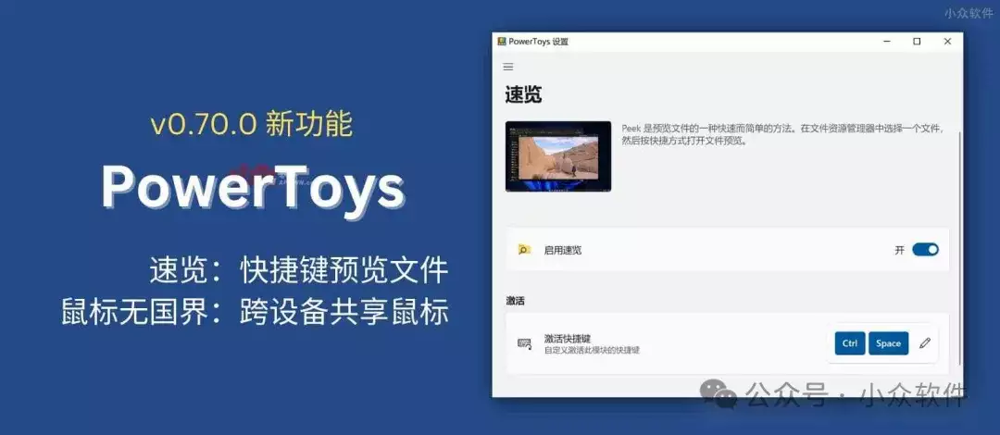

# 小众软件 2023年度精选.2

接昨日《[小众软件 2023 年度精选.1](http://mp.weixin.qq.com/s?__biz=MjM5NDMwMTI2MA==&mid=2651678362&idx=1&sn=31fd32140e66b49a7031b5d199840545&chksm=bd7012b98a079bafc4dc09d7b7b633ccf555685d6c0905948c28cc2d393eaee45f8f40cea7d4&scene=21#wechat_redirect)》，今天继续带来 2023 年度精选第二部分。

## 历年回顾：

-   [小众软件 2023 年度精选1](http://mp.weixin.qq.com/s?__biz=MjM5NDMwMTI2MA==&mid=2651678362&idx=1&sn=31fd32140e66b49a7031b5d199840545&chksm=bd7012b98a079bafc4dc09d7b7b633ccf555685d6c0905948c28cc2d393eaee45f8f40cea7d4&scene=21#wechat_redirect)
    
-   [↓↓↓](http://mp.weixin.qq.com/s?__biz=MjM5NDMwMTI2MA==&mid=2651673447&idx=1&sn=bd3c4151887767d56c34abb42ff1b466&chksm=bd7027448a07ae520e65cd768288f91f8a3597e2e211586b13adc8ac7b8ff9b2df9c0771be5d&scene=21#wechat_redirect)  
      
    小众软件 2022 年度精选1  
      
      
    [↑↑↑](http://mp.weixin.qq.com/s?__biz=MjM5NDMwMTI2MA==&mid=2651673447&idx=1&sn=bd3c4151887767d56c34abb42ff1b466&chksm=bd7027448a07ae520e65cd768288f91f8a3597e2e211586b13adc8ac7b8ff9b2df9c0771be5d&scene=21#wechat_redirect)
    
-   [小众软件 2022 年度精选2](http://mp.weixin.qq.com/s?__biz=MjM5NDMwMTI2MA==&mid=2651673470&idx=1&sn=4ef5f4215356e53172b65731f3ab2d6e&chksm=bd70275d8a07ae4b3c829ffe17c6b34d9dcdcd1fa6ba9ed12d74158dbf9dc81d9f21d27df2ac&scene=21#wechat_redirect)
    
-   [公众号 2022 年度阅读数 TOP 10](http://mp.weixin.qq.com/s?__biz=MjM5NDMwMTI2MA==&mid=2651673506&idx=1&sn=f63e37fd02f6244a1b37dca10466c347&chksm=bd7027818a07ae9787f158bda0f42ae5ce84e18047ec04e6c22fd5a08c84251f07cfbf1e40dd&scene=21#wechat_redirect)
    

依旧，所有内容来自小众软件精选分类，仅代表青小蛙的主观评断。

## 8\. MuscleWiki – 点哪练哪，免费视频健身指南

-   https://www.appinn.com/musclewiki/
    

MuscleWiki 是一个提供了网页版、iPhone 与 Android 客户端的健身应用，拥有全面的健身视频库，只需要点击身体部位，就能找到指定肌肉力量的练习，有初中高三种级别，另外针对每个部位，还可以选择徒手练习、器械练习、哑铃练习、拉伸等练习方式。

## 9\. PowerToys v0.70.0 新功能：速览，无需打开即可预览文件内容

-   https://www.appinn.com/powertoys-v0-70-0/
    

速览 是 PowerToys v0.70.0 带来的新功能，它可以让你通过快捷键 Ctrl + 空格快捷键预览文件内容，而无需打开文件，非常方便实用。像极了 macOS 的原生功能：快速查看，只需要空格即可预览文件。

## 10\. 寻隐 – 运行在本地的 AI 模型，用自然语言搜索照片\[macos/iOS\]

-   https://www.appinn.com/queryable/  
    

寻隐 是一款 iOS 相册应用，它通过运行在本地的 Core ML 模型，实现了自然语言搜索相册照片，比如公园躺椅上的白色小猫、粉色的天空，或者任何你想到的能够描述这张照片的语言。并且不联网，完全运行在本地，保护你的隐私。

## 11\. 超级简单的记分牌 Super Simple Scoreboard – 只有280.2 KB 的家用记分牌\[Apple\]

-   https://www.appinn.com/super-simple-scoreboard/
    

Super Simple Scoreboard 直译「超级简单的记分牌」，是一款适合在家玩游戏时使用的双人计分牌应用，支持 macOS、iPad、iPhone、Apple Watch，就是很简单易用，在家玩一些有趣的游戏。

## 12\. 实时打字翻译 – 边打字边翻译，直接输入，支持发音\[Windows\]

-   https://www.appinn.com/typing-translate/  
    

实时打字翻译软件（Real-time-translation-typing）是一款用 AHK 编写的、十分有创意的软件，它能够在你打字（中文）的时候，在候选词上方实时出现英文翻译，通过快捷键发音、或直接输入。翻译接口支持有道和百度翻译。

## 13\. ALog – 开源 AI 语音日记：每日碎碎念，AI 帮你转录及总结，变为文字日记

-   https://www.appinn.com/alog/
    

ALog 是一款支持 iPhone、Apple Watch 的开源语音日记应用，带有 AI 功能，可以实现录音之后的语音转文字，以及 AI 总结两个功能，让你每日不停的碎碎念之后，还能有一篇完整的文字日记。

## 14\. 微软 Windows 天气：最被低估的天气应用，拥有1975～2023 共 48 年历史天气数据｜Windows 10/11 自带天气

-   https://www.appinn.com/msn-weather/
    

微软 Windows 天气应用，是 Windows 10、11 中自带的软件，在开始菜单中输入天气就能找到。这是一款被长期低估了的软件，它功能强大，数据丰富，拥有1975～2023 共 48 年历史天气数据，堪称巨型天气博物馆。

## 15\. 图片助手 ImageAssistant – 批量看图/下图工具：这样看小姐姐图片，太方便了吧

-   https://www.appinn.com/image-assistant/
    

图片助手 ImageAssistant 是一款专门用来在浏览器上一次性批量看图的工具。非常适合浏览那种有海量图片的帖子，不需要向下滑动网页，就像看相册一样简单。而下载这些图片，只是一个附加功能。支持 Chrome、Firefox，以及 iOS。

- - -

2023 年的精选就这么多啦，争取2024年可以更多一些，也欢迎前来发现频道推荐（自荐） 你认为的精选软件 https://meta.appinn.net/c/faxian/10

另外，没有另外两件事，好好过年，好好吃肉。