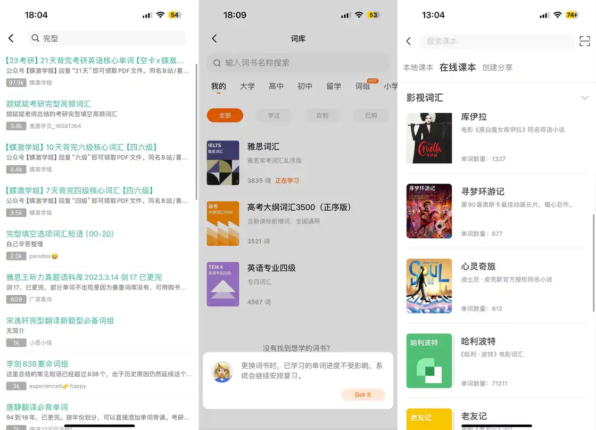
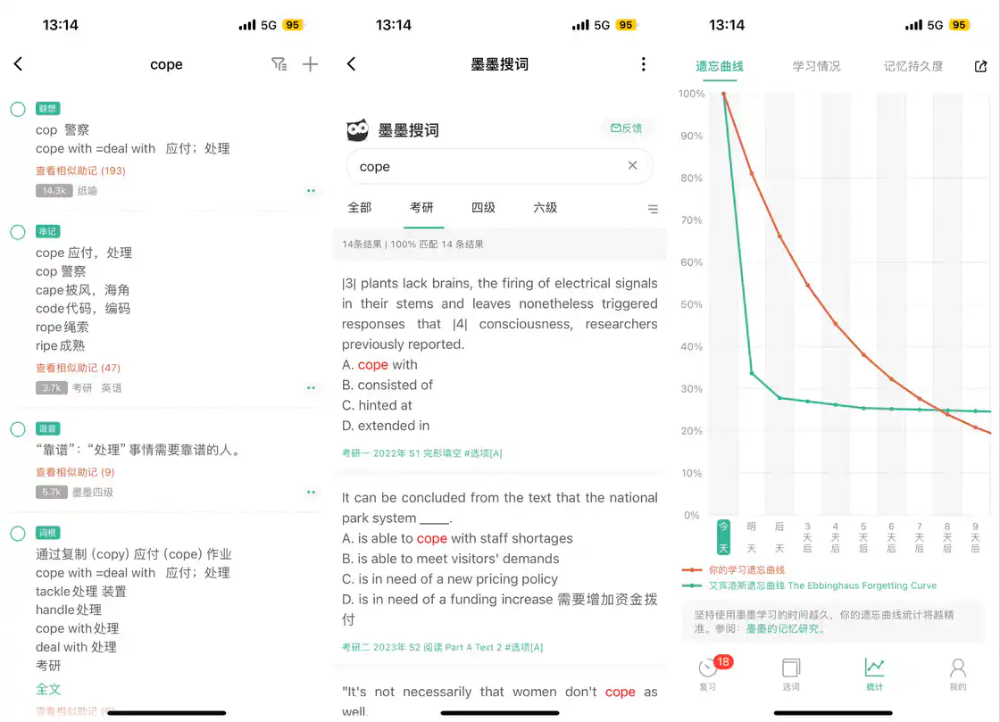
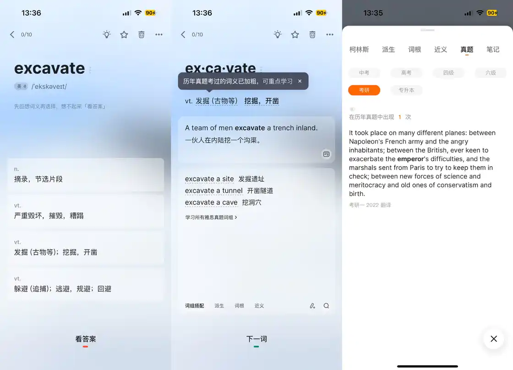
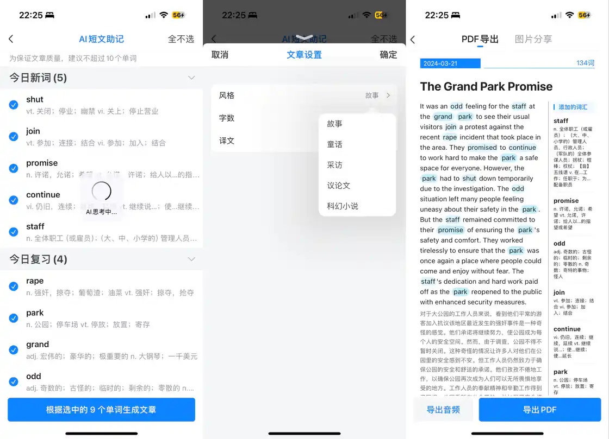
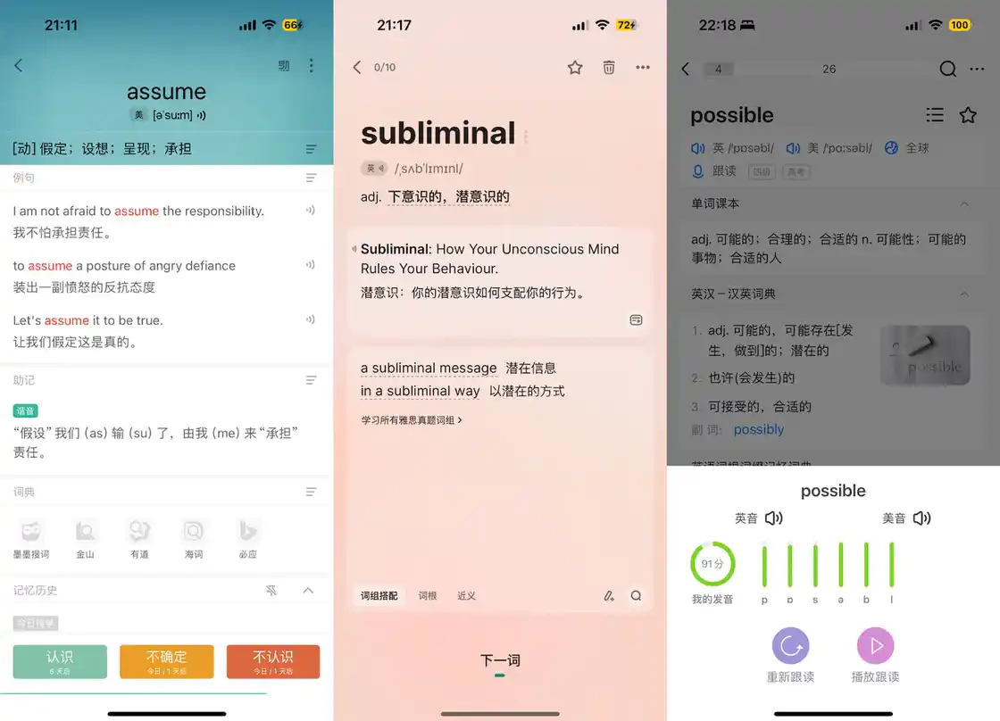

# 5 个维度、6 个 App，帮你选出最适合自己的「背单词神器」 - 少数派

## 前言

学英语最基础的就是背单词，这个毋庸置疑，无论是学生党还是工作党，有背单词的需求的人数不胜数。因为有着庞大的用户群体，单词 App 这个赛道可谓是卷得飞起，各种单词 App 层出不穷，用户也挑得眼花，相信每一个背单词人的手机中都至少装过不下三款单词 App。

今年是我使用单词 App 的第十年，经历过「百词大战」，几乎在应用商店上架过的单词 App 都下载下来尝试过。今天选取在我手机里住过好几年的单词 App 来做个评测，分别墨墨背单词、扇贝单词、百词斩、不背单词、欧路词典、可可英语，从功能、用户体验和附加功能三个维度进行深入分析，希望帮助读者朋友们选择最适合自己的那一个。

作为背词软件来说，最核心的自然是背词部分，我从背单词的流程中选取词库、背词方式、学习计划、搜词这几个维度，来进行对比与评测。

## 词库

**墨墨背单词**的词书涵盖小学、初中、高中、大学四六级、专四专八、考研、雅思托福、GRE、GMAT、BEC、SAT 等多个考试阶段，甚至还有医学词汇词书，每种类型里面又有多本词书。拿考研来举例，学生常用的红宝书、恋练有词、黄皮书、星火考研、一笑而过等都有，非常全面。

除了墨墨自带的词书以外，还可以搜索公开词书进行添加，有很多墨墨用户会分享自己整理的专题单词本，比如考研真题完型单词书等，对于刷题党来说很好用。此外，自己自制的词书也可以在墨墨中进行添加。

**不背单词**的词书相较墨墨来说少一些，但也涵盖了小学、初中、高中、大学、留学几个阶段，基本的词书都有，考研单词书里也包括红宝书、恋练有词等比较热门的词书，总体来说是够用的；只不过不背单词的词书并不都是免费的，词组书是要付费购买后才能用；当然，不背单词也支持用户自己自制词书进行上传使用。

**欧路词典**的词书当然也是涵盖各个阶段，只不过针对考试学习来说，相关词书没有前两者那么多，考研词书只收录了比较热门的几个，但是它有 COCA 分频词书、影视词书以及一些专业相关的词书比如金融词汇、计算机词汇、医学词汇、外贸词汇等；同样，它也跟墨墨一样支持搜索其他用户上传的公开词书或是上传自己的词书。

词书：墨墨 - 不背 - 欧路

**扇贝单词**的词书相对上述三个 App 是少了一些，只有一些非常基础的，如考研考纲词汇、四六级考纲词汇等，不过值得一提的是兴趣英语和职业英语这两个分类，兴趣类里有文学作品、影视剧等相关词书，如《哈利波特》《傲慢与偏见》《权力的游戏》等，但这其中有不少词书都是需要付费才能使用的；扇贝单词无法搜索其他用户上传的词书，只能将自制词书上传使用。

**百词斩**的词书只对应了几个考试阶段和学习阶段用户，有与教材配套使用的词书如高中人教版必修一、新视野大学英语等，还有对应考试的考研词汇书、四级词汇书、六级词汇书等，可选的也不多，没有引入市面上的热门词书，也**无法自己上传词书**。

**可可英语**的词书也有教材同步词书和考试相关用户，比起百词斩来说多了不少，热门的如恋练有词、红宝书等都有收录，此外在职业词书这个分类下，医学的词汇用书对应了全国医护英语水平考试的等级考纲词汇，还有化工、石油、通信、法律、材料等多个行业相关的词书。同样，可可英语**也不支持**用户上传词书，只能从预设的词书中挑选。

词书：百词斩 - 扇贝 - 可可

## 背词

选择完词书后，下一项就是背单词环节。这一环节中，我们从背词方式、单词信息、学习计划这三方面来比较六款背词 App。

**墨墨背单词**是需要每天手动在词库中选词来背，可以顺序选词也可以随机选词。每日学习的单词数量为当日需要复习的单词量 + 当日新学的单词量，这个数量可以自己在设置中进行调整。背词的时候先显示单词，让用户回忆单词释义，点击屏幕进入单词信息页，再根据信息页选择自己对该单词的掌握程度：认识、模糊、忘记，当今日所背单词都标记「认识」后，则算完成了单词背诵。

在单词学习方式上，墨墨有拼写和英文再认，单词复习方式比较匮乏，依靠听力模式方便默写，中英模式和听写模式对单词拼写进行复习。它强调多轮重复，背单词比较枯燥，例句发音还需要单独付费购买。

墨墨选词 - 单词信息 - 复习

在单词信息页面，墨墨提供例句、助记以及内置词典。墨墨词条内容比较简短、容易记忆，每个词条都经过人工编辑并经过四重审核，而且例句中不会包含比单词本身更难的生词。

**助记功能**有大量用户提供的助记方式，有趣易记，包括但不限于词根词缀记忆法、扩展串记记忆法、谐音联想记忆法，达到一定的等级自己也可以提供助记，被引用还有奖励，可以兑换单词上限。

词典内置了墨墨搜词、金山、有道、海词、必应词典，其中墨墨搜词能够搜到这个词在考研、四六级中出现的位置，对要应对要三个考试的考生来说是个比较有用的功能。用户达到一定等级还可以开通柯林斯、建桥、牛津、谷歌等等市面上知名的在线英语词典。

墨墨会根据用户在使用过程中的点击记录、页面反应时长等对单词熟悉程度标记，从单词的掌握情况、难易程度、记忆持久度来建立记忆矩阵，然后安排每个单词的复习时间和出现次数，在单词遗忘的临界点到来之前安排用户复习。

墨墨主打记忆算法，基于 BMMS 收集记忆行为数据，会根据用户在使用过程中的点击记录、页面反应时长等对单词熟悉程度标记，从单词的掌握情况、难易程度、记忆持久度来建立记忆矩阵，然后安排每个单词的复习时间和出现次数，在单词遗忘的临界点到来之前安排用户复习。

复习 - 搜词 - 记忆曲线

**不背单词**是通过英选中文释义的方式来进行学习的，答案选错的词汇会安排再次出现直到选对为止，连续答对三次算完成一个单词的学习，以十个为一组背单词，压力比较小。

进入单词信息页，词组、词根、近义词都以卡片的形式分别显示，需要切换才能查看其他信息，无法在一屏总览单词全部信息。不背单词能够自由切换英/美音，做到学习中进行发音对比，对发音学习更友好，并且单词用拆分和词根词缀的方式，能够帮助记忆。

学习任务结束后全拼默写练习，并且提供**随身听功能**来进行复习或者预习，预习模式有三种：基础模式、进阶模式和速刷模式，区别在于播放单词、播放释义、播放例句，可以根据自己的需要进行选择，这个功能很适合睡前回顾或者碎片时间学习。

单词信息页的搜词功能，可以查看这个单词在中高考、考研、四六级等考试真题中出现的次数及位置；柯林斯词典、派生词串记、以及词根都需要付费才能使用，但也可以通过签到、学习复习、参加活动等货币酷币进行兑换。

不背单词的复习被戏称大学生的高利贷，「给它一天时间，它能让你欠下巨额债务」，学新词的时候有多开心，Review 的时候就有多痛苦，复习的单词数量比新学的单词要多属于不背单词的基本操作。

不背单词：选词义 - 加粗标记 - 搜词显示真题

**欧路词典**会直接显示单词及例句翻译，让用户自行选择对该单词的掌握程度：认识、模糊、不认识，像是开卷版的墨墨背单词，在背词界面点击空白处会进入到单词信息页；它的单词信息页面是我目前见过信息最多且完全免费的，内置多个词典可自由选择，语料库非常的丰富，词根词缀、派生词、同根词、联想词、词组、例句、影视原声应有尽有，在例句这里还根据词性分组展示，单词发音有英音、美音，还可以跟读并让 AI 给自己的发音打分。

它的复习支持用户自己设置，不会像不背单词一样出现高利贷，新词和复习的数量可以分开，三次复习的时间间隔也可以自己定义，还能选择是否用记忆曲线动态规划学习间隔，给用户自由度很高。

欧路词典的复习模式也比较有趣，有两种方式，一种是看**视频学单词**，是根据今日单词生成的短视频，不过暂时还不能做到视频内容与单词意思太相关；另一种则是 **AI 短文助记**，可以选择今日背诵过的单词用 AI 生成一篇文章，文章的风格有故事、童话、采访、议论文和科幻小说五种选择，还可以自己调整短文的字数和是否显示译文，生成的短文能够导出音频、PDF 或者是图片，算是一种很有新意的模式。

欧陆词典：AI 短文助记 - 文章设置 - PDF 导出

单词信息页对比：墨墨 - 不背 - 欧路

**扇贝单词**的背词方式与墨墨背单词相似，都是显示单词然后让用户选择熟悉程度，点击空白处可查看提示，根据提示的例句来判断单词意思，选择「想不起来」会跳转到单词信息页面。它的单词详情页相比起前几个就略显单薄，词根和派生词以及柯林斯词典都需要付费才能使用，唯一值得一提的就是有根据不同词书展示不同例句，并显示例句来源文章，只不过还得下载扇贝阅读去查看。

在单词学习方式上，扇贝单词有拼写和英文再认，复习方式有中英互选、全拼默写和随声听，**随声听功能**主要用于播放单词，方便用户默写，单词测试方式比较全面，包括看英选中、听音辨意、看中选英、拼写测试等能对听说读写进行练习，还可以通过影视例句和随声听回顾当日单词。

扇贝：真题例句 - 扇贝阅读 - 随身听

**百词斩**是**以图背词**作为产品主打的功能点，它在背词时首先显示图片、单词和例句，根据这些信息来选择单词释义，选择正确后才能进入单词信息页面，配合单词拆分和词根词缀帮助记，单词重复出现考验用户是否记住，根据选择决定是否再次出现。

单词的学习方式包括听音选义、拼写学习、中文选词、英文选义、英文选图、英文再认几种，用户可以根据自己的需要选择自己的学习方式。

单词信息页有例句、**象形助记**、词组、变形词、形近词几种，发音只有美音，例句只有一句，变形词也没有扩展信息，也无法通过链接传送，有些单词的配图和单词释义也有些差距。

百词斩的**单词训练**里有多种训练方式便于巩固，包括单词速听、单词自检以及英文选义、中文选词，听音选意、填空拼写、组合拼写、全拼默写、选词填空等。单词 TV 可以看真人视频，单词电台可以听单词音频、真题音频，新出的单词消消练在回顾复习的同时也增加了趣味性。

百词斩：单词页 - 单词训练 - 单词电台

**可可英语**则是一种**游戏化**的学习方式，在进入背词时会以列表的形式把单词及释义列出来，可以进行先学后练，先进入单词信息页面学习，学习完后可以进行闯关，检验自己的学习效果。当前关卡获得一星以上才能解锁下一关卡，没有复习模式，用户可以反复闯关已经解锁了的关卡。

它的单词信息页有英/美发音、助记、变形、柯林斯词典以及视频例句和原声例句，词根词缀需要付费才能使用。比较不错的是，它的例句可以点击播放原声并且跟读，**跟读**的语音会从完整度、流畅度和准确度三个维度进行评测打分。可可英语也有类似随身听模式的**速听功能**，单词的学习方式听音选义、拼写学习、根据例句选词、中文选词、英文选义等常见的几种。

单词信息页：百词斩 - 可可 - 扇贝

## 用户体验

### 界面设计

在**界面设计**方面，各家 App 整体都是简洁的风格，有些是从出道一直就没换过皮，比如**墨墨背单词**，设计上可能稍微落伍一些；还有的可能请不起好的设计师，比如**可可英语**，能看得出来稍微努力了一下，但效果一般；**百词斩和扇贝**则是广告有点多，但在可以接受的范围内，毕竟比起那些动不动弹窗、见缝插针塞广告的 App，好得不是一点半点了。

设计方面的第一梯队我选择**不背单词和欧路词典**，不背单词的设计有多简洁，大家点开看看就知道了，甚至简洁得让我觉得有些功能入口稍显隐蔽了，而欧路词典的设计很清爽简洁，冗余的信息一点也没有，对我的眼睛很友好。

### 个性化设置

其次就是关于**用户个性化设置**，基础的如每天背词数量、发音口音、学习题型选择、自动发音设置等，每个 App 都支持，**墨墨**的例句发音设置中可以改变口音、发音速度、发音人等，只不过这项设置需要付费。

综合看下来，不背单词和欧路词典的自由度会高一些，除了前面提到的基础设置，**不背单词**能调整助记顺序、选择拼写方式及学习模式，**欧路词典**的设置里内容更多，比如可选显示卡片熟悉度、是否优先使用单词课本释义、动画开关等等。

设置页面：墨墨 - 不背单词 - 欧路词典

设置页面：百词斩 - 扇贝 - 可可

## 社区功能

**组队背单词**的功能是除可可英语以外都有的。

**墨墨**的组队学习有两种，一种是活动组队，一种是自由组队。活动组队是需要在活动时间内完成学习并每日打卡，完成后队内成员获得单词上限的奖励，但如果中途有人断签的话，那小组所有成员会失去奖励，所以经常会看到被小组成员轰炸打卡的情况，还是个不错的督促方式。自由组队可以自己创建队伍，也可以在这里的列表处选取队伍加入，但这种组队方式无论是创建还是加入，都需要付费，当然奖励也比前一种方式要丰厚一些。

**欧路词典**里的组队以活动周期为单位，在周期内组队成功并且满足打卡规则，会获得一定的奖励，但因为欧路词典里没有什么要付费的项目，除了云端同步，奖励没有什么在欧路词典能兑换的权益，不过《每日英语听力》也是同公司旗下产品，所以会奖励一些能在每日英语听力使用的积分。

墨墨活动组队 - 墨墨自由组队 - 欧路词典组队

**不背单词**的组队不是常驻功能，而是不定期以活动的形式出现，可以在消息通知里找到，最多可 3 人组队，每日完成打卡可以获得成倍的酷币；组队形式和墨墨差不多，可以自己创建队伍，也可以选取队伍加入，相对来说较为轻量。

不背单词组队打卡

**扇贝单词**和**百词斩**的组队功能相似，都有**同桌和组队**的概念，邀请同桌一起组队打卡，互相监督，获得奖励；百词斩可以创建或者加入班级，和班级一起打卡学习，每日公布班级排名，并可领取铜板，能带动用户的积极性。

扇贝同桌 - 百词斩同桌 - 百词斩小班

**百词斩**和**可可英语**这两款都有**单词对战**这种 PK 的游戏玩法，百词斩根据排名/段位奖励铜板，可可英语奖励可可豆，也都可以在各自的商店兑换权益。

百词斩消消练 - 百词斩单词对战 - 可可英语单词 pk

总体看下来，社区功能最强大的是百词斩，其实是扇贝单词，墨墨和不背单词主要起到一个组队监督的作用，而欧路词典的社区非常地轻量，可以说几乎没有。

## 总结

综合以上几个方面来总结一下各家 App 的特点以及适合人群。

**墨墨背单词**的词库是最全的，针对记忆方面的单词复习也是最专业的，助记里也有很多有意思的用户自创，再加上墨墨词典的搜词出现考试原文的功能，非常适合有考试需求如四六级、考研的同学来用，但它耗时较久，背词方式枯燥，需要根据考试时间提前规划。

**不背单词**的适用人群也是同样的，它的背词页面简洁高效，没有任何冗余信息，搜词功能同样能定位考试原文，而且强调在语境中认识单词，相比起墨墨背单词稍微趣味化一些。

**欧路词典**更适合没有考试目的的用户，无论是兴趣相关的词书、单词跟读打分，还是单词相关的信息，如果是没有什么考试目标，单纯为了提升自己的英语水平，显然在这个领域它没有对手。

**扇贝单词**仅靠这一个 App 可能实力并不突出，无论是在哪个维度都不是最好的，但是如果要搭配它旗下的阅读、听力、口语，在它的 App 矩阵中累积了很多学习记录，形成自己的生词本，所以它更适合需要长期坚持学英语而不是短期应付考试的用户。

**百词斩**的突出优势在于以图识词和社区功能，以图识词刷词速度比较快，也比较有趣，社区的激励机制能督促用户坚持学习，在我看来比较适合没有自制力且背词觉得枯燥无聊的同学使用。

**可可英语**中背单词其实只占据一小块，甚至没有单独一个 Tab 展示，它的功能非常强大，涵盖听说读写四项，影视、名著、外刊、资讯等应有尽有，也更适合能长期坚持学习，没有短期考试目的的用户使用。

但最终，单词软件说到底也只是辅助我们学习英语的工具，根据自己的情况选好 App 后，背就完事了。

