# Mac 选购指南 2024 版 - 少数派

[03 月 08 日更新：Apple 发布搭载 M3 SoC 的 MacBook Air](#update-0)

Apple 推出了搭载新款 M3 SoC 的 13 寸和 15 寸的 MacBook Air。相信有不少朋友会有这样的疑问：和旧款 M2 系列的 MacBook Air 比哪款更「香」？和同样搭载 M3 的 MacBook Pro 哪款更适合我？

这篇文章打算从当前 Mac 产品线的实际情况出发，梳理当前 Mac 产品的实际情况，结合「预算」和「需求」，希望能够帮助一个想买 Mac 的普通人做出最适合你自己的选择。

## 选购前你值得注意的细节

相信少数派的大多数读者已经对 Mac 产品线的现状有了基本的了解，对每款 Mac 产品的优缺点也已经有了基本认知。不过在做最终的决定前，总归还是有一些问题值得考虑。我也从日常与朋友们的讨论中找到以下几个可能的纠结点，不妨看看下面几段话再做最后的决定。

### Intel 还是 Apple Silicon

如果时间是 2020 年，或许这个问题还值得考虑一下 —— 彼时 Apple 芯片刚刚推出，大家对它的前景是否明朗并不确定，甚至还有 Intel 机型二手涨价的传闻不时充斥新闻头条。不过在 4 年后的今天，似乎没有什么特别的理由一定要选 Intel 了，除非你可能真的对 Boot Camp 有刚需；或者，在开发时遇到某些库或命令无法在 ARM 处理器上正常运行。

如果实在不放心，可以去 [isapplesiliconready](https://sspai.com/link?target=https%3A%2F%2Fisapplesiliconready.com%2F) 网站搜一搜你常用的 app 或者服务是否已经完整兼容 Apple 芯片。如果尚未支持，或许也可以通过 Rosetta 2 来运行。macOS 对于 Intel 芯片 Mac 的支持还在继续，但按照目前的趋势，很可能在未来 3 年内完全完成到 Apple 芯片的转换。

目前，你还可以在 Apple 翻新商店淘到一些 Intel 处理器的 Mac mini。其他 Intel 处理器的 Mac，可能就不得不通过第三方的渠道获得了，例如二手交易平台等。

### 15 英寸 MacBook Air 还是 14 英寸 MacBook Pro

正如前文所说，配备 M3 的 14 英寸 MacBook Pro 的推出有一点搅乱了原本四象限所框定的「普通消费者」的「笔记本」产品分类，价格下探到了 MacBook Air「够得着」的区域的同时，提供了非常多有竞争力的功能。因此，究竟是选择 15 英寸 MacBook Air 还是 14 英寸 MacBook Pro 的问题，就成了不少人在购买 Mac 的时候纠结的一大问题。不过，这个问题没有错误答案 —— 我们的前提是，无论购买哪一款产品，只要能解决你的需求，就是正确的选择了。这里把二者主要的区别拿出来讲讲，给大家做个参考。

#### 芯片与散热

随着 M3 MacBook Air 的发布，这里提到的两款 MacBook 在芯片上已经对齐。就 CPU 性能跑分来看，M3 比 M2 在单核性能上高 20%，多核性能高 18%。M3 芯片支持硬件光线追踪、GPU 动态缓存，媒体引擎也更新了 AV1 解码功能，在图形功能也上更进一步。MacBook Air 和 MacBook Pro 的区别就体现在了散热系统设计的不同 —— MacBook Air 没有风扇，仅能通过外壳被动散热；因此，MacBook Air 无法持续以高频率运行 CPU，如果执行一些较重的任务，SoC 可能会过热降频。此前测试表明，MacBook Air 大约可以坚持 10 分钟左右。

因此，如果你的工作流涉及视频图形渲染、编译大型项目等需要长时间保持 CPU 高频运行的项目，购买 MacBook Pro 可以获得更好的 CPU 持续性能表现。

#### 尺寸与规格

从尺寸上来说，两者之间最直观的差异就是屏幕大小。15 英寸 MacBook Air 的屏幕要比 14 英寸 MacBook Pro 要大 15% 左右。尽管就屏幕分辨率而言，15 英寸 MacBook Air（2880 x 1664）甚至还比不过 14 英寸 MacBook Pro（3024 x 1964），但因为 Retina 显示屏通常使用缩放分辨率，二者在可利用空间上的区别可能不是特别大。但 15 英寸 MacBook Air 可以以更大的字体显示相同的内容。

15 英寸 MacBook Air 的厚度（1.15cm）比 14 英寸 MacBook Pro（1.55cm）少了整整 4 毫米，Air 还是肉眼可见的更薄。重量上二者倒是没有那么显著的差别，MacBook Pro（1.55kg）仅仅比 MacBook Air（1.51kg）重 40g。厚度和重量的差异尽管看起来比较微小，但是在日常的实际使用中还是能够体会到一些区别。15 英寸 MacBook Air 由于它的屏幕相对来说更大，会显得比 14 英寸 MacBook Pro 轻薄不少。

#### 硬件配置

除了芯片，这两款产品的硬件配置差异主要体现在屏幕、扬声器和 I/O 接口。

14 英寸 MacBook Pro 的屏幕是 mini-LED 背光，支持极致动态范围，可以显示 HDR 内容。在 SDR 下的最高亮度是 600 尼特，15 英寸 MacBook Air 则是 500 尼特。在高动态范围下，MacBook Pro 则可全屏显示 1000 尼特的持续亮度、1600 尼特的峰值亮度。最后，MacBook Pro 的屏幕还支持 ProMotion 动态刷新率，最高可达 120Hz。从参数上来说，MacBook Pro 的屏幕显然更好，但如果不是一定要处理 HDR 内容，其实 MacBook Air 的屏幕也已经足够细腻。此外，长期高亮度使用也会在一定程度上影响 MacBook 的续航。

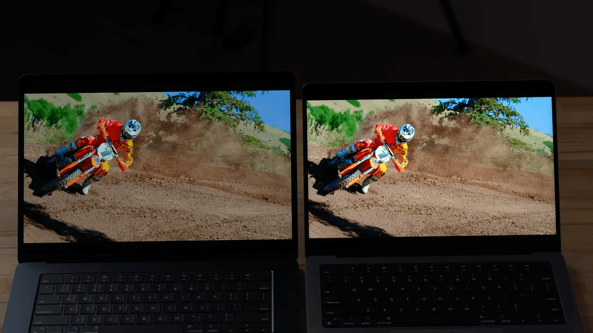

MaxTech 对比 MacBook Air 和 MacBook Pro 的屏幕。左：15 英寸 MacBook Air，右：14 英寸 MacBook Pro（M2 Pro）

MacBook Pro 采用的高保真六扬声器系统从键盘两侧发声，由于整体机身空间更大，能够生成相对 MacBook Air 更加宽广的低音表现，区别还是可以一下子听出来的。这一点，搭配 MacBook Pro 更好的屏幕，在编辑处理 HDR 内容（例如，iPhone 拍摄的 HDR 视频）、欣赏电影的时候，都可以获得更好的体验。

此外，MacBook Pro 还具备更多 I/O 选择，尽管有与 MacBook Air 相同数量的雷雳 / USB4 接口，但还可以直接通过 HDMI 接口外接显示器等外设，并通过 SDXC 卡槽读取 SD 卡中的文件和照片。[后续通过软件更新](https://sspai.com/link?target=https%3A%2F%2Fwww.macrumors.com%2F2024%2F03%2F04%2Fm3-macbook-pro-multi-display-support%2F)，使用 M3 SoC 的 MacBook Pro 也可以和 M3 MacBook Air 一样支持在合盖状态下外接 2 台显示器。

#### 价格

在选择相同 16GB 内存、512GB 硬盘的情况下，15 英寸 MacBook Air 的价格是 13499、14 英寸 MacBook Pro 则是 14499，差价 1000 元。当然，如果都选基本配置，那么 MacBook Air（8GB、256GB）是 10499，在许多电商平台可以做到不到 7500 元的价格；14 英寸 MacBook Pro 则是 12999，电商平台的价格可能在 10000 以内。

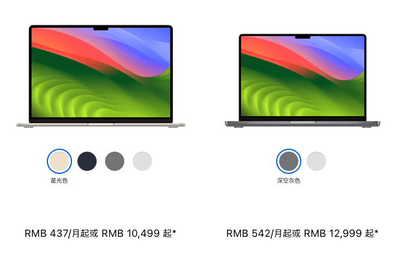

#### 结论

在价格相同的情况下，15 英寸 MacBook Air 可能可以选择到更好的配置、更大的屏幕，以及更加轻薄的机身。这些都是 MacBook Air 相对的优势；但如果你想要的是更好的屏幕性能、芯片、散热，以及更多接口，那么 14 英寸 MacBook Pro 更值得考虑。建议大家不必人云亦云，**在想清楚个人的需求之前，不需要为自己创造出来的「需求」花冤枉钱，作出真正让自己满意的决定。**

### 内存选多大够用

2024 年，我们使用的 app 都在往占用更大内存的趋势发展。至于 Apple 在 2023 年末发布的 MacBook Pro 上还在起售 8GB 内存…… 隔壁 Windows 阵营基本都是 16GB 内存起步的今天，Apple 真的有必要跟上时代了。即使 MacBook 配备更加高效的「统一内存架构」，8GB 内存也仅能支持一般网页浏览、文档处理、影音娱乐等基本需求，如果需要比较认真地修照片、简单剪辑视频等，可能就要动用 SWAP 以弥补内存本身的不足。这里也不是说 SWAP 就不好，只是可能会在处理速度上相对配备了更大内存的机器稍显逊色；以及随着 app 的体积变得愈加臃肿庞大，考虑到现在这个时点购买的设备可能要满足几年后的需求，8GB 就显得有一点捉襟见肘了。8GB 就是 8GB，无论 Apple 的高管如何粉饰太平，它是不可能等于 16GB 的。

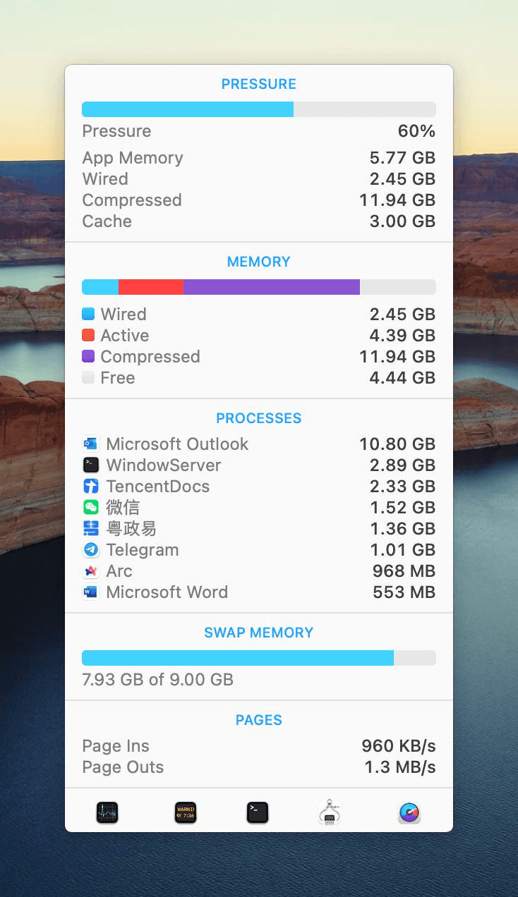

碰上 Outlook 这种内存一泻千里的主儿，真的一点儿办法也没有

因此，在有预算的情况下，我个人会比较建议选择 16GB 或者以上的内存。目前电商平台也已经比较敏锐地捕捉到了大家的需求，许多补贴也不仅仅针对基础机型，16GB 内存的机型也常常参与各类补贴和优惠活动了，可以关注一下。另外，相对官网 1500 元每档的售价，官方翻新商店一般也会以一定折扣出售较高配置的机型，可以说是「挤出」了一些 Apple 在高内存、高硬盘容量上的溢价水分。

### 买不买 AppleCare+

另外一个在购买 Mac 的时候常常需要思考的问题就是是否要购买 AppleCare+ 延保服务。适用于 Mac 的 AppleCare+ 服务随着产品的不同，价格也有所不同。正常情况下，Apple 官方为 Mac 提供的保修期限是整机保修 1 年、主要部件（台式机的主要部件包括：主板、CPU、内存、硬盘驱动器、电源和显示卡；笔记本的主要部件包括：主板、CPU、内存、显示屏、硬盘驱动器、键盘、电源适配器）2 年的质量问题维修。如购买 AppleCare+，则整机均可享受 3 年的保修，另外可以相对较低的价格享受不限次数的意外损坏保护。此外，如果在 3 年内 MacBook 的电池容量下降到原始容量的 80% 以下，可以免费更换电池。

适用于 Mac 的 AppleCare+ 的产品价格如下表格所示：

|     |     |
| --- | --- |
| **产品** | **价格** |
| MacBook Air 13 英寸 (M1) | RMB 1199 |
| MacBook Air 13 英寸 (M2) | RMB 1299 |
| MacBook Air 15 英寸 (M2) | RMB 1499 |
| MacBook Pro 14 英寸 | RMB 2299 |
| MacBook Pro 16 英寸 | RMB 3299 |
| iMac | RMB 1399 |
| Mac mini | RMB 649 |
| Mac Studio | RMB 1149 |
| Mac Pro | RMB 3999 |

可以见到，AppleCare+ 产品的价格与 Mac 型号的基础版售价呈正相关：Mac 的价格越贵，它的 AppleCare+ 也就越贵。个人认为，如果是 MacBook 等比较经常有移动使用需求的产品，或许 AppleCare+ 还是相对值得：由于 Apple 电脑的高度集成性，常常是无法更换某个单独零件，而是需要更换电脑的一整块部分（例如，更换 MacBook 电池其实意味着电脑的整个 C 面都会更换）。因此，AppleCare+ 可以保证你在电脑意外损坏时，能够以较低的价格更换零件，否则保外维修费用动辄上三四千元。

但如果是常年在办公室等固定环境使用的 Mac 台式机，其实就看你是否想要延长至 3 年的保修了：意外损坏的可能性相对来说微乎其微，反倒是出现质量问题的可能性更大些。

## 性能与可移动性：Mac 四分法

如果你还没想好哪款 Mac 更适合自己，那么不妨跟着下面这个思路找到最适合自己的 Mac 电脑。

首先，我们或许可以先想想自己的需求是怎样的。

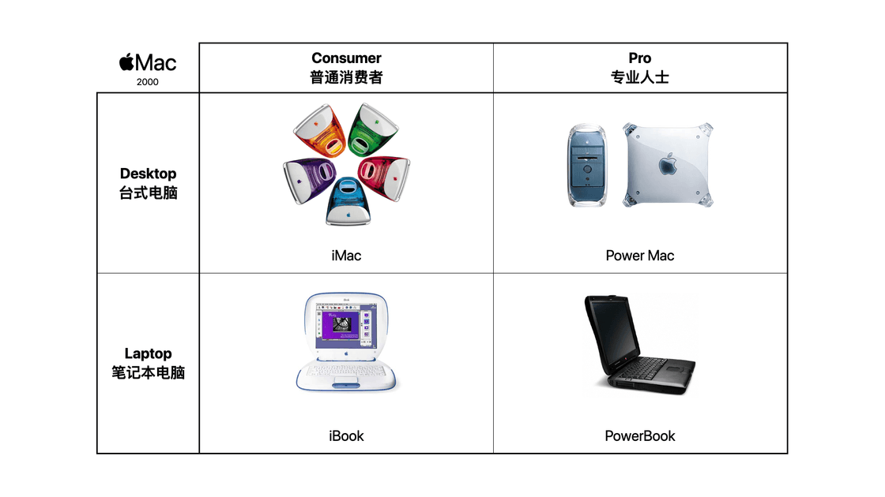

2000 年前后，Mac 的四个象限

首先需要说明的一点是，今天的文章无意评价这样对市场进行分类的功过。我们仅仅是希望把今日的 Mac 产品线放到这样的一个相对清晰的框架中去讨论，讨论对于作为「普通消费者」的大多数人来说，不同 Mac 产品的主要特点有哪些，选择时应该看到的重点是哪些；但考虑到目前 Mac 的产品线纷繁复杂，能够在多大程度上仍然框定在四个象限中，十分值得讨论，因此在选购上也格外需要注意。这也是为什么大家已经要想清楚自己的需求再下手 —— 在目前稠密的 Mac 产品线中，很容易陷入「加点钱就能上 XX」的预算陷阱，最终买到的是在需求上过剩的机器，还为此付出了更多的金钱。

### 「消费级」的「笔记本」：MacBook Air

首先，我们来聊聊当下相当复杂的 MacBook 产品线。「消费级」作为无需过剩性能的代名词，搭配高可移动性的「笔记本」计算机形态，就构成了 MacBook Air 这款 Mac 产品。

2024 年 3 月，Apple 通过新闻稿形式发布了全新配备 M3 芯片的 MacBook Air，并且同时更新了 13 英寸和 15 英寸版本。发布近三年半后，M1 MacBook Air 从官网正式落幕。13 英寸 M2 芯片 MacBook Air 继续在售；不再售卖 15 英寸 M2 芯片 MacBook Air。

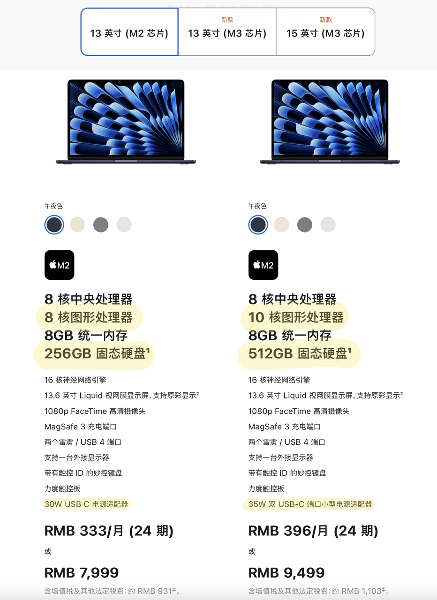

更新后 M2 MacBook Air 的价格

13 英寸和 15 英寸的 M3 MacBook Air，两者在硬件配置上是几乎相同的：相同的 M3 芯片 1、相同的刘海屏幕设计、相同的无风扇、相同的 1080p 高清摄像头、相同的两个 USB-C 接口，相同的最长 18 小时电池续航，不是说 Air 的续航不能打，但这个 18 小时看看就行。

唯一不同的是 15 英寸 MacBook Air 有六扬声器单元。所以我觉得 Apple 在发布 15 英寸 MacBook Air 的时候采用的动效可以说是一点没错：就是拖动角落放大一点而已。

**对比｜13 英寸和 15 英寸 MacBook Air**

|     |     |     |
| --- | --- | --- |
|     | **13 英寸 MacBook Air** | **15 英寸 MacBook Air** |
| 厚度  | 1.13 厘米 | 1.15 厘米 |
| 大小  | 30.41 x 21.50 平方厘米 | 34.04 x 23.76 平方厘米 |
| 重量  | 1.24 千克 | 1.51 千克 |
| 屏幕分辨率 | 2560 x 1664 像素 | 2880 x 1864 像素 |

如今的 MacBook Air 在设计上抛弃了过去几年 Apple 所常用的楔形设计语言，转而向 2021 年推出的 14 和 16 英寸 MacBook Pro 靠近，机器前后的厚度保持一致。但其实，无论是 13 英寸还是 15 英寸 MacBook Air，厚度都比此前 13 英寸 MacBook Air 的最厚处（1.61cm）要薄上不少。因此，可能整机看起来会比较「憨厚」，没有楔形设计显得干练，但实际上还是十分轻薄的。

目前，MacBook Air 内存最高可选配 24GB，可以说在运行一些需要更大内存的 app（比如视频剪辑）时会相对更加得心应手一些。此外，随着新设计而来的全高功能键、1080p 摄像头，以及更长的续航，都是 MacBook Air 的优秀之处。

不过，基础版的 M 系列处理器一直都有 I/O 较为受限的问题，体现在接口较少、扩展能力也较弱。M3 MacBook Air 仅有 2 个雷雳 / USB4 接口，尽管充电可以使用 MagSafe 3 来完成，但毕竟是多一根线缆，出差的时候携带未必方便；而如果使用一个 USB-C 接口充电，就仅仅剩下 1 个接口可以用来接其他设备了。

不过，M3 MacBook Air 终于在外接显示屏这个问题上作出了改进 —— 在合盖的情况下，M3 MacBook Air 可以同时外接两个外置显示器，分辨率最高可以支持 5K@60Hz。

最后还要提一下的是，MacBook Air 的无风扇设计意味着当负载持续，性能下降是无可避免的。在日常简单工作的状态下，MacBook Air 的性能无需担心，运行速度不会出现任何问题；但如果负载持续，例如在玩一些大型游戏、导出分辨率很高的视频、编译大型项目等，MacBook Air 很可能会因为过热而降频。个人体验上，在 15 英寸 MacBook Air 上进行日常首发邮件、写文字、处理电子表格，甚至是轻度修图等操作，是感受不到任何区别；如果玩一些游戏（例如通过 PlayCover 运行《崩坏：星穹铁道》时），时间一长会出现比较明显的帧数下降。

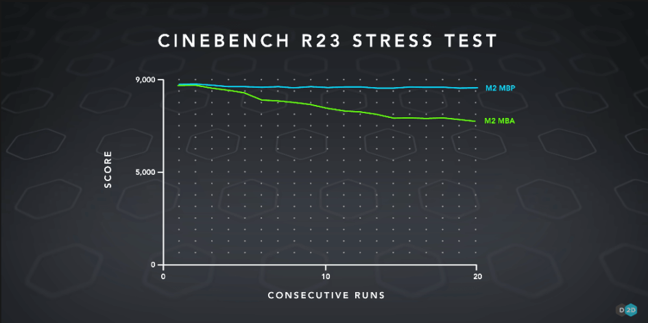

Dave2D 对 MacBook Air 的 Cinebench R23 压力测试

从定位和售价来说，13 英寸 MacBook Air 是比较典型的「超级本」，M2 版本起售价 7999 元、M3 版本起售价 8999 元。

但仍然在 2024 年坚守了 8GB 内存 / 256GB SSD 这个组合，明显有些跟不上时代了；更况且基础存储版本 2 由于采用了单 NAND 芯片，内置硬盘的读写速度也会显著慢于大容量的机型，理论上日常使用应该不受影响，不过还是会有点膈应人的。

13 英寸 M3 MacBook Air 的定价策略有一定的变化，8+256 版本升级 10 核 GPU 的 M3 处理器的费用来到了 750 元（M2 时代是 1000 元）；而且如果选择了 16G 以上内存，或 512G 以上 SSD，则处理器亦会自动升级到 10 核 GPU 版本，无需额外付费；相比 M2 时代，同配置价格降低 1000 元。

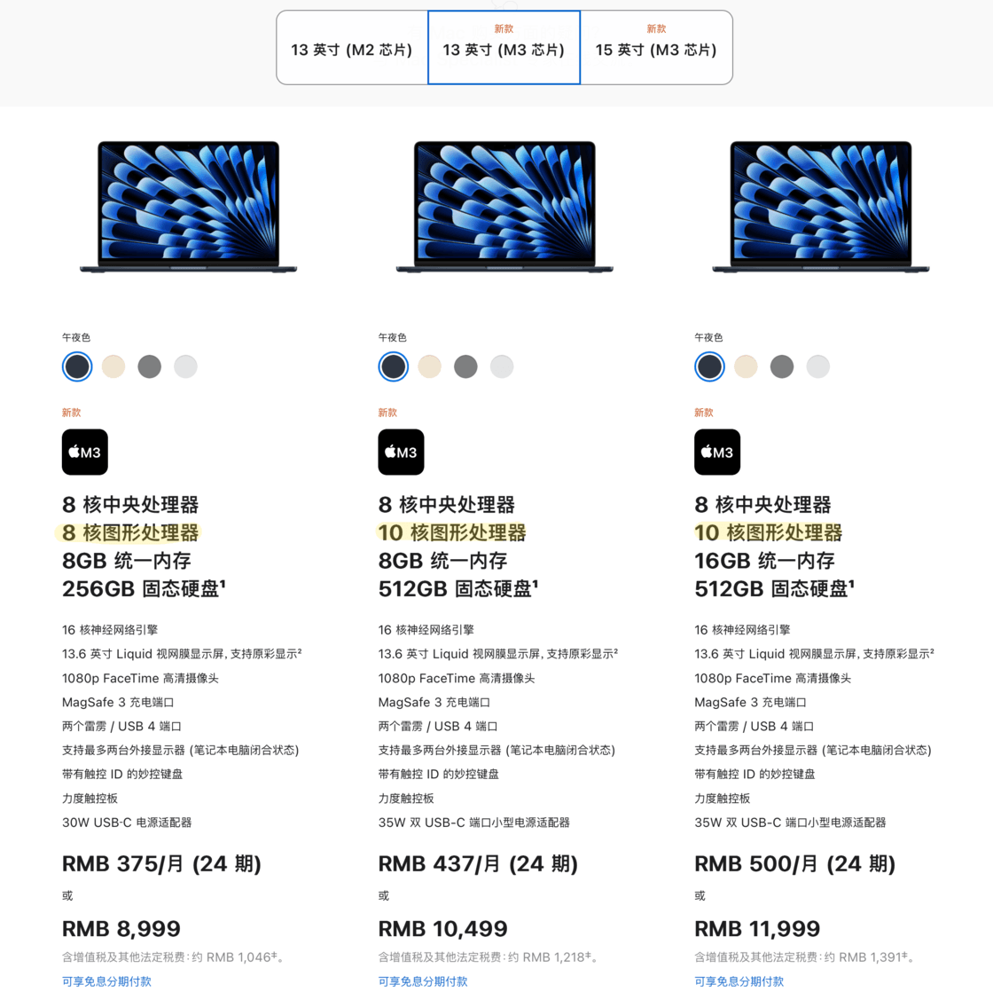

15 英寸 MacBook Air 则瞄准了「大屏」这个需求，算得上是为数不多的 15 英寸轻薄本。不过，许多大屏轻薄本的机身不稳定问题在 15 英寸 MacBook Air 并不存在，打字的时候屏幕不会抖动、也可以单手开合屏幕；稍稍超过 3 斤的重量让它也没有那么不方便携带，整体上还是能够守得住「Air」这个底线的。15 英寸 MacBook Air 的起售价是 10499 元，搭配「满血版」M3、8GB 内存和 256GB SSD。除了更大的屏幕，15 英寸型号还配置了 6 个扬声器，因此低音听起来相对 13 英寸更加震撼。

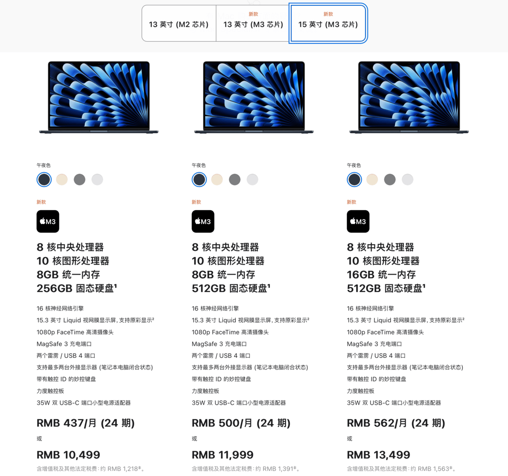

总结一下，MacBook Air 面向的就是无需过剩性能的「普通消费者」，例如学生、文字工作者、在远程机器上写代码的程序员等，对移动办公有一定需求、需要比较长的续航能力，但无需持续高性能输出的用户。如果喜欢大屏，可以考虑 15 英寸，显示得下更多内容的同时，又可以收获更好的音频质量；如果更看重便携，13 英寸也是很好的选择，省下的钱还可以升级更好的配置。

### 「专业级」的「笔记本」：MacBook Pro

如果需要更多的性能、但同时兼顾便携，那就来到了「专业级」的「笔记本」电脑领域。MacBook Pro 既然挂上了「Pro」的名字，那么自然是要和「专业人士」打交道的。刚刚过去的 2023 年 10 月 31 日，Apple 一口气推出了 3 款芯片：M3、M3 Pro 和 M3 Max；它们都装载在了 MacBook Pro 上。考虑到 M3 后面也会出现在 MacBook Air 中，在这里讨论 MacBook Pro，可能就不得不先把配备 M3 的 MacBook Pro 单独拿出来说一说。

#### 配备 M3 芯片的 14 英寸 MacBook Pro

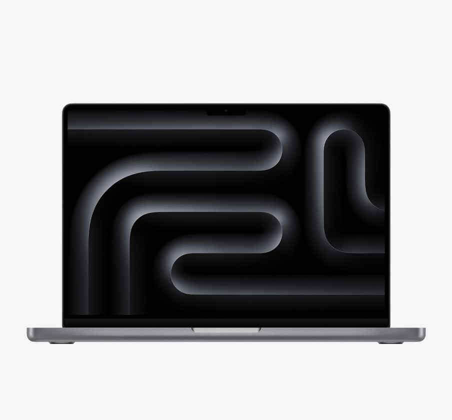

这款产品，可以说是之前 13 英寸 MacBook Pro 的「精神续作」：更换成了和 2021 年 M1 Pro MacBook Pro 14 英寸同款的设计，也顺便让触控栏成为了历史。MacBook Pro 14 英寸现在配备与之前高端线相同的 14 英寸视网膜 XDR 显示屏，可以获得极致的动态范围、1600nit 峰值亮度和 1000nit 持续亮度，以及 1080p 高清摄像头、HDMI 接口、SDXC 卡槽，以及高保真六扬声器系统，颇有些成本降低后技术下放的意味。M3 的芯片规格较低，也意味着它更加节能，可实现最长 15 个小时的无线上网，比「大哥」们整整多出 3 个小时，和 M2 MacBook Air 相同。因此，新的 MacBook Pro 14 英寸（M3）不仅屏幕获得了巨大升级，I/O 接口、摄像头品质、扬声器音质都得到了较大的提升。

但与此同时，M3 14 英寸 MacBook Pro 仅有 2 个雷雳 / USB4 接口（注意不是雷雳 4），和 M2 一样仅支持外接 1 台最高 6K 的显示器，同时内存最大也只能选到 24GB。另外，Apple 总是希望能够让人「一眼认出」新品，M3 MacBook Pro 14 英寸的配色保留了原本的深空灰色和银色，而 M3 Pro、M3 Max 机型则有全新的深空黑色。

配备 M3 芯片的 14 英寸 MacBook Pro 存在的意义，就是能够通过更好的散热，发挥 M3 芯片的全部实力。本来这一任务是由旧模具的 MacBook Pro 来承担（M1 和 M2 芯片的 13 英寸 MacBook Pro），但如今 Apple 把更高端产品的设计和功能下放，完成了设计语言的统一，也让 MacBook Pro 14 英寸（M3）有了更多值得考虑的点。尤其是，如果拿它和 15 英寸 MacBook Air 来比较，有时候真的觉得各有所长。在售价方面，MacBook Pro 14 英寸（M3）起售价为 12999 元，搭配 8GB 内存、512GB 硬盘空间。

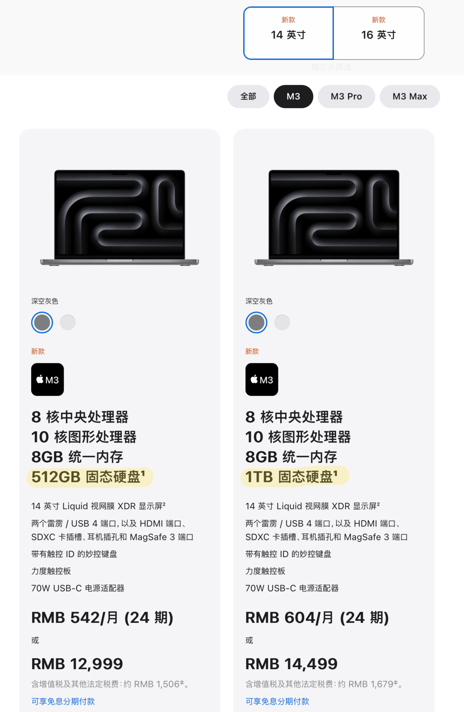

MacBook Pro 作为面向「专业人士」的笔记本电脑，以 M3 为起点似乎「低」了一些。如果硬要把 MacBook Pro 放入我们的四个象限，似乎配备 M3 的 MacBook Pro 更像是面向「普通消费者」的相对高端的机型。Apple 似乎也意识到这一点，今年推出的 M3 14 英寸 MacBook Pro 在内存方面仍然是 8GB 起步，其实已经非常明确地指出它的产品定位；和一众动辄 18GB 内存的「大哥」们展示在同一个页面，总归是有些错配感。

#### 配备 M3 Pro 和 M3 Max 芯片的 14 和 16 英寸 MacBook Pro

如果真正需要探入「专业级笔电」的领域，M3 芯片的规格以及外设拓展能力，可能还有些力不从心。因此，M3 Pro 和 M3 Max 才是 Apple 真正为需要更多性能的专业人士所设计的芯片。配备了这两款芯片的 MacBook Pro 14 英寸和 16 英寸，或许才真的「Pro」如其名。这两款 MacBook Pro 也配备视网膜 XDR 先视频、1080p 高清摄像头、HDMI 接口、SDXC 卡槽，以及高保真六扬声器系统。

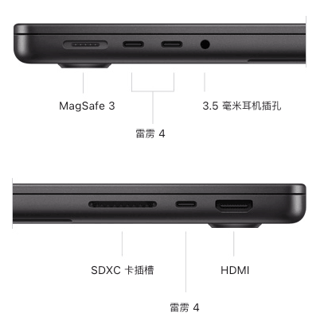

另外，M3 Pro 或者 M3 Max 的 MacBook Pro 都配有 3 个雷雳 4 接口（相对于基础的 M3 机型多了一个 USB-C 的接口）。在外接显示器方面，M3 Pro 机型支持外接最多 2 台显示器，M3 Max 机型则支持外接最多 4 台显示器，分辨率最高可达 8K@60Hz（均只支持 1 台，且需要通过 HDMI 接口连接）。更值得一提的是，M3 Max 相对 M2 Max 得到了较为大幅度的提升。M3 Max 可选配最高 16 核（12 大 4 小）的 CPU 以及 40 核 GPU，相对于 M2 Max 的 12 核（8 大 4 小）CPU，在核心数上有着显著的优势，因此在一些需要 CPU 多核的任务中表现比 M2 Max 提升了不少。

与之相对，M3 Pro 则显得有些「规格缩水」—— 的确，相对 M2 Pro 的「8 大核、4 小核」的 CPU 设计，M3 Pro 变成了「6 大核、6 小核」（如果你选的是基础版本，则是 5 大核、6 小核）。因此，在多线程性能方面，表现相对 M2 Pro 的提升可能微乎其微；此外，M3 Pro 的内存带宽也从 M2 Pro 的 200GB/s 减少到 150GB/s，这意味着在处理一些内存速度敏感项目的时候，可能影响到项目执行的时间。

此外，即使是强如 M3 Max，由于采用了不同的封装策略，内存选配似乎也有些「混乱」：基础版（14 核 CPU）仅支持 36GB 或者 96GB 的内存选项；如果需要 48GB、64GB 或者 128GB 的内存，就不得不先选择 16 核 CPU 的 M3 Max 了。

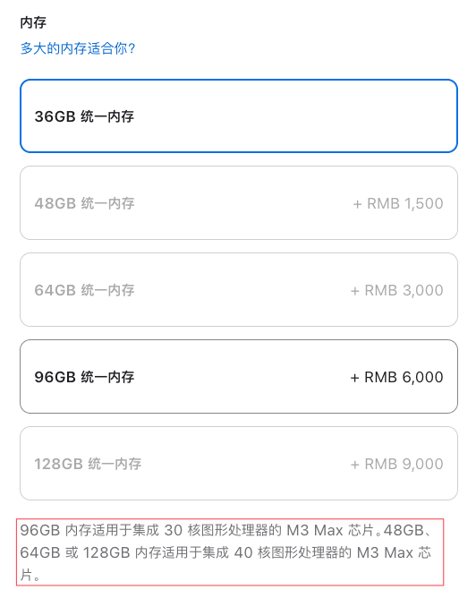

当然，选配更高规格的芯片也意味着更高的价格。M3 Pro 芯片的 14 英寸 MacBook Pro 起售价格为 16999 元，搭配 11 核 CPU + 14 核 GPU 的芯片、18GB 内存，以及 512GB 的硬盘；对应的 16 英寸 MacBook Pro 起售价格则为 19999 元。14 英寸 MacBook Pro 也可以选配 M3 Max 芯片，但如果你的性能需求已经达到 M3 Max 的水平，那么或许也值得考虑散热更好的 16 英寸 MacBook Pro。

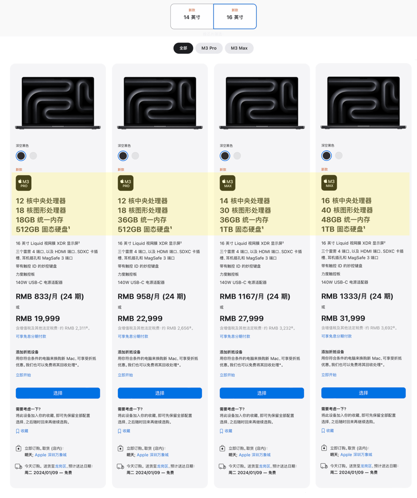

总结一下，MacBook Pro 品类，相对 MacBook Air 来说，可以获得更强的性能以及更好的持续性能释放。尽管 M3 芯片出现在重新设计的 14 英寸 MacBook Pro 上有些让人出乎意料，但 MacBook Pro 作为「专业人士」笔电的定位还是大体上成立。在 2024 年初的这个时间，如果你信奉「买新不买旧」，那么 MacBook Pro 也是你唯一能够买得到的搭载最新 M3 系列处理器的 MacBook。

### 「消费级」的「台式机」：iMac 和 Mac mini

我们来聊聊如今 Mac 产品线中属于第一象限 —— 「消费级」的「台式机」。「消费级」意味着这些 Mac 更适合普通消费者：它们在性能上比不上「大哥」们，尽管在处理日常事务的时候十分高速快捷（例如收发邮件、上网浏览、影音娱乐），但是在面对一些专业软件时可能会稍显「力不从心」。「台式机」则意味着它们的可移动性相对较弱，更适合在办公室等固定的场景使用，如果要天天带着出门，可能会稍显怪异。

在如今的 Mac 产品线中，「普通消费者」定位的「台式电脑」有两款：iMac 和 Mac mini。

#### iMac

24 英寸 iMac 的外观给人的印象可谓是十分深刻，可以说是当下 Mac 产品线中颜色最具个性的产品了，不仅有 7 种颜色可选，还搭配了相同色系的妙控鼠标、妙控键盘、编织电源线缆等等配件，放在书桌上看起来应该相当赏心悦目。可以说，目前的 Mac 产品线中没有其他任何一款是能够在视觉上给人以如此强劲的冲击力的。多彩的 iMac 不知是不是在一定程度上「复兴」了 iMac G3 时代的色彩 ——Apple 很想让 iMac 成为家庭办公室的「主角」，在展示 iMac 的时候也丝毫不掩饰 iMac 在家庭办公室中的明亮色彩。

iMac 配备了一块 24 英寸的 4.5K Retina 屏幕，最高亮度 500nit，显示清晰锐利、色彩也是赏心悦目；此外也配置了六扬声器系统，刚推出时 Apple 提到是「Mac 有史以来最好的扬声器系统」，支持空间音频，带来逼真的视听体验。iMac 也是第一款配备了 1080p 摄像头的 Mac 电脑，加上 Apple 芯片的图像处理器，也可以带来更好的视频通话体验。iMac 基础款配备 8GB 内存、256GB 固态硬盘，采用的是「青春版」的 M3 芯片（8 核 CPU+8 核 GPU），并且这个基础款只有 4 种颜色、配备的是没有触控 ID 的妙控键盘，默认也没有以太网接口，甚至颜色也不全，10499 元起售。

如果你想要更好一点的 M3 芯片（8 核 CPU + 10 核 GPU），或者想要黄色、橙色或者紫色的 iMac，那么价格就会来到至少 12499 元（8GB 内存 + 256GB 固态硬盘）；但与此同时，标配 4 个 USB-C 接口（其中 2 个是雷雳 / USB4 接口）、配备触控 ID 的妙控键盘，以及千兆以太网口（网口在电源适配器上）。

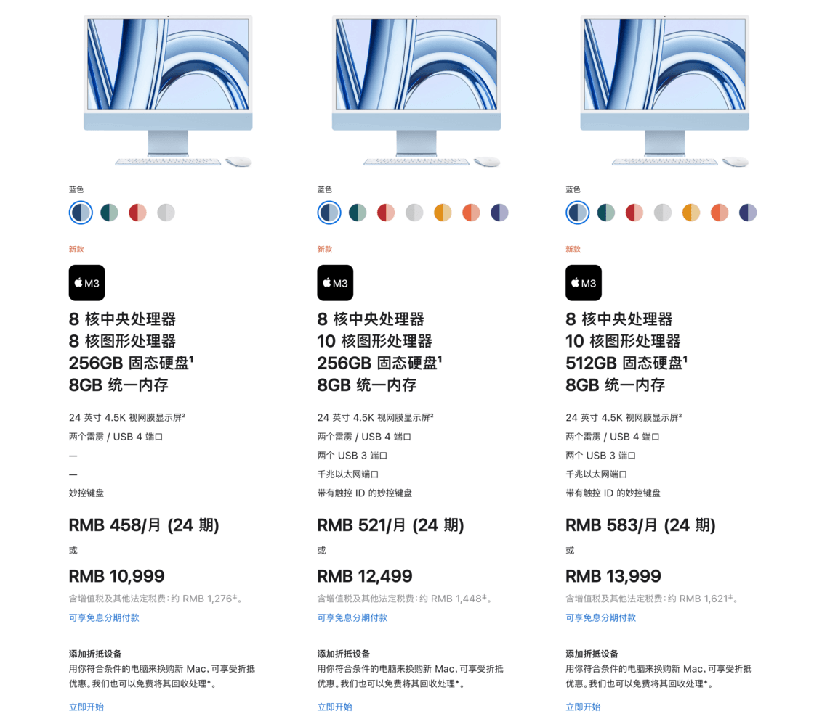

iMac 目前价格最低的三款 SKU

值得注意的是，目前官网翻新商店在售的还有配备 M1 芯片的 24 英寸 iMac，基本覆盖了各种颜色和配置。如果只是希望在家里增添一抹亮色，而不太在意 CPU 性能，或许还值得考虑。以下配置和价格，可供参考：

**对比｜翻新 M1 iMac 和 M3 iMac 的价格**

|     |     |     |
| --- | --- | --- |
| **内存与硬盘配置** | **翻新 M1 iMac (8cCPU + 8cGPU)** | **M3 iMac** **(8cCPU + 10cGPU)** |
| 8G / 256G | ¥ 9769 | ¥ 12499 |
| 16G / 256G | ¥ 11049 | ¥ 13999 |
| 16G / 512G | ¥ 12319 | ¥ 15499 |

总之，iMac 十分适合家用电脑这一场景 —— 它能够在一定程度上帮助家庭用户摆脱复杂的外部设备设置，只需要一根电源线就可以用了。至于配置选择的问题，在预算有限的情况下，个人认为 8 核 GPU M3 芯片的版本其实已经可以应付绝大部分普通消费者使用电脑的场景，从文档撰写、收发邮件到影音娱乐、轻度游戏 —— 如果你需要使用有线网络，可以考虑花 200 块钱升级一个以太网口。

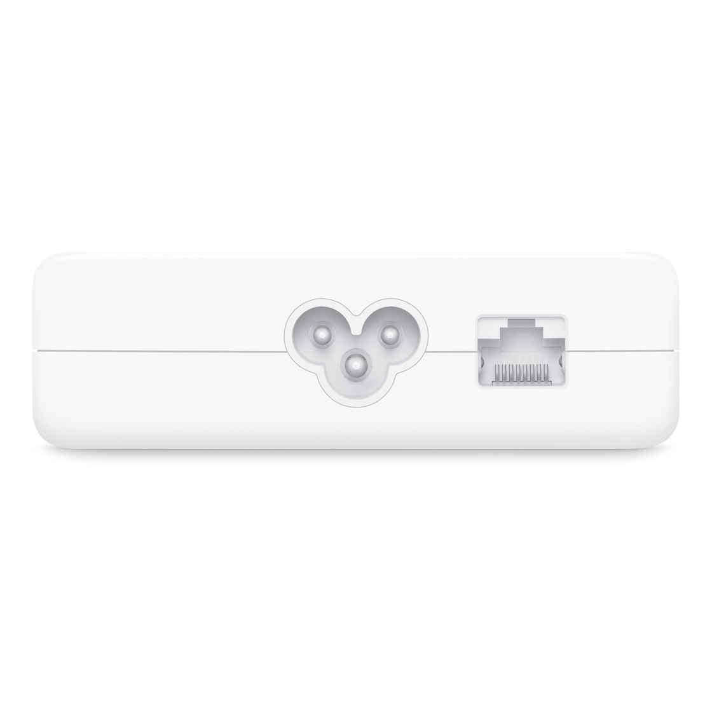

iMac 的以太网接口附带在电源适配器上

#### Mac mini

Mac mini 刚推出的时候可谓是「技惊四座」：在如此小的空间中藏下了整个电脑所需要的零件，并且能够提供相当强劲的性能。不过，这么多年过去，Mac mini 的设计方式并没有任何改变，一套模具用 10 年已经不是梦（上次 Mac mini 的模具更新是 2014 年）。Mac mini 主打「外设自配」（Bring your own device, BYOD） —— 丰富的外设扩展接口让用户可以最大程度发挥自己现有的设备资源，低廉的价格则是体验 Mac 成本最低的方式。这可能也是为什么 Mac mini 成为了很多人的第一台 Mac。

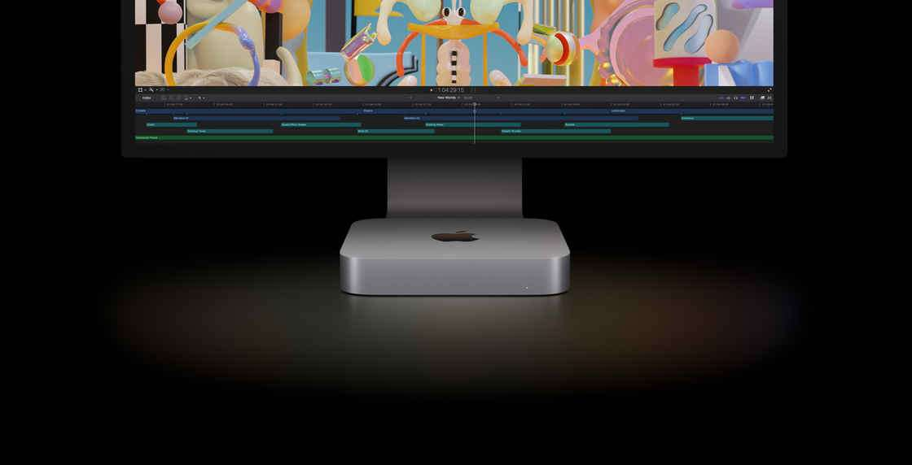

Mac mini 能够提供 2 个雷雳 / USB4 接口、2 个 USB 3 的 USB-A 接口、1 个千兆以太网口、1 个 HDMI 接口，以及 1 个 3.5mm 的音频接口，可以满足多种设备的外接需求，还有一个可以「听个响」的扬声器（但没有内置麦克风）。目前，Mac mini 的起售配置为 M2（8 核 CPU + 10 核 GPU）芯片、8GB 内存、256GB 硬盘，售价为 4499 元。

不过，有趣的是，Apple 给采用 M2 系列芯片的 Mac mini 还加了 M2 Pro 芯片作为配置选项。相比 M2，M2 Pro 有 6 个性能核心（M2 是 4 个）、最高可以选配到 32GB 的内存（M2 是 24GB），最多有 19 个 GPU 核心（M2 是 10 个）。配备 M2 Pro 芯片的 Mac mini 自然可获得更强的性能，并且还多出了 2 个雷雳接口。配备 M2 Pro 芯片的 Mac mini 起售价为 9999 元，搭配 16GB 内存和 512GB 硬盘，这个价格跨度尽管综合了芯片、内存和硬盘容量，但仍然是有点让人吃不消。

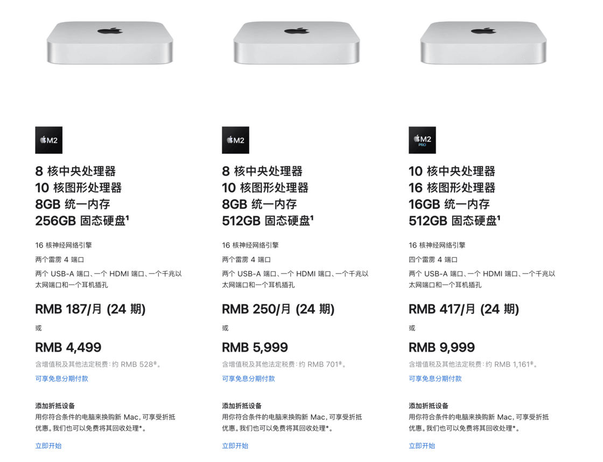

如果「配平」内存和硬盘容量配置，给 M2 后面加一个 Pro，要花 2500 元

其实，考虑到 Mac mini 本身作为面向「普通消费者」的台式电脑产品的定位，M2 Pro 芯片加入 Mac mini 其实模糊了「普通消费者」和「专业人士」之间的边界，在我个人来看，更像是 Apple 的一次「试水」之作。一方面，Apple 芯片优秀的能耗表现可以让 Apple 在紧凑机身中置入性能更好的芯片，无需担心散热对芯片实际性能表现的影响；另一方面，或许也机械地填补了 Mac 台式电脑出现的价格区间空白，在相对廉价的 Mac mini 和相对高价的 Mac Studio 之间占领新的价格阵地。不过，无论原因如何，这款 Mac mini 都给我一种「不伦不类」的陌生感。

因此，从「普通消费者」的角度考虑，M2 Pro 实属不必。如果你此前从未用过 Mac，Mac mini 可能是入门成本最低的选择；考虑到所有的 Mac mini 机型都不附带键盘、鼠标等输入设备，如果你已经有一套显示器、鼠标、键盘等外设，那么 Mac mini 也可以让你迅速开始工作。Mac mini 更适合对电脑有一定的理解、需要连接多种外部设备的人；它无法做到像 iMac 一样开箱即用，但却可以无缝融入你现有的外设中。

目前，翻新商店也已经上架配备 M2 的 Mac mini，8GB 内存、256GB 硬盘的售价为 3819 元；配备 M2 Pro 芯片的翻新 Mac mini 售价则为 8499 元。同样有趣的是，翻新商店还有 Intel 版本的 Mac mini 可供选择 —— 这算得上是 Apple 官网上最后的 Intel Mac 了（Intel 版本的 Mac mini 还可以自行升级内存）。

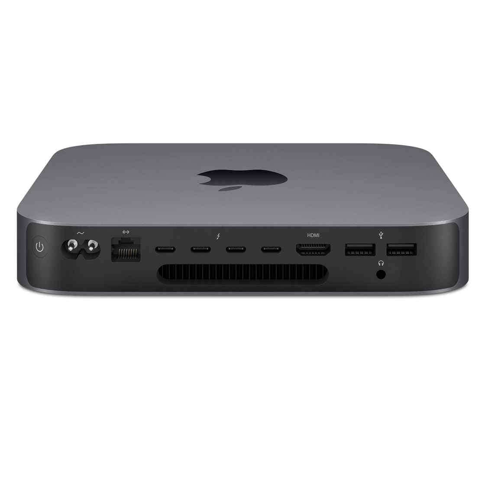

配备 3.6GHz 四核 Intel Core i5 的 Mac mini（最初发布于 2018 年 10 月）

总结一下，iMac 和 Mac mini 作为消费级的台式电脑产品，可以说是为不同人群提供了比较多样的台式电脑选择。iMac 更加适合成为「家里的第一台电脑」，它能够帮助人们完成日常工作的同时，其装饰属性亦不可忽略；Mac mini 则相对来说更为灵活，可以连接更多外部设备、可以被放置在家中或者办公室的更多位置，并可选配 M2 Pro 芯片来做一些专业级别的工作。

### 「专业级」的「台式机」：Mac Studio 和 Mac Pro

专业用户常常需要使用计算机完成更复杂的事情，例如编写大型的代码项目、完成多个图像的渲染、或者进行 4K 乃至 8K 的视频剪辑 —— 一般来说总是有一个特定的场景需要非常高的性能。这时候就不得不需要更强的硬件配置、更多的扩展性，以及看起来相对更加不同的形态才能实现如此高的性能。台式机仍然意味着可移动性低，更适合在办公室和工作室这样的固定空间中使用。

在 Mac 产品线中，「专业级」的「台式机」是 Mac Studio 和 Mac Pro。

#### Mac Studio

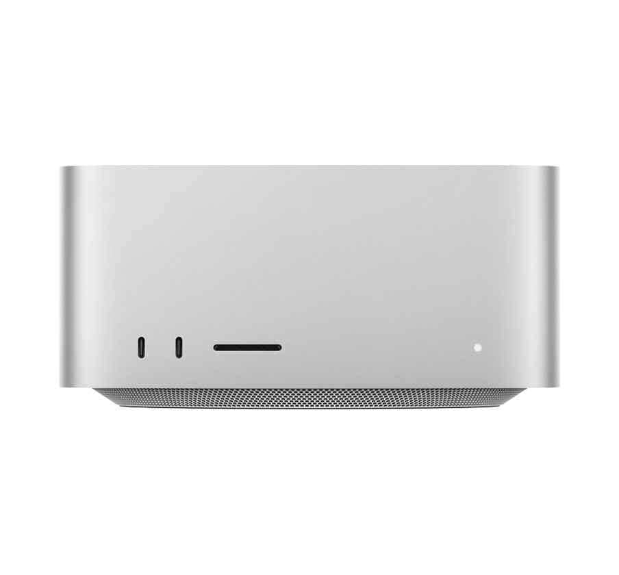

Mac Studio 可以说「起源于」Mac mini，它和 Mac mini 的占地面积相同，但配备了更好的散热，因此体积更大、也能够压得住更加强大的 Apple 芯片。Mac Studio 可配备 12 核 CPU、最高 38 核 GPU 的 M2 Max，内存最高 96GB；也可以选择配置由 2 颗 M2 Max 通过 Ultra Fusion 技术连接而成的 M2 Ultra，上面所有的参数都翻倍。M2 Max 和 M2 Ultra 是当前 Apple M2 系列芯片所能提供的最高级别的性能，它们在 Mac Studio 经过重新设计的散热系统下可以获得最大程度的释放，以支持专业级应用程序、大型游戏等的运行。

Mac Studio 也以紧凑的机身提供了较多的 I/O，机身前方提供 2 个 USB-C 端口（配备 M2 Ultra 的机型支持雷雳 4）及一个 SDXC 卡槽，背面则提供 4 个雷雳 4 端口、1 个万兆网口、两个 USB-A 端口、一个 HDMI 端口，以及 1 个 3.5mm 耳机插孔。不过，作为一台「专业级」机器，Mac Studio 无法进行内置内存或硬盘的升级、不支持外接 eGPU，这必然会影响到一部分专业工作流。

在外接显示器支持方面，M2 Ultra 机型可以支持外接多达 8 台 4K@60Hz 显示器、M2 Max 机型则支持外接多达 5 台显示器（4 台 6K@60Hz + 1 台 4K@60Hz）。Mac Studio 的起售配置，配备 12 核 CPU、30 核 GPU 的 M2 Max 机型，有 32GB 内存和 512GB 硬盘，售价为 16499 元；M2 Ultra 机型的参数均是 M2 Max 机型的两倍，起售价则是 32999 元。

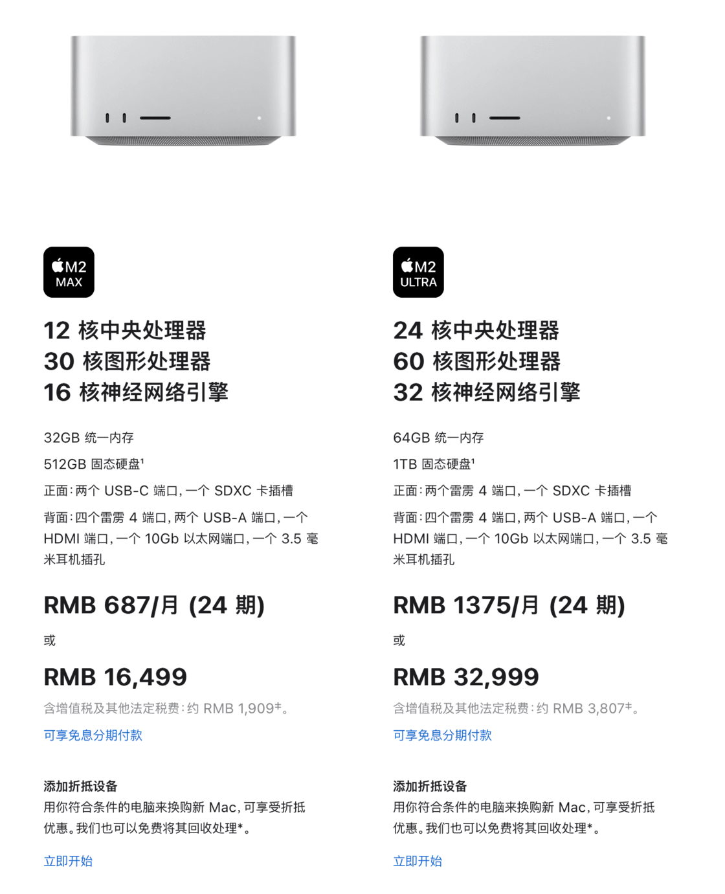

#### Mac Pro

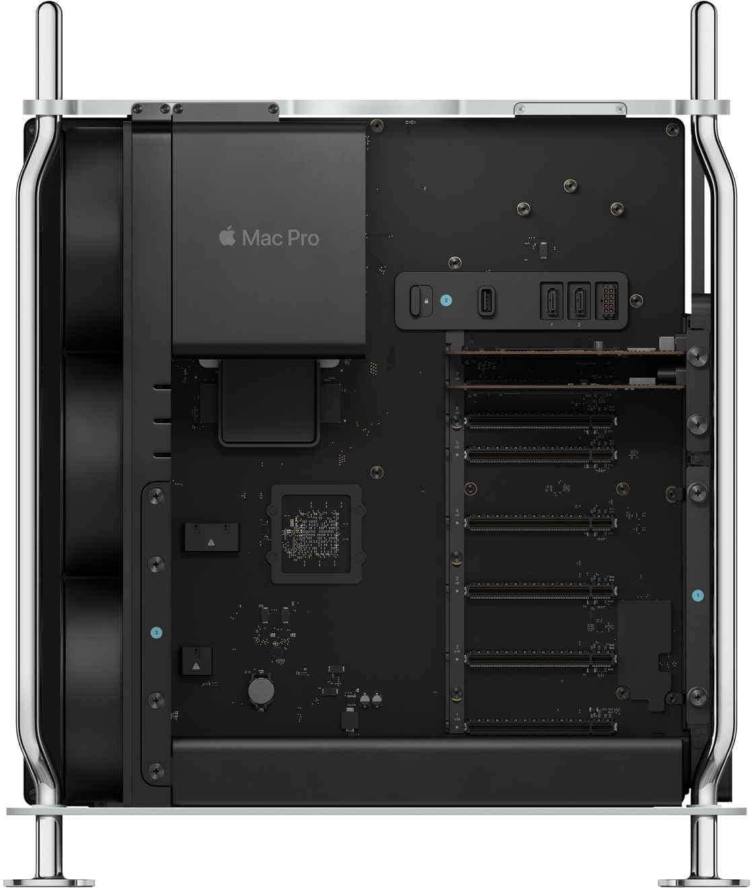

目前的 Mac Pro 则是传承了 2019 年的「刨丝器」机箱设计，可以方便添加更多 PCI Express 卡以支持更多计算机外围设备，比如高性能硬盘。与 Mac Studio 不同的是，Mac Pro 可以通过内部的 2 个 SATA 端口和 7 个 PCIe 插槽（其中六个是第四代 PCIe）来扩展音视频 I/O（当然了，暂时还是不可以外接显卡的）、网络设备，或者是存储设备等等。

Mac Pro 默认配备的 M2 Ultra 芯片是 Mac 电脑目前最为强劲的 CPU，并有塔式和机架式两种形态可以选择，以适应不同的场景。我们无法否认这是一台很快的电脑；但它目前尚无法使用 PCIe 显卡、无法升级内置的统一内存，实际上更像是一个扩大版的 Mac Studio，但比 Mac Studio 要贵上 20000 多元。Mac Pro 默认配置 M2 Ultra 芯片（24 核 CPU、60 核 GPU，64GB 内存、1TB 硬盘），起售价格为 55999 元。

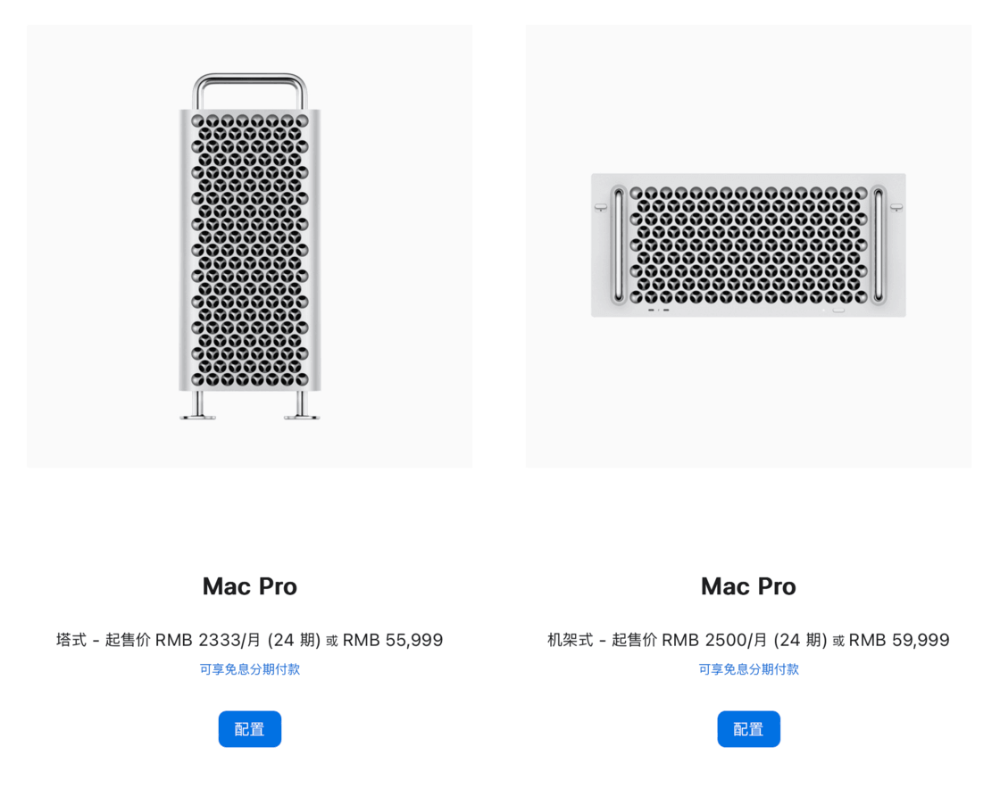

Mac Studio 和 Mac Pro 作为面向「专业人士」的产品，普通的消费者似乎没有特别考虑的必要。如果你的工作需要更大的内存（M2、M3 均仅支持最大 24GB 的内存）、更强的 CPU 多核性能（在单核性能方面，这些芯片的差距不大）和 GPU 性能（与核心数直接相关），性能相对更高的 Mac Studio 和 Mac Pro 才值得纳入考虑。

### 小结：象限撕裂的现实

在 2024 年初，乔布斯的四个象限感觉有一点被「撕裂」，又有一点「拥挤」—— 专业人士和普通消费者之间的界限正在模糊。在台式电脑和笔记本电脑领域，似乎分别由 Mac mini 和 MacBook Pro 来担当「跨界者」。因此，似乎如今四象限图应该这么画了：

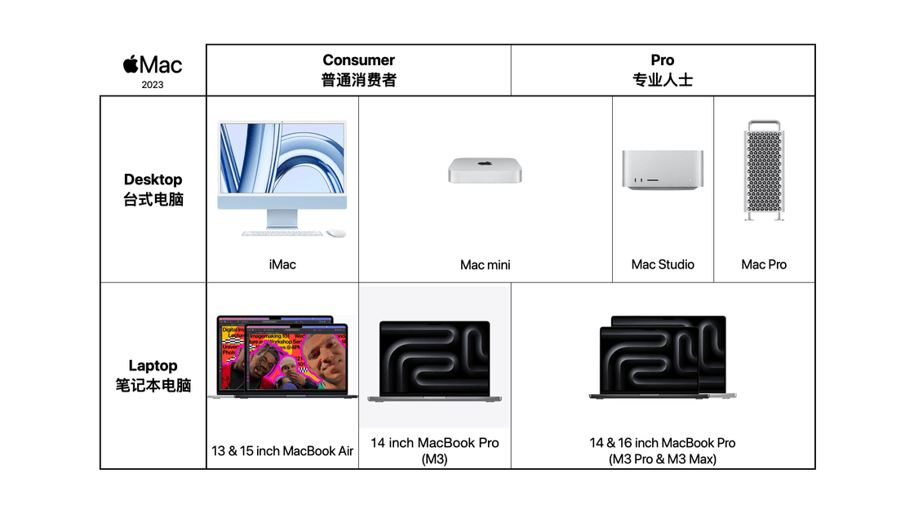

还能看得出「四个象限」吗？

如今的 Apple 是否还是那个帮用户做选择的 Apple？是也不是。有些时候我会觉得 Apple 还是那个霸道总裁，总有一些东西普通用户是永远也动不得，比如祖传的 8GB 内存问题；但似乎如今的 Apple 也更加务实，依靠多样化的产品去赢得不同需求的用户、在细分的领域中去和其他品牌竞争。本来并没有大屏轻薄的 MacBook，但 Apple 推出了 15 英寸 MacBook Air，即使它的定位和 14 英寸 MacBook Pro 有点难舍难分；本来也没有面向专业人士的小型主机，但 Mac Studio 的推出改变了这个局面 …… 一方面，Mac 产品线欣欣向荣；另一方面，用户也是常常在参数之海中苦苦挣扎。

## 如何购买更实惠

讲完了机型参数和主要可能出现纠结的要点，接下来讲讲在何处购买 Mac 可能会相对实惠。相对官方网站价格，以下三种渠道购买，在价格上都会相对便宜，但其优点和缺点都还算比较突出。最终在哪里购买，可能还要取决你要购买的机型，以及具体的时机。

### 教育商店

-   👍 推荐理由：官方网站，保证全新正品；保证 14 天无理由退货；价格相对正价有优势；暑期返校季有赠品；可以按单配置
-   👎 限制：需要学生或教育工作者身份验证；仅限 3 期分期付款

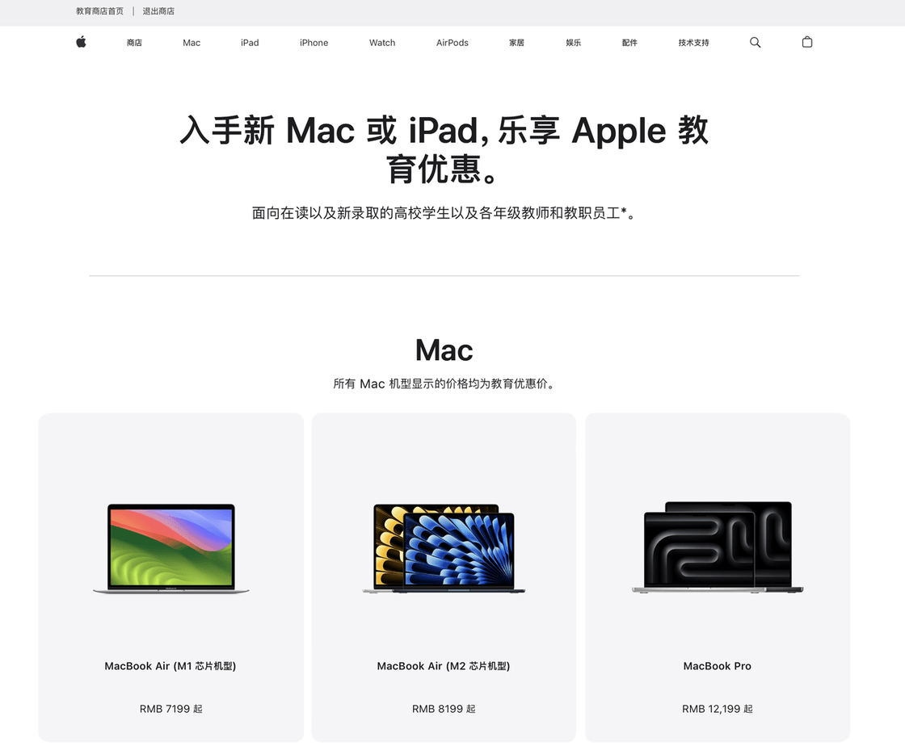

由于 [教育商店](https://www.apple.com.cn/cn-educators/store) 是 Apple Store 在线商店的一部分，所以从 Apple 购买的相关政策都适用于教育商店，尤其是 Mac 可以以一定的优惠价格按单配置，满足个人对于 Mac 电脑细节配置的需要（例如，配置内存、硬盘容量、充电器、键盘布局、预装 Pro Apps 等）。在读以及新录取的高校学生以及各年级教师和教职员工均有购买资格，现通过支付宝进行认证。

价格方面，MacBook Air、MacBook Pro、iMac 和 Mac mini 均在基础售价之上便宜 800 元，按单配置的升级价格也在原价上打 9 折；Mac Studio 和 Mac Pro 则相对原价优惠数额更大一些。这些价格也支持 3 期免息分期，但相对正价购买的 24 期免息分期，则没有那么实惠了。

Apple 每年在暑期的返校季（在中国内地一般是 7-9 月）会开启教育商店的促销，购买 Mac 赠送 AirPods，也是很不错的优惠。例如，2023 年返校季优惠是赠送 AirPods（第三代）。

### 翻新商店

-   👍 推荐理由：官方网站，保证翻新品质；保证 14 天无理由退货；价格相对正价在 85 折左右，比教育优惠更便宜；可以 24 期分期付款
-   👎 限制：无法第一时间购买最新的 Mac；无法按单进行配置，仅能购买已经搭配好的组合；配置是否有货看运气

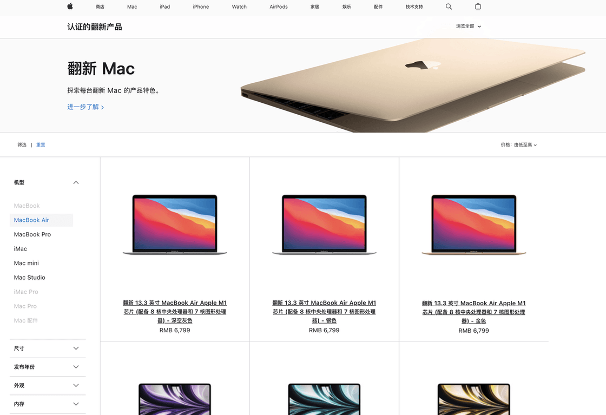

Apple 官方认证翻新商店可以购买许多不同的 Mac 机型，除了最新款之外，还有不少是以往的机型。例如 Intel 处理器的 Mac mini，或者 M2 Pro 处理器的 MacBook Pro。因为翻新商品实际上是二手机器（一般来源据说是在官方商店 购买后 14 天内退货的机器），所以显然 Apple 无法直接在这里上架最新商品，不过一般来说最新型号在 3-4 个月后就会上架翻新商店了。

翻新商店中的 Mac 价格一般都是原价的 85 折左右。例如，15 英寸 MacBook Air（M2）24GB 内存 + 1T 硬盘的原价是 16499 元，但在翻新商店是 13999 元，省下来的钱可以买一个 AppleCare+ 延保服务（1599 元）还富余一些。另外，翻新商店也支持 24 期免息分期，相对来说也是另一种形式的优惠了。

不过，翻新商店中每种配置的存货数量就不那么一定：有时候可能遇到某些配置的型号没有货的情况，这种时候除了等待或者购买其他型号，也没什么办法。而且，包装盒内搭配的其他配件，以及电脑的键盘布局等都是默认的。例如，15 英寸 MacBook Air 正价购买时可以选择 35W 充电器或者 70W 充电器；但是从翻新商店购买则只有 35W 充电器提供。

### 渠道购买

👍 推荐理由：价格可以做到比官网低很多，包括比翻新商店和教育优惠低；一般会参与平台的活动，在大型购物节（比如 618）可能会更优惠

👎 限制：一般没有比较高配置的机型，或者高配机型价格优势不明显；拆封后一般不支持无理由退换；是否可以分期付款看平台政策

如果从第三方购买 Mac，那么价格可能比上面教育商店和翻新商店都更低。例如，经常可以见到百亿补贴的 MacBook Air 价格比原价低三成左右（M1 MacBook Air 的基础款近期经常见到不到 5000 元的价格，还是相当震撼的）。

但于此同时，价格优势可能也就是唯一优势了 —— 相对官方来说，我个人会比较不喜欢拆封后不能无理由退换这个限制，以及无法分期付款。不过，见仁见智 —— 其实省下来的钱可以购买 AppleCare+、配件等等，想想也是一种很划算的选择。

## 还想了解更多？

如果看完这篇文章，你还需要更进一步了解有关 Mac 电脑的更多信息，可以看看下面的几个资源：

-   [MacRumors Buyer's Guide](https://sspai.com/link?target=https%3A%2F%2Fbuyersguide.macrumors.com%2F%23mac) —— MacRumors 网站上的这个栏目跟踪 Apple 产品的发布时间，以及每次产品更新所经过的平均天数，以此给出是否应该此时购买的建议。可以在这里查看一下 Mac 电脑各个型号发布的时间，然后决定是否要等待新一代产品的推出。
-   [EveryMac](https://sspai.com/link?target=https%3A%2F%2Feverymac.com%2F) —— 是一个网页版的 Mac 电脑数据库，可以查到有史以来发布的所有 Mac 电脑型号的详细硬件配置，部分型号还有 Geekbench 跑分，以及发售时在各个国家 / 地区的原始价格等信息。
-   [MacTracker](https://sspai.com/link?target=https%3A%2F%2Fmactracker.ca%2F) —— 是一个 [iOS / iPadOS](https://apps.apple.com/us/app/mactracker/id311421597) 和 [macOS](https://apps.apple.com/us/app/mactracker/id430255202) app，也提供类似 EveryMac 网站的信息查询，可以查询到 Apple 发布的各类产品的信息。app 完全免费，也没有广告。

## 写在最后

在现在这个时点购买 Mac，我所能想到的考虑要点，都在这里了。无论现在 Mac 的产品线有多乱，我们作出购买决定，总还是离不开两个要素：需求和预算。希望这篇文章能够带你梳理好自己的需求，考虑到自己的需求到底落在乔布斯「四象限」的哪个位置；与之对应的产品又是什么、是否能够满足自己的预算。也希望读到这里的你，真正可以做出一个让自己满意的 Mac 购买决定。

\> 实用、好用的[正版软件](https://sspai.com/mall)，少数派为你呈现🚀

以下内容于 03 月 08 日更新

Apple 发布搭载 M3 SoC 的 MacBook Air

M3 SoC 的 MacBook Air 今日开售，我们更新了文章的细节，希望可以帮助到你。

-   113 英寸的起售配置其实是「青春版」，只有 8 个 GPU 核心，但只要选择 16G 以上内存或 512G 以上 SSD，就会自动升级到 10 核心的「满血版」
-   2 不仅是 Air 的基础存储版本，几乎所有的 Mac 产品线基础存储版本的 NAND 速度都略低一些。
