# 万字干货！手把手带你根除手机&短视频成瘾？ - 少数派

**Matrix 首页推荐** 

- - -

**阅读提示：**

本文是一套完整的知识体系，为我亲身实践，且从理论上验证有效的方法论，系统分享给你。不敢说能彻底帮你解决这个问题，但是至少可以让你从成瘾的状态纠正过来，提升你的时间和人生效率。很多方法论立马有效，可执行可落地。

知其所以然，才能更好的知其然，本文不会上来就直接扔你一个解决方案，而是会从「是什么」和「为什么」开始，告诉你前因后果后，最后才会告诉你怎么去做。

因此内容硬核烧脑，全文 1.2W 字，真的会系统的把这个问题聊透彻哈，所以需要你集中注意，不建议碎片化阅读。建议先点赞收藏，以供你随时翻阅。下面废话不多说，正文开始，Enjoy。

那么在开始之前，我先带你做一个诊断，看看你究竟有没有「病」，以及「病的有多重」。

## 你的手机病严重吗？

现在请你先和我一起做这么一个诊断。

第一步：请打开你的手机，点击【设置】，搜索【屏幕时间】关键词，然后找到一个叫【屏幕时间管理】的工具。PS：几乎所有智能手机都自带这个工具，如果没有找到，可以去应用商店搜索关键词：屏幕使用时间，下载第三方 APP 也可。

第二步：在【屏幕时间管理】工具里，找到这么两个指标。手机打开解锁次数，推送&娱乐类 APP 的使用时间。

好了，如果你已经做完了这个动作，那么请问你的这两个指标数据如何呢？

如果你没有判断标准，我这里给你一个简单判断：

如果你是非工作研究的目的，在与工作无关的 APP 上，每天使用超过 1 个小时以上或者无意识拿起手机的频次超过 20 次，用完感觉空空荡荡，那么你就需要注意了。

而如果你每天的使用超过两个小时，或无目的打开频次超 40 次，那么你就已经「有病」了。

而如果你每天超过 3 个小时，或无目的打开的频次在 60 次以上，那么你已经病入膏肓，彻底沦陷于奶头乐陷阱之中了。

这个时长的标准不是我在这里信口胡说，而是 TikTok（海外版抖音）CEO 周受资，给出的建议标准。

## 什么是奶头乐陷阱？

关于这一点，如果你经常关注新闻，或许对奶头乐这个概念不陌生，奶头乐（tittytainment）这一概念来自于《全球化陷阱》这本书。它概念的核心内涵是说：随着生产力效率的不断上升，社会的发展将被 20% 的人群决定，而 80% 的人将变的无所事事。

那么，为了安慰这些人，避免这 80% 的人因无所事事闹事扰乱社会秩序，美国前国家安全顾问布热津斯基就提出了奶头乐的战略。

也就是说：像是解决婴儿哭闹一样，给那 80% 人嘴里塞上哄婴儿用的「奶嘴」。即对他们灌之以大量娱乐、游戏和其他感官刺激类的节目或内容。通过这些内容，让他们沉浸其中、无暇思考，忘掉现实中的落魄境遇，把时间和注意力尽可能的在奶头乐的世界里挥霍一空，从而起到稳定社会和谐的效果。

可能是由于奶头乐战略太过于黑暗，所以至今也没有人敢证实或证伪那场提出奶头乐理论会议的真实性不过，奶头乐战略事件本身的真实性如何并不重要，作为普通人的我们也无需关心。我们这里只需要知道，奶头乐内容至少会对我们造成三点确定性的影响就够了。

### 你的有效成长时间会因奶头乐而大幅压缩

这一点很好理解，众所周知，我们每个人的一天都是固定的 24 小时。然而除去睡觉、吃饭休息等基础性的生活时间，我们日常可用的时间就只剩下几个小时了。

那么在这个基础上再刨除工作、日常交际等维持生存的时间，那么我们可用在成长上，可自由支配的时间就更少了。而按照刻意练习的理论，我们任何一个特长的习得，都需要投入大量的时间精力去练习催化或实践探索。

那么，清楚了这笔账之后，我们不妨再回到你前面统计的时间。如果你因为沉浸在奶头乐中不可自拔，把你这本来就不富裕的可支配时间也给挥霍了，那么请问你谈何成长？

而没有专长，你在这个激烈竞争极度内卷的社会里，谈何与从小接受顶级教育和资源的二代们竞争？又何谈逆袭你的人生？你有的只是被牢牢的锁死在社会的底层，永世不得翻身。

好了，我们说完了奶头乐内容，对我们的第一点戕害，那么第二点也很好理解，即你的认知观会被困死在快消内容之内。

### 你的认知观会被困死在快消内容之内

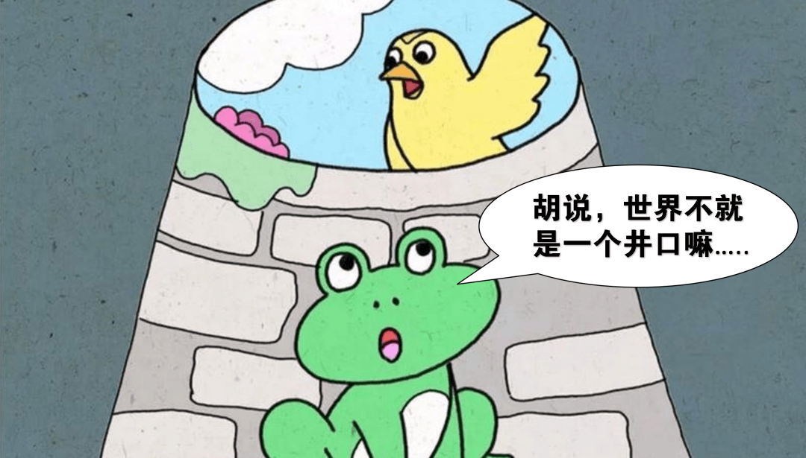

而且更让人无语的是，在这样的茧房中，你在刷你所谓「兴趣圈」内容的时候，它们往往还会给你一种你正在「学习」的错觉，让你误以为你通过这些内容，获得了很多新知&有价值的东西。

在这种错觉的加持下，你会自然的涌现一种正向的道德力量，让你合理化自己的一切行为，从而放纵自己更加肆无忌惮的不停刷刷刷。然而事实上，当你望着流逝的几个小时，那种自然涌起的失落，以及脑袋空空的流水感，都会清晰的告诉你，你是真的收获了，还是一直在自欺欺人。

好了，我们说完了奶头乐内容对我们的前两点戕害后，那么最后一点，则是我认为对我们伤害最严重的一种，即：你会因奶头乐而丧失做事的一切耐心。

### 你会因奶头乐而丧失做事的一切耐心

这一点的解释也很好理解，众所周知，我们体内的奖励机制是被多种激素所控制的。比如负责快乐奖励的多巴胺，或主导积极情绪递质的内啡肽、血清素、催产素等等。

当一个个新鲜、猎奇的短视频向你涌来的时候，那种乐不思蜀的快乐感就是多巴胺类的激素所传递给你的。只不过，这类激素的刺激有效度阈值却不是一直不变的。也就是说，随着你阅片无数，你会慢慢的对最初那些能刺激到你快乐的内容越来越不敏感。

这就好比你吃第一口巧克力会感觉很甜很满足，但随着大量的巧克力进来，你就会觉得腻了一样。而当你觉得腻的时候，生物学上的脱敏现象就出现了。一旦形成这种反应，你就会让自己要刷更多、用更夸张猎奇的事物才能让自己获得最初的那种快乐和满足感。

也就是说从前你只需要刷 2 分钟的短视频，就可以让大脑感到快乐，而现在你则需要 1 个小时、两个小时、三个小时。

而你的注意力和耐心也会从原来的 60 分钟变成 1 分钟，30 秒，甚至只有 5 秒，如果视频五秒抓不到你，不能给你即时反馈，你就会马上把它们刷走，寻找到下一个更快更刺激的。

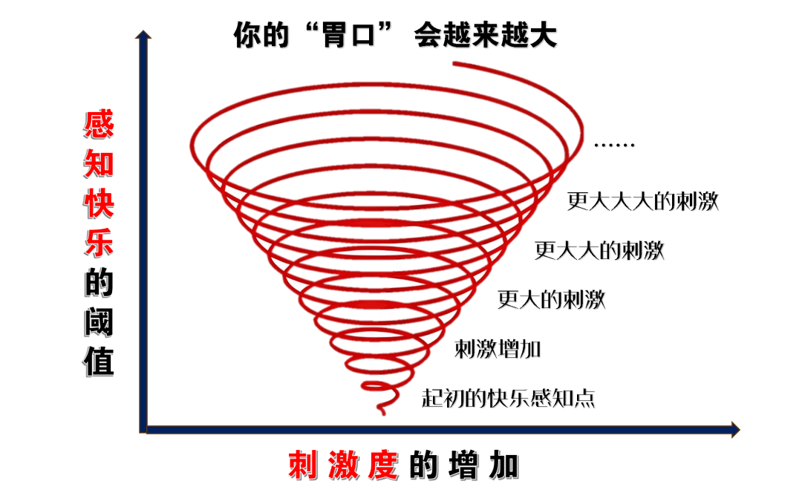

也就是说，一旦你脑中的奖励阈值，被这些奶头乐内容驯化到顶天的时候。那么你再去做现实中那些需要你静心、耐心、慢反馈的事情，你就会变得浮躁不堪，完全的沉不下心来。比如工作、看书、学习、思考。

我这里敢肯定，现在很多人被奶头乐驯化的，能静下心来读完本篇文章的都少之又少，更何况那些信息密度极高的研究性资料了。可以说，如果你现在不意识到和解决这个问题，那么今后你的大脑可能就只能接受奶头乐类的内容。从此在奶头乐的世界里，恶性循环，直至完全丧失独立思考和认真做事的能力。

好了，通过上面，我们充分认识了什么是奶头乐陷阱，以及它对我们的戕害之后，那么我们该如何去解决这个问题呢？

## 如何解决奶头乐成瘾？

那么关于这个问题，很多人看到这里可能会说：你用得着那么多废话吗，想解决问题还不简单？感觉上瘾的时候，把上瘾源卸载了不就完了啊。对于持这类观点的人我想说，如果问题真的可以这么简单的被解决，那世界上就没有 28 定律，所有人就都是上流社会的精英了。

你要知道一点，沉迷某些奶头乐 APP 只是表面现象，而不是问题的本质。如果你采用类似于上面那种头疼医头脚疼医脚的解决方式，那么你没有了某音，你还会有某手、某视、某 B、某红书、甚至某小说，某游戏。

可以说，只要你还拿着手机，那么任何一个 APP 都可以让你重新进入这种奶头乐循环中。你甚至会反复陷入【卸载 - 重装 - 再卸 - 再装】的死循环里。

  
所以，这类小聪明式的解决方法，我们就不谈了。如果你真的想要解决问题，我们就必须深入到问题的更底层，从根本上看看我们的病源究竟在哪，当清楚了病源之后，我们才能对症下药。那么关于这一点，我为你总结了三个内部心理动机和一个外部因素动机。

### 内部动机：目标管理&日程安排有问题

所谓目标管理&日程安排有问题，用说大白话就是：你之所以陷入奶头乐，就是因为你人太闲了，一天天的可能没有啥正事可做。

我们都知道，人是意义的产物，人是无法忍受无聊的。比如，把你关到一个啥也没有的封闭屋子里，那么我保证不出几分钟，就能把你闲的冒金星。（或者试想下疫情闭环式管理期间那种感觉）

那么在这种情况下，如果你因为目标缺失，或者日程安排等问题，让你每天都大量的空白时间和精力。那么无疑，奶头乐的内容就是一个绝佳杀时间，打发无聊的工具。而一旦你习惯于【感到无聊 - 刷奶头乐 - 解除无聊】，让这三者在你潜意识里，建立起行为关联之后，那么它们就会形成一条根深蒂固的习惯回路。

而想要解除习惯，我想你应该体会过它究竟有多难。

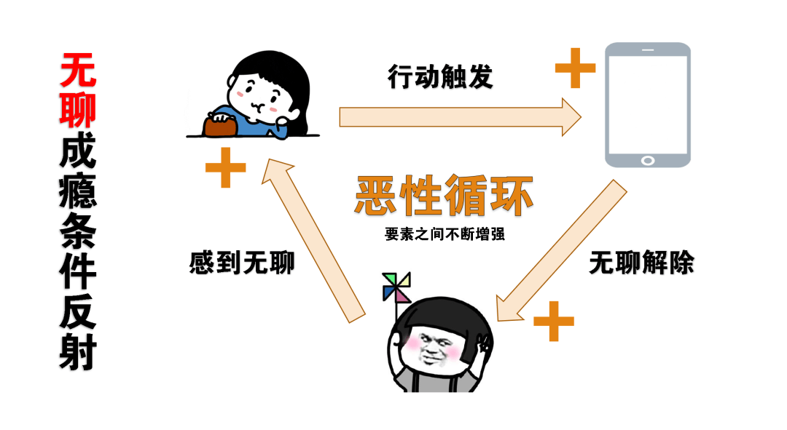

好了，我们这里说完了导致奶头乐成瘾的第一条动机。

那么除了这条动机之外，第二条动机对我们的影响也不容小觑，我管它叫：放松动机。

### 内部动机：错误的放松动机关联

那么关于所谓的放松动机也很好理解，我们都知道，从普遍意义上来说，大部分人刷短视频&或搞其他的奶头乐行为的核心原因，都是为了放松自己。

俗话说，人生不如意着十之八九，激烈竞争内卷的环境让我们焦虑不堪、高速的工作节奏让我们难以喘息、房贷车贷让我们倍感煎熬、做事的慢反馈让我们成就感稀碎，生活中也是琐事一堆，一地鸡毛。

于是，在这样的情况下，短平快的奶头乐，就恰恰满足了我们的所谓「放松」的需求在奶头乐的世界里，我们可以沉浸其中，短暂忘记现实中的一切烦恼。

我们在这里可以只通过一块屏幕获得各种各样的新鲜刺激，我们可以不费吹灰之力的在里面称王称霸，我们发出的每一个行为，都会在这里面得到立刻的反馈。于是乎，工作累了，刷会短视频，压力大了，刷会短视频，心情不好，刷会短视频。

和前面的无聊动机一样，一旦你习惯于把搞奶头乐和放松这两个要素联系到了一起，那么奶头乐就会成为你生活中难逃的主旋律。

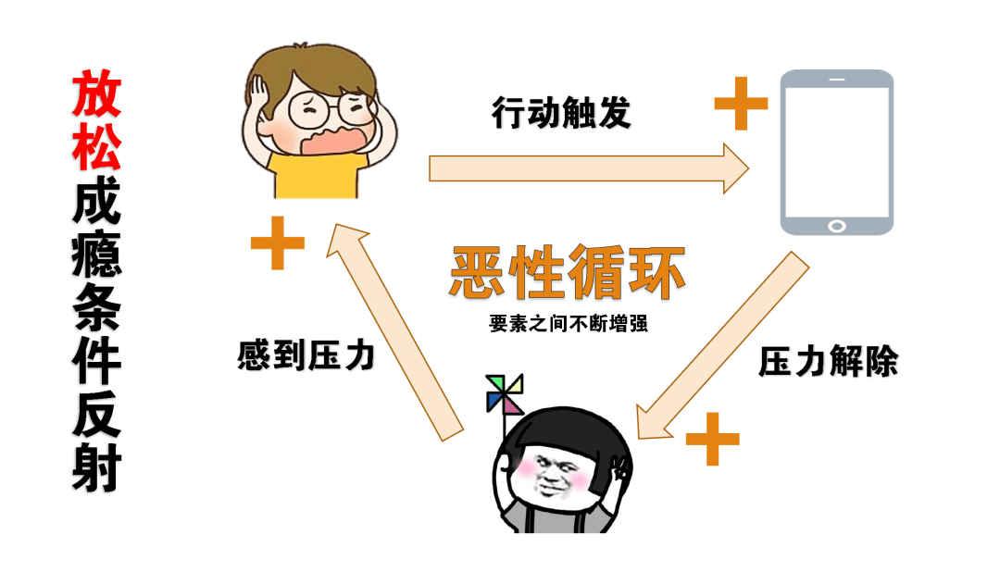

当然，导致我们奶头乐成瘾的，除了前面两种相对比较消极的动机外，还有一条相对更积极正向的动机对我们影响也很大，也就是：获取信息的动机。

### 内部动机：错误的获取信息的心理

那么关于这一点也很好理解。根据进化论的观点，在几十万年前，我们的祖先为了生存繁衍，就必须要不断冒险，不断寻求和食物、环境以及交配等问题密切相关的信息。

因为只有足够的信息，才能让他们搞清楚应该怎样狩猎，吃了什么样的食物会 Over，什么样的环境可能有大型食肉猛兽出没等等。很多时候，为了得到这些事关生死存亡的信息，他们甚至要付出生命的代价。

因此，也正因为信息无比珍贵和重要，所以人类对它的强烈渴望就变成了一种动物本能，刻在了我们的基因里延续了下来。

也正是因为这种获取信息的底层心理在，所以即使现代人的信息早已达到了泛滥成灾的程度，但我们的动物本能仍然在驱使我们去获取更多的信息。因此，一旦智能手机在手，我们身体里的动物本能会不断被激发，让我们不停地点来点去，每过一会，就要拿起手机，看看这，看看那，生怕错过什么消息，错过什么咨询。

也正是因为有信息的摄入，能让你知道现在正在发生，大家都在讨论的新鲜事。所以正如本篇开头所强调的那样，你在刷这类内容的时候，往往还会给自己一种正在学习，学新知识的暗示。从而把你自己的不当行为合理化，为自己披上一层积极行为的外衣，让自己更加心安理得的刷下去。

好了，到这里我们分析完了，导致我们陷入奶头乐陷阱的三个底层心理动机，然而事实上，让我们身陷其中的，也并不是完全都是我们自己的锅。除了我们个人的因素外，还有一双资本的大手在操控着我们。

### 外部动机：算法的奴役与收割

众所周知，在互联网的逻辑中，流量即为金钱，一个平台的价值完全取决于其拥有多么庞大的用户量，以及用户在上面的粘性如何。可以说，你在他们那里停留越久，它们的 APP 价值就会越高。

而且除了平台本身外，一些不良的营销号们也与之「沆瀣一气」，让你沉溺其中。这一点，做过新媒体的朋友应该都知道，在新媒体运营中，有一条非常重要的理论，叫：黄金三秒。该理论强调，你必须在三秒内抓到用户的注意力，每隔几秒给用户一个爽点，让用户看你内容的时候，像是坐滑梯一样，只要刷到就根本停不下来。通过这些手段，以提升他们作品的完播率，从而获得平台更大的流量。

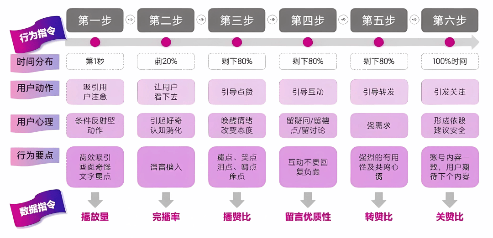

所以说，在各种利益的驱动下，他们会想着办法收割你的时间和注意力。

平台方会汇聚世界上最聪明的顶级研究团队，专心研究你人性的弱点，设计让你「停不下来的」推荐算法，外加上无数创作者让人眼花缭乱的新奇内容配合。于是乎，在这种情况下，当你无目的点开这些 APP 的时候，你就像是打开了潘多拉魔盒一样。

可以说，在各平台强大的推送算法下，外加上【无聊、放松、信息】这三种底层动机需求的联合驱动，不断叠 buff 的情况下，我们就会让自己沦陷在奶头乐的温柔乡里不可自拔。

好了，我们这里知道了奶头乐上瘾的底层原理之后，那么该怎么解决它们的思路也就浮出水面了。下面，我还是遵循三个内部动机，以及一个外部动机的逻辑，逐一系统的为你分享我个人如何解决它们的一些心得。

## 奶头乐的系统级解决方案

### 如何解决因无聊而产生的问题？

那么对于内部【因无聊，无所事事而导致】的问题解除，我个人有这么两点的心得分享。

#### 策略 1：目标规划驱动，让自己忙起来。

我们都知道「想要去除一块地方的杂草，最好的方法是在上面种一片庄稼」。也就是说：当你能足够的忙碌于正事的时候，你是完全没有功夫去理会其他事情的，更不要提被奶头乐收割了。

虽然这是一句烂大街的大道理，但是这确实是最有效规避我们频繁刷手机的方法。关于这一点，经常关注我的读者应该知道，在我个人的目标管理体系里，我是不允许我的日程发生大片空白的。

可以说，我时间的每一个阶段（年度、季度、月度、周、日）都有清晰的目标指引，都有相应的「正事」可做。那么在这套机制下，一旦我当下的课题被完成，时间出现空白的时候，马上就会有下一个课题填充进来。

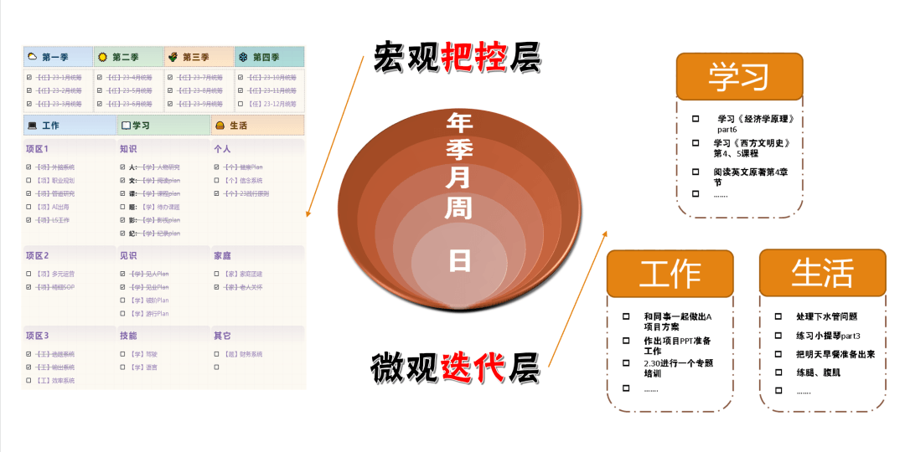

也正是因为得益于这套目标管理机制，所以即使在我陷入奶头乐陷阱中的那段时间里，它也只是吞噬了我业余之外的碎片化时间而已，而对于我正常的工作时间，它是完全近不了身的，我的基本盘是非常稳固的。

所以说，如果你经常感觉到你容易陷入到虚无，你经常因为时间出现太多空白而无聊。那么我也非常建议你能按照一定的时间尺度，梳理出对你重要或感兴趣的课题并设置好后果机制，确保让你在一年中的每一个阶段都有正事可做。

这样清晰的目标指引，可以大幅避免你宝贵的时间因为无所事事，而被奶头乐无情的收割了去。那么至于该如何去通过规划让自己有正事可做，我之前分享过方法论思路，感兴趣的可以稍后去读读[这篇文章](https://mp.weixin.qq.com/s?__biz=Mzk0NDI5NzIzMw==&mid=2247487954&idx=1&)，这里就不额外赘述了。

好了，我们这里说完了解决因无聊而陷入奶头乐的第一条策略，那么第二条策略我管它叫，理解时间的收割与被收割逻辑。

#### 策略 2：意识时间价值，投资，而非消费。

那么关于这一点，我们都知道，在商业中的一条重要逻辑就是：不断的消费只会让人越来越穷，只有不断的生产&投资创造才能越来越富。

我们在开头就强调了，时间是你最有价值的资本，只要你有足够的时间催化，你可以习得任何你想习得的技能、积累出一切你想积累出来的资源、优势、从而把它们变现成财富。然而很多人并没有意识到这点，他们只会把看得见，可逆的金钱视为资本，而对于看不见且不可逆的时间视为廉价品。

因此，正是因为存在这种认知差，你就看到了消费时间观的两类人。那些意识到时间价值的人，会吝啬于自己的每一份时间支出，他们只会把自己的时间，投资到有积累有回报的事情上去，或者直接以生产者的身份参与进去，去收别人的时间，创造商业价值的回报。

而没意识到时间价值的人，它们会把时间视为最廉价的消费品，总是在肆意挥霍时间消费内容，把自己最宝贵的时间心甘情愿的送给别人收割，帮助别人变现。可以说，你的人生发展取决于你把时间用在了投资创造，还是用于了纯消费支出。

如果你的时间不被你用于投资创造，那么等待它的结果一定是被别那些「懂时间价值」的人所收割。

因此，如果你过去并没有意识到你时间的价值，一直在挥霍消费自己的时间供别人收割，那么我希望从今天开始你能意识到这点。当你能搞懂这组时间收割与被收割的关系之后，你就不会轻易掉进奶头乐的陷阱中。

这就如同魔术表演一样，当你不知道魔术师的套路时，你会被魔术师的表演深深吸引并折服，认为魔术师太神奇了，甚至会崇拜起魔术师来。而一旦你知道魔术师的那些套路和伎俩时，你再去看魔术师的表演，就会觉得索然无味，甚至会因为感到自己被骗，因而产生一种厌恶的感觉。

好了，我们上面通过【目标管理】和【时间价值】给出了「因无所事事而陷入奶头乐陷阱」的解决思路。那么下面我们再来说说第二个，也就是：「因放松动机而陷入奶头乐陷阱」的解决策略。

### 如何解决因放松而产生的问题？

那么关于这一点，前面已经提到过了，我们主要是因为外部的压力太大，工作任务过重，或者工作之余后的放松休息，而习惯性进入奶头乐中的。所以，想要破掉因放松进入的陷阱，我们就必须破除掉「放松」与「奶头乐」之间的联系。

因此关于这一点，我个人有这么两点心得分享。

#### 策略 1：更换其他的放松方式进来

这一点很好理解，也就是说，如果你常常因为需要休息放松而习惯性的陷入奶头乐之中，那么很可能是因为你的日常中就只有奶头乐这么一种「放松」的方式，而没有其它可以让自己宣泄压力和放松身心的渠道&方法。

那么在这种「唯一」的条件下，你就非常容易的建立起【感到压力 - 奶头乐 - 压力解除】之间的习惯关系。所以，当我意识到这个问题之后，我就开始有意识的改变我的放松方式，根据我的兴趣爱好挖掘更多，更健康的放松方式进来。比如，当我感到疲劳，重压等糟糕时候，我就会根据不同的时间和场景以及心情，选择诸如：冥想、听歌、K 歌、外出散步，和朋友约聊&下棋&打球，打扫卫生、健身、打沙袋等方式，让自己的消极能量向外散去。

而不是让自己置入奶头乐中，以逃避现实的方式取得所谓的「放松」。

事实证明，这些操作中的任何一种所产生的放松和降压效果，都远远碾压奶头乐带给我的幸福和放松感更强。所以，如果你已经习惯于把奶头乐与你的放松场景绑定，那么不妨也根据你的喜好和条件，多开发一些健康并可以娱乐自己的减压方式。

通过让其它更多、更健康的放松方式进来，这样的多元替代，可以大幅度破除你「放松与奶头乐内容」之间建立的关系。

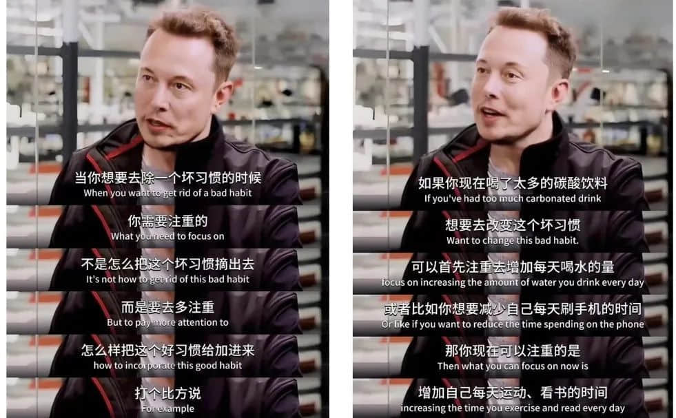

当然，如果你因为一些原因，无法让自己从外部获取能量，但你又怕自己陷入无聊动机，你也可以采用策略 2 的方式。

#### 策略 2：把快餐内容换成慢反馈内容。

其实所谓把快餐转慢的方式，指的就是：在你需要内容填充放松时间的时候（比如下饭的时候），你可以把那些强成瘾的短视频&爽文肥皂剧等奶头乐内容，替换成有价值、慢反馈的长内容。

比如我个人会在时间空档期（如乘车、等人）的时候，读一些我收藏的长文、读书等方式把这部分时间有价值的用掉。而在类似饭点这类下饭放松期间，我则会通过刷纪录片、以及我感兴趣的知识类，科普类博主的视频，来冲抵刷短视频或肥皂剧的时间。

虽然都是在刷内容，但是刷这类有价值，需要思考的慢反馈类内容，可以让我们的头脑建立非常不错的耐受。从而避免自己的阈值被拔的过高，丧失接受长内容或者需要长时间专注&动脑思考内容的能力。

所以，如果你经常因为无其它放松渠道，而陷入漫无目的的刷奶头乐行为，那么不妨给自己准备一些你自认为有价值、有意义的东西。比如：可以是纪录片，科普博主，也可以是 TED 演讲、访谈，甚至奇葩说这类的综艺节目等等。这样虽然无法解决你的根本问题，但是也绝对可以大幅度对冲掉纯奶头乐内容带给你的负面影响了。

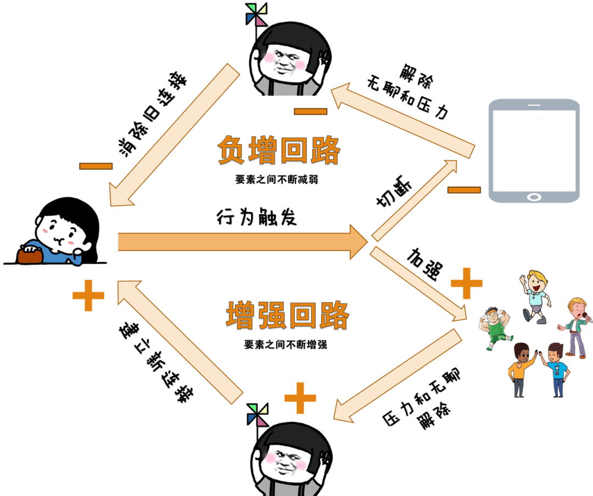

好了，我们上面通过【注意方式】和【控制阈值】的策略，给出了因「放松动机而陷入奶头乐陷阱」的思路。下面我们再来说说第三个心理动机，也就是：「信息获取的需求而陷入奶头乐陷阱」的解决策略。

### 如何解决因信息需求而产生的问题？

那么对于这个问题的解除，我个人有这么两点心得分享。

#### 集中批量式获取资讯

其实所谓集中批量式的获取信息，指的就是：把自己获取信息的需求，放到特定的时间，在特定的地方一次性满足，从而避免自己一会看一遍热搜，一会逛一个平台的行为。比如说，我个人只会在早晨或晚上，接受新闻类的信息，其它时间我都是不看的。而且我在游览他们的时候，也不会一个一个平台去刷，一篇篇的点开去看。

除非是我特别关注的领域，否则我只会通过信息聚合网站，把它们一把的给抓出来，只看词条，几分钟就可以知道这个世界发生了什么。同时还多个平台交叉验证，确保信息的真实有效性。这样的操作，既可以满足我信息获取的需求，又避免我陷入在各大平台的推送中，同时还提升了我获取信息的效率。

当然，在你摄入这些信息的时候，你还需要特别注意下第二点，也就是设置自己的关注圈，高度留意自己的注意力被收割。

#### 设置关注圈，严控注意力。

其实所谓设置关注圈，指的就是：你在看到一些内容的时候，尤其是词条或标题非常吸引你的时候，在你打开前，你一定要习惯性的评估下，这个词条和你有没有关系，能不能对你产生价值。

比如，这些词条所传递的东西，能不能帮你赚更多的钱，能不能提高你的认知，能不能带给你更多的有价值知识，能不能提升你的工作生活效率，能不能让你更幸福。如果这里面没有一条能的，它只是单纯的冲击了你的情绪和注意力，那么就不要点开它。

比如，于我个人而言，我日常在浏览我信息源的时候，对于那些故弄玄虚，哗众取宠类的标题党内容，或者娱乐圈的那些明星八卦，以及过于遥远的什么国际形势等新闻，我都是直接不看，不关注的。

因为这些根本与我无关，我知道这些，除了给自己徒增烦恼和信息冗余外，不能为我带来其它任何一点的价值。所以说，当你设置了自己的关注圈之后，你会发现这些所谓的热搜，怎么会这么无聊，怎么会有那么多无聊的人去看。

好了，我们上面通过【集中获取】和【设置关注圈】的策略，给出了因「获取信息需求而陷入奶头乐陷阱」的解决思路。下面我们再来说说最后一个，也就是：因外部原因而导致奶头乐陷阱的解决策略。

### 如何解决因外部因素而产生的问题？

那么关于这一点，我们都知道：刀可以杀人，但也可以切菜，其好坏与否完全取决于你怎么使用。各大内容平台的内容只要我们能利用好了，它们其实也并不是完全的洪水猛兽。而且我们生活在这个互联网的时代，想要完全的戒除也是根本不现实的。

所以，我所提倡的「根除」从来不是像苦行僧式的那样强制戒除，而是通过去瘾，达到有节制的健康合理使用。因此，在外部动机策略这块，如何做到去瘾、有节制使用的方法，我给你总结了四点。

#### 打破沉浸：主动选择去刷什么视频。

那么关于这一点很好理解，如果你平时游览的内容平台足够多，你会发现现在各大平台，都开始陆续放弃多格信息流的推送模式，而采用类似于某音那种全屏式的推送模式了。其实平台这样做原因也很简单，因为全屏式的推送模式，会更容易让人沉浸，让人忘记时间。

在以前那种信息流的模式下，虽然我们也很容易刷的停不下来，但是我们至少还有选择权，也就是说，我们可以根据自己的偏好判断后，才选择要点开哪一个内容播放。然而在全屏的推送状态下，你是完全没有这个选择权的，每进来的一个视频，都是不经过你的允许，直接就播放，各大博主的黄金三秒套路，抓的你根本停不下来。

于是，在算法的这样操作下，全屏模式的短视频就像是一个魔法盒子一样，永远充满着刺激的随机性，让你永远也刷不完，后面永远都还有更新鲜更刺激的东西等着你刷。因此，在这种机制下最典型的一个表现就是，你经常想着刷个十来分钟就睡觉，结果等回过神，已经到了凌晨几点了。

所以，你在刷这类平台的时候，如果想要避免自己被沉浸，请一定要手工把【推送模式】变更成【信息流选择】模式，打破全屏的那种沉浸式。这样可以让你的理性控制阀充分的参与进来，所有的东西都会经过你自己的大脑判断之后，才会选择是否播放，而不是完全受控于算法。

虽然无法从根本解除上瘾问题，但此操作最起码也可以把你的沉浸状态打破。我亲自测试过，在全屏不经过我的允许播放的情况下，我很容易被抓到注意力，在里面几十分钟甚至几个小时都毫无感觉。

然而当我把沉浸式全屏模式切换到多格信息流模式之后，我就很容易觉得这些东西很没意思，很无聊。甚至会感慨平台咋给我推荐这些东西，我的趣味怎么变得如此之低。那么至于如何切换信息流模式，也很好操作。

这里不妨以某音为例，当你进入某音之后，再点击一下右上角的【推荐】按钮，即可进入多格信息流模式，而非默认的全屏，其它平台也有类似的设置机制，可以自行研究，这里就不多赘述了。

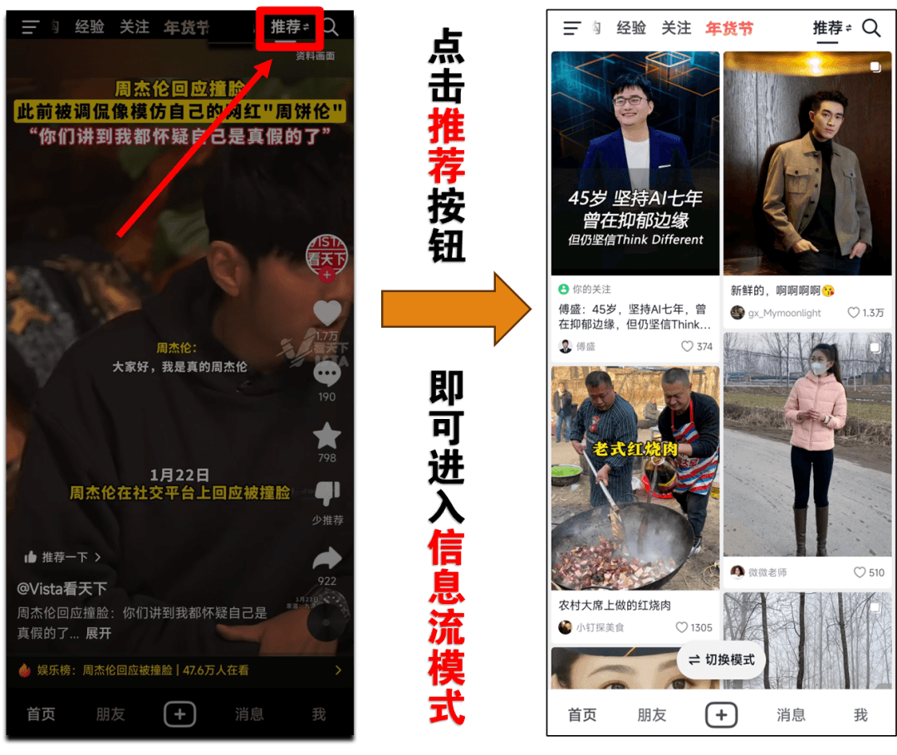

好了，我们这里说完了解决外部因素的第一个策略，那么第二个策略则是。

#### 重置偏好：利用它，而不是被它所用

这一点很好理解，我前面也提到了，如果你能把短视频或者其他基于大数据内容推送的平台控制的好，并且有节制的使用，那么它们也不完全是洪水猛兽。因此，如果你发现你经常沉浸于某些类型的视频，且这些视频无法带给你任何积极价值。

那么你就可以通过 APP 自带的偏好设置&反馈，告诉算法你讨厌他们，不要再给你一直推送奶头乐的内容了。当你能经常认真审视自己的内容偏好，并且根据你的弱点和需求重新调教算法给你推荐的内容。那么它就会从纯迎合你人性弱点，杀你时间的奶头乐，慢慢的转变成为你带来有价值信息的工具。

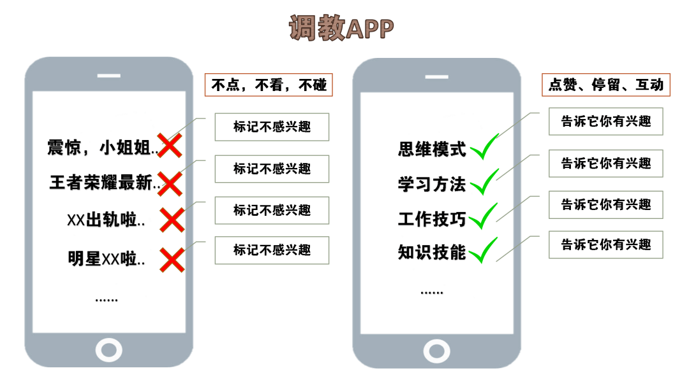

好了，我们这里说完了节制使用这些 APP 的前两点建议，那么第三点建议则是控制应用使用合理化。

#### 限制措施：控制应用使用合理化

那么关于这一点就更好理解了，我认为我现在之所以能从这些 APP 里走出来的关键原因，就是因为我为我使用这些 APP 的行为，设置了限制条件。也就是说，当 APP 的使用时间到达了我设置的限制时长之后，它就会被强制退出，并无法被打开。

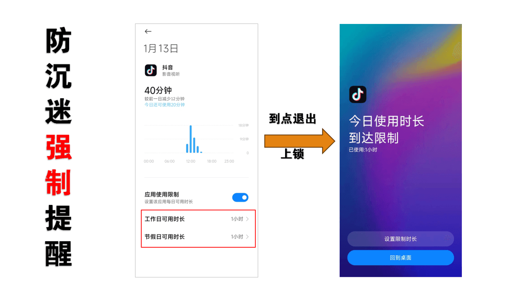

这样的强制措施虽然无法从根本上解决问题，但是它却可以帮助我打破厂商营造好的沉浸状态。当我还在乐不思蜀刷刷刷的时候，这个强制提醒就像是给了我当头一棒一样，让我清醒的意识到，我今天的使用已经超出了我的原则，从而有效避免我一天的时间因不留神而被收割走好几个小时。

所以说，如果你经常感觉你时间被这些 APP，一不留神的收割走，那么你也可以把这个动作安排上。这个应用使用时长限制的功能，现在各大手机都有自带【屏幕时间管理】，你可以自行设置任何应用的使用行为。而且大部分 APP 本身也自带防沉迷限制功能，比如某音的【青少年模式】你就可以在这里面设置更多的控制，甚至可以直接设置指定的推送偏好。

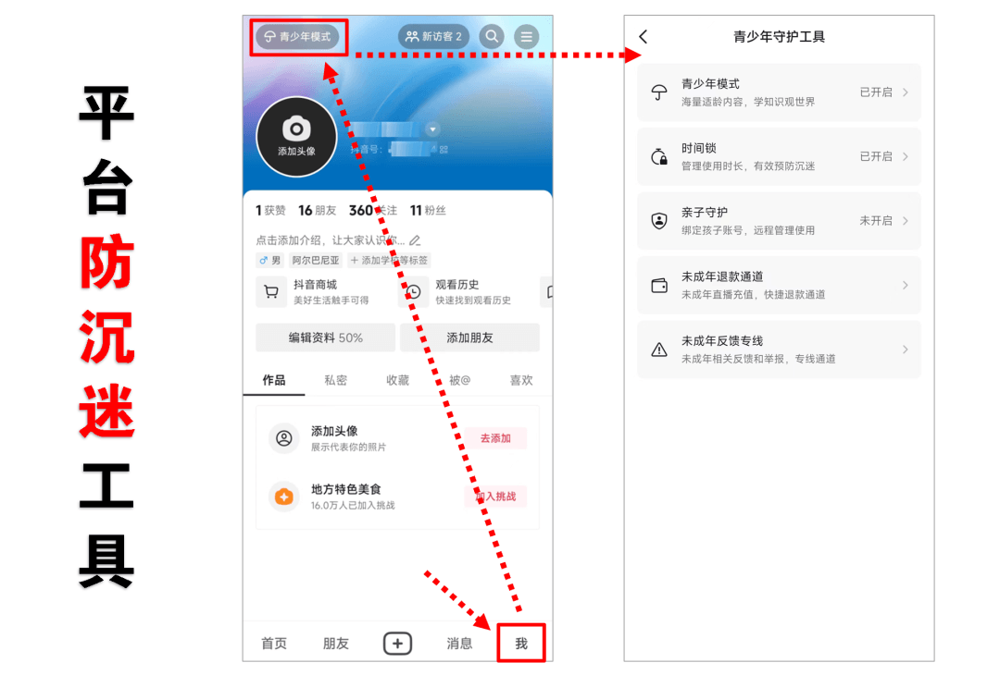

那么至于使用时长，我个人建议你采用 TikTok 周受资提供的参考时长，也就是：把每天的使用时间控制在一个小时左右。相信我，当你每天能把刷各种视频等娱乐性行为的时间控制在一个小时甚至之下后，那么你整天可支配的时间一定会大幅度的提升。

好了，我们这里说完了节制使用这些 APP 的前三点建议，那么最后一点建议则是消灭唤起触发点。

#### 日常规避：消灭唤起触发点。

关于这一点也很好理解，你肯定也发现了，现在各大 APP 为了争取我们的时间和注意力，可以说是无所不用其极。比如说，你手机上各种各样的红点提示、各种各样的通知推送，各种各样的触发场景，无时无刻都在拉去你进入他们编造的温柔乡里。

关于这一点，行为设计学的鼻祖 B.J. 福格，曾提到一个行为模型（福格行为模型）。该模型提到我们的行为受制于三个要素的影响，其中这里特别值得关注的就是【提示触发点】的影响。

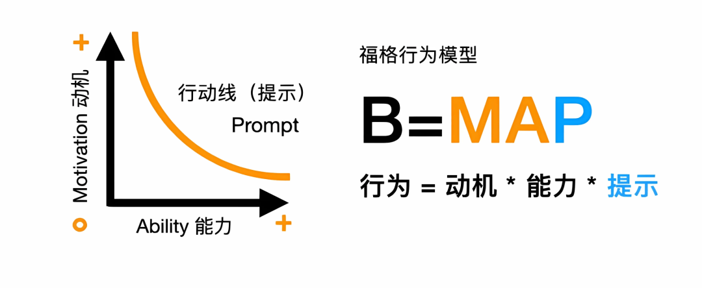

该要素强调，我们行为的发生往往与外界的提示触发有直接的关系，比如说，如果你想提醒自己多喝水，那么把水杯放到你高频看到的位置最佳。水杯的这个提示会让你联想到喝水，从而触发你想起喝水的动作。

同样的，如果我们想规避某些东西，那么我们就可以减少被它唤醒。比如把水杯从我们的视线里挪开，当缺少提示了，或许只有我们生理发出「渴」信号的时候，我们才会想起喝水。所以，同样的道理，如果你想规避你拿起这些 APP 的频次，那么通过屏蔽所有提示源，避免被唤起也是一个非常好的策略。

对于我个人来说，除了几个与工作密切相关的 APP 之外，我几乎屏蔽了所有 APP 的通知，切断了所有我能操作的入口点。比如微信，在我手里被我设置的只剩下一个朋友圈了，其它诸如什么视频号、游戏、直播统统滚粗。

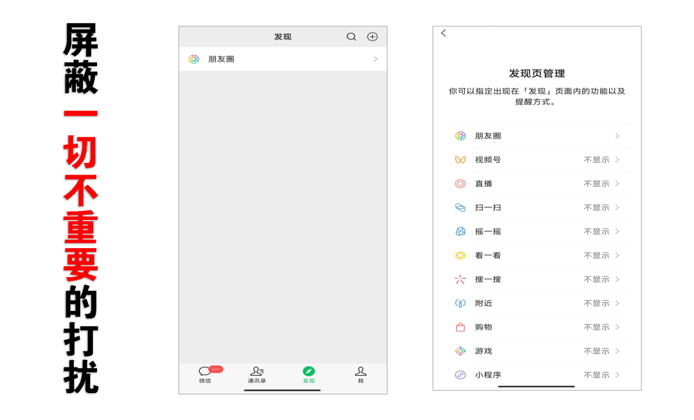

所以说，如果你日常经常会被一些 APP 所设置的场景触发到，那么你也可以采用类似于我的策略。即：把他们所有能勾引到你的触发点，全部砍掉，只有你主动想起使用它们的时候才去打开，避免一切被动打开的行为。

当你真的这样做了，你会发现，脱离被操弄、不被打扰的感觉太爽了。

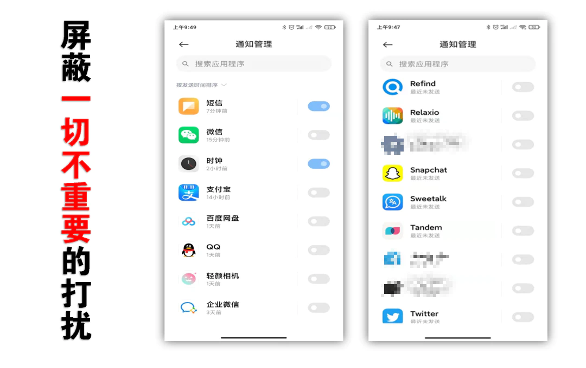

好了，到这里我们解决奶头乐问题的思路就分享完毕了。我相信只要你能认真的理解这些底层心理，并从这些角度对你的行为做系统性优化&践行。那么我不敢说能让你完全根除奶头乐，但是这些方法绝对可以让你避免持续受它所困。

期待这篇文章能够解决你的问题，让你脱离奶头乐陷阱，自由掌控自己的时间和效率。我是老常，我们下一篇文章见。

## 本文知识点&逻辑导图

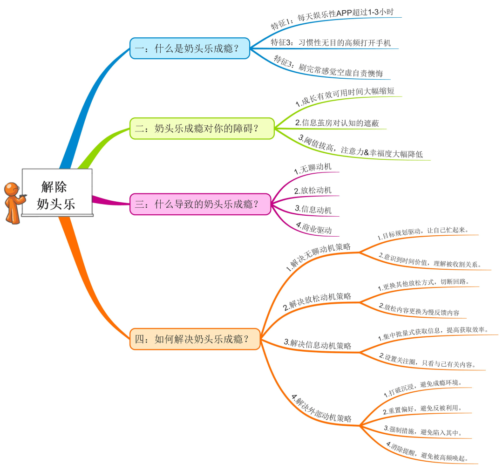

