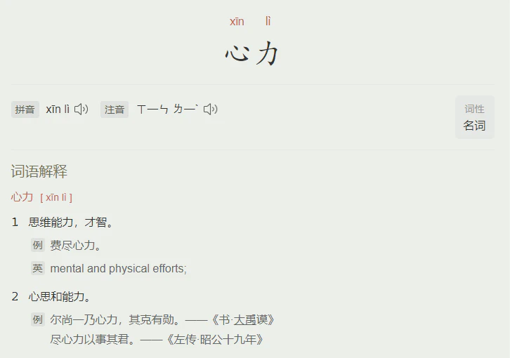

# 低能量自救指南：浅谈心力、脑力、体力的作用机制 - 少数派

## 引言

为什么周末在家躺了一整天，却感觉身心俱疲？

为什么旅游、裸辞都无法缓解工作带来的焦虑与倦怠？

为什么尝试过很多效率工具和方法论，却依然逃不开摆烂的现状？

今天我想从「内观」的角度，尝试拆解「能量管理」的三个面向：心力、脑力、体力。

> 如果说**『创造、生存、发展、体验』**是生命力的涌现形式，那么**『心力、脑力、体力』**则是建构生命力的核心能量。

日常生活中，面对不同的任务，我们的身体会调用不同的「力」去应对，是单力作用还是全局统筹，取决于任务情景的复杂程度；而每个人心力、脑力、体力的阈值上限、每次调用后的损耗程度与恢复速度，则是由我们的先天生理基础，以及后天认知水平与管理策略来决定。

## 心力

### 通俗来说，心力可以理解为**「锚定长期目标」**的能力。

这个长期目标可大可小，无论是个人生活的昼夜节律、饮食与运动、阅读与写作，还是社会生活的工事农耕、艺术创作、动物救助、精益创业、科考钻研、教育传承…… 人们常说的“心气儿”、“精神能量”、“内驱力”、“定性”其实都属于心力的范畴。

我们可以观察身边心力比较足的人，无论外部环境如何变化，TA 们往往都能通过建立内在秩序，长期的保持专注状态，有足够的耐心从小事开始做起，保持轻盈的身心状态。

### **「心力」来源于以下几个通道：**

-   内化的天赋与理想。
-   通过后天训练，达到身心合一的心流状态。
-   外部环境以及人际圈层的滋养。

> **心力管理关键词：增加心力储积，减少无效损耗**

天赋不一定非得是顶级稀缺的能力，普通人视角的天赋也可以理解为：**对你而言内心摩擦力很小的领域。**一个往往被忽略的竞争优势就是：别人觉得麻烦而你不觉得，甚至乐在其中。所以增加心力储积的前提是，剥离开外部期待去找到自己的天赋所在，将有限的心力用于发展优势，而非弥补短板。

识别优势后，我们需要学会给长线任务设置可靠的短期目标。为什么照着别人的目标做很难拿到结果？因为设置目标算是个技术活儿，过于困难会导致焦虑，过于简单会产生倦怠，只有通过持续挑战具有一定难度，但不过分超出能力边界的目标，才能进入“深度思考、心无旁骛”的[心流](https://book.douban.com/subject/27186106/)状态，在正反馈和成就感中，不断提升心力的阈值上限。

如果你从心底想要改变，但又总是和爱抱怨、光说不做的人呆在一起，那大概率会导致心力的无效损耗（俗称内耗）。人是环境的产物，是政治、经济、文化、人际圈层共同塑造的结果。我们很难改变宏观环境与他人的境遇，但我们可以选择置身于思辨的、成长的、包容的、善意的人际圈层中，通过课题分离减少他人情绪的干扰，把有限的心力用在关键的人生课题上。

## 脑力

### 脑力是一种可以被量化的有限资源。

我们所说的脑力通常是指**「大脑记忆、理解、分析、判断、想象」**的能力，先天生理结构决定了脑力的发展上限，而后天的开发与训练则决定了我们能够调用的能力空间。

大脑健康运作时，通常表现为：

-   **思维敏捷：** 能够高效的处理信息、解决问题和做出决策。
-   **记忆力良好：** 能够同时处理多个任务或信息，而不会感到过度负荷或混乱。
-   **情绪稳定：** 能够适应新的环境，情绪稳定地应对生活中的压力和挑战。
-   **学习能力：** 能够有效地吸收新的知识，并转化为个人技能。
-   **语言和沟通能力：** 能够准确地表达思想并理解他人的意图。
-   **身体协调性：** 健康的大脑能够与身体协调工作，保持良好的平衡和运动控制。

### 那么我们该如何识别脑力的消耗程度呢？

当产生明显的**「认知负荷、注意力涣散、决策疲劳」**的情况，大脑其实已经处于压力状态了；如果一个人长时间内只能摄入浅层次、刺激性、短频快的碎片化信息，而对社科、金融、历史、科学等严肃性长内容表现出明显的阅读障碍，那基本可以判断，脑力已经过度消耗、处于受损边缘了，这种情况需要及时的觉察、干预与调整。

> **脑力管理关键词：主动降噪，善用工具**

首先，**营养饮食、昼夜节律**是健康脑力的大前提。

以下是一些营养大脑的食物建议：

| 营养物质 | 作用原理 | 天然食物 |
| --- | --- | --- |
| **Omega-3 脂肪酸** | 支持神经细胞结构、改善认知功能、减少炎症、增加抗氧化保护、帮助神经发育、抑制神经递质失衡。 | 天然鱼油、亚麻籽、核桃 |
| **抗氧化剂** | 保护神经细胞免受氧化应激损伤。 | 蓝莓、草莓、芒果、番茄、菠菜、青椒、南瓜、胡萝卜 |
| **维生素 B 族** | 帮助大脑进行能量代谢、神经递质合成、神经保护和神经发育。 | 全谷物、豆类、坚果、瘦肉、蔬菜 |
| **维生素 C** | 抗氧化、神经递质合成、脑组织支持和免疫支持。 | 甜椒、小番茄、小白菜、猕猴桃、草莓、橙子、柠檬 |
| **维生素 E** | 抗氧化、神经细胞保护、帮助神经传导、抗炎和改善血液循环。 | 杏仁、葵花子、核桃、南瓜籽 |
| **蛋白质** | 神经递质合成、稳定神经细胞结构、神经递质受体、能量供应、神经递质平衡。 | 蛋、瘦肉、鱼类、豆类 |
| **矿物质** | 涉及神经递质的合成、神经细胞的功能、细胞膜稳定性以及氧气供应等方面。 | 坚果、种子、绿叶蔬菜、全谷物 |

同时，我们还可以善用人工智能释放脑力，通过定期的阅读写作、艺术创作、深度思考来保持大脑的活跃与弹性。

除此之外，规律运动可以增强大脑血液循环与氧气供应、释放压力与情绪、促进内分泌平衡，从而提升记忆力与专注度，增强思维敏捷性。

在脑力资源的分配层面，我们可以采取**「降噪策略」**，主动筛选准确可靠的信息来源，降低无效信息带来的偏见、干扰和误导。

*此处推荐 RSS feed 形式订阅信息，后续会单独分享如何找到适合自己的信息源。*

## 体力

### 体力可以直观反映身体的健康状况与运动能力。

体力的阈值水平受到遗传因素、生活方式、饮食、睡眠、运动的协同作用影响。良好的体力表现为：肌肉力量与耐力、心肺功能、身体灵活性与协调性等。体力活动不足可能导致肌肉减退、心肺功能退化、代谢紊乱、焦虑抑郁等亚健康风险。

> **体力管理关键词：昼夜节律，耐力训练**

理论上来说，均衡饮食、昼夜节律是维持体力的基础，而定期的耐力训练与心肺功能训练可以提升体力的阈值。

值得提醒的是，不是每个人的体质都适合大量出汗的剧烈运动，如果是在长期熬夜、睡眠不足的情况下强行运动，反而会损害身体机能，在这件事上务必要合理评估、量力而行。

中医把运动分为肢体运动和气脉运动。

**「肢体运动」**是锻炼肌肉与骨骼的，比如打球、跑步、游泳，这类运动可以通过加快血液循环、增强心肺功能，让我们的肌肉骨骼更加强壮。

气脉运动融合了身体动作、呼吸调控和内心意识的练习，强调流畅而缓慢的动作，可以增强灵活性、柔韧性和平衡能力。

我们可以根据身体的实际状态，选择适合当下的运动。

## 结语

回到**「能量管理」**这个课题，普通人该如何摆脱低能量状态呢？

#### 第一步：状态识别

屏蔽噪音，向内觉察。

用 X 光逐一扫射：心力、脑力、体力，究竟是哪个面向的哪个环节出了问题？

#### 第二步：对症下药

让一个擅长深度思考的人去做酒桌交际花，让一个创造力丰富的人去做数据统计…… 心力不足，可能是因为你一直在迎合外部期待，强迫自己做不擅长的事；或者经过错误的评估，设置了远超边界的目标，磨损了长期做事的信心，陷入摆烂。

心力层面的损耗，无法通过浅层次的社交活动，或者强制性的思维训练来回血。同理，长期熬夜、摄入碎片化信息导致的脑力过载，也无法通过方法论和效率工具来恢复思考。

唯有对症，才能治本。

**第三步：建立身心循环**

建立一个健康的身心循环，并不意味着必须要制定周密的计划、不允许问题发生。

恰恰相反，身心健康的核心不在于控制，而在于感受能量的自然流动。

即使已经摆烂许久，你仍然可以从认真吃饭、睡个好觉、晒晒太阳开始，重新建立起和身心的正向链接。
