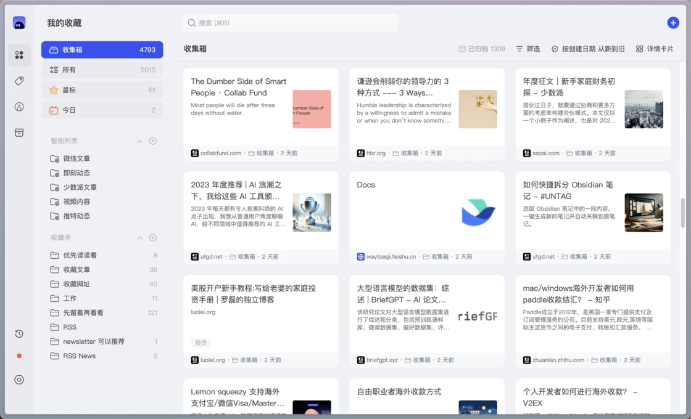
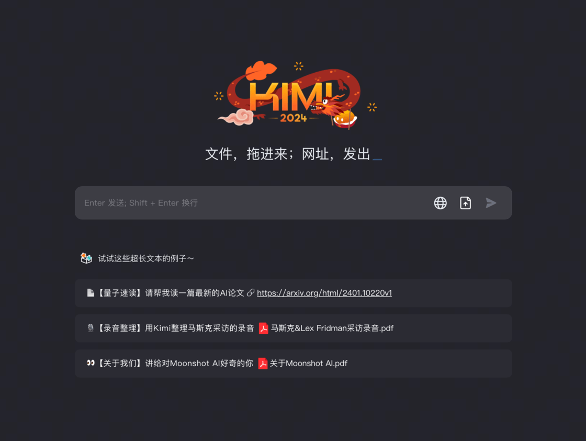
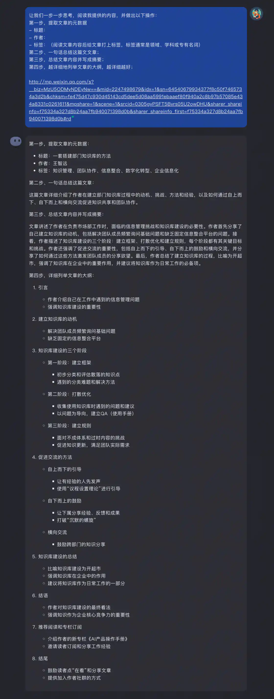
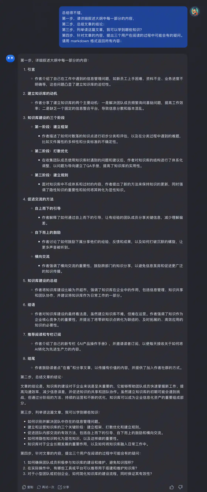
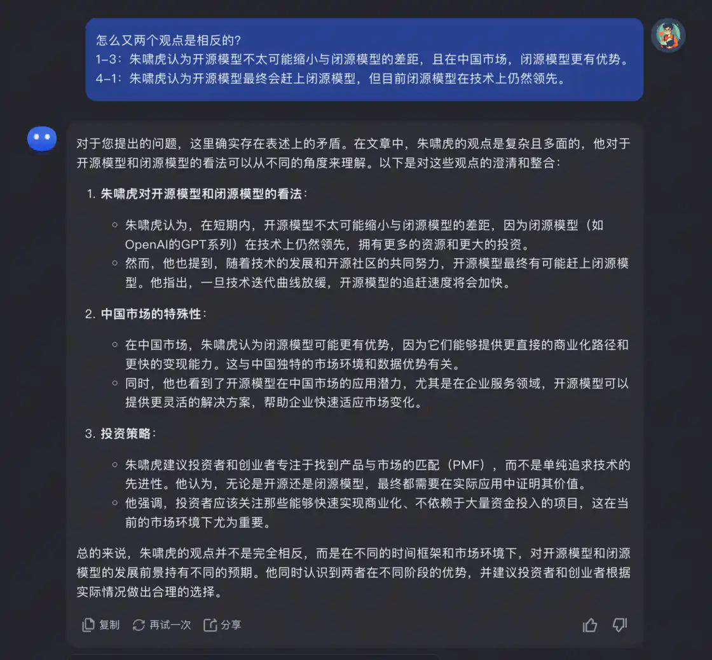
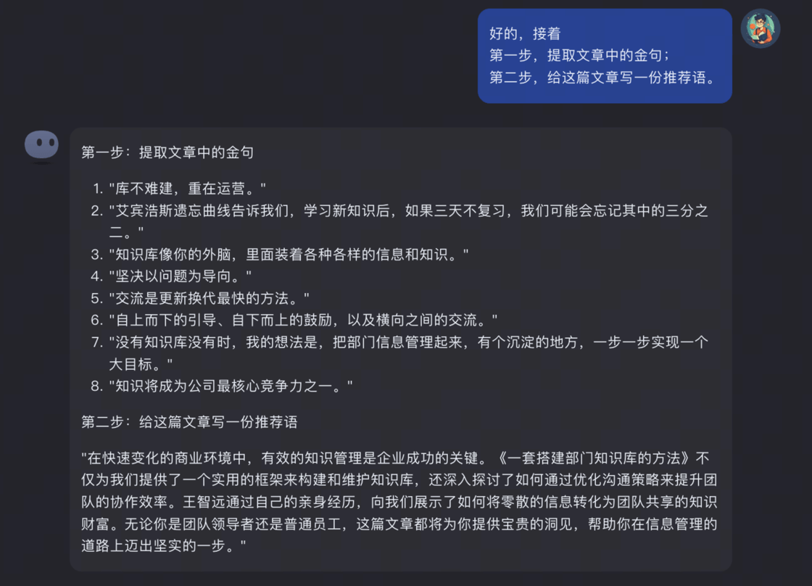
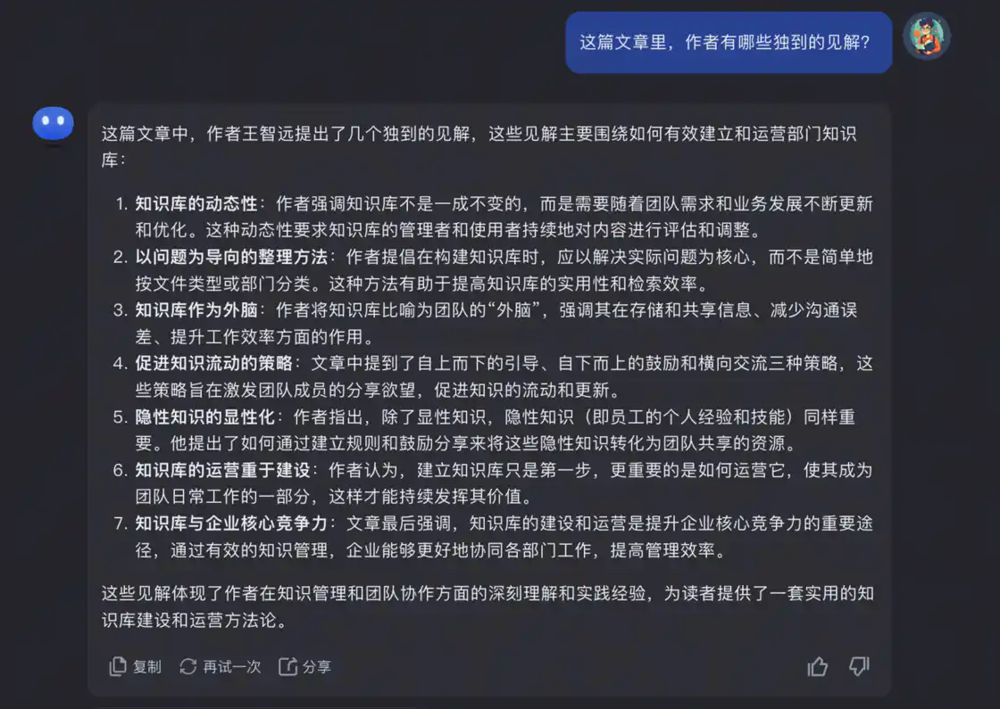
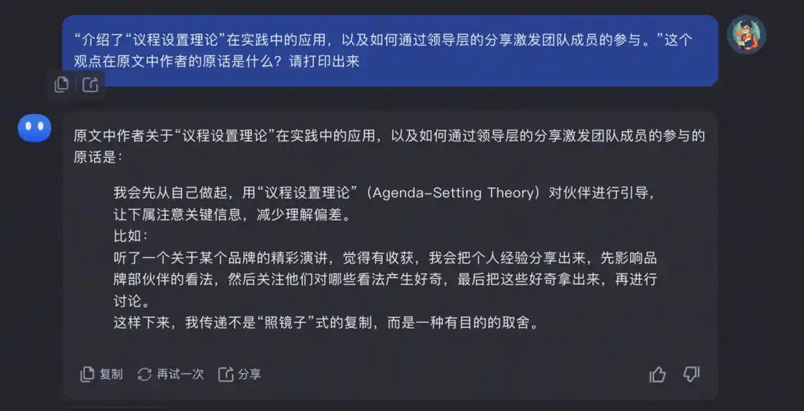

# 基于 Kimi Chat 的 AI 渐进式阅读法 - 少数派

我每天需要处理大量的文章。社交媒体推荐的文章、RSS 订阅的文章、主动搜索到的文章…

因为有大量的信息要处理，我的 read it later 文章也越来越多。两年多来，我的 cubox 里的待读文章，已经攒到了 4800 篇。

但我并不会为此感到焦虑，这些文章成了一个经过我筛选的“图书馆”，当我需要的时候，我可以在里面找到自己想要的文章进行阅读。



## **我的文章阅读步骤**

在没有 AI 之前，我的文章处理步骤是这样的：

粗略阅读，筛选信息

经过筛选的信息，阅读其中一部分 / 全文阅读

阅读过后记录「文献笔记」

具体的步骤可以参考我在 2021 年写的《我的阅读工作流 (2021 版)》

有了 AI 以后，大语言模型 (LLM) 可以帮助我们处理文章，提高筛选文章和阅读文章的效率。

> 大语言模型的能力：
> 
> 聊天机器人：对话
> 
> 总结类应用：总结信息 / 提取信息
> 
> 扩展类应用：续写
> 
> 推理类应用：情绪判断、主题判断
> 
> 转化类应用：翻译、格式转换、纠错
> 
> —— 来自吴恩达的 ChatGPT 教程

下面我将介绍我使用 AI 来帮助我提高文章阅读效率的方法。

我称之为「**渐进式阅读**」

## **渐进式阅读法**

#### **模型选择**

首先先选择大模型，我选择的是 Kimi Chat

而对比国内的一众大模型厂商，Kimichat 的长文本能力 (long-context) 是最好的。文章一般的字数一般都比较多，依赖大模型的长文本能力来处理。

对比海外的大模型，比如同样支持操场文本的 Claude，Kimi Chat 对中文的支持更好。

Kimi Chat 现在可以免费使用，并且支持 Web、H5、APP、微信小程序等多终端，哪里都能用。



### **第一步 了解文章**

筛选信息时，我的判断步骤是：

判断信息质量，只读高质量文章

是否是自己需要的？读完能学到什么？

是否是当下需要的？不是当下需要的，先存起来，”read it later“。

在第一步的 prompt 里，为了更好地了解文章，我让 AI 帮我总结了文章的元数据，包括标题、作者和标签；一句话总结文章，再写了摘要，我只要阅读这部分，就可以大概知道文章讲的是什么。；详细列举文章的大纲，通过大纲的阅读，就可以知道文章的结构。

以这篇文章[《**一套搭建部门知识库的方法》**](http://mp.weixin.qq.com/s?__biz=MzU5ODMyNDEyNw==&mid=2247498679&idx=1&sn=64540679934377f8c50f7465734a3d2b&chksm=fe475d47c930d45143cd5dee5d08aa5991ebaaef80f940a2c8b97b57085e434a8331c0261611&mpshare=1&scene=1&srcid=0305gyPSFT5Bvrs05U2owDHU&sharer_shareinfo=f75334a327d8b24aa7fb940071398d0b&sharer_shareinfo_first=f75334a327d8b24aa7fb940071398d0b#rd)为例

使用 prompt 发给 kimichat

```haskell
让我们一步一步思考，阅读我提供的内容，并做出以下操作：
第一步，提取文章的元数据
- 标题：
- 作者：
- 标签：（阅读文章内容后给文章打上标签，标签通常是领域、学科或专有名词）
第二步、一句话总结这篇文文章；
第三步，总结文章内容并写成摘要；
第四步，越详细地列举文章的大纲，越详细越好；

{{文章链接}}
```

得到结果



### **第二步 详读内容**

在阅读了第一步的结果的基础上，紧接着继续追问

因为在上下文有”大纲“的情况下，LLM 可以更好地理解工作，总结效果更好。所以我特地将列举大纲和总结详细内容分为了两步。

第二步骤里，我还让 AI 帮我：

详细总结文章每一部分的内容

我总结了文章的结论

告诉我阅读这篇文章我可以学到什么？

提供阅读文章的过程中，读者可能会有的疑问帮助我更好地进行第三步的进阶阅读。

```haskell
总结得不错，
第一步，请详细叙述大纲中每一部分的内容，
第二步，总结文章的结论；
第三步，列举读这篇文章，我可以学到哪些知识？
第四步，针对文章的内容，提出三个用户在阅读的过程中可能会有的疑问。
请用 markdown 格式返回所有内容；
```



### **第三步 个性化进阶阅读**

第三步，是在了解文章的详细信息后，对文章的进一步的进阶阅读。

这一步是非常个性化的，你可以根据你的需要，向 AI 发出指令。

**下面我提供了我的六个使用场景。**

#### **01 对不懂的问题进行追问**

紧接这第二步的到的结果，如果你对文章中你不理解的部分发起疑问。

例如在总结这篇文章《朱啸虎讲了一个中国现实主义 AIGC 故事》时，我发现总结的内容中有冲突的地方，就向 AI 发起了疑问：



#### **02 专有名词解释**

如果文章中有你不理解的名词，可以向 AI 询问其释义。

在网络的流行方法中，有时会将专有名词加在 prompt 中，但我认为，实际上在你感兴趣的文章中，不了解的专有名词还是少数的，AI 也不知道你不认识哪个专有名词，就会把很多名词都解释出来。这导致了大量输出 token 数的浪费

并且在让 AI 阅读文章，生成内容的过程中，加入大量本不属于文章内容的专有名词解释，这样的上下文可能会误导 AI 的总结效果，让 AI 产生更多的幻觉。

所以我建议专有名词你还是单独开一个窗口查询，或者在第三步再询问。

#### **03 用高中生可以听懂的语言解释 XXX**

如果你阅读到了非常晦涩难懂，远远超出你的能力的内容，往往读起来会比较吃力。这是就可以用这个超级实用的 prompt”用高中生可以听懂的语言解释 XXX“，这样 AI 就可以给你一个很简单明了的提示。

当然，至于这个 prompt 里的学生是”高中生“、”大学生“，还是”小学生“，可以根据内容的晦涩程度来修改，因为使用”小学生“生成的内容，往往会比较幼稚，所以我还是习惯使用”高中生“。

#### **04 提取金句和写推荐语**

金句和推荐语方便你向朋友们推荐文章。



#### **05 作者独到的见解？**

这句 prompt 是我的独门秘方。

在阅读文章的过程中，收集已有的”常识“是平常的知识的补充。但倘若可以从文章中读到作者独到的见解，”反常识“的内容，那兼职就是赚到了。因为”反常识“，往往需要人亲身经历后才能总结出来。

而我们通过简单的”阅历“就可以获得别人的”经历“，实在有趣。

而且这样独到的见解，往往就会和自己已有的知识产生碰撞，迸发出更多火花。



#### **06 XXX 观点在原文中的描述是什么？请打印出来**

如果你对总结中的某个观点的内容感兴趣，可以自己阅读原文，也可以直接让 AI 打印文章中关于某个观点的原话。



经过三个步骤的阅读之后，一篇文章的内容，基本上已经了解得差不多。

也得到了更多文章相关的延展内容，如果觉得理解还不够深刻，可以再自己阅读原文中的片段，增进理解。

### 搭配输入法快捷输入

如果你经常阅读文章，你可以讲这些 prompt 放到输入法的“自定义短语”中，在阅读时快捷输入 prompt。

例如我的配置：

| **快捷键** | **prompt** |
| --- | --- |
| zzz | 让我们一步一步思考，阅读我提供的内容，并做出以下操作：第一步，提取文章的元数据 - 标题： - 作者： - 标签：（阅读文章内容后给文章打上标签，标签通常是领域、学科或专有名词）第二步、一句话总结这篇文文章；第三步，总结文章内容并写成摘要；第四步，越详细地列举文章的大纲，越详细越好； |
| xxx | 总结得不错，第一步，请详细叙述大纲中每一部分的内容，第二步，总结文章的结论；第三步，列举读这篇文章，我可以学到哪些知识？第四步，针对文章的内容，提出三个用户在阅读的过程中可能会有的疑问。请用 markdown 格式返回所有内容； |
| ccc | 好的，接着第一步，提取文章中的金句；第二步，给这篇文章写一份推荐语。 |
| vvv | 这篇文章里，作者有哪些独到的见解？ |

### **AI 阅读的缺点**

当然，AI 阅读也并不是完全没有缺点，目前还存在以下不足：

**AI 只能根据文字的数量来评估内容的重要性，有时候会误判**。例如在某篇”打假”的文章中，因为文章中提出了大量虚假的案例，AI 总结时反而误以为这些案例是在支撑这个“虚假的观点”，总结出了和文章完全相反的内容。

**AI 总结存在一定幻觉**，不同的模型效果不同，像 KIMICHAT 这样对 long-context 支持比较好的模型，效果相对来说会比较好。当然，长远来说，幻觉的问题都会随着 LLM 的能力增强而变得不再是个问题。

**AI 更擅长处理结构化的信息，而在面对非结构化信息时，总结效果较差。**例如，AI 在总结访谈类内容，会议记录这样口语化的内容时，总结的效果会稍差一些。需要使用其他的格式的 prompt 来处理。这个 prompt 目前我还在研究中，欢迎有会议总结处理，访谈内容处理经验的同学分享你的 prompt。

## **总结**

在这篇文章里，我通过分享自己的经验和具体的操作步骤，为读者提供了一种新的文章处理方法。

借助 KIMI CHAT 的帮助，我使用“AI 渐进式阅读法”来提高阅读文章的效率。

第一步是让 AI 阅读文章，提取元数据、一句话总结、写摘要和列举大纲。

第二步是在第一步的基础上，让 AI 详细总结文章内容、总结结论、列举学到的知识点和提出可能的疑问。

第三步是个性化的进阶阅读，根据个人需要向 AI 发出指令，如追问不懂的问题、解释专有名词、简化复杂概念等。

通过采用“AI 渐进式阅读法”，可以有效提高处理和阅读大量文章的效率。

尽管 AI 在阅读过程中存在一些局限性，但随着技术的进步，这些问题有望得到解决。

## **结束语**

最后，**AI 无法完全取代你的思考**

AI 只能辅助你更好的阅读，但无法完全替代你亲自去阅读并产生的思考。如果读到你想了解的具体的知识点，最好的方法还是亲自去阅读原文，理解，这样学习的效果会更好。
