# 基于思源笔记的博客写作、管理和分发流程 - 少数派

- - -

本文首发于[海拉鲁打怪日记](https://sspai.com/link?target=https%3A%2F%2Fwww.xuezhao.space%2Fsiyuan-writing.html)。

## 前言

去年初入了思源笔记的坑，使用一年体验十分优秀，基本上满足了我对知识库、笔记库的所有诉求。本地优先、优秀的编辑器、强大的扩展性和简单的同步方案，再配合上发展迅速的插件系统，已经有了相当流畅的使用体验。

今年年初突然重拾文青博客梦，立下了周更的 flag，在前两周实践的过程中，我发现了两个问题：

1.  集中在周日去写当周的周刊会有些吃力，记忆力的确是一日不如一日。
2.  多平台发布会有一定的迁移和维护成本。

因此，本着理科男能偷懒则偷偷懒的终级理念，基于思源笔记和现有的插件系统，初步解决了这两个问题，再加上能沉淀则沉淀的思路，春节期间理了一下现在的写作流程，希望能给小伙伴一些思路，更好的使用这个强大的工具。

## 架构总览图

二话不说，被我司培训一年，上来不画两张麻将图怎么行。

### 数据架构图

数据架构图主要用来说明笔记/信息的来源、输入和输出之间的关系，体现信息流向和处理规则。

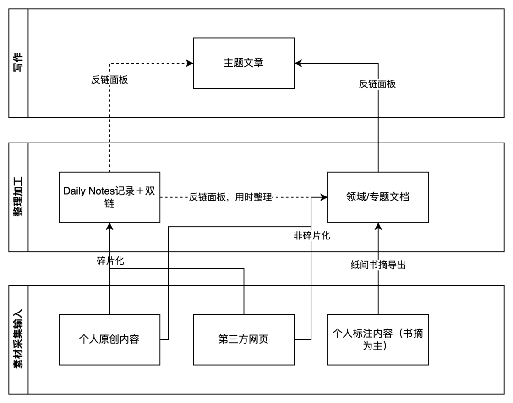

数据架构图​

我日常的信息输入主要分为个人原创内容、第三方网页和个人标注内容：

1.  个人原创内容：主要记录日常的想法、事实、感受、闲言碎语，也会用于快速收集一些周刊相关的素材。
2.  第三方网页：一些感兴趣或有相关的知识的网页。
3.  个人标注内容：主要是我日常使用 Kindle 读书的时候做的一些书摘标注，通过纸间书摘统一管理。

原始素材的采集输入，按照是否碎片化采用不同的记录方式，碎片内容（非体系化的文档）直接记录在当日的 DailyNotes 中，通过双链传递，日后使用的时候，在对应的领域/专题文档的反链面板即可看到，润色、修改、重新改写都可以快速处理。非碎片化内容直接记录在领域或专题的文档中。

写作过程中，直接新建主题文章的文档，在新文档中将大纲列好，之后通过反链面板和提及功能，将前期整理的素材、相关文档进行重组、合并、改写、润色。

### 应用架构图

应用架构图主要用于描述软件应用程序的结构和组件以及它们之间的相互关系，说明承载数据架构图中涉及信息流的工具和实体。

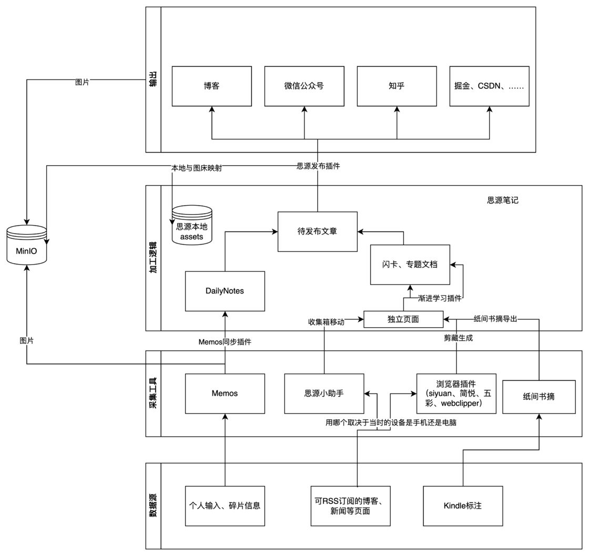

应用架构图​

首先对架构图中涉及到的工具简单介绍：

#### 思源笔记

思源笔记在本文（我目前的写作工具流）中，是一个承前启后的关键存在。类似于大数据架构中的数据仓库，存储原始的输入，基于双链进行各主题素材的笔记重组与合并，基于素材进行领域写作与润色加工，最终作为统一输出口对接各种发布平台。

#### 采集工具

**Memos：**Memos 是一个源端输入，主要用于收集个人原创素材，包含但不限于个人日记、感受、想法、事实、流水账等，使用 Memos 的原因是数据在自己手上，无需有隐私、安全方面的担心，有较大的自主权，不会被各种莫名其妙的原因触发删除。

通过 Memos，可以在网页、手机 app、TG 机器人、浏览器插件快速收集内容。

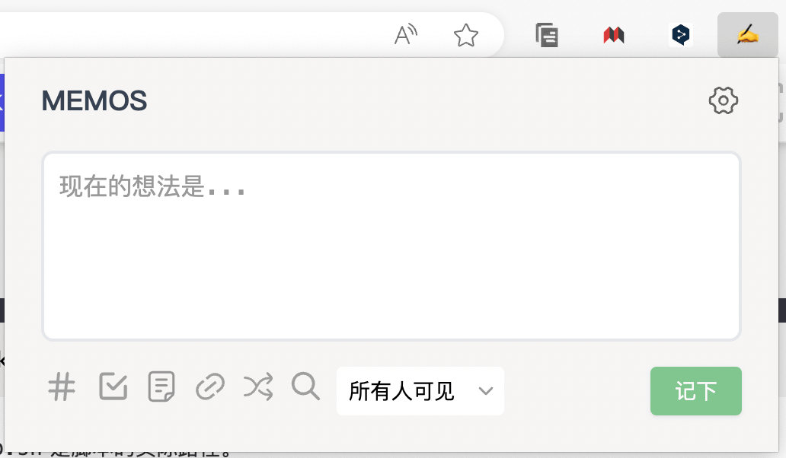

浏览器插件​

**思源小助手：**思源会员特性，可以在微信快速将数据收集至思源笔记的收集箱，后期可以快速的从收集箱移动至笔记本中。小助手最大的优势是可以微信内容一键转发，并且支持将接受到的网址进行剪藏，配合思源的「下载网络图片至本地功能」，可以在手机端方便的将网页内容剪藏至本地。

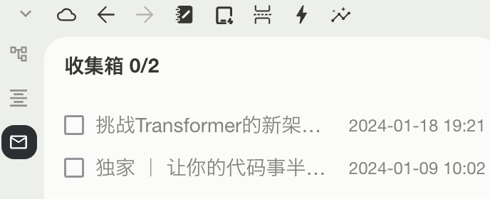

收集箱​


剪藏效果，微信公众号转存文章需要点击下载图片​

**浏览器插件：**这是一个集合，包括 Siyuan、WebClipper、五彩助手（思源已有同步插件）、剪悦等等，主要用于将网页剪藏，避免 404 风险。

**纸间书摘：**一个优秀的阅读管理软件，有一揽子阅读管理相关的功能，我主要用于管理 Kindle 阅读的标注，官方提供了导出至思源笔记的功能，导出的效果极优秀。

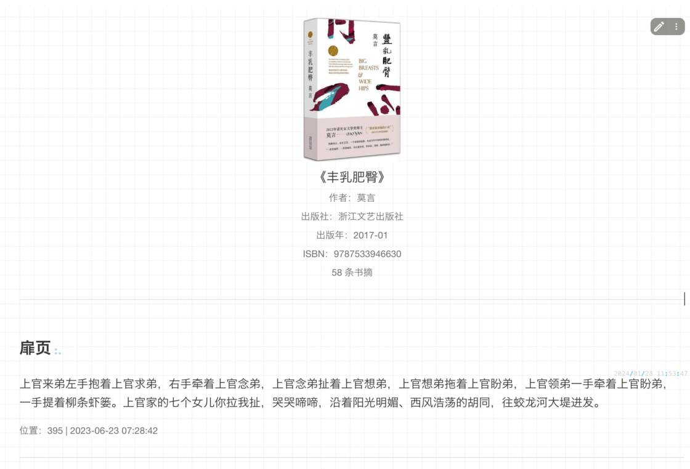

纸间导出至思源笔记效果图​

#### 存储工具

**MinIO：**MinIO 的作用是为发布平台提供图床，配合思源的发布插件可以实现一处写作，多处发布。MinIO 的搭建可参考我之前的博客[云远程对象存储 - MinIO 服务部署](https://sspai.com/link?target=https%3A%2F%2Fwww.xuezhao.space%2Ftech%2Fyunyuan-object-storageminio-service-deployment-z1d0saj-1.html)。

**思源 Assets：**思源笔记自带的存储功能，「本地优先」的保证，所有的插入的附件都会在 Assets 中保存一份。

#### 思源插件

**发布工具插件：**

思源的一款插件，可以快速将思源本地的文章统一分发到不同的平台，并且可以配合 PicGo 插件生成本地图片到图床的映射，实现「本地使用本地图片、发布使用图床」的理想搭配。

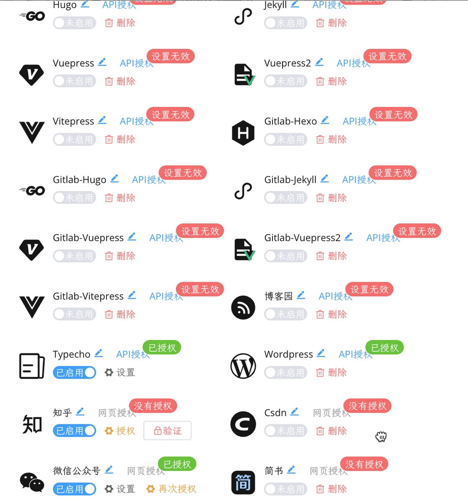

快速配置各种平台​

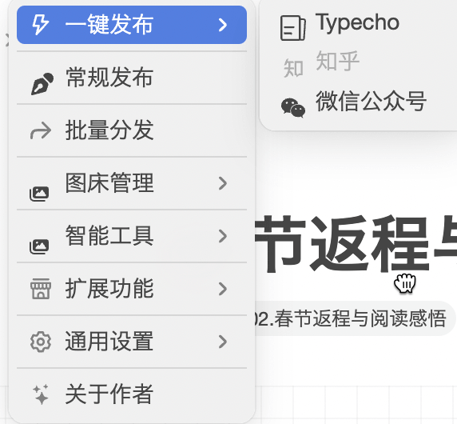

功能概览​


插件保留本地到云端的映射​

**PicGo 插件：**思源的一款插件，可以配置图床，与发布工具搭配使用体验极佳。

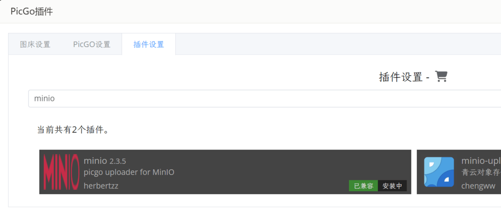

插件的插件搜索页面​

**Memos 同步插件：**Memos 同步插件是用于将自部署的 Memos 内容同步至思源笔记，它支持识别双链，通过打上 `(())` 的标识，可以实现关联已有的文档、新建不存在的文档。

最后，Typecho、知乎、语雀、微信公众号等可以作为最终对外提供输出服务的出口。

通过应用架构图和工具介绍，可以说明这套本地写作的**两个优点**：

-   所有的内容和数据都在本地，配合思源的快照功能和多端同步功能，可以有相当强的容灾能力，并且有端到端加密的同步数据，隐私也无需担心；
-   本地文章使用本地图片，发布使用图床图片，实现了一个理想的搭配。

-   多处编辑，分散发布，耗费相当大的精力，且维护困难，需要一处一处修改、订正；
-   一处编辑，同时发布，后期的修改也在原本的文档基础上进行多平台更新。

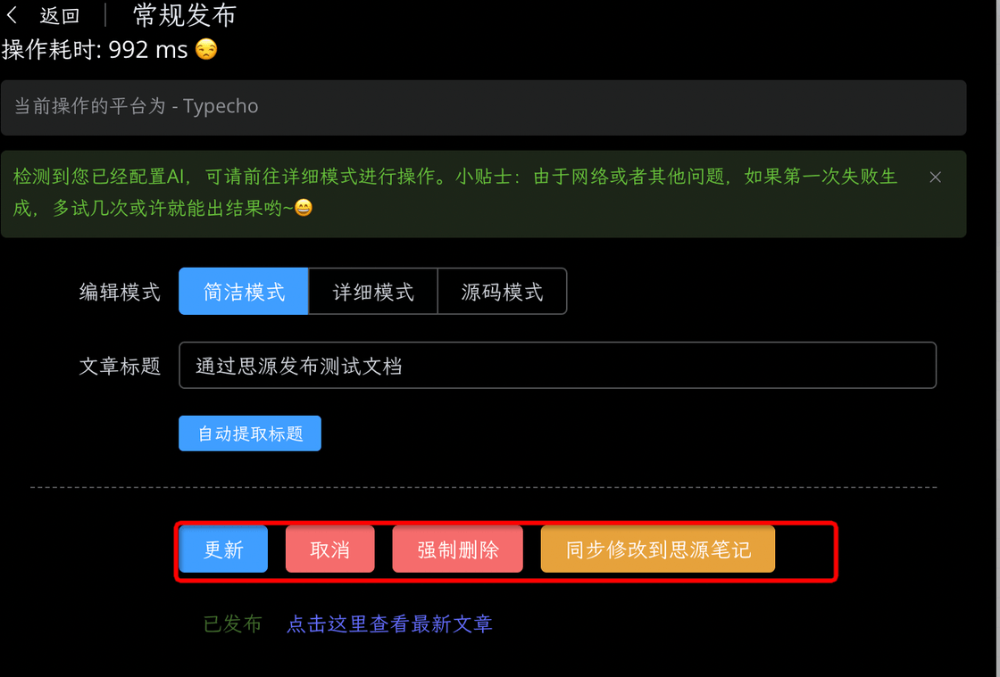

## 周刊的半自动化写作发布实践

周刊是我本年初立的一个 flag，与月总结相比，更注重生活的记录，包含小想法、感受、值得分享的学习内容、值得记录的生活趣事。在最初的写作过程中，我集中在周日花两个小时去回忆、书写本周周刊，但很快我就发现，有点煎熬。一是太考验记忆力了，需要慢慢回顾一周的事情，很容易遗忘。二是事后记录其实会遗忘当时的一些想法，失去了「记录」和分享本身，变成了总结。于是我基于思源笔记把这件事情拆解为两件事情：

-   日常周刊相关内容的收集
-   周日的重组、合并、改写、润色

### 收集、写作和分发流程

我采用 Memos 来进行周刊内容的收集，我会在有想法的瞬间通过手机应用、浏览器插件或者网页写下一小段内容，并且通过在开头增加 `((周刊))` 的标志来区分，这个标志可以在同步到思源的时候自动新建文档：周刊，然后将本段内容记录在当日的 DailyNotes 中，增加双链：

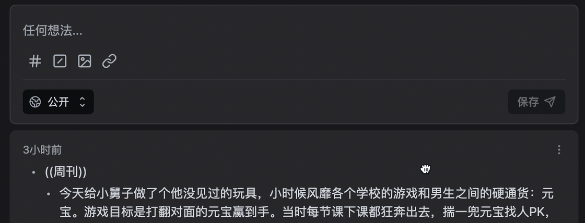

Memos 页面记录​

在每天晚上我会在思源内部（手机 app / PC 客户端 / Docker 版），点击 Memos 同步，最终获得以下效果：

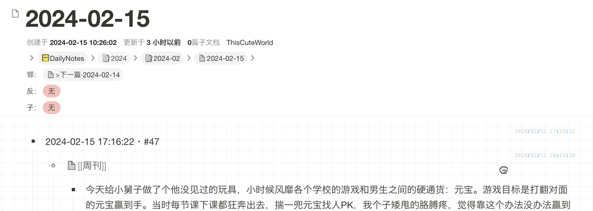

DailyNotes 页面

此时周刊页面中，反链面板可以看到所有的相关内容。通过思源的反链相关操作进行内容的组织和润色改写。我通常是复制过来直接更改，不必担心 DailyNotes 中留存双链文本的污染，下文的操作会解决这个问题。

Tips 1：可以在文档属性面板添加书签「写作中」，快速管理目前的写作文档；

Tips 2：通过添加以下代码为模板，可以快速插入下图中「2024-02 Week 7」的标题，摘抄自集市中的模板。

```code-block
.action{ $anchorSunday := "2022-12-25" }
.action{ $yearStartDate := now.Year | printf "%d-01-01" | toDate "2006-01-02" }
.action{ $ysDateDuration := div ($yearStartDate.Sub (toDate "2006-01-02" $anchorSunday)).Hours 24 }
.action{ $ysWeekDay := mod $ysDateDuration 7 }
.action{ $yearStartWeek := add (div (sub $ysDateDuration 1) 7) 1 }
.action{ if or (eq $ysWeekDay 0) (gt $ysWeekDay 4) }
    .action{ $yearStartWeek := add $yearStartWeek 1 }
.action{ end }

.action{ $nowWeek := add (div (div (now.Sub (toDate "2006-01-02" $anchorSunday)).Hours 24) 7) 1 }
.action{ $week := add (sub $nowWeek $yearStartWeek) 1 }

.action{$today:= (now | date "2006-01")}
.action{$weekResult:= (list $today "Week" $week| join " ")}


📅.action{$weekResult}
```

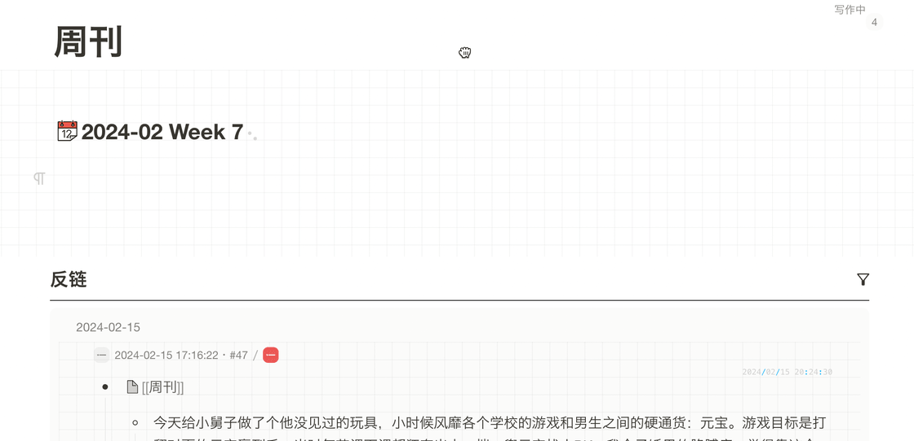

周刊文档页面及反链面板

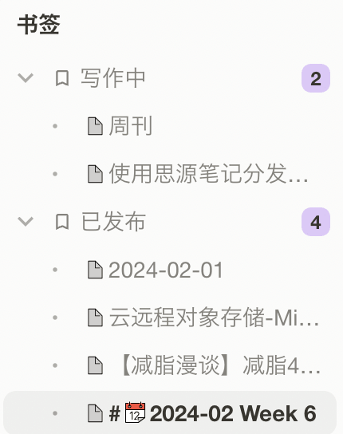

通过文档书签管理写作状态​

改写完成后，剪切第 3 步中生成的标题作为文档标题，通过发布插件进行发布。此时 DailyNotes 中留存的双链动态锚文本会自动变为更改后的标题，在新的一周的周刊收集时，又会生成新的《周刊》文档，此时的反链只会有与本周相关的内容，不受其他双链的污染。

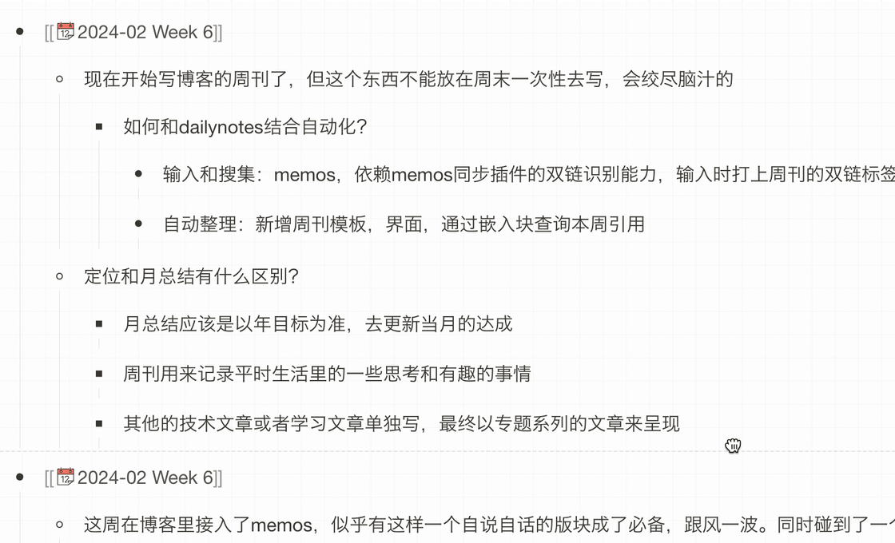

最终效果：[02.春节返程与阅读感悟 - XueZhao 的博客](https://sspai.com/link?target=https%3A%2F%2Fwww.xuezhao.space%2Flife%2Fweekly-02.html)

#### 附：参考文献

-   [思源笔记配置 Typecho 实现一键同步发布 - 墨竹 - 自留地 (mozhux.com)](https://sspai.com/link?target=https%3A%2F%2Fmozhux.com%2Fsi-yuan-bi-ji-fa-bu-gong-ju-pei-zhi-typechoshi-xian-yi-jian-tong-bu-fa-bu-z2ib4yq.html%2Fcomment-page-1%3FreplyTo%3D34%23respond-post-37)
-   [在思源笔记中实现渐进阅读 - 知乎 (zhihu.com)](https://sspai.com/link?target=https%3A%2F%2Fzhuanlan.zhihu.com%2Fp%2F665094700)
-   [双向链接时代的快速无压记录 (yuque.com)](https://sspai.com/link?target=https%3A%2F%2Fwww.yuque.com%2Fdeerain%2Fgannbs%2Fffqk2e)
