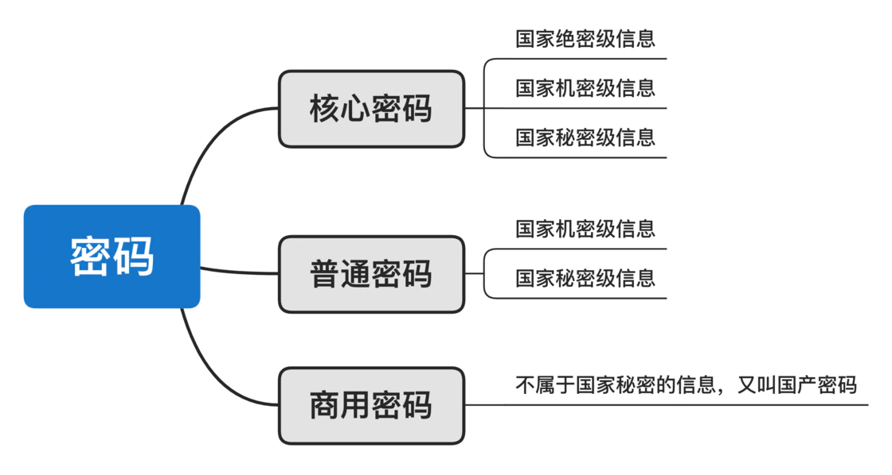
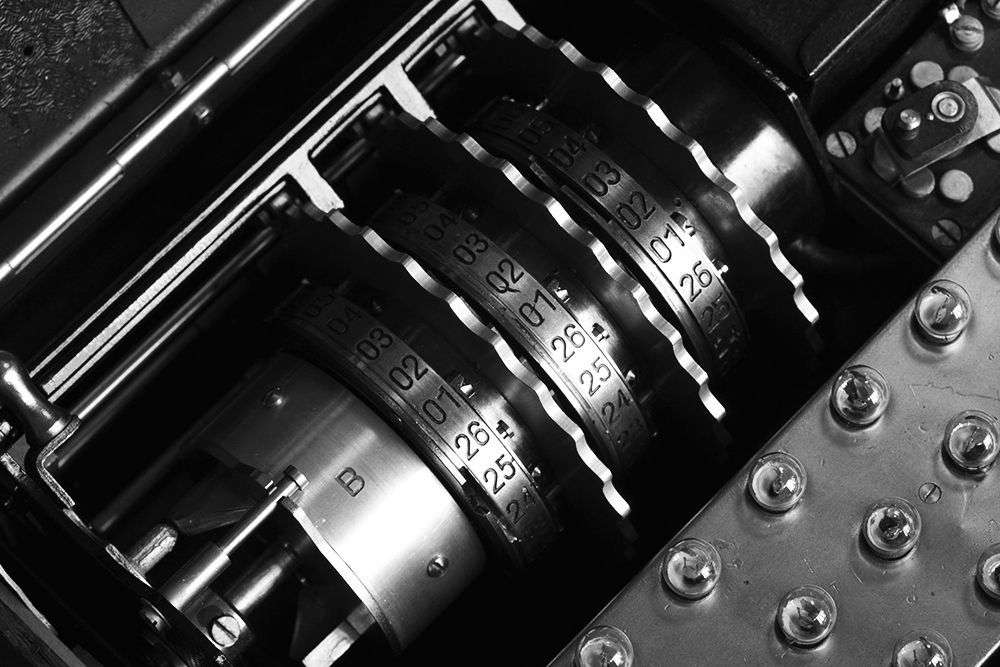
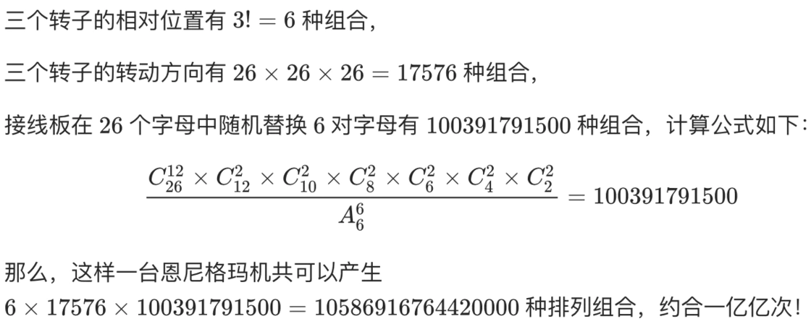
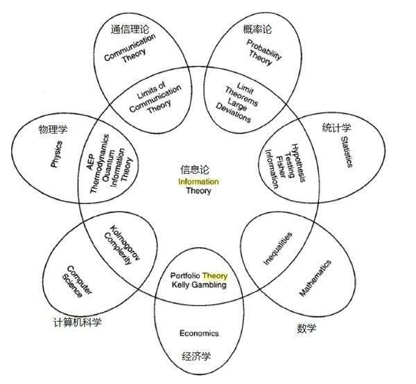
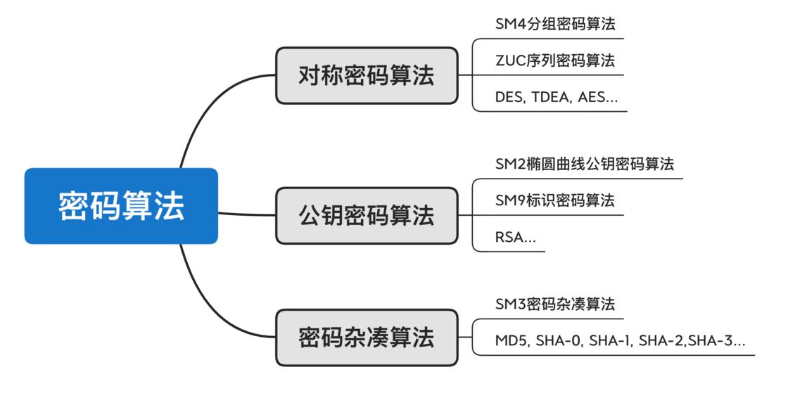
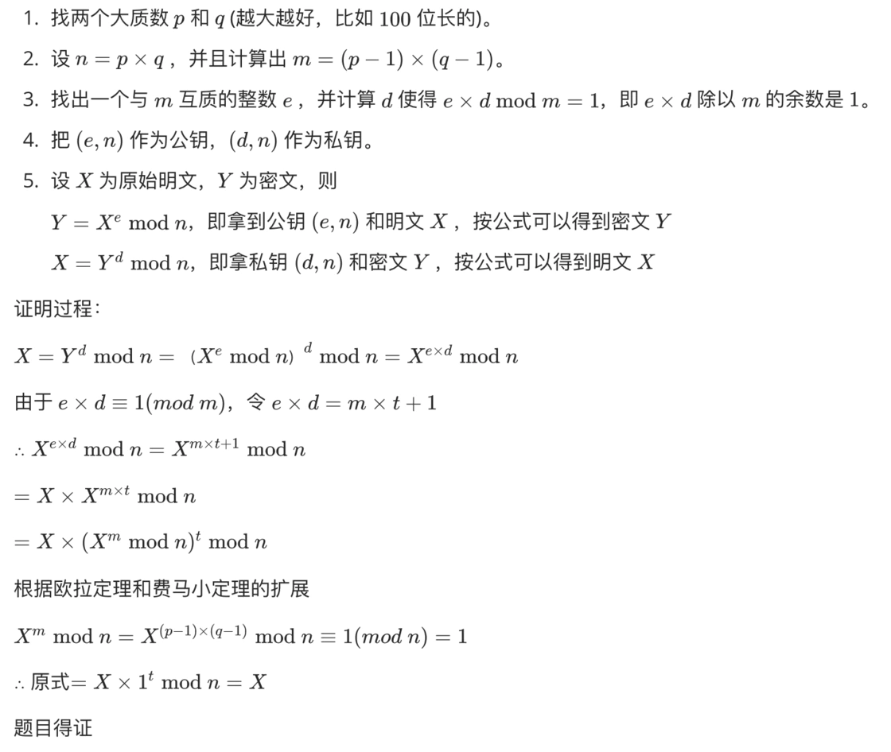
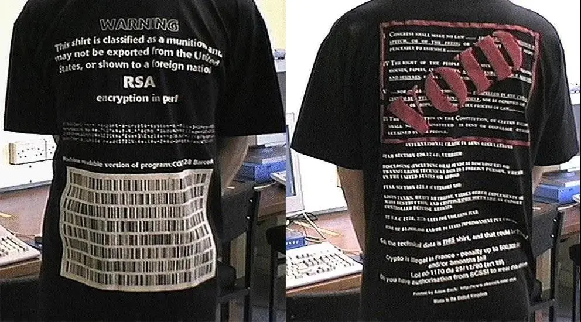

# 《密码法》颁布一周年，对于「密码」你了解多少？ - 少数派

- - -

就在刚过去不久的 2020 年 10 月 26 日，全国不同地区的密码管理局都给民众发了宣传短信，让更多人知道这一天也是《中华人民共和国密码法》颁布的一周年。

> 【广东省密码管理局】2020 年 10 月 26 日，《中华人民共和国密码法》颁布一周年。密码是保障网络和信息安全的核心技术和基础支撑，关系到国家安全、国计民生和社会公共利益。学习密码法，掌握密码基础知识，用密码维护国家安全和人民群众利益保护个人合法权益。

> 【陕西省密码管理局】贯彻落实密码法，树立总体国家安全观，提高密码应用意识，营造尊法、学法、守法、用法的浓厚氛围，是政府和全社会的共同责任。

最近刚好学了一些“商用密码安全评估”的专业知识，就赶着热点话题顺便写个知识总结叭。

《中华人民共和国密码法》于 2020 年 1 月 1 日起正式实行，密码正式纳入法律监管框架。在密码法的条文中，将密码分为 **“核心密码”、“普通密码”和“商用密码”**。

核心密码、普通密码用于保护国家秘密信息，属于国家秘密，核心密码保护信息的最高密级为绝密级，普通密码保护信息的最高密级为机密级。商用密码用于保护不属于国家秘密的信息。我们日常生活中用到的大部分密码都是商用密码，并且公民、法人和其他组织都需要依法使用商用密码保护网络与信息安全。

我们平时输入的取款密码、网站的登录密码，实际上并不是密码法中规定的“密码”。准确来讲，这些“密码”应该称为“口令”，只是一种最简单、最初级的认证方式。而真正的“密码”，藏在安全支付设备中、藏在网络系统内，默默守护国家秘密信息安全、守护我们每个人的信息安全。密码应用早已渗透到了社会生产生活的方方面面。

本文主要讲述密码学的以下四项内容：

-   **密码发展史**
-   **密码算法**
-   **密码产品**
-   **密码标准规范**

## 一、密码发展史

密码学是一门古老而年轻的学科，她一直在窃密与反窃密、保密与破译的攻防对抗中不断演变，完善自我。密码的形态主要经历了**古典密码、机械密码、现代密码**三个阶段，未来还有可能出现正处在研究阶段的**量子密码**。

### **1、古典密码**

古典密码是密码学的源头，这一时期的密码是一种艺术，还不能叫科学。

古典密码分为代换密码和置换密码：代换密码采用一个代换表做密钥，将一段明文转换为密文就叫单表代换，采用多个代换表做密钥就叫多表代换；置换密码是一种特殊的代换密码，不改变明文字母，只改变他们的位置。

举个典型的代换密码例子：凯撒密码。

“凯撒密码”就是罗马帝国的凯撒大帝为了战争通信专门发明的密码，原理非常简单：假定密钥 k = (1,11)，代表明文中字母 a 会变为 l，b 会变为 m，明文消息为 "i am nine"，N = 26。明文加密的过程如下表所示：

|     |     |
| --- | --- |
| 明文  | i am nine |
| 对应数字 | 8，0，12，13，8，13，4 |
| 模加数字 | 11，11，11，11，11，11，11 |
| 模加结果 | 19，11，23，24，19，24，15 |
| 密文  | t lx ytyp |

现在市面上还有卖凯撒密码的玩具。

凯撒密钥的密钥取值范围只有 25，学过信息论的人都知道，只要多截获一些密文，很容易被穷举破译。为了加强密码强度，多表代换出现了，典型的例子是“维吉尼亚密码”，原理也很简单：明文信息为 "i am nine i feel very good"，代换表数目 d = 6，密钥 k = (2,8,15,7,4,17)。加密过程如下表：

|     |     |
| --- | --- |
| 明文  | i am nine i feel very good |
| 对应数字 | 8，0，12，13，8，13，4，8，5，4，4，11，21，4，17，24，6，14，14，3 |
| 模加数字 | 2,8,15,7,4,17,2,8,15,7,4,17,2,8,15,7,4,17,2,8 |
| 模加结果 | 10,8,1,20,12,4,6,16,20,11,8,2,23,12,6,5,10,5,16,11 |
| 密文  | k ib umeg q ulic xmgf kfql |

古典密码其实还是古时候的手工作业方式，早已被很容易地破解掉了，古典密码都是不安全的。

### **2、机械密码**

出现机械和电动设备后，加密解密过程开始用机械设备自动化进行，这时候的密码就叫做机械密码，最典型的就是恩尼格玛密码机。

“恩尼格码”（Enigma，谜）密码机是二战时期的纳粹德国及其盟国，特别是德国军方所使用的一种高级机械加密系统。我很喜爱的演员康伯巴奇（饰演艾伦图灵）主演的电影《模仿游戏》里，就讲述了二战期间艾伦・图灵破解德军恩尼格玛机的精彩故事。当时看完非常震撼，知乎了一晚上原理到底是什么，这次有机会就总结一下自己粗浅的理解～

恩尼格玛密码机的设置包含了以下几个部分：

**转子：**转子的结构及顺序。（初始有三个转子，慢转子、中转子和快转子，每个转子上有 26 个数字对应 26 个字母。后期发展为从六个转子中选三个或四个转子）

**起始位置：**由操作员决定，发送每条消息时都不一样。

**接线板：**在键盘和第一个转子之间用接线板的连线将输入的字母进行替换（26 个字母中选取 12 个字母两两配对，完成字母转换，增加复杂度。后期变为 20 个字母两两配对）

当按下键盘上的一个字母键，字母通过接线板替换成另一个字母，再经过三个转子的三次替换，最后加密后的字母在显示器上通过灯泡闪亮来显示，而转子就自动地转动一个字母的位置。

> 举例来说，当第一次键入 A，灯泡 B 亮，转子转动一格，各字母所对应的密码就改变了。第二次再键入 A 时，它所对应的字母就可能变成了 C；同样地，第三次键入 A 时，又可能是灯泡 D 亮了。

—— 这就是“恩尼格玛”难以被破译的关键所在，这不是一种简单替换密码。同一个字母在明文的不同位置时，可以被不同的字母替换，而密文中不同位置的同一个字母，又可以代表明文中的不同字母，字母频率分析法在这里丝毫无用武之地了。这种加密方式在密码学上被称为“复式替换密码”。

加密时，加密者要在机器下方的键盘上按出明文，每当按下一个字母，键盘上方背光字母盘上的一个字母就会亮起来，这就是机器所生成的密码。我们便可以根据按顺序亮起的字母，记录下一串与明文长度相等的密码，这就是密文。

解密时，加密者将他所使用的**转子组合（及其安装位置）和每个转子的起始位置以及接线板的接线方式**事先告知接收者，接收者必须拥有一台与加密者完全相同的恩尼格码密码机。一旦按照规定的配置设置好后，接收者只需将密文通过键盘输入密码机，明文会在背光字母盘上亮起，解密就完成了。

让我们来算算一台拥有三个转子、每个转子 26 个数字、接线板随机替换 6 对字母的恩尼格玛机将会产生多少种密钥的组合：

利用这个漏洞，破译者可以先尝试猜测一个可能会出现在密码中的词语或短语，比如德语“Heil Hitler”，然后把这个词语放在密文中任意的位置上，与整段密码进行比对，如果发现有重合的字母，那就说明该词语与当前的位置不匹配，一旦找到了一个没有重复字母的位置，那么很有可能那段密码所对应的明文正是“Heil Hitler”。

在确定了至少一组正确的对应字母的前提下，破译者便可以通过假设和推理的方法猜测出一些可能的接线板上的字母配对。由于接线板上的一条接线会将两个字母绑定在一起，因此，如果我们猜测 A 接 B，而由此却推导出了 C 接 A 的话，那么 A 接 B 的方案就是错的，而且由 A 接 B 所推导出来的一切可能的方案也全部都是错的。当接线板上一个字母与所有其它字母的配对都被否决后，就说明问题出在转子上。这时，破译者要么更换转子，要么变动转子的位置，要么设定新的转子起始位置，再继续排查下去。这就是破译恩尼格玛机的通用方法。

由于人力操作需要耗费大量的时间，英国数学家艾伦・图灵专门设计制造了一台“炸弹机”（Bombe），通过电子技术，运用上述的排除法来破译“恩尼格玛”机，最快的一次仅用了大约 20 分钟，基本达到了实时破译，这就是电影《模仿游戏》里讲的破译过程。

本文的封面图就是恩尼格玛机的简笔画～

### **3、现代密码**

“信息论之父”香农关于保密通信理论的发表和美国数据加密标准 DES 的公布，以及公钥密码思想的提出，标志着密码进入了现代密码时期。密码技术逐渐建立起完善的理论基础，成为一门现代意义上的学科。随着计算机行业的迅猛发展，信息的机密性、数据的完整性、信息来源的真实性和行为的不可否认性等需求急剧增加，而这些需求都需要依赖密码技术的防泄密、防篡改、仿假冒和防抵赖等特点来实现。

1940s，香农连续发表了《保密系统的通信理论》和《通信的数学理论》两篇划时代的论文，提出了理想密码模型“一次一密”理论，最安全的密码是 1 比特密钥保护 1 比特明文，然而现实中真正无限长随机密钥很难找到，序列密码就出现了，它可以用“短的种子密钥生成周期很长的随机密钥序列”，即输入较少比特的初始密钥，借助数学公式产生周期很长的密钥，再用这些密钥和明文逐比特进行异或得到密文，近似的可以达成”一次一密“。

1970s，IBM 设计出 DES 算法，这是一种分组密码，密钥长度为 56 比特，密钥量可以达到 2^56 种，这个数量已经高于了恩尼格玛机的密钥数量，操作还远比恩尼格玛机便捷，密文统计规律更加随机。1998 年 DES 算法被一台 25 万美元的计算机在 56 个小时内破译，从此不再使用。

1990s，AES 算法产生，密钥长度最长可达 256 比特，，即 2^256 种，目前还未被破译。

随着互联网的发展，两两用户都需要密钥的话，n 个用户需要 n (n-1)/2 对密钥，密钥量太大，公钥密码思想随之产生：加密密钥公开，解密密钥保密，n 个用户只需要 n 对密钥。基于大整数因子的 RSA 算法是目前比较常用的公钥加密算法和签名方案（密码算法章节会详细介绍此算法）。随着计算机算力的增强，2003 年，RSA-576 被成功分解（密钥长度为 576 个比特）；2005 年，RSA-640 被成功分解；2009 年，RSA-768 被成功分解。目前，RSA-2048 可以使用，听说还有人悬赏 20 万美元来分解这个 2048 位的巨型整数。

现代密码学还有各种各样的密码算法，我们在密码算法章节介绍。

### **4、量子密码**

过去，密码分析家们一直都在寻找一个分解因数的捷径，希望用理论性革新密码学。但因数分解的研究已经持续了好几个世纪，进展并不大，所以也有不少分析家在寻求技术性的革新，一种可以更快执行密码分析的技术 —— 量子计算机。这就是「一力降十会」式的降维打击，因为量子计算机的计算速度使得现代超级计算机像一把老旧的算盘，它可以通过算力的突飞猛进破解所有艰涩的密码，会将大整数因子分解变成易如反掌的事。

量子计算中的 Shor 算法可以在多项式时间内求解大整数因子分解和离散对数问题，给经典的 RSA 算法和 ElGamal 算法这些基于大整数因子分解或离散对数的公钥算法带来了致命影响。现在量子计算机的设计理论已经经过验证，出现只取决于技术的进步。因此，各个国家的密码管理局都在启动抗量子攻击的密码算法研究工作。 

每个国家管理密码的组织也并不相同。美国是的密码学中心；英国负责这部分事务的是 GCHQ（政府通信总部），俄罗斯则是前身为 FAPSI 的联邦专用通信和信息服务警卫局，法国负责这部分的是 ANSSI（法国国家网络安全局），中国负责管理密码的就是密码管理局了。虽然每个管理机构的名称和职责范围有不同，但他们确实都有管理密码的责任。

我国密码管理局公示过资助量子密钥研究的信息，量子密码还是密码科学技术国家重点实验室的研究方向，在各个学术分享和密码论坛上它也从不缺席。美国国家安全局在官网上展示了国家对量子密码的网络安全观点，法国也公开宣称其计划在 2022 年前部署第一个量子密钥分发解决方案。虽然量子密码离我们普通人的生活还非常遥远，但在国家密码管理局这样的密码研究机构中，它已经是非常重要的研究方向了。

## **二、密码算法**

常见的密码算法包括**对称密码算法、公钥密码算法和密码杂凑算法**三个类别。

### **1、对称密码算法**

对称算法简单说就是加密的人用一把钥匙锁上箱子，解密的人要用同一把钥匙才能打开这个箱子。对称算法分为序列密码和分组密码。

序列密码（我国发布有 ZUC 祖冲之序列密码算法）的特点在于密钥流可以在明文序列到来之前生成。序列密码对每个明文序列的加密操作仅仅是一次异或，因此序列密码的执行速度通常很快，对计算资源的占用也较少，常用于功耗或者计算能力受限的系统中，比如嵌入式系统、移动终端等，或者一些实时性要求高的场景，比如语音通信、视频通话等。

分组密码（我国发布的 SM4 分组密码算法），明文分组经过迭代加密函数变换后的输出又称为下一轮迭代加密函数的输入，每一轮迭代的函数是相同的，不同的是输入的轮密钥。解密时只需要把加密过程中产生的轮密钥逆序排列就能从密文分组中恢复出明文分组。

> 序列密码与分组密码的对比`分组密码以一定大小作为每次处理的基本单元，而序列密码则是以一个元素（一个字母或一个比特）作为基本的处理单元。                                                     序列密码是一个随时间变化的加密变换，具有转换速度快、低错误传播的优点，硬件实现电路更简单；其缺点是：低扩散（意味着混乱不够）、插入及修改的不敏感性。                    分组密码使用的是一个不随时间变化的固定变换，具有扩散性好、插入敏感等优点；其缺点是：加解密处理速度慢、存在错误传播。`

### **2、公钥密码算法**

公钥密码算法又叫非对称密码算法，简单说就是加密的人用一把锁将箱子锁上，这个锁大家都可以拥有，但是解密的人必须用钥匙才能打开，也就是加密的人自己也打不开箱子，只有拥有钥匙的人才能打开箱子。大家都能获取到的这个锁就叫公钥，只有自己有的钥匙就叫私钥。

下面就以原理比较简单的 RSA 算法为例，讲解一下公钥密码算法的原理。密码学和数论密切相关，需要一些数学理论的定理、公式的基础。

前面讲到的基于大整数因子分解的 RSA 算法过程步骤如下：

这里面有一些数论的基础知识：  
1、费马小定理：如果 p 是一个质数，而整数 a 不是 p 的倍数，则有

2、费马小定理其实是欧拉定理的一个特殊情况，下面是欧拉定理的公式：

3、有关求余 mod 的公式

上面就是 RSA 算法的数学证明过程。RSA 是美国发布的，也是迄今为止适用范围最广的公钥算法，各国对密码算法严格限制出口，它曾在美国禁止出口名单中，印有几行 RSA 密码的 T 恤也曾在禁出口名单中，美国人在 T 恤背面印上宪法条文对此进行抗议。

> 我国发布的 SM2 椭圆曲线公钥密码算法是基于椭圆曲线离散对数来得到公钥和私钥的，与 RSA 算法相比，SM2 算法有以下优势：
> 
> `安全性高。256比特的SM2算法密码强度已经超过了RSA-2048，与RSA-3072相当。因为基于椭圆曲线上离散对数问题的苦难性要高于一般乘法群上的离散对数问题。`
> 
> `密钥短。SM2-256密钥长度为256比特，RSA-2048为2048位。因为椭圆曲线基于域的运算位数要小于传统离散对数。`
> 
> `私钥产生简单。RSA私钥产生时需要用到两个随机产生的大素数，除了需要保证随机性以外，还需要用到素数判定算法，产生过程复杂且较缓慢；而SM2私钥的产生只需要生成一个一定范围内的256比特的随机数即可，因此产生过程简单，存在的安全风险也相对较少。`
> 
> `签名速度快。同等安全强度下，SM2算法在用私钥签名时，速度远超RSA算法。`

### **3、密码杂凑算法**

密码杂凑算法又称作”散列算法“或”哈希算法“。杂凑算法将很长的消息通过压缩函数压缩到一个固定的比特长度。杂凑函数是单向的，从明文输入到计算得到密文杂凑值很简单，但是从杂凑值推出明文是非常困难的。我国发布的杂凑算法是 SM3 算法。

## **三、密码产品**

说了这么多密码发展史和密码算法，我们日常生活中到底什么叫做商用密码产品呢？举一些典型的例子吧。

### **1、智能 IC 卡**

我们的各种银行卡、二代身份证、图书卡门禁卡饭卡等校园卡，公交卡医保卡社保卡等等。

### **2、智能密码钥匙**

我们一般用的 USB Token 和 USB Key，专门保护用户私钥、数字证书的载体。

> 智能 IC 卡和智能密码钥匙的关系`相同之处：处理器芯片、标准和指令格式基本是相同的。                                不同之处：智能IC卡主要作用是对卡中的文件提供访问控制功能，与读卡器进行交互；智能密码钥匙作为私钥和数字证书的载体，向具体的应用提供密码运算功能。`

### **3、密码机**

密码机以整机形态出现，与一般的服务器、工控机等类似，可以部署在通用的机架中，实现数据加解密、签名 / 验证、密钥管理、随机数生成等功能。目前国内的密码机有通用的服务器密码机，应用于证书认证领域的签名验签服务器和应用于金融行业的金融数据密码机。

### **4、VPN**

我们常用的 VPN 就是使用密码技术在互联网中构建临时的安全通道的技术。VPN 之所以叫虚拟网，主要是因为 VPN 中任意两个节点间的连接并没有使用传统专网所需的端到端的物理链路，而是在公用网络服务商提供的网络平台上形成逻辑网络，用户数据在逻辑链路中进行传输，实现物理分散、逻辑一体的目的。主流的 VPN 产品包括 IPSec VPN 网关（工作在网络层）和 SSL VPN 网关（工作在应用层和传输层之间）。

### **5、电子签章**

电子签章系统应用于电子公文、电子合同、电子证照、电子票据等诸多领域。电子签章将传统印章与电子签名技术进行结合，让电子文档中的电子签章具有了传统印章一样的功能，密码处理过程包括电子印章的生成，电子签章的生成，电子印章验证和电子签章验证四部分。

> 电子签章和电子印章的关系：
> 
> `电子印章对应与传统印章，具体形态上，电子印章是一种由制作者签名的包括持有者信息和图形化内容的数据，可用于签署电子文件。电子签章是一种由制作者签名的包括持有者信息和图形化内容的数据，可用于签署电子文件。电子签章指使用电子印章签署电子文件的过程，电子签章过程产生的**包含电子印章信息**和签名信息的数据称为电子签章数据。`

### **6、动态口令**

Web 系统登陆，金融支付（U 盾）等场景，还有就是我们经常使用的短信验证码啦。

## 四、密码标准规范

商用密码安全评估时，主要从**技术要求、管理要求、密钥管理**三大块内容来做具体评估细则。下面是一些与商用密码评估相关的法律法规和标准规范，可以参考学习。

`《商用密码管理条例》`

`《信息系统密码应用基本要求》（GM/T 0054-2018）国标已进入报批稿阶段`

`《信息系统密码测评要求》（试行）`

`《商用密码应用安全性评估测评过程指南》（试行）`

`《商用密码应用安全性评估测评作业指导书》（试行）`

`《政务信息系统密码应用与安全性评估工作指南》`

`通过评审的《密码应用方案》`

`密码行业相关标准（GM/T系列标准）`
